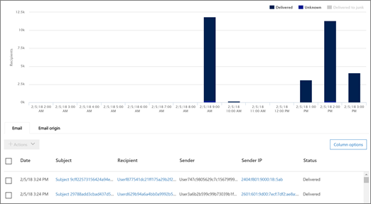
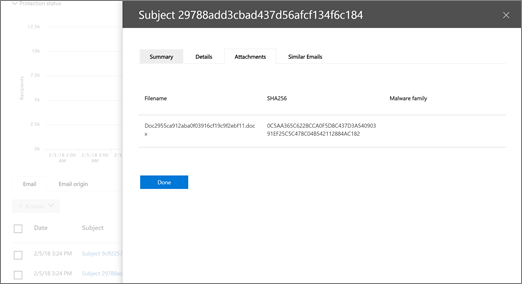

# Поиск и исследование вредоносных сообщений электронной почты, которые были доставлены в Office 365

[Office 365 Advanced Threat protection](office-365-atp.md) позволяет исследовать действия, которые могут привести к риску и предпринимать меры для защиты Организации. Например, если вы являетесь участником группы безопасности Организации, вы можете найти и изучить подозрительные сообщения электронной почты, которые были доставлены вашим пользователям. Это можно сделать с помощью [обозревателя угроз (или обнаружения в режиме реального времени)](threat-explorer.md).
  
## Перед началом работы...

Убедитесь, что выполняются следующие требования:
  
- Для организации назначены [Дополнительные возможности защиты от угроз для Office 365](office-365-atp.md) и [лицензии для пользователей](https://docs.microsoft.com/en-us/office365/admin/subscriptions-and-billing/assign-licenses-to-users).
    
- [Ведение журнала аудита Office 365](turn-audit-log-search-on-or-off.md) включено для вашей организации. 
    
- В организации определены политики для защиты от нежелательной почты, защиты от вредоносных программ, защиты от фишинга и т. д. Обратитесь [к разделу защита от угроз в Office 365](protect-against-threats.md).
    
- Вы являетесь глобальным администратором Office 365 или администратором безопасности или ролью поиска и очистки, назначенными в центре безопасности &amp; и соответствия требованиям. Ознакомьтесь с разрешениями [в центре &amp; безопасности и соответствия требованиям Office 365](permissions-in-the-security-and-compliance-center.md).
    
## Работа с подозрительными сообщениями электронной почты

Вредоносные злоумышленники могут отправлять сообщения пользователям, чтобы использовать их учетные данные и получать доступ к корпоративным секретам. Чтобы избежать этого, следует использовать службы защиты от угроз в Office 365, включая [Exchange Online Protection](eop/exchange-online-protection-overview.md) и [Advanced Threat protection](office-365-atp.md). Однако бывают случаи, когда злоумышленнику удается отправить почту пользователям с URL-адресом и только позже сделать так, чтобы URL-адрес ссылался на вредоносный контент (вредоносные программы и т. д.). 

Кроме того, вы можете повлиять на то, что пользователь в вашей организации будет скомпрометирован, а в течение этого пользователя злоумышленник использовал эту учетную запись для отправки электронной почты другим пользователям в вашей компании. В процессе очистки обоих сценариев может потребоваться удалить сообщения электронной почты из папки "Входящие" пользователя. В подобных случаях для поиска и удаления этих сообщений электронной почты можно использовать [Обозреватель угроз (или обнаружение в режиме реального времени)](threat-explorer.md) !

## Расположение перенаправляемых сообщений электронной почты после выполнения действий

Так что при возникновении проблем с электронной почтой и средства, которые помогают обучению, понимают, что случилось? В обозревателе угроз отображаются сведения, которые помогут администраторам декодировать проблемные события электронной почты.

### Просмотр заголовков сообщений электронной почты и Загрузка текста сообщения

**Предварительный просмотр заголовка сообщения и Загрузка текста сообщения электронной** почты полезны в обозревателе угроз. Администраторы смогут проанализировать и скачать заголовки и электронные сообщения для угроз. Доступ к использованию этой функции контролируется с помощью управления доступом на основе ролей (RBAC), чтобы снизить риск раскрытия содержимого электронной почты пользователя.

Новую *роль*, которую называют "Preview", необходимо добавить в другую группу ролей Office 365 (например, в секунду), чтобы предоставить возможность загружать сообщения и предварительные заголовки в представлении все сообщения электронной почты.

Чтобы просмотреть всплывающее окно с параметрами скачивания электронной почты и предварительного просмотра заголовков электронной почты, выполните следующие действия: 

1. Перейдите к [https://protection.office.com](https://protection.office.com) рабочей или учебной учетной записи Office 365 и войдите в нее с помощью рабочей или учебной учетной записи. Откроется центр соответствия требованиям безопасности &amp; . 
    
2. В области навигации слева выберите Обозреватель **управления** \> **** угрозами.

3. Щелкните тему в таблице "Обозреватель угроз".

Откроется всплывающее окно, в котором размещаются ссылки на предварительный просмотр заголовка и ссылки для скачивания электронной почты.

> [!IMPORTANT]
> Используйте обе таблицы, которые следуют вместе. Один из них указывает, что необходимо указать RBAC, а другое — местоположение, где должны предоставляться права.

|Действие  |RoleGroup RBAC с доступом |Требуется роль "Предварительная версия"?  |
|---------|---------|---------|
|Использование обозревателя угроз (и обнаружения в реальном времени) для анализа угроз     |  Глобальный администратор Office 365,  Администратор безопасности,   Средство чтения безопасности      | Нет   |
|Использование обозревателя угроз (и обнаружения в реальном времени) для просмотра заголовков сообщений электронной почты, а также предварительный просмотр и скачивание сообщений, помещенных в карантин    |     Глобальный администратор Office 365,   Администратор безопасности,  Средство чтения безопасности    |       Нет  |
|Использование обозревателя угроз для просмотра заголовков и загрузки сообщений, доставленных в почтовые ящики     |      Глобальный администратор Office 365,  Администратор безопасности,  Средство чтения безопасности,   Предварительная версия    |   Да      |

 

|RoleGroup RBAC  |Кому назначены пользователи  |
|---------|---------|
| Глобальный администратор   | Центр администрирования Office 365        |
| Администратор безопасности      |    Центр безопасности и соответствия требованиям     |
| Средство чтения безопасности   |    Центр безопасности и соответствия требованиям     |
|      |    Центр безопасности и соответствия требованиям     |

> [!CAUTION]
> Помните, что "Preview" — это роль, а не RoleGroup, и эта роль должна быть добавлена в RoleGroup позже.

### Проверка действия и расположения доставки

В проводнике по угрозам в режиме реального времени добавлены поля "действие доставки" и "место доставки" на месте состояния доставки. Это приводит к более полному изображению места для хранения электронной почты. Часть цели этого изменения заключается в том, чтобы упростить поиск в ходе проведения операций по обеспечению безопасности для пользователей, но в итоге лучше знать расположение проблемных сообщений с первого взгляда.

Состояние доставки теперь разбивается на два столбца:

- **Действие доставки** — Каков статус этого сообщения?
- **Место доставки** — где было отправлено это сообщение электронной почты в результате?

Действие доставки — это действие, выполняемое по электронной почте из-за существующих политик или обнаружений. Возможные действия, которые может выполнить электронная почта:

- **Доставлено** — электронная почта доставляется в папку "Входящие" или в папку пользователя, и пользователь может напрямую получить к ней доступ.
- **** Нежелательная — электронная почта была отправлена в папку "спам" или "Удаленная" пользователя, а пользователь имеет доступ к сообщениям электронной почты в папке "Нежелательная" или "Удаленная".
- **Заблокировано** — все сообщения электронной почты, которые не были помещены в карантин, не выполнены или были удалены. Она полностью недоступна пользователю!
- **Заменено** — любое сообщение электронной почты, где файлы с расширением. txt заменяются на файлы. txt, которые имеют нежелательные вложения.
 
В местоположении доставки отображаются результаты политик и обнаружений, которые запускают после доставки. Он связан с действием доставки. Это поле было добавлено для получения подробных сведений о действиях, выполняемых при обнаружении проблемных сообщений. Ниже приведены возможные значения расположения доставки.

- **Папка "Входящие" или "папка"** — электронная почта находится в папке "Входящие" или в папке (в соответствии с правилами электронной почты).
- **Локальная или внешняя** организация — почтовый ящик не существует в облаке, но является локальным.
- **Папка "спам** " — адрес электронной почты в папке "Нежелательная почта" пользователя.
- **Папка "Удаленные** " — сообщение электронной почты в папке "Удаленные" пользователя.
- **Карантин** — сообщение электронной почты в карантине и не находится в почтовом ящике пользователя.
- **Сбой** — почтовому ящику не удалось подключиться к почтовому ящику.
- **Удалено** — электронная почта теряется в Mailflow.

### Просмотр временной шкалы электронной почты
  
 **Временная шкала электронной почты** другое поле в обозревателе угроз также будет Аке Поиск администраторов. Вместо того чтобы потратили ценные сведения о том, где сообщение может быть продолжено, когда при исследовании события, при возникновении события, при одновременном выполнении или одновременном выполнении нескольких событий, эти события будут отображаться в представлении временной шкалы. Некоторые события, которые происходят после доставки в почту, будут записываться в столбце "*специальное действие*". Объединение сведений из временной шкалы электронной почты с особым действием, выполняемым при последующей доставке почты, дает администраторам подробные сведения о политиках и управлении угрозами (например, о том, где была выполнена маршрутизация почты), а в некоторых случаях — в качестве конечной оценки.

## Поиск и удаление подозрительных сообщений электронной почты, которые были доставлены

> [!TIP]
> Обозреватель угроз (иногда называется проводником) — это мощный отчет, который может обслуживать несколько целей, таких как поиск и удаление сообщений, определение IP-адреса вредоносного почтового отправителя или начало инцидента для дальнейшего исследования. Следующая процедура нацелена на использование проводника для поиска и удаления вредоносных сообщений электронной почты из почтовых ящиков получателей.

Чтобы просмотреть изменения предыдущего поля состояние доставки (теперь действие доставки и место доставки), выполните указанные ниже действия. 

1. Перейдите к [https://protection.office.com](https://protection.office.com) рабочей или учебной учетной записи Office 365 и войдите в нее с помощью рабочей или учебной учетной записи. Откроется центр соответствия требованиям безопасности &amp; . 
    
2. В области навигации слева выберите Обозреватель **управления** \> **** угрозами.

На этом рисунке можно заметить новый столбец "особые действия". Эта функция предназначена для того, чтобы сообщать администраторам о результатах обработки электронной почты. Специальные действия могут быть обновлены в конце *временной шкалы электронной почты*обозревателя угроз, что является новым компонентом, предназначенным для улучшения качества работы для администраторов.

Временная шкала электронной почты обрезается по случайному расходуу, так как проверяются различные расположения, которые проверяются на наличие сообщений электронной почты. Когда несколько событий происходят в, или близко к, одно и то же время в сообщении электронной почты, эти события будут отображаться в представлении временной шкалы. Некоторые события, которые происходят после доставки почты, будут записаны в столбце "особые действия". Объединение сведений из *временной шкалы сообщения электронной* почты с особыми *действиями* , выполняемыми при последующей доставке почты, предоставит администраторам сведения о том, как работают политики, и в некоторых случаях почта завершается. Оценка выполнена. К столбцу специальные действия можно обращаться в том же месте, что и действие доставки и место доставки, но для просмотра временной шкалы электронной почты:

1. Щелкните тему сообщения.
2. На появившейся панели щелкните элемент *временная шкала электронной почты*. (Он будет отображаться среди других заголовков на панели, таких как "Сводка" или "сведения", et Цетера.)

После открытия временной шкалы электронной почты отображается таблица, в которой указываются события после доставки для этой почты, или, в случае отсутствия дальнейших событий для электронной почты, отображается одно событие для исходной доставки, которое будет иметь состояние " *заблокировано* ". с вредоносности, например *фишинга*. На вкладке также можно экспортировать всю временную шкалу электронной почты, а также все сведения на вкладке и сведения о ней (такие как тема, отправитель, получатель, сеть и идентификатор сообщения).

3. В меню Вид выберите пункт **вся электронная почта**. 
  
4. Обратите внимание на метки, которые отображаются в отчете, такие как **Доставка**, неизвестная или **Доставка нежелательной почте**. ****  (В зависимости от действий, принятых в сообщениях электронной почты для Организации, могут отображаться дополнительные метки, например " **заблокировано** " или " **замещено**".)
    
5. В отчете выберите **Доставка** , чтобы просмотреть только те сообщения электронной почты, которые были завершены в папках "Входящие" пользователей. 
  
6. Под диаграммой просмотрите список **сообщений электронной почты** под диаграммой. 
  
7. В списке выберите элемент, чтобы просмотреть дополнительные сведения об этом сообщении электронной почты. Например, вы можете щелкнуть строку Тема, чтобы просмотреть сведения о отправителях, получателях, вложениях и других подобных сообщениях электронной почты. 
  
8. После просмотра сведений о сообщениях электронной почты выберите один или несколько элементов списка, чтобы активировать **действия +**.
    
9. Чтобы применить действие (например, **переместиться к удаленным** элементам), используйте список " **+ Actions** ". Это приведет к удалению выбранных сообщений из почтовых ящиков получателей. 
  
## Статьи по теме

[Office 365 Advanced Threat protection (план 2)](office-365-ti.md)
  
[Защита от угроз в Office 365](protect-against-threats.md)
  
[Просмотр отчетов для Office 365 Advanced Threat protection](view-reports-for-atp.md)
  

