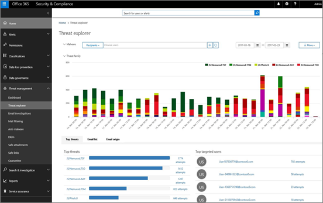

# Обеспечение безопасности Office 365 для пользователей с помощью Office 365 Threat расследования и возможности реагирования

## Обзор

Знаете ли вы, какие пользователи Office 365 подвержены атакам или хуже их безопасности? Знаете, как устранять и устранять атаки, предназначенные для пользователей? Знаете ли вы, что именно это можно сделать с возможностями безопасности, которые уже доступны в Office 365? 
  
[Исследование угроз для office 365 и](office-365-ti.md) возможности реагирования включены в вашу подписку на Office 365 (в составе [Office 365 Advanced Threat protection](office-365-atp.md) Plan 2). Эти возможности помогли корпорации Майкрософт сократить среднее время на решение проблем с социальным проектированием на 80%, а повышенную пропускную способность — 37% в месяц по сравнению с предыдущими 2 четвертых кварталов. 

Мы недавно добавили новые возможности для улучшения возможности обнаружения и восстановления угроз. Ниже приведен краткий обзор того, как обновленное исследование угроз и возможности реагирования могут быть еще эффективнее.
  
## Обнаружение вторжений и угроз

[Обозреватель угроз (или обнаружение в режиме реального времени)](threat-explorer.md) (также называемой проводником) помогает администраторам системы безопасности определить и понять, какие угрозы активны в Организации, так как даже самые сложные параметры безопасности могут обходиться небезопасными конфигурациями пользователей, например, безопасными отправителями вхителистс. С помощью проводника пользователи Office 365 Global or Security Admins быстро определяют, были ли пользователи скомпрометированы угрозами, такими как вредоносные программы и фишинг. Это помогает определить, какие пользователи наиболее подвержены риску для угроз и отклика. 
  
Кроме того, проводник позволяет администраторам перемещаться по связям между пользователями и почтой. Знаете ли вы какую бы то ни было неисправное сообщение? Найдите его, чтобы узнать, какие пользователи получали почту, а затем выполните ряд событий и посмотрите, что именно эти пользователи сделали.

Если у вас еще нет этих возможностей, [попробуйте сейчас](https://aka.ms/tryo365threatintel3). [Узнайте больше о расследовании угроз и ответе Office 365](https://aka.ms/readmoreabouto365threatintel).
  

  
## Быстрое устранение угроз и восстановление от угроз

После того как администраторы безопасности выявили подозрительные или вредоносные события, происходящие в своем клиенте, они могут быстро содержать эту угрозу и реагировать на нее с помощью **платформы инцидентов**. Группирование нежелательных сообщений одним щелчком мыши и быстрое удаление сообщений электронной почты из почтовых ящиков пользователя. 
  
 **Обновление:** Мы добавили возможность удалять сообщения электронной почты (мягкое или жесткое удаление) непосредственно из платформы инцидентов. Ранее администраторы могли только перемещать сообщения в папку нежелательной почты пользователя, где пользователи могут восстановить элемент. После выпуска новых возможностей удаления вы можете убедиться, что вредоносная или Нежелательная почта удаляется без возможности восстановления. 
  
Если у вас еще нет этих возможностей, [попробуйте сейчас](https://aka.ms/tryo365threatintel3). [Узнайте больше о расследовании угроз и ответе Office 365](https://aka.ms/readmoreabouto365threatintel).
  

  
## Использование дистанционного отслеживания угроз для Майкрософт

Исследование угроз для Office 365 и возможность реагирования на них подаются на базе интеллектуального графа безопасности Майкрософт. Граф получает последний сигнал угрозы из более чем 1 000 000 000 устройств с Windows, 450 000 000 000 ежемесячных учетных записей Azure и 400 000 000 000 ежемесячных сообщений в Office 365. Этот незавершенный сигнал угрозы — это то, что дает возможность широкому просмотру клиентского клиента, который имеет решающее значение для администраторов и аналитик безопасности, для получения полного представления угроз, влияющих на их организацию. 
  
## Зачем использовать возможности Office 365 для расследования угроз и реагирования на них?

Оценки Gartner, которые проходили в 2017 отдельно от $90B, были потрачены на циберсекурити. SID Дешпанде, основной исследовательской аналитики в компании Gartner, заключен в кавычки, так как это говорит о том, что в отрасли выбрана функция обнаружения и ответа в отрасли... отправляет неясное сообщение о том, что функция предотвращения футиле, если она не связана с возможностью обнаружения и ответа. " Исследование угроз и ответ являются важной частью каждого портфеля служб предприятия и могут использоваться как отдельные службы или в составе Office 365.
  
## Что дальше

- Дополнительные сведения о расследовании угроз Office 365 и возможностях реагирования в этом записанном сеансе: [Оставайтесь впереди кибератаки с Office 365](https://myignite.microsoft.com/videos/53723)
    
- [Опробуйте office 365 Threat расследования и возможности реагирования сейчас](https://aka.ms/tryo365threatintel3) или начать пробную версию Office для выхода на сегодня! 
    

