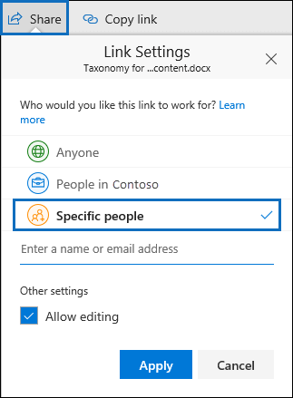

# <a name="keyword-queries-and-search-conditions-for-content-search"></a>Запросы ключевых слов и условия поиска контента

В этом разделе описываются свойства электронной почты и документов, которые можно выполнить поиск в элементов электронной почты в Exchange Online и документы, хранящиеся на сервере SharePoint и OneDrive для бизнеса-сайтов с помощью функции поиска контента безопасности Office 365 &amp; соответствия требованиям Центр. Вы также можете использовать ** \*- ComplianceSearch** командлеты, отсортированные по безопасности &amp; PowerShell центр соответствия требованиям для поиска этих свойств. Раздел также описывает:   
  
- Для уточнения результатов поиска с помощью логические операторы поиска, условия поиска и других методов запросов поиска.
    
- Поиск типов конфиденциальных данных и типы настраиваемых конфиденциальных данных в SharePoint и OneDrive для бизнеса.
    
- Поиск контента сайта, которая совместно с пользователями не из вашей организации
    
Пошаговые инструкции по созданию поиска контента в разделе [Поиск контента в Office 365](content-search.md). |

  
> [!NOTE]
> Содержимое поиска в системы &amp; центре соответствия требованиям и соответствующий ** \*- ComplianceSearch** командлеты, отсортированные по безопасности &amp; PowerShell центр соответствия использовать ключевое слово Query Language (KQL). Для получения дополнительных сведений см [Keyword Query Language синтаксис](https://go.microsoft.com/fwlink/?LinkId=269603). 
  
## <a name="searchable-email-properties"></a>Доступные для поиска свойства электронного сообщения

В следующей таблице приведены свойства сообщений электронной почты, которые может быть выполнен с помощью функции поиска контента в системы &amp; центре соответствия требованиям, или используя командлет **Set-ComplianceSearch** или **New-ComplianceSearch** . В таблице представлены пример синтаксиса _: значение свойства_ для каждого свойства и описание результатов поиска, возвращаемых в примерах. Можно ввести эти `property:value` поле пары ключевые слова для поиска контента. 
  
|**Свойство**|**Описание свойства**|**Примеры**|**Результаты поиска, возвращаемые примерами**|
|:-----|:-----|:-----|:-----|
|AttachmentNames  <br/> |Имена файлов, вложенных в сообщение электронной почты.  <br/> |`attachmentnames:annualreport.ppt`  <br/> `attachmentnames:annual*`  <br/> |Сообщения, в которые вложен файл annualreport.ppt. Во втором примере при использовании подстановочного знака возвращаются сообщения со вложениями, в названиях которых есть слово annual.  <br/> |
|Bcc  <br/> |Поле "СК" электронного письма.<sup>1</sup> <br/> |`bcc:pilarp@contoso.com`  <br/> `bcc:pilarp`  <br/> `bcc:"Pilar Pinilla"`  <br/> |Все примеры возвращают сообщения, в поле "Скрытая копия" которых добавлен пользователь "Pilar Pinilla".  <br/> |
|Category  <br/> | Категории поиска. Пользователи могут создавать категории с помощью Outlook или Outlook Web App. Возможные значения:  <br/><br/>  blue  <br/>  green  <br/>  orange  <br/>  purple  <br/>  red  <br/>  yellow  <br/> |`category:"Red Category"`  <br/> |Сообщения, которым в исходных почтовых ящиках назначена красная категория.  <br/> |
|Cc  <br/> |Поле "Копия" электронного письма.<sup>1</sup> <br/> |`cc:pilarp@contoso.com`  <br/> `cc:"Pilar Pinilla"`  <br/> |В обоих примерах возвращаются сообщения, в поле "Копия" которых указан пользователь "Pilar Pinilla".  <br/> |
|Folderid  <br/> |Папка идентификатор (GUID) определенного почтового ящика папки. Если вы используете это свойство, убедитесь, что поиск почтовых ящиков, размещенной в указанной папке. Обратите внимание на то, что будет осуществляться только в указанной папке. Не будет искать все вложенные папки в папке. Чтобы выполнить поиск вложенных папок, необходимо использовать свойство Folderid для вложенной папки, которые требуется выполнить поиск.<br/> Дополнительные сведения о поиске свойство Folderid и с помощью сценария, чтобы получить идентификаторы папки для определенного почтового ящика содержатся в разделе [Использование поиска контента в Office 365 для целевого семейства сайтов](use-content-search-for-targeted-collections.md).  <br/> |`folderid:4D6DD7F943C29041A65787E30F02AD1F00000000013A0000`  <br/> `folderid:2370FB455F82FC44BE31397F47B632A70000000001160000 AND participants:garthf@contoso.com`  <br/> |В первом примере возвращается все элементы в папке указанного почтового ящика. Во втором примере возвращает все элементы в папке указанного почтового ящика, были отправку и получение с garthf@contoso.com.  <br/> |
|From  <br/> |Отправитель электронного письма.<sup>1</sup> <br/> |`from:pilarp@contoso.com`  <br/> `from:contoso.com`  <br/> |Сообщения, отправленные указанным пользователем или с указанного домена.  <br/> |
|HasAttachment  <br/> |Указывает, имеет ли сообщение вложение. Используйте значения **true** или **false**.<br/> |`from:pilar@contoso.com AND hasattachment:true`  <br/> |Сообщения, отправленные с указанного пользователя, с вложениями.  <br/> |
|Importance  <br/> |Важность сообщения, которую отправитель может указать при отправке. По умолчанию сообщения отправляются с обычной важностью, если отправитель не укажет **высокую** или **низкую** важность.  <br/> |`importance:high`  <br/> `importance:medium`  <br/> `importance:low`  <br/> |Сообщения, которым назначена высокая, средняя или низкая важность.  <br/> |
|IsRead  <br/> |Указывает, будут ли сообщения прочитаны. Используйте значения **true** или **false**.<br/> |`isread:true`  <br/> `isread:false`  <br/> |В первом примере возвращается сообщений с помощью свойства IsRead задано значение **True**. Во втором примере возвращает сообщения с помощью свойства IsRead значение **False**.<br/> |
|ItemClass  <br/> |Это свойство используется для поиска определенных сторонних производителей типов данных вашей организации, импортированные в Office 365. Для этого свойства, используйте следующий синтаксис:`itemclass:ipm.externaldata.<third-party data type>*` <br/> |`itemclass:ipm.externaldata.Facebook* AND subject:contoso`  <br/> `itemclass:ipm.externaldata.Twitter* AND from:"Ann Beebe" AND "Northwind Traders"`  <br/> |В первом примере возвращается в свойство Subject Facebook элементы, содержащие слово «contoso». Во втором примере возвращает элементы Twitter размещенные Анна Белова и которые содержат фразу с ключевыми словами «Борей».<br/> Полный список значений, используемых для типов данных сторонних производителей для свойства ItemClass в разделе [Использование поиска контента для поиска данных сторонних производителей, которая была импортирована в Office 365](use-content-search-to-search-third-party-data-that-was-imported.md).  <br/> |
|Kind  <br/> | Тип сообщения электронной почты для поиска. Возможные значения:  <br/>  contacts  <br/>  docs  <br/>  email  <br/>  externaldata  <br/>  faxes  <br/>  im  <br/>  journals  <br/>  meetings  <br/>  microsoftteams (возвращает элементы из бесед, собраний и звонки в группах Майкрософт)  <br/>  notes  <br/>  posts  <br/>  rssfeeds  <br/>  tasks  <br/>  voicemail  <br/> |`kind:email`  <br/> `kind:email OR kind:im OR kind:voicemail`  <br/> `kind:externaldata`  <br/> |В первом примере возвращается сообщений электронной почты, которые соответствуют условиям поиска. Второй пример возвращает сообщений электронной почты, мгновенного обмена сообщениями бесед (включая Скайп для бизнеса бесед и бесед в группах Microsoft) и голосовых сообщений, которые соответствуют критериям поиска. Третий пример возвращает элементы, которые были импортированы для почтовых ящиков в Office 365 из источников данных сторонних производителей, таких как Twitter, Facebook и Cisco Jabber, соответствующие критериям поиска. Для получения дополнительных сведений см [данных архивации сторонних производителей в Office 365](https://go.microsoft.com/fwlink/p/?linkid=716918).<br/> |
|Participants  <br/> |Все поля пользователей в электронном письме: "От", "Кому", "Копия" и "СК".<sup>1</sup> <br/> |`participants:garthf@contoso.com`  <br/> `participants:contoso.com`  <br/> |Сообщения, отправленные с адреса garthf@contoso.com или на него. Второй пример возвращает все сообщения, отправленные или полученные пользователем домена contoso.com.  <br/> |
|Received  <br/> |Дата получения сообщения адресатом.  <br/> |`received:04/15/2016`  <br/> `received>=01/01/2016 AND received<=03/31/2016`  <br/> |Сообщения, полученные на 15 апреля 2016. Во втором примере возвращаются все сообщения, полученные от 1 января 2016 и 31 марта 2016.  <br/> |
|Recipients  <br/> |Все поля получателей в электронном письме: "Кому", "Копия" и "СК".<sup>1</sup> <br/> |`recipients:garthf@contoso.com`  <br/> `recipients:contoso.com`  <br/> |Сообщения, отправленные по адресу garthf@contoso.com. Второй пример возвращает все сообщения, адресованные любому получателю в домене contoso.com.  <br/> |
|Sent  <br/> |Дата отправки сообщения отправителем.  <br/> |`sent:07/01/2016`  <br/> `sent>=06/01/2016 AND sent<=07/01/2016`  <br/> |Сообщения, отправленные в указанный день или диапазон дат.  <br/> |
|Size  <br/> |Размер элемента в байтах.  <br/> |`size>26214400`  <br/> `size:1..1048567`  <br/> |Сообщения, размер которых превышает 25?? МБ. Во втором примере возвращает сообщения от 1 до 1,048,567 байт (1 МБ).  <br/> |
|Subject  <br/> |Текст в строке темы сообщения электронной почты.  <br/> **Примечание:** При использовании свойства темы в запросе поиска ???the возвращает все сообщения, в которых содержит текст, который вы ищете строку темы. Другими словами запрос не возвращает только сообщения, имеющие точное совпадение. Например, при выполнении поиска `subject:"Quarterly Financials"`, результаты будут включать сообщения с темой «Квартальное финансирование 2018».<br/> |`subject:"Quarterly Financials"`  <br/> `subject:northwind`  <br/> |Сообщения, которые содержат фразу «Квартальное финансирование» в любом месте текст строки темы. Во втором примере возвращаются все сообщения, содержащие слово "Борей" в строке темы.  <br/> |
|Кому  <br/> |Поле "Кому" электронного письма.<sup>1</sup> <br/> |`to:annb@contoso.com`  <br/> `to:annb ` <br/> `to:"Ann Beebe"`  <br/> |Все примеры возвращают сообщения, в поле "Кому" которых указано имя "Анна Ермолаева".  <br/> |
   
> [!NOTE]
> <sup>1</sup> в качестве значения свойства получателей можно использовать адрес электронной почты (также называемое *имя участника-пользователя* или имя участника-пользователя), отображаемое имя или псевдоним для указания пользователя. Например annb@contoso.com, annb или «Анна Белова» можно использовать для указания пользователя Анна Белова.<br/><br/>При поиске любой из параметров учетной записи получателя (от, чтобы «копия», «СК», участников и получателей), Office 365 пытается расширить идентификатор каждого пользователя, используя их копирование в Azure Active Directory.  Если пользователь находится в Azure Active Directory, для добавления пользователя по электронной почте адреса (или имени участника-пользователя), псевдоним, отображать имя и LegacyExchangeDN развернут запроса.<br/><br/>К примеру, запрос как `participants:ronnie@contoso.com` при развертывании `participants:ronnie@contoso.com OR participants:ronnie OR participants:"Ronald Nelson" OR participants:"<LegacyExchangeDN>"`.

## <a name="searchable-site-properties"></a>Свойства сайтов, доступные для поиска

В следующей таблице перечислены некоторые из SharePoint и OneDrive, может быть выполнен с помощью функции поиска контента в системы свойства Business &amp; центре соответствия требованиям или с помощью **New-ComplianceSearch** или ** SET-ComplianceSearch** командлета. В таблице представлены пример синтаксиса _: значение свойства_ для каждого свойства и описание результатов поиска, возвращаемых в примерах. 
  
Полный список свойств для SharePoint, которые можно искать в разделе [Обзор свойств для обхода и управляемых свойств в SharePoint](https://go.microsoft.com/fwlink/p/?LinkId=331599). Свойства, помеченные **Да** в столбце **возможность запроса** может быть выполнен. 
  
|**Свойство**|**Описание свойства**|**Пример**|**Результаты поиска, возвращаемые примерами**|
|:-----|:-----|:-----|:-----|
|Author  <br/> |Поле автора из документов Office, хранящее Если скопировать документ. Например при создании пользователем документа и по электронной почте его пользователю и пользователь, который отправляет его в SharePoint, документ по-прежнему будет сохранять автор. Необходимо использовать отображаемое имя пользователя для этого свойства.  <br/> |`author:"Garth Fort"`  <br/> |Все документы, созданные пользователем Garth Fort.  <br/> |
|ContentType  <br/> |Тип содержимого SharePoint элемента, например элемента, документа или видео.  <br/> |`contenttype:document`  <br/> |Возвращаются все документы.  <br/> |
|Created  <br/> |Дата создания элемента.  <br/> |`created\>=06/01/2016`  <br/> |Все элементы, созданные не ранее 1 июня 2016.  <br/> |
|CreatedBy  <br/> |Человек, создавать или отправлять элемента. Необходимо использовать отображаемое имя пользователя для этого свойства.  <br/> |`createdby:"Garth Fort"`  <br/> |Все элементы, созданные или отправленные пользователем Garth Fort.  <br/> |
|DetectedLanguage  <br/> |Язык элемента.  <br/> |`detectedlanguage:english`  <br/> |Все элементы на английском языке.  <br/> |
|FileExtension  <br/> |Расширения имени файла; Например docx, один, pptx или xlsx.  <br/> |`fileextension:xlsx`  <br/> |Все файлы Excel (Excel 2007 и более поздних версий)  <br/> |
|FileName  <br/> |Имя файла.  <br/> |`filename:"marketing plan"`  <br/> `filename:estimate`  <br/> |Первый пример возвращает файлы с фразой "marketing plan" в заголовке. Второй пример возвращает файлы со словом "estimate" в имени файла.  <br/> |
|LastModifiedTime  <br/> |Дата последнего изменения элемента.  <br/> |`lastmodifiedtime>=05/01/2016`  <br/> `lastmodifiedtime>=05/10/2016 AND lastmodifiedtime<=06/1/2016`  <br/> |В первом примере возвращается элементов, которые были изменены, появившимися не ранее 1 мая 2016. Во втором примере возвращает элементы изменены между 1 мая 2016 и 1 июня 2016.  <br/> |
|ModifiedBy  <br/> |Человек, который последнего изменения элемента. Необходимо использовать отображаемое имя пользователя для этого свойства.  <br/> |`modifiedby:"Garth Fort"`  <br/> |Все элементы, которые последним изменил пользователь Garth Fort.  <br/> |
|Путь  <br/> |Путь (URL-адрес) из указанной папки на SharePoint или OneDrive для бизнеса сайта. Если вы используете это свойство, убедитесь, что поиск на сайте, размещенной в указанной папке.<br/> Для возврата элементов, расположенных в вложенных папок в папке, укажите для свойства path, необходимо добавить /\* URL-адрес из указанной папки; Например`path: "https://contoso.sharepoint.com/Shared Documents/*"`  <br/> <br/> **Примечание:** С помощью `Path` свойство для поиска OneDrive расположения не возвращают файлы мультимедиа, такие как файлы PNG, TIFF. или .wav, в результатах поиска. Используйте свойство другой сайт в запросе на поиск для поиска файлов мультимедиа в папках OneDrive.<br/> <br/> Дополнительные сведения о поиске свойства Path и с помощью сценария для получения пути URL-адреса для папок на определенный сайт содержатся в разделе [Использование поиска контента в Office 365 для целевого семейства сайтов](use-content-search-for-targeted-collections.md).  <br/> |`path:"https://contoso-my.sharepoint.com/personal/garthf_contoso_com/Documents/Private"`  <br/> `path:"https://contoso-my.sharepoint.com/personal/garthf_contoso_com/Documents/Shared with Everyone/*" AND filename:confidential`  <br/> |В первом примере возвращается все элементы в указанной OneDrive для бизнеса папки. Во втором примере возвращает документы в папке конкретного сайта (и все вложенные папки), содержащие слово «confidential» в поле имя файла.  <br/> |
|SharedWithUsersOWSUser  <br/> |Документы, которые совместно с указанным пользователем и отображается на странице **общих со мной** в пользователя OneDrive для бизнеса сайта. Это документы, которые явно общие с указанным пользователем другим сотрудникам вашей организации. При экспорте документы, соответствующие поискового запроса, который использует свойство SharedWithUsersOWSUser документов, экспортированные из исходного расположения контента человека, который общих документов с помощью указанного пользователя. Для получения дополнительных сведений см. [Поиск контента веб-сайта общих вашей организации](keyword-queries-and-search-conditions.md#internal).<br/> |`sharedwithusersowsuser:garthf`  <br/> `sharedwithusersowsuser:"garthf@contoso.com"`  <br/> |В обоих примерах возврата всех документов, явно общие с Гарт Форт и, отображаются на странице **общих со мной** в Гарт Форт OneDrive для бизнеса учетной записи.  <br/> |
|Site  <br/> |URL-адрес сайта или группы сайтов в организации.  <br/> |`site:"https://contoso-my.sharepoint.com"`  <br/> `site:"https://contoso.sharepoint.com/sites/teams"`  <br/> |В первом примере возвращается элементов из службы OneDrive для бизнеса сайтов для всех пользователей в организации. Во втором примере возвращает элементы со всех сайтов группы.  <br/> |
|Size  <br/> |Размер элемента в байтах.  <br/> |`size>=1`  <br/> `size:1..10000`  <br/> |Первый пример возвращает элементы, размер которых больше 1 байта. Второй пример возвращает элементы размером от 1 до 10 000 байт.  <br/> |
|Title  <br/> |Название документа. Свойство Title — это метаданные, указанного в документах Microsoft Office. Оно отличается от имени файла документа.  <br/> |`title:"communication plan"`  <br/> |Любой документ, который содержит фразу "communication plan" в свойстве метаданных Title документа Office.  <br/> |
   
## <a name="searchable-contact-properties"></a>Для поиска свойства контакта

В следующей таблице перечислены свойства контакта, индексируемые и что можно выполнить поиск по использованию поиска контента. Это свойства, доступные для пользователей настроить для контактов (также называемая личные контакты), которые расположены в адресной книге почтового ящика пользователя. Для поиска контактов, можно выбрать почтовые ящики для поиска и затем использовать один или несколько свойства контакта в запрос.
  
> [!TIP]
> Чтобы найти значения, которые содержат пробелов и специальных символов, использовать двойные кавычки (» «) и содержит фразу; например `businessaddress:"123 Main Street"`. 
  
|**Свойство**|**Описание свойства**|
|:-----|:-----|
|BusinessAddress  <br/> |Адрес в свойстве **Рабочего адреса** . Свойство также называется **рабочий** адрес на странице свойства контакта.<br/> |
|BusinessPhone  <br/> |Номер телефона в любом из **Рабочий телефон** , какой номер свойства.  <br/> |
|Название организации  <br/> |Имя в свойстве **компании** .  <br/> |
|Отдел  <br/> |Имя в свойстве **отдела** .  <br/> |
|DisplayName  <br/> |Отображаемое имя контакта. Это имя в свойстве **Полное имя** контакта.<br/> |
|EmailAddress  <br/> |Адрес для любого свойства адреса электронной почты контакта. Обратите внимание на то, что пользователи могут добавлять несколько адресов электронной почты для контакта. Использовать это свойство будет возвращать контакты, которые соответствуют ни одной из адреса электронной почты.  <br/> |
|FileAs  <br/> |**Файл как** свойство. Это свойство используется для указания того, как указано контакт в список контактов другого пользователя. Например контакт может отображаться как *FirstName, LastName* или *Фамилия, имя* .<br/> |
|GivenName  <br/> |Имя в **имени** свойства.  <br/> |
|ДомашнийАдрес  <br/> |Адрес в любом из свойства адреса **Домашняя страница** .  <br/> |
|HomePhone  <br/> |Номер телефона в любом из **Домашний** телефон, какой номер свойства.  <br/> |
|IMAddress  <br/> |Свойство адрес обмена мгновенными Сообщениями, который обычно является адресом электронной почты, используемый для обмена мгновенными сообщениями.  <br/> |
|Отчество  <br/> |Имя в **средней** свойство name.  <br/> |
|MobilePhone  <br/> |Номер **мобильного** телефона, какой номер свойства.  <br/> |
|Nickname  <br/> |Имя в свойстве **псевдонимов** .  <br/> |
|Расположение компании  <br/> |Значение свойства **Office** или **Расположение комнаты** .  <br/> |
|OtherAddress  <br/> |Значение для **свойства адреса** .  <br/> |
|Фамилия  <br/> |Имя в **последний** свойство name.  <br/> |
|Должность  <br/> |Заголовок в свойстве **Должность** .  <br/> |
   

## <a name="searchable-sensitive-data-types"></a>Конфиденциальные типы данных, доступные для поиска

Можно использовать функцию поиска контента в системы &amp; центре соответствия требованиям для поиска конфиденциальные данные, например данные о банковской карте или номера социального страхования, которые хранятся в документах на сервере SharePoint и OneDrive для бизнеса сайтов. Это можно сделать с помощью `SensitiveType` введите свойство и имя конфиденциальной информации в запроса ключевого слова. Например, запрос `SensitiveType:"Credit Card Number"` возвращает документы, содержащие номер кредитной карты. Запрос `SensitiveType:"U.S. Social Security Number (SSN)"` возвращает документы, которые содержит номера социального страхования США. Чтобы просмотреть список типов конфиденциальных данных, которые можно выполнить поиск, перейдите к **классификации** \> **типы конфиденциальной информации** в системы &amp; центре соответствия требованиям. Или можно использовать командлет **Get-DlpSensitiveInformationType** в системы &amp; PowerShell центр соответствия требованиям, чтобы отобразить список типов конфиденциальных данных. 
  
Вы также можете использовать `SensitiveType` свойство, чтобы найти имя типа пользовательского конфиденциальных данных, созданной вами (или другим администратором) для вашей организации. Обратите внимание, что в столбце **Publisher** можно использовать на странице **типы конфиденциальной информации** в безопасности &amp; центре соответствия требованиям (или свойство **издателя** в PowerShell), чтобы отличать встроенные и пользовательские конфиденциальные типы информации. Для получения дополнительных сведений см. [Создание типа настраиваемого конфиденциальной информации](create-a-custom-sensitive-information-type.md).
  
Дополнительные сведения о создании запросов с использованием `SensitiveType` свойства, просмотрите [форму запрос, чтобы найти конфиденциальные данные, хранящиеся на веб-сайтах](form-a-query-to-find-sensitive-data-stored-on-sites.md).
  
## <a name="search-operators"></a>Операторы поиска

Логические операторы поиска, такие как **AND**, **OR**и **не**, помогают определить более точного поиска путем включения или исключения определенных слов в запросе поиска. Другие методы, такие как с помощью свойства операторы (например, \>= или..), кавычки, скобок и подстановочные знаки, помогут в запросах поиска. В следующей таблице перечислены операторы, которые можно использовать, чтобы сузить или расширить область результатов поиска. 
  
|**Оператор**|**Использование**|**Описание**|
|:-----|:-----|:-----|
|AND  <br/> |ключевое_слово1 AND ключевое_слово2  <br/> |Возвращает элементы, включая все указанные ключевые или `property:value` выражений. Например `from:"Ann Beebe" AND subject:northwind` вернет все сообщения, отправленные с Анна Белова, содержащий слово "Борей" в строке темы. <sup>2</sup> <br/> |
|+  <br/> |ключевоеслово1 + ключевое_слово2 + ключевоеслово3  <br/> |Возвращает элементы, которые содержат  *либо*  `keyword2` , либо  `keyword3`,  *а также*  `keyword1`. Следовательно, этот пример аналогичен запросу  `(keyword2 OR keyword3) AND keyword1`.  <br/> Обратите внимание, что запрос `keyword1 + keyword2` (должен быть пробел после **+** символа) не совпадает с помощью ** AND ** оператор. Этот запрос будет эквивалентен `"keyword1 + keyword2"` и возвращаются элементы с точным этап `"keyword1 + keyword2"`.<br/> |
|OR  <br/> |ключевое_слово1 OR ключевое_слово2  <br/> |Возвращает элементы, включающие один или несколько указанных ключевых или `property:value` выражений. <sup>2</sup> <br/> |
|NOT  <br/> |ключевое_слово1 NOT ключевое_слово2  <br/> NOT from:"Анна Ермолаева"  <br/> НЕ вид: обмен мгновенными сообщениями  <br/> |Исключает элементов, указанных с ключевым словом или `property:value` выражение. Во втором примере исключает сообщений, отправленных пользователем Анна Белова. Третий пример исключает любые Ведение текстовых бесед, такие как Скайп для бизнеса бесед, которые сохраняются в папке почтового ящика журнала бесед. <sup>2</sup> <br/> |
|-  <br/> |ключевое_слово1 -ключевое_слово2  <br/> |То же, что оператор **NOT** . Чтобы этот запрос возвращает элементы, которые содержат `keyword1` и будет исключить элементы, которые содержат `keyword2`.<br/> |
|NEAR  <br/> |ключевое_слово1 NEAR(n) ключевое_слово2  <br/> |Возвращает элементы с слова, которые являются рядом друг с другом, где n — это количество слов друг от друга. Например `best NEAR(5) worst` возвращает любого элемента, где слово «худшее» — в пять слова «рекомендации». Если значение не указано, расстояние по умолчанию составляет восемь слов. <sup>2</sup> <br/> |
|ONEAR  <br/> |ключевое_слово1 ONEAR(n) ключевое_слово2  <br/> |Аналогично **NEAR**, но возвращаются элементы с слова, расположенных рядом друг с другом в указанном порядке. Например `best ONEAR(5) worst` возвращает любого элемента, где слово «рекомендации» предшествует слово «худшее» и два слова находятся в пять слова друг от друга. Если значение не указано, расстояние по умолчанию составляет восемь слов. <sup>2</sup> <br/> > [!NOTE]> оператор **ONEAR** не поддерживается при поиске почтовых ящиков; работает только при поиске SharePoint и OneDrive для бизнеса сайтов. Если оператор **ONEAR** включает в себя запрос поиска почтовых ящиков и сайтов того же поиска, как при использовании оператора **NEAR** поиск вернет элементы почтового ящика. Другими словами Поиск возвращает только элементы, в которых заданные слова являются рядом друг с другом независимо от порядка, в котором расположены ключевых слов.           |
|:  <br/> |свойство:значение  <br/> |Двоеточие (:) в `property:value` синтаксис указывает, что значение свойства, поиск содержит указанное значение. Например `recipients:garthf@contoso.com` возвращает сообщение, отправленное в garthf@contoso.com.<br/> |
|=  <br/> |свойство=значение  <br/> |То же, что оператор **:** .  <br/> |
|\<  <br/> |свойство\<значение  <br/> |Указывает, что значение искомого свойства меньше указанного значения.<sup>1</sup> <br/> |
|\>  <br/> |свойство\>значение  <br/> |Указывает, что значение искомого свойства больше указанного значения.<sup>1</sup> <br/> |
|\<=  <br/> |свойство\<=значение  <br/> |Указывает, что значение искомого свойства меньше или равно указанному значению.<sup>1</sup> <br/> |
|\>=  <br/> |свойство\>=значение  <br/> |Указывает, что значение искомого свойства больше или равно указанному значению.<sup>1</sup> <br/> |
|..  <br/> |свойство: значение1... значение2  <br/> |Указывает, что значение искомого свойства больше или равно значению 1 и меньше или равно значению 2.<sup>1</sup> <br/> |
|"  "  <br/> |"реальная стоимость"  <br/> subject:"Квартальное финансирование"  <br/> |Использовать двойные кавычки (» «) для поиска точной фразы или термина в ключевое слово и `property:value` поисковых запросов.  <br/> |
|\*  <br/> |cat\*  <br/> subject:set\*  <br/> |Поиск с подстановочными знаками префикса (где звездочка размещается в конце слова) соответствует ноль или больше знаков в ключевые слова или `property:value` запросов. Например `title:set*` возвращает документы, содержащие слово set, программа установки и значение (и другие слова, начинающиеся с «набор») в поле Название документа.<br/><br/> **Примечание:** Можно использовать только префикс поиск с подстановочными знаками; например **кошка\* ** или **задать\***. Суффикс операций поиска ( ** \*кошка** ), инфиксные операций поиска ( **c\*t** ) и поиск подстроки ( ** \*кошка\* ** ) не поддерживаются.           |
|(  )  <br/> | (реальная OR бесплатная) AND (from:contoso.com)  <br/> (IPO OR первичное) AND (биржа OR акции)  <br/> (квартальное финансирование)  <br/> |Скобки объединяют логические фразы, элементы  `property:value` и ключевые слова. Например, выражение  `(quarterly financials)` возвращает элементы, которые содержат слова "quarterly" и "financials".  <br/> |
   
> [!NOTE]
> <sup>1</sup> Этот оператор используется для свойств, значения которых являются числами или датами.<br/> <sup>2</sup> логические операторы поиска должна быть в верхнем регистре; Например, **AND**. При использовании строчных оператора, например, **и**его будет рассматриваться как ключевого слова в поисковый запрос. 
  
## <a name="search-conditions"></a>Условия поиска

Можно добавить условия поиска по запросу для сужения области поиска и возвращать более качественных набора результатов. Каждое условие добавляет предложение в поисковый запрос KQL, который создается и при запуске поиска.
  
[Условия для общих свойств ](#conditions-for-common-properties)

[Условия для свойств почты](#conditions-for-mail-properties)

[Условия для свойств документов](#conditions-for-document-properties)

[Операторы, используемые с условиями](#operators-used-with-conditions)

[Рекомендации по использованию условий](#guidelines-for-using-conditions)

[Примеры использования условий в поисковых запросах](#examples-of-using-conditions-in-search-queries)
  
### <a name="conditions-for-common-properties"></a>Условия для общих свойств 

Создайте условие, при выполнении поиска почтовых ящиков и сайтов в тот же поиск с помощью общих свойств. В следующей таблице приведены доступные свойства для использования при добавлении условия.
  
|**Условие**|**Описание**|
|:-----|:-----|
|Дата  <br/> |Для электронной почты сообщение было доходит до получателя или отправленные отправителем. Для документов, Дата последнего изменения документа.  <br/> |
|Sender/Author  <br/> |Для электронной почты лица, отправившего сообщение. Для документов, лицо, указанных в поле автора из документов Office. Можно ввести несколько имен, разделенных запятыми. Два или несколько значений, логически соединены оператор **OR** .<br/> |
|Размер (в байтах)  <br/> |Для электронной почты и документов: размер элемента (в байтах).  <br/> |
|Subject/Title  <br/> |Для электронной почты, текст в строке темы сообщения. Для документов, название документа. Как объяснялось ранее свойство Title — это метаданные, указанного в документах Microsoft Office. Можно ввести имя более одного/название темы, разделенных запятыми. Два или несколько значений, логически соединены оператор **OR** .<br/> |
|Тег соответствия требованиям  <br/> |Для электронной почты и документов подписи, которые были назначены сообщений и документов автоматически политиками метки или метки, вручную назначены пользователям. Метки используются для классификации электронной почты и документов для управления данными и применения правила хранения на основе классификации, определенные в качестве метки. Можно введите часть имени метки и использовать подстановочные знаки или введите имя метки завершена. Для получения дополнительных сведений см [метки в Office 365](labels.md).<br/> |
  
### <a name="conditions-for-mail-properties"></a>Условия для свойств почты

Создание условия с помощью свойств почты при поиске в почтовых ящиках или общих папках. В следующей таблице перечислены свойства почты, которые можно использовать в условиях. Обратите внимание, что эти свойства являются подмножеством свойств почты, описанных ранее. Эти описания повторяются для вашего удобства.
  
|**Условие**|**Описание**|
|:-----|:-----|
|Тип сообщения  <br/> | Тип сообщения для поиска. Это же свойство как свойство типа электронной почты. Возможные значения:  <br/><br/>  contacts  <br/>  docs  <br/>  email  <br/>  externaldata  <br/>  faxes  <br/>  im  <br/>  journals  <br/>  meetings  <br/>  microsoftteams  <br/>  notes  <br/>  posts  <br/>  rssfeeds  <br/>  tasks  <br/>  voicemail  <br/> |
|Participants  <br/> |Все поля людей в сообщении: "От", "Кому", "Копия" и "Скрытая копия".  <br/> |
|Тип  <br/> |Свойство класса сообщений для элемента электронной почты. Это же свойство как свойство ItemClass электронной почты. Это также многозначный условие. Таким образом, чтобы выбрать несколько классов сообщений, удерживая **НАЖАТОЙ** клавишу CTRL и нажмите кнопку два или несколько классов сообщений в раскрывающемся списке, который требуется добавить условие. Каждый класс сообщений, выберите в списке будет логически связываться с оператором **или** в соответствующем поисковые запросы.<br/> Список классов сообщений (и их соответствующий идентификатор класса сообщения), которые используются Exchange, который можно выбрать в списке **класс сообщения** в разделе [типы элементов и классы сообщений](https://go.microsoft.com/fwlink/?linkid=848143).  <br/> |
|Received  <br/> |Дата получения сообщения адресатом. Это свойство совпадает со свойством Received электронного сообщения.  <br/> |
|Получатели  <br/> |Отправлено сообщение электронной почты пользователя. Это же свойство как значение свойству электронной почты.  <br/> |
|Sender  <br/> |Отправитель сообщения электронной почты.  <br/> |
|Sent  <br/> |Дата отправки сообщения электронной почты отправителя. Это же свойство как свойство электронной почты отправлено.  <br/> |
|Subject  <br/> |Текст в строке темы сообщения электронной почты.  <br/> |
|В  <br/> |Получатель сообщения электронной почты.  <br/> |
  
### <a name="conditions-for-document-properties"></a>Условия для свойств документов

Создайте условие, при поиске документов на сервере SharePoint и OneDrive для бизнеса сайтов с помощью свойства документа. В следующей таблице приведены свойства документа, которые можно использовать для. Обратите внимание на то, что эти свойства представляют собой подмножество свойств сайтов, описанных ранее; Эти описания повторяются для вашего удобства.
  
|**Условие**|**Описание**|
|:-----|:-----|
|Author  <br/> |Поле автора из документов Office, хранящее Если скопировать документ. Например при создании пользователем документа и по электронной почте его пользователю и пользователь, который отправляет его в SharePoint, документ по-прежнему будет сохранять автор.  <br/> |
|Должность  <br/> |Название документа. Свойство Title — это метаданные, указанного в документах Office. Оно отличается от имени файла документа.  <br/> |
|Создано  <br/> |Дата создания документа.  <br/> |
|Дата последнего изменения  <br/> |Дата последнего изменения документа.  <br/> |
|Тип файла  <br/> |Расширения имени файла; Например docx, один, pptx или xlsx. Это же свойство как свойство добавляемое сайта.  <br/> |
  
### <a name="operators-used-with-conditions"></a>Операторы, используемые с условиями

При добавлении условия вы можете выбрать оператор, относящийся к типу свойства для этого условия. В следующей таблице описаны операторы, используемые с условиями, и перечислены эквиваленты, используемые в поисковых запросах.
  
|**Оператор**|**Эквивалент запроса**|**Описание**|
|:-----|:-----|:-----|
|After  <br/> |`property>date`  <br/> |Используется с условиями даты. Возвращает элементы, отправленные, полученные или измененные после указанной даты.   <br/> |
|Before  <br/> |`property<date`  <br/> |Используется с условиями даты. Возвращает элементы, отправленные, полученные или измененные до указанной даты.  <br/> |
|Between  <br/> |`date..date`  <br/> |Используйте с условиями Дата и размер. При использовании с условием даты возвращает элементы были отправлено, полученных или изменены за указанный диапазон дат. При использовании с условием размер возвращает элементы, размер которого является в заданном диапазоне.  <br/> |
|Contains any of  <br/> |`(property:value) OR (property:value)`  <br/> |Используется с условиями, чтобы указать строковое значение свойства. Возвращает элементы, которые содержат любой части одно или несколько значений указанной строки.  <br/> |
|Doesn't contain any of  <br/> |`-property:value`  <br/> `NOT property:value`  <br/> |Используется с условиями для свойств, определяющих строковые значения. Возвращает элементы, которые не содержат ни одной части указанного строкового значения.  <br/> |
|Doesn't equal any of
  <br/> |`-property=value`  <br/> `NOT property=value`  <br/> |Используется с условиями для свойств, определяющих строковые значения. Возвращает элементы, которые не содержат определенную строку.  <br/> |
|Equals  <br/> |`size=value`  <br/> |Возвращает элементы, размер которых равен указанному.<sup>1</sup> <br/> |
|Equals any of  <br/> |`(property=value) OR (property=value)`  <br/> |Используется с условиями для свойств, определяющих строковые значения. Возвращает элементы, которые полностью совпадают с одним или несколькими указанными строковыми значениями.  <br/> |
|Greater  <br/> |`size>value`  <br/> |Возвращает элементы, в которых заданное свойство больше заданного значения.<sup>1</sup> <br/> |
|Greater or equal  <br/> |`size>=value`  <br/> |Возвращает элементы, в которых заданное свойство больше или равно заданному значению.<sup>1</sup> <br/> |
|Less  <br/> |`size<value`  <br/> |Возвращает элементы, которые меньше определенного значения или равны ему.<sup>1</sup> <br/> |
|Less or equal  <br/> |`size<=value`  <br/> |Возвращает элементы, которые меньше определенного значения или равны ему.<sup>1</sup> <br/> |
|Not equal  <br/> |`size<>value`  <br/> |Возвращает элементы, размер которых не равен указанному.<sup>1</sup> <br/> |
   
> [!NOTE]
> <sup>1</sup> этот оператор доступен только для условий, используйте свойство размера. 
  
### <a name="guidelines-for-using-conditions"></a>Рекомендации по использованию условий

При использовании условий поиска необходимо учитывать следующее:
  
- Условие логически подключенной к запроса ключевого слова (указанного в поле ключевых слов) **и** оператор. Который означает, что элементы для удовлетворения запроса ключевого слова и условия должны быть включены в результаты. Это, как помочь условий, чтобы сузить результаты. 
    
- При добавлении двух или нескольких уникальных условий для поискового запроса (условия, которые определяют различные свойства) оператор **AND** логически связаны эти условия. Это означает, что возвращаются только элементы, которые удовлетворяют всем условий (в дополнение к любой запроса ключевого слова). 
    
- При добавлении нескольких условий для одного свойства этих условий логически соединены оператор **OR** . Это означает, что возвращаются элементы, которые удовлетворяют запроса ключевого слова и одно из условий. Таким образом групп же условий соединены друг с другом **или** оператор и затем наборов уникальных условий соединенных оператором **и** . 
    
- При добавлении нескольких значений (разделенных запятыми или точками с запятой) для одного условия, оператор **или** подключены эти значения. Это означает, что возвращаются элементы, если они имеются какие-либо из указанного значения свойства в условии. 
    
- На странице " **Поиск** " в области сведений для выбранного поиска отображается запрос поиска, которая создается с помощью ключевые слова и условия. В запросе, все, что в правой части представления `(c:c)` указывает условия, которые добавляются к запросу. 
    
- Условия только добавить свойства в поисковый запрос; не добавляйте операторы. Поэтому операторы справа от не отображать запрос, отображаемые в области сведений о `(c:c)` нотацию. KQL добавляет логические операторы (в соответствии с правилами объяснялось ранее) при выполнении запроса. 
    
- Можно использовать и поместите элемент управления для повторного виртуализации порядке условия. Щелкните на элементе управления условия и переместите его вверх или вниз.
    
- Как объяснялось ранее некоторые свойства условий можно ввести несколько значений. Каждое значение логически широкополосным оператор **OR** . Это приводит к ту же логику, при наличии нескольких экземпляров одного условия, где каждый имеет одно значение. На следующих рисунках показаны пример одно условие с несколькими значениями и пример нескольких условий (для одного свойства) с одним значением. В обоих примерах привести того же запроса:`(filetype="docx") OR (filetype="pptx") OR (filetype="xlsx")`
    
    
  
    
  
> [!TIP]
> Если условие принимает несколько значений, мы рекомендуем использовать одно условие и указывать несколько значений (разделенных запятыми или точками с запятой). Это помогает обеспечить логику запроса, применяемую в соответствии с вашими намерениями. 
  
### <a name="examples-of-using-conditions-in-search-queries"></a>Примеры использования условий в поисковых запросах

В следующем примере показан версии на основе графического интерфейса пользователя поискового запроса с условиями, синтаксис запроса поиска, который отображается в области сведений выбранного поиска (который также возвращаемых командлетом **Get-ComplianceSearch** ) и логики соответствующий запрос KQL. 
  
#### <a name="example-1"></a>Пример 1

В этом примере возвращает документов на сервере SharePoint и OneDrive для бизнеса сайтов, которые содержат номер кредитной карты и последнего изменения до 1 января 2016.
  
 **Графический пользовательский интерфейс**
  

  
 **Синтаксис поисковых запросов**
  
 `SensitiveType:"Credit Card Number(c:c)(lastmodifiedtime<2016-01-01)`
  
 **Логика поисковых запросов**
  
 `SensitiveType:"Credit Card Number" AND (lastmodifiedtime<2016-01-01)`
  
#### <a name="example-2"></a>Пример 2

Этот пример возвращает элементы электронной почты или документы, содержащие ключевое слово "report", которые были отправлены или созданы до 1 апреля 2105 г. и которые содержат слово "northwind" в поле темы сообщений или в свойстве Title документов. Этот запрос исключает веб-страницы, которые соответствуют другим условиям поиска. 
  
 **Графический пользовательский интерфейс**
  

  
 **Синтаксис поисковых запросов**
  
 `report(c:c)(date<2016-04-01)(subjecttitle:"northwind")(-filetype="aspx")`
  
 **Логика поисковых запросов**
  
 `report AND (date<2016-04-01) AND (subjecttitle:"northwind") NOT (filetype="aspx")`
  
#### <a name="example-3"></a>Пример 3
<a name="conditionexamples"> </a>

В этом примере возвращаются сообщений электронной почты или календаря собрания, отправленные между 12/1/2016 и 11/30/2016 и содержат слова, начинающиеся с «смартфоне» или «телефон».
  
 **Графический пользовательский интерфейс**
  

  
 **Синтаксис поисковых запросов**
  
 `phone* OR smartphone*(c:c)(sent=2016-12-01..2016-11-30)(kind="email")(kind="meetings")`
  
 **Логика поисковых запросов**
  
 `phone* OR smartphone* AND (sent=2016-12-01..2016-11-30) AND ((kind="email") OR (kind="meetings"))`
  
## <a name="searching-for-site-content-shared-with-external-users"></a>Поиск контента сайта, который доступен внешним пользователям

Также можно использовать функцию поиска контента в системы &amp; центре соответствия требованиям для поиска документов, хранящиеся на сервере SharePoint и OneDrive для бизнеса сайтов, общие с людьми за пределами вашей организации. Это может помочь определить засекреченные или конфиденциальные сведения, используемому за пределами вашей организации. Это можно сделать с помощью `ViewableByExternalUsers` свойство в запроса ключевого слова. Это свойство будет возвращать документы или сайтов, доступ внешних пользователей, используя один из следующих методов общего доступа к которым: 
  
- Приглашения на общий доступ, которое необходимо пользователям для входа в вашей организации в качестве пользователя с разрешением.
    
- Ссылка анонимных гостя позволяет всем пользователям с этой ссылки для доступа к ресурсам без необходимости проходить проверку подлинности.
    
Вот несколько примеров:
  
- Запрос `ViewableByExternalUsers:true AND SensitiveType:"Credit Card Number"` возвращает все элементы, общие с людьми за пределами вашей организации и содержит номер кредитной карты. 
    
- Запрос `ViewableByExternalUsers:true AND ContentType:document AND site:"https://contoso.sharepoint.com/Sites/Teams"` возвращает список документов всех веб-сайтов групп в организации, общие с внешними пользователями. 
    
> [!TIP]
> Запрос поиска, такие как `ViewableByExternalUsers:true AND ContentType:document` может возвращать много ASPX-файлов в списке результатов поиска. Для устранения этих (или другие типы файлов), можно использовать `FileExtension` свойство для исключения определенных типов файлов; например `ViewableByExternalUsers:true AND ContentType:document NOT FileExtension:aspx`. 
  
Понятие содержимого, совместно с людьми за пределами вашей организации? Документы в вашей организации SharePoint и OneDrive для бизнеса сайтов, совместного использования, отправив приглашения на общий доступ или, совместного использования в общих папках. Например следующие действия пользователя привести контента, который можно просматривать с внешним пользователям:
  
- пользователь предоставляет общий доступ к файлу или папке для определенного пользователя за пределами вашей организации;

    
- Пользователь создает и отправка ссылки на файл общих человека за пределами вашей организации. Этой ссылки внешний пользователь может просматривать (или изменение) файла.
    
- пользователь отправляет приглашение на доступ или гостевую ссылку пользователю за пределами организации для просмотра или редактирования файла.
    
### <a name="issues-using-the-viewablebyexternalusers-property"></a>Проблемы с помощью свойства ViewableByExternalUsers

Во время `ViewableByExternalUsers` свойство представляет состояние ли общих документов или сайт с внешними пользователями, существуют некоторые вопросы, связанные с на то, что это свойство и не отражает. В следующих сценариях значение `ViewableByExternalUsers` свойства не будут обновляться, а результаты запроса поиска контента, использующие это свойство может быть неточным. 
  
- Изменения политики, например, отключение внешний общий доступ для сайта или для организации общего доступа. Это свойство будет по-прежнему отображается ранее общих документов проверяется доступное извне, несмотря на то, что внешний доступ был отозван.
    
- Изменения членства в группе, такие как добавление или удаление внешних пользователей к группам безопасности Office 365 групп или Office 365. Свойство не будут обновляться автоматически для элементов, которое имеет доступ к группе.
    
- Отправка приглашения на общий доступ для внешних пользователей, где еще не принял приглашение получателя, а следовательно еще не имеют доступа к контенту.
    
В следующих сценариях `ViewableByExternalUsers` свойство могут не отражать текущее состояние общего доступа до сайта или библиотеки документов для повторного обхода и повторное индексирование. 

## <a name="searching-for-site-content-shared-within-your-organization"></a>Поиск общих вашей организации контента сайта

Как объяснялось ранее, можно использовать `SharedWithUsersOWSUser` свойство so поиска документов, которые совместно сотрудникам вашей организации. Когда пользователь использует совместно файла (или папки) с другим пользователем в вашей организации, ссылка на общий файл отображается на странице **общих меня** в OneDrive для бизнеса учетной записи пользователя, который был предоставлен файл. Например, для поиска документов, которые предоставлен пользователя Валентины, можно использовать запрос `SharedWithUsersOWSUser:"sarad@contoso.com"`. Если экспортировать результаты поиска, будут загружаться исходные документы (находится в расположение содержимого человека, который Общие документы с пользователя Валентины).
  
Обратите внимание на то, что документы должны явным образом совместно использовать с конкретным пользователем, будут возвращаться в результатах поиска, при использовании `SharedWithUsersOWSUser` свойство. Например когда пользователь использует совместно документ в своей учетной записи OneDrive, у них есть возможность другим пользователям вместе с кем-либо (внутри или за пределами организации), общий доступ к группу пользователей в организации или совместно с определенным человеком. Вот снимок окна **совместный доступ** в OneDrive, показаны три параметры совместного доступа. 
  

  
Будут возвращены только документы, которые совместно с помощью третий вариант (Общие) **определенную**группу пользователей) на запрос поиска, который использует `SharedWithUsersOWSUser` свойство. 

## <a name="searching-for-skype-for-business-conversations"></a>Поиск Скайп для бизнеса бесед

Можно использовать следующий запрос ключевого слова для поиска содержимого в Скайп для бизнеса бесед специально:

```
kind:im
```

Обратите внимание, что предыдущий запрос поиска также возвращать чаты из групп Майкрософт. Чтобы предотвратить это, можно сузить результаты поиска должны включать только Скайп для бесед бизнеса с помощью следующего запроса ключевого слова:

```
kind:im AND subject:conversation
```

Предыдущего запроса ключевого слова исключает бесед в группах Microsoft, так как Скайп для бизнеса бесед, сохраняются в виде сообщения электронной почты с темой, который начинается со слова «Беседа».

Чтобы найти Скайп для бизнеса бесед, возникшие в пределах определенным диапазоном дат, используйте следующий запрос ключевого слова:

```
kind:im AND subject:conversation AND (received=startdate..enddate)
```

## <a name="search-tips-and-tricks"></a>Советы по поиску

- Поиск по ключевым словам производится без учета регистра. Например, результаты поиска по словам **кот** и **КОТ** будут одинаковыми. 
    
- Логические операторы **AND**, **или**, **не**, **NEAR**и **ONEAR** должны быть прописными. 
    
- Пространство между двумя ключевые слова или двумя `property:value` выражения — это то же самое, что и использование **AND**. Например `from:"Sara Davis" subject:reorganization` возвращает все сообщения, отправленные с пользователя Валентины, которые содержат реорганизации word в строке темы. 
    
- Используйте синтаксис, которая соответствует `property:value` формат. Значения не зависят от регистра, и они не может содержать пробел после оператора. Если пробел, предназначенный значение станет полнотекстового поиска. Например `to: pilarp` поисков для «pilarp» как ключевое слово, а не для сообщений, отправленных pilarp. 
    
- При поиске свойства получателя, например To, From, Cc или Recipients, можно использовать SMTP-адрес, псевдоним или отображаемое имя получателя. Например, можно указать значение pilarp@contoso.com, pilarp или "Pilar Pinilla".
    
- Можно использовать только префикс поиск с подстановочными знаками; например **кошка\* ** или **задать\***. Суффикс операций поиска ( ** \*кошка** ), инфиксные операций поиска ( **c\*t** ) и поиск подстроки ( ** \*кошка\* ** ) не поддерживаются. 
    
- При поиске свойства использовать двойные кавычки (» «), если значение поиска состоит из нескольких слов. Например `subject:budget Q1` возвращает сообщения, содержащие **бюджета** в в строке темы, которые содержат **Q1** в любом месте в сообщении или в любом из свойства сообщения. С помощью `subject:"budget Q1"` возвращает все сообщения, содержащие **бюджета Q1** в любом месте в строке темы. 
    
- Чтобы исключить содержимое, помеченные с определенным значением свойства из результатов поиска, поместите знак минус (-) перед имя свойства. Например `-from:"Sara Davis"` исключит все сообщения, отправленные с пользователя Валентины.

- Можно экспортировать элементы в зависимости от типа сообщения. Например, чтобы экспортировать Скайп бесед и бесед в группами Майкрософт, используйте синтаксис `kind:im`. Для возврата только сообщения электронной почты, необходимо использовать `kind:email`. Для возврата бесед, собраний и звонки в группами Майкрософт, используйте `kind:microsoftteams`.
