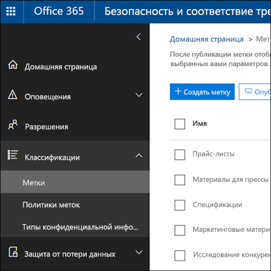

# <a name="overview-of-labels"></a>Обзор меток

В вашей организации наверняка есть контент различных типов, с которым требуется выполнять разные действия для соблюдения отраслевых нормативов и внутренних политик. Например, у вас могут быть:
  
- налоговые декларации, которые необходимо **хранить** не меньше определенного срока; 
    
- материалы для прессы, которые требуется **безвозвратно удалять** по достижении определенной давности; 
    
- исследования конкурентов, которые требуется **сохранять**, а затем **окончательно удалять**; 
    
- рабочие визы, которые требуется **отмечать как записи**, чтобы их невозможно было редактировать и удалять. 
    
Во всех вышеописанных случаях метки в Office 365 помогут вам выполнять с контентом действия, соответствующие его характеру. Используя метки, вы можете классифицировать данные в организации для системы управления и применять правила хранения на основе этой классификации.
  
Используя метки, вы можете:
  
- **Разрешить пользователям в организации вручную применять метки** к содержимому в Outlook 2010 и более поздних версий, Outlook в Интернете, OneDrive, SharePoint и группах Office 365. Пользователи часто знают лучше других, с каким содержимым они работают, поэтому могут классифицировать его и применять соответствующие политики. 
    
- **Обеспечить автоматическое применение меток к контенту**, если он соответствует определенным условиям, например если он содержит: 
    
  - конфиденциальную информацию определенных типов;
    
  - определенные ключевые слова, соответствующие созданному запросу.
    
    Возможность автоматически применять метки к контенту важна, потому что:
    
  - вам не придется обучать пользователей работе со всеми категориями;
    
  - вам не нужно будет рассчитывать на то, что пользователи правильно классифицируют весь контент;
    
  - пользователям больше не нужно будет знать о политиках управления данными — они могут сосредоточиться на своей работе.
    
    Обратите внимание, что для автоматического применения меток необходима подписка Office 365 корпоративный E5.
    
- **Применить метку по умолчанию к библиотеке документов** на сайтах групп Office 365 и SharePoint, чтобы все документы в этой библиотеке получали метку по умолчанию. 
    
- **Выполнять управление записями в рамках Office 365**, включая электронную почту и документы. С помощью метки вы можете классифицировать контент как запись. При этом метку невозможно изменить или удалить, как и сам контент. 
    
Создавать метки и управлять ими можно на странице **Метки** в Центре безопасности и соответствия требованиям Office 365. 
  

 
## <a name="how-labels-work-with-label-policies"></a>Как работают метки с политиками

Чтобы сделать метки доступными пользователям в организации и помочь им классифицировать контент, нужно выполнить два действия: сначала создать метки, а затем опубликовать их в выбранных расположениях. При публикации меток создается соответствующая политика.
  

  
Метки — это независимые, пригодные для многократного использования стандартные блоки, включаемые в политику меток и публикуемые в различных расположениях. Одни и те же метки можно использовать во многих политиках. Основное назначение политики меток — сгруппировать набор меток и задать расположения, в которых они должны отображаться.
  

  
1. Публикуя метки, их включают в соответствующую политику. Одну метку можно включить во множество политик.
    
2. Политики меток задают расположения для их публикации.
    
## <a name="only-one-label-at-a-time"></a>По одной метке

Важно понимать, что к такому контенту, как электронные письма и документы, можно применять только по одной метке.
  
- Метки, назначенные вручную пользователями, можно удалять и менять.
    
- Если контенту назначена автоматически применяемая метка, то пользователь может заменить ее на метку, назначенную вручную.
    
- Если пользователь вручную назначил метку контенту, то автоматически применяемая метка не может заменить ее.
    
- Если имеется ряд правил, назначающих автоматически применяемую метку, а контент соответствует условиям нескольких из них, назначается метка самого старого правила.
    
Метки, назначаемые вручную, применяются явно. Автоматически применяемые метки назначаются неявно. Приоритет явной метки выше, чем неявной. Дополнительные сведения см. в разделе [Принципы хранения и приоритеты](labels.md#principles) ниже.
  
## <a name="how-long-it-takes-for-labels-to-take-effect"></a>Срок вступления меток в силу

При публикации автоматически применяемые метки не сразу вступают в силу.
  
1. Для начала необходимо синхронизировать политику меток с расположениями при помощи Центра безопасности и соответствия требованиям.
    
2. Затем может потребоваться некоторое время, чтобы вручную применяемые метки стали доступны пользователям либо автоматические метки были применены к контенту. Это время зависит от расположения и типа метки.
    
### <a name="manual-labels"></a>Метки, применяемые вручную

При публикации меток в SharePoint или OneDrive могут потребоваться сутки, чтобы эти метки стали видны пользователям. Кроме того, при публикации меток в Exchange может потребоваться 7 дней, чтобы эти метки стали видны пользователям, а почтовый ящик должен содержать не менее 10 МБ данных.
  

  
### <a name="auto-apply-labels"></a>Автоматически применяемые метки

Если метки автоматически применяются к контенту, соответствующему определенным условиям, может потребоваться семь дней, чтобы метки были применены ко всему контенту, соответствующему условиям.
  

  
### <a name="how-to-check-on-the-status-of-exchange-labels"></a>Как проверить состояние меток Exchange

В Exchange Online метки становятся доступны пользователям в ходе процесса, выполняемого каждые семь дней. С помощью Powershell можно узнать, когда этот процесс выполнялся в прошлый раз, и определить, когда он запустится снова.
  
1. [Подключение к Exchange Online PowerShell](https://go.microsoft.com/fwlink/?linkid=799773).
    
2. Выполните следующие команды:
    
  ```
  $logProps = Export-MailboxDiagnosticLogs <user> -ExtendedProperties
  ```

  ```
  $xmlprops = [xml]($logProps.MailboxLog)
  ```

  ```
  $xmlprops.Properties.MailboxTable.Property | ? {$_.Name -like "ELC*"}
  ```

    Свойство `ELCLastSuccessTimeStamp` (UTC) в результатах указывает, когда система обрабатывала почтовый ящик в последний раз. Если это не происходило с момента создания политики, то метки не будут видны. Для принудительной обработки выполните команду `Start-ManagedFolderAssistant -Identity <user>`.
    
    Если метки не отображаются в Outlook в Интернете, хотя они должны быть видны, очистите кэш браузера (CTRL+F5).
    
## <a name="label-policies-and-locations"></a>Политики и расположения меток

Метки различных типов можно публиковать в разных расположениях, зависящих от назначения метки.
  
|**Тип метки**|**Сфера применения политики меток**|
|:-----|:-----|
|Публикуемая для пользователей  <br/> |Exchange, SharePoint, OneDrive, группы Office 365  <br/> |
|Автоматически применяемая в соответствии с типами конфиденциальной информации  <br/> |Exchange (только ко всем почтовым ящикам), SharePoint, OneDrive  <br/> |
|Автоматически применяемая по запросу  <br/> |Exchange, SharePoint, OneDrive, группы Office 365  <br/> |
   
Обратите внимание, что в Exchange автоматически применяемые метки (как для запросов, так и для типов конфиденциальной информации) применяются только к новым отправленным сообщениям (данным при передаче), а не ко всем текущим элементам почтового ящика (неактивным данным). Кроме того, автоматически применяемые метки типов конфиденциальной информации могут применяться только ко всем почтовым ящикам. Выбрать отдельные почтовые ящики невозможно.
  
Обратите внимание, что общедоступные папки Exchange и Skype не поддерживают метки.
  
## <a name="how-labels-enforce-retention"></a>Как метки способствуют хранению

Метки могут выполнять точно те же действия, что и политика хранения. С помощью меток вы можете реализовать сложный план контента (или план файлов). Дополнительные сведения о том, как работает хранение, см. в статье [Обзор политик хранения](retention-policies.md).
  
Кроме того, для меток предусмотрено два варианта хранения, недоступных в политиках хранения. С помощью метки вы можете:
  
- вызвать проверку перед ликвидацией в конце периода хранения, чтобы документы SharePoint и OneDrive требовалось проверять перед удалением. Дополнительные сведения см. в статье [Общие сведения о проверках перед ликвидацией](disposition-reviews.md).
    
- начинать период хранения с момента добавления метки к контенту, а не с момента создания контента или его последнего изменения.
    

  
## <a name="where-published-labels-can-appear-to-end-users"></a>Где пользователям видны опубликованные метки

Если пользователи назначают метку контенту, ее можно опубликовать в:
  
- Outlook в Интернете;
    
- Outlook 2010 и более поздних версиях;
    
- OneDrive;
    
- SharePoint;
    
- группах Office 365 (как на сайте группы, так и в ее почтовом ящике в Outlook в Интернете).
    
В последующих разделах показано, как метки будут отображаться в различных приложениях для пользователей в вашей организации.
  
### <a name="outlook-on-the-web"></a>Outlook в Интернете;

Чтобы назначить метку элементу в Outlook в Интернете, щелкните его правой кнопкой мыши, нажмите **Назначить политику** и выберите метку. 
  

  
После применения метки ее описание и выполняемые ею действия отображаются в верхней части описания элемента. Если сообщение классифицировано и с ним связан период хранения, вы можете сразу понять, когда истекает срок его действия.
  

  
Вы также можете применять метки к папкам. В этом случае:
  
- ко всем элементам в папке автоматически применяется одна и та же метка, **за исключением** элементов, к которым явно применены другие метки. У таких элементов остаются имеющиеся метки. Дополнительные сведения см. ниже в разделе, посвященном принципам хранения; 
    
- если изменить или удалить используемую по умолчанию метку папки, также меняются или удаляются метки всех элементов в этой папке, **кроме** элементов с явными метками; 
    
- если переместить элемент с меткой по умолчанию в другую папку, к которой по умолчанию применяется другая метка, к элементу будет применена новая метка по умолчанию;
    
- если переместить элемент со стандартной меткой в другую папку, к которой по умолчанию не применяется метка, старая стандартная метка удаляется.
    
### <a name="outlook-2010-and-later"></a>Outlook 2010 и более поздних версиях;

Чтобы назначить метку элементу в Outlook в Интернете, щелкните его правой кнопкой мыши, на **ленте** нажмите кнопку **Назначить политику** и выберите метку. 
  

  
После применения метки ее описание и выполняемые ею действия отображаются в верхней части описания элемента. Если сообщение классифицировано и с ним связан период хранения, вы можете сразу понять, когда истекает срок его действия.
  
Вы также можете применять метки к папкам. Это одинаково работает как в Outlook 2010 и более поздних версиях, так и в Outlook в Интернете. Дополнительные сведения см. в предыдущем разделе.
  
### <a name="onedrive-and-sharepoint"></a>OneDrive и SharePoint

Чтобы применить метку к документу (включая файлы OneNote) в OneDrive или SharePoint, выберите элемент, в правом верхнем углу нажмите **Открыть область сведений** \> **Применить метку** и выберите метку. 
  
Обратите внимание, что вы можете применить метку к папке или набору документов, а также задать метку по умолчанию для библиотеки документов. Дополнительные сведения см. ниже.
  

  
Применив метку к элементу, вы можете просмотреть ее в области сведений при выборе этого элемента.
  

  
Вы также можете создать представление библиотеки, содержащей столбец **Метки** или **Элемент является записью**, чтобы вы могли сразу видеть, какие метки назначены всем элементам и какие элементы являются записями. Однако следует помнить, что представление невозможно отфильтровать по столбцу **Элемент является записью**. 
  

  
### <a name="office-365-groups"></a>Группы Office 365

Когда вы публикуете метки в группе Office 365, они отображаются как на сайте группы, так и в почтовом ящике группы в Outlook в Интернете. Процесс применения метки к контенту идентичен показанному выше процессу для электронных сообщений и документов.
  
## <a name="applying-a-label-automatically-based-on-conditions"></a>Автоматическое применение метки в соответствии с условиями

Одна из самых полезных функций меток — возможность автоматически применять их к контенту, соответствующему определенным условиям. В этом случае пользователям в организации не требуется применять метки — Office 365 делает это за них.
  

  
Автоматически применяемые метки удобны, потому что:
  
- вам не придется обучать пользователей работе со всеми категориями;
    
- вам не нужно будет рассчитывать на то, что пользователи правильно классифицируют весь контент;
    
- пользователям больше не нужно будет знать о политиках управления данными — они могут сосредоточиться на своей работе.
    
Вы можете автоматически применять метки к контенту, содержащему:
  
- конфиденциальную информацию определенных типов;
    
- определенные ключевые слова, соответствующие созданному запросу.
    

  
Обратите внимание, что для автоматического применения меток необходима подписка Office 365 корпоративный E5, а для их применения ко всему контенту, соответствующему условиям, может потребоваться до семи дней, как упоминалось ранее.
  
### <a name="auto-apply-labels-to-content-with-specific-types-of-sensitive-information"></a>Автоматическое применение меток к контенту с определенными типами конфиденциальной информации

При создании автоматически применяемых меток для конфиденциальной информации отображается тот же список шаблонов политики, что и при создании политики защиты от потери данных (DLP). Каждый шаблон политики заранее настроен для поиска конфиденциальной информации определенных типов. Например, показанный ниже шаблон ищет индивидуальные идентификационные номера налогоплательщиков, SSN и номера паспортов граждан США. Дополнительные сведения о DLP см. в статье [Общие сведения о политиках защиты от потери данных](data-loss-prevention-policies.md).
  

  
Выбрав шаблон политики, вы можете добавлять или удалять конфиденциальную информацию любых типов, а также менять количество экземпляров и точность совпадения. В приведенном ниже примере метка будет автоматически применяться, только если:
  
- контент содержит от 1 до 9 экземпляров любого из этих трех типов конфиденциальной информации. Вы можете удалить **максимальное** значение, чтобы оно изменилось на **Любое**;
    
- для определяемого типа конфиденциальной информации задана точность совпадения (или уровень надежности) не менее 75. Для многих типов конфиденциальной информации определяется несколько шаблонов. Чем выше точность совпадения, тем больше признаков (например, ключевых слов, дат или адресов) нужно для обнаружения шаблона. Проще говоря, чем ниже **минимальная** точность совпадения, тем проще сопоставить контент с условием. 
    
    В случае изменения точности совпадения (или уровня надежности) следует использовать один из уровней надежности, используемых в шаблоне для этого типа конфиденциальной информации, как описано в статье [Что позволяют искать типы конфиденциальной информации](what-the-sensitive-information-types-look-for.md).
    

  
### <a name="auto-apply-labels-to-content-with-keywords-or-searchable-properties"></a>Автоматическое применение меток к контенту с ключевыми словами или доступными для поиска свойствами

Вы можете автоматически применять метки к контенту, соответствующему определенным условиям. Имеющиеся в данный момент условия поддерживают применение метки к контенту, содержащему определенные слова, фразы или значения доступных для поиска свойств. Вы можете уточнить запрос с помощью таких операторов поиска, как AND, OR и NOT. 

Дополнительные сведения о синтаксисе запросов см. в статье:

- [Руководство по синтаксису языка запросов по ключевым словам (KQL)](https://docs.microsoft.com/ru-RU/sharepoint/dev/general-development/keyword-query-language-kql-syntax-reference)

Метки на основе запросов используют индекс поиска для определения контента. Дополнительные сведения о допустимых свойствах, доступных для поиска, см. в статьях:

- [Запросы ключевых слов и условия поиска контента](keyword-queries-and-search-conditions.md)
- [Обзор свойств для обхода и управляемых свойств в SharePoint Server](https://docs.microsoft.com/ru-RU/SharePoint/technical-reference/crawled-and-managed-properties-overview)
  
Примеры запросов:

- Exchange
    - subject:"Квартальное финансирование"
    - recipients:garthf<!--nolink-->@contoso.com

- SharePoint и OneDrive для бизнеса
    - contenttype:контракт
    - site:https<!--nolink-->://contoso.sharepoint.com/sites/teams/procurement AND contenttype:контракт
  

  
## <a name="applying-a-default-label-to-all-content-in-a-sharepoint-library-folder-or-document-set"></a>Применение метки по умолчанию ко всему контенту в библиотеке SharePoint, папке или набору документов

Вы можете не только разрешить пользователям применять метки к отдельным документам, но и назначить метку по умолчанию библиотеке SharePoint, папке или набору документов, чтобы эта метка применялась ко всем документам в этом расположении.
  
В случае библиотек документов это делается на странице **Параметры библиотеки**. Выбрав метку по умолчанию, вы также можете применить ее ко всем имеющимся в библиотеке элементам. 
  
Например, если у вас есть тег для маркетинговых материалов и вы знаете, что определенная библиотека документов будет содержать контент только этого типа, то вы можете сделать тег маркетинговых материалов стандартным для всех документов в этой библиотеке.
  

  
Если вы применяете метку по умолчанию к имеющимся элементам в библиотеке, папке или наборе документов:
  
- ко всем элементам в библиотеке, папке или наборе документов автоматически применяется одна и та же метка, **за исключением** элементов, к которым явно применены другие метки. У таких элементов остаются имеющиеся метки. Дополнительные сведения см. ниже в разделе [Принципы хранения и приоритеты](labels.md#principles);
    
- если изменить или удалить используемую по умолчанию метку библиотеки, папки или набора документов, также меняются или удаляются метки всех элементов в этих библиотеке, папке или наборе документов, **кроме** элементов с явными метками; 
    
- если переместить элемент с меткой по умолчанию в другую библиотеку, папку или другой набор документов, то у элемента останется текущая метка по умолчанию, даже если к новому расположению применяется другая метка по умолчанию.
    
## <a name="applying-a-label-to-email-by-using-rules"></a>Применение метки к электронному сообщению с помощью правил

В Outlook 2010 и более поздних версиях можно создавать правила, применяемые к метке или политике хранения.
  
Например, вы можете создать правило, которое применяет ту или иную метку ко всем сообщениям, отправляемым в определенную группу рассылки или из нее.
  
Чтобы создать правило, щелкните элемент правой кнопкой мыши и выберите **Правила** \> **Создать правило** \> **Дополнительные параметры** \> **Мастер правил** \> **Применить политику хранения**.
  

  
## <a name="classifying-content-without-applying-any-actions"></a>Классификация контента без применения действий

Создавая метку, вы можете не включать хранение или другие действия, как показано ниже. В этом случае метку можно использовать исключительно как текстовую подпись, не выполняющую никаких действий.
  
Например, вы можете создать метку под названием "Просмотреть позже" без действий, а затем автоматически применять эту метку к контенту с конфиденциальной информацией или запрашиваемому контенту.
  

  
## <a name="using-labels-for-records-management"></a>Использование меток для управления записями

На высоком уровне управление записями означает, что:
  
- важный контент классифицируется пользователями как запись;
    
- запись невозможно изменить или удалить;
    
- записи окончательно ликвидируются по истечении их заявленного срока действия.
    
Вы можете использовать метки для реализации единой, согласованной стратегии управления записями в Office 365, в том время как другие функции управления записями, например центр записей, применяются только к контенту в SharePoint. А вы можете применять действия хранения к записям, чтобы они автоматически ликвидировались в конце их жизненного цикла.
  
Создавая метку, вы можете использовать метку для классификации контента в качестве записи.
  

  
Если элемент помечен как запись:
  
- элемент невозможно безвозвратно удалить;
    
- элемент невозможно изменить;
    
- метку невозможно изменить;
    
- метку невозможно удалить.
    
### <a name="who-can-classify-content-as-a-record"></a>Кто может классифицировать контент как записи

В случае контента SharePoint любой пользователь из стандартной группы "Участники" (с уровнем разрешений "Участие") может применить метку записи к контенту. Только администратор семейства веб-сайтов может удалить или изменить метку после ее применения. Кроме того, метки, классифицирующие контент как запись, необходимо применять вручную. Их невозможно применять автоматически.
  
### <a name="records-and-folders"></a>Записи и папки

Вы можете применить метку к папке в Exchange, SharePoint или OneDrive. Если папка отмечена как запись, а вы перемещаете в эту папку элемент, то этот элемент будет отмечен как запись. При перемещении элемента за пределы папки он останется отмеченным как запись.
  
### <a name="records-cant-be-deleted"></a>Записи невозможно удалять

При попытке удалить запись в Exchange элемент перемещается в папку "Элементы с возможностью восстановления", как описано в разделе [Что делает политика хранения с содержимым на месте](retention-policies.md#how-a-retention-policy-works-with-content-in-place).
  
При попытке удалить запись в SharePoint возникает ошибка с сообщением о том, что элемент не был удален и остается в библиотеке.
  

  
При попытке удалить запись в OneDrive элемент перемещается в архивную библиотеку, как описано в разделе [Что делает политика хранения с содержимым на месте](retention-policies.md#how-a-retention-policy-works-with-content-in-place).
  
## <a name="using-a-label-as-a-condition-in-a-dlp-policy"></a>Использование метки в качестве условия в политике защиты от потери данных

Метка может применять действия по **хранению** контента. Кроме того, вы можете использовать метку как условие в политике защиты от потери данных (DLP). Это означает, что политика защиты от потери данных может применять действия по **защите** (например, ограничение доступа) к контенту с определенной меткой. 
  
Дополнительные сведения см. в разделе [Использование метки в качестве условия в политике защиты от потери данных](data-loss-prevention-policies.md#using-a-label-as-a-condition-in-a-dlp-policy).
  
## <a name="using-the-label-activity-explorer-and-the-data-governance-reports"></a>Использование обозревателя действий с метками и отчетов об управлении данными

После публикации и автоматического применения меток вам нужно убедиться, что они применяются к контенту, как планировалось. Для отслеживания меток можно использовать следующие средства:
  
- **Обозреватель действий с метками**. С помощью обозревателя (показанного ниже) вы можете быстро находить и просматривать действия с метками для всего контента в SharePoint и OneDrive для бизнеса за последние 30 дней. Дополнительные сведения см. в статье [Просмотр действий с метками для документов](view-label-activity-for-documents.md).
    
- **Отчеты об управлении данными**. С помощью этих отчетов вы можете быстро просматривать тенденции и действия с метками для всего контента в Exchange, SharePoint и OneDrive для бизнеса за последние 90 дней. Дополнительные сведения см. в статье [Просмотр отчетов об управлении данными](view-the-data-governance-reports.md).
    

  
## <a name="using-content-search-to-find-all-content-with-a-specific-label-applied-to-it"></a>Использование средства "Поиск контента" для поиска содержимого с определенной меткой

Когда метки будут назначены содержимому (либо пользователями, либо автоматически), вы можете использовать средство "Поиск контента" в Центре безопасности и соответствия требованиям, чтобы найти весь контент с определенной меткой.
  

  
Создавая запрос на поиск контента, выберите условие **Тег соответствия требованиям**, а затем укажите полное имя метки либо введите его часть и используйте подстановочный знак. Дополнительные сведения см. в статье [Запросы ключевых слов и условия поиска контента](keyword-queries-and-search-conditions.md).
  

  
## <a name="the-principles-of-retention-or-what-takes-precedence"></a>Принципы хранения и приоритеты

Возможно (и даже вероятно), что к содержимому применено несколько политик хранения с разными действиями (хранением и/или удалением) и периодом хранения. Какая политика имеет приоритет? Во-первых, вы можете быть уверены, что содержимое, сохраняемое одной политикой, не может быть безвозвратно удалено другой.
  

  
Чтобы понять, как различные метки с действиями хранения применяются к контенту, запомните следующие принципы хранения:
  
1. **Хранение имеет приоритет перед удалением.** Допустим, одна политика хранения предписывает удаление электронной почты Exchange спустя три года, а другая — ее хранение в течение пяти лет с последующим удалением. Весь контент трехлетней давности будет удален и скрыт от пользователя, но останется в папке "Элементы с возможностью восстановления", пока его возраст не достигнет пяти лет, после чего он будет окончательно удален. 
    
2. **Самый продолжительный период хранения имеет приоритет.** Если к содержимому применено несколько политик, сохраняющих его, оно будет храниться до окончания самого длительного периода хранения. 
    
3. **Явное включение имеет приоритет перед неявным.** Это означает следующее: 
    
    1. Если пользователь вручную назначает метку с параметрами хранения элементу, например электронному сообщению Exchange или документу OneDrive, эта метка имеет приоритет как перед политикой, назначенной на уровне сайта или почтового ящика, так и перед стандартной меткой, назначенной библиотекой документов. Например, если явная метка предписывает хранение в течение десяти лет, но политика, назначенная сайту, предписывает хранение только в течение пяти лет, то метка имеет приоритет. Обратите внимание, что автоматически применяемые метки считаются неявными, потому что их автоматически применяет Office 365.
    
    2. Если политика хранения включает определенное расположение, например учетную запись OneDrive для бизнеса или почтовый ящик конкретного пользователя, то эта политика имеет приоритет перед другой политикой хранения, которая применяется к учетным записям OneDrive для бизнеса или почтовым ящикам всех пользователей, но не включает почтовый ящик именно этого пользователя.
    
4. **Кратчайший период удаления имеет приоритет.** Если же к содержимому применено несколько политик, удаляющих его (без хранения), то оно будет удалено по истечении кратчайшего периода хранения. 
    
Следует понимать, что принципы хранения используются как поток разрешения конфликтов (сверху вниз): если правила, применяемые всеми политиками или метками, совпадают на одном уровне, то поток переходит на уровень ниже, чтобы определить приоритет применения правил.
  
Наконец, политика хранения или метка не может безвозвратно удалить какой-либо контент, находящийся на удержании для обнаружения электронных данных. При снятии удержания контент снова становится доступен для вышеописанного процесса очистки.
  
## <a name="use-labels-instead-of-these-features"></a>Использование меток вместо этих функций

Метки легко сделать доступными всей организации и ее контенту в Office 365, включая Exchange, SharePoint, OneDrive и группы Office 365. Если вам нужно классифицировать контент или управлять записями в какой-либо службе из Office 365, рекомендуем использовать метки.
  
Существует ряд других функций, которые в прошлом использовались для классификации контента или управления записями в Office 365. Они перечислены ниже. Эти функции продолжат работать наряду с метками, созданными в Центре безопасности и соответствия требованиям. Обратите внимание, что хотя в некоторых аспектах метки реализованы не так, как старые функции, развитие меток будет определять будущие принципы управления записями в Office 365. Следовательно, в дальнейшем для управления данными рекомендуем использовать метки, а не устаревшие функции.
  
### <a name="exchange-online"></a>Exchange Online

- [Теги и политики хранения](https://go.microsoft.com/fwlink/?linkid=846125), также называемые средствами [управления записями сообщений (MRM)](https://go.microsoft.com/fwlink/?linkid=846126) (только для удаления) 
    
### <a name="sharepoint-online-and-onedrive-for-business"></a>SharePoint Online и OneDrive для бизнеса

- [Настройка управления записями на месте](https://support.office.com/article/7707a878-780c-4be6-9cb0-9718ecde050a) (хранение) 
    
- [Общие сведения о центре записей](https://support.office.com/article/bae6ca5a-7b19-40e0-b433-e3613a747c2c) (хранение) 
    
- [Политики управления информацией](intro-to-info-mgmt-policies.md) (только удаление) 
    
## <a name="permissions"></a>Разрешения

Участникам вашей команды по обеспечению соответствия требованиям, которые будут создавать метки, необходимы разрешения на доступ к Центру безопасности и соответствия требованиям. По умолчанию администратор клиента будет иметь доступ к этому расположению и может предоставлять ответственным за обеспечение соответствия требованиям доступ к Центру безопасности и соответствия требованиям, не предоставляя им все разрешения администратора клиента. Для этого рекомендуем вам перейти на страницу **Разрешения** в Центре безопасности и соответствия требованиям, изменить группу ролей **Администратор соответствия требованиям** и добавить участников в эту группу ролей. 
  
Дополнительные сведения см. в статье [Предоставление пользователям доступа к Центру безопасности и соответствия требованиям Office 365](grant-access-to-the-security-and-compliance-center.md).
  
Эти разрешения необходимы только для создания и применения меток и соответствующей политики. Для применения политики не требуется доступ к контенту.
  
## <a name="find-the-powershell-cmdlets-for-labels"></a>Командлеты PowerShell для работы с метками

Чтобы использовать командлеты для работы с метками, необходимо:
  
1. [Подключиться к Центру безопасности и соответствия требованиям Office 365 с помощью удаленного сеанса PowerShell](http://go.microsoft.com/fwlink/?LinkID=799771&amp;clcid=0x409).
    
2. Используйте эти [командлеты Центра безопасности и соответствия требованиям Office 365](http://go.microsoft.com/fwlink/?LinkID=799772&amp;clcid=0x409).
    
## <a name="more-information"></a>Дополнительные сведения

- [Обзор политик хранения](retention-policies.md)
    

