# <a name="overview-of-retention-labels"></a><span data-ttu-id="895cd-105">Обзор меток хранения</span><span class="sxs-lookup"><span data-stu-id="895cd-105">Overview of retention labels</span></span>

<span data-ttu-id="895cd-p102">В вашей организации наверняка есть контент различных типов, с которым требуется выполнять разные действия для соблюдения отраслевых нормативов и внутренних политик. Например, у вас могут быть:</span><span class="sxs-lookup"><span data-stu-id="895cd-p102">Across your organization, you probably have different types of content that require different actions taken on them in order to comply with industry regulations and internal policies. For example, you might have:</span></span>
  
- <span data-ttu-id="895cd-108">налоговые декларации, которые необходимо **хранить** не меньше определенного срока;</span><span class="sxs-lookup"><span data-stu-id="895cd-108">Tax forms that need to be **retained** for a minimum period of time.</span></span> 
    
- <span data-ttu-id="895cd-109">материалы для прессы, которые требуется **безвозвратно удалять** по достижении определенной давности;</span><span class="sxs-lookup"><span data-stu-id="895cd-109">Press materials that need to be **permanently deleted** when they reach a certain age.</span></span> 
    
- <span data-ttu-id="895cd-110">исследования конкурентов, которые требуется **сохранять**, а затем **окончательно удалять**;</span><span class="sxs-lookup"><span data-stu-id="895cd-110">Competitive research that needs to be both **retained** and then **permanently deleted**.</span></span> 
    
- <span data-ttu-id="895cd-111">рабочие визы, которые требуется **отмечать как записи**, чтобы их невозможно было редактировать и удалять.</span><span class="sxs-lookup"><span data-stu-id="895cd-111">Work visas that must be **marked as a record** so that they can't be edited or deleted.</span></span> 
    
<span data-ttu-id="895cd-p103">Во всех вышеописанных случаях метки хранения в Office 365 помогут вам выполнять с контентом действия, соответствующие его характеру. Используя метки хранения, вы можете классифицировать данные в организации для системы управления и применять правила хранения на основе этой классификации.</span><span class="sxs-lookup"><span data-stu-id="895cd-p103">In all of these cases, retention labels in Office 365 can help you take the right actions on the right content. With retention labels, you can classify data across your organization for governance, and enforce retention rules based on that classification.</span></span>
  
<span data-ttu-id="895cd-114">С помощью меток хранения вы можете:</span><span class="sxs-lookup"><span data-stu-id="895cd-114">With retention labels, you can:</span></span>
  
- <span data-ttu-id="895cd-p104">**Разрешить пользователям в организации вручную применять метки хранения** к содержимому в Outlook 2010 и более поздних версий, Outlook в Интернете, OneDrive, SharePoint и группах Office 365. Пользователи часто знают лучше других, с каким содержимым они работают, поэтому могут классифицировать его и применять соответствующие политики.</span><span class="sxs-lookup"><span data-stu-id="895cd-p104">**Enable people in your organization to apply a retention label manually** to content in Outlook on the web, Outlook 2010 and later, OneDrive, SharePoint, and Office 365 groups. Users often know best what type of content they're working with, so they can classify it and have the appropriate policy applied.</span></span> 
    
- <span data-ttu-id="895cd-117">**Обеспечить автоматическое применение меток хранения к контенту**, если он соответствует определенным условиям, например если он содержит:</span><span class="sxs-lookup"><span data-stu-id="895cd-117">**Apply retention labels to content automatically** if it matches specific conditions, such as when the content contains:</span></span> 
    
  - <span data-ttu-id="895cd-118">конфиденциальную информацию определенных типов;</span><span class="sxs-lookup"><span data-stu-id="895cd-118">Specific types of sensitive information.</span></span>
    
  - <span data-ttu-id="895cd-119">определенные ключевые слова, соответствующие созданному запросу.</span><span class="sxs-lookup"><span data-stu-id="895cd-119">Specific keywords that match a query you create.</span></span>
    
    <span data-ttu-id="895cd-120">Возможность автоматически применять метки хранения к контенту важна, потому что:</span><span class="sxs-lookup"><span data-stu-id="895cd-120">The ability to apply retention labels to content automatically is important because:</span></span>
    
  - <span data-ttu-id="895cd-121">вам не придется обучать пользователей работе со всеми категориями;</span><span class="sxs-lookup"><span data-stu-id="895cd-121">You don't need to train your users on all of your classifications.</span></span>
    
  - <span data-ttu-id="895cd-122">вам не нужно будет рассчитывать на то, что пользователи правильно классифицируют весь контент;</span><span class="sxs-lookup"><span data-stu-id="895cd-122">You don't need to rely on users to classify all content correctly.</span></span>
    
  - <span data-ttu-id="895cd-123">пользователям больше не нужно будет знать о политиках управления данными — они могут сосредоточиться на своей работе.</span><span class="sxs-lookup"><span data-stu-id="895cd-123">Users no longer need to know about data governance policies - they can instead focus on their work.</span></span>
    
    <span data-ttu-id="895cd-124">Обратите внимание, что для автоматического применения меток необходима подписка Office 365 корпоративный E5.</span><span class="sxs-lookup"><span data-stu-id="895cd-124">Note that auto-apply labels require an Office 365 Enterprise E5 subscription.</span></span>
    
- <span data-ttu-id="895cd-125">**Применить метку хранения по умолчанию к библиотеке документов** на сайтах групп Office 365 и SharePoint, чтобы все документы в этой библиотеке получали метку хранения по умолчанию.</span><span class="sxs-lookup"><span data-stu-id="895cd-125">**Apply a default retention label to a document library** in SharePoint and Office 365 group sites, so that all documents in that library get the default retention label.</span></span> 
    
- <span data-ttu-id="895cd-p105">**Выполнять управление записями в рамках Office 365**, включая электронную почту и документы. С помощью метки хранения вы можете классифицировать контент как запись. При этом метку невозможно изменить или удалить, как и сам контент.</span><span class="sxs-lookup"><span data-stu-id="895cd-p105">**Implement records management across Office 365**, including both email and documents. You can use a retention label to classify content as a record. When this happens, the label can't be changed or removed, and the content can't be edited or deleted.</span></span> 
    
<span data-ttu-id="895cd-129">Создавать метки хранения и управлять ими можно на вкладке **Хранение** страницы **Метки** в Центре безопасности и соответствия требованиям Office 365.</span><span class="sxs-lookup"><span data-stu-id="895cd-129">You create and manage retention labels on the **Retention** tab on the **Labels** page in the Office 365 Security &amp; Compliance Center.</span></span> 
  
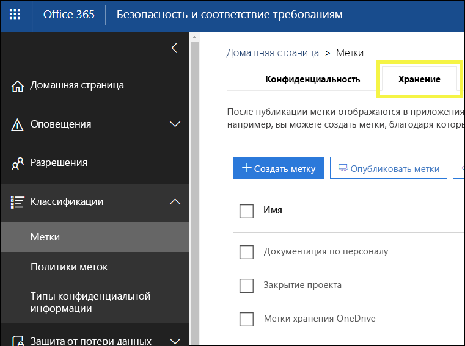
 
## <a name="how-retention-labels-work-with-label-policies"></a><span data-ttu-id="895cd-131">Как работают метки хранения с политиками</span><span class="sxs-lookup"><span data-stu-id="895cd-131">How retention labels work with label policies</span></span>

<span data-ttu-id="895cd-p106">Чтобы сделать метки хранения доступными пользователям в организации и помочь им классифицировать контент, нужно выполнить два действия: сначала создать метки, а затем опубликовать их в выбранных расположениях. При публикации меток хранения создается соответствующая политика.</span><span class="sxs-lookup"><span data-stu-id="895cd-p106">Making retention labels available to people in your organization so that they can classify content is a two-step process: first you create the labels, and then you publish them to the locations you choose. When you publish retention labels, a label policy gets created.</span></span>
  
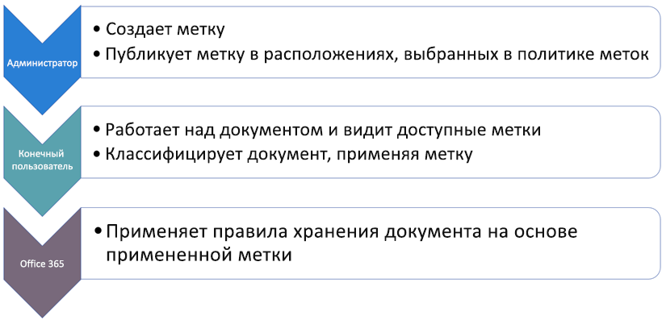
  
<span data-ttu-id="895cd-p107">Метки хранения — это независимые, пригодные для многократного использования стандартные блоки, включаемые в политику меток и публикуемые в различных расположениях. Одни и те же метки хранения можно использовать во многих политиках. Основное назначение политики меток — сгруппировать набор меток хранения и задать расположения, в которых они должны отображаться.</span><span class="sxs-lookup"><span data-stu-id="895cd-p107">Retention labels are independent, reusable building blocks that are included in a label policy and published to different locations. Retention labels can be reused across many policies. The primary purpose of the label policy is to group a set of retention labels and specify the locations where you want those labels to appear.</span></span>
  
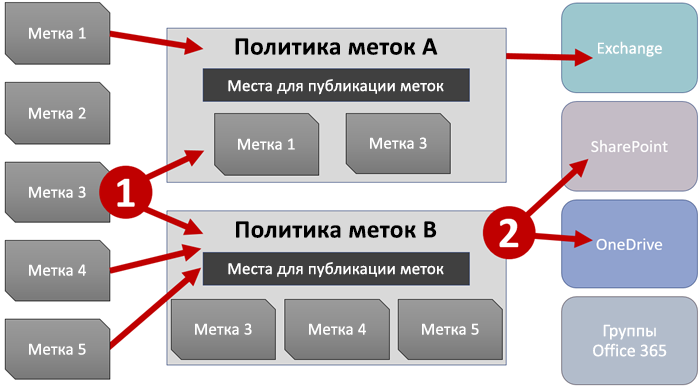
  
1. <span data-ttu-id="895cd-p108">Публикуя метки хранения, их включают в соответствующую политику. Одну метку хранения можно включить во множество политик.</span><span class="sxs-lookup"><span data-stu-id="895cd-p108">When you publish retention labels, they're included in a label policy. A single retention label can be included in many policies.</span></span>
    
2. <span data-ttu-id="895cd-141">Политики меток задают расположения для публикации меток хранения.</span><span class="sxs-lookup"><span data-stu-id="895cd-141">Label policies specify the locations to publish the retention labels.</span></span>
    
## <a name="only-one-retention-label-at-a-time"></a><span data-ttu-id="895cd-142">По одной метке хранения</span><span class="sxs-lookup"><span data-stu-id="895cd-142">Only one retention label at a time</span></span>

<span data-ttu-id="895cd-143">Важно понимать, что к такому контенту, как электронные письма и документы, можно применять только по одной метке хранения.</span><span class="sxs-lookup"><span data-stu-id="895cd-143">It's important to know that content like an email or document can have only a single retention label assigned to it at a time:</span></span>
  
- <span data-ttu-id="895cd-144">Метки хранения, назначенные вручную пользователями, можно удалять и менять.</span><span class="sxs-lookup"><span data-stu-id="895cd-144">For labels assigned manually by end users, people can remove or change the retention label that's assigned.</span></span>
    
- <span data-ttu-id="895cd-145">Если контенту назначена автоматически применяемая метка, то пользователь может заменить ее на метку хранения, назначенную вручную.</span><span class="sxs-lookup"><span data-stu-id="895cd-145">If content has an auto-apply label assigned, an auto-apply label can be replaced by a retention label assigned manually by an end user.</span></span>
    
- <span data-ttu-id="895cd-146">Если пользователь вручную назначил метку хранения контенту, то автоматически применяемая метка не может заменить ее.</span><span class="sxs-lookup"><span data-stu-id="895cd-146">If content has a retention label assigned manually by an end user, an auto-apply label cannot replace the manually assigned retention label.</span></span>
    
- <span data-ttu-id="895cd-147">Если имеется ряд правил, назначающих автоматически применяемую метку, а контент соответствует условиям нескольких из них, назначается метка хранения самого старого правила.</span><span class="sxs-lookup"><span data-stu-id="895cd-147">If there are multiple rules that assign an auto-apply label and content meets the conditions of multiple rules, the retention label for the oldest rule is assigned.</span></span>
    
<span data-ttu-id="895cd-p109">Метки, назначаемые вручную, применяются явно. Автоматически применяемые метки назначаются неявно. Приоритет явной метки хранения выше, чем неявной. Дополнительные сведения см. в разделе [Принципы хранения и приоритеты](labels.md#principles) ниже.</span><span class="sxs-lookup"><span data-stu-id="895cd-p109">Manually assigned labels are explicitly assigned; auto-apply labels are implicitly assigned; an explicit retention label takes precedence over an implicit label. For more information, see the below section on [The principles of retention, or what takes precedence?](labels.md#principles).</span></span>

<span data-ttu-id="895cd-p110">Все сведения этого раздела относятся только к меткам хранения. Обратите внимание, что в дополнение к одной метке хранения к элементу контента также может применяться одна метка конфиденциальности.</span><span class="sxs-lookup"><span data-stu-id="895cd-p110">All of the information in this section applies only to retention labels. Note that an item of content can also have one sensitivity label applied to it, in addition to one retention label.</span></span>
  
## <a name="how-long-it-takes-for-retention-labels-to-take-effect"></a><span data-ttu-id="895cd-152">Срок вступления меток хранения в силу</span><span class="sxs-lookup"><span data-stu-id="895cd-152">How long it takes for retention labels to take effect</span></span>

<span data-ttu-id="895cd-153">При публикации автоматически применяемые метки хранения не сразу вступают в силу.</span><span class="sxs-lookup"><span data-stu-id="895cd-153">When you publish or auto-apply retention labels, they don't take effect immediately:</span></span>
  
1. <span data-ttu-id="895cd-154">Для начала необходимо синхронизировать политику меток с расположениями при помощи Центра безопасности и соответствия требованиям.</span><span class="sxs-lookup"><span data-stu-id="895cd-154">First the label policy needs to be synced from the Security &amp; Compliance Center to the locations in the policy.</span></span>
    
2. <span data-ttu-id="895cd-p111">Затем может потребоваться некоторое время, чтобы вручную применяемые метки стали доступны пользователям либо автоматические метки были применены к контенту. Это время зависит от расположения и типа метки.</span><span class="sxs-lookup"><span data-stu-id="895cd-p111">Then the location may require time to make manual labels available to end users or auto-apply labels to content. How long this takes depends on the location and type of label.</span></span>
    
### <a name="manual-retention-labels"></a><span data-ttu-id="895cd-157">Метки хранения, применяемые вручную</span><span class="sxs-lookup"><span data-stu-id="895cd-157">Manual retention labels</span></span>

<span data-ttu-id="895cd-p112">При публикации меток хранения в SharePoint или OneDrive могут потребоваться сутки, чтобы эти метки хранения стали видны пользователям. Кроме того, при публикации меток хранения в Exchange может потребоваться 7 дней, чтобы эти метки хранения стали видны пользователям, а почтовый ящик должен содержать не менее 10 МБ данных.</span><span class="sxs-lookup"><span data-stu-id="895cd-p112">If you publish retention labels to SharePoint or OneDrive, it can take one day for those retention labels to appear for end users. In addition, if you publish retention labels to Exchange, it can take 7 days for those retention labels to appear for end users, and the mailbox needs to contain at least 10 MB of data.</span></span>
  
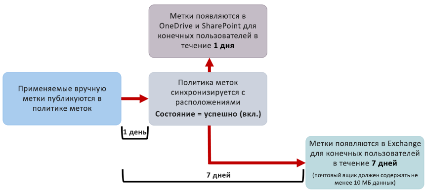
  
### <a name="auto-apply-retention-labels"></a><span data-ttu-id="895cd-161">Метки хранения, применяемые автоматически</span><span class="sxs-lookup"><span data-stu-id="895cd-161">Auto-apply retention labels</span></span>

<span data-ttu-id="895cd-162">Если метки хранения автоматически применяются к контенту, соответствующему определенным условиям, может потребоваться семь дней, чтобы метки хранения были применены ко всему контенту, соответствующему условиям.</span><span class="sxs-lookup"><span data-stu-id="895cd-162">If you auto-apply retention labels to content matching specific conditions, it can take seven days for the retention labels to be applied to all content that matches the conditions.</span></span>
  
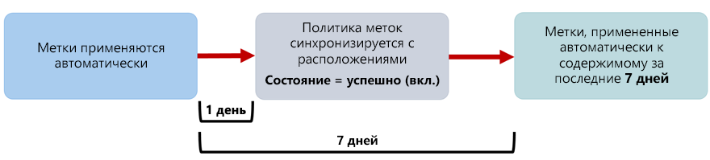
  
### <a name="how-to-check-on-the-status-of-exchange-labels"></a><span data-ttu-id="895cd-164">Как проверить состояние меток Exchange</span><span class="sxs-lookup"><span data-stu-id="895cd-164">How to check on the status of Exchange labels</span></span>

<span data-ttu-id="895cd-p113">В Exchange Online метки хранения становятся доступны пользователям в ходе процесса, выполняемого каждые семь дней. С помощью Powershell можно узнать, когда этот процесс выполнялся в прошлый раз, и определить, когда он запустится снова.</span><span class="sxs-lookup"><span data-stu-id="895cd-p113">In Exchange Online, retention labels are made available to end users by a process that runs every seven days. By using Powershell, you can see when this process last ran and thus determine when it will run again.</span></span>
  
1. <span data-ttu-id="895cd-167">[Подключение к Exchange Online PowerShell](https://go.microsoft.com/fwlink/?linkid=799773).</span><span class="sxs-lookup"><span data-stu-id="895cd-167">[Connect to Exchange Online PowerShell](https://go.microsoft.com/fwlink/?linkid=799773).</span></span>
    
2. <span data-ttu-id="895cd-168">Выполните следующие команды:</span><span class="sxs-lookup"><span data-stu-id="895cd-168">Run these commands.</span></span>
    
  ```
  $logProps = Export-MailboxDiagnosticLogs <user> -ExtendedProperties
  ```

  ```
  $xmlprops = [xml]($logProps.MailboxLog)
  ```

  ```
  $xmlprops.Properties.MailboxTable.Property | ? {$_.Name -like "ELC*"}
  ```

<span data-ttu-id="895cd-p114">Свойство `ELCLastSuccessTimeStamp` (UTC) в результатах указывает, когда система обрабатывала почтовый ящик в последний раз. Если это не происходило с момента создания политики, то метки не будут видны. Для принудительной обработки выполните команду `Start-ManagedFolderAssistant -Identity <user>`.</span><span class="sxs-lookup"><span data-stu-id="895cd-p114">In the results, the  `ELCLastSuccessTimeStamp` (UTC) property shows when the system last processed your mailbox. If it has not happened since the time you created the policy, the labels are not going to appear. To force processing, run  `Start-ManagedFolderAssistant -Identity <user>`.</span></span>
    
<span data-ttu-id="895cd-172">Если метки не отображаются в Outlook в Интернете, хотя они должны быть видны, очистите кэш браузера (CTRL+F5).</span><span class="sxs-lookup"><span data-stu-id="895cd-172">If labels aren't appearing in Outlook on the web and you think they should be, make sure to clear the cache in your browser (CTRL+F5).</span></span>
    
## <a name="label-policies-and-locations"></a><span data-ttu-id="895cd-173">Политики и расположения меток</span><span class="sxs-lookup"><span data-stu-id="895cd-173">Label policies and locations</span></span>

<span data-ttu-id="895cd-174">Метки хранения различных типов можно публиковать в разных расположениях, зависящих от назначения метки хранения.</span><span class="sxs-lookup"><span data-stu-id="895cd-174">Different types of retention labels can be published to different locations, depending on what the retention label does.</span></span>
  
|<span data-ttu-id="895cd-175">**Тип метки хранения**</span><span class="sxs-lookup"><span data-stu-id="895cd-175">**If the retention label is…**</span></span>|<span data-ttu-id="895cd-176">**Сфера применения политики меток**</span><span class="sxs-lookup"><span data-stu-id="895cd-176">**Then the label policy can be applied to…**</span></span>|
|:-----|:-----|
|<span data-ttu-id="895cd-177">Публикуемая для пользователей</span><span class="sxs-lookup"><span data-stu-id="895cd-177">Published to end users</span></span>  <br/> |<span data-ttu-id="895cd-178">Exchange, SharePoint, OneDrive, группы Office 365</span><span class="sxs-lookup"><span data-stu-id="895cd-178">Exchange, SharePoint, OneDrive, Office 365 groups</span></span>  <br/> |
|<span data-ttu-id="895cd-179">Автоматически применяемая в соответствии с типами конфиденциальной информации</span><span class="sxs-lookup"><span data-stu-id="895cd-179">Auto-applied based on sensitive information types</span></span>  <br/> |<span data-ttu-id="895cd-180">Exchange (только ко всем почтовым ящикам), SharePoint, OneDrive</span><span class="sxs-lookup"><span data-stu-id="895cd-180">Exchange (all mailboxes only), SharePoint, OneDrive</span></span>  <br/> |
|<span data-ttu-id="895cd-181">Автоматически применяемая по запросу</span><span class="sxs-lookup"><span data-stu-id="895cd-181">Auto-applied based on a query</span></span>  <br/> |<span data-ttu-id="895cd-182">Exchange, SharePoint, OneDrive, группы Office 365</span><span class="sxs-lookup"><span data-stu-id="895cd-182">Exchange, SharePoint, OneDrive, Office 365 groups</span></span>  <br/> |
   
<span data-ttu-id="895cd-p115">Обратите внимание, что в Exchange автоматически применяемые метки хранения (как для запросов, так и для типов конфиденциальной информации) применяются только к новым отправленным сообщениям (данным при передаче), а не ко всем текущим элементам почтового ящика (неактивным данным). Кроме того, автоматически применяемые метки хранения типов конфиденциальной информации могут применяться только ко всем почтовым ящикам. Выбрать отдельные почтовые ящики невозможно.</span><span class="sxs-lookup"><span data-stu-id="895cd-p115">Note that in Exchange, auto-apply retention labels (for both queries and sensitive information types) are applied only to messages newly sent (data in transit), not to all items currently in the mailbox (data at rest). Also, auto-apply retention labels for sensitive information types can apply only to all mailboxes; you can't select the specific mailboxes.</span></span>
  
<span data-ttu-id="895cd-185">Обратите внимание, что общедоступные папки Exchange и Skype не поддерживают метки.</span><span class="sxs-lookup"><span data-stu-id="895cd-185">Note that Exchange public folders and Skype do not support labels.</span></span>
  
## <a name="how-retention-labels-enforce-retention"></a><span data-ttu-id="895cd-186">Как метки хранения способствуют хранению</span><span class="sxs-lookup"><span data-stu-id="895cd-186">How retention labels enforce retention</span></span>

<span data-ttu-id="895cd-p116">Метки хранения могут выполнять точно те же действия, что и политика хранения. С помощью меток хранения вы можете реализовать сложный план контента (или план файлов). Дополнительные сведения о том, как работает хранение, см. в статье [Обзор политик хранения](retention-policies.md).</span><span class="sxs-lookup"><span data-stu-id="895cd-p116">Retention labels can enforce exactly the same retention actions that a retention policy can. You can use retention labels to implement a sophisticated content plan (or file plan). For more information on how retention works, see [Overview of retention policies](retention-policies.md).</span></span>
  
<span data-ttu-id="895cd-p117">Кроме того, для меток хранения предусмотрено два варианта хранения, недоступных в политиках хранения. С помощью метки хранения вы можете:</span><span class="sxs-lookup"><span data-stu-id="895cd-p117">In addition, a retention label has two retention options that are available only in a retention label and not in a retention policy. With a retention label, you can:</span></span>
  
- <span data-ttu-id="895cd-p118">вызвать проверку перед ликвидацией в конце периода хранения, чтобы документы SharePoint и OneDrive требовалось проверять перед удалением. Дополнительные сведения см. в статье [Общие сведения о проверках перед ликвидацией](disposition-reviews.md).</span><span class="sxs-lookup"><span data-stu-id="895cd-p118">Trigger a disposition review at the end of the retention period, so that SharePoint and OneDrive documents must be reviewed before they can be deleted. For more information, see [Overview of disposition reviews](disposition-reviews.md).</span></span>
    
- <span data-ttu-id="895cd-194">начинать период хранения с момента добавления метки к контенту, а не с момента создания контента или его последнего изменения.</span><span class="sxs-lookup"><span data-stu-id="895cd-194">Start the retention period from when the content was labeled, instead of the age of the content or when it was last modified.</span></span>
    

  
## <a name="where-published-retention-labels-can-appear-to-end-users"></a><span data-ttu-id="895cd-196">Где пользователям видны опубликованные метки хранения</span><span class="sxs-lookup"><span data-stu-id="895cd-196">Where published retention labels can appear to end users</span></span>

<span data-ttu-id="895cd-197">Если пользователи назначают метку хранения контенту, ее можно опубликовать в:</span><span class="sxs-lookup"><span data-stu-id="895cd-197">If your retention label will be assigned to content by end users, you can publish it to:</span></span>
  
- <span data-ttu-id="895cd-198">Outlook в Интернете;</span><span class="sxs-lookup"><span data-stu-id="895cd-198">Outlook on the web</span></span>
    
- <span data-ttu-id="895cd-199">Outlook 2010 и более поздних версиях;</span><span class="sxs-lookup"><span data-stu-id="895cd-199">Outlook 2010 and later</span></span>
    
- <span data-ttu-id="895cd-200">OneDrive;</span><span class="sxs-lookup"><span data-stu-id="895cd-200">OneDrive</span></span>
    
- <span data-ttu-id="895cd-201">SharePoint;</span><span class="sxs-lookup"><span data-stu-id="895cd-201">SharePoint</span></span>
    
- <span data-ttu-id="895cd-202">группах Office 365 (как на сайте группы, так и в ее почтовом ящике в Outlook в Интернете).</span><span class="sxs-lookup"><span data-stu-id="895cd-202">Office 365 groups (both the group site and group mailbox in Outlook on the web)</span></span>
    
<span data-ttu-id="895cd-203">В последующих разделах показано, как метки будут отображаться в различных приложениях для пользователей в вашей организации.</span><span class="sxs-lookup"><span data-stu-id="895cd-203">The sections below show how labels will appear in different apps to people in your organization.</span></span>
  
### <a name="outlook-on-the-web"></a><span data-ttu-id="895cd-204">Outlook в Интернете</span><span class="sxs-lookup"><span data-stu-id="895cd-204">Outlook on the web</span></span>

<span data-ttu-id="895cd-205">Чтобы назначить метку элементу в Outlook в Интернете, щелкните его правой кнопкой мыши, нажмите **Назначить политику** и выберите метку хранения.</span><span class="sxs-lookup"><span data-stu-id="895cd-205">To label an item in Outlook on the web, right-click the item \> **Assign policy** \> choose the retention label.</span></span> 
  
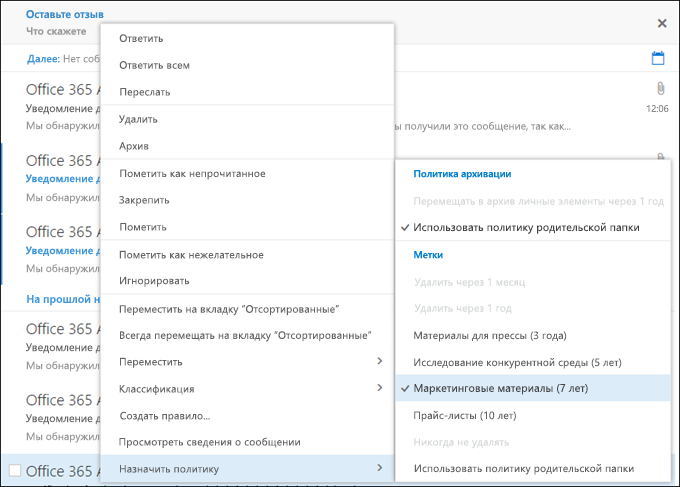
  
<span data-ttu-id="895cd-p119">После применения метки хранения ее описание и выполняемые ею действия отображаются в верхней части описания элемента. Если сообщение классифицировано и с ним связан период хранения, вы можете сразу понять, когда истекает срок его действия.</span><span class="sxs-lookup"><span data-stu-id="895cd-p119">After the retention label is applied, you can view that retention label and what action it takes at the top of the item. If an email is classified and has an associated retention period, you can know at a glance when the email will expire.</span></span>
  
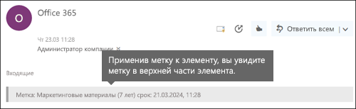
  
<span data-ttu-id="895cd-210">Вы также можете применять метки хранения к папкам. В этом случае:</span><span class="sxs-lookup"><span data-stu-id="895cd-210">You can also apply retention labels to folders, in which case:</span></span>
  
- <span data-ttu-id="895cd-p120">ко всем элементам в папке автоматически применяется одна и та же метка хранения, **за исключением** элементов, к которым явно применены другие метки хранения. У таких элементов остаются имеющиеся метки хранения. Дополнительные сведения см. ниже в разделе, посвященном принципам хранения;</span><span class="sxs-lookup"><span data-stu-id="895cd-p120">All items in the folder automatically get the same retention label, **except** for items that have had a retention label applied explicitly to them. Explicitly labeled items keep their existing retention label. For more information, see the below section on the principles of retention.</span></span> 
    
- <span data-ttu-id="895cd-214">если изменить или удалить используемую по умолчанию метку хранения папки, также меняются или удаляются метки хранения всех элементов в этой папке, **кроме** элементов с явными метками хранения;</span><span class="sxs-lookup"><span data-stu-id="895cd-214">If you change or remove the default retention label for a folder, the retention label's also changed or removed for all items in the folder, **except** items with explicit retention labels.</span></span> 
    
- <span data-ttu-id="895cd-215">если переместить элемент с меткой хранения по умолчанию в другую папку, к которой по умолчанию применяется другая метка хранения, к элементу будет применена новая метка хранения по умолчанию;</span><span class="sxs-lookup"><span data-stu-id="895cd-215">If you move an item with a default retention label from one folder to another folder with a different default retention label, the item will get the new default retention label.</span></span>
    
- <span data-ttu-id="895cd-216">если переместить элемент с меткой хранения по умолчанию в другую папку без метки хранения по умолчанию, старая метка хранения по умолчанию удаляется.</span><span class="sxs-lookup"><span data-stu-id="895cd-216">If you move an item with a default retention label from one folder to another folder with no default retention label, the old default retention label is removed.</span></span>
    
### <a name="outlook-2010-and-later"></a><span data-ttu-id="895cd-217">Outlook 2010 и более поздние версии</span><span class="sxs-lookup"><span data-stu-id="895cd-217">Outlook 2010 and later</span></span>

<span data-ttu-id="895cd-218">Чтобы назначить метку элементу в Outlook в Интернете, щелкните его правой кнопкой мыши, на **ленте** нажмите кнопку **Назначить политику** и выберите метку хранения.</span><span class="sxs-lookup"><span data-stu-id="895cd-218">To label an item in Outlook on the web, right-click the item \> on the **Ribbon** \> **Assign Policy** \> choose the retention label.</span></span> 
  
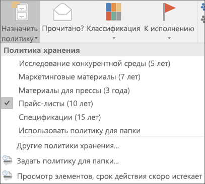
  
<span data-ttu-id="895cd-p121">После применения метки хранения ее описание и выполняемые ею действия отображаются в верхней части описания элемента. Если сообщение классифицировано и с ним связан период хранения, вы можете сразу понять, когда истекает срок его действия.</span><span class="sxs-lookup"><span data-stu-id="895cd-p121">After the retention label is applied, you can view that retention label and what action it takes at the top of the item. If an email is classified and has an associated retention period, you can know at a glance when the email will expire.</span></span>
  
<span data-ttu-id="895cd-p122">Вы также можете применять метки хранения к папкам. Это одинаково работает как в Outlook 2010 и более поздних версиях, так и в Outlook в Интернете. Дополнительные сведения см. в предыдущем разделе.</span><span class="sxs-lookup"><span data-stu-id="895cd-p122">You can also apply retention labels to folders. This works the same in Outlook 2010 and later as it does in Outlook on the web -- see the previous section for more info.</span></span>
  
### <a name="onedrive-and-sharepoint"></a><span data-ttu-id="895cd-224">OneDrive и SharePoint</span><span class="sxs-lookup"><span data-stu-id="895cd-224">OneDrive and SharePoint</span></span>

<span data-ttu-id="895cd-225">Чтобы применить метку к документу (включая файлы OneNote) в OneDrive или SharePoint, выберите элемент, в правом верхнем углу нажмите **Открыть область сведений** \> **Применить метку** и выберите метку хранения.</span><span class="sxs-lookup"><span data-stu-id="895cd-225">To label a document (including OneNote files) in OneDrive or SharePoint, select the item \> in the upper-right corner, choose **Open the details pane** \> **Apply label** \> choose the retention label.</span></span> 
  
<span data-ttu-id="895cd-226">Обратите внимание, что вы можете применить метку хранения к папке или набору документов, а также задать метку хранения по умолчанию для библиотеки документов. Дополнительные сведения см. ниже.</span><span class="sxs-lookup"><span data-stu-id="895cd-226">Note that you can also apply a retention label to a folder or document set, and you can set a default retention label for a document library - see the section below for more information.</span></span>
  
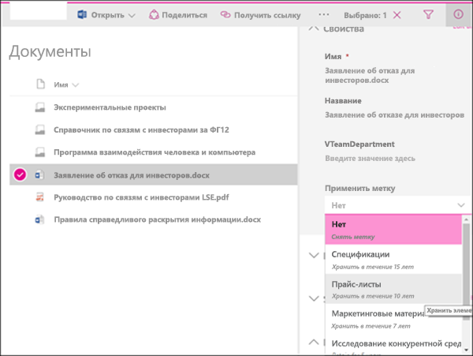
  
<span data-ttu-id="895cd-228">Применив метку хранения к элементу, вы можете просмотреть ее в области сведений при выборе этого элемента.</span><span class="sxs-lookup"><span data-stu-id="895cd-228">After a retention label is applied to an item, you can view it in the details pane when that item's selected.</span></span>
  
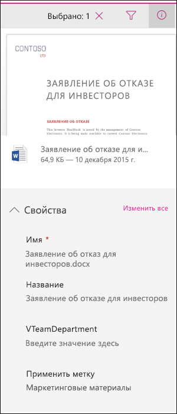
  
<span data-ttu-id="895cd-p123">Вы также можете создать представление библиотеки, содержащей столбец **Метки** или **Элемент является записью**, чтобы вы могли сразу видеть, какие метки хранения назначены всем элементам и какие элементы являются записями. Однако следует помнить, что представление невозможно отфильтровать по столбцу **Элемент является записью**.</span><span class="sxs-lookup"><span data-stu-id="895cd-p123">You can also create a view of the library that contains the **Labels** column or **Item is a Record** column, so that you can see at a glance the retention labels assigned to all items and which items are records. Note, however, that you can't filter the view by the **Item is a Record** column.</span></span> 
  
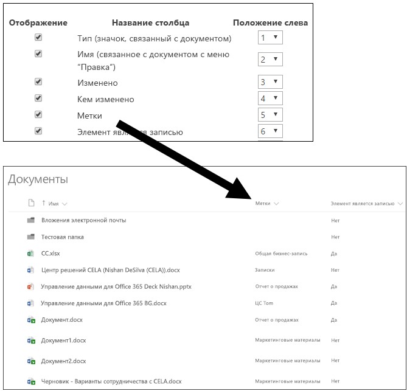
  
### <a name="office-365-groups"></a><span data-ttu-id="895cd-233">Группы Office 365</span><span class="sxs-lookup"><span data-stu-id="895cd-233">Office 365 groups</span></span>

<span data-ttu-id="895cd-p124">Когда вы публикуете метки хранения в группе Office 365, они отображаются как на сайте группы, так и в почтовом ящике группы в Outlook в Интернете. Процесс применения метки хранения к контенту идентичен показанному выше процессу для электронных сообщений и документов.</span><span class="sxs-lookup"><span data-stu-id="895cd-p124">When you publish retention labels to an Office 365 group, the retention labels appear in both the group site and group mailbox in Outlook on the web. The experience of applying a retention label to content is identical to that shown above for email and documents.</span></span>
  
## <a name="applying-a-retention-label-automatically-based-on-conditions"></a><span data-ttu-id="895cd-236">Автоматическое применение метки хранения в соответствии с условиями</span><span class="sxs-lookup"><span data-stu-id="895cd-236">Applying a retention label automatically based on conditions</span></span>

<span data-ttu-id="895cd-p125">Одна из самых полезных функций меток хранения — возможность автоматически применять их к контенту, соответствующему определенным условиям. В этом случае пользователям в организации не требуется применять метки хранения — Office 365 делает это за них.</span><span class="sxs-lookup"><span data-stu-id="895cd-p125">One of the most powerful features of retention labels is the ability to apply them automatically to content that matches certain conditions. In this case, people in your organization don't need to apply the retention labels - Office 365 does the work for them.</span></span>
  
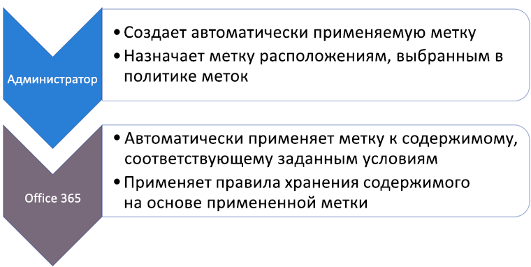
  
<span data-ttu-id="895cd-240">Автоматически применяемые метки хранения удобны, потому что:</span><span class="sxs-lookup"><span data-stu-id="895cd-240">Auto-apply retention labels are powerful because:</span></span>
  
- <span data-ttu-id="895cd-241">вам не придется обучать пользователей работе со всеми категориями;</span><span class="sxs-lookup"><span data-stu-id="895cd-241">You don't need to train your users on all of your classifications.</span></span>
    
- <span data-ttu-id="895cd-242">вам не нужно будет рассчитывать на то, что пользователи правильно классифицируют весь контент;</span><span class="sxs-lookup"><span data-stu-id="895cd-242">You don't need to rely on users to classify all content correctly.</span></span>
    
- <span data-ttu-id="895cd-243">пользователям больше не нужно будет знать о политиках управления данными — они могут сосредоточиться на своей работе.</span><span class="sxs-lookup"><span data-stu-id="895cd-243">Users no longer need to know about data governance policies - they can focus on their work.</span></span>
    
<span data-ttu-id="895cd-244">Вы можете автоматически применять метки хранения к контенту, содержащему:</span><span class="sxs-lookup"><span data-stu-id="895cd-244">You can choose to apply retention labels to content automatically when that content contains:</span></span>
  
- <span data-ttu-id="895cd-245">конфиденциальную информацию определенных типов;</span><span class="sxs-lookup"><span data-stu-id="895cd-245">Specific types of sensitive information.</span></span>
    
- <span data-ttu-id="895cd-246">определенные ключевые слова, соответствующие созданному запросу.</span><span class="sxs-lookup"><span data-stu-id="895cd-246">Specific keywords that match a query you create.</span></span>
    
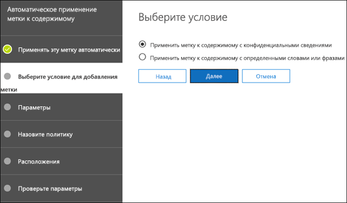
  
<span data-ttu-id="895cd-248">Обратите внимание, что для автоматического применения меток хранения необходима подписка Office 365 корпоративный E5, а для их применения ко всему контенту, соответствующему условиям, может потребоваться до семи дней, как упоминалось ранее.</span><span class="sxs-lookup"><span data-stu-id="895cd-248">Note that auto-apply retention labels require an Office 365 Enterprise E5 subscription, and that it can take up to seven days for auto-apply retention labels to be applied to all content that matches the conditions, as described above.</span></span>
  
### <a name="auto-apply-retention-labels-to-content-with-specific-types-of-sensitive-information"></a><span data-ttu-id="895cd-249">Автоматическое применение меток хранения к контенту с определенными типами конфиденциальной информации</span><span class="sxs-lookup"><span data-stu-id="895cd-249">Auto-apply retention labels to content with specific types of sensitive information</span></span>

<span data-ttu-id="895cd-p126">При создании автоматически применяемых меток хранения для конфиденциальной информации отображается тот же список шаблонов политики, что и при создании политики защиты от потери данных (DLP). Каждый шаблон политики заранее настроен для поиска конфиденциальной информации определенных типов. Например, показанный ниже шаблон ищет индивидуальные идентификационные номера налогоплательщиков, SSN и номера паспортов граждан США. Дополнительные сведения о DLP см. в статье [Общие сведения о политиках защиты от потери данных](data-loss-prevention-policies.md).</span><span class="sxs-lookup"><span data-stu-id="895cd-p126">When you create auto-apply retention labels for sensitive information, you see the same list of policy templates as when you create a data loss prevention (DLP) policy. Each policy template is preconfigured to look for specific types of sensitive information - for example, the template shown here looks for U.S. ITIN, SSN, and passport numbers. To learn more about DLP, see [Overview of data loss prevention policies](data-loss-prevention-policies.md).</span></span>
  
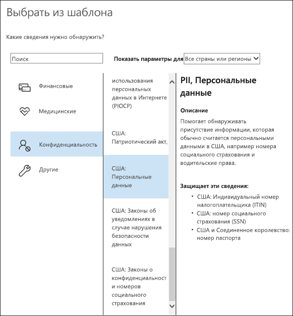
  
<span data-ttu-id="895cd-p127">Выбрав шаблон политики, вы можете добавлять или удалять конфиденциальную информацию любых типов, а также менять количество экземпляров и точность совпадения. В приведенном ниже примере метка хранения будет автоматически применяться, только если:</span><span class="sxs-lookup"><span data-stu-id="895cd-p127">After you select a policy template, you can add or remove any types of sensitive information, and you can change the instance count and match accuracy. In the example shown here, a retention label will be auto-applied only when:</span></span>
  
- <span data-ttu-id="895cd-p128">контент содержит от 1 до 9 экземпляров любого из этих трех типов конфиденциальной информации. Вы можете удалить **максимальное** значение, чтобы оно изменилось на **Любое**;</span><span class="sxs-lookup"><span data-stu-id="895cd-p128">The content contains between 1 and 9 instances of any of these three sensitive information types. You can delete the **max** value so that it changes to **any**.</span></span>
    
- <span data-ttu-id="895cd-p129">для определяемого типа конфиденциальной информации задана точность совпадения (или уровень надежности) не менее 75. Для многих типов конфиденциальной информации определяется несколько шаблонов. Чем выше точность совпадения, тем больше признаков (например, ключевых слов, дат или адресов) нужно для обнаружения шаблона. Проще говоря, чем ниже **минимальная** точность совпадения, тем проще сопоставить контент с условием.</span><span class="sxs-lookup"><span data-stu-id="895cd-p129">The type of sensitive information that's detected has a match accuracy (or confidence level) of at least 75. Many sensitive information types are defined with multiple patterns, where a pattern with a higher match accuracy requires more evidence to be found (such as keywords, dates, or addresses), while a pattern with a lower match accuracy requires less evidence. Simply put, the lower the **min** match accuracy, the easier it is for content to match the condition.</span></span> 
    
    <span data-ttu-id="895cd-261">В случае изменения точности совпадения (или уровня надежности) следует использовать один из уровней надежности, используемых в шаблоне для этого типа конфиденциальной информации, как описано в статье [Что позволяют искать типы конфиденциальной информации](what-the-sensitive-information-types-look-for.md).</span><span class="sxs-lookup"><span data-stu-id="895cd-261">If you change the match accuracy (or confidence level), you should use one of confidence levels used in a pattern for that type of sensitive information, as defined in [What the sensitive information types look for](what-the-sensitive-information-types-look-for.md).</span></span>
    
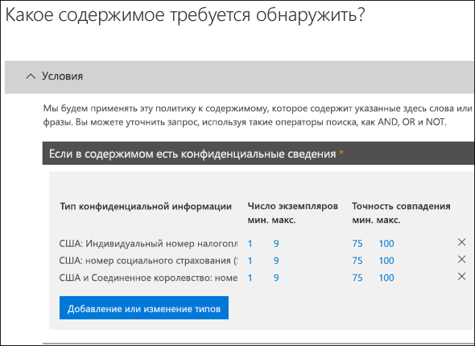
  
### <a name="auto-apply-retention-labels-to-content-with-keywords"></a><span data-ttu-id="895cd-263">Автоматическое применение меток хранения к контенту с ключевыми словами</span><span class="sxs-lookup"><span data-stu-id="895cd-263">Auto-apply retention labels to content with keywords</span></span>

<span data-ttu-id="895cd-p130">Вы можете автоматически применять метки хранения к контенту, соответствующему определенным условиям. Имеющиеся в данный момент условия поддерживают применение метки хранения к контенту, содержащему определенные слова или фразы. Вы можете уточнить запрос с помощью таких операторов поиска, как AND, OR и NOT.</span><span class="sxs-lookup"><span data-stu-id="895cd-p130">You can auto-apply retention labels to content that satisfies certain conditions. The conditions now available support applying a retention label to content that contains specific words or phrases. You can refine your query by using search operators like AND, OR, and NOT.</span></span> 

<span data-ttu-id="895cd-267">Дополнительные сведения о синтаксисе запросов см. в статье:</span><span class="sxs-lookup"><span data-stu-id="895cd-267">For more information on query syntax, see:</span></span>

- [<span data-ttu-id="895cd-268">Руководство по синтаксису языка запросов по ключевым словам (KQL)</span><span class="sxs-lookup"><span data-stu-id="895cd-268">Keyword Query Language (KQL) syntax reference</span></span>](https://docs.microsoft.com/sharepoint/dev/general-development/keyword-query-language-kql-syntax-reference)

<span data-ttu-id="895cd-269">Метки хранения на основе запросов используют индекс поиска для определения контента.</span><span class="sxs-lookup"><span data-stu-id="895cd-269">Query-based retention labels use the search index to identify content.</span></span>
  
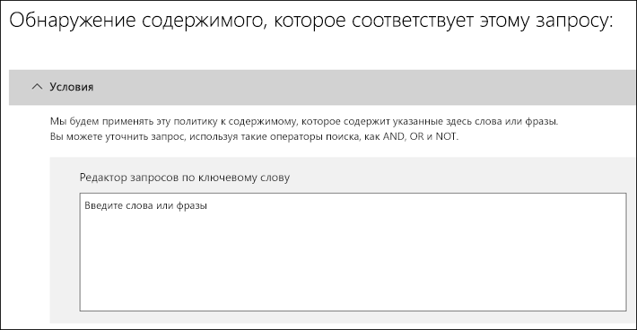
  
## <a name="applying-a-default-retention-label-to-all-content-in-a-sharepoint-library-folder-or-document-set"></a><span data-ttu-id="895cd-271">Применение метки хранения по умолчанию ко всему контенту в библиотеке SharePoint, папке или набору документов</span><span class="sxs-lookup"><span data-stu-id="895cd-271">Applying a default retention label to all content in a SharePoint library, folder, or document set</span></span>

<span data-ttu-id="895cd-272">Вы можете не только разрешить пользователям применять метки хранения к отдельным документам, но и назначить метку хранения по умолчанию библиотеке SharePoint, папке или набору документов, чтобы эта метка хранения применялась ко всем документам в этом расположении.</span><span class="sxs-lookup"><span data-stu-id="895cd-272">In addition to enabling people to apply a retention label to individual documents, you can also apply a default retention label to a SharePoint library, folder, or document set, so that all documents in that location get the default retention label.</span></span>
  
<span data-ttu-id="895cd-p131">В случае библиотек документов это делается на странице **Параметры библиотеки**. Выбрав метку хранения по умолчанию, вы также можете применить ее ко всем имеющимся в библиотеке элементам.</span><span class="sxs-lookup"><span data-stu-id="895cd-p131">For a document library, this is done on the **Library settings** page for a document library. When you choose the default retention label, you can also choose to apply it to any existing items in the library.</span></span> 
  
<span data-ttu-id="895cd-275">Например, если у вас есть тег для маркетинговых материалов и вы знаете, что определенная библиотека документов будет содержать контент только этого типа, то вы можете сделать тег маркетинговых материалов стандартным для всех документов в этой библиотеке.</span><span class="sxs-lookup"><span data-stu-id="895cd-275">For example, if you have a tag for marketing materials, and you know a specific document library will contain only that type of content, you can make the Marketing Materials tag the default for all documents in that library.</span></span>
  
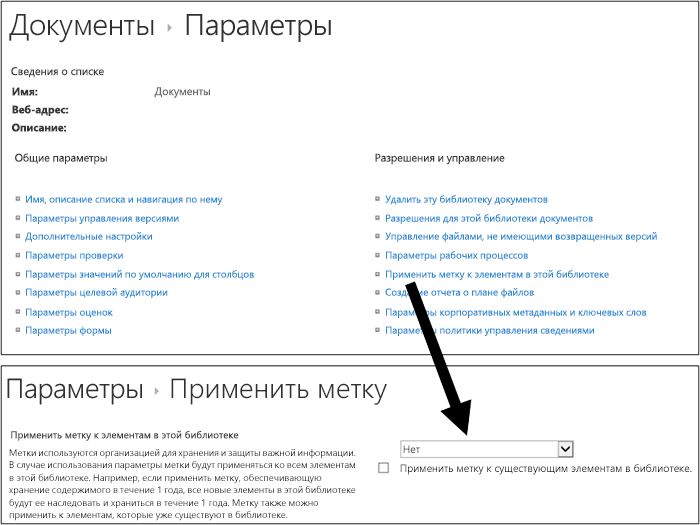
  
<span data-ttu-id="895cd-277">Если вы применяете метку хранения по умолчанию к имеющимся элементам в библиотеке, папке или наборе документов:</span><span class="sxs-lookup"><span data-stu-id="895cd-277">If you apply a default retention label to existing items in the library, folder, or document set:</span></span>
  
- <span data-ttu-id="895cd-p132">ко всем элементам в библиотеке, папке или наборе документов автоматически применяется одна и та же метка хранения, **за исключением** элементов, к которым явно применены другие метки хранения. У таких элементов остаются имеющиеся метки. Дополнительные сведения см. ниже в разделе [Принципы хранения и приоритеты](#the-principles-of-retention-or-what-takes-precedence);</span><span class="sxs-lookup"><span data-stu-id="895cd-p132">All items in the library, folder, or document set automatically get the same retention label, **except** for items that have had a retention label applied explicitly to them. Explicitly labeled items keep their existing label. For more information, see the below section on [The principles of retention, or what takes precedence?](#the-principles-of-retention-or-what-takes-precedence).</span></span>
    
- <span data-ttu-id="895cd-281">если изменить или удалить используемую по умолчанию метку хранения библиотеки, папки или набора документов, также меняются или удаляются метки хранения всех элементов в этих библиотеке, папке или наборе документов, **кроме** элементов с явными метками хранения;</span><span class="sxs-lookup"><span data-stu-id="895cd-281">If you change or remove the default retention label for a library, folder, or document set, the retention label's also changed or removed for all items in the library, folder, or document set, **except** items with explicit retention labels.</span></span> 
    
- <span data-ttu-id="895cd-282">если переместить элемент с меткой хранения по умолчанию в другую библиотеку, папку или другой набор документов, то у элемента останется текущая метка хранения по умолчанию, даже если к новому расположению применяется другая метка хранения по умолчанию.</span><span class="sxs-lookup"><span data-stu-id="895cd-282">If you move an item with a default retention label from one library, folder, or document set to another library, folder, or document set, the item keeps its existing default retention label, even if the new location has a different default retention label.</span></span>
    
## <a name="applying-a-retention-label-to-email-by-using-rules"></a><span data-ttu-id="895cd-283">Применение метки хранения к электронному сообщению с помощью правил</span><span class="sxs-lookup"><span data-stu-id="895cd-283">Applying a retention label to email by using rules</span></span>

<span data-ttu-id="895cd-284">В Outlook 2010 и более поздних версиях можно создавать правила, применяемые к метке хранения или политике хранения.</span><span class="sxs-lookup"><span data-stu-id="895cd-284">In Outlook 2010 or later, you can create rules to apply a retention label or retention policy.</span></span>
  
<span data-ttu-id="895cd-285">Например, вы можете создать правило, которое применяет ту или иную метку хранения ко всем сообщениям, отправляемым в определенную группу рассылки или из нее.</span><span class="sxs-lookup"><span data-stu-id="895cd-285">For example, you can create a rule that applies a specific retention label to all messages sent to or from a specific distribution group.</span></span>
  
<span data-ttu-id="895cd-286">Чтобы создать правило, щелкните элемент правой кнопкой мыши и выберите **Правила** \> **Создать правило** \> **Дополнительные параметры** \> **Мастер правил** \> **Применить политику хранения**.</span><span class="sxs-lookup"><span data-stu-id="895cd-286">To create a rule, right-click an item \> **Rules** \> **Create Rule** \> **Advanced Options** \> **Rules Wizard** \> **apply retention policy**.</span></span>
  
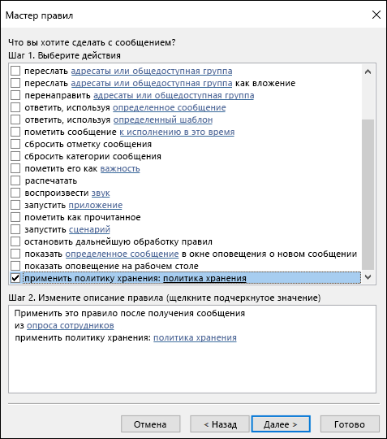
  
## <a name="classifying-content-without-applying-any-actions"></a><span data-ttu-id="895cd-288">Классификация контента без применения действий</span><span class="sxs-lookup"><span data-stu-id="895cd-288">Classifying content without applying any actions</span></span>

<span data-ttu-id="895cd-p133">Создавая метку хранения, вы можете не включать хранение или другие действия, как показано ниже. В этом случае метку хранения можно использовать исключительно как текстовую подпись, не выполняющую никаких действий.</span><span class="sxs-lookup"><span data-stu-id="895cd-p133">When you create a retention label, you can do so without turning on any retention or other actions, as shown below. In this case, you can use a retention label simply as a text label, without enforcing any actions.</span></span>
  
<span data-ttu-id="895cd-291">Например, вы можете создать метку хранения под названием "Просмотреть позже" без действий, а затем автоматически применять эту метку хранения к контенту с конфиденциальной информацией или запрашиваемому контенту.</span><span class="sxs-lookup"><span data-stu-id="895cd-291">For example, you can create a retention label named "Review later" with no actions, and then auto-apply that retention label to content with sensitive information types or queried content.</span></span>
  
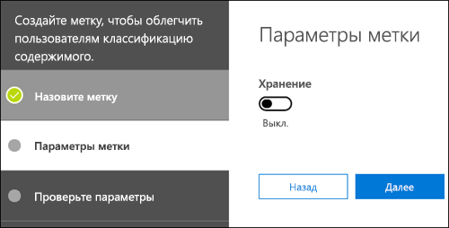
  
## <a name="using-retention-labels-for-records-management"></a><span data-ttu-id="895cd-293">Использование меток хранения для управления записями</span><span class="sxs-lookup"><span data-stu-id="895cd-293">Using retention labels for records management</span></span>

<span data-ttu-id="895cd-294">На высоком уровне управление записями означает, что:</span><span class="sxs-lookup"><span data-stu-id="895cd-294">At a high level, records management means that:</span></span>
  
- <span data-ttu-id="895cd-295">важный контент классифицируется пользователями как запись;</span><span class="sxs-lookup"><span data-stu-id="895cd-295">Important content is classified as a record by users.</span></span>
    
- <span data-ttu-id="895cd-296">запись невозможно изменить или удалить;</span><span class="sxs-lookup"><span data-stu-id="895cd-296">A record can't be modified or deleted.</span></span>
    
- <span data-ttu-id="895cd-297">записи окончательно ликвидируются по истечении их заявленного срока действия.</span><span class="sxs-lookup"><span data-stu-id="895cd-297">Records are finally disposed of after their stated lifetime is past.</span></span>
    
<span data-ttu-id="895cd-p134">Вы можете использовать метки хранения для реализации единой, согласованной стратегии управления записями в Office 365, в том время как другие функции управления записями, например центр записей, применяются только к контенту в SharePoint. А вы можете применять действия хранения к записям, чтобы они автоматически ликвидировались в конце их жизненного цикла.</span><span class="sxs-lookup"><span data-stu-id="895cd-p134">You can use retention labels to implement a single, consistent records-management strategy across Office 365, whereas other records-management features such as the Record Center apply only to SharePoint content. And you can enforce retention actions on records, so that they're disposed of automatically at the end of their lifecycle.</span></span>
  
<span data-ttu-id="895cd-300">Создавая метку хранения, вы можете использовать метку хранения для классификации контента в качестве записи.</span><span class="sxs-lookup"><span data-stu-id="895cd-300">When you create a retention label, you have the option to use the retention label to classify the content as a record.</span></span>
  
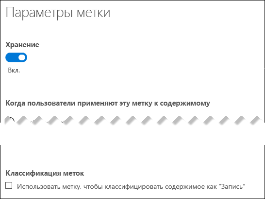
  
<span data-ttu-id="895cd-302">Если элемент помечен как запись:</span><span class="sxs-lookup"><span data-stu-id="895cd-302">When an item is labeled as a record, four things happen:</span></span>
  
- <span data-ttu-id="895cd-303">элемент невозможно безвозвратно удалить;</span><span class="sxs-lookup"><span data-stu-id="895cd-303">The item can't be permanently deleted.</span></span>
    
- <span data-ttu-id="895cd-304">элемент невозможно изменить;</span><span class="sxs-lookup"><span data-stu-id="895cd-304">The item can't be edited.</span></span>
    
- <span data-ttu-id="895cd-305">метку невозможно изменить;</span><span class="sxs-lookup"><span data-stu-id="895cd-305">The label can't be changed.</span></span>
    
- <span data-ttu-id="895cd-306">метку невозможно удалить.</span><span class="sxs-lookup"><span data-stu-id="895cd-306">The label can't be removed.</span></span>
    
### <a name="who-can-classify-content-as-a-record"></a><span data-ttu-id="895cd-307">Кто может классифицировать контент как записи</span><span class="sxs-lookup"><span data-stu-id="895cd-307">Who can classify content as a record</span></span>

<span data-ttu-id="895cd-p135">В случае контента SharePoint любой пользователь из стандартной группы "Участники" (с уровнем разрешений "Участие") может применить метку записи к контенту. Только администратор семейства веб-сайтов может удалить или изменить метку хранения после ее применения. Кроме того, метки хранения, классифицирующие контент как запись, необходимо применять вручную. Их невозможно применять автоматически.</span><span class="sxs-lookup"><span data-stu-id="895cd-p135">For SharePoint content, any user in the default Members group (the Contribute permission level) can apply a record label to content. Only the site collection administrator can remove or change that retention label after it's been applied. In addition, a retention label that classifies content as a record needs to be applied manually; it can't be auto-applied.</span></span>
  
### <a name="records-and-folders"></a><span data-ttu-id="895cd-311">Записи и папки</span><span class="sxs-lookup"><span data-stu-id="895cd-311">Records and folders</span></span>

<span data-ttu-id="895cd-p136">Вы можете применить метку хранения к папке в Exchange, SharePoint или OneDrive. Если папка отмечена как запись, а вы перемещаете в эту папку элемент, то этот элемент будет отмечен как запись. При перемещении элемента за пределы папки он останется отмеченным как запись.</span><span class="sxs-lookup"><span data-stu-id="895cd-p136">You can apply a retention label to a folder in Exchange, SharePoint, or OneDrive. If a folder is labeled as a record, and you move an item into the folder, the item is labeled as a record. When you move the item out of the folder, the item will continue to be labeled as a record.</span></span>
  
### <a name="records-cant-be-deleted"></a><span data-ttu-id="895cd-315">Записи невозможно удалять</span><span class="sxs-lookup"><span data-stu-id="895cd-315">Records can't be deleted</span></span>

<span data-ttu-id="895cd-316">При попытке удалить запись в Exchange элемент перемещается в папку "Элементы с возможностью восстановления", как описано в разделе [Что делает политика хранения с содержимым на месте](retention-policies.md#how-a-retention-policy-works-with-content-in-place).</span><span class="sxs-lookup"><span data-stu-id="895cd-316">If you attempt to delete a record in Exchange, the item is moved to the Recoverable Items folder as described in [How a retention policy works with content in place](retention-policies.md#how-a-retention-policy-works-with-content-in-place).</span></span>
  
<span data-ttu-id="895cd-317">При попытке удалить запись в SharePoint возникает ошибка с сообщением о том, что элемент не был удален и остается в библиотеке.</span><span class="sxs-lookup"><span data-stu-id="895cd-317">If you attempt to delete a record in a SharePoint, you see an error that the item wasn't deleted, and the item remains in the library.</span></span>
  
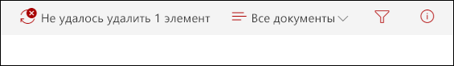
  
<span data-ttu-id="895cd-319">При попытке удалить запись в OneDrive элемент перемещается в архивную библиотеку, как описано в разделе [Что делает политика хранения с содержимым на месте](retention-policies.md#how-a-retention-policy-works-with-content-in-place).</span><span class="sxs-lookup"><span data-stu-id="895cd-319">If you attempt to delete a record in OneDrive, the item is moved to the Preservation Hold library as described in [How a retention policy works with content in place](retention-policies.md#how-a-retention-policy-works-with-content-in-place).</span></span>
  
## <a name="using-a-retention-label-as-a-condition-in-a-dlp-policy"></a><span data-ttu-id="895cd-320">Использование метки хранения в качестве условия в политике защиты от потери данных</span><span class="sxs-lookup"><span data-stu-id="895cd-320">Using a retention label as a condition in a DLP policy</span></span>

<span data-ttu-id="895cd-p137">Метка хранения может применять действия по хранению контента. Кроме того, вы можете использовать метку хранения как условие в политике защиты от потери данных (DLP), и политика защиты от потери данных может применять другие действия (например, ограничение доступа) к контенту с определенной меткой.</span><span class="sxs-lookup"><span data-stu-id="895cd-p137">A retention label can enforce retention actions on content. In addition, you can use a retention label as a condition in a data loss prevention (DLP) policy, and the DLP policy can enforce other actions, such as restricting access, on content that contains a specific label.</span></span> 
  
<span data-ttu-id="895cd-323">Дополнительные сведения см. в разделе [Использование метки в качестве условия в политике защиты от потери данных](data-loss-prevention-policies.md#using-a-label-as-a-condition-in-a-dlp-policy).</span><span class="sxs-lookup"><span data-stu-id="895cd-323">For more information, see [Using a label as a condition in a DLP policy](data-loss-prevention-policies.md#using-a-label-as-a-condition-in-a-dlp-policy).</span></span>
  
## <a name="using-the-label-activity-explorer-and-the-data-governance-reports"></a><span data-ttu-id="895cd-324">Использование обозревателя действий с метками и отчетов об управлении данными</span><span class="sxs-lookup"><span data-stu-id="895cd-324">Using the Label Activity Explorer and the data governance reports</span></span>

<span data-ttu-id="895cd-p138">После публикации и автоматического применения меток хранения вам нужно убедиться, что они применяются к контенту, как планировалось. Для отслеживания меток хранения можно использовать следующие средства:</span><span class="sxs-lookup"><span data-stu-id="895cd-p138">After you publish or auto-apply your retention labels, you'll want to verify that they're being applied to content as you intended. To monitor your retention labels, you can use the:</span></span>
  
- <span data-ttu-id="895cd-p139">**Обозреватель действий с метками**. С помощью обозревателя (показанного ниже) вы можете быстро находить и просматривать действия с метками хранения для всего контента в SharePoint и OneDrive для бизнеса за последние 30 дней. Дополнительные сведения см. в статье [Просмотр действий с метками для документов](view-label-activity-for-documents.md).</span><span class="sxs-lookup"><span data-stu-id="895cd-p139">**Label Activity Explorer**. With the explorer (shown below), you can quickly search and view retention label activity for all content across SharePoint and OneDrive for Business over the past 30 days. For more information, see [View label activity for documents](view-label-activity-for-documents.md).</span></span>
    
- <span data-ttu-id="895cd-p140">**Отчеты об управлении данными**. С помощью этих отчетов вы можете быстро просматривать тенденции и действия с метками хранения для всего контента в Exchange, SharePoint и OneDrive для бизнеса за последние 90 дней. Дополнительные сведения см. в статье [Просмотр отчетов об управлении данными](view-the-data-governance-reports.md).</span><span class="sxs-lookup"><span data-stu-id="895cd-p140">**Data governance reports**. With these reports, you can quickly view retention label trends and activity for all content across Exchange, SharePoint, and OneDrive for Business over the past 90 days. For more information, see [View the data governance reports](view-the-data-governance-reports.md).</span></span>
    

  
## <a name="using-content-search-to-find-all-content-with-a-specific-retention-label-applied-to-it"></a><span data-ttu-id="895cd-334">Использование средства "Поиск контента" для поиска содержимого с определенной меткой хранения</span><span class="sxs-lookup"><span data-stu-id="895cd-334">Using Content Search to find all content with a specific retention label applied to it</span></span>

<span data-ttu-id="895cd-335">Когда метки хранения будут назначены содержимому (либо пользователями, либо автоматически), вы можете использовать средство "Поиск контента" в Центре безопасности и соответствия требованиям, чтобы найти весь контент с определенной меткой хранения.</span><span class="sxs-lookup"><span data-stu-id="895cd-335">After retention labels are assigned to content, either by users or auto-applied, you can use content search in the Security &amp; Compliance Center to find all content that's classified with a specific retention label.</span></span>
  
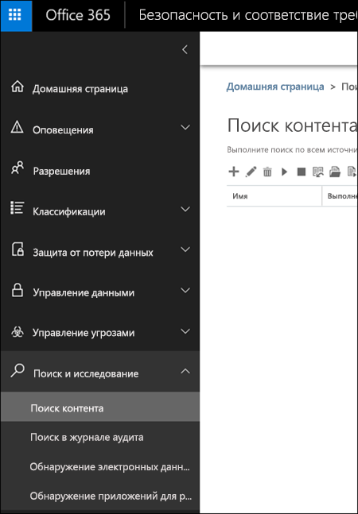
  
<span data-ttu-id="895cd-p141">Создавая запрос на поиск контента, выберите условие **Тег соответствия требованиям**, а затем укажите полное имя метки либо введите его часть и используйте подстановочный знак. Дополнительные сведения см. в статье [Запросы ключевых слов и условия поиска контента](keyword-queries-and-search-conditions.md).</span><span class="sxs-lookup"><span data-stu-id="895cd-p141">When you create a content search, choose the **Compliance Tag** condition, and then enter the complete label name or part of the label name and use a wildcard. For more information, see [Keyword queries and search conditions for Content Search](keyword-queries-and-search-conditions.md).</span></span>
  
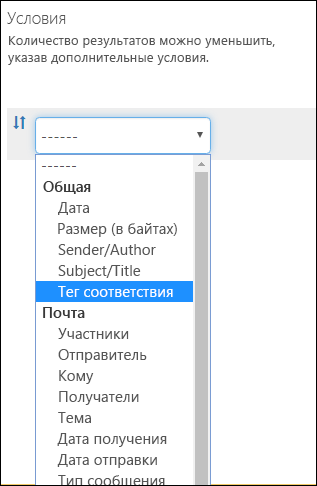
  
## <a name="the-principles-of-retention-or-what-takes-precedence"></a><span data-ttu-id="895cd-340">Принципы хранения и приоритеты</span><span class="sxs-lookup"><span data-stu-id="895cd-340">The principles of retention, or what takes precedence?</span></span>

<span data-ttu-id="895cd-p142">Возможно (и даже вероятно), что к содержимому применено несколько политик хранения с разными действиями (хранением и/или удалением) и периодом хранения. Какая политика имеет приоритет? Во-первых, вы можете быть уверены, что содержимое, сохраняемое одной политикой, не может быть безвозвратно удалено другой.</span><span class="sxs-lookup"><span data-stu-id="895cd-p142">It's possible or even likely that content might have several retention policies applied to it, each with a different action (retain, delete, or both) and retention period. What takes precedence? At the highest level, rest assured that content being retained by one policy can't be permanently deleted by another policy.</span></span>
  

  
<span data-ttu-id="895cd-345">Чтобы понять, как различные метки с действиями хранения применяются к контенту, запомните следующие принципы хранения:</span><span class="sxs-lookup"><span data-stu-id="895cd-345">To understand how different labels with retention actions are applied to content, keep these principles of retention in mind:</span></span>
  
1. <span data-ttu-id="895cd-p143">**Хранение имеет приоритет перед удалением.** Допустим, одна политика хранения предписывает удаление электронной почты Exchange спустя три года, а другая — ее хранение в течение пяти лет с последующим удалением. Весь контент трехлетней давности будет удален и скрыт от пользователя, но останется в папке "Элементы с возможностью восстановления", пока его возраст не достигнет пяти лет, после чего он будет окончательно удален.</span><span class="sxs-lookup"><span data-stu-id="895cd-p143">**Retention wins over deletion.** Suppose that one retention policy says to delete Exchange email after three years, but another retention policy says to retain Exchange email for five years and then delete it. Any content that reaches three years old will be deleted and hidden from the users' view, but still retained in the Recoverable Items folder until the content reaches five years old, when it will be permanently deleted.</span></span> 
    
2. <span data-ttu-id="895cd-p144">**Самый продолжительный период хранения имеет приоритет.** Если к содержимому применено несколько политик, сохраняющих его, оно будет храниться до окончания самого длительного периода хранения.</span><span class="sxs-lookup"><span data-stu-id="895cd-p144">**The longest retention period wins.** If content's subject to multiple policies that retain content, it will be retained until the end of the longest retention period.</span></span> 
    
3. <span data-ttu-id="895cd-p145">**Явное включение имеет приоритет перед неявным.** Это означает следующее:</span><span class="sxs-lookup"><span data-stu-id="895cd-p145">**Explicit inclusion wins over implicit inclusion.** This means:</span></span> 
    
    1. <span data-ttu-id="895cd-p146">Если пользователь вручную назначает метку хранения с параметрами хранения элементу, например электронному сообщению Exchange или документу OneDrive, эта метка хранения имеет приоритет как перед политикой, назначенной на уровне сайта или почтового ящика, так и перед стандартной меткой хранения, назначенной библиотекой документов. Например, если явная метка хранения предписывает хранение в течение десяти лет, но политика хранения, назначенная сайту, предписывает хранение только в течение пяти лет, то метка хранения имеет приоритет. Обратите внимание, что автоматически применяемые метки хранения считаются неявными, потому что их автоматически применяет Office 365.</span><span class="sxs-lookup"><span data-stu-id="895cd-p146">If a retention label with retention settings is manually assigned by a user to an item, such as an Exchange email or OneDrive document, that retention label takes precedence over both a policy assigned at the site or mailbox level and a default retention label assigned by the document library. For example, if the explicit retention label says to retain for ten years, but the retention policy assigned to the site says to retain for only five years, the retention label takes precedence. Note that auto-apply retention labels are considered implicit, not explicit, because they're applied automatically by Office 365.</span></span>
    
    2. <span data-ttu-id="895cd-356">Если политика хранения включает определенное расположение, например учетную запись OneDrive для бизнеса или почтовый ящик конкретного пользователя, то эта политика имеет приоритет перед другой политикой хранения, которая применяется к учетным записям OneDrive для бизнеса или почтовым ящикам всех пользователей, но не включает почтовый ящик именно этого пользователя.</span><span class="sxs-lookup"><span data-stu-id="895cd-356">If a retention policy includes a specific location, such as a specific user's mailbox or OneDrive for Business account, that policy takes precedence over another retention policy that applies to all users' mailboxes or OneDrive for Business accounts but doesn't specifically include that user's mailbox.</span></span>
    
4. <span data-ttu-id="895cd-p147">**Кратчайший период удаления имеет приоритет.** Если же к содержимому применено несколько политик, удаляющих его (без хранения), то оно будет удалено по истечении кратчайшего периода хранения.</span><span class="sxs-lookup"><span data-stu-id="895cd-p147">**The shortest deletion period wins.** Similarly, if content's subject to multiple policies that delete content (with no retention), it will be deleted at the end of the shortest retention period.</span></span> 
    
<span data-ttu-id="895cd-359">Следует понимать, что принципы хранения используются как поток разрешения конфликтов (сверху вниз): если правила, применяемые всеми политиками или метками, совпадают на одном уровне, то поток переходит на уровень ниже, чтобы определить приоритет применения правил.</span><span class="sxs-lookup"><span data-stu-id="895cd-359">Understand that the principles of retention work as a tie-breaking flow from top to bottom: If the rules applied by all policies or labels are the same at one level, the flow moves down to the next level to determine precedence for which rule is applied.</span></span>
  
<span data-ttu-id="895cd-p148">Политика хранения или метка не может безвозвратно удалить какое-либо содержимое, находящееся на удержании для обнаружения электронных данных. При отмене удержания содержимое снова становится доступным для вышеописанного процесса очистки.</span><span class="sxs-lookup"><span data-stu-id="895cd-p148">Finally, a retention policy or label cannot permanently delete any content that's on hold for eDiscovery. When the hold is released, the content again becomes eligible for the cleanup process described above.</span></span>
  
## <a name="use-retention-labels-instead-of-these-features"></a><span data-ttu-id="895cd-362">Использование меток хранения вместо этих функций</span><span class="sxs-lookup"><span data-stu-id="895cd-362">Use retention labels instead of these features</span></span>

<span data-ttu-id="895cd-p149">Метки хранения легко сделать доступными всей организации и ее контенту в Office 365, включая Exchange, SharePoint, OneDrive и группы Office 365. Если вам нужно классифицировать контент или управлять записями в какой-либо службе из Office 365, рекомендуем использовать метки хранения.</span><span class="sxs-lookup"><span data-stu-id="895cd-p149">Retention labels can easily be made available to an entire organization and its content across Office 365, including Exchange, SharePoint, OneDrive, and Office 365 groups. If you need to classify content or manage records anywhere in Office 365, we recommend that you use retention labels.</span></span>
  
<span data-ttu-id="895cd-p150">Существует ряд других функций, которые в прошлом использовались для классификации контента или управления записями в Office 365. Они перечислены ниже. Эти функции продолжат работать наряду с метками хранения, созданными в Центре безопасности и соответствия требованиям. Обратите внимание, что хотя в некоторых аспектах метки хранения реализованы не так, как старые функции, развитие меток хранения будет определять будущие принципы управления записями в Office 365. Следовательно, в дальнейшем для управления данными рекомендуем использовать метки хранения, а не устаревшие функции.</span><span class="sxs-lookup"><span data-stu-id="895cd-p150">There are several other features that have previously been used to classify content or manage records in Office 365. These are listed below. These features will continue to work side by side with retention labels created in the Security &amp; Compliance Center. Note that while there are instances where the implementation of retention labels differs from previous features, the evolution of retention labels will drive the future of records management across Office 365. Therefore, moving forward, for data governance, we recommend that you use retention labels instead of these features.</span></span>
  
### <a name="exchange-online"></a><span data-ttu-id="895cd-370">Exchange Online</span><span class="sxs-lookup"><span data-stu-id="895cd-370">Exchange Online</span></span>

- <span data-ttu-id="895cd-371">[Теги и политики хранения](https://go.microsoft.com/fwlink/?linkid=846125), также называемые средствами [управления записями сообщений (MRM)](https://go.microsoft.com/fwlink/?linkid=846126) (только для удаления)</span><span class="sxs-lookup"><span data-stu-id="895cd-371">[Retention tags and retention policies](https://go.microsoft.com/fwlink/?linkid=846125), also known as [messaging records management (MRM)](https://go.microsoft.com/fwlink/?linkid=846126) (Deletion only)</span></span> 
    
### <a name="sharepoint-online-and-onedrive-for-business"></a><span data-ttu-id="895cd-372">SharePoint Online и OneDrive для бизнеса</span><span class="sxs-lookup"><span data-stu-id="895cd-372">SharePoint Online and OneDrive for Business</span></span>

- <span data-ttu-id="895cd-373">[Настройка управления записями на месте](https://support.office.com/article/7707a878-780c-4be6-9cb0-9718ecde050a) (хранение)</span><span class="sxs-lookup"><span data-stu-id="895cd-373">[Configuring in place records management](https://support.office.com/article/7707a878-780c-4be6-9cb0-9718ecde050a) (Retention)</span></span> 
    
- <span data-ttu-id="895cd-374">[Общие сведения о центре записей](https://support.office.com/article/bae6ca5a-7b19-40e0-b433-e3613a747c2c) (хранение)</span><span class="sxs-lookup"><span data-stu-id="895cd-374">[Introduction to the Records Center](https://support.office.com/article/bae6ca5a-7b19-40e0-b433-e3613a747c2c) (Retention)</span></span> 
    
- <span data-ttu-id="895cd-375">[Политики управления информацией](intro-to-info-mgmt-policies.md) (только удаление)</span><span class="sxs-lookup"><span data-stu-id="895cd-375">[Information management policies](intro-to-info-mgmt-policies.md) (Deletion only)</span></span> 
    
## <a name="permissions"></a><span data-ttu-id="895cd-376">Разрешения</span><span class="sxs-lookup"><span data-stu-id="895cd-376">Permissions</span></span>

<span data-ttu-id="895cd-p151">Участникам вашей команды по обеспечению соответствия требованиям, которые будут создавать метки хранения, необходимы разрешения на доступ к Центру безопасности и соответствия требованиям. По умолчанию администратор клиента будет иметь доступ к этому расположению и сможет предоставлять ответственным за обеспечение соответствия требованиям и другим пользователям доступ к Центру безопасности и соответствия требованиям, не предоставляя им все разрешения администратора клиента. Для этого рекомендуем перейти на страницу **Разрешения** в Центре безопасности и соответствия требованиям, изменить группу ролей **Администратор соответствия требованиям** и добавить участников в эту группу ролей.</span><span class="sxs-lookup"><span data-stu-id="895cd-p151">Members of your compliance team who will create retention labels need permissions to the Security &amp; Compliance Center. By default, your tenant admin will have access to this location and can give compliance officers and other people access to the Security &amp; Compliance Center, without giving them all of the permissions of a tenant admin. To do this, we recommend that you go to the **Permissions** page of the Security &amp; Compliance Center, edit the **Compliance Administrator** role group, and add members to that role group.</span></span> 
  
<span data-ttu-id="895cd-379">Дополнительные сведения см. в статье [Предоставление пользователям доступа к Центру безопасности и соответствия требованиям Office 365](grant-access-to-the-security-and-compliance-center.md).</span><span class="sxs-lookup"><span data-stu-id="895cd-379">For more information, see [Give users access to the Office 365 Security &amp; Compliance Center](grant-access-to-the-security-and-compliance-center.md).</span></span>
  
<span data-ttu-id="895cd-p152">Эти разрешения необходимы только для создания и применения меток хранения и соответствующей политики. Для применения политики не требуется доступ к контенту.</span><span class="sxs-lookup"><span data-stu-id="895cd-p152">These permissions are required only to create and apply retention labels and a label policy. Policy enforcement does not require access to the content.</span></span>
  
## <a name="find-the-powershell-cmdlets-for-labels"></a><span data-ttu-id="895cd-382">Командлеты PowerShell для работы с метками</span><span class="sxs-lookup"><span data-stu-id="895cd-382">Find the PowerShell cmdlets for labels</span></span>

<span data-ttu-id="895cd-383">Чтобы использовать командлеты для работы с метками, необходимо:</span><span class="sxs-lookup"><span data-stu-id="895cd-383">To use the label cmdlets, you need to:</span></span>
  
1. <span data-ttu-id="895cd-384">[Подключиться к Центру безопасности и соответствия требованиям Office 365 с помощью удаленного сеанса PowerShell](https://docs.microsoft.com/powershell/exchange/office-365-scc/connect-to-scc-powershell/connect-to-scc-powershell?view=exchange-ps).</span><span class="sxs-lookup"><span data-stu-id="895cd-384">[Connect to the Office 365 Security &amp; Compliance Center using remote PowerShell](https://docs.microsoft.com/powershell/exchange/office-365-scc/connect-to-scc-powershell/connect-to-scc-powershell?view=exchange-ps)</span></span>
    
2. <span data-ttu-id="895cd-385">Используйте эти [командлеты Центра безопасности и соответствия требованиям Office 365](http://go.microsoft.com/fwlink/?LinkID=799772&amp;clcid=0x409).</span><span class="sxs-lookup"><span data-stu-id="895cd-385">Use these [Office 365 Security &amp; Compliance Center cmdlets](http://go.microsoft.com/fwlink/?LinkID=799772&amp;clcid=0x409)</span></span>
    
## <a name="more-information"></a><span data-ttu-id="895cd-386">Дополнительные сведения</span><span class="sxs-lookup"><span data-stu-id="895cd-386">More information</span></span>

- [<span data-ttu-id="895cd-387">Обзор политик хранения</span><span class="sxs-lookup"><span data-stu-id="895cd-387">Overview of retention policies</span></span>](retention-policies.md)
    

