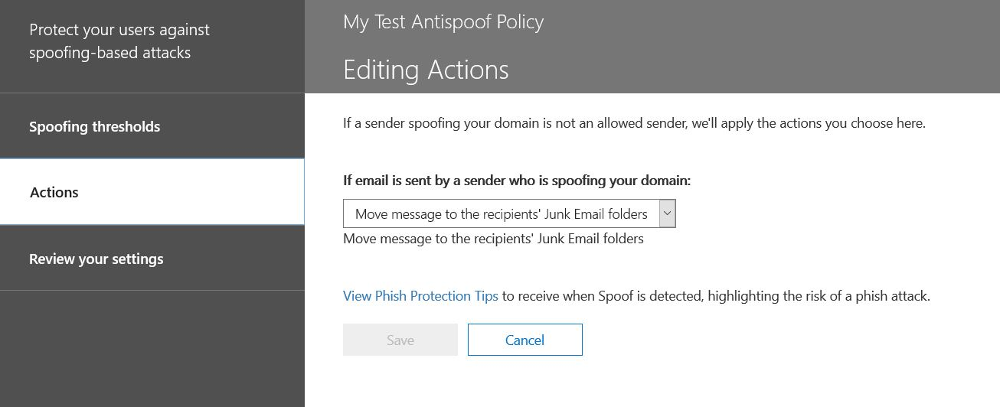

# Дополнительные сведения об аналитике спуфинга

Используйте аналитику подделки в &amp; центре безопасности и соответствия требованиям на **странице Параметры защиты от нежелательной почты** , чтобы просмотреть всех отправителей, которые подделывать домены, являющиеся частью Организации, или подменить внешние домены. Аналитика подДелки доступна в составе Office 365 Enterprise, а также по отдельности в рамках Advanced Threat protection (ATP) и в октябре 2018 Exchange Online Protection (EOP). 
  
## Какие типы поддельной подмены электронной почты можно проверить и какие функции следует защищать с помощью логики подделки?

Для доменов, которым вы владеете, вы можете просмотреть отправители, которые подделывать ваш домен, а затем разрешить отправителю продолжить или заблокировать отправителя. Для внешних доменов можно разрешить домен отправителя в сочетании с инфраструктурой отправки, хотя это не отдельный адрес отправки электронной почты.
  
Когда отправитель подменяет адрес электронной почты, он рассылает почту от имени одной или нескольких учетных записей пользователей в пределах одного из доменов вашей организации или внешнего домена, отправляющего его в вашу организацию. Удивительно, что для подмены существуют некоторые подлинные бизнес-причины. Например, в таких случаях отправителю не следует блокировать подмену домена:
  
- У вас есть сторонние отправители, которые используют ваш домен для отправки массовых писем своим сотрудникам для опросов компании.
    
- Вы настроили внешнюю компанию для создания и отправки рекламных обновлений от вашего имени.
    
- Помощник, который регулярно должен отправлять электронную почту другому человеку в вашей организации.
    
- Приложение, настроенное на подмену собственной организации для отправки внутренних уведомлений по электронной почте.
    
Внешние домены часто отправляют поддельное сообщение электронной почты, и многие из этих причин являются законными. Например, в некоторых случаях, когда внешние отправители отправляют поддельное сообщение электронной почты:
  
- Отправитель находится в списке рассылки, а список рассылки ретранслирует сообщение от исходного отправителя всем участникам списка рассылки.
    
- Внешняя компания отправляет электронную почту от имени другой компании (например, автоматизированный отчет или компания, которая является программным обеспечением).
    
Вам необходим способ удостовериться, что почта, отправленная законными подменами, не будет перехвачена в фильтрах нежелательной почты в Office 365 или внешней системе электронной почты. Как правило, в Office 365 эти сообщения электронной почты рассматриваются как спам. Как администратор Office 365, вы можете запретить его, настроив фильтры подделки в центре безопасности &amp; и соответствия требованиям. Если вы владеете доменом, вы можете настроить SPF, DKIM и DMARC, чтобы разрешить эти отправители.
  
С другой стороны, вредоносные злоумышленники, которые подделывать ваш домен или внешние домены для отправки спама или фишинга, должны блокироваться. Подмена также является распространенным способом для фишинга при получении учетных данных пользователя. В Office 365 встроена защита от подмены, позволяющая защитить организацию от отправителя этих вредоносных сообщений. Защита от подДелки для доменов организации всегда включена для всех клиентов Office 365, а защита от подмены доменов включена по умолчанию для опытных пользователей, а также 2018 EOP. Чтобы еще больше усилить эту защиту, сообщите нам, какие отправители авторизованы для подмены доменов организации и отправки электронной почты от вашего имени, а также в том случае, если внешние домены могут подделываться. Любая электронная почта, отправленная от отправителя, которой вы не уполномочены, будет рассматриваться как нежелательная почта или подмена в Office 365. Следите за тем, чтобы отправители подделывать свой домен, и помогите нам улучшить логику подделки &amp; с помощью центра безопасности и соответствия требованиям.
  
## Управление аналитикой подделки в &amp; центре безопасности и соответствия требованиям

Политика подделки, которую вы настроили, всегда применяется в Office 365. Его невозможно отключить, но вы можете выбрать, насколько вы хотите активно управлять ею.
  
Вы можете просмотреть отправители, которые подделывать ваш домен или внешние домены, а затем решить, следует ли сделать это с помощью центра обеспечения безопасности &amp; . Для каждой поддельной учетной записи пользователя, поддельной подмене отправителя из вашего домена или внешнего домена, можно просмотреть сведения в следующей таблице.
  
|**Параметр**|**Описание**|
|:-----|:-----|
|Sender    |Также называется true sender. Обычно это домен, из которого исходит поддельный адрес электронной почты. Office 365 определяет домен DNS-записи указателя (PTR) отправляющего IP-адреса, который поддается подделке Организации. Если домен не найден, в отчете отображается IP-адрес отправителя.    |
|ПодДельный пользователь    |Учетная запись пользователя, подложная отправителю.    Только **внутренние** вкладки. Это поле содержит один адрес электронной почты, или если отправитель подделывать несколько учетных записей пользователей, он содержит **более одной**учетной записи.    Только вкладка **External** . Внешние домены содержат только отправляющий домен и не содержат полный адрес электронной почты.    **Последняя! Для опытных администраторов.** Поддельный пользователь является адресом от (5322. from), который также является адресом, отображаемым почтовым клиентом как адрес отПравителя. Иногда она называется заголовком. from. Срок действия этого адреса не проверяется с помощью SPF.           |
|Количество сообщений    |Количество сообщений электронной почты, отправленных отправителем в организацию от имени идентифицированных поддельных отправителей или отправителей за последние 30 дней.    |
|Число жалоб пользователей    |Жалобы, которые пользователи зафиксированы у этого отправителя за последние 30 дней. Жалобы, как правило, представлены в виде нежелательных отправок корпорации Майкрософт.    |
|Результат проверки поДлинности    |Это значение переДается, если отправитель прошел проверку проверки подлинности Exchange Online Protection (EOP) (например, **** SPF или DKIM), если отправитель не прошел проверку поДЛИННости EOP отправителя или неизвестен, если результат этих проверок не **** **** стандартных.    |
|Набор решений    |Показывает, разрешено ли отправителю подменить пользователя, если администратор Office 365 или политика подделки определяет, разрешено ли отправителю подменить пользователя.    |
|Последнее обнаружение    |Последняя Дата получения сообщения данным отправителем от имени этого поддельного пользователя.    |
|Разрешено подменить?    | Показывает, разрешено ли отправителю отправлять электронную почту от имени поддельного пользователя. Возможные значения:    **"Да"** Всем подложным адресам из этого поддельного отправителя будет разрешено подменить вашу организацию.    **Нет** Поддельные адреса из этого поддельного отправителя не смогут подделывать вашу организацию. Вместо этого в Office 365 сообщения от этого отправителя будут помечаться как спам.    **Некоторые пользователи** Если отправитель подменяет подмену нескольких пользователей, то некоторые поддельные адреса от этого отправителя смогут подменить вашу организацию, а остальное будет отмечено как нежелательная почта. Используйте вкладку **подробные сведения** , чтобы просмотреть конкретные адреса.    |
|Тип подДелки    |Это значение является **внутренним** , если домен является одним из доменов, подготовленных в Организации, в противном случае это значение является **внешним**.    |
   
 **Управление отправителями, которые поддаются поддельному домену &amp; , с помощью центра безопасности и соответствия требованиям**
  
1. Перейдите в [Центр безопасности &amp; и соответствия требованиям](https://protection.office.com).
    
2. Войдите в Office 365 с рабочей или учебной учетной записью. Ваша учетная запись должна иметь учетные данные администратора в организации Office 365.
    
3. В центре безопасности &amp; и соответствия требованиям раскройте раздел **Защита от нежелательной почты** **политики** \> **управления** \> угрозами.  
  
    
  
4. На странице **параметров защиты от нежелательной почты** на правой панели выберите **настраиваемую** вкладку, а затем прокрутите вниз и разверните узел **Политика анализа подделки**.  
  
    
  
5. Чтобы просмотреть список отправителей, которые подменяют Ваш домен, нажмите кнопку **Обзор новых отправителей** и перейдите на вкладку **домены** . 
    
    Если вы уже проверили отправители и хотите изменить некоторые из ваших предыдущих вариантов, вы можете выбрать **Показать отправители, которые уже были проверены** . В обоих случаях отображается следующая панель.  
  
    
  
    Каждый поддельный пользователь отображается в отдельной строке, чтобы можно было выбрать, разрешить или запретить отправителю подменить каждого пользователя по отдельности.  
  
    Чтобы добавить отправителя в список разрешенных пользователей, выберите **Да** в столбце разрешено **для подделки** . Чтобы добавить отправителя в список блокировок для пользователя, выберите **нет**.
     
    Чтобы настроить политику для доменов, которыми вы не владеете, перейдите на вкладку **внешние домены** . Измените значение любой отправителя на **Да** в столбце **разрешено на подделку** , чтобы разрешить отправителю отправлять непроверенную электронную почту в организацию. Кроме того, если вы считаете, что в Office 365 допущена ошибка при попытке отправителя отправить поддельное сообщение электронной почты, измените столбец **разрешено на подделку** на **нет**.  
  
    
  
6. Нажмите кнопку **сохранить** , чтобы сохранить изменения. 

Если у вас есть подписка на Office 365 корпоративный, или у вас есть отдельно приобретенная Расширенная защита от угроз в качестве надстройки, вы также можете управлять отправителями, которые подделывать ваш домен с помощью функции [анализа](https://docs.microsoft.com/en-us/office365/securitycompliance/walkthrough-spoof-intelligence-insight).
    
## Настройка политики защиты от спуфинга

Кроме того, чтобы разрешить или запретить определенному отправителю отправку поддельного сообщения электронной почты в организацию, вы также можете настроить параметры фильтра и действия, выполняемые при обнаружении поддельного сообщения.
  
Защита от спуфинга применяется к сообщениям от отправителей из доменов, которые являются внешними по отношению к организации Office 365. Вы можете применить эту политику к получателям, чьи почтовые ящики имеют лицензию на Office 365 корпоративный, Advanced Threat Protection и в октябре 2018 EOP. Вы управляете политикой защиты от спуфинга и другими параметрами защиты от фишинга. Дополнительные сведения о параметрах защиты от фишинга приведены [в статье Настройка политик защиты от фишинга Office 365](https://support.office.com/article/set-up-office-365-atp-anti-phishing-policies-5a6f2d7f-d998-4f31-b4f5-f7cbf6f38578?ui=en-US&amp;rs=en-US&amp;ad=US#phishpolicyoptions).
  
Office 365 включает защиту от спуфинга, которая всегда выполняется по умолчанию. Эта защита по умолчанию не отображается в центре &amp; безопасности и не может быть извлечена с помощью командлетов Windows PowerShell. Вы не можете изменить защиту от подмены по умолчанию. Вместо этого можно настроить, как строго Office 365 обеспечивает защиту от спуфинга в каждой создаваемой политике защиты от фишинга. 
  
Несмотря на то, что политика защиты от спуфинга отображается в политике защиты от фишинга в центре безопасности &amp; и соответствия требованиям, она не наследует поведение по умолчанию, установленное в настройках защиты от нежелательной почты. Если у вас есть параметры в разделе **Фишинг** нежелательной **почты** \> , который необходимо реплицировать для защиты от спуфинга, необходимо создать политику защиты от фишинга, а затем изменить поддельную часть политики защиты от фишинга, чтобы она соответствовала параметрам подделки описывается в следующем разделе, а не принимаете параметры по умолчанию, выполняемые в фоновом режиме. 
  
 **Настройка защиты от фишинга в политике защиты от фишинга с помощью центра соответствия требованиям безопасности &amp;**
  
1. Перейдите в [Центр безопасности &amp; и соответствия требованиям](https://protection.office.com).
    
2. Войдите в Office 365 с рабочей или учебной учетной записью. Ваша учетная запись должна иметь учетные данные администратора в организации Office 365.
    
3. В центре безопасности &amp; и соответствия требованиям разверните раздел **Защита от**угроз для **политики** \> **управления** \> угрозами. 
    
4. На странице **Защита от фишинга** на правой панели выберите политику защиты от фишинга, которую нужно настроить. 
    
5. На открывшейся странице в строке подДелка **** нажмите кнопку **изменить**. 
    
6. Затем настройте действия, выполняемые при обнаружении сообщения в качестве междоменного подмены. Поведением по умолчанию является перемещение сообщения в папку нежелательной почты получателя. Другой вариант заключается в том, чтобы отправить сообщение в карантин. Дополнительные сведения об управлении сообщениями, отправляемыми в карантин, можно найти [в статье карантинные сообщения электронной почты в Office 365](quarantine-email-messages.md).  
  
    
  
7. Сделайте выбор и нажмите кнопку **сохранить**. 
    
## Другие способы управления подменой и фишингом в Office 365

Будьте более тщательно обМенялись подменой и защита от фишинга. Ниже приведены способы проверки отправителя на подмену домена и помощь в предотвращении повреждения вашей организации:
  
- В рамках вашей процедуры проверьте почтовый отчет поддельной защиты Exchange Online. Этот отчет часто можно использовать для просмотра поддельных отправителей и помощи в управлении ими. Дополнительные сведения см. **** в статье [Использование отчетов о защите почты в Office 365 для просмотра данных о вредоносных и нежелательных сообщениях и определениях правил](https://technet.microsoft.com/library/dn500744%28v=exchg.150%29.aspx).
    
Для более опытных администраторов Office 365 вы также можете выполнить следующие проверки:
    
    
- Проверьте конфигурацию инфраструктуры политики отправителей (SPF). Общие сведения об этой инфраструктуре и инструкции по ее настройке см. в статье [Set up SPF in Office 365 to help prevent spoofing](https://technet.microsoft.com/library/dn789058%28v=exchg.150%29.aspx). Дополнительные сведения об использовании инфраструктуры политики отправителей в Office 365, рекомендации по устранению неполадок и инструкции для нестандартных, в том числе гибридных, развертываний см. в статье [How Office 365 uses Sender Policy Framework (SPF) to prevent spoofing](https://technet.microsoft.com/library/mt712724%28v=exchg.150%29.aspx).
    
- Проверьте конфигурацию электронной почты DomainKeys identified mail (DKIM). Используйте DKIM вместе с инфраструктурой политики отправителей и DMARC, чтобы злоумышленники не могли отправлять сообщения якобы из вашего домена. DKIM позволяет добавлять цифровую подпись в заголовки сообщений электронной почты. Сведения о том, [как использовать DKIM для проверки исходящей электронной почты, отправленной из домена в Office 365](https://technet.microsoft.com/library/mt695945%28v=exchg.150%29.aspx).
    
- ИзУчите конфигурацию проверки поДлинности сообщений, отчетов и соответствия (DMARC) на основе домена. Реализация DMARC в сочетании с SPF и DKIM обеспечивает дополнительную защиту от спуфинга и фишинга. DMARC помогает получающим почтовым системам определить, что делать с сообщениями, отправленными из вашего домена, которые не прошли проверки SPF или DKIM. Для получения дополнительных сведений обратитесь к разделу [Использование DMARC для проверки электронной почты в Office 365](https://technet.microsoft.com/library/mt734386%28v=exchg.150%29.aspx).
    
- Используйте командлет Windows PowerShell [Get-PhishFilterPolicy](https://technet.microsoft.com/en-us/library/mt735158%28v=exchg.160%29.aspx) для сбора подробных данных о поддельных отправителях, создания списков разрешений и блокировок, а также для определения того, как создавать более полные DNS-записи SPF, DKIM и DMARC без Подлинная электронная почта перехватывается во внешних фильтрах нежелательной почты. Для получения дополнительных сведений Узнайте, [как защита от спуфинга работает в Office 365](https://blogs.msdn.microsoft.com/tzink/2016/02/23/how-antispoofing-protection-works-in-office-365/).
    

