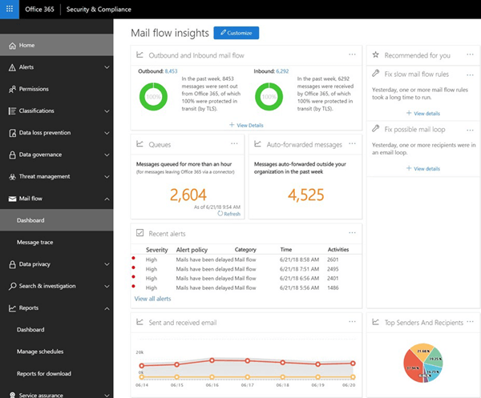

# Сведения о поЧтовых процессах в центре безопасности _Амп_ соответствие требованиямMail flow insights in the Security & Compliance Center

Администраторы могут использовать панель мониторинга почтовых ящиков в центре безопасности _Амп_ соответствия требованиям для обнаружения тенденций, аналитических данных и выполнения действий по устранению проблем, связанных с процессом обработки почты в организации Office 365.Admins can use mail flow dashboard in the Security & Compliance Center to discover trends, insights and take actions to fix issues related to mail flow in their Office 365 organization.

В панели мониторинга почтовых ящиков доступны подробные сведения, отчеты и графические элементы:The insights, reports, and widgets that are available in the mail flow dashboard are:

- [Поток обработки исходящей и входящей почтыOutbound and inbound mail flow](mfi-outbound-and-inbound-mail-flow.md)

- [Очереди и оповещения о нихQueue alerts and Queues](mfi-queue-alerts-and-queues.md)

- [Отчет по автоматически пересылаемым сообщениямAuto-forwarded messages report](mfi-auto-forwarded-messages-report.md)

- [Аналитика почтового циклаMail loop insight](mfi-mail-loop-insight.md)

- [Отображение аналитики правил потока обработки почтыSlow mail flow rules insight](mfi-slow-mail-flow-rules-insight.md)

## Разрешения, необходимые для просмотра панели мониторинга для почтового процессаPermissions required to view the mail flow dashboard

Панель мониторинга для обработки почты доступна следующим образом:The mail flow dashboard is available to:

- Члены роли **глобального администратора Office 365** .Members of the **Office 365 global administrator** role.

- Участники роли **администратора Exchange 365** .Members of **Office 365 Exchange administrator** role.

- Члены **роли администратора** поЧтовых ящиков в центре безопасности _Амп_ соответствие требованиям.Members of the **Mail flow administrator role** in the Security & Compliance Center. Если эта роль явным образом назначена пользователю, который не является членом роли глобального администратора или администратора Exchange:If this role is explicitly assigned to a user who isn't a member of the global administrator or Exchange administrator roles:

  - Пользователь должен войти в центр обеспечения безопасности _Амп_ непосредственно по адресу [https://protection.office.com](https://protection.office.com).The user must log in to the Security & Compliance Center directly at [https://protection.office.com](https://protection.office.com).

  - Пользователь будет иметь разрешение только на чтение для панели мониторинга почтового процесса.The user will only have read-only permission to the mail flow dashboard.

  - У пользователя не будет доступа к порталу администрирования Office 365.The user won't have access to the Office 365 admin portal.

Более подробную информацию о роли глобального администратора Office 365 вы найдете в статье [сведения о ролях администратора office 365](https://support.office.com/article/da585eea-f576-4f55-a1e0-87090b6aaa9d).For more information about the Office 365 global administrator role, see [About Office 365 admin roles](https://support.office.com/article/da585eea-f576-4f55-a1e0-87090b6aaa9d).

Сведения о назначении пользователям _Амп_ безопасности ролей центра соответствия требованиям можно узнать в статье [предоставление пользователям доступа к центру безопасности _Амп_ соответствия требованиям](https://support.office.com/article/2cfce2c8-20c5-47f9-afc4-24b059c1bd76).For information on assigning Security & Compliance Center roles to users, see [Give users access to the Security & Compliance Center](https://support.office.com/article/2cfce2c8-20c5-47f9-afc4-24b059c1bd76).

## Где найти панель мониторинга для почтового процессаWhere to find the mail flow dashboard

1. Перейдите в центр соответствия требованиям по безопасности _Амп_ [https://protection.office.com](https://protection.office.com)по адресу.Go to the Security & Compliance Center at [https://protection.office.com](https://protection.office.com).

2. Разверните \*\*\*\* узел поЧтовые ящики и выберите **панель мониторинга**.Expand **Mail flow** and then select **Dashboard**.

   
