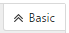
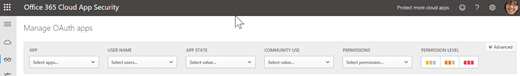

# Управление приложениями OAuth с помощью Office 365 Cloud App Security

|Ознакомительная версия * *\>**|Планирование * *\>**|Развертывание * *\>**|Использование * * * *|
|:-----|:-----|:-----|:-----|
|[Начало оценки](office-365-cas-overview.md)   |[Начало планирования](get-ready-for-office-365-cas.md)   |[Начало развертывания](turn-on-office-365-cas.md)   |Вот что вам!    [Дальнейшие действия](manage-app-permissions-in-ocas.md#nextsteps)   |
   
Люди любят приложения и часто их скачивают, особенно в приложениях, которые просматривают люди, позволяя легко получить доступ к своей рабочей или учебной информации. Однако некоторые приложения могут представлять угрозу безопасности вашей организации, в зависимости от того, какие сведения им обращаются и как они обрабатывают эту информацию. С помощью [Office 365 Cloud App Security](office-365-cas-overview.md), если вы являетесь администратором глобального или безопасности, вы можете управлять приложениями OAuth для Организации. Вы можете видеть, что пользователи используют данные Office 365, какие разрешения у этих приложений и другие. 
  
В этой статье описывается, как можно перейти к разделу Управление приложениями OAuth, как утвердить, запретить или сообщить о приложении, а также о том, как создать запрос приложения.
  
## Как найти страницу "Управление приложениями OAuth"

> [!NOTE]
> Управление приложениями OAuth осуществляется на портале Cloud App Security для Office 365. Для выполнения следующей задачи необходимо быть глобальным администратором или администратором безопасности. Чтобы узнать больше, ознакомьтесь с разРешениями [в &amp; центре безопасности и соответствия требованиям Office 365](permissions-in-the-security-and-compliance-center.md). 
  
1. Перейдите на портал Cloud App Security ([https://portal.cloudappsecurity.com](https://portal.cloudappsecurity.com)) и выполните вход.
  
2. Выберите пункт **исследование** \> **приложений OAuth**.  
  
## Что вы увидите на странице "Управление приложениями OAuth"

В следующей таблице описываются элементы управления и параметры, доступные на странице "Управление приложениями OAuth".
  
|**Элемент**|**Описание**|
|:-----|:-----|
|Основной значок на панели запроса приложения    |Выберите этот параметр, чтобы перейти к расширенному режиму.    (Если вы видите раздел **Basic**, вы используете расширенное представление)    |
|Расширенный значок на панели запроса приложения    |Выберите этот параметр, чтобы перейти в базовое представление.    (Если вы видите **Расширенный**, вы используете базовое представление.)    |
|Значок "Открыть" или "закрыть все сведения" в списке приложений    |Щелкните этот значок, чтобы просмотреть больше или меньше сведений о каждом приложении.    |
|Значок экспорта в списке приложений    |Выберите этот значок, чтобы экспортировать CSV-файл, содержащий список приложений, число пользователей для каждого приложения, разрешения, связанные с приложением, уровнем разрешений, состоянием приложения и уровнем использования сообщества.    |
|Имя    |Используйте этот параметр для просмотра имени приложения. Выберите имя, чтобы просмотреть дополнительные сведения, такие как описание, издатель, веб-сайт приложения и идентификатор приложения.    |
|Авторизовано    |Используйте этот параметр, чтобы узнать, сколько пользователей авторизовано в приложении для доступа к своей учетной записи Office 365. Выберите число, чтобы просмотреть дополнительные сведения, например список учетных записей пользователей.    |
|Уровень разрешений    |Используйте этот параметр, чтобы узнать, какой объем доступа к приложению имеет Office 365. Уровни разрешений указывают на **низкие**, **средние**или **высокие**, где **недостаток** может означать, что приложение получает доступ только к профилю и имени пользователя. Выберите уровень, чтобы просмотреть дополнительные сведения, такие как разрешения, предоставленные приложению, использованию сообщества и связанные действия в [журнале](suspend-or-restore-an-account-in-ocas.md)управления.  |
|Последняя авторизация   |Используйте этот параметр, чтобы узнать дату и время, когда приложение OAuth получило Последнее разрешение на доступ к данным Office 365 вашей организации.    |
|Действия   |Используйте эту возможность, чтобы просмотреть или пометить приложение как утвержденное или запрещенное, сообщить о приложении OAuth в корпорацию Майкрософт или оставить его неопределенным.    |
   
## ПоМетка приложения как утвержденного

На странице " **Управление приложениями OAuth** " выберите приложение, которое нужно утвердить, и щелкните значок пометить **приложение как утвержденное** . 
  

  
Значок становится зеленым, а приложение утверждается для всех пользователей Office 365.
  
> [!NOTE]
> Если вы пометите приложение как утвержденное, не оказывает никакого действия для конечного пользователя. Визуальная маркировка утвержденных приложений поможет отделить их от приложений, которые еще не были проверены. 
  
## Запретить приложение

1. На странице " **Управление приложениями OAuth** " выберите приложение, которое нужно запретить, и нажмите значок пометить **приложение как заблокированный** . 
  
2. В поле сообщение уведомления оставьте существующий текст как есть или настройте текст. Укажите, следует ли уведомить пользователей о том, что их приложение заблокировано.   
  
3. Выберите пункт запретить **приложению**.

## Отправка отчета о приложении OAuth в корпорацию Майкрософт

Если вы хотите отправить приложение OAuth в корпорацию Майкрософт для анализа, вы можете сообщить об этом приложении.

1. На странице " **Управление приложениями OAuth** " выберите приложение, которое вы хотите послать для анализа.

2. Нажмите вертикальное многоточие, а затем выберите пункт **приложение отчета...**.  

3. В диалоговом окне **сообщить об этом приложении** используйте раскрывающийся список, чтобы указать вашу проблему. По умолчанию **это приложение является вредоносным** . Однако можно выбрать один из доступных вариантов.  

4. Предложен Оставьте параметр выбранным для контакта, а затем подтвердите (или измените) адрес электронной почты в списке.

5. Нажмите кнопку **Submit** (Отправить). 
    
## Создание запроса приложения

Рекомендуется использовать расширенное представление, которое выглядит следующим образом: 

В панели запроса приложения, если вы видите **Расширенный**, вы используете базовое представление. Нажмите кнопку **Дополнительно** , чтобы перейти к расширенному представлению. 

    
1. В области запроса используйте список **Выбор фильтра** для выбора варианта. 
    - **Приложение** Приложения с определенными именами
    - **Состояние приложения** Приложения на основе их состояния (утверждено, не определено или не определено)
    - **Использование сообщества** Приложения на основе сообщества используют уровни (редкие, редкие или распространенные)
    - **Уровень разрешений** Приложения, основанные на определенных уровнях разрешений 
    - **Разрешения** Приложения, для которых требуются определенные разрешения
    - **Приложение Publisher**  Приложения от определенных издателей
    - **User (пользователь** ) Приложения, авторизованные определенным пользователем
   
2. Выберите **равно** или **не равно**, а затем укажите значение для фильтра.
    
3. Чтобы добавить дополнительные фильтры, выберите знак "плюс" (), а затем повторите шаги 2 и 3.
    
4. Чтобы удалить фильтр, выберите x () рядом с именем фильтра.
    
Фильтры применяются автоматически, а список приложений соответствующим образом обновляется.
  
## Дальнейшие действия

- [Просмотр оповещений и выполнение действий с ними](review-office-365-cas-alerts.md)
    
- Просмотр [журналов и источников данных веб-трафика для Office 365 Cloud App Security](web-traffic-logs-and-data-sources-for-ocas.md)
    
- Обзор [действий по использованию для Office 365 Cloud App Security](utilization-activities-for-ocas.md)
    

