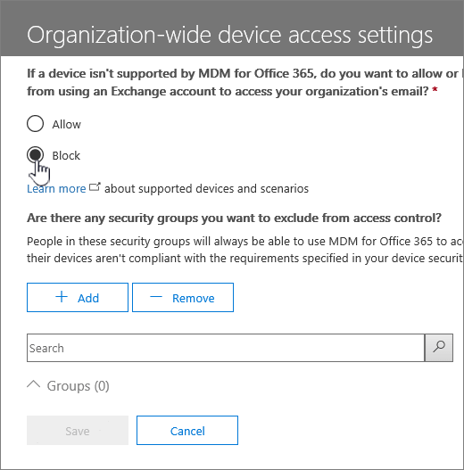

# Управление параметрами доступа устройствManage device access settings

Если вы используете Mobile Device Management (MDM) в Office 365, может быть устройств, которые не может управлять с помощью MDM. If таким образом, следует блокировать доступа приложения Exchange ActiveSync для электронной почты Office 365 для мобильных устройств, которые являются *не* поддерживается MDM для Office 365. Это позволит безопасного вашей организации сведения о самых разных устройств.If you're using Mobile Device Management (MDM) in Office 365, there may be devices that you can't manage by using MDM. If so, you should block Exchange ActiveSync app access to Office 365 email for mobile devices that are  *not*  supported by MDM for Office 365. This will help secure your organization's information across more devices. 
  
Для этого сделайте следующее:To do this:
  
1. В разделе Безопасность &amp; центре соответствия требованиям, чтобы перейти на **защиту от потери данных\>политики безопасности устройств**.In the Security &amp; Compliance Center, go to **Data loss prevention\>Device security policies**.
    
2. Выберите **Управление параметрами доступа устройства всей организации**.Select **Manage organization-wide device access settings**.
    
    
  
3. Нажмите **Блокировать**. Select **Block**.
    
    
  
4. Нажмите кнопку **Сохранить**.Select **Save**.
    
    
  
Чтобы узнать, какие устройства MDM для Office 365 поддерживает, обратитесь к разделу [Возможности мобильного устройства управления для Office 365](capabilities-of-mobile-device-management.md).To learn what devices MDM for Office 365 supports, see [Capabilities of Mobile Device Management for Office 365](capabilities-of-mobile-device-management.md).
  

