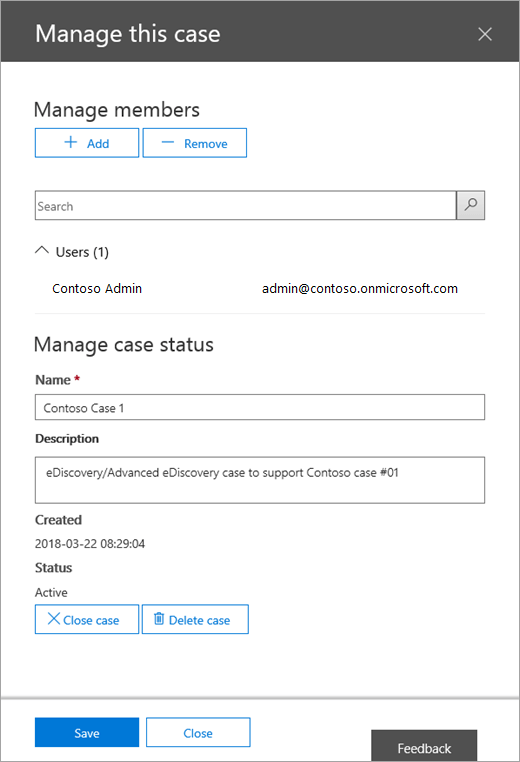
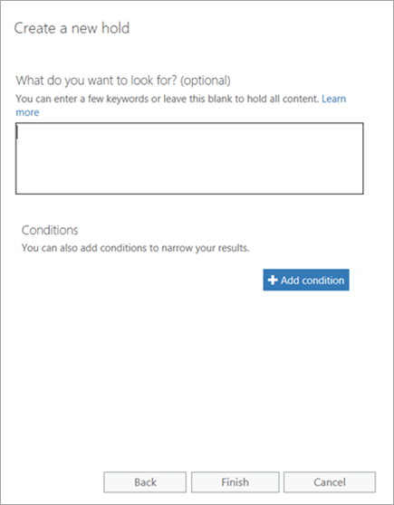
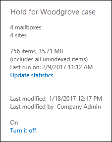

# <a name="manage-ediscovery-cases-in-the-office-365-security-amp-compliance-center"></a><span data-ttu-id="c953a-103">Управление делами обнаружения электронных данных в центре &amp; безопасности и соответствия требованиям Office 365</span><span class="sxs-lookup"><span data-stu-id="c953a-103">Manage eDiscovery cases in the Office 365 Security &amp; Compliance Center</span></span>

<span data-ttu-id="c953a-p101">С помощью вариантов обнаружения электронных данных в центре безопасности &amp; Office 365 вы можете управлять тем, кто может создавать и управлять делами обнаружения электронных данных в Организации. Если у вашей организации есть подписка на Office 365, вы также можете использовать случаи обнаружения электронных данных для анализа результатов поиска с помощью Office 365 Advanced eDiscovery.</span><span class="sxs-lookup"><span data-stu-id="c953a-p101">You can use eDiscovery cases in the Office 365 Security &amp; Compliance Center to control who can create, access, and manage eDiscovery cases in your organization. If your organization has an Office 365 E5 subscription, you can also use eDiscovery cases to analyze search results by using Office 365 Advanced eDiscovery.</span></span>
  
<span data-ttu-id="c953a-p102">Вариант обнаружения электронных данных позволяет добавлять участников в обращение, управлять типами действий, которые могут выполняться конкретными случаями, размещайте удержание на местах содержимого, относящихся к юридическим случаям, и связывание нескольких поисков контента с одним вариантом. Кроме того, вы можете экспортировать результаты любого поиска контента, связанного с обращением, или подготовить результаты поиска для анализа в Advanced eDiscovery. случаи обнаружения электронных данных — это хороший способ ограничить доступ к поиску контента и результаты поиска для определенного юридического случая в Организации.</span><span class="sxs-lookup"><span data-stu-id="c953a-p102">An eDiscovery case allows you to add members to a case, control what types of actions that specific case members can perform, place a hold on content locations relevant to a legal case, and associate multiple Content Searches with a single case. You can also export the results of any Content Search that is associated with a case or prepare search results for analysis in Advanced eDiscovery. eDiscovery cases are a good way to limit who has access to Content Searches and search results for a specific legal case in your organization.</span></span>
  
<span data-ttu-id="c953a-109">Используйте следующий рабочий процесс, чтобы настроить и использовать случаи обнаружения электронных данных в &amp; центре безопасности и Advanced eDiscovery.</span><span class="sxs-lookup"><span data-stu-id="c953a-109">Use the following workflow to set up and use eDiscovery cases in the Security &amp; Compliance Center and Advanced eDiscovery.</span></span>
  
[<span data-ttu-id="c953a-110">Шаг 1. Назначение разрешений на обнаружение электронных данных возможным членам дела</span><span class="sxs-lookup"><span data-stu-id="c953a-110">Step 1: Assign eDiscovery permissions to potential case members</span></span>](manage-ediscovery-cases.md#step1_1)
  
[<span data-ttu-id="c953a-111">Шаг 2: создание нового дела</span><span class="sxs-lookup"><span data-stu-id="c953a-111">Step 2: Create a new case</span></span>](manage-ediscovery-cases.md#step2_1)
  
[<span data-ttu-id="c953a-112">Шаг 3: Добавление участников в обращение</span><span class="sxs-lookup"><span data-stu-id="c953a-112">Step 3: Add members to a case</span></span>](manage-ediscovery-cases.md#step2a_1)
  
[<span data-ttu-id="c953a-113">Шаг 4: размещение расположений содержимого на удержании</span><span class="sxs-lookup"><span data-stu-id="c953a-113">Step 4: Place content locations on hold</span></span>](manage-ediscovery-cases.md#step3_1)
  
[<span data-ttu-id="c953a-114">Шаг 5: создание и выполнение поиска контента, связанного с обращением</span><span class="sxs-lookup"><span data-stu-id="c953a-114">Step 5: Create and run a Content Search associated with a case</span></span>](manage-ediscovery-cases.md#step4_1)
  
[<span data-ttu-id="c953a-115">Шаг 6: экспорт результатов поиска контента, связанных с обращением</span><span class="sxs-lookup"><span data-stu-id="c953a-115">Step 6: Export the results of a Content Search associated with a case</span></span>](manage-ediscovery-cases.md#step5_1)
  
[<span data-ttu-id="c953a-116">Шаг 7: подготовка результатов поиска для расширенного обнаружения электронных данных</span><span class="sxs-lookup"><span data-stu-id="c953a-116">Step 7: Prepare search results for Advanced eDiscovery</span></span>](manage-ediscovery-cases.md#step7_1)
  
[<span data-ttu-id="c953a-117">Шаг 8: переход к обращению в Advanced eDiscovery</span><span class="sxs-lookup"><span data-stu-id="c953a-117">Step 8: Go to the case in Advanced eDiscovery</span></span>](manage-ediscovery-cases.md#gotoAeD_1)
  
[<span data-ttu-id="c953a-118">Необязательно Шаг 9: закрытие дела</span><span class="sxs-lookup"><span data-stu-id="c953a-118">(Optional) Step 9: Close a case</span></span>](manage-ediscovery-cases.md#closecase_1)
  
[<span data-ttu-id="c953a-119">Необязательно Шаг 10: повторное открытие закрытого дела</span><span class="sxs-lookup"><span data-stu-id="c953a-119">(Optional) Step 10: Re-open a closed case</span></span>](manage-ediscovery-cases.md#reopencase_1)
  
[<span data-ttu-id="c953a-120">Дополнительные сведения</span><span class="sxs-lookup"><span data-stu-id="c953a-120">More information</span></span>](manage-ediscovery-cases.md#moreinfo_1)
  
## <a name="step-1-assign-ediscovery-permissions-to-potential-case-members"></a><span data-ttu-id="c953a-121">Шаг 1. Назначение разрешений на обнаружение электронных данных возможным членам дела</span><span class="sxs-lookup"><span data-stu-id="c953a-121">Step 1: Assign eDiscovery permissions to potential case members</span></span>
<span data-ttu-id="c953a-122"><a name="step1_1"> </a></span><span class="sxs-lookup"><span data-stu-id="c953a-122"></span></span>

<span data-ttu-id="c953a-p103">Первым шагом является назначение соответствующих разрешений обнаружения электронных данных пользователям, чтобы их можно было добавить в дело обнаружения электронных данных на этапе 2. Чтобы назначить разрешения на обнаружение электронных данных, необходимо быть членом группы ролей "Управление организацией" (или назначить роль управления ролями) в &amp; центре безопасности и соответствия требованиям Office 365. В следующем списке описываются группы ролей, связанные с eDiscovery, в центре &amp; безопасности и соответствия требованиям.</span><span class="sxs-lookup"><span data-stu-id="c953a-p103">The first step is to assign the appropriate eDiscovery-related permissions to people so you can add them to an eDiscovery case in Step 2. You have to be a member of the Organization Management role group (or be assigned the Role Management role) in the Office 365 Security &amp; Compliance Center to assign eDiscovery permissions. The following list describes the eDiscovery-related role groups in the Security &amp; Compliance Center.</span></span>
  
- <span data-ttu-id="c953a-p104">**Проверяющий** Эта группа ролей обладает наиболее ограниченными разрешениями, связанными с eDiscovery. Участники этой группы могут просматривать и открывать список обращений на странице **обнаружения электронных** данных в центре соответствия требованиям безопасности &amp; , участником которого они являются. Они не могут создавать обращения, добавлять элементы в обращение, создавать удержания, создавать поиски, экспортировать результаты поиска и подготавливать результаты для расширенного обнаружения электронных данных. Тем не менее, участники могут получать доступ к обращениям в Advanced eDiscovery для выполнения задач анализа.</span><span class="sxs-lookup"><span data-stu-id="c953a-p104">**Reviewer**This role group has the most restrictive eDiscovery-related permissions. Members of this group can only see and open the list of the cases on the **eDiscovery** page in the Security &amp; Compliance Center that they are members of. They can't create cases, add members to a case, create holds, create searches, export search results, or prepare results for Advanced eDiscovery. However, members can access cases in Advanced eDiscovery to perform analysis tasks.</span></span> 
    
- <span data-ttu-id="c953a-p105">**Диспетчер обнаружения электронных** данных Члены этой группы ролей могут создавать случаи обнаружения электронных данных и управлять ими. Они могут добавлять и удалять элементы, размещать расположения содержимого на удержании, создавать и редактировать поиск контента, связанные с обращением, экспортировать результаты поиска контента и подготовить результаты поиска для анализа в Advanced eDiscovery. В этой группе ролей есть две вложенные группы. Разница между этими подгруппами основана на области.</span><span class="sxs-lookup"><span data-stu-id="c953a-p105">**eDiscovery Manager**Members of this role group can create and manage eDiscovery cases. They can add and remove members, place content locations on hold, create and edit Content Searches associated with a case, export the results of a Content Search, and prepare search results for analysis in Advanced eDiscovery. There are two sub-groups in this role group. The difference between these subgroups is based on scope.</span></span>
    
  - <span data-ttu-id="c953a-p106">**Диспетчер обнаружения электронных** данных Возможность просмотра и управления делами обнаружения электронных данных, которые они создают или являются участниками. Если другой диспетчер обнаружения электронных данных создает обращение, но не добавляет второй диспетчер обнаружения электронных данных в качестве участника этого случая, второй диспетчер обнаружения электронных данных не сможет просмотреть или открыть это обращение на странице **обнаружения электронных** данных в &amp; центре безопасности и соответствия требованиям. Диспетчеры обнаружения электронных данных также могут получать доступ к своим случаям в Advanced eDiscovery для выполнения задач анализа.</span><span class="sxs-lookup"><span data-stu-id="c953a-p106">**eDiscovery Manager**Can view and manage the eDiscovery cases they create or are a member of. If another eDiscovery Manager creates a case but doesn't add a second eDiscovery Manager as a member of that case, the second eDiscovery Manager won't be able to view or open the case on the **eDiscovery** page in the Security &amp; Compliance Center. eDiscovery Managers can also access their cases in Advanced eDiscovery to perform analysis tasks.</span></span> 
    
  - <span data-ttu-id="c953a-p107">**Администратор обнаружения электронных** данных Может выполнять все задачи управления делами, которые может выполнять диспетчер обнаружения электронных данных. Кроме того, администратор обнаружения электронных данных может выполнять следующие действия:</span><span class="sxs-lookup"><span data-stu-id="c953a-p107">**eDiscovery Administrator**Can perform all case management tasks that an eDiscovery Manager can do. Additionally, an eDiscovery Administrator can:</span></span>
    
  - <span data-ttu-id="c953a-139">Просматривать все дела, отображаемые на странице **Обнаружение электронных данных**.</span><span class="sxs-lookup"><span data-stu-id="c953a-139">View all cases that are listed on the **eDiscovery** page.</span></span> 
    
  - <span data-ttu-id="c953a-140">Управление любым вариантом обнаружения электронных данных в Организации после добавления себя в качестве участника дела.</span><span class="sxs-lookup"><span data-stu-id="c953a-140">Manage any eDiscovery case in the organization after they add themself as a member of the case.</span></span>
    
  - <span data-ttu-id="c953a-p108">Выполнение задач администрирования в расширенном eDiscovery, например данных об обработке обращений для анализа, Настройка параметров обращения и экспорт данных из расширенного обнаружения электронных данных. Это связано с тем, что пользователь, который является администратором обнаружения &amp; электронных данных в центре безопасности и соответствия требованиям, автоматически добавляется в качестве администратора в ходе расширенного обнаружения электронных данных.</span><span class="sxs-lookup"><span data-stu-id="c953a-p108">Perform administrative tasks in Advanced eDiscovery, such as processing case data for analysis, configuring case settings, and exporting data from Advanced eDiscovery. This is because a person who is an eDiscovery Administrator in the Security &amp; Compliance Center is automatically added as an administrator in Advanced eDiscovery.</span></span>
    
    <span data-ttu-id="c953a-143">Причины, по которым организации нужен администратор, ответственный за обнаружение электронных данных, см. в разделе [More information](manage-ediscovery-cases.md#moreinfo_1).</span><span class="sxs-lookup"><span data-stu-id="c953a-143">See the [More information](manage-ediscovery-cases.md#moreinfo_1) section for reasons why you may want an eDiscovery Administrator in your organization.</span></span> 
    
> [!IMPORTANT]
> <span data-ttu-id="c953a-144">Если пользователь не является участником одной из этих групп ролей, связанных с eDiscovery, или не является членом группы ролей, которой назначена роль проверяющего, вы не можете добавить их в качестве члена дела обнаружения электронных данных.</span><span class="sxs-lookup"><span data-stu-id="c953a-144">If a person isn't a member of one of these eDiscovery-related role groups, or isn't a member of a role group that's assigned the Reviewer role, you can't add them as a member of an eDiscovery case.</span></span> 
  
 <span data-ttu-id="c953a-145">**Чтобы назначить разрешения на обнаружение электронных данных:**</span><span class="sxs-lookup"><span data-stu-id="c953a-145">**To assign eDiscovery permissions:**</span></span>
  
1. <span data-ttu-id="c953a-146">Перейдите по ссылке [https://protection.office.com](https://protection.office.com).</span><span class="sxs-lookup"><span data-stu-id="c953a-146">Go to [https://protection.office.com](https://protection.office.com).</span></span>
    
2. <span data-ttu-id="c953a-147">Войдите в Office 365 с помощью своей рабочей или учебной учетной записи.</span><span class="sxs-lookup"><span data-stu-id="c953a-147">Sign in to Office 365 using your work or school account.</span></span>
    
3. <span data-ttu-id="c953a-148">В центре безопасности &amp; и соответствия требованиям выберите **разрешения**, а затем выполните одно из следующих действий на основе разрешений обнаружения электронных данных, которые вы хотите назначить.</span><span class="sxs-lookup"><span data-stu-id="c953a-148">In the Security &amp; Compliance Center, click **Permissions**, and then do one of the following based on the eDiscovery permissions that you want to assign.</span></span>
    
  - <span data-ttu-id="c953a-p109">Чтобы назначить разрешения рецензенту, выберите группу ролей **проверяющего** , а затем рядом с элементом щелкните **изменить**. \*\*\*\* Нажмите кнопку **выбрать участников**,  добавить значок **Добавить** , выберите пользователя, которого нужно добавить в группу ролей рецензента, а затем нажмите кнопку **Добавить**.</span><span class="sxs-lookup"><span data-stu-id="c953a-p109">To assign Reviewer permissions, select the **Reviewer** role group, and then next to **Members** click **Edit**. Click **Choose members**, click  **Add** select the user that you want to add to the Reviewer role group, and then click **Add**.</span></span>
    
  - <span data-ttu-id="c953a-p110">Чтобы назначить разрешения для диспетчера обнаружения электронных данных, выберите группу ролей **Диспетчер** обнаружения электронных данных, а затем рядом с элементом **Диспетчер обнаружения электронных**данных нажмите кнопку **изменить**. Щелкните **Выбор диспетчера обнаружения электронных**данных  кнопку Добавить значок \* \* Добавить \* \*, выберите пользователя, которого нужно добавить в качестве диспетчера обнаружения электронных данных, а затем нажмите кнопку **Добавить**.</span><span class="sxs-lookup"><span data-stu-id="c953a-p110">To assign eDiscovery Manager permissions, select the **eDiscovery Manager** role group, and then next to **eDiscovery Manager**, click **Edit**. Click **Choose eDiscovery Manager**, click  \*\* Add \*\*, select the user that you want to add as an eDiscovery Manager, and then click **Add**.</span></span>
    
  - <span data-ttu-id="c953a-p111">Чтобы назначить разрешения администратора обнаружения электронных данных, выберите группу ролей **Диспетчер обнаружения** электронных данных, а затем рядом с элементом **Администратор обнаружения электронных**данных нажмите кнопку **изменить**. Нажмите **выбрать администратора обнаружения электронных**данных  добавить значок **Добавить**, выберите пользователя, которого вы хотите добавить в качестве администратора обнаружения электронных данных, а затем нажмите кнопку **Добавить**.</span><span class="sxs-lookup"><span data-stu-id="c953a-p111">To assign eDiscovery Administrator permissions, select the **eDiscovery Manager** role group, and then next to **eDiscovery Administrator**, click **Edit**. Click **Choose eDiscovery Administrator**, click  **Add**, select the user that you want to add as an eDiscovery Administrator, and then click **Add**.</span></span>
    
4. <span data-ttu-id="c953a-155">Добавив всех пользователей, нажмите кнопку **Готово**, нажмите кнопку **сохранить** , чтобы сохранить изменения в группе ролей, а затем нажмите кнопку **Закрыть**.</span><span class="sxs-lookup"><span data-stu-id="c953a-155">After you've added all the users, click **Done**, click **Save** to save the changes to the role group, and then click **Close**.</span></span>
    

  
## <a name="step-2-create-a-new-case"></a><span data-ttu-id="c953a-156">Шаг 2: создание нового дела</span><span class="sxs-lookup"><span data-stu-id="c953a-156">Step 2: Create a new case</span></span>
<span data-ttu-id="c953a-157"><a name="step2_1"> </a></span><span class="sxs-lookup"><span data-stu-id="c953a-157"></span></span>

<span data-ttu-id="c953a-p112">Следующий шаг — создание нового дела eDiscovery. Чтобы создать случаи обнаружения электронных данных, необходимо быть членом группы ролей "руководители обнаружения электронных данных". Как описывалось ранее, после создания нового дела в центре безопасности &amp; и соответствия требованиям вы (и другие элементы Case) смогут получить доступ к тому же регистру в Advanced eDiscovery, если у вашей организации есть подписка на Office 365.</span><span class="sxs-lookup"><span data-stu-id="c953a-p112">The next step is to create a new eDiscovery case. You must be a member of the eDiscovery Managers role group to create eDiscovery cases. As previously explained, after you create a new case in the Security &amp; Compliance Center, you (and other case members) will be able to access that same case in Advanced eDiscovery if you're organization has an Office 365 E5 subscription.</span></span>
  
1. <span data-ttu-id="c953a-161">Перейдите по ссылке [https://protection.office.com](https://protection.office.com).</span><span class="sxs-lookup"><span data-stu-id="c953a-161">Go to [https://protection.office.com](https://protection.office.com).</span></span>
    
2. <span data-ttu-id="c953a-162">Войдите в Office 365 с помощью своей рабочей или учебной учетной записи.</span><span class="sxs-lookup"><span data-stu-id="c953a-162">Sign in to Office 365 using your work or school account.</span></span>
    
3. <span data-ttu-id="c953a-163">В центре безопасности &amp; и соответствия требованиям нажмите кнопку \> \*\*Поиск &amp; \*\* **обнаружения электронных**данных, а  кнопку Добавить значок **создать обращение**.</span><span class="sxs-lookup"><span data-stu-id="c953a-163">In the Security &amp; Compliance Center, click **Search &amp; investigation** \> **eDiscovery**, and then click  **Create a case**.</span></span>
    
4. <span data-ttu-id="c953a-p113">На странице **новый вариант** укажите имя, введите необязательное описание, а затем нажмите кнопку **сохранить**. Обратите внимание, что имя дела должно быть уникальным в Организации.</span><span class="sxs-lookup"><span data-stu-id="c953a-p113">On the **New Case** page, give the case a name, type an optional description, and then click **Save**. Note that the case name must be unique in your organization.</span></span>
    
    
  
    <span data-ttu-id="c953a-p114">Новый вариант отображается в списке обращений на странице **Обнаружение электронных** данных. Обратите внимание на то, что вы можете навести указатель мыши на имя обращения, чтобы отобразить сведения о нем, в том числе состояние обращения ( **активное** или **закрытое**), описание варианта (созданного на предыдущем шаге), а также когда обращение было изменено последним и кто его изменил.</span><span class="sxs-lookup"><span data-stu-id="c953a-p114">The new case is displayed in the list of cases on the **eDiscovery** page. Note that you can hover the cursor over a case name to display information about the case, including the status of the case ( **Active** or **Closed**), the description of the case (that was created in the previous step), and when the case was changed last and who changed it.</span></span>
    
    > [!TIP]
    > <span data-ttu-id="c953a-p115">После создания нового дела вы можете переименовать его в любое время. Просто щелкните имя варианта на странице **Обнаружение электронных** данных. На всплывающей странице **Управление этим вариантом** измените имя, отображаемое в поле **имя**, а затем сохраните изменения.</span><span class="sxs-lookup"><span data-stu-id="c953a-p115">After you create a new case, you can rename it anytime. Just click the name of the case on the **eDiscovery** page. On the **Manage this case** flyout page, change the name displayed in the box under **Name**, and then save the change.</span></span> 
  
## <a name="step-3-add-members-to-a-case"></a><span data-ttu-id="c953a-172">Шаг 3: Добавление участников в обращение</span><span class="sxs-lookup"><span data-stu-id="c953a-172">Step 3: Add members to a case</span></span>
<span data-ttu-id="c953a-173"><a name="step2a_1"> </a></span><span class="sxs-lookup"><span data-stu-id="c953a-173"></span></span>

<span data-ttu-id="c953a-p116">После создания нового случая необходимо добавить в него участников. Как и в предыдущем примере, в качестве члена группы можно добавить только тех пользователей, которые являются участниками группы ролей проверяющего или диспетчера eDiscovery. Обратите внимание, что диспетчер обнаружения электронных данных, создавший обращение, автоматически добавляется в качестве участника.</span><span class="sxs-lookup"><span data-stu-id="c953a-p116">After you create a new case, the next step is to add members to the case. As previous explained, only users that are members of the Reviewer or eDiscovery Manager role groups can be added as a member of the case. Note that the eDiscovery Manager who created the case is automatically added as a member.</span></span>
  
1. <span data-ttu-id="c953a-177">Чтобы отобразился список дел в организации, в Центре безопасности и соответствия требованиям выберите **Поиск и исследование** \> **Обнаружение электронных данных**.</span><span class="sxs-lookup"><span data-stu-id="c953a-177">In the Security &amp; Compliance Center, click **Search &amp; investigation** \> **eDiscovery** to display the list of cases in your organization.</span></span> 
    
2. <span data-ttu-id="c953a-178">Щелкните имя обращения, в которое требуется добавить участников.</span><span class="sxs-lookup"><span data-stu-id="c953a-178">Click the name of the case that you want to add members to.</span></span>
    
    <span data-ttu-id="c953a-179">Отображается раскрывающаяся страница **Управление этим обращением** .</span><span class="sxs-lookup"><span data-stu-id="c953a-179">The **Manage this case** flyout page is displayed.</span></span> 
    
    
  
3. <span data-ttu-id="c953a-181">В разделе **Управление участниками**нажмите  значок **Добавить** , чтобы добавить участников в обращение.</span><span class="sxs-lookup"><span data-stu-id="c953a-181">Under **Manage members**, click  **Add** to add members to the case.</span></span> 
    
4. <span data-ttu-id="c953a-182">В списке пользователей, которых можно добавить в качестве участника, установите флажок рядом с именем людей, которых вы хотите добавить в обращение.</span><span class="sxs-lookup"><span data-stu-id="c953a-182">In the list of people who can be added as a member of the case, click the checkbox next to the name of the people you want to add to the case.</span></span>
    
    > [!TIP]
    > <span data-ttu-id="c953a-183">Если у вас есть большой список людей, которые могут добавляться в качестве участников, используйте поле **поиска** для поиска определенного пользователя в списке.</span><span class="sxs-lookup"><span data-stu-id="c953a-183">If you have a large list of people who can added as members, use the **Search** box to search for a specific person in the list.</span></span> 
  
5. <span data-ttu-id="c953a-184">Выбрав людей для добавления в качестве участников группы, нажмите кнопку **Добавить**.</span><span class="sxs-lookup"><span data-stu-id="c953a-184">After you've selected the people to add as members of the group, click **Add**.</span></span>
    
    <span data-ttu-id="c953a-185">В разделе **Управление этим случаем**нажмите кнопку **сохранить** , чтобы сохранить новый список элементов дела.</span><span class="sxs-lookup"><span data-stu-id="c953a-185">In **Manage this case**, click **Save** to save the new list of case members.</span></span> 
    
6. <span data-ttu-id="c953a-186">Нажмите кнопку **сохранить** , чтобы сохранить новый список элементов дела.</span><span class="sxs-lookup"><span data-stu-id="c953a-186">Click **Save** to save the new list of case members.</span></span> 
  
## <a name="step-4-place-content-locations-on-hold"></a><span data-ttu-id="c953a-187">Шаг 4: размещение расположений содержимого на удержании</span><span class="sxs-lookup"><span data-stu-id="c953a-187">Step 4: Place content locations on hold</span></span>
<span data-ttu-id="c953a-188"><a name="step3_1"> </a></span><span class="sxs-lookup"><span data-stu-id="c953a-188"></span></span>

<span data-ttu-id="c953a-p117">С помощью дела eDiscovery можно создавать удержания для сохранения содержимого, которое может быть релевантно для случая. Вы можете поместить удержание на сайты почтовых ящиков и OneDrive для бизнеса для людей, которые custodians в случае. Вы также можете поместить удержание на сайт группового почтового ящика, сайта SharePoint и сайта OneDrive для бизнеса для группы Office 365. Аналогичным образом можно поместить удержание на почтовый ящик и сайт, связанные с Microsoft Teams. При помещении расположений контента в удержание содержимое удерживается до тех пор, пока не будет удалено место хранения контента или не будет удалено удержание.</span><span class="sxs-lookup"><span data-stu-id="c953a-p117">You can use an eDiscovery case to create holds to preserve content that might be relevant to the case. You can place a hold on the mailboxes and OneDrive for Business sites of people who are custodians in the case. You can also place a hold on the group mailbox, SharePoint site, and OneDrive for Business site for an Office 365 Group. Similarly, you can place a hold on the mailbox and site that are associated with Microsoft Teams. When you place content locations on hold, content is held until you remove the hold from the content location or until you delete the hold.</span></span>
  
<span data-ttu-id="c953a-194">При создании удержания вы можете использовать следующие параметры для определения области контента, который хранится в указанных расположениях контента:</span><span class="sxs-lookup"><span data-stu-id="c953a-194">When you create a hold, you have the following options to scope the content that is held in the specified content locations:</span></span>
  
- <span data-ttu-id="c953a-p118">Вы создаете бесконечное удержание, в котором все содержимое размещается на удержании. Кроме того, вы можете создать удержание на основе запроса, в котором на удержание помещается только содержимое, соответствующее поисковому запросу.</span><span class="sxs-lookup"><span data-stu-id="c953a-p118">You create an infinite hold where all content is placed on hold. Alternatively, you can create a query-based hold where only content that matches a search query is placed on hold.</span></span>
    
- <span data-ttu-id="c953a-p119">Вы можете указать диапазон дат, в течение которого будет храниться только содержимое, которое было отправлено, получено или создано в пределах этого диапазона дат. Кроме того, вы можете хранить все содержимое независимо от того, когда оно было отправлено, получено или создано.</span><span class="sxs-lookup"><span data-stu-id="c953a-p119">You can specify a date range to hold only the content that was sent, received, or created within that date range. Alternatively, you can hold all content regardless of when it was sent, received, or created.</span></span>
    
> [!NOTE]
> <span data-ttu-id="c953a-199">Вы можете использовать до 10 000 политик хранения для всех вариантов обнаружения электронных данных в Организации.</span><span class="sxs-lookup"><span data-stu-id="c953a-199">You can have a maximum of 10,000 hold policies across all eDiscovery cases in your organization.</span></span> 
  
<span data-ttu-id="c953a-200">Чтобы создать удержание для случая обнаружения электронных данных, выполните указанные ниже действия.</span><span class="sxs-lookup"><span data-stu-id="c953a-200">To create a hold for an eDiscovery case:</span></span>
  
1. <span data-ttu-id="c953a-201">Чтобы отобразился список дел в организации, в Центре безопасности и соответствия требованиям выберите **Поиск и исследование** \> **Обнаружение электронных данных**.</span><span class="sxs-lookup"><span data-stu-id="c953a-201">In the Security &amp; Compliance Center, click **Search &amp; investigation** \> **eDiscovery** to display the list of cases in your organization.</span></span> 
    
2. <span data-ttu-id="c953a-202">Нажмите кнопку **Открыть** рядом с тем случае, в котором нужно создать удержания.</span><span class="sxs-lookup"><span data-stu-id="c953a-202">Click **Open** next to the case that you want to create the holds in.</span></span> 
    
3. <span data-ttu-id="c953a-203">На **домашней** странице для этого случая нажмите кнопку **удержание**.</span><span class="sxs-lookup"><span data-stu-id="c953a-203">On the **Home** page for the case, click **Hold**.</span></span>
    
    
  
4. <span data-ttu-id="c953a-205">На странице **удержание** нажмите кнопку **создать**добавить.</span><span class="sxs-lookup"><span data-stu-id="c953a-205">On the **Hold** page, click **New**.</span></span>
    
5. <span data-ttu-id="c953a-p120">На странице **Создание удержания** укажите имя для удержания. Имя удержания должно быть уникальным в пределах организации. </span><span class="sxs-lookup"><span data-stu-id="c953a-p120">On the **Create a new hold** page, give the hold a name. The name of the hold must be unique in your organization.</span></span> 
    
6. <span data-ttu-id="c953a-p121">Выберите расположения контента, которые необходимо разместить на удержании. Вы можете размещать почтовые ящики, сайты и общедоступные папки на удержании.</span><span class="sxs-lookup"><span data-stu-id="c953a-p121">Choose the content locations that you want to place on hold. You can place mailboxes, sites, and public folders on hold.</span></span>
    
    
  
1. <span data-ttu-id="c953a-p122">\*\*\*\* ПоЧтовые ящики Нажмите кнопку **Добавить** , чтобы указать почтовые ящики, которые необходимо разместить на удержании. Используйте поле поиска для поиска почтовых ящиков пользователей и групп рассылки (чтобы заблокировать почтовые ящики участников группы), чтобы разместить их на удержании. Вы также можете разместить удержание на связанном почтовом ящике для группы Office 365 или группы Майкрософт.</span><span class="sxs-lookup"><span data-stu-id="c953a-p122">**Mailboxes** Click **Add** to specify mailboxes to place on hold. Use the search box to find user mailboxes and distribution groups (to place a hold on the mailboxes of group members) to place on hold. You can also place a hold on the associated mailbox for an Office 365 Group or a Microsoft Team.</span></span> 
    
    > [!NOTE]
    > <span data-ttu-id="c953a-p123">Если нажать кнопку **Добавить** , чтобы указать почтовые ящики, которые будут храниться, средство выбора почтовых ящиков будет пустым. Это сделано для улучшения производительности. Чтобы добавить пользователей в этот список, введите в поле поиска имя (не менее 3 символов) и щелкните значок](media/5f6f9463-50e9-460b-8738-b67e759c2efc.gif)поиска **поиска** to specify mailboxes to place on hold, the mailbox picker that's displayed is empty. This is by design to enhance performance. To add people to this list, type a name (a minimum of 3 characters) in the search box and click **Search**.</span></span> 
  
2. <span data-ttu-id="c953a-p124">**Сайты** Нажмите **Добавить** добавить, чтобы указать сайты SharePoint и OneDrive для бизнеса, которые необходимо разместить на удержании. Введите URL-адрес для каждого сайта, который необходимо разместить на удержании. Вы также можете добавить URL-адрес сайта SharePoint для группы Office 365 или группы Майкрософт.</span><span class="sxs-lookup"><span data-stu-id="c953a-p124">**Sites** Click **Add** to specify SharePoint and OneDrive for Business sites to place on hold. Type the URL for each site that you want to place on hold. You can also add the URL for the SharePoint site for an Office 365 Group or a Microsoft Team.</span></span> 
    
    <span data-ttu-id="c953a-220">В разделе [Дополнительные сведения](https://support.office.com/article/edea80d6-20a7-40fb-b8c4-5e8c8395f6da.aspx#moreinfo_1) приведены советы по размещению групп Office 365 и Microsoft Teams на удержании.</span><span class="sxs-lookup"><span data-stu-id="c953a-220">See the [More information](https://support.office.com/article/edea80d6-20a7-40fb-b8c4-5e8c8395f6da.aspx#moreinfo_1) section for tips on putting Office 365 Groups and Microsoft Teams on hold.</span></span> 
    
    > [!NOTE]
    > <span data-ttu-id="c953a-p125">В редких случаях, когда имя участника-пользователя (UPN) изменено, URL-адрес его учетной записи OneDrive также изменится на включение нового имени участника-пользователя. В таком случае необходимо изменить удержание, добавив новый URL-адрес OneDrive пользователя и удалив старый.</span><span class="sxs-lookup"><span data-stu-id="c953a-p125">In the rare case that a person's user principal name (UPN) is changed, the URL for their OneDrive account will also be changed to incorporate the new UPN. If this happens, you'll have to modify the hold by adding the user's new OneDrive URL and removing the old one.</span></span> 
  
3. <span data-ttu-id="c953a-p126">**Общедоступные папки** Нажмите **удерживать все общедоступные папки** , чтобы поместить все общедоступные папки в организации Exchange Online на удержание. Обратите внимание, что вы не можете выбрать определенные общедоступные папки, которые будут храниться. Если вы не хотите хранить их в общедоступных папках, оставьте выбранным параметр **не хранить общедоступные папки** .</span><span class="sxs-lookup"><span data-stu-id="c953a-p126">**Public folders** Click **Hold all public folders** to put all of the public folders in your Exchange Online organization on hold. Note that you can't choose specific public folders to put on hold. Leave the **Don't hold any public folders** option selected if you don't want to put a hold on public folders.</span></span> 
    
7. <span data-ttu-id="c953a-226">Когда вы закончите Добавление расположений содержимого в удержание, нажмите кнопку **Далее**.</span><span class="sxs-lookup"><span data-stu-id="c953a-226">When you're done adding content locations to the hold, click **Next**.</span></span>
    
8. <span data-ttu-id="c953a-p127">Чтобы создать удержание на основе запроса с условиями, выполните приведенные ниже условия. В противном случае просто нажмите кнопку **Готово** , чтобы удерживать весь контент.</span><span class="sxs-lookup"><span data-stu-id="c953a-p127">To create a query-based hold with conditions, complete the following. Otherwise, just click **Finish** to hold all content.</span></span> 
    
    
  
    <span data-ttu-id="c953a-230">Для получения дополнительных сведений о создании поискового запроса и использовании условий просмотрите [запросы ключевых слов и условия поиска контента](keyword-queries-and-search-conditions.md).</span><span class="sxs-lookup"><span data-stu-id="c953a-230">For more information about creating a search query and using conditions, see [Keyword queries and search conditions for Content Search](keyword-queries-and-search-conditions.md).</span></span>
    
1. <span data-ttu-id="c953a-p128">В поле в разделе **что вы хотите искать?** введите поисковый запрос в поле, чтобы на удержание поместилось только содержимое, соответствующее условиям поиска. Можно указать ключевые слова, свойства сообщений или свойства документа, например имена файлов. Кроме того, можно использовать более сложные запросы, которые используют логический оператор, например **and**, **or**и **Not**. Если оставить поле ключевое слово пустым, то весь контент, расположенный в указанных расположениях контента, будет помещен на удержание.</span><span class="sxs-lookup"><span data-stu-id="c953a-p128">In the box under **What do you want us to look for?**, type a search query in the box so that only the content that meets the search criteria is placed on hold. You can specify keywords, message properties, or document properties, such as file names. You can also use more complex queries that use a Boolean operator, such as **AND**, **OR**, or **NOT**. If you leave the keyword box empty, then all content located in the specified content locations will be placed on hold.</span></span> 
    
2. <span data-ttu-id="c953a-p129">В разделе **условия**нажмите кнопку **Добавить условие** , чтобы добавить одно или несколько условий для сужения поискового запроса для удержания. Каждое условие добавляет в запрос поиска KQL предложение, созданное и выполняемое при создании удержания. Например, вы можете указать диапазон дат, чтобы документы электронной почты или документы сайта, созданные в пределах даты, помещаются на удержание. Условие логически подключается к запросу ключевого слова (указанному в поле ключевое слово) оператором **and** . Это означает, что элементы должны удовлетворять как запрос ключевых слов, так и условие, которое должно быть включено в удержание.</span><span class="sxs-lookup"><span data-stu-id="c953a-p129">Under **Conditions**, click **Add condition** to add one or more conditions to narrow the search query for the hold. Each condition adds a clause to the KQL search query that is created and run when you create the hold. For example you can specify a date range so that email or site documents that were created within the date ranged are placed on hold. A condition is logically connected to the keyword query (specified in the keyword box) by the **AND** operator. That means that items have to satisfy both the keyword query and the condition to be placed on hold.</span></span> 
    
9. <span data-ttu-id="c953a-240">После настройки удержания на основе запроса нажмите кнопку **Готово** , чтобы создать удержание.</span><span class="sxs-lookup"><span data-stu-id="c953a-240">After configuring a query-based hold, click **Finish** to create the hold.</span></span> 
  
### <a name="hold-statistics"></a><span data-ttu-id="c953a-241">Статистика удержания</span><span class="sxs-lookup"><span data-stu-id="c953a-241">Hold statistics</span></span>

<span data-ttu-id="c953a-p130">Через некоторое время сведения о новом удержании отображаются в области сведений на странице удержаний для \*\*\*\* выбранного удержания. Эта информация включает в себя количество почтовых ящиков и сайтов на удержании и статистику по содержимому, которое было включено в удержание, например общее число и размер элементов, включенных в удержание, а также время последнего расчета статистики удержания. Эти статистические данные помогают определить, какой объем содержимого, связанного с вариантом обнаружения электронных данных, было занято.</span><span class="sxs-lookup"><span data-stu-id="c953a-p130">After a while, information about the new hold is displayed in the details pane on the **Holds** page for the selected hold. This information includes the number of mailboxes and sites on hold and statistics about the content that was placed on hold, such as the total number and size of items placed on hold and the last time the hold statistics were calculated. These hold statistics help you identify how much content that's related to the eDiscovery case is being held.</span></span> 
  

  
<span data-ttu-id="c953a-246">Имейте в виду следующие моменты, касающиеся сбора статистики хранения:</span><span class="sxs-lookup"><span data-stu-id="c953a-246">Keep the following things in mind about hold statistics:</span></span>
  
- <span data-ttu-id="c953a-p131">Общее количество элементов на удержании указывает количество элементов из всех источников контента, размещаемых на удержании. Если вы создали удержание на основе запроса, эта статистика указывает количество элементов, которые совпадают с запросом.</span><span class="sxs-lookup"><span data-stu-id="c953a-p131">The total number of items on hold indicates the number of items from all content sources that are placed on hold. If you've created a query-based hold, this statistic indicates the number of items that match the query.</span></span>
    
- <span data-ttu-id="c953a-p132">Количество элементов на удержании также включает неиндексированные элементы, найденные в расположениях содержимого. Обратите внимание, что если вы создаете удержание на основе запроса, все неиндексированные элементы в расположениях содержимого размещаются на удержании. Сюда входят неиндексированные элементы, которые не соответствуют критериям поиска для хранения на основе запроса и неиндексированных элементов, которые могут находиться за пределами диапазона дат. Это отличается от того, что происходит при выполнении поиска контента, если неиндексированные элементы, которые не отвечают поисковому запросу или исключены с помощью условия диапазона дат, не включаются в результаты поиска. Дополнительные сведения о неиндексированных элементах см [в разделе Поиск контента в Office 365](partially-indexed-items-in-content-search.md).</span><span class="sxs-lookup"><span data-stu-id="c953a-p132">The number of items on hold also includes unindexed items found in the content locations. Note that if you create a query-based hold, all unindexed items in the content locations are placed on hold. This includes unindexed items that don't match the search criteria of a query-based hold and unindexed items that might fall outside of a date range condition. This is different than what happens when you run a Content Search, in which unindexed items that don't match the search query or are excluded by a date range condition aren't included in the search results. For more information about unindexed items, see [Unindexed items in Content Search in Office 365](partially-indexed-items-in-content-search.md).</span></span>
    
- <span data-ttu-id="c953a-p133">Вы можете получить последнюю статистику хранения, нажав кнопку **Обновить статистику** , чтобы повторно выполнить оценку поиска, которая вычисляет текущее количество элементов на удержании. При необходимости щелкните **Обновить** обновления на панели инструментов, чтобы обновить статистику удержания в области сведений.</span><span class="sxs-lookup"><span data-stu-id="c953a-p133">You can get the latest hold statistics by clicking **Update statistics** to re-run a search estimate that calculates the current number of items on hold. If necessary, click **Refresh** in the toolbar to update the hold statistics in the details pane.</span></span> 
    
- <span data-ttu-id="c953a-256">Обычно количество элементов на удержании увеличивается, так как пользователи, чьи почтовые ящики или сайты на удержании обычно отправляют и получают новые сообщения электронной почты, а также для создания документов SharePoint и OneDrive для бизнеса.</span><span class="sxs-lookup"><span data-stu-id="c953a-256">It's normal for the number of items on hold to increase over time because users whose mailbox or site is on hold are typically sending or receiving new email message and creating new SharePoint and OneDrive for Business documents.</span></span>
  
## <a name="step-5-create-and-run-a-content-search-associated-with-a-case"></a><span data-ttu-id="c953a-257">Шаг 5: создание и выполнение поиска контента, связанного с обращением</span><span class="sxs-lookup"><span data-stu-id="c953a-257">Step 5: Create and run a Content Search associated with a case</span></span>
<span data-ttu-id="c953a-258"><a name="step4_1"> </a></span><span class="sxs-lookup"><span data-stu-id="c953a-258"></span></span>

<span data-ttu-id="c953a-p134">После создания случая обнаружения электронных данных и всех custodians, связанных с обращением, на удержание вы можете создать и запустить один или несколько операций поиска контента, связанных с обращением. Поиск контента, связанный с обращением, не отображается на странице **поиска** в центре &amp; безопасности и соответствия требованиям. Это означает, что запросы на поиск контента, связанные с обращением, доступны только для членов Case, которые также являются участниками группы ролей "Диспетчер eDiscovery".</span><span class="sxs-lookup"><span data-stu-id="c953a-p134">After an eDiscovery case is created and any custodians related to the case are placed on hold, you can create and run one or more Content Searches that are associated with the case. Content Searches associated with a case aren't listed on the **Search** page in the Security &amp; Compliance Center. This means that Content Searches associated with a case can only be accessed by case members who are also members of the eDiscovery Manager role group.</span></span> 
  
1. <span data-ttu-id="c953a-262">Чтобы отобразился список дел в организации, в Центре безопасности и соответствия требованиям выберите **Поиск и исследование** \> **Обнаружение электронных данных**.</span><span class="sxs-lookup"><span data-stu-id="c953a-262">In the Security &amp; Compliance Center, click **Search &amp; investigation** \> **eDiscovery** to display the list of cases in your organization.</span></span> 
    
2. <span data-ttu-id="c953a-263">Нажмите кнопку **Открыть** рядом с тем случае, когда требуется создать поиск контента в.</span><span class="sxs-lookup"><span data-stu-id="c953a-263">Click **Open** next to the case that you want to create a Content Search in.</span></span> 
    
3. <span data-ttu-id="c953a-264">На **домашней** странице для обращения нажмите кнопку **Поиск**.</span><span class="sxs-lookup"><span data-stu-id="c953a-264">On the **Home** page for the case, click **Search**.</span></span>
    
    
  
4. <span data-ttu-id="c953a-266">На странице **Поиск** нажмите кнопку **создать**добавить.</span><span class="sxs-lookup"><span data-stu-id="c953a-266">On the **Search** page, click **New**.</span></span>
    
5. <span data-ttu-id="c953a-p135">На странице **Новый поиск** введите имя для поиска. Поиск контента, связанный с обращением, должен иметь имена, уникальные в пределах организации Office 365.</span><span class="sxs-lookup"><span data-stu-id="c953a-p135">On the **New search** page, type a name for the search. Content Searches associated with a case must have names that are unique within your Office 365 organization.</span></span> 
    
6. <span data-ttu-id="c953a-p136">Выберите расположения контента, которые требуется найти. Поиск можно выполнять в почтовых ящиках, сайтах и общедоступных папках.</span><span class="sxs-lookup"><span data-stu-id="c953a-p136">Choose the content locations that you want to search. You can search mailboxes, sites, and public folders in the same search.</span></span>
    
    
  
1. <span data-ttu-id="c953a-p137">**Все содержимое дела** Выберите этот параметр, чтобы выполнить поиск по всем расположениям контента, которые были размещены в случае удержания. Если регистр содержит несколько удержаний, при выборе этого параметра будут выполняться поиск расположений контента из всех удержаний. Кроме того, если расположение содержимого было размещено на удержании на основе запроса, при выполнении поиска контента, созданного на этом этапе, будет выполняться поиск только элементов, находящихся на удержании. Например, если пользователь поместился на удержание на основе запроса, в котором сохраняются элементы, отправленные или созданные до определенной даты, только эти элементы будут искаться с помощью критериев поиска контента. Это достигается путем подключения запроса на удержание дел и поискового запроса к содержимому с помощью оператора **и** . В разделе [More Information (Дополнительные сведения](manage-ediscovery-cases.md#moreinfo_1) ) в конце этой статьи вы найдете дополнительные сведения о поиске в контенте дела.</span><span class="sxs-lookup"><span data-stu-id="c953a-p137">**All case content**Select this option to search all the content locations that have been placed on hold in the case. If the case contains multiple holds, the content locations from all holds will be searched when you select this option. Additionally, if a content location was placed on a query-based hold, only the items that are on hold will be searched when you run the content search that you're creating in this step. For example, if a user was placed on query-based case hold that preserves items that were sent or created before a specific date, only those items would be searched by using the search criteria of the content search. This is accomplished by connecting the case hold query and the content search query by an **AND** operator. See the [More information](manage-ediscovery-cases.md#moreinfo_1) section at the end of this article for more details about searching case content.</span></span> 
    
2. <span data-ttu-id="c953a-p138">**Поиск везде** Выберите этот параметр для поиска всех расположений контента в Организации. При выборе этого параметра можно выбрать поиск во всех почтовых ящиках Exchange (включая почтовые ящики для всех групп Office 365 и Microsoft Teams), всех сайтов SharePoint и OneDrive для бизнеса (включая сайты для всех групп Office 365 и Майкрософт). Teams) и всех общедоступных папок.</span><span class="sxs-lookup"><span data-stu-id="c953a-p138">**Search everywhere**Select this option to search all content locations in your organization. When you select this option, you can choose to search all Exchange mailboxes (which includes the mailboxes for all Office 365 Groups and Microsoft Teams), all SharePoint and OneDrive for Business sites (which includes the sites for all Office 365 Groups and Microsoft Teams), and all public folders.</span></span>
    
3. <span data-ttu-id="c953a-p139">**Выбор настраиваемого расположения** Выберите этот параметр, чтобы выбрать почтовые ящики и сайты, в которых вы хотите выполнить поиск. При выборе этого параметра в список почтовых ящиков и сайтов предварительно заполняются расположения контента, помещенные на удержание в пределах дела. Вы также можете выбрать поиск во всех общедоступных папках в Организации.</span><span class="sxs-lookup"><span data-stu-id="c953a-p139">**Custom location selection**Select this option to select the mailboxes and sites that you want to search. When you select this option, the list of mailboxes and sites is pre-populated with the content locations that are placed on hold within the case. You can also choose to search all public folders in your organization.</span></span>
    
    
  
    <span data-ttu-id="c953a-p140">Однако при выборе этого параметра и поиске любого расположения контента, находящихся на удержании, любой запрос с запретом на основе запроса не будет применен к поисковому запросу. Другими словами, поиск выполняется по всему содержимому, а не только к содержимому, которое сохраняется с учетом регистра на основе запроса.</span><span class="sxs-lookup"><span data-stu-id="c953a-p140">But if you select this option and search any content location that's on hold, any query from a query-based case hold won't be applied to the search query. In other words, all content in a location is searched, not just the content that is preserved by a query-based case hold.</span></span>
    
    <span data-ttu-id="c953a-p141">Вы можете удалить предварительно заполненные места для контента с вариантами или добавить новые. Если выбран этот вариант, вы также можете выполнять поиск по всем расположениям для определенной службы (например, искать все почтовые ящики Exchange) или выполнять поиск определенных расположений содержимого для службы. Вы также можете выбрать, следует ли выполнять поиск в общедоступных папках в Организации.</span><span class="sxs-lookup"><span data-stu-id="c953a-p141">You can remove the pre-populated case content locations or add new ones. If you choose this option, you also have flexibility to search all content locations for a specific service (such as searching all Exchange mailboxes) or you can search specific content locations for a service. You can also choose whether or not to search the public folders in your organization.</span></span>
    
    <span data-ttu-id="c953a-289">При добавлении расположений контента для поиска учитывайте следующие моменты.</span><span class="sxs-lookup"><span data-stu-id="c953a-289">Keep these things in mind when adding content locations to search:</span></span>
    
  - <span data-ttu-id="c953a-p142">При нажатии кнопки **Добавить** добавить, чтобы указать почтовые ящики для поиска, средство выбора почтовых ящиков отображается пустым. Это сделано для улучшения производительности. Чтобы добавить получателей в этот список, введите в поле поиска имя (не менее 3 символов) и щелкните значок](media/5f6f9463-50e9-460b-8738-b67e759c2efc.gif)поиска **поиска** to specify mailboxes to search, the mailbox picker that's displayed is empty. This is by design to enhance performance. To add recipients to this list, type a name (a minimum of 3 characters) in the search box and click **Search**.</span></span>
    
  - <span data-ttu-id="c953a-p143">Можно добавить Неактивные почтовые ящики, группы Office 365, Microsoft Teams и группы рассылки в список почтовых ящиков, в которых выполняется поиск. Динамические группы рассылки не поддерживаются. Если вы добавляете группы Office 365 или Microsoft Teams, выполняется поиск группы или почтового ящика группы. не выполняется поиск почтовых ящиков членов группы.</span><span class="sxs-lookup"><span data-stu-id="c953a-p143">You can add inactive mailboxes, Office 365 Groups, Microsoft Teams, and distribution groups to the list of mailboxes to search. Dynamic distribution groups aren't supported. If you add Office 365 Groups or Microsoft Teams, the group or team mailbox is searched; the mailboxes of the group members aren't searched.</span></span>
    
  - <span data-ttu-id="c953a-296">Если вы не хотите включать в поиск какие-либо почтовые ящики или сайты, выберите **выбрать конкретные почтовые ящики для поиска** или **выберите конкретные сайты для поиска**, но не добавляйте почтовые ящики или сайты в список.</span><span class="sxs-lookup"><span data-stu-id="c953a-296">If you don't want to include any mailboxes or sites in a search, select **Choose specific mailboxes to search** or **Choose specific sites to search**, but don't add mailboxes or sites to the list.</span></span>
    
  - <span data-ttu-id="c953a-p144">Чтобы добавить сайты, щелкните **Добавить** добавить, а затем введите URL-адрес для каждого сайта, который требуется найти. Вы также можете добавить URL-адрес сайта SharePoint для групп Office 365 и Microsoft Teams.</span><span class="sxs-lookup"><span data-stu-id="c953a-p144">To add sites click **Add** and then type the URL for each site that you want to search. You can also add the URL for the SharePoint site for Office 365 Groups and Microsoft Teams.</span></span> 
    
7. <span data-ttu-id="c953a-299">Выбрав расположения контента для поиска, нажмите кнопку **Далее**.</span><span class="sxs-lookup"><span data-stu-id="c953a-299">After you selected the content locations to search, click **Next**.</span></span>
    
8. <span data-ttu-id="c953a-300">На странице **Новый поиск** можно добавить ключевые слова и условия для создания поискового запроса.</span><span class="sxs-lookup"><span data-stu-id="c953a-300">On the **New search** page, you can add keywords and conditions to create the search query.</span></span> <br/><span data-ttu-id="c953a-301"></span><span class="sxs-lookup"><span data-stu-id="c953a-301"></span></span>
  
9. <span data-ttu-id="c953a-p145">В поле в разделе **что вы хотите искать?** введите поисковый запрос в поле. Вы можете указать ключевые слова, свойства сообщений, такие как даты отправки и получения, или свойства документа, такие как имена файлов или Дата последнего изменения документа. Можно использовать более сложные запросы, которые используют логический оператор, например **and**, **or**, **Not**, **NEAR**или **ONEAR**. Кроме того, можно искать конфиденциальные сведения (например, номера социального страхования) в документах или искать документы, к которым предоставлен доступ извне. Если оставить поле ключевое слово пустым, в результаты поиска будут включены все содержимое, расположенное в указанных расположениях контента.</span><span class="sxs-lookup"><span data-stu-id="c953a-p145">In the box under **What do you want us to look for?**, type a search query in the box. You can specify keywords, message properties such as sent and received dates, or document properties such as file names or the date that a document was last changed. You can use a more complex queries that use a Boolean operator, such as **AND**, **OR**, **NOT**, **NEAR**, or **ONEAR**. You can also search for sensitive information (such as social security numbers) in documents, or search for documents that have been shared externally. If you leave the keyword box empty, all content located in the specified content locations will be included in the search results.</span></span> 
    
10. <span data-ttu-id="c953a-p146">Можно щелкнуть флажок **Показать список ключевых слов** и ввести ключевое слово в каждой строке. В этом случае ключевые слова в каждой строке будут соединены оператором **or** в созданном запросе поиска.</span><span class="sxs-lookup"><span data-stu-id="c953a-p146">You can click the **Show keyword list** checkbox and the type a keyword in each row. If you do this, the keywords on each row are connected by the **OR** operator in the search query that's created.</span></span> 
    
    
  
    <span data-ttu-id="c953a-p147">Зачем использовать список ключевых слов? Вы можете получить статистику по количеству элементов, которые совпадают с каждым ключевым словом. Это поможет быстро определить, какие ключевые слова являются самыми эффективными (и, как минимум) эффективными. Кроме того, в строке можно использовать ключевую фразу (заключенную в круглые скобки). Дополнительные сведения о статистике поиска можно узнать в статье [Просмотр статистики ключевых слов для результатов поиска контента](view-keyword-statistics-for-content-search.md).</span><span class="sxs-lookup"><span data-stu-id="c953a-p147">Why use the keyword list? You can get statistics that show how many items match each keyword. This can help you quickly identify which keywords are the most (and least) effective. You can also use a keyword phrase (surrounded by parentheses) in a row. For more information about search statistics, see [View keyword statistics for Content Search results](view-keyword-statistics-for-content-search.md).</span></span>
    
    <span data-ttu-id="c953a-315">Дополнительные сведения об использовании списка Ключевые слова приведены в разделе [Дополнительные сведения](run-a-content-search-in-the-security-and-compliance-center.md#moreinfo).</span><span class="sxs-lookup"><span data-stu-id="c953a-315">For more information about using the keywords list, see [More information](run-a-content-search-in-the-security-and-compliance-center.md#moreinfo).</span></span>
    
11. <span data-ttu-id="c953a-p148">Нажмите кнопку **проверить запрос на наличие опечаток** , чтобы проверить запрос на наличие неподдерживаемых символов и логических операторов, которые могут быть не прописными. Неподдерживаемые символы часто скрываются и обычно вызывают ошибку поиска или возвращают нежелательные результаты. Дополнительные сведения о проверяемых неподдерживаемых символах можно узнать в статье [Проверка запроса на поиск контента на наличие ошибок](check-your-content-search-query-for-errors.md).</span><span class="sxs-lookup"><span data-stu-id="c953a-p148">Click **Check query for typos** to check your query for unsupported characters and for Boolean operators that might not be capitalized. Unsupported characters are often hidden and typically cause a search error or return unintended results. For more information about the unsupported characters that are checked, see [Check your Content Search query for errors](check-your-content-search-query-for-errors.md).</span></span>
    
12. <span data-ttu-id="c953a-p149">В разделе **условия**добавьте условия в поисковый запрос, чтобы сузить поиск и получить более уточненный набор результатов. Каждое условие добавляет в запрос поиска KQL предложение, которое создается и запускается при запуске поиска. Условие логически подключается к запросу ключевого слова (указанному в поле ключевое слово) оператором **and** . Это означает, что элементы должны удовлетворять как запрос ключевого слова, так и условие, включаемое в результаты. Это то, как условия помогают сузить результаты.</span><span class="sxs-lookup"><span data-stu-id="c953a-p149">Under **Conditions**, add conditions to a search query to narrow a search and return a more refined set of results. Each condition adds a clause to the KQL search query that is created and run when you start the search. A condition is logically connected to the keyword query (specified in the keyword box) by the **AND** operator. That means that items have to satisfy both the keyword query and the condition to be included in the results. This is how conditions help to narrow your results.</span></span> 
    
    <span data-ttu-id="c953a-324">Дополнительные сведения о создании поисковых запросов и использовании условий см. в статье [Keyword queries for Content Search](keyword-queries-and-search-conditions.md).</span><span class="sxs-lookup"><span data-stu-id="c953a-324">For more information about creating a search query and using conditions, see [Keyword queries for Content Search](keyword-queries-and-search-conditions.md).</span></span>
    
13. <span data-ttu-id="c953a-325">Щелкните **Поиск**, чтобы сохранить параметры поиска и начать поиск.</span><span class="sxs-lookup"><span data-stu-id="c953a-325">Click **Search** to save the search settings and start the search.</span></span> 
    
    <span data-ttu-id="c953a-p150">Начинается поиск. Через некоторое время в области сведений отображается оценка результатов поиска. Оценка включает общий размер и количество элементов, которые удовлетворяют условиям поиска. Оценка поиска также включает в себя количество неиндексированных элементов в расположениях контента, в которых выполнялся поиск. Количество неиндексированных элементов, которые не отвечают условиям поиска, будут включены в статистику поиска, отображаемую в области сведений. Если неиндексированный элемент соответствует поисковому запросу (так как другие свойства сообщения или документа соответствуют критериям поиска), он не будет включен в оценочное количество неиндексированных элементов. Если неиндексируемый элемент исключен критериями поиска, он также не будет включаться в оценку неиндексированных элементов.</span><span class="sxs-lookup"><span data-stu-id="c953a-p150">The search is started. After a while, an estimate of the search results is displayed in the details pane. The estimate includes the total size and number of items that matched the search criteria. The search estimate also includes the number of the unindexed items in the content locations that were searched. The number of unindexed items that don't meet the search criteria will be included in the search statistics displayed in the details pane. If an unindexed item matches the search query (because other message or document properties meet the search criteria), it won't be included in the estimated number of unindexed items. If an unindexed item is excluded by the search criteria, it also won't be included in the estimate of unindexed items.</span></span>
    
    <span data-ttu-id="c953a-p151">После завершения поиска можно выполнить предварительный просмотр результатов поиска. При необходимости нажмите кнопку **Обновить** обновления, чтобы обновить сведения в области сведений.</span><span class="sxs-lookup"><span data-stu-id="c953a-p151">After the search is completed, you can preview the search results. If necessary, click **Refresh** to update the information in the details pane.</span></span> 
  
## <a name="step-6-export-the-results-of-a-content-search-associated-with-a-case"></a><span data-ttu-id="c953a-335">Шаг 6: экспорт результатов поиска контента, связанных с обращением</span><span class="sxs-lookup"><span data-stu-id="c953a-335">Step 6: Export the results of a Content Search associated with a case</span></span>
<span data-ttu-id="c953a-336"><a name="step5_1"> </a></span><span class="sxs-lookup"><span data-stu-id="c953a-336"></span></span>

<span data-ttu-id="c953a-p152">После успешного выполнения поиска вы можете экспортировать результаты поиска. При экспорте результатов поиска элементы почтового ящика загружаются в PST-файлах или отдельных сообщениях. При экспорте контента из сайтов SharePoint и OneDrive для бизнеса выполняется экспорт копий собственных документов Office и других документов. Также экспортируется файл манифеста (в формате XML), содержащий сведения о каждом из результатов поиска.</span><span class="sxs-lookup"><span data-stu-id="c953a-p152">After a search is successfully run, you can export the search results. When you export search results, mailbox items are downloaded in PST files or as individual messages. When you export content from SharePoint and OneDrive for Business sites, copies of native Office documents and other documents are exported. A manifest file (in XML format) that contains information about every search result is also exported.</span></span>
  
<span data-ttu-id="c953a-341">Вы можете экспортировать результаты [экспорта результатов одного поиска, связанного с обращением](manage-ediscovery-cases.md#singlesearch_1) , или экспортировать результаты [экспорта результатов из нескольких поисков, связанных с обращением](manage-ediscovery-cases.md#multiplesearches_1).</span><span class="sxs-lookup"><span data-stu-id="c953a-341">You can export the results of a [Export the results of a single search associated with a case](manage-ediscovery-cases.md#singlesearch_1) or you can export the results of [Export the results of multiple searches associated with a case](manage-ediscovery-cases.md#multiplesearches_1).</span></span>
  
### <a name="export-the-results-of-a-single-search-associated-with-a-case"></a><span data-ttu-id="c953a-342">Экспорт результатов одного поиска, связанного с обращением</span><span class="sxs-lookup"><span data-stu-id="c953a-342">Export the results of a single search associated with a case</span></span>
<span data-ttu-id="c953a-343"><a name="singlesearch_1"> </a></span><span class="sxs-lookup"><span data-stu-id="c953a-343"></span></span>

1. <span data-ttu-id="c953a-344">Чтобы отобразился список дел в организации, в Центре безопасности и соответствия требованиям выберите **Поиск и исследование** \> **Обнаружение электронных данных**.</span><span class="sxs-lookup"><span data-stu-id="c953a-344">In the Security &amp; Compliance Center, click **Search &amp; investigation** \> **eDiscovery** to display the list of cases in your organization.</span></span> 
    
2. <span data-ttu-id="c953a-345">Нажмите кнопку **Открыть** рядом с обращением, из которого требуется экспортировать Поиск.</span><span class="sxs-lookup"><span data-stu-id="c953a-345">Click **Open** next to the case that you want to export search from.</span></span> 
    
3. <span data-ttu-id="c953a-346">На **домашней** странице для обращения нажмите кнопку **Поиск**.</span><span class="sxs-lookup"><span data-stu-id="c953a-346">On the **Home** page for the case, click **Search**.</span></span>
    
4. <span data-ttu-id="c953a-347">В списке результатов поиска выберите Поиск, из которого требуется экспортировать результаты поиска, щелкните **экспортировать**, а затем щелкните **экспортировать результаты**.</span><span class="sxs-lookup"><span data-stu-id="c953a-347">In the list of searches for the case, click the search that you want to export search results from, click **Export**, and then click **Export the results**.</span></span>
    
    <span data-ttu-id="c953a-p153">Откроется страница " **Экспорт результатов поиска** ". Рабочий процесс для экспорта результатов поиска контента, связанного с обращением, это то же, что экспорт результатов поиска на странице " **Поиск контента** ". Пошаговые инструкции приведены в статье [Экспорт результатов поиска из центра безопасности &amp; и соответствия требованиям Office 365](export-search-results.md).</span><span class="sxs-lookup"><span data-stu-id="c953a-p153">The **Export search results** page is displayed. The workflow to export the results from a Content Search associated with a case is that same as exporting the search results for a search on the **Content search** page. For step-by-step instructions, see [Export search results from the Office 365 Security &amp; Compliance Center](export-search-results.md).</span></span>
    
    > [!NOTE]
    > <span data-ttu-id="c953a-p154">При экспорте результатов поиска можно включить функцию дедупликации, чтобы экспортировать только одну копию сообщения электронной почты, несмотря на то, что в почтовых ящиках, в которых выполнялся поиск, могут быть найдены несколько экземпляров одного и того же сообщения. Дополнительные сведения о дедупликации и способе определения дубликатов элементов приведены в статье отмена [дублирования в результатах поиска обнаружения электронных](de-duplication-in-ediscovery-search-results.md)данных.</span><span class="sxs-lookup"><span data-stu-id="c953a-p154">When you export search results, you have the option to enable de-duplication so that only one copy of an email message is exported even though multiple instances of the same message might have been found in the mailboxes that were searched. For more information about de-duplication and how duplicate items are identified, see [De-duplication in eDiscovery search results](de-duplication-in-ediscovery-search-results.md).</span></span> 
  
5. <span data-ttu-id="c953a-353">После того как вы начнете экспорт, нажмите кнопку **Экспорт** , чтобы отобразить список заданий экспорта, существующих для этого случая.</span><span class="sxs-lookup"><span data-stu-id="c953a-353">After you start the export, click **Export** to display the list of export jobs that exist for that case.</span></span> 
    
    
  
    <span data-ttu-id="c953a-p155">Возможно, потребуется нажать кнопку **Обновить** чтобы обновить список заданий экспорта, чтобы отобразить только что созданное задание экспорта. Обратите внимание, что задания экспорта имеют то же имя, что и соответствующий поиск контента с **_експорт** , добавленный в конец имени поиска.</span><span class="sxs-lookup"><span data-stu-id="c953a-p155">You might have to click **Refresh** to update the list of export jobs to display the export job that you just created. Note that export jobs have the same name as the corresponding Content Search with **_Export** appended to the end of search name.</span></span> 
    
6. <span data-ttu-id="c953a-p156">Щелкните задание экспорта, которое вы только что создали, чтобы отобразить сведения о состоянии в области сведений. Эти сведения включают процент элементов, которые были перенесены в область хранилища Azure в облаке Майкрософт.</span><span class="sxs-lookup"><span data-stu-id="c953a-p156">Click the export job that you just created to display status information in the details pane. This information includes the percentage of items that have been transferred to an Azure storage area in the Microsoft cloud.</span></span>
    
    <span data-ttu-id="c953a-p157">После переноса всех элементов щелкните **загрузить экспортированные результаты** , чтобы скачать результаты поиска на локальный компьютер. Для получения дополнительных сведений см. шаг 2 в разделе [Экспорт результатов поиска из центра безопасности &amp; и соответствия требованиям Office 365](export-search-results.md)</span><span class="sxs-lookup"><span data-stu-id="c953a-p157">After all items have been transferred, click **Download exported results** to download the search results to your local computer. For more information, see Step 2 in [Export search results from the Office 365 Security &amp; Compliance Center](export-search-results.md)</span></span>
    
### <a name="export-the-results-of-multiple-searches-associated-with-a-case"></a><span data-ttu-id="c953a-361">Экспорт результатов нескольких поисков, связанных с обращением</span><span class="sxs-lookup"><span data-stu-id="c953a-361">Export the results of multiple searches associated with a case</span></span>
<span data-ttu-id="c953a-362"><a name="multiplesearches_1"> </a></span><span class="sxs-lookup"><span data-stu-id="c953a-362"></span></span>

<span data-ttu-id="c953a-p158">В качестве альтернативы экспортированию результатов одного поиска контента, связанного с обращением, можно экспортировать результаты нескольких поисков из одного и того же случая в единый экспорт. Экспорт результатов нескольких поисков выполняется быстрее и проще, чем экспортировать результаты по одному поиску за раз.</span><span class="sxs-lookup"><span data-stu-id="c953a-p158">As an alternative to exporting the results of a single Content Search associated with a case, you can export the results of multiple searches from the same case in a single export. Exporting the results of multiple searches is faster and easier than exporting the results one search at a time.</span></span>
  
> [!NOTE]
> <span data-ttu-id="c953a-p159">Вы не можете экспортировать результаты нескольких поисков, если один из этих поисков настроился для поиска по всему содержимому обращения. экспортировать результаты поиска только по нескольким операциям поиска, связанным с вариантом обнаружения электронных данных. Вы не можете экспортировать результаты нескольких поисков, перечисленных на странице " **Поиск контента** " в центре &amp; безопасности и соответствия требованиям.</span><span class="sxs-lookup"><span data-stu-id="c953a-p159">You can't export the results of multiple searches if one of those searches was configured to search all case content. only export the results of multiple searches for searches that are associated with an eDiscovery case. You can't export the results of multiple searches listed on the **Content search** page in the Security &amp; Compliance Center.</span></span> 
  
1. <span data-ttu-id="c953a-368">Чтобы отобразился список дел в организации, в Центре безопасности и соответствия требованиям выберите **Поиск и исследование** \> **Обнаружение электронных данных**.</span><span class="sxs-lookup"><span data-stu-id="c953a-368">In the Security &amp; Compliance Center, click **Search &amp; investigation** \> **eDiscovery** to display the list of cases in your organization.</span></span> 
    
2. <span data-ttu-id="c953a-369">Нажмите кнопку **Открыть** рядом с обращением, из которого требуется экспортировать Поиск.</span><span class="sxs-lookup"><span data-stu-id="c953a-369">Click **Open** next to the case that you want to export search from.</span></span> 
    
3. <span data-ttu-id="c953a-370">На **домашней** странице для обращения нажмите кнопку **Поиск**.</span><span class="sxs-lookup"><span data-stu-id="c953a-370">On the **Home** page for the case, click **Search**.</span></span>
    
4. <span data-ttu-id="c953a-371">В списке результатов поиска выберите два или более операций поиска, из которых требуется экспортировать результаты поиска.</span><span class="sxs-lookup"><span data-stu-id="c953a-371">In the list of searches for the case, select two or more searches that you want to export search results from.</span></span>
    
    > [!NOTE]
    > <span data-ttu-id="c953a-p160">Чтобы выбрать несколько операций поиска, нажмите клавишу **CTRL** при каждом поиске. Вы также можете выбрать несколько смежных поисков, нажав первый поиск, удерживая клавишу **SHIFT** , а затем щелкнув последний поиск.</span><span class="sxs-lookup"><span data-stu-id="c953a-p160">To select multiple searches, press **Ctrl** as you click each search. Or you can select multiple adjacent searches by clicking the first search, holding down the **Shift** key, and then clicking the last search.</span></span> 
  
5. <span data-ttu-id="c953a-374">](media/47205c65-babd-4b3a-bd7b-98dfd92883ba.png)После выбора поиска щелкните значок **экспорта**, and then click **Export the results**.</span></span>
    
6. <span data-ttu-id="c953a-p161">Отображается страница \* \* Экспорт результатов поиска \* \*\* \* \*, где *n* — это количество поисков, для которых выполняется экспорт результатов. Обратите внимание, что необходимо присвоить заданию имя задания экспорта.</span><span class="sxs-lookup"><span data-stu-id="c953a-p161">The \*\*Export the search results for  *n*  searches \*\* page is displayed, where  *n*  is the number of searches that you're exporting results for. Note that you'll have to give the export job a name.</span></span> 
    
    <span data-ttu-id="c953a-p162">Рабочий процесс экспорта результатов из нескольких поисков контента, связанных с обращением, выполняется так же, как экспорт результатов поиска для одного поиска. Пошаговые инструкции приведены в статье [Экспорт результатов поиска из центра безопасности &amp; и соответствия требованиям Office 365](export-search-results.md).</span><span class="sxs-lookup"><span data-stu-id="c953a-p162">The workflow to export the results from multiple content searches associated with a case is the same as exporting the search results for a single search. For step-by-step instructions, see [Export search results from the Office 365 Security &amp; Compliance Center](export-search-results.md).</span></span>
    
    > [!NOTE]
    > <span data-ttu-id="c953a-p163">При экспорте результатов поиска из нескольких поисков, связанных с обращением, вы также можете включить дедупликацию, чтобы экспортировать только одну копию сообщения электронной почты, несмотря на то, что несколько экземпляров одного сообщения могут быть найдены в почтовые ящики, в которых выполнялся поиск, в одном или нескольких операциях поиска. Дополнительные сведения о дедупликации и способе определения дубликатов элементов приведены в статье отмена [дублирования в результатах поиска обнаружения электронных](de-duplication-in-ediscovery-search-results.md)данных.</span><span class="sxs-lookup"><span data-stu-id="c953a-p163">When you export search results from multiple searches associated with a case, you also have the option to enable de-duplication so that only one copy of an email message is exported even though multiple instances of the same message might have been found in the mailboxes that were searched in one or more of the searches. For more information about de-duplication and how duplicate items are identified, see [De-duplication in eDiscovery search results](de-duplication-in-ediscovery-search-results.md).</span></span> 
  
7. <span data-ttu-id="c953a-381">После того как вы начнете экспорт, нажмите кнопку **Экспорт** , чтобы отобразить список заданий экспорта для этого случая.</span><span class="sxs-lookup"><span data-stu-id="c953a-381">After you start the export, click **Export** to display the list of export jobs that for that case.</span></span> 
    
    
  
    <span data-ttu-id="c953a-p164">Возможно, потребуется нажать кнопку **Обновить** чтобы обновить список заданий экспорта, чтобы отобразить только что созданное задание экспорта. Обратите внимание, что операции поиска, включенные в задание экспорта, указаны \*\*\*\* в столбце "поиски".</span><span class="sxs-lookup"><span data-stu-id="c953a-p164">You might have to click **Refresh** to update the list of export jobs to display the export job that you just created. Note that the searches that were included in the export job are listed in the **Searches** column.</span></span> 
    
8. <span data-ttu-id="c953a-p165">Щелкните задание экспорта, которое вы только что создали, чтобы отобразить сведения о состоянии в области сведений. Эти сведения включают процент элементов, которые были перенесены в область хранилища Azure в облаке Майкрософт.</span><span class="sxs-lookup"><span data-stu-id="c953a-p165">Click the export job that you just created to display status information in the details pane. This information includes the percentage of items that have been transferred to an Azure storage area in the Microsoft cloud.</span></span>
    
9. <span data-ttu-id="c953a-p166">После переноса всех элементов щелкните **загрузить экспортированные результаты** , чтобы скачать результаты поиска на локальный компьютер. Для получения дополнительных сведений см. шаг 2 в разделе [Экспорт результатов поиска из центра безопасности &amp; и соответствия требованиям Office 365](export-search-results.md)</span><span class="sxs-lookup"><span data-stu-id="c953a-p166">After all items have been transferred, click **Download exported results** to download the search results to your local computer. For more information, see Step 2 in [Export search results from the Office 365 Security &amp; Compliance Center](export-search-results.md)</span></span>
    
#### <a name="more-information-about-exporting-the-results-of-multiple-searches"></a><span data-ttu-id="c953a-389">Дополнительные сведения об экспорте результатов нескольких поисков</span><span class="sxs-lookup"><span data-stu-id="c953a-389">More information about exporting the results of multiple searches</span></span>

- <span data-ttu-id="c953a-p167">При экспорте результатов нескольких поисков запросы поиска из всех операций поиска объединяются с помощью операторов **or** , а затем Объединенный поиск запускается. Оценочные результаты объединенного поиска отображаются в области сведений выбранного задания экспорта. После этого результаты поиска переносятся в область хранилища Azure в облаке Майкрософт. Состояние перемещения также отображается в области сведений. Как было сказано ранее, после того, как все результаты поиска будут перенесены, их можно загрузить на локальный компьютер.</span><span class="sxs-lookup"><span data-stu-id="c953a-p167">When you export the results of multiple searches, the search queries from all the searches are combined by using **OR** operators, and then the combined search is started. The estimated results of the combined search are displayed in the details pane of the selected export job. The search results are then transferred to the Azure storage area in the Microsoft cloud. The status of the transfer is also displayed in the details pane. As previously stated, after all the search results have been transferred, you can download them to your local computer.</span></span> 
    
- <span data-ttu-id="c953a-p168">Максимальное количество ключевых слов во всех запросах поиска для экспорта — 500. (это то же ограничение для одного поиска контента). Это связано с тем, что задание экспорта объединяет все поисковые запросы с помощью оператора **or** . При превышении этого ограничения будет возвращена ошибка. В этом случае необходимо экспортировать результаты из меньшего числа поисков или упростить поисковые запросы, которые требуется экспортировать.</span><span class="sxs-lookup"><span data-stu-id="c953a-p168">The maximum number of keywords from the search queries for all searches that you want to export is 500. (this is the same limit for a single Content Search). That's because the export job combines all the search queries by using the **OR** operator. If you exceed this limit, an error will be returned. In this case, you'll have to export the results from fewer searches or simplify the search queries of the searches that you want to export.</span></span> 
    
- <span data-ttu-id="c953a-p169">Экспортированные результаты поиска упорядочиваются по источнику контента, в котором был найден элемент. Это означает, что источник контента в результатах экспорта может иметь элементы, возвращаемые разными поисковыми операциями. Например, если вы выбрали экспорт сообщений электронной почты в один PST-файл для каждого почтового ящика, то PST-файл может получить результаты из нескольких поисков.</span><span class="sxs-lookup"><span data-stu-id="c953a-p169">The search results that are exported are organized by the content source the item was found in. That means a content source in the export results might have items returned by different searches. For example, if you chose to export email messages in one PST file for each mailbox, the PST file might have results from multiple searches.</span></span>
    
- <span data-ttu-id="c953a-403">Если один и тот же документ электронной почты или документ из одного расположения контента возвращается несколькими экспортируемыми поисковыми элементами, будет экспортирована только одна копия элемента.</span><span class="sxs-lookup"><span data-stu-id="c953a-403">If the same email item or document from the same content location is returned by more than one of the searches that you export, only one copy of the item will be exported.</span></span>
    
- <span data-ttu-id="c953a-p170">Вы не можете редактировать экспорт для нескольких поисков после его создания. Например, вы не можете добавлять или удалять операции поиска из экспорта. Чтобы изменить экспортируемые результаты поиска, необходимо создать новое задание экспорта. После создания задания экспорта можно скачать результаты на компьютер, перезапустить экспорт или удалить задание экспорта.</span><span class="sxs-lookup"><span data-stu-id="c953a-p170">You can't edit an export for multiple searches after you create it. For example, you can't add or remove searches from the export. You'll have to create a new export job to change which search results are exported. After a export job is created, you only can download the results to a computer, restart the export, or delete the export job.</span></span>
    
- <span data-ttu-id="c953a-p171">Если вы перезапустите экспорт, любые изменения в запросах на поиск, которые составляют задание экспорта, не повлияют на результаты поиска, которые будут получены. При перезапуске экспорта выполняется одно и то же комбинированное задание поискового запроса, которое выполнялось при создании задания экспорта.</span><span class="sxs-lookup"><span data-stu-id="c953a-p171">If you restart the export, any changes to the queries of the searches that make up the export job won't affect the search results that will be retrieved. When you restart an export, the same combined search query job that was run when the export job was created will be run again.</span></span>
    
- <span data-ttu-id="c953a-410">Если вы перезапустите экспорт со страницы **экспорты** в случае обнаружения электронных данных, результаты поиска, которые передаются в область хранилища Azure, перезапишут предыдущие результаты; предыдущие результаты, которые были перенесены, не будут доступны для скачивания.</span><span class="sxs-lookup"><span data-stu-id="c953a-410">If you restart an export from the **Exports** page in an eDiscovery case, the search results that are transferred to the Azure storage area will overwrite the previous results; the previous results there were transferred won't be available to be downloaded.</span></span> 
    
- <span data-ttu-id="c953a-p172">Подготовка результатов нескольких поисков для анализа в Advanced eDiscovery недоступна. Вы можете подготавливать только результаты одного поиска для анализа в Advanced eDiscovery.</span><span class="sxs-lookup"><span data-stu-id="c953a-p172">Preparing the results of multiple searches for analysis in Advanced eDiscovery isn't available. You can only prepare the results of a single search for analysis in Advanced eDiscovery.</span></span>
  
## <a name="step-7-prepare-search-results-for-advanced-ediscovery"></a><span data-ttu-id="c953a-413">Шаг 7: подготовка результатов поиска для расширенного обнаружения электронных данных</span><span class="sxs-lookup"><span data-stu-id="c953a-413">Step 7: Prepare search results for Advanced eDiscovery</span></span>
<span data-ttu-id="c953a-414"><a name="step7_1"> </a></span><span class="sxs-lookup"><span data-stu-id="c953a-414"></span></span>

<span data-ttu-id="c953a-p173">Если у вашей организации есть подписка на Office 365, вы можете подготовить результаты операций поиска контента, связанных с обращением, для анализа в Advanced eDiscovery. После подготовки результатов поиска вы можете перейти к расширенному eDiscovery (см. [Шаг 8: переход к обращению в Advanced eDiscovery](manage-ediscovery-cases.md#gotoAeD_1)) и обработка данных результатов поиска для дальнейшего анализа в Advanced eDiscovery.</span><span class="sxs-lookup"><span data-stu-id="c953a-p173">If your organization has an Office 365 E5 subscription, you can prepare the results of Content Searches associated with a case for analysis in Advanced eDiscovery. After you prepare search results, you can go to Advanced eDiscovery (see [Step 8: Go to the case in Advanced eDiscovery](manage-ediscovery-cases.md#gotoAeD_1)) and process the search result data for further analysis in Advanced eDiscovery.</span></span>
  
<span data-ttu-id="c953a-p174">Когда вы готовите результаты поиска для расширенного обнаружения электронных данных, функция оптического распознавания символов (OCR) автоматически извлекает текст из изображений. РАСПОЗНАВАНИе текста поддерживается для свободных файлов, вложений электронной почты и внедренных изображений. Это позволяет применять аналитические средства расширенного обнаружения текста (почти-дубликатов, почтовых потоков, тем и прогнозирующих кодов) к любому тексту в файлах изображений.</span><span class="sxs-lookup"><span data-stu-id="c953a-p174">When you prepare search results for Advanced eDiscovery, optical character recognition (OCR) functionality automatically extracts text from images. OCR is supported for loose files, email attachments, and embedded images. This allows you to apply the text analytic capabilities of Advanced eDiscovery (near-duplicates, email threading, themes, and predictive coding) to any text in image files.</span></span>
  
> [!NOTE]
> <span data-ttu-id="c953a-p175">Чтобы проанализировать данные пользователя с помощью расширенного обнаружения электронных данных, пользователю (хранитель данных) должна быть назначена лицензия Office 365. Кроме того, для пользователей с лицензией на Office 365 E1 или E3 может быть назначена Расширенная лицензия eDiscovery. Администраторам и должностным лицам, назначенным для обращений и использующим расширенные функции обнаружения электронных данных для анализа данных, не требуется лицензия "водо".</span><span class="sxs-lookup"><span data-stu-id="c953a-p175">To analyze a user's data using Advanced eDiscovery, the user (the custodian of the data) must be assigned an Office 365 E5 license. Alternatively, users with an Office 365 E1 or E3 license can be assigned an Advanced eDiscovery standalone license. Administrators and compliance officers who are assigned to cases and use Advanced eDiscovery to analyze data don't need an E5 license.</span></span> 
  
1. <span data-ttu-id="c953a-423">Чтобы отобразился список дел в организации, в Центре безопасности и соответствия требованиям выберите **Поиск и исследование** \> **Обнаружение электронных данных**.</span><span class="sxs-lookup"><span data-stu-id="c953a-423">In the Security &amp; Compliance Center, click **Search &amp; investigation** \> **eDiscovery** to display the list of cases in your organization.</span></span> 
    
2. <span data-ttu-id="c953a-424">Нажмите кнопку **Открыть** рядом с тем случае, когда требуется подготовить результаты поиска для анализа в Advanced eDiscovery.</span><span class="sxs-lookup"><span data-stu-id="c953a-424">Click **Open** next to the case that you want to prepare search results for analysis in Advanced eDiscovery.</span></span> 
    
3. <span data-ttu-id="c953a-425">На **домашней** странице для обращения нажмите кнопку **Поиск**, а затем выберите Поиск.</span><span class="sxs-lookup"><span data-stu-id="c953a-425">On the **Home** page for the case, click **Search**, and then select the search.</span></span>
    
4. <span data-ttu-id="c953a-426">В области сведений в разделе **Анализ результатов с помощью расширенНого обнаружения электронных**данных нажмите кнопку **подготовить результаты для анализа**.</span><span class="sxs-lookup"><span data-stu-id="c953a-426">In the details pane, under **Analyze results with Advanced eDiscovery**, click **Prepare results for analysis**.</span></span>
    
5. <span data-ttu-id="c953a-427">На странице **Подготовка результатов для анализа** выполните следующие действия. </span><span class="sxs-lookup"><span data-stu-id="c953a-427">On the **Prepare results for analysis** page, do the following:</span></span> 
    
  - <span data-ttu-id="c953a-428">Выберите для подготовки индексированных элементов, индексированных и неиндексированных элементов или только неиндексированных элементов для анализа в Advanced eDiscovery.</span><span class="sxs-lookup"><span data-stu-id="c953a-428">Choose to prepare indexed items, indexed and unindexed items, or only unindexed items for analysis in Advanced eDiscovery.</span></span>
    
  - <span data-ttu-id="c953a-p176">Укажите, следует ли включить все версии документов, найденные в SharePoint и удовлетворяющие условиям поиска. Этот параметр отображается только в том случае, если источники контента для поиска содержат сайты.</span><span class="sxs-lookup"><span data-stu-id="c953a-p176">Choose whether to include all versions of documents found on SharePoint that met the search criteria. This option appears only if the content sources for the search includes sites.</span></span>
    
  - <span data-ttu-id="c953a-431">Укажите, будет ли сообщение уведомления отправлено (или скопировано) пользователю по завершении процесса подготовки и готовности к обработке данных в Advanced eDiscovery.</span><span class="sxs-lookup"><span data-stu-id="c953a-431">Specify whether you want a notification message sent (or copied) to a person when the preparation process is completed and the data is ready to be processed in Advanced eDiscovery.</span></span>
    
6. <span data-ttu-id="c953a-432">Нажмите кнопку **Подготовка**.</span><span class="sxs-lookup"><span data-stu-id="c953a-432">Click **Prepare**.</span></span>
    
    <span data-ttu-id="c953a-433">Результаты поиска подготавливаются для анализа с помощью расширенного обнаружения электронных данных.</span><span class="sxs-lookup"><span data-stu-id="c953a-433">The search results are prepared for analysis with Advanced eDiscovery.</span></span>
    
7. <span data-ttu-id="c953a-p177">В области сведений щелкните **проверить состояние подготовки** , чтобы отобразить сведения о процессе подготовки. По завершении процесса подготовки вы можете перейти к обращению в Advanced eDiscovery для обработки данных для анализа.</span><span class="sxs-lookup"><span data-stu-id="c953a-p177">In the details pane, click **Check preparation status** to display information about the preparation process. When the preparation process is finished, you can go to the case in Advanced eDiscovery to process the data for analysis.</span></span> 
  
## <a name="step-8-go-to-the-case-in-advanced-ediscovery"></a><span data-ttu-id="c953a-436">Шаг 8: переход к обращению в Advanced eDiscovery</span><span class="sxs-lookup"><span data-stu-id="c953a-436">Step 8: Go to the case in Advanced eDiscovery</span></span>
<span data-ttu-id="c953a-437"><a name="gotoAeD_1"> </a></span><span class="sxs-lookup"><span data-stu-id="c953a-437"></span></span>

<span data-ttu-id="c953a-438">После создания обращения в центре безопасности &amp; и соответствия требованиям вы можете перейти к тому же регистру в Advanced eDiscovery.</span><span class="sxs-lookup"><span data-stu-id="c953a-438">After you create a case in the Security &amp; Compliance Center, you can go to the same case in Advanced eDiscovery.</span></span>
  
<span data-ttu-id="c953a-439">Чтобы перейти к делу в Advanced eDiscovery:</span><span class="sxs-lookup"><span data-stu-id="c953a-439">To go to a case in Advanced eDiscovery:</span></span>
  
1. <span data-ttu-id="c953a-440">Чтобы отобразился список дел в организации, в Центре безопасности и соответствия требованиям выберите **Поиск и исследование** \> **Обнаружение электронных данных**.</span><span class="sxs-lookup"><span data-stu-id="c953a-440">In the Security &amp; Compliance Center, click **Search &amp; investigation** \> **eDiscovery** to display the list of cases in your organization.</span></span> 
    
2. <span data-ttu-id="c953a-441">Нажмите кнопку **Открыть** рядом с обращением, к которому вы хотите перейти в разделе Advanced eDiscovery.</span><span class="sxs-lookup"><span data-stu-id="c953a-441">Click **Open** next to the case that you want to go to in Advanced eDiscovery.</span></span> 
    
3. <span data-ttu-id="c953a-442">На **домашней** странице для этого варианта нажмите кнопку Переключиться **на дополнительные функции обнаружения электронных**данных.</span><span class="sxs-lookup"><span data-stu-id="c953a-442">On the **Home** page for the case, click **Switch to Advanced eDiscovery**.</span></span>
    
    
  
    <span data-ttu-id="c953a-p178">Отображается панель **подключения к расширенному** индикатору выполнения обнаружения электронных данных. При подключении к расширенному обнаружению электронных данных на странице отображается список контейнеров.</span><span class="sxs-lookup"><span data-stu-id="c953a-p178">The **Connecting to Advanced eDiscovery** progress bar is displayed. When you're connected to Advanced eDiscovery, a list of containers is displayed on the page.</span></span> 
    
    
  
    <span data-ttu-id="c953a-p179">Эти контейнеры представляют результаты поиска, подготовленные для анализа в ходе расширенного обнаружения электронных данных на шаге 7. Обратите внимание, что имя контейнера имеет то же имя, что и поиск контента, в случае в &amp; центре безопасности и соответствия требованиям. Контейнеры в списке подготовлены. Если для расширенного обнаружения электронных данных были подготовлены другие пользовательские результаты поиска, соответствующие контейнеры не будут включены в список.</span><span class="sxs-lookup"><span data-stu-id="c953a-p179">These containers represent the search results that you prepared for analysis in Advanced eDiscovery in Step 7. Note that the name of the container has the same name as Content Search in the case in the Security &amp; Compliance Center. The containers in the list are the ones that you prepared. If a different user prepared search results for Advanced eDiscovery, the corresponding containers won't be included in the list.</span></span>
    
4. <span data-ttu-id="c953a-451">Чтобы загрузить данные результатов поиска из контейнера в дело с дополнительным обнаружением электронных данных, выберите контейнер и нажмите кнопку **обработать**.</span><span class="sxs-lookup"><span data-stu-id="c953a-451">To load the search result data from a container to the case in Advanced eDiscovery, select a container and click **Process**.</span></span>
    
    <span data-ttu-id="c953a-452">Сведения о том, как обрабатывать контейнеры, можно найти [в статье запуск модуля процесса и загрузка данных в Office 365 Advanced eDiscovery](run-the-process-module-and-load-data-in-advanced-ediscovery.md).</span><span class="sxs-lookup"><span data-stu-id="c953a-452">For information about how to process containers, see [Run the Process module and load data in Office 365 Advanced eDiscovery](run-the-process-module-and-load-data-in-advanced-ediscovery.md).</span></span>
    
> [!TIP]
> <span data-ttu-id="c953a-453">Нажмите кнопку переКлючиться **на обнаружение электронных** данных, чтобы вернуться к тому &amp; же случаю в центре безопасности и соответствия требованиям.</span><span class="sxs-lookup"><span data-stu-id="c953a-453">Click **Switch to eDiscovery** to go back to the same case in the Security &amp; Compliance Center.</span></span> 
  
## <a name="optional-step-9-close-a-case"></a><span data-ttu-id="c953a-454">Необязательно Шаг 9: закрытие дела</span><span class="sxs-lookup"><span data-stu-id="c953a-454">(Optional) Step 9: Close a case</span></span>
<span data-ttu-id="c953a-455"><a name="closecase_1"> </a></span><span class="sxs-lookup"><span data-stu-id="c953a-455"></span></span>

<span data-ttu-id="c953a-p180">При наличии судебного разбирательства или расследования, поддерживаемого вариантом обнаружения электронных данных, можно закрыть обращение. Вот что происходит при закрытии дела:</span><span class="sxs-lookup"><span data-stu-id="c953a-p180">When the legal case or investigation supported by an eDiscovery case is completed, you can close the case. Here's what happens when you close a case:</span></span>
  
- <span data-ttu-id="c953a-p181">Если обращение содержит какие – либо расположения контента на удержании, эти удержания будут отключены. Это может привести к необратимому удалению или очистке контента либо пользователем, либо автоматическим процессом, например политики удаления.</span><span class="sxs-lookup"><span data-stu-id="c953a-p181">If the case contains any content locations on hold, those holds will be turned off. This might result in content being permanently deleted or purged, either by the user or by an automated process, such as a deletion policy.</span></span>
    
- <span data-ttu-id="c953a-p182">При закрытии обращения отключаются только удержания, связанные с этим обращением. Если в расположении содержимого есть другие удержания (например, хранение для судебного разбирательства), политика хранения или удержание из другого случая обнаружения электронных данных, эти удержания будут поддерживаться.</span><span class="sxs-lookup"><span data-stu-id="c953a-p182">Closing a case only turns off the holds that are associated with that case. If other holds are place on a content location (such as a Litigation Hold. a Preservation Policy, or a hold from a different eDiscovery case) those holds will still be maintained.</span></span>
    
- <span data-ttu-id="c953a-p183">Дело все еще отображается на странице Обнаружение электронных данных в центре безопасности &amp; и соответствия требованиям. Сохраняются сведения, удержания, Поиск и элементы закрытого обращения.</span><span class="sxs-lookup"><span data-stu-id="c953a-p183">The case is still listed on the eDiscovery page in the Security &amp; Compliance Center. The details, holds, searches, and members of a closed case are retained.</span></span>
    
- <span data-ttu-id="c953a-p184">Вы можете изменить обращение после его закрытия. Например, вы можете добавлять и удалять элементы, создавать поисковые запросы, экспортировать результаты поиска и подготавливать результаты поиска для анализа в Advanced eDiscovery. Основное различие между активными и закрытыми случаями заключается в том, что при закрытом обращении удержания отключаются.</span><span class="sxs-lookup"><span data-stu-id="c953a-p184">You can edit a case after it's closed. For example, you can add or removing members, create searches, export search results, and prepare search result for analysis in Advanced eDiscovery. The primary difference between active and closed cases is that holds are turned off when a case is closed.</span></span>
    
<span data-ttu-id="c953a-468">Чтобы закрыть ситуацию, выполните следующие действия:</span><span class="sxs-lookup"><span data-stu-id="c953a-468">To close a case:</span></span>
  
1. <span data-ttu-id="c953a-469">Чтобы отобразился список дел в организации, в Центре безопасности и соответствия требованиям выберите **Поиск и исследование** \> **Обнаружение электронных данных**.</span><span class="sxs-lookup"><span data-stu-id="c953a-469">In the Security &amp; Compliance Center, click **Search &amp; investigation** \> **eDiscovery** to display the list of cases in your organization.</span></span> 
    
2. <span data-ttu-id="c953a-470">Щелкните имя обращения, которое нужно закрыть.</span><span class="sxs-lookup"><span data-stu-id="c953a-470">Click the name of the case that you want to close.</span></span>
    
    <span data-ttu-id="c953a-471">Отображается раскрывающаяся страница **Управление этим обращением** .</span><span class="sxs-lookup"><span data-stu-id="c953a-471">The **Manage this case** flyout page is displayed.</span></span> 
    
3. <span data-ttu-id="c953a-472">В разделе **Управление состоянием обращения**нажмите кнопку  **вариант закрытия**кнопки просмотра.</span><span class="sxs-lookup"><span data-stu-id="c953a-472">Under **Manage case status**, click  **Close case**.</span></span>
    
4. <span data-ttu-id="c953a-473">На странице **сведения** нажмите кнопку **Закрыть регистр**.</span><span class="sxs-lookup"><span data-stu-id="c953a-473">On the **Details** page, click **Close case**.</span></span>
    
    <span data-ttu-id="c953a-474">Отображается предупреждение о том, что удержания, связанные с обращением, будут отключены.</span><span class="sxs-lookup"><span data-stu-id="c953a-474">A warning is displayed saying that the holds associated with the case will be turned off.</span></span>
    
5. <span data-ttu-id="c953a-475">Нажмите кнопку **Да** , чтобы закрыть обращение.</span><span class="sxs-lookup"><span data-stu-id="c953a-475">Click **Yes** to close the case.</span></span> 
    
    <span data-ttu-id="c953a-476">Состояние на всплывающей странице " **Управление этим обращением** " изменяется с " **активно** " на " **закрытие**".</span><span class="sxs-lookup"><span data-stu-id="c953a-476">The status on the **Manage this case** flyout page is changed from **Active** to **Closing**.</span></span>
    
6. <span data-ttu-id="c953a-477">Закройте **Управление этим обращением**.</span><span class="sxs-lookup"><span data-stu-id="c953a-477">Close **Manage this case**.</span></span>
    
7. <span data-ttu-id="c953a-p185">На странице **Обнаружение электронных** данных нажмите  значок **Обновить** , чтобы обновить состояние закрытого дела. Завершение процесса закрытия может занимать до 60 минут.</span><span class="sxs-lookup"><span data-stu-id="c953a-p185">On the **eDiscovery** page, click  **Refresh** to update the status of the closed case. It might take up to 60 minutes for the closing process to complete.</span></span> 
    
    <span data-ttu-id="c953a-p186">По завершении процесса состояние обращения изменяется на " **закрытие** " на странице **обнаружения электронных** данных. Щелкните имя этого случая еще раз, чтобы отобразить раскрывающуюся страницу **Управление этим обращением** , которая содержит сведения о том, когда обращение было закрыто и кто его закрыл.</span><span class="sxs-lookup"><span data-stu-id="c953a-p186">When the process is complete, the status of the case is changed to **Close** on the **eDiscovery** page. Click the name of the case again to display the **Manage this case** flyout page, which contains information about when the case was closed and who closed it.</span></span> 
  
## <a name="optional-step-10-re-open-a-closed-case"></a><span data-ttu-id="c953a-482">Необязательно Шаг 10: повторное открытие закрытого дела</span><span class="sxs-lookup"><span data-stu-id="c953a-482">(Optional) Step 10: Re-open a closed case</span></span>
<span data-ttu-id="c953a-483"><a name="reopencase_1"> </a></span><span class="sxs-lookup"><span data-stu-id="c953a-483"></span></span>

<span data-ttu-id="c953a-p187">При повторном открытии случая все удержания, которые были выполнены, когда обращение было закрыто, не будут автоматически возобновлены. После повторного открытия обращения необходимо перейти на страницу **хранения** и включить предыдущие удержания. Чтобы включить удержание, выберите его и нажмите **включить** в области сведений.</span><span class="sxs-lookup"><span data-stu-id="c953a-p187">When you re-open a case, any holds that were in place when the case was closed won't be automatically reinstated. After the case is re-opened, you'll have to go to the **Hold** page and turn on the previous holds. To turn a hold on, select it and click **Turn it on** in the details pane.</span></span> 
  
1. <span data-ttu-id="c953a-487">Чтобы отобразился список дел в организации, в Центре безопасности и соответствия требованиям выберите **Поиск и исследование** \> **Обнаружение электронных данных**.</span><span class="sxs-lookup"><span data-stu-id="c953a-487">In the Security &amp; Compliance Center, click **Search &amp; investigation** \> **eDiscovery** to display the list of cases in your organization.</span></span> 
    
2. <span data-ttu-id="c953a-488">Щелкните имя обращения, которое необходимо повторно открыть.</span><span class="sxs-lookup"><span data-stu-id="c953a-488">Click the name of the case that you want to re-open.</span></span>
    
    <span data-ttu-id="c953a-489">Отображается раскрывающаяся страница **Управление этим обращением** .</span><span class="sxs-lookup"><span data-stu-id="c953a-489">The **Manage this case** flyout page is displayed.</span></span> 
    
3. <span data-ttu-id="c953a-490">В разделе **Управление состоянием обращения**нажмите кнопку **повторно открыть регистр**.</span><span class="sxs-lookup"><span data-stu-id="c953a-490">Under **Manage case status**, click **Reopen case**.</span></span>
    
    <span data-ttu-id="c953a-491">Отображается предупреждение о том, что удержания, связанные с обращением, когда оно было закрыто, не будут включены автоматически.</span><span class="sxs-lookup"><span data-stu-id="c953a-491">A warning is displayed saying that the holds that were associated with the case when it was close won't be turned on automatically.</span></span>
    
4. <span data-ttu-id="c953a-492">Нажмите кнопку **Да** , чтобы повторно открыть обращение.</span><span class="sxs-lookup"><span data-stu-id="c953a-492">Click **Yes** to re-open the case.</span></span> 
    
    <span data-ttu-id="c953a-493">Состояние всплывающей страницы " **Управление этим обращением** " меняется с " **закрыто** " на " **активно**".</span><span class="sxs-lookup"><span data-stu-id="c953a-493">The status on the **Manage this case** flyout page is changed from **Closed** to **Active**.</span></span>
    
5. <span data-ttu-id="c953a-494">Закройте **Управление этим обращением**.</span><span class="sxs-lookup"><span data-stu-id="c953a-494">Close **Manage this case**.</span></span>
    
6. <span data-ttu-id="c953a-p188">На странице **Обнаружение электронных** данных нажмите  значок **Обновить** , чтобы обновить состояние повторно открытого случая. Для завершения процесса повторного открытия может потребоваться до 60 минут.</span><span class="sxs-lookup"><span data-stu-id="c953a-p188">On the **eDiscovery** page, click  **Refresh** to update the status of the re-opened case. It might take up to 60 minutes for the re-opening process to complete.</span></span> 
    
    <span data-ttu-id="c953a-497">По завершении процесса состояние обращения изменяется на " **активно** " на странице **обнаружения электронных** данных.</span><span class="sxs-lookup"><span data-stu-id="c953a-497">When the process is complete, the status of the case is changed to **Active** on the **eDiscovery** page.</span></span> 
  
## <a name="more-information"></a><span data-ttu-id="c953a-498">Дополнительные сведения</span><span class="sxs-lookup"><span data-stu-id="c953a-498">More information</span></span>
<span data-ttu-id="c953a-499"><a name="moreinfo_1"> </a></span><span class="sxs-lookup"><span data-stu-id="c953a-499"></span></span>

- <span data-ttu-id="c953a-500">Существуют ли **какие либо предельные варианты обнаружения электронных данных или удержания, связанные с делаМи обнаружения электронных данных?** В приведенной ниже таблице перечислены пределы случаев обнаружения электронных данных и их удержания.</span><span class="sxs-lookup"><span data-stu-id="c953a-500">**Are there any limits for eDiscovery cases or holds associated with an eDiscovery case?** The following table lists the limits for eDiscovery cases and case holds.</span></span>
    
|<span data-ttu-id="c953a-501">**Описание ограничения**</span><span class="sxs-lookup"><span data-stu-id="c953a-501">**Description of limit**</span></span>|<span data-ttu-id="c953a-502">**Ограничение**</span><span class="sxs-lookup"><span data-stu-id="c953a-502">**Limit**</span></span>|
|:-----|:-----|
|<span data-ttu-id="c953a-503">Максимальное количество обращений в Организации</span><span class="sxs-lookup"><span data-stu-id="c953a-503">Maximum number of cases for an organization</span></span>  <br/> |<span data-ttu-id="c953a-504">Нет ограничений</span><span class="sxs-lookup"><span data-stu-id="c953a-504">No limit</span></span>  <br/> |
|<span data-ttu-id="c953a-505">Максимальное количество удержаний для Организации</span><span class="sxs-lookup"><span data-stu-id="c953a-505">Maximum number of case holds for an organization</span></span>  <br/> |<span data-ttu-id="c953a-506">10,000</span><span class="sxs-lookup"><span data-stu-id="c953a-506">10,000</span></span>  <br/> |
|<span data-ttu-id="c953a-507">Максимальное количество почтовых ящиков в едином случае удержания</span><span class="sxs-lookup"><span data-stu-id="c953a-507">Maximum number of mailboxes in a single case hold</span></span>  <br/> |<span data-ttu-id="c953a-508">1,000</span><span class="sxs-lookup"><span data-stu-id="c953a-508">1,000</span></span>  <br/> |
|<span data-ttu-id="c953a-509">Максимальное количество сайтов SharePoint и OneDrive для бизнеса в случае единого удержания</span><span class="sxs-lookup"><span data-stu-id="c953a-509">Maximum number of SharePoint and OneDrive for Business sites in a single case hold</span></span>  <br/> |<span data-ttu-id="c953a-510">100</span><span class="sxs-lookup"><span data-stu-id="c953a-510">100</span></span>  <br/> |
   
- <span data-ttu-id="c953a-p189">**Что насчет обращений, созданных на странице управления делами в Advanced eDiscovery?** Чтобы получить доступ к списку старых расширенных случаев обнаружения электронных данных, щелкните ссылку внизу страницы **обнаружения электронных** данных в центре безопасности &amp; и соответствия требованиям. Тем не менее, для работы с более старыми случаями необходимо обратиться в службу поддержки Office 365 и отправить запрос о том, что обращение можно перенести в новое место обнаружения &amp; электронных данных в центре безопасности и соответствия требованиям.</span><span class="sxs-lookup"><span data-stu-id="c953a-p189">**What about cases that were created on the case management page in Advanced eDiscovery?** You can access a list of older Advanced eDiscovery cases by clicking the link at the bottom on the **eDiscovery** page in the Security &amp; Compliance Center. However, to do any work in an older case, you have to contact Office 365 Support and request that the case be moved to a new eDiscovery case in the Security &amp; Compliance Center.</span></span> 
    
- <span data-ttu-id="c953a-p190">**Зачем создавать администратора обнаружения электронных данных?** Как описывалось ранее, администратор обнаружения электронных данных входит в группу ролей диспетчера обнаружения электронных данных, который может просматривать все дела eDiscovery в Организации и получать к ним доступ. Эта возможность доступа ко всем случаям обнаружения электронных данных состоит из двух важных целей:</span><span class="sxs-lookup"><span data-stu-id="c953a-p190">**Why create an eDiscovery Administrator?** As previously explained, an eDiscovery Administrator is member of the eDiscovery Manager role group who can view and access all eDiscovery cases in your organization. This ability to access all the eDiscovery cases has two important purposes:</span></span>
    
  - <span data-ttu-id="c953a-p191">Если пользователь, который является единственным участником дела обнаружения электронных данных, покидает вашу организацию, никто (включая членов группы ролей "Управление организацией" или другой участник группы ролей "Диспетчер eDiscovery") может получить доступ к этому случаю обнаружения электронных данных, так как они не являются участниками случая. В этом случае доступ к данным будет невозможен. Но поскольку администратор обнаружения электронных данных может получить доступ ко всем ситуациям обнаружения электронных данных в Организации, они могут просматривать &amp; обращение в центре безопасности и добавлять себя или другой диспетчер eDiscovery в качестве участника.</span><span class="sxs-lookup"><span data-stu-id="c953a-p191">If a person who is the only member of an eDiscovery case leaves your organization, no one (including members of the Organization Management role group or another member of the eDiscovery Manager role group) can access that eDiscovery case because they aren't a member of a case. In this situation, there would be no way to access the data in the case. But because an eDiscovery Administrator can access all eDiscovery cases in the organization, they can view the case in the Security &amp; Compliance Center and add themselves or another eDiscovery manager as a member of the case.</span></span>
    
  - <span data-ttu-id="c953a-p192">Так как администратор обнаружения электронных данных может просматривать все случаи обнаружения электронных данных и получать к ним доступ, они могут выполнять аудит и наблюдение за всеми случаями и связанными с ними операция Это помогает предотвратить неправильное использование операций поиска контента и eDiscovery. Так как администраторы обнаружения электронных данных могут получать доступ к потенциально конфиденциальным сведениям в результатах поиска контента, необходимо ограничить количество пользователей, которые являются администраторами обнаружения электронных данных.</span><span class="sxs-lookup"><span data-stu-id="c953a-p192">Because an eDiscovery Administrator can view and access all eDiscovery cases, they can audit and oversee all cases and associated Content Searches. This can help to prevent any misuse of Content Searches or eDiscovery cases. And because eDiscovery Administrators can access potentially sensitive information in the results of a Content Search, you should limit the number of people who are eDiscovery Administrators.</span></span>
    
    <span data-ttu-id="c953a-p193">Наконец, как было сказано ранее, администраторы обнаружения электронных данных &amp; в центре безопасности и соответствия требованиям автоматически добавляются в качестве администраторов в Advanced eDiscovery. Это означает, что пользователь, который является администратором обнаружения электронных данных, может выполнять задачи администрирования в Advanced eDiscovery, например настраивать пользователей, создавать обращения и добавлять данные в обращения.</span><span class="sxs-lookup"><span data-stu-id="c953a-p193">Finally, as previous explained, eDiscovery Administrators in the Security &amp; Compliance Center are automatically added as administrators in Advanced eDiscovery. That means a person who is an eDiscovery Administrator can perform administrative tasks in Advanced eDiscovery, such as setting up users, creating cases, and adding data to cases.</span></span>
    
- <span data-ttu-id="c953a-p194">**Каковы требования лицензирования для размещения контента при удержании?** Как правило, организациям требуется подписка на Office 365 E3 или более поздней версии для размещения расположений содержимого на удержании. Чтобы помещать почтовые ящики на удержание, необходима лицензия на Exchange Online (план 2). Для получения дополнительных сведений обратитесь к разделу " [часто задаваемые вопросы](https://support.office.com/article/9d1a29ae-b7b4-4a27-9c8c-84289023dcae.aspx#Q5)".</span><span class="sxs-lookup"><span data-stu-id="c953a-p194">**What are the licensing requirements to place content locations on hold?** In general, organizations require an Office 365 E3 subscription or higher to place content locations on hold. To place mailboxes on hold, an Exchange Online Plan 2 license is required. For more information, see this [FAQ](https://support.office.com/article/9d1a29ae-b7b4-4a27-9c8c-84289023dcae.aspx#Q5).</span></span>

- <span data-ttu-id="c953a-p195">**Что еще нужно знать о поиске всех почтовых материалов на шаге 5?** Как описывалось ранее, вы можете выполнить поиск в расположениях контента, сохраненных в случае удержания. При этом поиск будет выполняться только для контента, который соответствует условиям удержания. Если условия удержания отсутствуют, выполняется поиск по всему содержимому. Если содержимое находится на удержании на основе запроса, в результатах поиска возвращается только содержимое, которое соответствует обоим критериям хранения (из удержания, сохраненных в шаге 4), и критериям поиска (из поиска на шаге 5).</span><span class="sxs-lookup"><span data-stu-id="c953a-p195">**What else should you know about searching all case content in Step 5?** As previously explained, you can search the content locations that have been placed on hold in the case. When you do this, only the content that matches the hold criteria is search. If there is no hold criteria, all content is searched. If contents are on a query-based hold, only the content that matches both hold criteria (from the hold placed in Step 4) and the search criteria (from the search in Step 5) is returned with the search results.</span></span>
    
    <span data-ttu-id="c953a-530">Ниже приведены некоторые другие моменты, которые необходимо учитывать при поиске контента всех вариантов.</span><span class="sxs-lookup"><span data-stu-id="c953a-530">Here are some other things to keep in mind when searching all case content:</span></span>
    
  - <span data-ttu-id="c953a-p196">Если расположение контента является частью нескольких удержаний в одном случае, запросы на удержание объединяются оператором **or** при поиске этого расположения контента с помощью параметра "весь контент обращения". Аналогично, если расположение контента является частью двух различных удержаний, где используется запрос, а второй — бесконечное удержание (то есть, когда весь контент помещается на удержание), весь контент будет выполнять поиск по причине неограниченного удержания.</span><span class="sxs-lookup"><span data-stu-id="c953a-p196">If a content location is part of multiple holds within the same case, the hold queries are combined by an **OR** operator when you search that content location using the all case content option. Similarly, if a content location is part of two different holds, where one is query-based and the other is an infinite hold (where all content is placed on hold), then all content will be search because of the infinite hold.</span></span> 
    
  - <span data-ttu-id="c953a-p197">Если поиск контента предназначен для случая и вы настроили его для поиска во всех контентах, а затем вы изменяете удержание (путем добавления или удаления расположения контента или изменения запроса на удержание), конфигурация поиска обновляется с этими изменениями. Тем не менее, чтобы обновить результаты поиска, необходимо повторно запустить поиск после изменения удержания.</span><span class="sxs-lookup"><span data-stu-id="c953a-p197">If a content search is for a case and you've configured it to search all case content and then you change a hold (by adding or removing a content location or changing the hold query), the search configuration is updated with those changes. However, you have to re-run the search after the hold is changed to update the search results.</span></span>
    
  - <span data-ttu-id="c953a-p198">Если для расположения содержимого в футляре eDiscovery задано несколько регистров, а для поиска выбран поиск по всему контенту, максимальное число ключевых слов для поискового запроса равно 500. Это связано с тем, что при поиске контента все удержания на основе запросов объединяются с помощью оператора **or** . Если в Объединенных запросах на удержание и поиск контента содержится более 500 ключевых слов, то выполняется поиск по всему содержимому почтового ящика, а не только к этому содержимому, которое соответствует какому-либо регистру на основе запроса.</span><span class="sxs-lookup"><span data-stu-id="c953a-p198">If multiple case holds are placed on a content location in an eDiscovery case and you select to search all case content, the maximum number of keywords for that search query is 500. That's because the content search combines all the query-based holds by using the **OR** operator. If there are more than 500 keywords in the combined hold queries and the content search query, then all content in the mailbox is searched, not just that content that matches the any of query-based case holds.</span></span> 
    
  - <span data-ttu-id="c953a-538">Если заблокировано состояние с учетом регистра \*\*\*\*, вы по-прежнему можете выполнять поиск в расположении контента для случая, когда включается удержание.</span><span class="sxs-lookup"><span data-stu-id="c953a-538">If a case hold has a status of **Turning on**, you can still search the case content locations while the hold is being turned on.</span></span>
    
  - <span data-ttu-id="c953a-p199">Как отмечалось ранее, если поиск настроен для поиска всего контента, то вы не можете включить этот поиск, если хотите экспортировать результаты нескольких поисков. Если поиск настроен для поиска всех материалов, необходимо экспортировать результаты одного поиска.</span><span class="sxs-lookup"><span data-stu-id="c953a-p199">As previously stated, if a search is configured to search all case content, then you can't include that search if you want to export the results of multiple searches. If a search is configured to search all case content, then you'll have to export the results of that single search.</span></span>
    
- <span data-ttu-id="c953a-p200">**Что насчет размещения удержания в группах Office 365 и Microsoft Teams?** Microsoft Teams построен на базе группы Office 365. Таким образом, помещение их на удержание в случае обнаружения электронных данных очень похоже. При размещении групп Office 365 и Microsoft Teams на удержании учитывайте следующие моменты.</span><span class="sxs-lookup"><span data-stu-id="c953a-p200">**What about placing a hold on Office 365 Groups and Microsoft Teams?** Microsoft Teams are built on Office 365 Groups. Therefore, placing them on hold in an eDiscovery case is very similar. Keep the following things in mind when placing Office 365 Groups and Microsoft Teams on hold.</span></span> 
    
  - <span data-ttu-id="c953a-545">Чтобы поместить контент, размещенный в группах Office 365 и Microsoft Teams, на удержании, необходимо указать почтовый ящик и сайт SharePoint, связанный с группой или командой.</span><span class="sxs-lookup"><span data-stu-id="c953a-545">To place content located in Office 365 Groups and Microsoft Teams on hold, you have to specify the mailbox and SharePoint site that associated with a group or team.</span></span>
    
  - <span data-ttu-id="c953a-p201">Выполните командлет **Get-UnifiedGroup** в Exchange Online, чтобы просмотреть свойства группы Office 365 или Microsoft Team. Это хороший способ получения URL-адреса для сайта, связанного с группой Office 365 или группой Майкрософт. Например, следующая команда отображает выбранные свойства для группы Office 365 с именем "старший лидер".</span><span class="sxs-lookup"><span data-stu-id="c953a-p201">Run the **Get-UnifiedGroup** cmdlet in Exchange Online to view properties for an Office 365 Group or Microsoft Team. This is a good way to get the URL for the site that's associated with an Office 365 Group or a Microsoft Team. For example, the following command displays selected properties for an Office 365 Group named Senior Leadership Team:</span></span> 
    
  ```
  Get-UnifiedGroup "Senior Leadership Team" | FL DisplayName,Alias,PrimarySmtpAddress,SharePointSiteUrl
  DisplayName            : Senior Leadership Team
  Alias                  : seniorleadershipteam
  PrimarySmtpAddress     : seniorleadershipteam@contoso.onmicrosoft.com
  SharePointSiteUrl      : https://contoso.sharepoint.com/sites/seniorleadershipteam
  
  ```

    > [!NOTE]
    > <span data-ttu-id="c953a-549">Для запуска командлета **Get-UnifiedGroup** необходимо назначить роль получателей "только просмотр" в Exchange Online или быть членом группы ролей, которой назначена роль получателей "только просмотр".</span><span class="sxs-lookup"><span data-stu-id="c953a-549">To run the **Get-UnifiedGroup** cmdlet, you have to be assigned the View-Only Recipients role in Exchange Online or be a member of a role group that's assigned the View-Only Recipients role.</span></span> 
  
  - <span data-ttu-id="c953a-p202">При поиске в почтовом ящике пользователя все группы Office 365 или Microsoft, участником которых является пользователь, не будут выполнять поиск. Аналогично, при помещении группы Office 365 или удержания для группы, в удержание помещаются только почтовый ящик группы и сайт группы. почтовые ящики и сайты OneDrive для бизнеса участников группы не помещаются в удержание, если вы не добавите их в удержание явным образом. Таким образом, если вы хотите разместить группу Office 365 или группу Майкрософт по юридическим причинам, рекомендуем добавить почтовые ящики и сайты OneDrive для бизнеса для участников групп и групп в то же удержание.</span><span class="sxs-lookup"><span data-stu-id="c953a-p202">When a user's mailbox is searched, any Office 365 Group or Microsoft Team that the user is a member of won't be searched. Similarly, when you place an Office 365 Group or Microsoft Team hold, only the group mailbox and group site are placed on hold; the mailboxes and OneDrive for Business sites of group members aren't placed on hold unless you explicitly add them to the hold. Therefore, if you the need to place an Office 365 Group or Microsoft Team on hold for a legal reasons, consider adding the mailboxes and OneDrive for Business sites for group and team members on the same hold.</span></span>
    
  - <span data-ttu-id="c953a-p203">Чтобы получить список членов группы Office 365 или Microsoft Team, можно просмотреть свойства на странице " **домашние \> группы** " в центре администрирования Office 365. Кроме того, можно выполнить следующую команду в Exchange Online PowerShell:</span><span class="sxs-lookup"><span data-stu-id="c953a-p203">To get a list of the members of a Office 365 Group or Microsoft Team, you can view the properties on the **Home \> Groups** page in the Office 365 admin center. Alternatively, you can run the following command in Exchange Online PowerShell:</span></span> 
    
  ```
  Get-UnifiedGroupLinks <group or team name> -LinkType Members | FL DisplayName,PrimarySmtpAddress 
  ```

    > [!NOTE]
    > <span data-ttu-id="c953a-555">Для запуска командлета **Get-унифиедграуплинкс** необходимо назначить роль получателей "только просмотр" в Exchange Online или быть членом группы ролей, которой назначена роль получателей "только просмотр".</span><span class="sxs-lookup"><span data-stu-id="c953a-555">To run the **Get-UnifiedGroupLinks** cmdlet, you have to be assigned the View-Only Recipients role in Exchange Online or be a member of a role group that's assigned the View-Only Recipients role.</span></span> 
  
  - <span data-ttu-id="c953a-p204">Беседы, являющиеся частью канала Microsoft Teams, хранятся в почтовом ящике, связанном с командой Microsoft Teams. Аналогично, файлы, которые совместно используются участниками группы в канале, хранятся на сайте SharePoint группы. Поэтому для сохранения бесед и файлов в канале необходимо поместить почтовый ящик группы Майкрософт и сайт SharePoint на удержание.</span><span class="sxs-lookup"><span data-stu-id="c953a-p204">Conversations that are part of a Microsoft Teams channel are stored in the mailbox that's associated with the Microsoft Team. Similarly, files that team members share in a channel are stored on the team's SharePoint site. Therefore, you have to place the Microsoft Team mailbox and SharePoint site on hold to retain conversations and files in a channel.</span></span>
    
    <span data-ttu-id="c953a-p205">Кроме того, беседы, являющиеся частью списка чата в Microsoft Teams, хранятся в почтовом ящике пользователя, который участвует в чате. И файлы, которые пользователь предоставляет в беседах беседы, хранятся на сайте OneDrive для бизнеса пользователя, который совместно использует файл. Таким образом, для сохранения бесед и файлов в списке чата необходимо поместить почтовые ящики пользователей и сайты OneDrive для бизнеса на удержание. Именно поэтому рекомендуется размещать почтовые ящики участников группы Майкрософт в дополнение к размещению почтового ящика группы (и сайта) на удержании.</span><span class="sxs-lookup"><span data-stu-id="c953a-p205">Alternatively, conversations that are part of the Chat list in Microsoft Teams are stored in the mailbox of the user's who participate in the chat. And files that a user shares in Chat conversations are stored in the OneDrive for Business site of the user who shares the file. Therefore, you have to place the individual user mailboxes and OneDrive for Business sites on hold to retain conversations and files in the Chat list. That's why it's a good idea to place a hold on the mailboxes of members of a Microsoft Team in addition to placing the team mailbox (and site) on hold.</span></span>
    
    > [!IMPORTANT]
    > <span data-ttu-id="c953a-p206">Пользователи, которые участвуют в беседах, входящих в список чата в Microsoft Teams, должны иметь почтовые ящики Exchange Online (на основе облака), чтобы сохранять беседы в чате, когда почтовый ящик размещается на удержании eDiscovery. Это связано с тем, что беседы, являющиеся частью списка чата, хранятся в облачных почтовых ящиках участников чата. Если у участника чата нет почтового ящика Exchange Online, вы не сможете сохранять беседы в чате. Например, в гибридном развертывании Exchange пользователи с локальным почтовым ящиком могут участвовать в беседах, входящих в список чата в Microsoft Teams. Однако в этом случае контент из этих бесед невозможно сохранить, так как у пользователей нет облачных почтовых ящиков.</span><span class="sxs-lookup"><span data-stu-id="c953a-p206">Users who participate in conversations that are part of the Chat list in Microsoft Teams must have an Exchange Online (cloud-based) mailbox in order to retain chat conversations when the mailbox is placed on an eDiscovery hold. That's because conversations that are part of the Chat list are stored in the cloud-based mailboxes of the chat participants. If a chat participant doesn't have an Exchange Online mailbox, you won't be able to retain chat conversations. For example, in an Exchange hybrid deployment, users with an on-premises mailbox might be able to participate in conversations that are part of the Chat list in Microsoft Teams. However in this case, content from these conversation can't be retained because the users don't have cloud-based mailboxes.</span></span> 
  
  - <span data-ttu-id="c953a-p207">Каждая команда Майкрософт или канал группы содержит вики-сайт для заметок и совместной работы. Содержимое вики-сайта автоматически сохраняется в файл в формате MHT. Этот файл хранится в библиотеке документов "вики-данные Teams" на сайте SharePoint. Вы можете поместить контент на вики-сайт на удержании, поместив на удержание сайт группы SharePoint.</span><span class="sxs-lookup"><span data-stu-id="c953a-p207">Every Microsoft Team or team channel contains a Wiki for note-taking and collaboration. The Wiki content is automatically saved to a file with a .mht format. This file is stored in the Teams Wiki Data document library on the team's SharePoint site. You can place the content in the Wiki on hold by placing the team's SharePoint site on hold.</span></span>
    
    > [!NOTE]
    > <span data-ttu-id="c953a-p208">Возможность сохранения контента вики-сайта для группы или канала группы Майкрософт (при помещении сайта SharePoint для группы в удержание) выпущен 22 июня 2017 г. Если сайт группы находится на удержании, контент Wiki будет храниться в этот день. Тем не менее, если сайт группы находится на удержании, а вики-контент был удален до 22 июня 2017, контент wiki не был сохранен.</span><span class="sxs-lookup"><span data-stu-id="c953a-p208">The capability to retain Wiki content for a Microsoft Team or team channel (when you place the team's SharePoint site on hold) was released on June 22, 2017. If a team site is on hold, the Wiki content will be retained starting on that date. However, if a team site is on hold and the Wiki content was deleted before June 22, 2017, the Wiki content was not retained.</span></span> 
  
- <span data-ttu-id="c953a-p209">**Как найти URL-адрес сайтов OneDrive для бизнеса?** Чтобы собрать список URL-адресов для сайтов OneDrive для бизнеса в Организации, чтобы вы могли добавить их в удержание или поиск, связанный с вариантом обнаружения электронных данных, ознакомьтесь со статьей [Создание списка всех расположенИй OneDrive в Организации](https://support.office.com/article/8e200cb2-c768-49cb-88ec-53493e8ad80a). Этот сценарий создает текстовый файл, содержащий список всех сайтов OneDrive. Для запуска этого сценария необходимо установить и использовать командную консоль SharePoint Online. Обязательно добавьте URL-адрес домена личного сайта Организации для каждого сайта OneDrive, который требуется найти. Это домен, который содержит все ваши OneDrive; Пример: `https://contoso-my.sharepoint.com`. Ниже приведен пример URL-адреса для сайта OneDrive пользователя: `https://contoso-my.sharepoint.com/personal/sarad_contoso_onmicrosoft.com`.</span><span class="sxs-lookup"><span data-stu-id="c953a-p209">**How do I find the URL for OneDrive for Business sites?** To collect a list of the URLs for the OneDrive for Business sites in your organization so you can add them to a hold or search associated with an eDiscovery case, see [Create a list of all OneDrive locations in your organization](https://support.office.com/article/8e200cb2-c768-49cb-88ec-53493e8ad80a). This script in this article creates a text file that contains a list of all OneDrive sites. To run this script, you'll have to install and use the SharePoint Online Management Shell. Be sure to append the URL for your organization's MySite domain to each OneDrive site that you want to search. This is the domain that contains all your OneDrive; for example,  `https://contoso-my.sharepoint.com`. Here's an example of a URL for a user's OneDrive site:  `https://contoso-my.sharepoint.com/personal/sarad_contoso_onmicrosoft.com`.</span></span>
