# Применение диспетчера соответствия требованиям для соблюдения требований к защите данных и нормативных требований при использовании облачных служб (Майкрософт)

 *Диспетчер соответствия требованиям недоступен в планах Office 365 под управлением 21Vianet, Office 365 Germany, Office 365 U.S. Government Community High (GCC High) и Office 365 Department of Defense.* 
  
Диспетчер соответствия требованиям — это основанное на рабочих процессах средство оценки рисков, представленное на портале Microsoft [Service Trust Portal](https://support.office.com/article/f30e2353-0bd6-41ed-8347-eea1fb8d2662), которое позволяет отслеживать, назначать и проверять действия, направленные на обеспечение соответствия организации нормативным требованиям в профессиональных и облачных службах (Майкрософт), таких как Microsoft Office 365, Microsoft Dynamics 365 и Microsoft Azure. 

Диспетчер соответствия требованиям:
  
- совмещает подробные сведения, предоставленные корпорацией Майкрософт аудиторам и управляющим органам в рамках различных независимых проверок облачных служб (Майкрософт) на соответствие различным стандартам (например, ISO 27001, ISO 27018 и NIST), и сведения, собранные корпорацией Майкрософт для собственного использования, чтобы обеспечить соответствие требованиям нормативов (например, HIPAA и Общего регламента ЕС по защите данных, или GDPR), с данными, полученными вами в ходе самостоятельной оценки соответствия вашей организации этим стандартам и нормативам;
    
- позволяет назначать, отслеживать и записывать действия, связанные с оценкой и обеспечением соответствия требованиям, помогая координировать работу команд в организации для достижения ее целей;
    
- предоставляет рейтинг соответствия требованиям, помогающий отслеживать ваш прогресс и расставлять приоритеты средств аудита, чтобы снизить риск для организации;
    
- предоставляет надежный репозиторий для отправки и контроля свидетельств и других артефактов, которые связаны с действиями, направленными на обеспечение соответствия требованиям;
    
- предоставляет подробные отчеты в Microsoft Excel, где документируются выполняемые вами и корпорацией Майкрософт действия, направленные на обеспечение соответствия требованиям. Эти сведения можно предоставлять аудиторам, управляющим органам и другим заинтересованным лицам.

Краткую демонстрацию возможностей диспетчера соответствия требованиям см. в [этом видеоролике](https://www.youtube.com/watch?v=r1vs8NdSXKQ).

    
> [!IMPORTANT]
> Диспетчер соответствия требованиям — это информационная панель, на которой представлена сводка по защите данных и соответствию требованиям в вашей организации, а также рекомендации по их улучшению. Действия клиентов, предоставляемые в диспетчере соответствия требованиям, — это лишь рекомендации. Каждой организации следует самостоятельно оценивать эффективность этих рекомендаций на своей законодательной базе, прежде чем реализовывать их. Рекомендации в диспетчере соответствия требованиям не следует рассматривать как гарантию соответствия.

    
## Что такое диспетчер соответствия требованиям?

Диспетчер соответствия требованиям — это основанное на рабочих процессах средство оценки рисков, призванное помочь вам контролировать соответствие нормативным требованиям в рамках модели общей ответственности для облака. Диспетчер соответствия требованиям предоставляет информационную панель, на которой представлены стандарты, нормативы и оценки, содержащие сведения о реализации средств контроля корпорацией Майкрософт, результаты тестирования, а также рекомендации по реализации клиентских средств контроля и их отслеживанию для вашей организации. В диспетчере соответствия требованиям представлены определения средств оценки сертификатов, рекомендации по реализации и тестированию средств контроля, скорректированный с учетом риска рейтинг средств контроля, возможности управления доступом на основе ролей, а также рабочий процесс для назначения действий на месте, чтобы отслеживать реализацию средств контроля и состояние тестирования, а также управлять свидетельствами. Диспетчер соответствия требованиям оптимизирует рабочую нагрузку обеспечения соответствия требованиям, позволяя клиентам логичным образом группировать оценки и применять имеющиеся результаты тестирования к идентичным или связанным средствам контроля, что помогает избежать повторения действий, которое в ином случае требовалось бы для соблюдения идентичных требований разных сертификатов.

## Оценки в диспетчере соответствия требованиям

Основной компонент диспетчера соответствия требованиям называется *оценкой*. Оценка — это сопоставление службы Майкрософт со стандартом сертификации или нормативом защиты данных (например, ISO 27001:2013 или GDPR). Оценки помогают определить состояние защиты данных и соответствия требованиям определенного отраслевого стандарта для той или иной облачной службы (Майкрософт). Оценки выполняются путем реализации средств контроля, соответствующих оцениваемому стандарту сертификации. 
  
Структура оценки основана на обязанностях, разделяемых между корпорацией Майкрософт и вашей организацией, чтобы оценить угрозы безопасности и риски несоответствия в облаке, а также реализовать средства защиты данных, предписываемые стандартом соответствия, стандартом защиты данных, нормативом или законом.
  
Оценка состоит из нескольких компонентов:
  
- **Службы в области.** Каждая оценка применяется к определенному набору служб Майкрософт, указанных в разделе "Облачные службы в области". 
    
- **Средства контроля под управлением Майкрософт.** Для каждой облачный службы корпорация Майкрософт реализует набор *средств контроля*, призванных обеспечить соблюдение различных стандартов и нормативов, и управляет им. Эти средства контроля делятся на *семейства*, соответствующие структуре стандарта сертификации или норматива, к которому относится оценка. Для каждого средства контроля под управлением Майкрософт в диспетчере соответствия требованиям представлены сведения о том, как корпорация Майкрософт реализовала средство контроля, а также как и когда реализация была проверена и подтверждена независимым сторонним аудитором. 
    
    Ниже приведен пример трех средств контроля под управлением Майкрософт из семейства **Безопасность** для оценки соответствия службы Office 365 требованиям GDPR. 

    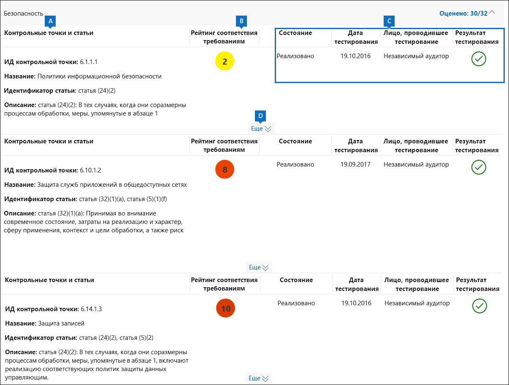
  
  a. Указывает приведенные ниже сведения о стандарте сертификации или нормативе, соответствующем средству контроля под управлением Майкрософт.

  - **Идентификатор средства контроля.** Номер раздела или статьи стандарта сертификации или норматива, которому соответствует средство контроля.
    
  - **Заголовок.** Заголовок из соответствующего стандарта сертификации или норматива.
    
  - **Идентификатор статьи.** Это поле указывается только для оценок соблюдения GDPR, так как в нем указывается номер соответствующей статьи GDPR.
    
  - **Описание.** Текст стандарта сертификации или норматива, соответствующего выбранному средству контроля под управлением Майкрософт.

  b. Рейтинг соответствия требованиям, который указывает степень риска (по причине несоблюдения или сбоя средства контроля), связанную с каждым средством контроля под управлением Майкрософт. Дополнительные сведения см. в разделе [Общие сведения о рейтинге соответствия требованиям](#understanding-the-compliance-score). Обратите внимание, что соответствие требованиям оценивается по шкале от 1 до 10, а рейтинг сопровождается цветовым обозначением. Желтый цвет обозначает низкий уровень риска, оранжевый — средний, а красный — высокий. 
    
  c. Сведения о состоянии реализации этого средства контроля, дате его тестирования, тестировщике и результатах.
    
  d. Для каждого средства контроля можно нажать кнопку **Дополнительно**, чтобы просмотреть дополнительные сведения, в том числе данные о реализации средства контроля корпораций Майкрософт, а также о том, как средство контроля было проверено и подтверждено независимым сторонним аудитором. 
    
- **Средства контроля под управлением клиента.** Это коллекция средств контроля, которыми управляет ваша организация. Ваша организация отвечает за реализацию этих средств контроля в рамках обеспечения соответствия требованиям определенного стандарта или норматива. Средства контроля под управлением клиента также делятся на семейства, соответствующие разным стандартам сертификации и нормативам. С помощью средств контроля под управлением клиента вы можете принимать меры обеспечения соответствия, рекомендуемые корпорацией Майкрософт. Ваша организация может использовать инструкции и рекомендуемые действия клиента для каждого средства контроля под ее управлением, чтобы контролировать реализацию и оценку этого средства контроля.
    
    В средства контроля под управлением клиента в оценках также встроены функции управления рабочими процессами, с помощью которых вы можете контролировать ход выполнения оценки в вашей организации. Например, ответственный за обеспечение соответствия требованиям в вашей организации может назначить поручение ИТ-администратору, который отвечает за выполнение рекомендуемых действий с этим средством контроля и обладает необходимыми для этого разрешениями. После этого ИТ-администратор может отправить свидетельства выполнения своих задач по реализации (например, снимки экрана с конфигурацией или параметрами политики), а затем снова назначить поручение ответственному за обеспечение соответствия требованиям для оценки собранных свидетельств, тестирования средства контроля и занесения даты реализации и результатов тестирования в диспетчер соответствия требованиям. Дополнительные сведения см. в разделе [Управление процессом оценки](#managing-the-assessment-process) в этой статье. 
  
## Разрешения и управление доступом на основе ролей

По умолчанию диспетчер соответствия требованиям доступен каждому пользователю в организации, у которого есть учетная запись Office 365 или Azure AD, и каждый такой пользователь может выполнять в нем любые действия. Чтобы перейти с разрешений по умолчанию на модель управления доступом на основе ролей, необходимо добавить по крайней мере одного пользователя в каждую роль диспетчера соответствия требованиям (см. приведенные ниже инструкции). Когда пользователь добавляется к роли, разрешения на выполнение действий, назначенных этой роли, удаляются из стандартного набора разрешений, доступного всем пользователям. После этого только те пользователи, которым назначена эта роль, смогут открывать диспетчер соответствия требованиям и выполнять действия, разрешенные этой ролью.
  
После реализации доступа на основе ролей всем пользователям, которым не назначена определенная роль в диспетчере соответствия требованиям, будет предоставляться гостевой доступ.
  
> [!NOTE]
> Чтобы полностью реализовать доступ на основе ролей и контролировать доступ и выполнение действий в диспетчере соответствия требованиям, необходимо изменить стандартные разрешения, добавив пользователя к каждой роли. Например, если добавить пользователя к роли, позволяющей управлять оценками, только участники этой роли смогут управлять ими. Аналогично, если не добавить пользователя к роли, позволяющей считывать данные из оценок, то все пользователи в организации смогут открывать диспетчер соответствия требованиям и просматривать данные любой оценки. 
  
В приведенной ниже таблице описывается каждое разрешение в диспетчере соответствия требованиям и указаны действия, которые оно разрешает выполнять пользователям. В этой таблице также указаны роли, которым назначены те или иные разрешения.
  
||**Читатель в диспетчере соответствия требованиям**|**Участник в диспетчере соответствия требованиям**|**Аудитор в диспетчере соответствия требованиям**|**Администратор диспетчера соответствия требованиям**|**Администратор портала**|
|:-----|:-----|:-----|:-----|:-----|:-----|
|**Чтение данных.** Пользователи могут читать данные, но не могут редактировать их.    |             |             |             |             |             |
|**Изменение данных.** Пользователи могут редактировать все поля, кроме полей "Результат теста" и "Дата теста".    ||             |             |             |             |
|**Изменение результатов тестов.** Пользователи могут редактировать поля "Результат теста" и "Дата теста".    |||             |             |             |
|**Управление оценками.** Пользователи могут создавать, архивировать и удалять оценки.    ||||             |             |
|**Управление пользователями.** Пользователи могут добавлять других пользователей в своей организации к ролям "Читатель", "Участник", "Аудитор" и "Администратор". Только пользователи с ролью "Глобальный администратор" в организации могут добавлять и удалять пользователей из роли "Администратор портала".  |||||             |
   
### Гостевой доступ
  
Когда доступ к диспетчеру соответствия требованиям будет настроен, любой пользователь, которому не назначена роль, по умолчанию относится к роли **Гостевой доступ** (то же самое происходит с учетными записями, не принадлежащими организации, например учетными записями Майкрософт). У гостевых пользователей нет полного доступа ко всем функциям диспетчера соответствия требованиям, и они не могут просматривать данные оценки соответствия требованиям в организации, но они могут использовать этот диспетчер для просмотра предоставленных корпорацией Майкрософт отчетов об оценке соответствия и документов Service Trust Portal. На приведенных ниже изображениях показано, какие функции доступны (они выделены синим), а какие нет (они выделены красным). 
  
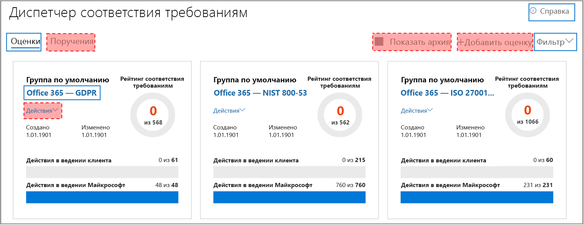
  
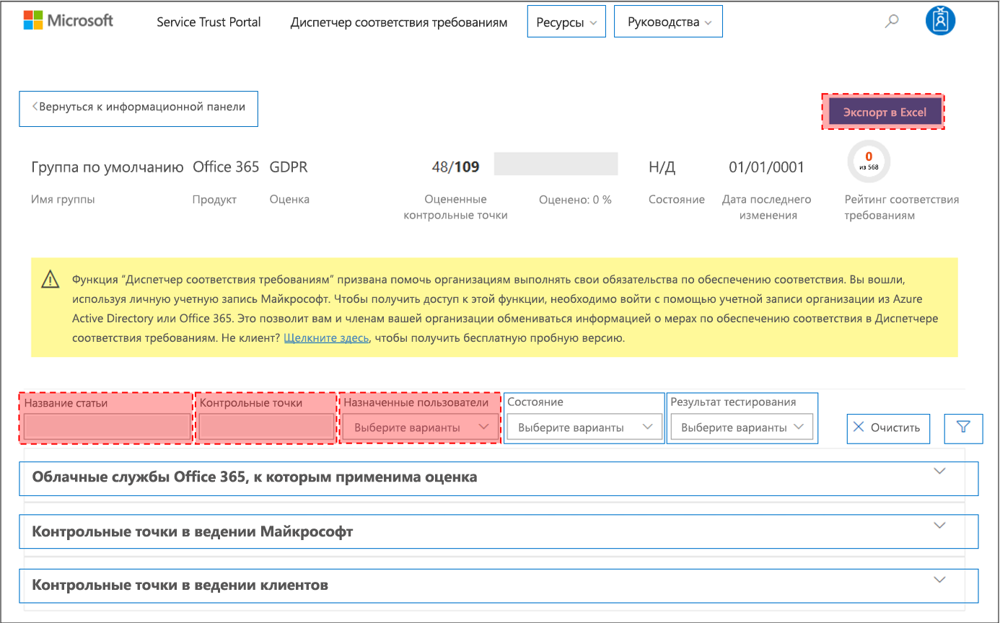

## Общие сведения о рейтинге соответствия требованиям

На информационной панели в диспетчере соответствия требованиям общий рейтинг каждой оценки Office 365 отображается в правом верхнем углу соответствующей плитки. Это общий рейтинг соответствия требованиям для оценки, представляющий собой сумму баллов, начисленных за оценку каждого средства контроля, отмеченного как реализованное или протестированное в оценке. При добавлении оценки вы увидите, что рейтинг соответствия требованиям уже приближается к завершению, так как уже были начислены баллы за реализованные корпорацией Майкрософт средства контроля под ее управлением, протестированные независимыми третьими сторонами.
  

  
Остальные баллы начисляются за успешную оценку клиентских средств контроля, а также реализацию и тестирование средств контроля под управлением клиента, каждому из которых назначается определенное значение, прибавляемое к общему рейтингу соответствия требованиям. 
  
Для каждой оценки отображается основанный на рисках рейтинг соответствия требованиям, который поможет вам оценить степень риска (по причине несоблюдения правила или сбоя средства контроля), связанную с каждым средством контроля (это относится как к средствам контроля под управлением Майкрософт, так и к клиентским средствам) в оценке. Каждому средству контроля под управлением клиента назначается возможное количество баллов (называемое *рангом серьезности*) по шкале от 1 до 10. При этом чем выше фактор риска в случае сбоя средства контроля, тем больше начисляется баллов. 
  
Например, представленное ниже средство контроля оценки "Управление доступом пользователей" имеет очень высокий ранг серьезности риска, поэтому отображается значение 10.
  
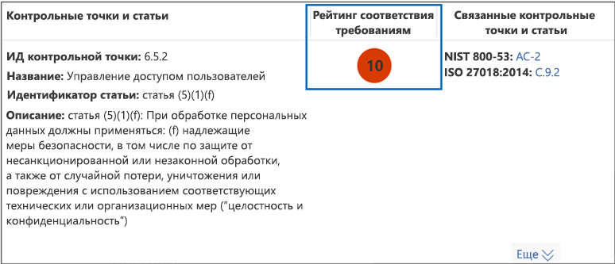
  
 С другой стороны, представленное ниже средство контроля оценки "Резервное копирование" имеет низкий ранг серьезности риска, поэтому отображается значение 3. 
  
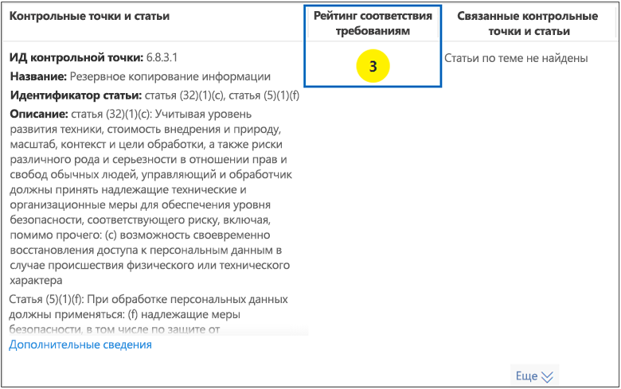
  
Диспетчер соответствия требованиям назначает разные ранги разным средствам контроля. Ранги риска вычисляются с учетом следующих критериев:
  
- Предотвращает ли средство контроля возникновение инцидентов (самый высокий ранг), обнаруживает случившиеся инциденты или устраняет последствия инцидента (самый низкий ранг)? С точки зрения ранга серьезности средство контроля, которое предотвращает угрозу и является обязательным, получает наибольшее количество баллов. Средствам контроля, которые обнаруживают инциденты и исправляют их последствия (независимо от того, являются ли они обязательными), назначается минимальное количество баллов.
    
- Является ли средство контроля (после его реализации) обязательным, что не позволяет пользователям обходить его (например, необходимость сбрасывать пароли, а также соблюдать требования к длине пароля и символам), или необязательным (например, бизнес-правила, требующие блокировать экран, когда пользователь отсутствует на рабочем месте)?
    
- Для средств контроля, связанных с угрозами конфиденциальности, целостности и доступности данных: являются ли угрозы внутренними или внешними, злонамеренными или случайными? Например, за средства контроля, которые могут помешать внешнему злоумышленнику нарушить безопасность сети и получить доступ к личным сведениям, начисляется больше баллов, чем за те средства, которые не дают сотрудникам по ошибке неправильно настроить сетевой маршрутизатор, вызвав отказ сети.
    
- Риски, связанные с юридическими и внешними факторами, например контрактами, нормативами и обязательствами перед общественностью, для каждого средства контроля.
    
Отображаемые значения рейтинга соответствия требованиям для средства контроля *целиком* применяются к общему рейтингу соответствия требованиям по принципу "зачет-незачет" — средство контроля либо внедряется и проходит последующий оценочный тест, либо нет. За неполное внедрение не назначается частичный зачет. Начисленные баллы прибавляются к общему рейтингу соответствия требованиям, только если в поле **Состояние реализации** указано значение **Реализовано** или **Альтернативная реализация**, а в поле **Результат тестирования** — значение **Пройдено**. 
  
Рейтинг соответствия требованиям может помочь вам расставлять приоритеты внедрения средств контроля, указывая те из них, сбой которых влечет за собой наиболее серьезный риск. Помимо расстановки приоритетов на основе риска стоит отметить, что если средства контроля оценки связаны с другими средствами контроля (либо в той же оценке, либо в той же группе оценок), то успешное внедрение одного средства контроля может существенно упростить работу за счет синхронизации результатов его тестирования.
  
Например, на приведенном ниже изображении показано, что оценка "Office 365 — GDPR" в настоящее время выполнена на 46 %. При этом оценено 51 из 111 средств контроля, а общий рейтинг соответствия требованиям составляет 289 баллов из 600 возможных.
  
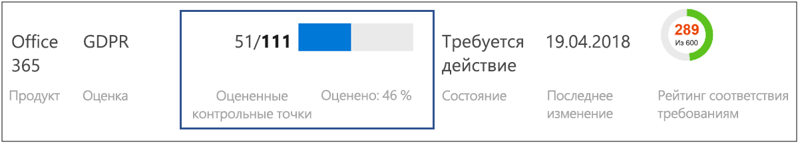
  
В рамках оценки средство контроля GDPR 7.5.5 связано с 5 другими средствами контроля (7.4.1, 7.4.3, 7.4.4, 7.4.8 и 7.4.9), каждому из которых назначен средний или высокий рейтинг серьезности риска — 6 или 8). С помощью фильтра оценок мы выбрали все эти средства контроля, сделав их видимыми в представлении оценок. Как показано ниже, ни одно из них не было оценено. 
  
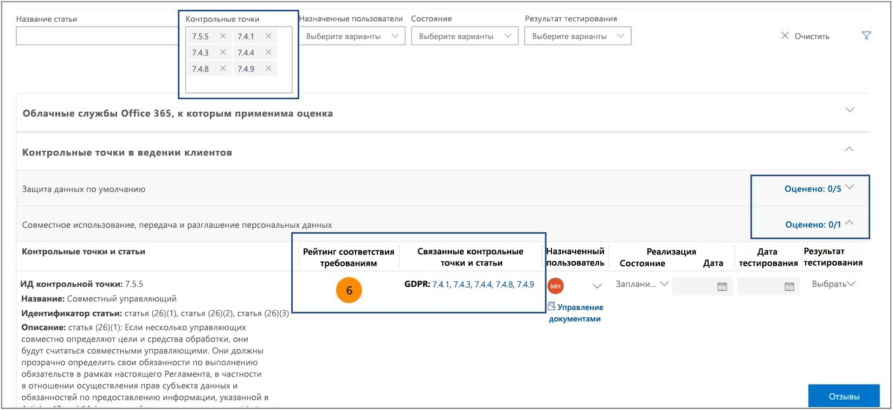 Так как эти 6 средств контроля взаимосвязаны, внедрение любого из них приведет к синхронизации результатов тестирования со связанными средствами контроля в этой оценке (а также со связанными средствами контроля из той же группы оценок). По завершении внедрения и тестирования средства контроля GDPR 7.5.5 область сведений о средстве контроля обновится, и вы увидите, что все 6 средств контроля были оценены, количество оцененных средств контроля повысилось до 57 (или 51 %), а общий рейтинг соответствия требованиям вырос на 40 баллов. 
  
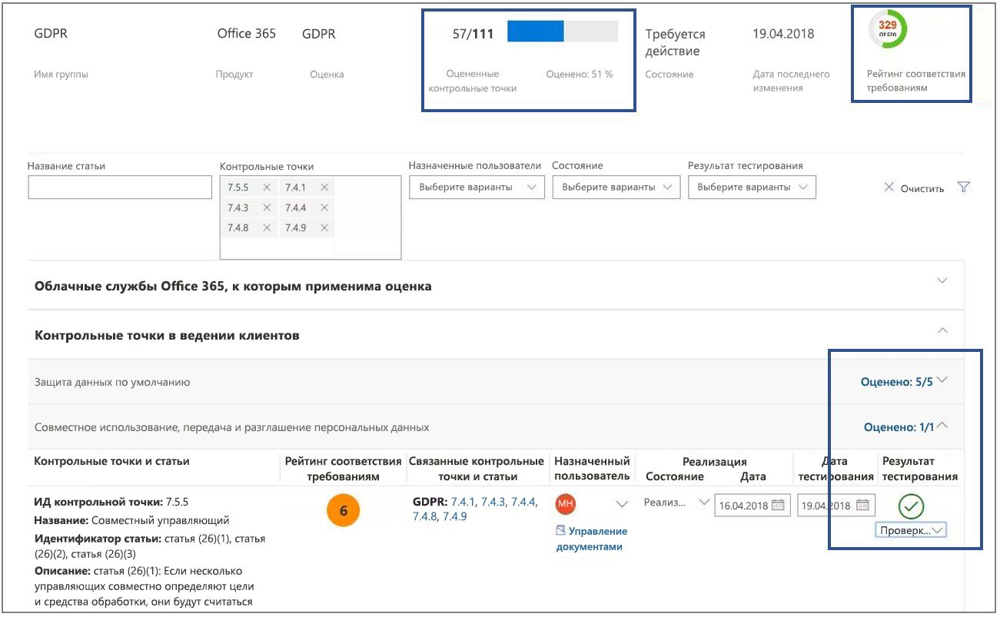
  
Это диалоговое окно подтверждения обновления появится, если вы собираетесь изменить состояние реализации связанного средства контроля так, что это повлияет на остальные связанные средства контроля.
  
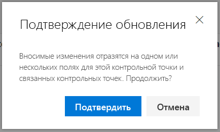
  
> [!NOTE]
> В настоящее время рейтинг соответствия требованиям указывается только для оценок, относящихся к облачным службам Office 365. В оценках для Azure и Dynamics показывается состояние оценки. 

## Принцип вычисления рейтинга

Рейтинг соответствия требованиям, как и Оценка безопасности (Майкрософт), подобен другим системам оценивания с учетом поведения. Организация может повышать свой рейтинг соответствия требованиям, выполняя действия, связанные с защитой данных, обеспечением конфиденциальности и безопасности.
  
> [!NOTE]
> Рейтинг соответствия требованиям не является абсолютным показателем соблюдения определенного стандарта или норматива в организации. Он показывает степень внедрения средств контроля, которые могут снизить угрозу для персональных данных и конфиденциальности. Ни одна служба не может гарантировать соблюдение стандарта или норматива, а рейтинг соответствия требованиям не следует рассматривать как гарантию. 
  
Оценки в диспетчере соответствия требованиям основаны на модели общей ответственности для работы в облаке. В этой модели корпорация Майкрософт и каждый клиент делят между собой обязанности по защите данных клиента при их хранении в облаке.
  
Как показано в приведенной ниже оценке "Office 365 GDPR", корпорация Майкрософт и клиент отвечают за выполнение различных действий, призванных удовлетворять требования оцениваемого стандарта или норматива. Чтобы рационализировать и понимать необходимые действия для различных стандартов и нормативов, диспетчер соответствия требованиям рассматривает все стандарты и нормативы как платформы средств контроля. Следовательно, действия, выполняемые корпорацией Майкрософт и клиентом для каждой оценки, включают реализацию и проверку различных средств контроля.
  
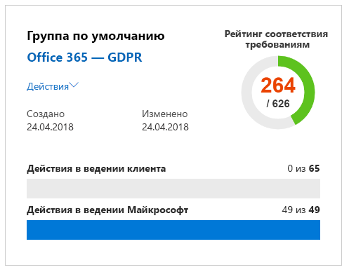
  
Ниже представлен базовый рабочий процесс для типичного действия.
  
1. Лица, ответственные за соответствие требованиям, риск, конфиденциальность и/или защиту данных в организации назначают тому или иному сотруднику организации задачу по реализации средства контроля. Этим сотрудником может быть:

    - владелец бизнес-политики;
    
    - специалист по внедрению ИТ;
    
    - другой сотрудник организации, отвечающий за выполнение задачи.
    
2. Этот сотрудник выполняет задачи, необходимые для реализации средства контроля, отправляет свидетельства реализации в диспетчер соответствия требованиям и помечает средства контроля, связанные с действием, как реализованные. После выполнения задач они назначают действие аудитору для проверки. Аудиторы могут быть:
    
    - внутренними, то есть выполнять проверку средств контроля в рамках организации;
    
    - внешними, то есть изучать, проверять и сертифицировать соответствие требованиям. Например, это могут быть сторонние независимые организации, выполняющие аудит облачных служб (Майкрософт).
    
3. Аудитор проверяет средства контроля, изучает свидетельства, помечает средства контроля как оцененные и записывает результаты оценки (например, "Пройдено").
    
После оценки всех средств контроля, связанных с оценкой, оценка считается выполненной.
  
Каждая оценка в диспетчере соответствия требованиям содержит предварительно загруженные сведения о действиях, выполненных корпорацией Майкрософт для удовлетворения требований средств контроля, за которые она отвечает. Эти данные включают сведения о том, как корпорация Майкрософт реализовала каждое средство контроля, а также как и когда их реализация корпорацией Майкрософт была оценена и подтверждена сторонним аудитором. По этой причине средства контроля под управлением Майкрософт для каждой оценки отмечаются как оцененные, и это сказывается на рейтинге соответствия требованиям для оценки.
  
Каждая оценка включает общий рейтинг соответствия требованиям, основанный на модели общей ответственности. За реализацию и тестирование средств контроля Office 365 корпорацией Майкрософт начисляется часть возможных баллов, связанных с оценкой GDPR. По мере того как клиент реализует и тестирует свои действия, рейтинг соответствия требованиям повышается на значение, назначенное средству контроля. 
  
 ### Принцип оценивания с учетом рисков
  
В диспетчере соответствия требованиям используется принцип оценивания с учетом рисков по шкале от 1 до 10. Чем выше риск в случае сбоя средства контроля или несоблюдения правила, тем выше значение. Система оценивания, используемая для вычисления рейтинга соответствия требованиям, основана на нескольких ключевых факторах, таких как:
  
- характер средства контроля;
    
- уровень риска для средства контроля с учетом типов угроз;
    
- внешние факторы, влияющие на средство контроля.
    
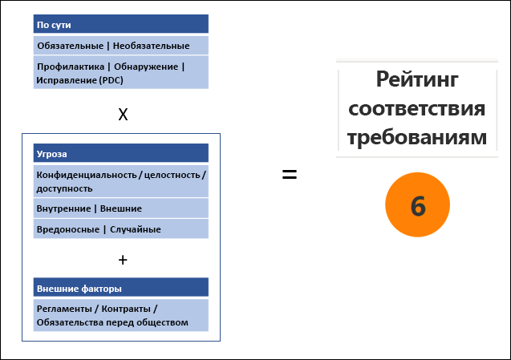
  
 ### Характер средства контроля
  
Характер средства контроля основан на том, является ли оно обязательным, а также на его назначении (предотвращении, обнаружении или исправлении).
  
 ### Обязательное или дискреционное
  
 *Обязательные средства контроля* невозможно обходить ни намеренно, ни случайно. К примерам распространенных обязательных средств контроля относится политика паролей с централизованным управлением, которая задает требования к длине, сложности и сроку действия пароля. Пользователи должны соблюдать эти требования для доступа к системе. 
  
 *Дискреционные средства контроля* применяются с расчетом на то, что пользователи понимают политику и поступают соответствующим образом. Например, политика, которая требует, чтобы пользователи блокировали свои компьютеры, покидая рабочее место, является необязательной, так как ее выполнение зависит от пользователя. 
  
 ### Профилактическое, обнаруживающее или корректирующее
  
 *Профилактические средства контроля* предотвращают определенные риски. Например, защита информации на месте с помощью шифрования — это профилактическая мера против атак, нарушений безопасности и т. д. Разделение обязанностей — это профилактическая мера, призванная контролировать конфликты интересов и предотвращать мошенничество. 
  
 *Обнаруживающие средства* активно отслеживают системы, выявляя необычные условия и действия, представляющие риск. С помощью этих средств контроля также можно обнаруживать вторжения и выявлять нарушения безопасности. К мониторинговым средствам контроля относятся аудит доступа к системе и действий привилегированных администраторов. Аудит соответствия требованиям нормативов — это средство контроля, используемое для обнаружения проблем с процессами. 
  
 *Корректирующие средства контроля* пытаются свести к минимуму отрицательное воздействие нарушения безопасности, принимают корректирующие меры для снижения мгновенного влияния и по мере возможности устраняют ущерб. Реагирование на нарушения конфиденциальности — это корректирующее средство контроля, которое ограничивает ущерб и восстанавливает работоспособность систем после нарушения безопасности. 
  
Оценивая каждое средство контроля по этим критериям, мы определяем его характер и назначаем ему значение, соответствующее представляемому им уровню риска.
  
 **Угроза**
  
||||
|:-----|:-----|:-----|
||**Обязательное**   |**Необязательное**   |
|**Профилактическое**   |Высокая степень риска    |Средняя степень риска    |
|**Обнаруживающее**   |Средняя степень риска    |Низкая степень риска    |
|**Корректирующее**   |Средняя степень риска    |Низкая степень риска    |
   
Угроза — это что-либо, представляющее риск для фундаментального и общепринятого стандарта безопасности (три принципа защиты данных CIA: конфиденциальность, целостность и доступность):
  
- Конфиденциальность означает, что информацию могут считывать и толковать только доверенные, уполномоченные лица.
    
- Целостность означает, что информация не была изменена или удалена неуполномоченными лицами.
    
- Доступность означает, что к информации можно в любой момент получить доступ с высоким качеством обслуживания.
    
Несоответствие какому-либо из этих критериев считается компрометацией системы в целом. Угрозы могут поступать как из внутренних, так и из внешних источников, а также возникать по злому умыслу или непреднамеренно. Предполагаемое влияние этих факторов представлено в таблице угроз, где каждому сочетанию сценариев назначается высокая, средняя или низкая степень риска.

||**Внутренняя** ||**Внешняя** ||||
|:-----|:-----|:-----|:-----|:-----|:-----|:-----|
||*Злоумышленная* |*Непреднамеренная* |*Злоумышленная* |*Непреднамеренная* |||
|**Конфиденциальность** |(В, С или Н)    |(В, С или Н)    |(В, С или Н)    |(В, С или Н)|
|**Целостность** |(В, С или Н)    |(В, С или Н)    |(В, С или Н)    |(В, С или Н)|
|**Доступность** |(В, С или Н)    |(В, С или Н)    |(В, С или Н)    |(В, С или Н)|
   
 **Внешние драйверы**
  
|**Контракты**|**Нормативы**|**Обязательства перед общественностью**|
|:-----|:-----|:-----|
|(В, С или Н)    |(В, С или Н)    |(В, С или Н)    |
   
Внешние факторы, такие как применимые нормативы, контракты и обязательства перед общественностью, могут влиять на средства контроля, призванные защищать данные и предотвращать нарушения безопасности данных, а каждому из этих факторов назначается высокая, средняя или низкая степень риска.
  
Предполагаемое количество возникающих рисков высокой, средней или низкой степени риска в 15 возможных сценариях (критерии ЦРУ/угрозы и юридические/внешние факторы), совмещается в целях оценки риска, где вероятность и количество рисков определенной степени считаются значительными и учитываются при вычислении ранга серьезности средства контроля.
  
С учетом ранга серьезности средства контроля ему назначается рейтинг соответствия требованиям — число от 1 (низкий) до 10 (высокий). Выделяются следующие категории риска:
  
|**Уровень риска**|**Значение рейтинга**|
|:-----|:-----|
|Низкий    |1–3    |
|Средний    |6    |
|Высокий    |8    |
|Критический    |10    |
   
Отдавая приоритет средствам контроля с самым высоким рейтингом, организация сможет сосредоточиться на наиболее рискованных элементах и получать больше баллов в общем рейтинге соответствия требованиям по завершении оценки каждого средства контроля.
  
### Заключение
  
Рейтинг соответствия требованиям — основной компонент диспетчера соответствия требованиям, помогающий организациям анализировать и контролировать соответствие требованиям. Рейтинг соответствия требованиям для оценки — это числовой показатель соблюдения компанией определенного стандарта или норматива. Чем выше это значение (вплоть до максимально возможного числа баллов), тем больше компания соответствует требованиям. Понимание принципа оценивания соответствия, согласно которому средствам контроля назначается уровень риска от 1 до 10 (в порядке возрастания), и того, как выполненные оценки средств контроля влияют на общий рейтинг соответствия требованиям, критически важно для расстановки приоритетов деятельности в организации.

## Группировка оценок

При создании оценки вам предлагается создать группу, которой будет назначена оценка, либо назначить оценку существующей группе. С помощью групп вы можете логичным образом упорядочивать оценки и совмещать общие сведения и задачи рабочих процессов между оценками, содержащими одинаковые или связанные средства контроля под управлением клиента.
  
Например, вы можете группировать оценки по годам, командам, отделам и агентствам в организации. Ниже представлены примеры групп и оценок, которые они могут содержать.
  
- Оценки GDPR: 2018 г.
    
  - Office 365 + GDPR
    
  - Azure + GDPR
    
  - Dynamics + GDPR
    
- Оценки Azure — 2018 г.
    
  - Azure + GDPR
    
  - Azure + ISO 27001:2013
    
  - Azure + ISO 27018:2014
    
- Оценки безопасности и конфиденциальности данных
    
  - Office 365 + ISO 27001:2013
    
  - Office 365 + ISO 27018:2014
    
  - Azure + ISO 27001:2013
    
  - Azure + ISO 27018:2014
    
> [!TIP]
> Рекомендуем определить стратегию группировки для своей организации, прежде чем добавлять новые оценки. 
  
На группировку оценок распространяются следующие требования:
  
- Имена групп (также называемые *идентификаторами групп*) должны быть уникальными в рамках организации. 
    
- Группы могут содержать оценки для одного и того же стандарта сертификации или норматива, но каждая группа может содержать по одной оценке на каждую пару облачной службы и сертификата. Например, группа не может содержать две оценки для Office 365 и GDPR. Аналогичным образом, группа может содержать несколько оценок для одной облачной службы, если им соответствуют разные стандарты сертификации или нормативы.
    
Группу невозможно изменить после добавления оценки в нее. Вы можете переименовать группу оценок. При этом изменится имя группы для всех связанных с ней оценок. Вы можете создать новые оценку и группу оценок, а затем скопировать данные из имеющейся оценки. При этом фактически будет создана копия этой оценки в другой группе. Архивация оценки нарушает отношение между этой оценкой и группой. Все последующие обновления других связанных оценок больше не будут влиять на архивированную оценку.
  
Как упоминалось ранее, одно из основных преимуществ использования групп заключается в том, что если две разные оценки в одной группе содержат одно и то же средство контроля под управлением клиента (следовательно, действия клиента для разных средств контроля будут одинаковыми), то сведения о реализации, тестировании и состоянии средства контроля из одной оценки будут синхронизироваться с таким же средствам контроля во всех других оценках из этой группе. Другими словами, если несколько оценок в одной группе содержат одно и то же средство контроля, то вам достаточно управлять процессом оценки только для одного средства контроля. Результаты для этого средства контроля будут автоматически синхронизироваться с другими оценками. Например, для стандартов ISO 27001 и ISO 27018 доступно средство контроля, связанное с политиками паролей. Если для средства контроля задано состояние тестирования "Пройдено" в одной оценке, то это средство контроля будет обновлено (и отмечено как прошедшее оценку) в другой, если обе этих оценки входят в одну группу.
  
В качестве примера рассмотрим два взаимосвязанных средства контроля оценки, каждое из которых связано с шифрованием данных в общедоступны сетях: средство контроля 6.10.1.2 в оценке "Office 365 — GDPR" и средство контроля SC-13 в оценке "Office 365 — NIST 800-53". Эти средства контроля взаимосвязаны и находятся в разных оценках из группы "Группа по умолчанию". Изначально ни в одной из этих оценок не оценены никакие клиентские средства контроля, как видно на информационной панели, где представлены эти две оценки.
  
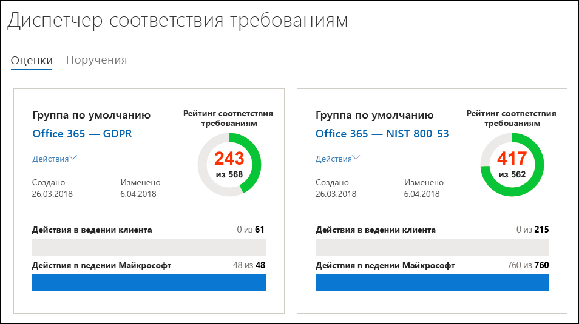
  
Выбрав оценку **Office 365 — GDPR** и применив фильтр для просмотра средства контроля GDPR 6.10.1.2, мы увидим, что средство контроля SC-13 для стандарта NIST 800-53 указано в качестве связанного.
  
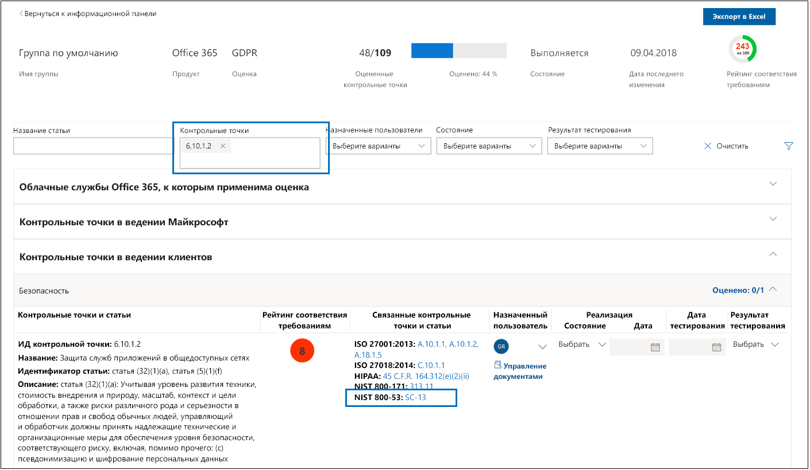
  
 Здесь показано завершение реализации и тестирования средства контроля GDPR 6.10.1.2. 
  
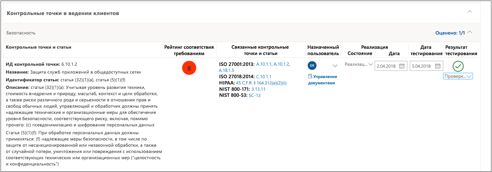
  
Перейдем к связанному средству контроля в оценке из этой группы и увидим, что средство контроля NIST 800-53 SC-13 также отмечено как завершенное, а указаны те же дата и время. При этом не потребовалось дополнительных усилий для реализации или тестирования.
  
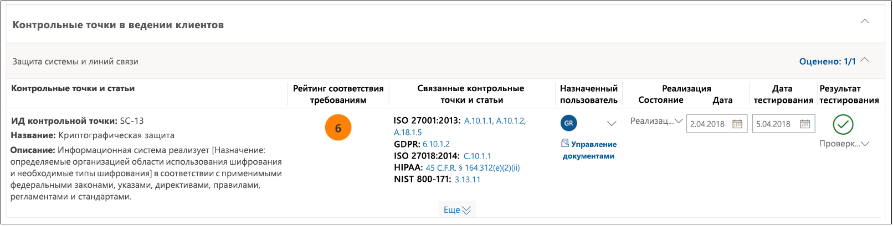
  
Снова открыв информационную панель, мы увидим, что для каждой оценки завершена проверка 1 средства контроля, а общий рейтинг соответствия требованиям для каждой оценки увеличился на 8 (рейтинг соответствия требованиям для этого общего средства контроля).
  
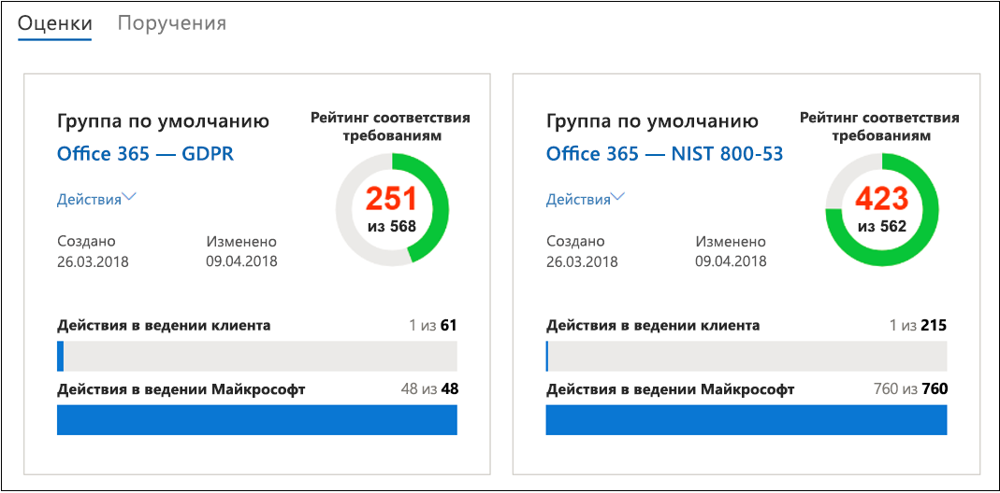

## Административные функции

Некоторые административные функции доступны только учетной записи администратора клиента и будут видны, только если войти от имени глобального администратора.
  
> [!NOTE]
> Разрешение "Доступ к ограниченным документам" в раскрывающемся списке позволяет администраторам предоставлять пользователям доступ к ограниченным документам, к которым корпорация Майкрософт предоставляет доступ на портале Service Trust Portal. Функция "Ограниченные документы" недоступна, но появится в скором времени. 
  
### Назначение пользователям ролей в диспетчере соответствия требованиям

Разрешения разных ролей в диспетчере соответствия требованиям немного различаются. Вы можете просматривать разрешения, назначенные каждой роли, узнавать, какие пользователи относятся к каким ролям, а также добавлять или удалять пользователей из этой роли с помощью портала Service Trust Portal, открыв меню **Администратор** и выбрав пункт **Параметры**. 
  

  
Чтобы добавить или удалить пользователей из роли в диспетчере соответствия требованиям, выполните указанные ниже действия.
  
1. Перейдите по ссылке [https://servicetrust.microsoft.com](https://servicetrust.microsoft.com).
    
2. Войдите с помощью учетной записи глобального администратора Azure Active Directory.
    
3. В верхней строке меню Service Trust Portal выберите пункт **Администратор**, а затем — **Параметры**. 
    
4. В раскрывающемся списке **Выберите роль** щелкните нужную роль. 
    
5. Пользователи, добавленные к каждой роли, указаны на странице **Выбор роли**. 
    
6. Чтобы добавить пользователей к этой роли, нажмите кнопку **Добавить**. В диалоговом окне **Добавление пользователей** щелкните поле пользователя. Вы можете прокрутить список доступных пользователей или начать вводить имя, чтобы отфильтровать список по вашему запросу. Выберите пользователя, чтобы добавить его в список **Добавление пользователей** для назначения этой роли. Чтобы добавить нескольких пользователей одновременно, отфильтруйте список, начав вводить имя, а затем выберите пользователя, чтобы добавить его в список. Нажмите кнопку **Сохранить**, чтобы назначить выбранную роль этим пользователям. 
    
    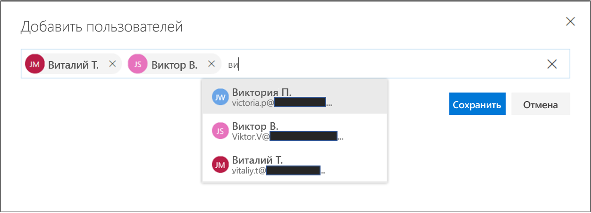
  
7. Чтобы удалить пользователей из этой роли, выберите их и нажмите кнопку **Удалить**. 
    
    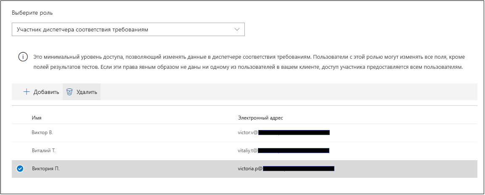
 
## Параметры конфиденциальности пользователей

Некоторые нормативы требуют, чтобы организация могла удалять данные журнала пользователей. Для этого в диспетчере соответствия требованиям предоставляется раздел **Параметры конфиденциальности пользователей**, где администраторы могут: 
  
- [искать пользователей;](#search-for-a-user)

- [экспортировать отчет о журнале данных учетных записей;](#export-a-report-of-account-data-history)

- [переназначать поручения;](#reassign-action-items)

- [удалять журналы данных пользователей.](#delete-user-data-history)
    
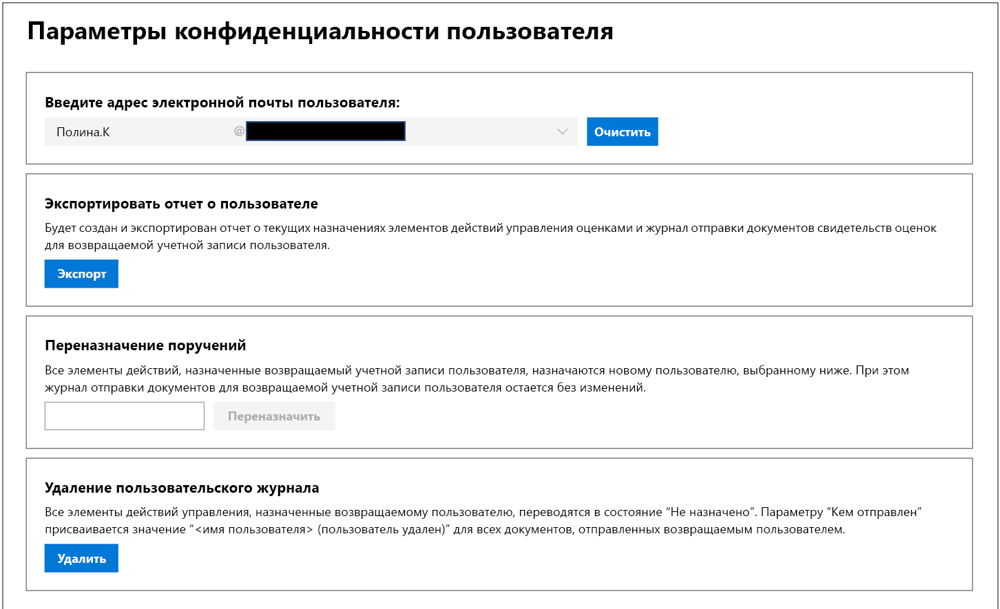
  
### Поиск пользователя

Чтобы найти учетную запись, выполните указанные ниже действия.
  
1. Введите электронный адрес пользователя, указав псевдоним (строку слева от символа @) и выбрав доменное имя из списка суффиксов справа. Если в этом клиенте зарегистрировано несколько доменов, вы можете проверить правильность суффикса доменного имени в электронном адресе.
    
2. Правильно указав имя пользователя, нажмите кнопку **Поиск**. 
    
3. Если учетная запись пользователя не найдена, на странице появится сообщение "Пользователь не найден". Проверьте электронный адрес пользователя, внесите необходимые изменения и нажмите кнопку **Поиск**, чтобы повторить попытку. 
    
4. Если учетная запись пользователя найдена, подпись кнопки **Поиск** изменится на **Очистить**. Это означает, что найденная учетная запись пользователя является рабочим контекстом для дополнительных функций, которые показаны ниже, а работа этих функций будет распространяться на данную учетную запись. 
    
5. Чтобы очистить результаты поиска и найти другого пользователя, нажмите кнопку **Очистить**. 
    
### Экспорт отчета о журнале данных учетной записи

Определив учетную запись пользователя, вы можете создать отчет об имеющихся зависимостях, связанных с этой ней. Эти сведения помогут вам переназначить открытые поручения или обеспечить доступ к отправленным ранее свидетельствам. 
  
 Чтобы создать и экспортировать отчет, выполните указанные ниже действия.
  
1. Нажмите кнопку **Экспорт**, чтобы создать и скачать отчет о поручениях, назначенных выбранной учетной записи пользователя в диспетчере соответствия требованиям, а также список документов, отправленных этим пользователем. Если пользователю не назначены действия и он не отправлял документы, появится сообщение об ошибке "Нет данных для этого пользователя". 
    
2. Отчет скачивается в фоновом режиме активного окна браузера. Если всплывающее окно загрузки не отображается, следует проверить журнал загрузок браузера.
    
3. Откройте документ, чтобы просмотреть данные отчета.
    
> [!NOTE]
> Это не хронологический отчет с данными об изменении состояния в журнале назначения поручений. Создаваемый отчет представляет собой моментальный снимок поручений, назначенных в момент его создания (метка даты и времени заносится в отчет). Например, любое последующее переназначение поручений приведет к созданию другого моментального снимка данных, если другой пользователь снова создаст этот отчет. 
  
### Переназначение поручений

Эта функция позволяет организации удалять активные или просроченные зависимости учетной записи, переназначая все поручения (это относится как к активным, так и к выполненным поручениям) из найденной учетной записи пользователя новому пользователю, выбранному ниже. Это действие не меняет журнал отправки документов для найденной учетной записи. 
  
 Чтобы переназначить поручения другому пользователю, выполните указанные ниже действия.
  
1. Щелкните поле ввода, чтобы найти и выбрать другого пользователя в организации, которому следует назначить поручения найденного пользователя.
    
2. Нажмите **Заменить**, чтобы переназначить все поручения найденного пользователя новому выбранному пользователю. 
    
3. Появится диалоговое окно подтверждения с сообщением "Все поручения текущего пользователя будут назначены выбранному пользователю. Это действие невозможно отменить. Продолжить?"
    
4. Если вы хотите продолжить, нажмите кнопку **ОК**. В противном случае нажмите кнопку **Отмена**. 
    
> [!NOTE]
> Все поручения (как активные, так и выполненные) будут назначены новому пользователю. Однако это действие не влияет на журнал отправки документов. Во всех документах, отправленных ранее назначенным пользователем, по-прежнему будут отображаться дата и время, а также имя назначенного ранее пользователя. 
  
Чтобы удалить назначенного ранее пользователя, необходимо вручную отредактировать журнал отправки документов. В этом случае администратору потребуется:
  
1. Открыть загруженный ранее отчет об экспорте.
  
2. Определить нужное поручение и перейти к нему.
  
3. Выбрать **Управление документами**, чтобы перейти к репозиторию свидетельств для этого средства контроля. 
  
4. Скачать документ.
  
5. Удалить документ их репозитория свидетельств.
  
6. Повторно отправить документ. Теперь для документа будут указаны новые дата и время отправки, а также имя отправителя. 
  
### Удаление журнала данных пользователя

При этом все поручения, назначенные найденному пользователю, становятся неназначенными. Кроме того, для всех документов, отправленных этим пользователям, значение имени отправителя меняется на "Пользователь удален".
  
 Чтобы удалить журнал поручений и отправки документов для учетной записи, выполните указанные ниже действия.
  
1. Нажмите кнопку **Удалить**. 

    Появится диалоговое окно подтверждения с сообщением "Будут удалены все назначенные поручения и журнал отправки документов для выбранного пользователя. Это действие невозможно отменить. Продолжить?"
    
3. Если вы хотите продолжить, нажмите кнопку **ОК**. В противном случае нажмите кнопку **Отмена**. 
  
## Использование диспетчера соответствия требованиям

Диспетчер соответствия требованиям предоставляет инструменты, с помощью которых можно назначать, отслеживать и записывать действия, связанные с оценкой и обеспечением соответствия требованиям, помогая координировать работу команд в организации для достижения ее целей.
  
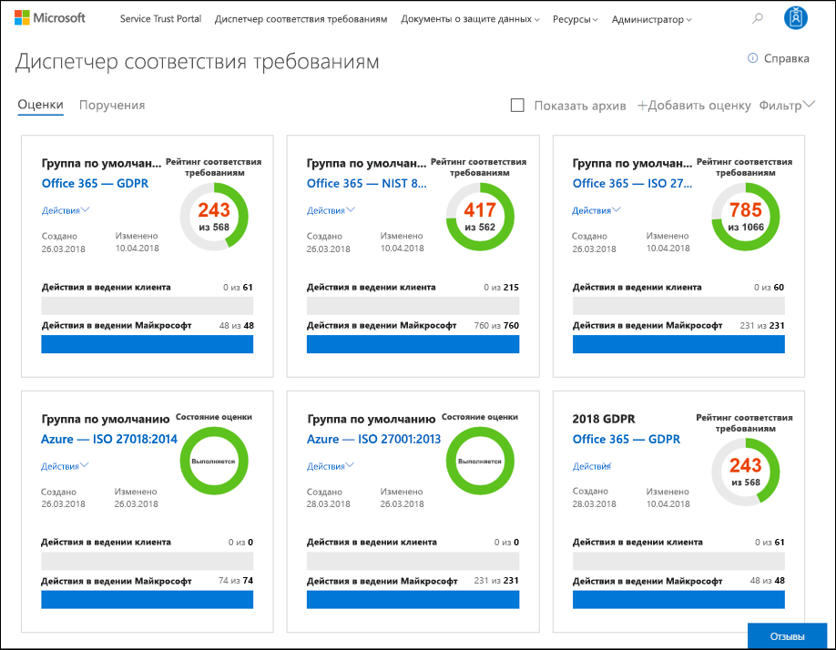

## Доступ к диспетчеру соответствия требованиям

Перейти к диспетчеру соответствия требованиям можно с портала Service Trust Portal. Диспетчер соответствия требованиям доступен любому пользователю с учетной записью Майкрософт или организационной учетной записью Azure Active Directory.
  

  
1. Перейдите по ссылке [https://servicetrust.microsoft.com](https://servicetrust.microsoft.com/).
    
2. Войдите с помощью учетной записи пользователя Azure Active Directory (Azure AD).
    
3. На портале Service Trust Portal выберите **Диспетчер соответствия требованиям**. 
    
4. Когда появится соглашение о неразглашении, прочтите его и нажмите кнопку **Принимаю** для продолжения. Это достаточно сделать один раз, после чего появится информационная панель диспетчера соответствия требованиям. 

    Чтобы помочь вам приступить к работе, мы добавили по умолчанию следующие оценки:
    
    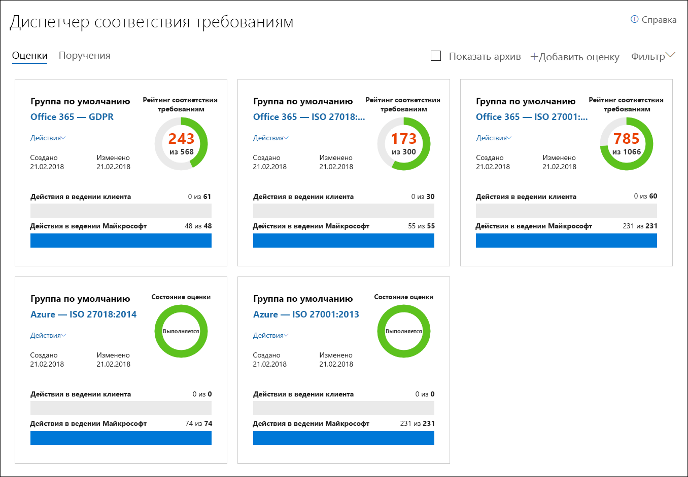
    
5. Нажмите значок  **Справка**, чтобы просмотреть краткий обзор диспетчера соответствия требованиям. 
  
## Просмотр поручений

Диспетчер соответствия требованиям содержит удобное представление всех назначенных вам поручений по оценке средств контроля, с помощью которого вы можете легко и быстро выполнять их. Вы можете просмотреть все поручения или выбрать те из них, которые соответствуют определенному стандарту сертификации, выбрав вкладку, связанную с этой оценкой. Например, на приведенном ниже изображении выбрана вкладка GDPR со средствами контроля, относящимися к оценке GDPR.
  
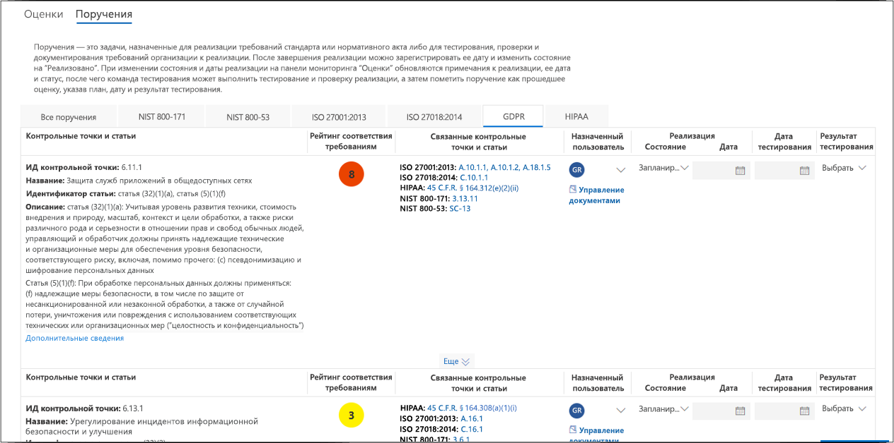
  
Чтобы просмотреть свои поручения, выполните указанные ниже действия.
  
1. Откройте информационную панель диспетчера соответствия требованиям
    
2. Перейдите по ссылке **Поручения**, и страница обновится, после чего вы увидите назначенные вам поручения. 
    
    По умолчанию отображаются все поручения. Если у вас есть поручения для нескольких стандартов сертификации, то назначения этих стандартов будут показаны на вкладках в верхней части области оценки. Чтобы просмотреть поручения, относящиеся к определенному стандарту сертификации, выберите соответствующую вкладку.

## Добавление оценки

Чтобы добавить оценку в диспетчер соответствия требованиям, выполните указанные ниже действия.
  
1. На информационной панели в диспетчере соответствия требованиям нажмите  **Добавить оценку**. 
    
2. В окне **Добавление оценки** вы можете создать группу, к которой будет добавлена оценка, или добавить оценку к имеющейся группе (встроенная группа называется "Исходная группа"). В зависимости от выбранного варианта введите имя новой группы или выберите существующую из раскрывающегося списка. Дополнительные сведения см. в разделе [Группировка оценок](#grouping-assessments).
    
    При создании группы также можно скопировать сведения из имеющейся группы в новую оценку. Это означает, что все данные, добавленные в поля "Сведения о реализации", "План тестирования" и "Отклик функции управления" средств контроля под управлением клиента в оценках из исходной группы, копируются в такие же (или связанные) средства контроля под управлением клиента в новой оценке. При добавлении новой оценки в существующую группу общие сведения из оценок в этой группе копируются в новую оценку. Дополнительные сведения см. в разделе [Копирование сведений из имеющихся оценок](#copying-information-from-existing-assessments).
    
3. Нажмите кнопку **Далее** и выполните указанные ниже действия.
    
    а. Выберите облачную службу (Майкрософт), для которой требуется оценить соответствие требованиям, из раскрывающегося списка **Выберите продукт**. 
    
    б. Выберите стандарт сертификации, с которым требуется сравнить выбранную облачную службу, из раскрывающегося списка **Выберите сертификат**. 
    
4. Нажмите **Добавить на панель мониторинга**, чтобы создать оценку. Она будет добавлена на информационную панель диспетчера соответствия требованиям в качестве новой плитки в конце списка имеющихся плиток. 
    
    **Плитка оценки** на информационной панели в диспетчере соответствия требованиям содержит названия группы и оценки (последнее автоматически создается путем объединения имени службы с выбранным стандартом сертификации), даты ее создания и последнего изменения, общий рейтинг соответствия требованиям (представляющий собой сумму значений риска для всех реализованных, протестированных и прошедших оценку средств контроля), а также индикаторы хода выполнения вдоль нижнего края, показывающие количество средств контроля, прошедших оценку. 
    
5. Нажмите имя оценки, чтобы открыть ее и просмотреть сведения о ней.
    
6. Откройте меню **Действия**, чтобы просмотреть назначенные вам поручения, переименовать группу оценок, экспортировать отчет об оценивании или архивировать оценку. 
    
    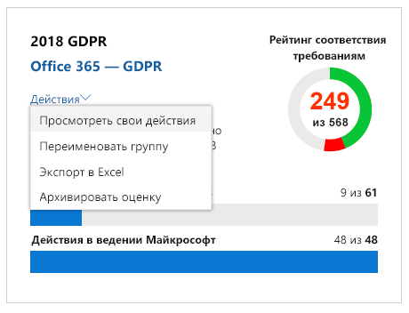

## Копирование сведений из имеющихся оценок

Как упоминалось ранее, при создании новой группы оценок вы можете скопировать сведения из оценок, находящихся в существующей группе, в новую оценку из новой группы. Благодаря этому вы можете применить имеющиеся результаты оценки и тестирования к идентичным средствам контроля под управлением клиента в новой оценке. Например, если у вас есть группа для всех оценок в организации, относящихся к GDPR, вы можете скопировать общие сведения по результатам прошлых оценок при добавлении новой оценки к группе.
  
Вы можете скопировать в новую оценку следующие сведения от клиента:
  
- Пользователи оценки. Пользователь оценки — это пользователь, которому назначено средство контроля.
    
- Состояние, дата и результаты тестирования.
    
- Сведения о реализации и плане тестирования.
    
Аналогичным образом, синхронизируются сведения из общих средств контроля под управлением клиента в одной группе оценок. Сведения из взаимосвязанных средств контроля под управлением клиента в рамках одной оценки также синхронизируются.

## Просмотр оценок

1. Найдите плитку нужной оценки, а затем щелкните ее имя, чтобы открыть оценку и просмотреть связанные с ней средства контроля под управлением Майкрософт и клиента, а также список облачных служб, на которые распространяется оценка. Ниже приведен пример оценки для Office 365 и GDPR.
    
    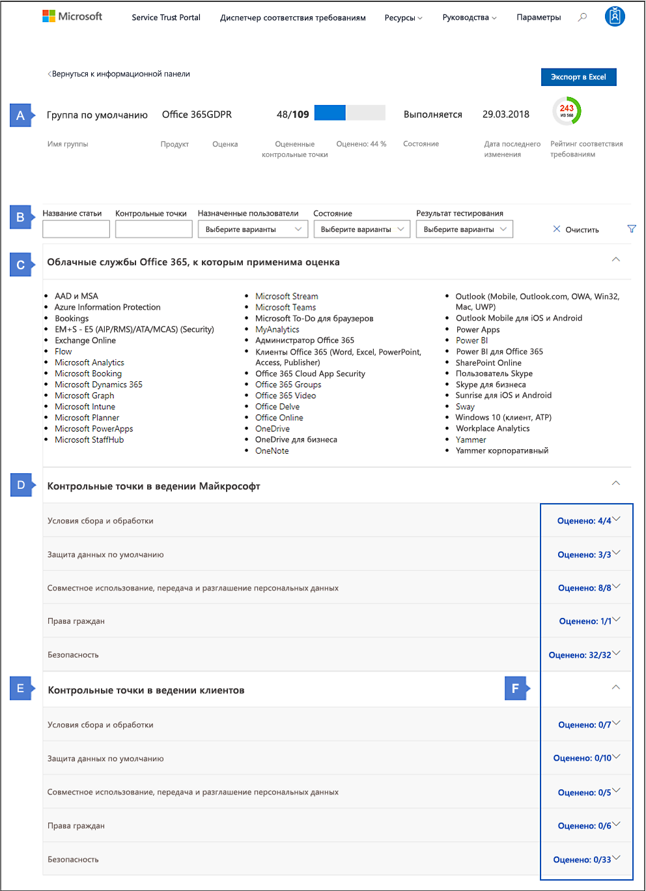
  
1. В этом разделе показаны сводные данные об оценке, в том числе имя группы и оценки, а также количество средств контроля.
    
2. В этом разделе показаны элементы фильтрации оценок. Подробные инструкции по использованию элементов фильтрации оценок см. в разделе [Управление процессом оценки](#managing-the-assessment-process). 
    
3. В этом разделе показаны отдельные облачные службы, на которые распространяется оценка.
    
4. В этом разделе показаны средства контроля под управлением Майкрософт. Взаимосвязанные средства контроля упорядочены по семействам. Выберите семейство средств контроля, чтобы развернуть его и просмотреть отдельные средства контроля.
    
5. В этом разделе показаны средства контроля под управлением клиента, упорядоченные по семействам. Выберите семейство средств контроля, чтобы развернуть его и просмотреть отдельные средства.
    
6. Показывает общее количество средств контроля в семействе и число оцененных средств. Основная возможность диспетчера соответствия требованиям — отслеживание хода оценки контролируемых клиентом средств контроля в организации. Дополнительные сведения см. в разделе [Общие сведения о рейтинге соответствия требованиям](#understanding-the-compliance-score). 

## Управление процессом оценки

Изначально единственным пользователем оценки является ее создатель. Для каждого средства контроля под управлением клиента вы можете назначить поручение сотруднику организации, чтобы он стал пользователем оценки и мог выполнять рекомендуемые действия клиента, а также собирать и отправлять свидетельства. Назначая поручение, вы можете отправить этому пользователю электронное письмо, содержащее такие сведения, как рекомендуемые действия клиента и приоритет поручения. Уведомление электронной почты содержит ссылку на информационную панель **Поручения**, на которой перечислены все поручения, назначенные пользователю. 
  
Ниже представлен список задач, которые можно выполнять с помощью функций рабочих процессов в диспетчере соответствия требованиям.
  
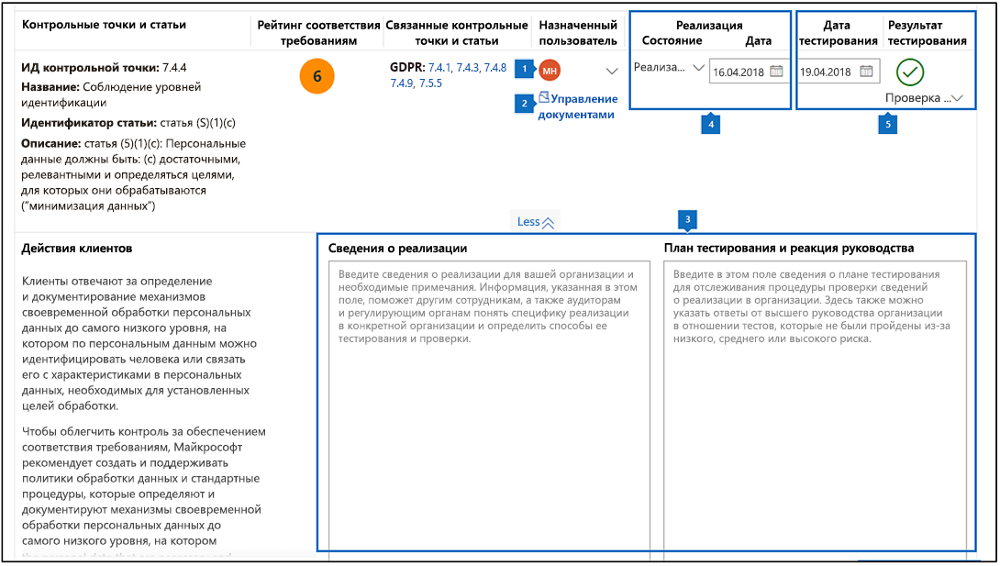
  
1. **Использование параметров фильтра для поиска определенных средств контроля оценки.** Диспетчер соответствия требованиям предоставляет **параметры фильтра**, позволяющие указывать детальные условия для выбора отображаемых средств контроля, помогая точно выделять определенные области вашей деятельности по обеспечению соответствия требованиям. 
    
    Нажмите значок воронки в правой части страницы, чтобы показать или скрыть элементы управления **параметрами фильтра**. С помощью этих элементов вы можете указывать условия фильтра, а ниже отображаются только те средства контроля, которые соответствуют этим условиям. 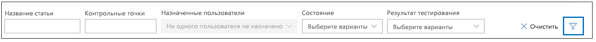
  
    - **Статьи.** Применяет фильтр по названию статьи и возвращает связанные с ней средства контроля. Например, если ввести фильтр "Статья (5)", возвращается список статей, названия которых включают эту строку, т. е. статьи (5)(1)(а), (5)(1)(б), (5)(1)(в) и т. д. Если выбрать статью (5)(1)(в), будут возвращены средства контроля, связанные со статьей (5)(1)(в). Это поле множественного выбора, в котором можно использовать оператор ИЛИ с несколькими значениями. Например, если выбрать статью (5)(1)(а), а затем добавить статью (5)(1)(в), то фильтр вернет средства контроля, связанные со статьей (5)(1)(а) или статьей (5)(1)(в). 
    
      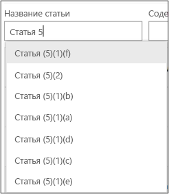
  
    - **Средства контроля.** Возвращает список средств контроля, названия которых соответствуют фильтру. Например, если ввести 7.3, возвращается список выбора с такими элементами, как 7.3.1, 7.3.4, 7.3.5 и т. д. Это поле множественного выбора, в котором используется оператор ИЛИ с несколькими значениями. Например, если выбрать значение 7.3.1, а затем добавить значение 7.3.4, то фильтр вернет средства контроля, связанные со средством контроля 7.3.1 или 7.3.4. 
    
      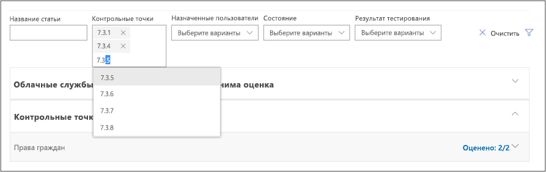
  
    - **Назначенные пользователи.** Возвращает список средств контроля, назначенных выбранному пользователю. 
    
    - **Состояние.** Возвращает список средств контроля с выбранным состоянием. 
    
    - **Результат тестирования.** Возвращает список средств контроля с выбранным результатом тестирования. 
    
    По мере применения условий фильтра представление применимых средств контроля меняется в соответствии с этими условиями. Разворачивайте разделы семейств средств контроля, чтобы снизу появились сведения об этих средствах. 
    
    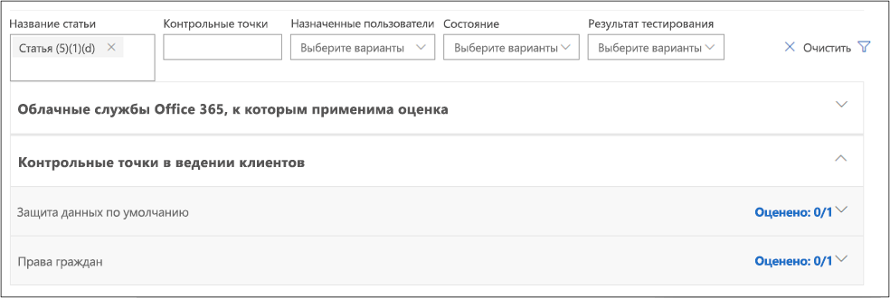
  
2. Если после выбора нужных фильтров результаты не отображаются, это означает, что у вас нет средств контроля, соответствующих указанным условиям фильтра. Например, если выбрать определенного **назначенного пользователя**, а затем выбрать название **средства контроля**, назначенного пользователю, то на странице ниже не будет показано ни одной оценки. 
    
3. **Назначение поручения пользователю.** Вы можете назначить поручение пользователю, чтобы внедрить требования стандарта сертификации или норматива либо тестировать, проверять и документировать требования к их внедрению в организации. Назначая поручение, вы можете отправить пользователю электронное сообщение с такими сведениями, как рекомендуемые действия клиента и приоритет поручения. Вы также можете отменить назначение поручения или переназначить его другому пользователю. 
    
4. **Управление документами.** Для средств контроля под управлением клиента доступны инструменты для управления документами, относящимися к выполнению задач по реализации, тестированию и проверке. Все пользователи, у которых есть разрешения на редактирование данных в диспетчере соответствия требованиям, могут отправлять документы с помощью элемента **Управление документами**. После отправки документа вы можете нажать **Управление документами** для просмотра и скачивания файлов. 
    
5. **Предоставление сведений о реализации и тестировании.** Каждое средство контроля под управлением клиента также содержит редактируемое поле, где пользователи могут добавлять сведения о реализации, которые описывают принятые в организации меры по обеспечению соответствия требованиям стандарта сертификации или норматива, а также проверке и документированию соответствия требованиям в организации.
    
6. **Установка состояния.** Вы можете задать состояние каждого элемента в ходе оценки. Доступные значения состояния: **Реализовано**, **Альтернативная реализация**, **Запланировано** и **За пределами области**. 
    
7. **Указание даты и результата тестирования.** Пользователь с ролью "Аудитор в диспетчере соответствия требованиям" может подтверждать проведение надлежащих тестов, просматривать сведения о реализации, план и результаты тестирования, а также отправленные свидетельства, а затем задать дату и результат тестирования. Доступные значения результатов тестирования: **Пройдено**, **Не пройдено — низкий уровень риска**, **Не пройдено — средний уровень риск****а** и **Не пройдено — высокий уровень риска**. 

## Управление поручениями

Сотрудники организации, принимающие участие в оценке, могут использовать диспетчер соответствия требованиям, чтобы просматривать средства контроля под управлением клиента из всех оценок, пользователями которых они являются. Когда пользователь входит в диспетчер соответствия требованиям и открывает информационную панель **Поручения**, отображается список назначенных ему поручений. В зависимости от роли, назначенной пользователю в диспетчере соответствия требованиям, они могут предоставлять сведения о реализации или тестирования, обновлять состояние или назначать поручения. 
  
Так как средства контроля сертификации обычно реализует один пользователь, а тестирует другой, можно сначала назначить одному пользователю поручение на реализацию, а когда она будет завершена, этот пользователь может переназначить поручение другому сотруднику для тестирования и отправки свидетельств. Назначать и переназначать действия со средствами контроля могут все пользователи, которым в диспетчере соответствия требованиям назначены роли с достаточными разрешениями для централизованного управления назначениями средств контроля или децентрализованного переназначения поручений — от специалиста по внедрению до тестировщика.
  
Чтобы назначить поручение, выполните указанные ниже действия.
  
1. На информационной панели в диспетчере соответствия требованиям найдите плитку нужной оценки и щелкните ее название, чтобы перейти на страницу сведений об оценке.
    
2. Вы можете выбрать **Фильтр** и использовать элементы управления фильтром, чтобы найти нужное средство контроля. 
    
3. Вы также можете прокрутить вниз до раздела "Средства контроля под управлением клиента", развернуть семейство средств контроля и прокручивать список, пока не найдете нужное средство.
    
4. В столбце **Назначенный пользователь** нажмите кнопку **Назначить**. 
    
5. В диалоговом окне "Назначение поручения" выберите поле **Назначить для**, чтобы заполнить список пользователей, которым можно назначить действие. Вы можете прокрутить список, чтобы найти целевого пользователя, или начать вводить его имя в поле поиска. 
    
6. Выберите пользователя, чтобы назначить ему это поручение.
    
7. Если вы хотите отправить пользователю уведомление электронной почты, убедитесь, что установлен флажок **Отправить уведомление по электронной почте**. 
    
8. Введите примечания, которые должны отображаться для этого пользователя, и нажмите кнопку **Назначить**. 
 
    Пользователь получит уведомление о том, что ему назначено поручение, и предоставленные вами примечания.
    
Примечания, связанные с поручением, хранятся в соответствующем разделе и доступны для следующего назначения этого поручения. Эти примечания доступны не только для чтения. Пользователь, назначающий поручение, может редактировать, заменять и удалять их.

## Экспорт сведений из оценки

Вы можете экспортировать оценку в файл Excel, который могут просматривать лица, заинтересованные в обеспечении соответствия требованиям в вашей организации, и который предоставляется аудиторам и управляющим органам. Этот отчет представляет собой моментальный снимок оценки на момент создания отчета и содержит сведения о средствах контроля (как под управлением Майкрософт, так и контролируемых клиентом) из этой оценки, включая состояние реализации, а также дату и результаты тестирования. В нем также представлены ссылки на отправленные документы со свидетельствами. Рекомендуем экспортировать отчет об оценке, прежде чем архивировать ее, так как в архивированных оценках не сохраняются ссылки на отправленные документы.
  
Чтобы экспортировать отчет об оценке, выполните указанные ниже действия.
  
- На информационной панели нажмите **Действия** на плитке нужной оценки, а затем выберите **Экспорт в Excel**

  Или
    
- Если открыта страница сведений об оценке, нажмите кнопку **Экспорт в Excel**, расположенную в правом верхнем углу страницы над рейтингом соответствия требованиям для этой оценки.
    
Отчет об оценке будет загружен в сеансе браузера. Если соответствующее всплывающее уведомление не появляется, проверьте папку загрузок браузера.

## Архивация оценки

Если оценка завершена и больше не требуется для соответствия требованиям, вы можете архивировать ее. Архивируемая оценка удаляется с информационной панели оценок.
  
> [!NOTE]
> Заархивированную оценку невозможно "разархивировать" или вернуть в состояние чтения или записи. Обратите внимание, что в архивированных оценках не сохраняются ссылки на отправленные документы со свидетельствами, поэтому настоятельно рекомендуем экспортировать оценку, прежде чем архивировать ее, так как экспортированный отчет об оценке будет содержать ссылки на документы со свидетельствами, благодаря чем они по-прежнему будут доступны вам. 
  
Чтобы архивировать оценку, выполните указанные ниже действия.
  
1. На плитке нужной оценки на информационной панели нажмите **Действия**. 
    
2. Выберите команду **Архивировать оценку**. 
 
    Откроется диалоговое окно **Архивирование оценок**, где предлагается подтвердить архивацию оценки.
    
4. Если вы хотите продолжить архивацию, нажмите **Архивировать**. В противном случае нажмите кнопку **Отмена**. 
    
Чтобы просмотреть архивированные оценки, выполните указанные ниже действия.
  
1. На информационной панели в диспетчере соответствия требованиям установите флажок **Показать архивированные**. 
    
    Архивированные оценки появятся в новом разделе под остальными активными оценками под заголовком **Архивированные оценки**.
    
3. Выберите имя нужной оценки.
    
При просмотре архивированной оценки все элементы управления, обычно доступные для редактирования (т. е. "Реализация", "Результаты тестирования"), будут неактивны, а кнопка **Управление документами** не будет отображаться.

## Использование поиска

  
Щелкните значок лупы в правом верхнем углу страницы, чтобы развернуть поле поиска, введите поисковые термины и нажмите клавишу ВВОД. Появится элемент управления "Поиск", где в поле ввода на панели поиска будет указан поисковый термин, а под ним будут показаны результаты поиска.
  
По умолчанию при поиске возвращаются документы, а вы можете воспользоваться раскрывающимися списками "Фильтровать по", чтобы уточнить отображаемый список документов, добавляя или удаляя результаты поиска в представлении. Вы можете использовать несколько атрибутов фильтра одновременно, чтобы возвращались только документы, относящиеся к определенным облачным службам, категориям соответствия требованиям или мерам безопасности, географическим регионам или отраслям. Перейдите по ссылке с именем документа, чтобы скачать документ.
  

  
Перейдите по ссылке на диспетчер соответствия требованиям, чтобы просмотреть результаты поиска средств оценки в диспетчере соответствия требованиям. В представленных результатах поиска указываются дата создания оценки, имя группы оценок и соответствующая облачная служба, а также кто управляет этими средствами (Майкрософт или клиент).
  

  
> [!NOTE]
> Отчеты и документы Service Trust Portal доступны для скачивания в течение как минимум двенадцати месяцев после публикации или до тех пор, пока не станет доступна новая версия документа. 
 
## Поддержка локализации

На портале Service Trust Portal можно просматривать содержимое страниц на различных языках. Чтобы изменить язык страницы, просто щелкните значок глобуса в левом нижнем углу страницы и выберите нужный язык. 
  

## Журнал изменений средств контроля под управлением клиента

Диспетчер соответствия требованиям регулярно обновляется в соответствии с изменениями нормативных требований, а также изменениями в наших облачных службах. Это обновления включают изменения средств контроля под управлением клиента. Доступен журнал изменений, который поможет вам понять их влияние. Он содержит сведения о добавляемом и изменяемом контенте, а также о влиянии изменений на имеющиеся оценки. В целом выделяют два типа изменений:
  
- **Значительное** изменение действия клиента, например добавление или удаление средства контроля или определенных пронумерованных этапов либо изменение инструкций касательно обязанностей, рекомендаций или свидетельств. Для значительных изменений рекомендуем повторно оценить реализацию и/или оценку затронутого средства контроля.
    
- **Незначительное изменение** действия клиента, например исправление опечатки или проблем с форматированием либо обновление или исправление гиперссылок. Как правило, при незначительных изменениях не требуется повторная оценка средства контроля. Однако мы все же рекомендуем проверить обновленное действие клиента.
  
### Средства контроля Office 365 под управлением клиента: журнал изменений за июль 2018 г.

|**ИД средства контроля**|**Оценка**|**Тип изменения**|**Описание изменения**|**Рекомендуемые действия для клиентов**|
|:-----|:-----|:-----|:-----|:-----|:-----|:-----|:-----|:-----|
|45 C.F.R. § 164.308(a)(7)(ii)(A)  |Office 365: HIPAA|Значительное|Добавлено средство контроля HITECH к оценке HIPAA для Office 365 |Проверьте добавленное средство контроля и рекомендуемые действия клиента.  |
|45 C.F.R.  164.312(a)(6)(ii)|Office 365: HIPAA|Значительное|Добавлено средство контроля HITECH к оценке HIPAA для Office 365|Проверьте добавленное средство контроля и рекомендуемые действия клиента. |
45 C.F.R. § 164.312(c)(1)| Office 365: HIPAA|Значительное| Добавлено средство контроля HITECH к оценке HIPAA для Office 365 |Проверьте добавленное средство контроля и рекомендуемые действия клиента.  |
45 C.F.R.  § 164.316(b)(2)(iii)| Office 365: HIPAA|Значительное|Добавлено средство контроля HITECH к оценке HIPAA для Office 365|Проверьте добавленное средство контроля и рекомендуемые действия клиента. |
|

### Средства контроля Office 365 под управлением клиента: журнал изменений за апрель 2018 г.

|**GDPR**|**HIPAA**|**ISO 27001**|**ISO 27018**|**NIST 800-53**|**NIST 800-171**|**Тип изменения**|**Описание изменения**|**Рекомендуемые действия для клиентов**|
|:-----|:-----|:-----|:-----|:-----|:-----|:-----|:-----|:-----|
|6.13.2    |||C.16.1.1    |||Значительное    |Предыдущий номер: 6.12.1.1.    В рекомендации добавлены подробности.    |Повторно оцените средство контроля: ознакомьтесь с обновленными рекомендациями по действиям клиента и выполните рекомендации по реализации и оценке средства контроля.    |
||||||3.1.6    |Значительное    |В рекомендации добавлены действия по включению аудита и поиску в журнале аудита.    |Ознакомьтесь с обновленными рекомендациями по действиям клиента.    |
|6.8.2    |||A.10.2    |||Значительное    |Предыдущий номер: 6.7.2.9.    Добавлены новые рекомендации и поручения.    |Повторно оцените средство контроля: ознакомьтесь с обновленными рекомендациями по действиям клиента и выполните рекомендации по реализации и оценке средства контроля.    |
|6.6.4    |45 C.F.R. § 164.312(a)(2)(i)              45 C.F.R. § 164.312(d)    |A.9.4.2    ||IA-2    |3.5.1    |Значительное    |Предыдущий номер: 6.5.2.3.    Добавлены новые рекомендации и поручения.    |Повторно оцените средство контроля: ознакомьтесь с обновленными рекомендациями по действиям клиента и выполните рекомендации по реализации и оценке средства контроля.    |
|6.13.1    |45 C.F.R. § 164.308(a)(1)(i)    |A.16.1    |C.16.1    |IR-4(a)    |3.6.1    |Значительное    |Предыдущий номер: 6.12.1.    Добавлены новые рекомендации и поручения.    |Повторно оцените средство контроля: ознакомьтесь с обновленными рекомендациями по действиям клиента и выполните рекомендации по реализации и оценке средства контроля.    |
|6.7    ||||||Значительное    |Предыдущий номер: 6.6.1.1.    Добавлены новые рекомендации и поручения.    |Повторно оцените средство контроля: ознакомьтесь с обновленными рекомендациями по действиям клиента и выполните рекомендации по реализации и оценке средства контроля.    |
|6.6.5    |||A.10.8    |IA-3    |3.5.2    |Значительное    |Предыдущий номер: 6.5.4.2.    Добавлены новые рекомендации и поручения.    |Повторно оцените средство контроля: ознакомьтесь с обновленными рекомендациями по действиям клиента и выполните рекомендации по реализации и оценке средства контроля.    |
|6.15.1    ||||||Значительное    |Предыдущий номер: 6.14.1.3.    Добавлены новые рекомендации и поручения.    |Повторно оцените средство контроля: ознакомьтесь с обновленными рекомендациями по действиям клиента и выполните рекомендации по реализации и оценке средства контроля.    |
|||||AC-2(h)(2)    ||Незначительное    |Добавлена ссылка на колонку "Включить аудит".    |Никаких действий не требуется.    |
|||||AC-2(7)(b)    ||Незначительное    |Добавлена ссылка на колонку "Включить аудит".    |Никаких действий не требуется.    |
|||||AC-2(h)(1)    ||Незначительное    |Добавлена ссылка на колонку "Включить аудит".    |Никаких действий не требуется.    |
||45 C.F.R. § 164.308(a)(5)(ii)(C)    |||AC-2(g)    ||Незначительное    |Добавлена ссылка на колонку "Включить аудит".    |Никаких действий не требуется.    |
|||||AC-2(12)    ||Незначительное    |Добавлена ссылка на колонку "Включить аудит".    |Никаких действий не требуется.    |
||45 C.F.R. § 164.312(b)    |A.12.4.3    ||AU-2(d)    ||Незначительное    |Добавлена ссылка на колонку "Включить аудит".    |Никаких действий не требуется.    |
|||||AC-2(4)    ||Незначительное    |Добавлена ссылка на колонку "Включить аудит".    |Никаких действий не требуется.    |
||||||3.1.7    |Незначительное    |Добавлена ссылка на колонку "Включить аудит".    |Никаких действий не требуется.    |
|||A.16.1.7    |C.12.4.2, часть 2    |||Незначительное    |Добавлена ссылка на колонку "Включить аудит".    |Никаких действий не требуется.    |
|||||AC-2(h)(3)    ||Незначительное    |Добавлена ссылка на колонку "Включить аудит".    |Никаких действий не требуется.    |
|||A.12.4.2    ||||Незначительное    |Добавлена ссылка на колонку "Включить аудит".    |Никаких действий не требуется.    |
|||A.7.2.8    ||||Незначительное    |Добавлены ссылки на колонку "Поиск контента" и портал DSR.    |Никаких действий не требуется.    |
||45 C.F.R. § 164.308(a)(3)(ii)(C)    |||||Незначительное    |Добавлены ссылки на колонку "Включить аудит" и справочные статьи по роли администратора Office 365.    |Никаких действий не требуется.    |
|5.2.1    ||||||Незначительное    |Предыдущий номер: 5.2.2.    В рекомендациях уточнены обязанности клиента.    |Ознакомьтесь с обновленными рекомендациями по действиям клиента.    |
|6.11.1    |45 C.F.R. § 164.312(e)(2)(ii)    |A.10.1.1          A.10.1.2          A.18.1.5    |C.10.1.1    |SC-13    |3.13.11    |Незначительное    |Предыдущий номер: 6.10.1.2.    Исправлена опечатка.    |Никаких действий не требуется.    |
|7.5.1    ||||||Незначительное    |Предыдущий номер: A.7.4.1.    Исправлена опечатка.    |Никаких действий не требуется.    |
|||A.8.2.3    |||3.1.3    |Незначительное    |Удалено лишнее предложение.    |Никаких действий не требуется.    |
||45 C.F.R. § 164.308(a)(4)(i)    |A.6.1.2    ||AC-5(a)    |3.1.2          3.1.4    |Незначительное    |Добавлены новые рекомендации и поручения.    |Ознакомьтесь с обновленными рекомендациями по действиям клиента.    |
||45 C.F.R. § 164.308(a)(7)(ii)(E)    |||RA-2(a)    ||Незначительное    |Ссылка на раздел справки, посвященный службе импорта, обновлена с использованием FWLink.    |Никаких действий не требуется.    |
|

### Справка по изменению ИД средств контроля GDPR: журнал изменений за февраль 2018 г. 

|**Предыдущий ИД средства контроля (предварительная версия за ноябрь 2017 г.)**|**Новый ИД средства контроля (общедоступный выпуск за февраль 2018 г.)**|
|:-----|:-----|
|5.2.2    |5.2.1    |
|5.2.3    |5.2.2    |
|5.2.4    |5.2.3    |
|6.1.1.1    |6.2    |
|6.10.1.2    |6.11.1    |
|6.10.2.5    |6.11.2    |
|6.11.1.2    |6.12    |
|6.12.1    |6.13.1    |
|6.12.1.1    |6.13.2    |
|6.12.1.5    |6.13.3    |
|6.14.1.3    |6.15.1    |
|6.14.2.1    |6.15.2    |
|6.14.2.3    |6.15.3    |
|6.2.1.1    |6.3    |
|6.3.2.2    |6.4    |
|6.4.3.1    |6.5.2    |
|6.4.3.2    |6.8.1    |
|6.4.3.3    |6.5.3    |
|6.5.2    |6.6.1    |
|6.5.2.1    |6.6.2    |
|6.5.2.2    |6.6.3    |
|6.5.2.3    |6.6.4    |
|6.5.4.2    |6.6.5    |
|6.6.1.1    |6.7      |
|6.7.2.7    |6.8.1    |
|6.7.2.9    |6.8.2    |
|6.8.1.4    |6.9.1    |
|6.8.4.1    |6.9.3    |
|6.8.4.2    |6.9.4    |
|6.9.2.1    |6.10.1   |
|6.9.2.3    |6.10.2   |
|A.7.1.1    |7.2.1    |
|A.7.1.2    |7.2.2    |
|A.7.1.3    |7.2.3    |
|A.7.1.4    |7.2.4    |
|A.7.1.5    |7.2.5    |
|A.7.1.6    |7.2.6    |
|A.7.1.7    |7.2.7    |
|A.7.2.1    |7.3.1    |
|A.7.2.10   |7.3.9    |
|A.7.2.11   |7.3.10   |
|A.7.2.2    |7.3.2    |
|A.7.2.3    |7.3.3    |
|A.7.2.4    |7.3.4    |
|A.7.2.5    |7.3.5    |
|A.7.2.6    |7.3.6    |
|A.7.2.7    |7.3.7    |
|A.7.2.8    |7.3.8    |
|A.7.3.1    |7.4.1    |
|A.7.3.10   |7.4.10   |
|A.7.3.2    |7.4.2    |
|A.7.3.3    |7.4.3    |
|A.7.3.4    |7.4.4    |
|A.7.3.5    |7.4.5    |
|A.7.3.6    |7.4.6    |
|A.7.3.7    |7.4.7    |
|A.7.3.8    |7.4.8    |
|A.7.3.9    |7.4.9    |
|A.7.4.1    |7.5.1    |
|A.7.4.2    |7.5.2    |
|A.7.4.3    |7.5.3    |
|A.7.4.4    |7.5.4    |
|A.7.4.5    |7.5.5    |
|B.8.1.1    |8.2.1    |
|B.8.1.2    |8.2.2    |
|B.8.1.3    |8.2.3    |
|B.8.1.4    |8.2.4    |
|B.8.1.5    |8.2.5    |
|B.8.1.6    |8.2.6    |
|B.8.2.1    |8.3.1    |
|B.8.3.1    |8.4.1    |
|B.8.3.2    |8.4.2    |
|B.8.3.3    |8.4.3    |
|B.8.4.1    |8.5.1    |
|B.8.4.2    |8.5.2    |
|B.8.4.3    |8.5.4    |
|B.8.4.4    |8.5.5    |
|B.8.4.5    |8.5.3    |
|B.8.4.6    |8.5.6    |
|B.8.4.7    |8.5.7    |
|B.8.4.8    |8.5.8    |
|
   
## См. также

- [Интерактивное руководство по диспетчеру соответствия требованиям](https://content.cloudguides.com/guides/Compliance%20Manager)

- [Объявление об общедоступном выпуске диспетчера соответствия требованиям](https://techcommunity.microsoft.com/t5/Security-Privacy-and-Compliance/Announcing-Compliance-Manager-general-availability/ba-p/161922)

- [Microsoft 365 предоставляет стратегию защиты информации, чтобы помочь обеспечить соблюдение GDPR](https://blogs.office.com/ru-RU/2018/02/22/microsoft-365-provides-an-information-protection-strategy-to-help-with-the-gdpr)
