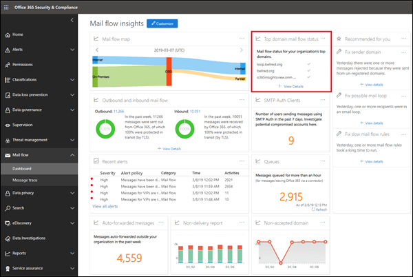

# Анализ состояния почтовых процессов верхнего доменаTop domain mail flow status insight

Сведения **о состоянии почтовых процессов верхнего уровня** предоставляют сведения о текущем состоянии доменов организации в отношении почтового процесса.The **Top domain mail flow status** insight gives you the current status for your organization's domains in terms of mail flow. Эта информация поможет вам определить и устранить неполадки в доменах \*\*\*\*\*\* , в которых возникают проблемы с почтовыми сообщениями (например, невозможно получить внешние сообщения электронной почты), особенно истечения срока действия домена или доменов с неверными записями MX.This insight helps you identify and troubleshoot domains that are experiencing ***mail flow impacting*** issues (for example, unable to receive external email), especially domain expirations or domains with incorrect MX records.

При нажатии кнопки **Просмотреть сведения в представлении** отобразится раскрывающееся меню, в котором вы увидите дополнительные сведения о состоянии каждого домена.When you click **View details** in the insight, a flyout appears that shows you more details for the status of each domain.

Зеленая галочка для домена указывает, что текущая запись MX (при переходе на панель мониторинга "Сводка обработки почты") соответствует значению, указанному в записи, и что в течение последних двух часов домен получил электронную почту.A green check mark for a domain indicates the current MX record (when you browsed to the mail flow insights dashboard) matches the value we have on record, and that the domain has received email during the past two hours.

Красный крестик для домена указывает на то, что запись MX была изменена и что в течение предыдущих 6 часов домен не получил электронную почту.A red x for a domain indicates the MX record has been changed, and that the domain has received no email during the past 6 hours. Это может указывать на то, что срок действия домена истек или запись MX была неправильно обновлена.This likely indicates that your domain has expired, or that the MX record has been incorrectly updated. Обратитесь к регистратору доменных имен или в службе хостинга DNS, чтобы узнать, истек ли срок действия домена, или если запись MX домена неверна.Check with your domain registrar or DNS hosting service to see if the domain has expired, or if the domain's MX record is incorrect.

## См. такжеSee also

Для получения дополнительных сведений о других аналитиках почтовых ящиков в панели мониторинга для почтового процесса ознакомьтесь с разрешениями почтовых ящиков [в центре безопасности _Амп_ соответствия требованиям](mail-flow-insights-v2.md).For more information about other mail flow insights in the mail flow dashboard, see [Mail flow insights in the Security & Compliance Center](mail-flow-insights-v2.md).
