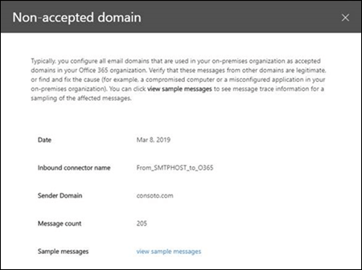

# Отчет о необслуживаемом домене

> [!NOTE]
> Функции, описанные в этом разделе, не были развернуты во всех организациях Office 365 и могут быть изменены.

Как и при **** работе с домеНом отправителя, неодобренный **доменное** представление определяет сообщения из локальной организации электронной почты, но домен отправителя не настраивается как обслуживаемый домен в организации Office 365.

Office 365 может регулировать эти сообщения, если у нас есть данные для подтверждения того, что назначение этих сообщений является вредоносным. Поэтому важно понимать, что происходит и как устранить проблему.

Если щелкнуть мини-приложение, вы перейдете к полному отчету. В полном отчете, где можно щелкнуть **Просмотреть сведения** , чтобы просмотреть сведения в таблице, как показано на следующей схеме:

Когда вы выбираете строку в таблице, в всплывающем меню появятся дополнительные сведения. Вы можете щелкнуть **Просмотреть примеры сообщений** , чтобы увидеть некоторые из идентифицированных сообщений.

## См. также

Для получения дополнительных сведений о других аналитиках почтовых ящиков в панели мониторинга для почтового процесса ознакомьтесь с разрешениями поЧтовых ящиков [в центре безопасности _Амп_ соответствия требованиям](mail-flow-insights-v2.md).
