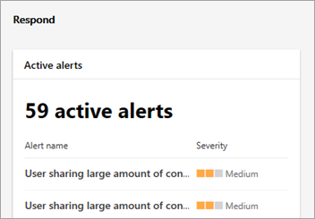

# Добро поЖаловать в новый центр соответствия требованиям Microsoft 365Welcome to your all-new Microsoft 365 compliance center

## ОбзорOverview

Если вы заинтересованы в возможностях обеспечения соответствия требованиям вашей организации, вы будете рады новому центру соответствия требованиям Microsoft 365.If you're interested in your organization's compliance posture, you're going to love the new Microsoft 365 compliance center. Центр соответствия требованиям Microsoft 365 обеспечивает легкий доступ к данным и средствам, необходимым для управления требованиями соответствия вашей организации.The Microsoft 365 compliance center provides easy access to the data and tools you need to manage to your organization's compliance needs. Ознакомьтесь с этой статьей, чтобы ознакомиться с центром соответствия требованиям Microsoft 365, о том, как получить его и выполнить следующие действия.Read this article to get acquainted with the Microsoft 365 compliance center, how to get it, and your next steps.

## Странице!Welcome!

Когда вы впервые переходите в центр соответствия требованиям Microsoft 365, вы будете гритед с приветственным сообщением в правом верхнем углу экрана.When you go to your Microsoft 365 compliance center for the first time, you'll be greeted with welcome message in the upper right corner of the screen.

В этом разделе приводятся указатели на начало работы со следующими действиями и приглашением на отзыв.This section gives you some pointers on how to get started, with next steps and an invitation for you to give us feedback.

## ОценкаAssess

Раздел " **Оценка** " показывает, как ваша организация работает с точки зрения защиты данных и соответствия требованиям.The **Assess** section shows you at a glance how your organization is doing with respect to data protection and compliance.

Отсюда вы можете перейти к диспетчеру [соответствия требованиям](meet-data-protection-and-regulatory-reqs-using-microsoft-cloud.md) , чтобы просмотреть или изменить конфигурации и потенциально увеличить общую оценку.From here, you can go to [Compliance Manager](meet-data-protection-and-regulatory-reqs-using-microsoft-cloud.md) to review or edit your configurations and potentially improve your overall score.

Вы увидите дополнительные графические элементы, например одно из них, которое отображает соответствие облачных приложений организации, а также сведения о пользователях с общими файлами, ссылки на [Cloud App Security](https://docs.microsoft.com/cloud-app-security/) или другие средства, где можно просматривать данные.You'll see additional widgets, such as one showing your organization's cloud app compliance, and another showing data about users with shared files, with links to [Cloud App Security](https://docs.microsoft.com/cloud-app-security/) or other tools where you can explore data.

## ЗащитаProtect

Раздел **Защита** содержит мини-приложения, предоставляющие высокоуровневые сведения о защите от потери данных (DLP), сторонних приложениях для использования, общих файлах, ТЕНЕВых ИТ-приложениях и т. д.The **Protect** section contains widgets that provide you with high-level information about data loss prevention (DLP), third-party apps in use, shared files, shadow IT apps, and so on. 

Каждый мини-приложение содержит ссылку на отчет, в котором можно узнать больше.Each widget has a link to a report where you can learn more.

## RespondRespond

В разделе **ответ** выводятся оповещения, которые вы хотите просмотреть и потенциально выполнить действие.The **Respond** section surfaces alerts that you'll want to review and potentially take action.

Мини-приложения, такие как активное мини-приложение Alerts, включают ссылку на отчет, в которой можно просматривать более подробные сведения, такие как степень серьезности, состояние, Категория и т. д.Widgets, such as the Active alerts widget, include a link to a report where you can view more detailed information, such as Severity, Status, Category, and more.

 

## НужноNavigate

Помимо ссылок в графических элементах, в левой части экрана можно найти область навигации, в которой вы сможете легко получить доступ к оповещениям, отчетам, политикам, решениям для обеспечения соответствия требованиям и т. д.In addition to links in widgets, you'll find a navigation pane on the left side of the screen that gives you easy access to your alerts, reports, policies, compliance solutions, and more. 

## Как это сделать?How do I get this?

- Если у вас еще нет нового центра соответствия требованиям Microsoft 365, вы будете в ближайшее время.If you don't have the new Microsoft 365 compliance center already, you will have it soon. [Новый центр соответствия требованиям Microsoft 365](microsoft-security-and-compliance.md#microsoft-365-compliance-center) состоит в развертывании.The [new Microsoft 365 compliance center](microsoft-security-and-compliance.md#microsoft-365-compliance-center) is rolling out now!

- Чтобы посетить центр соответствия требованиям Microsoft 365, выполните вход в систему в качестве глобального администратора или администратора [https://compliance.microsoft.com](https://compliance.microsoft.com) соответствия требованиям.To visit the Microsoft 365 compliance center, as a global administrator or compliance administrator, go to [https://compliance.microsoft.com](https://compliance.microsoft.com) and sign in. 

- Чтобы узнать больше о требованиях, ознакомьтесь со статьей [обязательные лицензии и разрешения](microsoft-security-and-compliance.md#required-licenses-and-permissions).To learn more about requirements, see [Required licenses and permissions](microsoft-security-and-compliance.md#required-licenses-and-permissions).

## Дальнейшие действияNext steps

- **Изучите оценку соответствия требованиям Майкрософт**и используйте диспетчер соответствия требованиям, чтобы увеличить рейтинг.**Review your Microsoft Compliance Score**, and use Compliance Manager to improve your score. Чтобы узнать больше о диспетчере соответствия требованиям, ознакомьтесь со статьей [Использование диспетчера соответствия требованиям для обеспечения защиты данных и нормативных требований при использовании облачных служб Майкрософт](meet-data-protection-and-regulatory-reqs-using-microsoft-cloud.md).To learn more about Compliance Manager, see [Use Compliance Manager to help meet data protection and regulatory requirements when using Microsoft cloud services](meet-data-protection-and-regulatory-reqs-using-microsoft-cloud.md).

- **Изучите политики защиты от потери данных в Организации**и при необходимости выполните корректировки.**Review your organization's Data Loss Prevention policies**, and if necessary, make adjustments. Чтобы узнать больше о защите от потери данных, ознакомьтесь со статьей [Обзор политик защиты от потери данных](data-loss-prevention-policies.md).To learn more about DLP, see [Overview of data loss prevention policies](data-loss-prevention-policies.md). 

- **Познакомьтесь с настройкаМи Microsoft Cloud App Security**.**Get acquainted with and set up Microsoft Cloud App Security**. Чтобы получить помощь по этому, ознакомьтесь со [статьЕй QuickStart: Начало работы с Microsoft Cloud App Security](https://docs.microsoft.com/cloud-app-security/getting-started-with-cloud-app-security).To get help with this, see [Quickstart: Get started with Microsoft Cloud App Security](https://docs.microsoft.com/cloud-app-security/getting-started-with-cloud-app-security).  

- **Посетите центр соответствия требованиям Microsoft 365**и обязательно изучите все оповещения или потенциальные риски, которые могут возникнуть.**Visit your Microsoft 365 compliance center often**, and make sure to review any alerts or potential risks that might arise. Перейдите на [https://compliance.microsoft.com](https://compliance.microsoft.com) страницу и войдите в нее.Go to [https://compliance.microsoft.com](https://compliance.microsoft.com) and sign in.