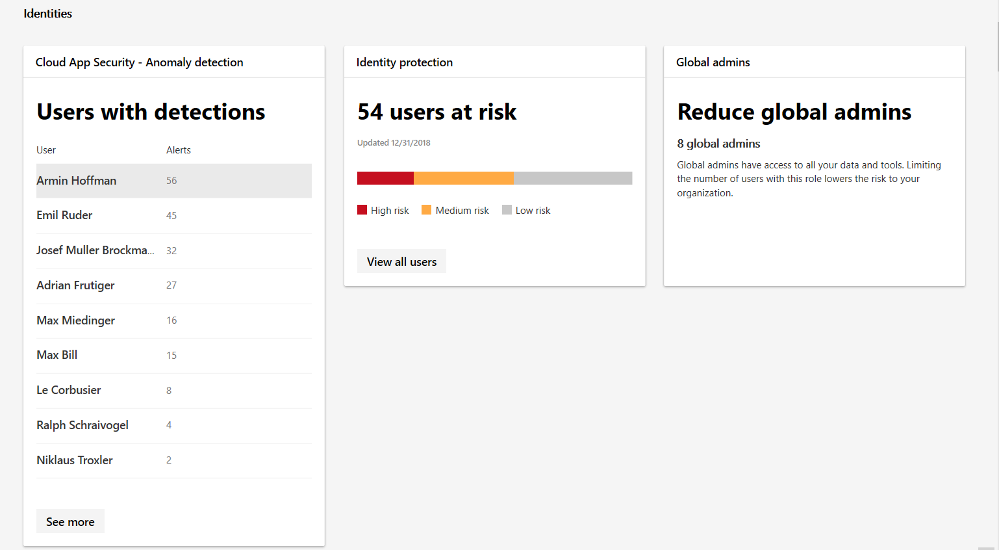

# Мониторинг и отчеты по удостоверениям в Центре безопасности Microsoft 365Monitor and report identities in Microsoft 365 security

Вы можете отслеживать удостоверения в Организации и следить за подозрительными и рискованными поведениями.You can monitor the identities in your organization and keep track of suspicious or risky behaviors. В категории **удостоверения** **_амп_ отчетов мониторинга**можно отслеживать:In the **Identities** category of **Monitoring & reports**, you can track:

* Пользователи с наиболее обнаруженными аномалиямиUsers with the most detected anomalies
* Сколько пользователей сообщает о риске с помощью политик условного доступаHow many users are reported at risk by conditional access policies
* Количество глобальных администраторов в ОрганизацииThe number of global admins in your org

Для пользователей с определенными обнаружениями вы можете изучить конкретное оповещение и изучить его в центре безопасности защитника Windows.For users with specific detections, you can explore the specific alert and investigate in Windows Defender security center. Обнаружение включает аномалии, такие как пользователи, которые входят в систему из незнакомых расположений.Detections include anomalies such as users who sign in from unfamiliar locations.

Полный набор событий риска представлен в статье [события риска Azure Active Directory](https://docs.microsoft.com/azure/active-directory/reports-monitoring/concept-risk-events).For a complete set of risk events, see [Azure Active Directory risk events](https://docs.microsoft.com/azure/active-directory/reports-monitoring/concept-risk-events).
