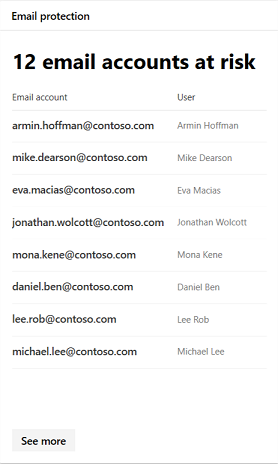

# Мониторинг и составление отчетов о состоянии приложений в Microsoft 365 SecurityMonitor and report app status in Microsoft 365 security

Эти отчеты позволяют получить более подробные сведения о том, как облачные приложения используются в Организации, в том числе типы приложений, их уровень риска и оповещения.These reports provide more insight into how cloud apps are being used in your organization, including what kinds of apps, their level of risk, and alerts.

## Отслеживание учетных записей электронной почты под угрозойMonitor email accounts at risk

**Защита электронной почты** показывает, что учетные записи электронной почты подвержены риску.**Email protection** shows email accounts at risk. Вы можете выбрать учетную запись для дальнейшего изучения в центре безопасности защитника Windows.You can click an account to investigate further in Windows Defender Security Center.

## Отслеживание разрешений на доступ к приложениям, предоставленных пользователямиMonitor app permissions granted by users

**Cloud App Security — приложения OAuth** список приложений, обнаруженных в Cloud App Security, которым были предоставлены разрешения пользователей.**Cloud App Security - OAuth apps** lists apps discovered by Cloud App Security that have been granted permissions by users. В каталоге риска Cloud App Security входит свыше 16 000 приложений, которые оцениваются с помощью более 70 факторов риска.Cloud App Security's risk catalog includes over 16,000 apps that are assessed using over 70 risk factors.

Факторы риска начинаются с общей информации, например издателя приложения, в меры безопасности и элементы управления, например, поддерживает ли приложение шифрование на REST или предоставляет журнал аудита действий пользователя.The risk factors start from general information, such as the app publisher, to security measures and controls, such as whether the app supports for encryption at rest or provides an audit log of user activity.

## Отслеживание учетных записей пользователей облачного приложенияMonitor cloud app user accounts

**Учетные записи облачных приложений для** учетных записей списков проверки, которые могут потребовать внимания.**Cloud app accounts for review** lists accounts that may require attention.

## Сведения о том, какие облачные приложения используютсяUnderstand which cloud apps are used

**Обнаруженные облачные приложения (категории)** показывают, какие типы приложений используются в вашей организации, и ссылки на панель мониторинга облачного обнаружения в Cloud App Security.**Discovered cloud apps (categories)** show what kinds of apps are being used in your organization and links to the Cloud Discovery dashboard in Cloud App Security. Более подробную информацию можно найти [в разделе Краткое руководство: Working with обнаруженным приложениям](https://docs.microsoft.com/cloud-app-security/discovered-apps).For more information, see [Quickstart: Work with discovered apps](https://docs.microsoft.com/cloud-app-security/discovered-apps).  

## Отслеживание пользователей, обращающихся к облачным приложениямMonitor where users access cloud apps

**Расположения облачных действий приложения** показывают, где у пользователей есть доступ к облачным приложениям.**Cloud app activity locations** show where users are accessing cloud apps.

## Отслеживание работоспособности для рабочих нагрузок инфраструктурыMonitor health for infrastructure workloads

В центре безопасности Azure для рабочих нагрузок инфраструктуры отображаются оповещения о работоспособности **инфраструктуры** .**Infrastructure health** shows health status alerts for infrastructure workloads in Azure Security Center.

Центр безопасности Azure обеспечивает единую систему управления безопасностью и Advanced Threat Protection в локальной и облачной рабочих нагрузках.Azure Security Center provides unified security management and advanced threat protection across on-premises and cloud workloads. Вы можете собирать, искать и анализировать данные безопасности из различных источников, в том числе брандмауэров и других партнерских решений.You can collect, search, and analyze security data from a variety of sources, including firewalls and other partner solutions.

Для получения дополнительных сведений обратитесь [к документации центра безопасности Azure](https://docs.microsoft.com/azure/security-center/).For more information, see [Azure Security Center Documentation](https://docs.microsoft.com/azure/security-center/).

