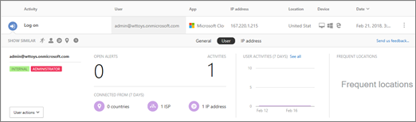

# Обновления для системы безопасности облачных приложений Office 365 во время 2017
    
## Выпуск Office 365 Cloud App Security 112

*Выпущено 24 декабря 2017 г.* 
  
**После [выпуска Microsoft Cloud App Security 112](https://docs.microsoft.com/cloud-app-security/release-notes#cloud-app-security-release-112)**: 
  
- **Релевантный лоток для аналитики**. Теперь в журнале активности можно получить доступ к соответствующему почтовому ящику, щелкнув имя пользователя или IP-адрес. 
    
    
  
- **Возможность просмотра дополнительных действий с помощью щелчка**. В соответствующем почтовом ящике можно щелкнуть значок часы, чтобы просмотреть все действия, выполненные в течение 48 часов выбранного действия. 
    
    
  
- **Журнал усовершенствований средства синтаксического анализа для шаблоны JUNIPER сркс**. В средство синтаксического анализа журнала облачного обнаружения были внесены улучшения для шаблоны Juniper СРКС. 
    
## Выпуск Office 365 Cloud App Security 111

*Выпущено 10 декабря 2017 г.* 
  
**После [выпуска Microsoft Cloud App Security 111](https://docs.microsoft.com/cloud-app-security/release-notes#cloud-app-security-release-111)**: 
  
- **Улучшения фильтра времени**. Фильтры времени теперь проще использовать. Чтобы получить доступ к фильтру времени, в представлении, таком как журнал активности, политики, оповещения, с помощью расширенного представления, выберите пункт **Дата** в списке фильтров. Затем выберите параметр, например "Before", "после" или "между", чтобы применить фильтр времени. 
    
    
  
## Выпуск Office 365 Cloud App Security 110

*Выпущено 26 ноября 2017 г.* 
  
**После [выпуска Microsoft Cloud App Security 110](https://docs.microsoft.com/cloud-app-security/release-notes#cloud-app-security-release-110)**: 
  
- **Интеграция сервера SIEM теперь доступна**. Подключите сервер SIEM к Office 365 Cloud App Security. Теперь вы можете автоматически отправлять оповещения и действия на выбранный сервер SIEM, настроив агенты SIEM. [В разделе Интеграция сервера SIEM с Office 365 Cloud App Security](integrate-your-siem-server-with-office-365-cas.md).
    
- **Упрощение доступа к содержимому справки**. С помощью нового вопросительного знака в правом верхнем углу теперь можно получить доступ к содержимому справки на страницах портала Cloud App Security для Office 365. Каждая ссылка зависит от контекста, с помощью которой вы можете получить нужные сведения, исходя из того, на какой странице Вы находитесь. 
    
- **Отправьте нам отзыв**. С помощью смайликов в правом верхнем углу вы можете отправлять отзывы со всех страниц портала Cloud App Security для Office 365. Это позволяет сообщать об ошибках, запрашивать новые функции и совместно использовать интерфейс непосредственно с группой Office 365 Cloud App Security. 
    
## Выпуск Office 365 Cloud App Security 102

*Выпущено 13 августа 2017 г.* 
  
**После [выпуска Microsoft Cloud App Security 102](https://docs.microsoft.com/cloud-app-security/release-notes#cloud-app-security-release-102)**: 
  
- **Новые действия по исследованию пользователей** позволяют получить дополнительный уровень детализации при расследовании пользователей. На странице изучения вы можете навести указатель мыши на действие, пользователя или учетную запись и применить его в качестве фильтра, а затем можно просмотреть связанные действия или события. 
    
## Выпуск Office 365 Cloud App Security 100

*Выпущено 17 июля 2017 г.* 
  
**После [выпуска Microsoft Cloud App Security 100](https://docs.microsoft.com/cloud-app-security/release-notes#cloud-app-security-release-100)**: 
  
- **Расширения безопасности** — это новая панель мониторинга, где можно централизованно управлять всеми расширениями безопасности для Office 365 Cloud App Security, в том числе маркерами API и агентами SIEM. Чтобы просмотреть панель мониторинга расширений безопасности, выполните указанные ниже действия. 
    
1. Перейдите к [https://protection.office.com](https://protection.office.com) рабочей или учебной учетной записи Office 365 и войдите в нее с помощью рабочей или учебной учетной записи. (Откроется центр соответствия требованиям безопасности &amp; .) 
    
2. Перейдите к разделу **оповещения** \> **Управление расширенными оповещениями**.
    
3. Выберите **Перейти к Office 365 Cloud App Security**.
  
4. Выберите **Параметры** \> **расширения безопасности**.
    
    
  
- **Улучшенный анализ**. Усовершенствования были сделаны в механизме синтаксического анализа журнала обнаружения в облаке. Вероятность возникновения внутренних ошибок значительно меньше. 
    
- **Ожидаемые форматы журнала**. Ожидаемый формат журнала облачных обнаружений теперь содержит примеры как для формата syslog, так и для формата FTP. 
    
## Связанные статьи

[Контент справки по безопасности облачного приложения Office 365](office-365-cas-help.md)

[Новые возможности Office 365 Cloud App Security](new-in-office-365-cas.md)
  
[Действия, связанные с использованием, после развертывания Office 365 Cloud App Security](utilization-activities-for-ocas.md)

