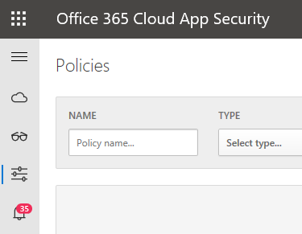
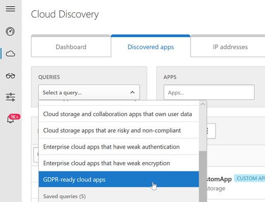

# Office 365 облачных приложений обновлений во время 2018Office 365 Cloud App Security updates during 2018

## Выпуск Office 365 безопасности приложения облачных 138Office 365 Cloud App Security release 138

*Выпущен 23 декабря 2018**Released December 23, 2018*

**После [138 выпуска системы безопасности приложения Microsoft Cloud](https://docs.microsoft.com/cloud-app-security/release-notes#cloud-app-security-release-138)**:**Following [Microsoft Cloud App Security release 138](https://docs.microsoft.com/cloud-app-security/release-notes#cloud-app-security-release-138)**:

- **Отправка автоматический вход с помощью Docker на Windows** Безопасность приложения в облаке теперь поддерживает отправляемых автоматического входа для Windows 10 ([Попадающих создателей обновления](https://docs.microsoft.com/windows/whats-new/whats-new-windows-10-version-1709) и более поздней версии) и Windows Server ([версия 1709](https://docs.microsoft.com/windows-server/get-started/whats-new-in-windows-server-1709) и более поздней версии) с помощью Docker на Windows. В разделе [этой статьи](https://docs.microsoft.com/cloud-app-security/discovery-docker-windows) для получения дополнительных сведений и настройки Docker.**Automatic log upload using Docker on Windows** Cloud App Security now supports automatic log upload for Windows 10 ([Fall Creators Update](https://docs.microsoft.com/windows/whats-new/whats-new-windows-10-version-1709) and newer) and Windows Server ([version 1709](https://docs.microsoft.com/windows-server/get-started/whats-new-in-windows-server-1709) and newer) by using Docker on Windows. See [this article](https://docs.microsoft.com/cloud-app-security/discovery-docker-windows) to learn more and configure Docker.  

- **Интеграция с Microsoft потока** Безопасность приложения в облаке теперь интегрируется с [Microsoft поток](https://docs.microsoft.com/flow/getting-started) для предоставления настраиваемых оповещения playbooks автоматизации и согласование. В разделе [в этой статье](https://docs.microsoft.com/cloud-app-security/flow-integration) , Дополнительные сведения и настроить интеграцию с Microsoft потока.**Microsoft Flow integration** Cloud App Security now integrates with [Microsoft Flow](https://docs.microsoft.com/flow/getting-started) to provide custom alert automation and orchestration playbooks. See [this article](https://docs.microsoft.com/cloud-app-security/flow-integration) to learn more and configure Microsoft Flow integration. 

## Выпуск Office 365 безопасности приложения облачных 137Office 365 Cloud App Security release 137

*Выпущен 8 декабря 2018**Released December 8, 2018*

**После [137 выпуска системы безопасности приложения Microsoft Cloud](https://docs.microsoft.com/cloud-app-security/release-notes#cloud-app-security-release-137)**:**Following [Microsoft Cloud App Security release 137](https://docs.microsoft.com/cloud-app-security/release-notes#cloud-app-security-release-137)**:

- **Добавлена поддержка для Dynamics** Безопасность приложения в облаке теперь включает поддержку Microsoft Dynamics действия, которые поддерживаются в журнале аудита Office 365.**Added support for Dynamics** Cloud App Security now includes support for the Microsoft Dynamics activities that are supported in the Office 365 audit log. 

- **Ведет копирования – новых терминов!** Имя разрешения возможностей приложений был изменен для ясности – теперь называется OAuth приложений.**Heads up – new terminology!** The name of the App permissions capabilities was changed for clarity – it is now called OAuth apps. 

## Выпуск Office 365 безопасности приложения облачных 136Office 365 Cloud App Security release 136

*Выпущен 25 ноября 2018**Released November 25, 2018*

**После [136 выпуска системы безопасности приложения Microsoft Cloud](https://docs.microsoft.com/cloud-app-security/release-notes#cloud-app-security-release-136)**:**Following [Microsoft Cloud App Security release 136](https://docs.microsoft.com/cloud-app-security/release-notes#cloud-app-security-release-136)**:

- **Облако обнаружения обновлений** Средство синтаксического анализа пользовательского журнала был улучшен для поддержки дополнительных и более сложные веб-трафика регистрирует форматы. Как часть этих пользователей улучшения теперь могут вводить пользовательских заголовков headerless CSV-файлов журнала, используются специальные разделители для файлов ключ значение, в формат файлов Syslog и многое другое.**Cloud Discovery updates** The custom log parser was enhanced to support additional and more complex web traffic logs formats. As part of these enhancements users can now input custom headers for headerless CSV log files, use special delimiters for key-value files, process Syslog file format, and more.

- **Новую политику обнаружения неполадок: правила обработки подозрительные папки "Входящие"** Эта политика профили среды и триггеров оповещения при подозрительные правила, удаление и перемещение сообщений и папок, которые устанавливаются в папку Входящие». Это предупреждение может указывать, что учетная запись пользователя атаке, что сообщения специально скрыты, и что почтовый ящик используется для распространения нежелательной почты и вредоносных программ в организации.**New anomaly detection policy: Suspicious inbox manipulation rules** This policy profiles your environment and triggers alerts when suspicious rules that delete or move messages or folders are set on a user's inbox. This may indicate that the user’s account is compromised, that messages are being intentionally hidden, and that the mailbox is being used to distribute spam or malware in your organization.

- **Поддержка групп в политики разрешений приложения** Безопасность приложения в облаке теперь предоставляет возможность более модульного определения политики разрешений приложения на основании членство в группах для пользователей, которым разрешено приложений. Например администратор могут принять для установки политики, которая отменяет редко приложений, если они запрашивающих высокого разрешения только в том случае, если пользователь, право разрешения — это должна быть членом группы администраторов.**Support for groups in app permission policies** Cloud App Security now gives you the ability to define app permission policies more granularly, based on the group memberships of the users who authorized the apps. For example, an admin can decide to set a policy that revokes uncommon apps if they ask for high permissions, only if the user who authorized the permissions is a member of the administrators group.

## Выпуски Office 365 безопасности приложения облачных 133, 134 и 135Office 365 Cloud App Security releases 133, 134, and 135

*Выпущен в ноябре октября 2018**Released in October-November, 2018*

**После [выпуска системы безопасности приложения Microsoft Cloud, 133, 134 и 135](https://docs.microsoft.com/cloud-app-security/release-notes#cloud-app-security-release-133-134-135)**:**Following [Microsoft Cloud App Security release 133, 134, and 135](https://docs.microsoft.com/cloud-app-security/release-notes#cloud-app-security-release-133-134-135)**:

- **Новые политики обнаружения неполадок** развертывание постепенно:**New anomaly detection policies** are rolling out gradually:
    
    - Новая политика **exfiltration данных unsanctioned приложений** автоматически включается оповещения при пользователя или IP-адрес, с помощью приложения, которое не разрешено для выполнения действия, который имеет следующий вид: попытка на exfiltrate сведения из вашей организации.The new **Data exfiltration to unsanctioned apps** policy is automatically enabled to alert you when a user or IP address uses an app that isn't sanctioned to perform an activity that resembles an attempt to exfiltrate information from your organization.
    
    - Новую политику **несколько действий виртуальной Машины удалить** профили среды и отправляет оповещения при удалении нескольких виртуальных машин в одном сеансе, относящиеся к базовой в вашей организации.The new **Multiple delete VM activities** policy profiles your environment and triggers alerts when users delete multiple VMs in a single session, relative to the baseline in your organization.

- **Облако обнаружения поддержка i фильтра** Функции безопасности облачных облачных приложений обнаружения имеет улучшенную поддержки для синтаксического анализа syslog i фильтра.**Cloud Discovery support for i-Filter** The Cloud App Security Cloud Discovery feature now has enhanced support for the i-Filter syslog parser.

## Выпуск Office 365 безопасности приложения облачных 131Office 365 Cloud App Security release 131

*Выпущен 16 сентября 2018**Released September 16, 2018*

**После [131 выпуска системы безопасности приложения Microsoft Cloud](https://docs.microsoft.com/cloud-app-security/release-notes#cloud-app-security-release-131)**:**Following [Microsoft Cloud App Security release 131](https://docs.microsoft.com/cloud-app-security/release-notes#cloud-app-security-release-131)**:

- **Автоматически отменить разрешения на рискованный OAuth приложений** Теперь контролировать, какие приложения OAuth пользователей имеется доступ, путем отзыва разрешения приложения OAuth приложений для Office. При создании политики разрешений почтовых приложений, теперь можно задать политику отзыв разрешений приложения.**Automatically revoke permissions on risky OAuth apps** You can now control which OAuth apps your users have access to, by revoking app permission for OAuth apps on Office. When creating an App permission policy, you can now set the policy to revoke an app’s permission.

- **Облако обнаружения дополнительных анализатор поддерживается** Облако обнаружения теперь поддерживает формат журнала облачных безопасности Web Forcepoint.**Cloud Discovery additional built-in parser supported** Cloud Discovery now supports the Forcepoint Web Security Cloud log format.
  
## Выпуск Office 365 безопасности приложения облачных 130Office 365 Cloud App Security release 130

*Выпущен 5 сентября 2018**Released September 5, 2018*

**После [130 выпуска системы безопасности приложения Microsoft Cloud](https://docs.microsoft.com/cloud-app-security/release-notes#cloud-app-security-release-130)**:**Following [Microsoft Cloud App Security release 130](https://docs.microsoft.com/cloud-app-security/release-notes#cloud-app-security-release-130)**:

- **Новая строка меню** Обеспечивают более стабильную работу администратора в продуктах Microsoft 365 и позволяют упростить сводить между решения по обеспечению безопасности Microsoft строки меню портала безопасности приложения облачных была перемещена в левой части экрана. В этом единообразная Навигация работать поможет сориентироваться самостоятельно при переходе от одной портал безопасности Microsoft.**New menu bar** To provide a more consistent admin experience across Microsoft 365 products, and to enable you to pivot more easily between Microsoft security solutions, the Cloud App Security portal menu bar has moved to the left side of the screen. This consistent navigation experience helps you orient yourself when moving from one Microsoft security portal to another.  

- **Влияние OAuth приложения счета** Теперь можно отправить отзыв группы безопасности приложения облачных сообщите нам знать, если приложение OAuth, обнаруженных в вашей организации, что сообщение о нежелательном. Данная функция позволяет входить в состав сообщества безопасности и улучшите анализ и оценки риска OAuth приложения. Дополнительные сведения можно [управлять OAuth приложений](manage-app-permissions-in-ocas.md).**Impact OAuth app score** You can now send the Cloud App Security team feedback to let us know if there’s an OAuth app discovered in your organization that seems malicious. This new feature enables you to be part of our security community and enhance OAuth app risk score and analysis. For more information see [Manage OAuth apps](manage-app-permissions-in-ocas.md).

- **Анализаторы новых облачных обнаружения** Анализаторы обнаружения облачных теперь поддерживают iboss безопасного облачных шлюза и Sophos XG.**New Cloud Discovery parsers** The Cloud Discovery parsers now support iboss Secure Cloud Gateway and Sophos XG.

## Выпуск Office 365 безопасности приложения облачных 128Office 365 Cloud App Security release 128

*Выпущен 5 августа 2018**Released August 5, 2018* 
  
**После [128 выпуска системы безопасности приложения Microsoft Cloud](https://docs.microsoft.com/cloud-app-security/release-notes#cloud-app-security-release-128)**:**Following [Microsoft Cloud App Security release 128](https://docs.microsoft.com/cloud-app-security/release-notes#cloud-app-security-release-128)**: 
  
- **Приложения OAuth между несколькими приложениями** Для приложений, OAuth можно теперь bПричиной уязвимости является или утвердить несколько приложений в одно действие. Например можно просмотреть все приложения, которые имеют разрешения пользователей в вашей организации, выберите все приложения, необходимые для запрета и нажмите кнопку запрещать приложения, чтобы отменить все разрешения предоставлены и больше не позволит пользователям разрешение на эти приложения. Для получения дополнительных сведений см. [Управление OAuth приложений с помощью приложения облаке Безопасность в Office 365](manage-app-permissions-in-ocas.md).**OAuth apps across multiple apps** For OAuth apps, you can now ban or approve multiple apps in a single action. For example, you can review all the apps that have been granted permission by users in your organization, select all the apps you want to ban, and then click ban apps to revoke all consent granted and will no longer allow users to grant permission to those apps. To learn more, see [Manage OAuth apps using Office 365 Cloud App Security](manage-app-permissions-in-ocas.md). 
    
- **Нового предложенного запроса: GDPR рынок облачных приложений** Нет запроса предложенного для идентификации обнаруженных приложений, доступных GDPR Готово. Как известно, GDPR имеет недавно стал наивысший приоритет для установки безопасности "Администраторы". Этот запрос позволяет легко определение приложений, доступных GDPR готов и устранять угроз путем оценки риска для приложений, которые не являются. Для использования нового запроса на панели мониторинга **Облачных обнаружения** на вкладке **Discovered приложения** выберите **запросы** > **GDPR рынок облачных приложений**.**New suggested query: GDPR-ready cloud apps** There is a new suggested query to enable you to identify discovered apps that are GDPR ready. As you probably already know, GDPR has recently became a top priority for security admins. This query helps you easily identify apps that are GDPR ready, and mitigate threat by assessing the risk of the apps that aren't. To use the new query, in the **Cloud Discovery** dashboard, on the **Discovered apps** tab, choose **QUERIES** > **GDPR-ready cloud apps**.  
    
## Выпуск Office 365 безопасности приложения облачных 126Office 365 Cloud App Security release 126

*Выпущен 7 июля 2018**Released July 7, 2018* 
  
**После [126 выпуска системы безопасности приложения Microsoft Cloud](https://docs.microsoft.com/cloud-app-security/release-notes#cloud-app-security-release-126)**:**Following [Microsoft Cloud App Security release 126](https://docs.microsoft.com/cloud-app-security/release-notes#cloud-app-security-release-126)**: 
  
- **Автоматические исправление для подозрительные действия** Теперь можно задать автоматическое исправление действия для подозрительные сеанса, вызванные политик обнаружения неполадок. Это улучшение позволяет получать уведомления о мгновенной при возникновении сбоя и автоматически применяются управления действия, такие как приостановить пользователя. Для получения дополнительных сведений см [политики обнаружения неполадок в облаке приложения Office 365 безопасности](anomaly-detection-policies-in-ocas.md).**Automated remediation for suspicious activities** You can now set automatic remediation actions for suspicious session triggered by the anomaly detection policies. This enhancement enables you to be alerted instantly when a breach occurs and apply governance actions automatically, such as suspend user. For more information, see [Anomaly detection policies in Office 365 Cloud App Security](anomaly-detection-policies-in-ocas.md).
    
- **Автоматического обнаружения рискованный OAuth приложений** В дополнение к существующей проверить OAuth приложений, подключенных к вашей среде облачных приложений Office 365 безопасности теперь можно Настройка автоматических уведомлений, чтобы знать, когда приложение OAuth удовлетворяет определенным условиям. Например, можно автоматически получать оповещения при наличии приложения, которое требуется высокий уровень и были право с более чем 50 пользователей. Дополнительные сведения можно [управлять OAuth приложений с помощью приложения облаке Безопасность в Office 365](manage-app-permissions-in-ocas.md).**Automated detection of risky OAuth Apps** In addition to the existing investigate of OAuth apps connected to your environment, Office 365 Cloud App Security now allows you to set automated notifications to let you know when an OAuth app meets certain criteria. For example, you can automatically be alerted when there are apps that require a high permission level and were authorized by more than 50 users. For more information, see [Manage OAuth apps using Office 365 Cloud App Security](manage-app-permissions-in-ocas.md).
    
- **Поддержка управления управляемого поставщика службы безопасности (MSSP)** Office 365 облачных приложений безопасности теперь предоставляет пользователю лучшее управление MSSPs и позволяет настроить внешние партнеры в качестве администраторов с любыми ролей, доступные в настоящее время в облаке приложения Office 365 безопасности. Кроме того Администраторы с правами доступа к более одного клиента могут теперь легко сводной таблицы: между клиенты.**Managed Security Service Provider management (MSSP) support** Office 365 Cloud App Security now provides a better management experience to MSSPs, and allows you to configure external partners as administrators with any of the roles currently available in Office 365 Cloud App Security. In addition, Administrators with access rights to more than one tenant can now easily pivot between the tenants. 
    
## Выпуск Office 365 безопасности приложения облачных 124Office 365 Cloud App Security release 124

*Выпущен 10 июня 2018**Released June 10, 2018* 
  
**После [124 выпуска системы безопасности приложения Microsoft Cloud](https://docs.microsoft.com/cloud-app-security/release-notes#cloud-app-security-release-124)**:**Following [Microsoft Cloud App Security release 124](https://docs.microsoft.com/cloud-app-security/release-notes#cloud-app-security-release-124)**: 
  
- **Области развертываний** Коммерческим организациям модульного можно определить, какие пользователи для мониторинга и защиты на основе членства в группах. Эта функция позволяет выбрать пользователей, действия не будет отображаться для каких-либо защищенных приложений. Областью видимости мониторинга особенно полезен для соответствия требованиям и лицензирование. Некоторые нормативные требующий не мониторинг пользователей из некоторых странах в связи с местными требованиями. И может отслеживать меньше пользователям всегда оставаться в пределах лицензии приложения облаке Безопасность в Office 365.**Scoped deployments** Enterprise organizations can granularly determine which users to monitor and protect based on group membership. This feature enables you to select users whose activities will not show up for any of the protected applications. Scoped monitoring is especially useful for compliance and licensing. Some compliance regulations necessitate that you refrain from monitoring users from certain countries due to local regulations. And, you can monitor fewer users to stay within the limits of your Office 365 Cloud App Security licenses. 
    
- **Новый сервер электронной почты** Сервер электронной почты о безопасности приложения Office 365 облачных был изменен и использует различные диапазоны IP-адресов. Чтобы убедиться в том, что можно получать уведомления, добавьте новый IP-адресов для вашей белом защиты от нежелательной почты. Для организаций, настраивающих их уведомлений безопасности приложения облако обеспечивает эту возможность с помощью MailChimp, службы электронной почты сторонних производителей. Список IP-адресов почтового сервера и инструкции по включению могли работать с MailChimp в разделе [Параметры почты (безопасности приложения Microsoft Cloud)](https://docs.microsoft.com/cloud-app-security/mail-settings)и [требования к сети (безопасности приложения Microsoft Cloud)](https://docs.microsoft.com/cloud-app-security/network-requirements) .**New email server** The email server for Office 365 Cloud App Security has changed and uses different IP address ranges. To make sure you can get notifications, add the new IP addresses to your anti-spam whitelist. For organizations who customize their notifications, Cloud App Security enables this for you using MailChimp, a third-party email service. For the list of mail server IP addresses, and instructions for enabling work with MailChimp, see [Network requirements (Microsoft Cloud App Security)](https://docs.microsoft.com/cloud-app-security/network-requirements) and [Mail settings (Microsoft Cloud App Security)](https://docs.microsoft.com/cloud-app-security/mail-settings).
    
## Выпуск Office 365 безопасности приложения облачных 121Office 365 Cloud App Security release 121

*Выпущен 6 мая 2018**Released May 6, 2018* 
  
**После [121 выпуска системы безопасности приложения Microsoft Cloud](https://docs.microsoft.com/cloud-app-security/release-notes#cloud-app-security-release-121)**:**Following [Microsoft Cloud App Security release 121](https://docs.microsoft.com/cloud-app-security/release-notes#cloud-app-security-release-121)**: 
  
- **Улучшения политики обнаружения неполадок**. Для включения два новых типа обнаружения угроз, постепенно выходить были улучшены политик обнаружения неполадок безопасности для Office 365 облаке приложения:**Anomaly detection policy improvements**. Office 365 Cloud App Security's anomaly detection policies have been improved to include two new types of threat detection that are gradually rolling out: 
    
  - **Активности Ransomware.** Возможности обнаружения Ransomware будут расширены с помощью обнаружение неполадок для предоставления более полное описание против атак сложных ransomware.**Ransomware activity.** Ransomware detection capabilities are extended with anomaly detection to give you more comprehensive coverage against sophisticated ransomware attacks. 
    
  - **Завершен активности пользователей.** Завершен включает активности пользователей для контроля учетных записей отключенных пользователей, который был отзыва подготовленных из корпоративных приложений, но кто может по-прежнему имеется доступ к определенной корпоративным ресурсам.**Terminated user activity.** Terminated user activity enables you to monitor the accounts of terminated users who may have been de-provisioned from corporate applications, but who might still have access to certain corporate resources. 
    
    Чтобы просмотреть [политики обнаружения неполадок](anomaly-detection-policies-in-ocas.md)на портале Office 365 облачных приложений безопасности, нажмите **элемент управления** \> **политик**.To view your [Anomaly detection policies](anomaly-detection-policies-in-ocas.md), in the Office 365 Cloud App Security portal, choose **Control** \> **Policies**.
    
## Выпуск Office 365 безопасности приложения облачных 120Office 365 Cloud App Security release 120

*Выпущен 22 апреля 2018**Released April 22, 2018* 
  
**После [120 выпуска системы безопасности приложения Microsoft Cloud](https://docs.microsoft.com/cloud-app-security/release-notes#cloud-app-security-release-120)**:**Following [Microsoft Cloud App Security release 120](https://docs.microsoft.com/cloud-app-security/release-notes#cloud-app-security-release-120)**: 
  
- **Внутренних приложений как действия пользователя**. Для Office 365 и Azure Active Directory (Azure AD) мы теперь постепенно развертывание возможность обнаружения внутренних приложений как учетная запись пользователя, выполняемых приложений Office 365 и Azure AD (внутренние и внешние). Это позволяет создавать политики, предупреждение, если приложение выполняет непредвиденные и несанкционированного действия.**Internal applications as user activities**. For Office 365 and Azure Active Directory (Azure AD), we are now gradually rolling out the ability to detect internal applications as user account activities performed by the Office 365 and Azure AD applications (both internal and external). This enables you to create policies to alert you if an application performs unexpected and unauthorized activities. 
    
- **Экспорт нескольких полей в списке приложений OAuth**. При экспорте списка приложений OAuth CSV, дополнительных полей, например, publisher, сообщества и уровень использования разрешений включены для облегчения процесса соответствия и расследования.**More fields in OAuth apps list export**. When exporting an OAuth apps list to csv, additional fields such as publisher, permissions level and community usage are included to assist with the compliance and investigation process. 
    
## Выпуск Office 365 безопасности приложения облачных 119Office 365 Cloud App Security release 119

*Выпущен 1 апреля 2018**Released April 1, 2018* 
  
**После [119 выпуска системы безопасности приложения Microsoft Cloud](https://docs.microsoft.com/cloud-app-security/release-notes#cloud-app-security-release-119)**:**Following [Microsoft Cloud App Security release 119](https://docs.microsoft.com/cloud-app-security/release-notes#cloud-app-security-release-119)**: 
  
- **Усовершенствования в облако обнаружения**. Облако обнаружения представлены дополнительные сведения о ведущих пользователях и IP-адреса, облегчая Просмотр сведений об использовании об Office 365 и другие приложения. Для получения дополнительных сведений см [результатов обнаружения приложение проверки безопасности Office 365 облачных приложений](review-app-discovery-findings-in-ocas.md).**Improvements to Cloud Discovery**. The Cloud Discovery provides more information about top users and IP addresses, making it easier to view usage details about Office 365 and other apps. To learn more, see [Review app discovery findings in Office 365 Cloud App Security](review-app-discovery-findings-in-ocas.md).
    
    
  
## Выпуск Office 365 безопасности приложения облачных 118Office 365 Cloud App Security release 118

*Выпущен 18 марта 2018**Released March 18, 2018* 
  
**После [118 выпуска системы безопасности приложения Microsoft Cloud](https://docs.microsoft.com/cloud-app-security/release-notes#cloud-app-security-release-118)**:**Following [Microsoft Cloud App Security release 118](https://docs.microsoft.com/cloud-app-security/release-notes#cloud-app-security-release-118)**: 
  
- **Поддержка barracuda**. Облако обнаружения теперь поддерживает серии F Barracuda брандмауэров и потоковая передача Barracuda F-серии брандмауэра web журнала.**Barracuda support**. Cloud Discovery now supports Barracuda F Series firewalls and Barracuda F-Series firewall web log streaming. 
    
## Выпуск Office 365 безопасности приложения облачных 117Office 365 Cloud App Security release 117

*Выпущен 6 марта 2018**Released March 6, 2018* 
  
**После [117 выпуска системы безопасности приложения Microsoft Cloud](https://docs.microsoft.com/cloud-app-security/release-notes#cloud-app-security-release-117)**:**Following [Microsoft Cloud App Security release 117](https://docs.microsoft.com/cloud-app-security/release-notes#cloud-app-security-release-117)**: 
  
- **поддерживает ли фильтр**. Облако обнаружения теперь поддерживает i ФИЛЬТРА.**i-FILTER support**. Cloud Discovery now supports i-FILTER. 
    
## Выпуск Office 365 безопасности приложения облачных 116Office 365 Cloud App Security release 116

*Выпущен 18 февраля 2018**Released February 18, 2018* 
  
**После [116 выпуска системы безопасности приложения Microsoft Cloud](https://docs.microsoft.com/cloud-app-security/release-notes#cloud-app-security-release-116)**:**Following [Microsoft Cloud App Security release 116](https://docs.microsoft.com/cloud-app-security/release-notes#cloud-app-security-release-116)**: 
  
- **Улучшения политики обнаружения неполадок**. Обнаружение неполадок политик в облаке приложения Office 365 безопасности были улучшена благодаря новой сценариям обнаружения, включая невозможно поездки, активности с подозрительные IP-адреса и входа в систему нескольких неудачных попыток ввода. Автоматически включены новые политики, предоставления threat ожидания введите обнаружения для облачной среде. В дополнение к этому новые политики предоставляют дополнительные данные из модуля обнаружения безопасности Office 365 облачных приложений, который может помочь ускорить процесс расследования и содержит существующие угрозы. Для получения дополнительных сведений обратитесь к статье безопасности приложения Microsoft Cloud, [Получение мгновенно поведения аналитики и обнаружение неполадок](https://docs.microsoft.com/cloud-app-security/anomaly-detection-policy).**Anomaly detection policy enhancements**. Anomaly detection polices in Office 365 Cloud App Security were enhanced with new scenario-based detections including impossible travel, activity from a suspicious IP address and multiple failed login attempts. The new policies are automatically enabled, providing out-of-the-box threat detection across your cloud environment. In addition, the new policies expose more data from the Office 365 Cloud App Security detection engine, which can help speed up the investigation process and contain ongoing threats. To learn more, see the Microsoft Cloud App Security article, [Get instantaneous behavioral analytics and anomaly detection](https://docs.microsoft.com/cloud-app-security/anomaly-detection-policy).
    
- **Поддержка средство синтаксического анализа журналов для форматов контрольной точки**. Анализаторы журнала обнаружения облачных теперь поддерживают два дополнительных форматов контрольная точка: XML и KPC.**Log parser support for Checkpoint formats**. The Cloud Discovery log parsers now support two additional Checkpoint formats: XML, and KPC. 
    
## Выпуск Office 365 безопасности приложения облачных 114Office 365 Cloud App Security release 114

*Выпущен 21 января 2018**Released January 21, 2018* 
  
**После [114 выпуска системы безопасности приложения Microsoft Cloud](https://docs.microsoft.com/cloud-app-security/release-notes#cloud-app-security-release-114)**:**Following [Microsoft Cloud App Security release 114](https://docs.microsoft.com/cloud-app-security/release-notes#cloud-app-security-release-114)**: 
  
- **Состояние службы**. Теперь можно проверить текущее состояние службы приложения облаке Безопасность в Office 365, перейдя на **помощь** \> **состояние системы**.**Service status**. You can now check the current Office 365 Cloud App Security service status by going to **Help** \> **System status**. 
    
    
  
- **Настраиваемые запросы для журнала активности**. Начиная с версии 114, возможность создавать и сохранять пользовательские запросы в журнал активности вводит постепенно. Пользовательские запросы позволяют создавать шаблоны фильтров, которые можно повторно использовать для изучения подробный. Кроме того, предложенных запросы были добавлены расследования ожидания введите шаблонов для фильтрации действий и обнаруженные приложений. Предлагаемые запросы включают настраиваемые фильтры для идентификации рискам, например олицетворения действий, действия администратора, рискованный несовместимым облачных приложений хранилища, корпоративных приложений со слабой шифрования и угроз безопасности. Используйте предлагаемые запросы в качестве отправной точки, при необходимости измените их и сохранение их в новый запрос.**Custom queries for Activity log**. Beginning in version 114, the ability to create and save custom queries in the Activity log is rolling out gradually. Custom queries enable you to create filter templates that can be reused for deep-dive investigation. In addition, suggested queries have been added to provide out-of-the-box investigation templates to filter your activities and discovered apps. Suggested queries include custom filters to identify risks such as impersonation activities, administrator activities, risky non-compliant cloud storage apps, enterprise apps with weak encryption, and security risks. Use the suggested queries as a starting point, modify them as needed, and then save them as a new query. 
    
## Выпуск Office 365 безопасности приложения облачных 113Office 365 Cloud App Security release 113

*Выпущен 8 января 2018**Released January 8, 2018* 
  
**После [113 выпуска системы безопасности приложения Microsoft Cloud](https://docs.microsoft.com/cloud-app-security/release-notes#cloud-app-security-release-113)**:**Following [Microsoft Cloud App Security release 113](https://docs.microsoft.com/cloud-app-security/release-notes#cloud-app-security-release-113)**: 
  
- **Поддержка средство синтаксического анализа журналов для универсального форматов**. Анализаторы журнала обнаружения облачных теперь поддерживают следующие форматы универсальный: LEEF, CEF и W3C.**Log parser support for generic formats**. The Cloud Discovery log parsers now support the following generic formats: LEEF, CEF, and W3C. 

## Статьи по темеRelated topics

[Новые возможности в облаке приложения Office 365 безопасностиWhat is new in Office 365 Cloud App Security](new-in-office-365-cas.md)

[Посетите страницу обновления 2017 о безопасности приложения Office 365 облакоSee the 2017 updates for Office 365 Cloud App Security](new-in-office-365-cas-2017.md)
    
[Действия, связанные с использованием, после развертывания Office 365 Cloud App SecurityUtilization activities after rolling out Office 365 Cloud App Security](utilization-activities-for-ocas.md)