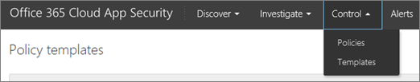

# Обзор Office 365 Cloud App SecurityOverview of Office 365 Cloud App Security
  
|Оценка **\>******Evaluation** \>**|Планирование **\>******Planning** \>**|Развертывание **\>******Deployment** \>**|Использование \*\*\*****Utilization****|
|:-----|:-----|:-----|:-----|
|Вы находитесь здесь!You are here!    [Следующий шагNext step](get-ready-for-office-365-cas.md)   |[Начать планированиеStart planning](get-ready-for-office-365-cas.md)   |[Начните развертываниеStart deploying](turn-on-office-365-cas.md)   |[Начать использованиеStart utilizing](utilization-activities-for-ocas.md)   |
   
> [!NOTE]
> Безопасности приложения Office 365 облаке доступна в Office 365 корпоративный E5. Если ваша организация использует другой подписки Office 365 для предприятия, облачных приложений Office 365 безопасности можно приобрести в виде дополнительного компонента. (Как глобальный администратор, в центре администрирования Office 365 нажмите кнопку **выставления счетов** \> **Добавить подписок**.) Дополнительные сведения можно [Описание платформы Office 365: безопасность Office 365 &amp; центре соответствия требованиям](https://technet.microsoft.com/en-us/library/dn933793.aspx) и [покупке и изменить надстройки для Office 365 для бизнеса](https://support.office.com/article/4e7b57d6-b93b-457d-aecd-0ea58bff07a6).Office 365 Cloud App Security is available in Office 365 Enterprise E5. If your organization is using another Office 365 Enterprise subscription, Office 365 Cloud App Security can be purchased as an add-on. (As a global administrator, in the Office 365 admin center, choose **Billing** \> **Add subscriptions**.) For more information, see [Office 365 Platform Service Description: Office 365 Security &amp; Compliance Center](https://technet.microsoft.com/en-us/library/dn933793.aspx) and [Buy or edit an add-on for Office 365 for business](https://support.office.com/article/4e7b57d6-b93b-457d-aecd-0ea58bff07a6). 
  
Безопасности облаке приложения Office 365 предоставляет вам понимание подозрительные действия в Office 365, могут исследовать ситуаций, которые являются проблемы и при необходимости выполнять действия по устранению проблем безопасности. Office 365 облачных приложений безопасности можно получать уведомления о включаемая оповещений для необычных или подозрительные операций, см вашей организации в Office 365 — это получить доступ и данных используется, приостановить ящиков подозрительные действия учетных записей пользователей и требуют Пользователи, чтобы войти в Office 365 приложениям запускаться оповещение. В этой статье Обзор безопасности приложения Office 365 облачных функций и возможностей.Office 365 Cloud App Security gives you insight into suspicious activity in Office 365 so you can investigate situations that are potentially problematic and, if needed, take action to address security issues. With Office 365 Cloud App Security, you can receive notifications of triggered alerts for atypical or suspicious activities, see how your organization's data in Office 365 is accessed and used, suspend user accounts exhibiting suspicious activity, and require users to log back in to Office 365 apps after an alert has been triggered. Read this article to get an overview of Office 365 Cloud App Security features and capabilities.
  
    
## Как найти портала Office 365 облачных приложений безопасностиHow to find the Office 365 Cloud App Security portal

> [!NOTE]
> Для доступа к порталу Office 365 облачных приложений безопасности, необходимо быть глобальным администратором, администратор безопасности или безопасности чтения. Чтобы получить дополнительные сведения, обратитесь к разделу [разрешения безопасности Office 365 &amp; центре соответствия требованиям](permissions-in-the-security-and-compliance-center.md).To access the Office 365 Cloud App Security portal, you must be a global administrator, security administrator, or security reader. To learn more, see [Permissions in the Office 365 Security &amp; Compliance Center](permissions-in-the-security-and-compliance-center.md). 
  
Можно получить на портале облачных приложений Office 365 безопасности через безопасности Office 365 &amp; центре соответствия требованиям. Вот хороший способ сделать это:You can get to the Office 365 Cloud App Security portal through the Office 365 Security &amp; Compliance Center. Here's one good way to do it:
  
1. Последовательно выберите пункты [https://protection.office.com](https://protection.office.com) и выполнить вход с помощью учетной записи рабочего или школы для Office 365. (Вы перейдете к безопасности &amp; центре соответствия требованиям.)Go to [https://protection.office.com](https://protection.office.com) and sign in using your work or school account for Office 365. (This takes you to the Security &amp; Compliance Center.) 
    
2. В разделе Безопасность &amp; центре соответствия требованиям, выберите **оповещения** \> **Расширенное Управление оповещениями**.In the Security &amp; Compliance Center, choose **Alerts** \> **Manage advanced alerts**. 
    
    
  
    (Если еще не включено приложения облаке Безопасность в Office 365, и глобальный администратор, [Включите безопасности приложения Office 365 облачных](turn-on-office-365-cas.md).)(If Office 365 Cloud App Security is not yet enabled, and you are a global administrator, [turn on Office 365 Cloud App Security](turn-on-office-365-cas.md).)
    
3. Выберите, **перейдите к безопасности приложения Office 365 облака**.Choose **Go to Office 365 Cloud App Security**. 
    
## Политики.Policies

Office 365 безопасности приложения облачных работает с политиками, определенных для вашей организации. С помощью Office 365 облачных приложений безопасность вашей организации получает 10 политик обнаружения неполадок предварительно заданных и несколько шаблонов для действия политики. Эти политики предназначены для обнаружения Общие ошибки, определение пользователей, ведение журналов в с рискованный IP-адреса, обнаруживать ransomware действий, обнаруживать действий администратора для индивидуальных IP-адресов и многое другое.Office 365 Cloud App Security works with the policies that are defined for your organization. With Office 365 Cloud App Security, your organization gets 10 predefined anomaly detection policies and several templates for activity policies. These policies are designed to detect general anomalies, identify users logging in from a risky IP address, detect ransomware activities, detect administrator activities from non-corporate IP addresses, and more.
  

  
Просмотр или использовать шаблоны политики на портале облачных приложений Office 365 безопасность, перейдите к **управления** \> **шаблонов**.To view/use policy templates, in the Office 365 Cloud App Security portal, go to **Control** \> **Templates**. 
  

  
Для получения дополнительных сведений о политиках, можно найти в следующих ресурсах:To learn more about policies, see the following resources:
  
- [Политики действий и оповещения в Office 365 Cloud App SecurityActivity policies and alerts in Office 365 Cloud App Security](activity-policies-and-alerts.md)
    
- [Политики обнаружения аномалий в Office 365 Cloud App SecurityAnomaly detection policies in Office 365 Cloud App Security](anomaly-detection-policies-in-ocas.md)
    
## ОповещенияAlerts

При определении политики оповещения о подозрительных или необычных операций, которые были обнаружены. Чтобы просмотреть оповещения для вашей организации, выберите **оповещений** в панели навигации в верхней части экрана.When policies are defined, alerts notify you about suspicious or atypical activities that were detected. To view alerts for your organization, choose **Alerts** in the navigation bar across the top of the screen. 
  

  
Как оповещения запускаются их для получения дополнительных сведений о том, что происходит можно просмотреть. Затем если по-прежнему подозрительные действия может выполнять действия. К примеру может уведомлять пользователя о проблеме, отключать пользователей вход в Office 365 с или требуют пользователя для входа в приложения Office 365.As alerts are triggered you can review them to learn more about what is going on. Then, if the activity is still suspicious, you can take action. For example, you can notify a user about an issue, suspend a user from signing in to Office 365, or require a user to sign back in to Office 365 apps.
  
Дополнительные сведения об оповещениях см ознакомьтесь со следующими ресурсами:To learn more about alerts, see the following resources:
  
- [Политики действий и оповещения в Office 365 Cloud App SecurityActivity policies and alerts in Office 365 Cloud App Security](activity-policies-and-alerts.md)
    
- [Политики обнаружения аномалий в Office 365 Cloud App SecurityAnomaly detection policies in Office 365 Cloud App Security](anomaly-detection-policies-in-ocas.md)
    
- [Просмотрите и выполнение действий на оповещение системы безопасности приложения Office 365 облакоReview and take action on Office 365 Cloud App Security alerts](review-office-365-cas-alerts.md)
    
## Журналы активностиActivity logs

Просмотр сведений о действий пользователей на странице журнал активности в облаке приложения Office 365 безопасности.View information about user activities on your Activity log page in Office 365 Cloud App Security.
  

  
Чтобы перейти к этой странице, на портале облачных приложений Office 365 безопасность перейдите к **изучению** \> **Журнал активности**.To get to this page, in the Office 365 Cloud App Security portal, go to **Investigate** \> **Activity log**. 
  

  
Можно использовать вашей веб-трафика журналов с Office 365 облачных приложений безопасность слишком. Дополнительные сведения, которые включены в тех файлов журнала, лучше контролировать, вам придется в действие пользователя. Файлы журнала из Barracuda, синий покрывающего, контрольной точке, Cisco, Clavister, Dell SonicWALL, Fortinet, можжевельник, McAfee, корпорация Майкрософт, Пало компьютер, Sophos, Squid, Websence, Zscaler и др., можно использовать.You can use your web traffic logs with Office 365 Cloud App Security, too. The more details that are included in those log files, the better visibility you'll have into user activity. You can use log files from Barracuda, Blue Coat, Check Point, Cisco, Clavister, Dell SonicWALL, Fortinet, Juniper, McAfee, Microsoft, Palo Alto, Sophos, Squid, Websence, Zscaler, and more.
  
[Сведения о веб-трафика: источники данных и журналы для приложения облаке Безопасность в Office 365Learn about web traffic logs and data sources for Office 365 Cloud App Security](web-traffic-logs-and-data-sources-for-ocas.md)
  
## Разрешения для приложенийApp permissions

Office 365 облачных приложений безопасности можно разрешить или запретить людей в организации к использованию приложений сторонних производителей, доступ к данным в Office 365.With Office 365 Cloud App Security, you can allow or prevent people in your organization to use third-party apps that access data in Office 365.
  

  
Чтобы получить доступ к этой странице, перейдите к **изучению** \> **разрешений приложения**.To get to this page, go to **Investigate** \> **App permissions**. 
  

  
[Управление разрешениями приложений с помощью Office 365 Cloud App SecurityManage app permissions using Office 365 Cloud App Security](manage-app-permissions-in-ocas.md)
  
## Панель мониторинга обнаружения облакоCloud Discovery Dashboard

Панели **Мониторинга обнаружения облачных**, также называются **Обнаружения повышения производительности приложения**отображаются сведения о использования облачных приложений в организации. Можно просмотреть сведения о приложениях, пользователи, трафик, транзакции и др. с помощью этой панели мониторинга. Панель мониторинга обнаружения облачных выглядит следующим образом:The **Cloud Discovery Dashboard**, also referred to as **Productivity App Discovery**, shows information about cloud app usage within your organization. You can view information about apps, users, traffic, transactions, and more using this dashboard. The Cloud Discovery Dashboard resembles the following image: 
  

  
Для получения для этой панели мониторинга на портале облачных приложений Office 365 безопасность перейдите к **обнаружить** \> **облаке обнаружения панели мониторинга**.To get to this dashboard, in the Office 365 Cloud App Security portal, go to **Discover** \> **Cloud Discovery dashboard**. 
  

  
[Просмотр результатов обнаружения приложений в Office 365 Cloud App SecurityReview app discovery findings in Office 365 Cloud App Security](review-app-discovery-findings-in-ocas.md)
  
## Дальнейшие действияNext steps

- Получить [варианты использования безопасности Office 365 облаке приложения и руководство по использованию](https://aka.ms/O365CASGuide)Get the [Office 365 Cloud App Security Use Cases and Usage Guide](https://aka.ms/O365CASGuide)
    
- [Подготовка к использованию Office 365 Cloud App SecurityGet ready for Office 365 Cloud App Security](get-ready-for-office-365-cas.md)
    

