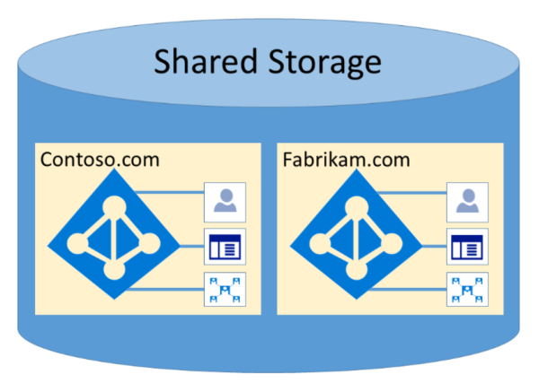

# Изоляция и управление доступом в Azure Active DirectoryIsolation and Access Control in Azure Active Directory

Azure Active Directory была разработана для более надежного размещения нескольких клиентов с помощью логической изоляции данных.Azure Active Directory was designed to host multiple tenants in a highly secure way through logical data isolation. Доступ к Azure Active Directory наследуется уровнем авторизации.Access to Azure Active Directory is gated by an authorization layer. Azure Active Directory изолирует клиентов с помощью контейнеров клиентов как границы безопасности для защиты контента клиента, чтобы получить доступ к содержимому и получить к нему доступ с помощью совместных клиентов.Azure Active Directory isolates customers using tenant containers as security boundaries to safeguard a customer's content so that the content cannot be accessed or compromised by co-tenants. Уровень авторизации Azure Active Directory выполняется для трех проверок:Three checks are performed by Azure Active Directory's authorization layer:
- Включен участник для доступа к клиенту Azure Active Directory?Is the principal enabled for access to Azure Active Directory tenant?
- Включен участник для доступа к данным в этом клиенте?Is the principal enabled for access to data in this tenant?
- Роль субъекта в этом клиенте авторизована для типа запрашиваемого доступа к данным?Is the principal's role in this tenant authorized for the type of data access requested?

Нет приложений, пользователей, серверов и служб, которые могут получить доступ к Azure Active Directory без соответствующей проверки подлинности, маркера или сертификата.No application, user, server, or service can access Azure Active Directory without the proper authentication and token or certificate. Запросы отклоняются, если они не сопровождаются правильными учетными данными.Requests are rejected if they are not accompanied by proper credentials.

Фактически, Azure Active Directory размещает каждый клиент в собственном защищенном контейнере, с политиками и разрешениями, а также в контейнере исключительно владельцем и управлением клиентом.Effectively, Azure Active Directory hosts each tenant in its own protected container, with policies and permissions to and within the container solely owned and managed by the tenant.
 

Понятие контейнеров клиентов глубоко недетализировано в службе каталогов на всех уровнях, от всех порталов до постоянного хранилища.The concept of tenant containers is deeply ingrained in the directory service at all layers, from portals all the way to persistent storage. Даже если несколько метаданных клиента Azure Active Directory хранятся на одном физическом диске, связь между контейнерами, отличными от того, что определено службой каталогов, в свою очередь определяется администратором клиента.Even when multiple Azure Active Directory tenant metadata is stored on the same physical disk, there is no relationship between the containers other than what is defined by the directory service, which in turn is dictated by the tenant administrator. Не существует прямого подключения к хранилищу Azure Active Directory из запрашивающего приложения или службы без предварительного прохода по уровню авторизации.There can be no direct connections to Azure Active Directory storage from any requesting application or service without first going through the authorization layer.

В приведенном ниже примере Contoso и Fabrikam имеют отдельные выделенные контейнеры, и даже несмотря на то, что эти контейнеры могут совместно использовать одну и ту же базовую инфраструктуру, например серверы и хранилища, они не отличаются друг от друга и имеют уровни авторизации и управления доступом.In the example below, Contoso and Fabrikam both have separate, dedicated containers, and even though those containers may share some of the same underlying infrastructure, such as servers and storage, they remain separate and isolated from each other, and gated by layers of authorization and access control.
 

Кроме того, не существует компонентов приложений, которые можно выполнить из Azure Active Directory, и невозможно принудительно подсчитать целостность другого клиента, получить доступ к ключам шифрования другого клиента или прочитать необработанные данные с сервера.In addition, there are no application components that can execute from within Azure Active Directory, and it is not possible for one tenant to forcibly breach the integrity of another tenant, access encryption keys of another tenant, or read raw data from the server.

По умолчанию Azure Active Directory запрещает все операции, выданные удостоверениями в других клиентах.By default, Azure Active Directory disallows all operations issued by identities in other tenants. Каждый клиент логически изолирован в Azure Active Directory с помощью управления доступом на основе утверждений.Each tenant is logically isolated within Azure Active Directory through claims-based access controls. Операции чтения и записи данных каталога ограничены контейнерами клиента и разделяются внутренним уровнем абстракции и уровнем управления доступом на основе ролей (RBAC), который совместно применяет клиент к границе безопасности.Reads and writes of directory data are scoped to tenant containers, and gated by an internal abstraction layer and a role-based access control (RBAC) layer, which together enforce the tenant as the security boundary. Каждый запрос на доступ к данным каталога обрабатывается этими слоями, и каждый запрос на доступ в Office 365 наследует логику выше.Every directory data access request is processed by these layers and every access request in Office 365 is policed by the logic above.

У Azure Active Directory есть Северная Америка, США, Европейский союз, Европейский союз, Германия и Международный раздел.Azure Active Directory has North America, U.S. Government, European Union, Germany, and World Wide partitions. Клиент существует в отдельном разделе, а разделы могут содержать несколько клиентов.A tenant exists in a single partition, and partitions can contain multiple tenants. Сведения о разделах отменяются от пользователей.Partition information is abstracted away from users. Данный раздел (включая все клиенты в нем) реплицируется в несколько центров обработки данных.A given partition (including all the tenants within it) is replicated to multiple datacenters. Раздел для клиента выбирается на основе свойств клиента (например, кода страны).The partition for a tenant is chosen based on properties of the tenant (e.g., the country code). Секреты и другие конфиденциальные сведения в каждом разделе шифруются с помощью выделенного ключа.Secrets and other sensitive information in each partition is encrypted with a dedicated key. Ключи создаются автоматически при создании нового раздела.The keys are generated automatically when a new partition is created.

Функциональные возможности системы Azure Active Directory — это уникальный экземпляр для каждого сеанса пользователя.Azure Active Directory system functionalities are a unique instance to each user session. Кроме того, в Azure Active Directory используются технологии шифрования для обеспечения изоляции общих системных ресурсов на уровне сети для предотвращения несанкционированных и нежелательных передач данных.In addition, Azure Active Directory uses encryption technologies to provide isolation of shared system resources at the network level to prevent unauthorized and unintended transfer of information.
