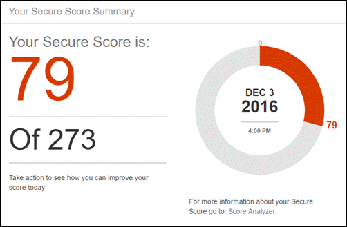

# Знакомство с оценкой безопасности Office 365Introducing the Office 365 Secure Score

Когда-либо возникнуть как безопасной организации Office 365 действительно? Время, требуемое на остановить хотите узнать о - показатель безопасного Office 365 — здесь помочь. Безопасный показатель служит для анализа безопасности организации Office 365 на основании регулярного действия и параметры безопасности и назначает оценки. Его можно Рассматривайте как счета для безопасности.Ever wonder how secure your Office 365 organization really is? Time to stop wondering - the Office 365 Secure Score is here to help. Secure Score analyzes your Office 365 organization's security based on your regular activities and security settings and assigns a score. Think of it as a credit score for security.
  
## Как получить безопасного счета?How do I get to Secure Score?

Любой пользователь, имеющий разрешения администратора (глобального администратора или роли администратора настраиваемого) для подписки на Office 365 бизнеса расширенный или Enterprise можно получить доступ к показатель безопасного в [https://securescore.office.com](https://securescore.office.com). Пользователей, которые не назначена роль администратора не сможет получить доступ к безопасного показателя. Тем не менее администраторы могут использовать средство для совместного использования их результатов с другими пользователями в своей организации.Anyone who has admin permissions (global admin or a custom admin role) for an Office 365 Business Premium or Enterprise subscription can access the Secure Score at [https://securescore.office.com](https://securescore.office.com). Users who aren't assigned an admin role won't be able to access Secure Score. However, admins can use the tool to share their results with other people in their organization.
  
## Как это работает?How does it work?

Обеспечение безопасной показатель рисунков в работе служб Office 365 вы используете (например, OneDrive, SharePoint и Exchange) рассматриваются параметры и действия и сравнивает их базового, заданные в Microsoft. Вы получите оценку, основанную на способ выравнивания осуществляется с помощью рекомендации по безопасности.Secure Score figures out what Office 365 services you're using (like OneDrive, SharePoint, and Exchange) then looks at your settings and activities and compares them to a baseline established by Microsoft. You'll get a score based on how aligned you are with best security practices.
  

  
Если вы хотите, чтобы для улучшения результатов, просмотрите очереди действие, чтобы увидеть, что можно сделать для повышения безопасности и снизить риски, связанные с.If you want to improve your score, review the action queue to see what you can do to help increase security and reduce risks.
  

  
Разверните узел действие, ознакомьтесь с какой угрозы, связанные с его изменим защиты от и получении выполнения задачи.Expand an action to learn about what threats it'll help protect you from and how you'll get the job done.
  

  
Чтобы увидеть влияние на действия пользователя в вашей организации безопасности, перейдите на страницу **Анализатора счета** и предварительный просмотр журнала.To see the impact of your actions on your organization's security, go to the **Score Analyzer** page and review your history. 
  

  
Выберите команду все данных для просмотра разбивкой результатов для этого дня. Можно прокрутите список вниз до см. элементов управления, которые были включены и сколько указано, освоенного объема дня для каждого элемента управления.Click any data point to see a breakdown of your score for that day. You can scroll down to see which controls were enabled and how many points you earned that day for each control.
  

  
## Как будет его помощь?How will it help me?

Использование безопасного показатель позволяет повысить безопасность вашей организации, давая возможность использовать встроенные функции безопасности в Office 365 (многие из которых вы уже приобрести отдельно, но необходимо учитывать). Дополнительные сведения об этих функций как использовать средство поможет позволяют часть помните, что вы получаете правом действия, чтобы защитить организацию от угроз.Using Secure Score helps increase your organization's security by encouraging you to use the built-in security features in Office 365 (many of which you already purchased but might not be aware of). Learning more about these features as you use the tool will help give you piece of mind that you're taking the right steps to protect your organization from threats.
  
Однако не только что наш word для него. Пользователи, которые используют безопасного показатель видели их показатель увеличение пять раз больше, чем пользователи, которые не с помощью. (Увеличение показателя соответствует функции безопасности, используемых в своей организации).But don't just take our word for it. Customers who are using Secure Score have seen their score increase 5 times more than customers who aren't using it. (The increase in score corresponds with the security features being used in their organizations.)
  
Извлечение наших [записей в блоге](https://go.microsoft.com/fwlink/?linkid=836898) для получения дополнительных сведений.Check out our [blog post](https://go.microsoft.com/fwlink/?linkid=836898) to learn more. 
  
> [!NOTE]
> Показатель безопасного не express абсолютный измерения из вероятность, получение нарушенным. Он представляет область, в который были приняты элементов управления, которые можно смещение риск нарушенным. Служба не может гарантировать, что вы не быть нарушенным и счета безопасного не следует рассматривать как было указано ранее, в каких-либо изменений.The Secure Score does not express an absolute measure of how likely you are to get breached. It expresses the extent to which you have adopted controls which can offset the risk of being breached. No service can guarantee that you will not be breached, and the Secure Score should not be interpreted as a guarantee in any way. 
  
## Вопросы и ответыFAQs

### Кто может использовать Secure счета?Who can use Secure Score?

Любой пользователь, имеющий разрешения администратора (глобального администратора или роли администратора настраиваемого) для подписки на Office 365 бизнеса расширенный или Enterprise можно получить доступ к показатель безопасного в [https://securescore.office.com](https://securescore.office.com). Пользователей, которые не назначена роль администратора не сможет получить доступ к безопасного показателя. Тем не менее администраторы могут использовать средство для совместного использования их результатов с другими пользователями в своей организации. Мы вы просматриваете включая другие, роли без прав администратора в списке разрешения в будущем. Если конкретные роли, предоставляемых нам необходимо рассмотреть, свяжитесь с нами по отправку сообщений на [безопасности Office, конфиденциальность &amp; сообщества соответствия](https://go.microsoft.com/fwlink/?linkid=836898).Anyone who has admin permissions (global admin or a custom admin role) for an Office 365 Business Premium or Enterprise subscription can access the Secure Score at [https://securescore.office.com](https://securescore.office.com). Users who aren't assigned an admin role won't be able to access Secure Score . However, admins can use the tool to share their results with other people in their organization. We're looking at including other, non-admin roles in the permissions list in the future. If there are specific roles you'd like us to consider, let us know by posting on the [Office Security, Privacy &amp; Compliance community](https://go.microsoft.com/fwlink/?linkid=836898).
  
### Означает, что дает [не фиксируются]?What does [Not Scored] mean?

Действия с меткой **[Не фиксируются]** , можно выполнить в вашей организации, но не будут результат, так как они не подключен в средстве (пока!). Таким образом по-прежнему можно повысить уровень безопасности, но не будут получения баллов за эти действия на данный момент.Actions labeled as **[Not Scored]** are ones you can perform in your organization but won't be scored because they aren't hooked up in the tool (yet!). So, you can still improve your security, but you won't get credit for those actions right now. 
  
### Как часто является оценку обновления?How often is my score updated?

Показатель вычисляется один раз в день (около 1:00 по тихоокеанскому времени). Если производится изменение измеренное действие оценки будет автоматически обновлять следующий день. Необходимое до 48 часов для изменений в силу в результатов.The score is calculated once per day (around 1:00 AM PST). If you make a change to a measured action, the score will automatically update the next day. It takes up to 48 hours for a change to be reflected in your score.
  
### Кто может просматривать результаты?Who can see my results?

Результаты фильтруются показывать результаты только пользователям в вашей организации, назначенные роли администратора (глобального администратора или роли администратора настраиваемого).Results are filtered to show scores only to people in your organization who are assigned an admin role (global admin or a custom admin role).
  
### Изменить оценку. Как определить почему?My score changed. How do I figure out why?

На странице **Анализатора показатель** щелкните точки данных определенный день, затем прокрутите вниз до изменены завершенные и незавершенные действия для данного для сведения о действиях, см.On the **Score Analyzer** page, click a data point for a specific day, then scroll down to see the completed and incomplete actions for that day to find out what changed. 
  
### Показатель безопасного измерения Мои риск начало нарушенным?Does the Secure Score measure my risk of getting breached?

В короткое, но. Показатель безопасного не express абсолютный измерения из вероятность, получение нарушенным. Он представляет область, в который были приняты функции, которые могут смещение риск нарушенным. Служба не может гарантировать, что вы не быть нарушенным и счета безопасного не следует рассматривать как было указано ранее, в каких-либо изменений.In short, no. The Secure Score does not express an absolute measure of how likely you are to get breached. It expresses the extent to which you have adopted features that can offset the risk of being breached. No service can guarantee that you will not be breached, and the Secure Score should not be interpreted as a guarantee in any way.
  
### Как следует воспринимать оценку?How should I interpret my score?

Предоставляемая точек по настройке функции обеспечения безопасности рекомендуется или для выполнения задач, связанных с безопасности (например, чтение отчеты). Некоторые действия оцениваются частичное завершения, как включение многофакторной проверки подлинности (многофакторной проверкой Подлинности) для пользователей. Результатов безопасного непосредственно — представителя используемые службы безопасности Microsoft. Имейте в виду, что безопасности всегда должен быть сбалансирован с удобства использования. Все элементы управления безопасности есть компонент воздействия пользователя. Элементы управления с влияние низкой пользователей должны маленьким, чтобы не оказывают влияния на ежедневной работе пользователей.You're given points for configuring recommended security features or performing security-related tasks (like reading reports). Some actions are scored for partial completion, like enabling multi-factor authentication (MFA) for your users. Your Secure Score is directly representative of the Microsoft security services you use. Remember that security should always be balanced with usability. All security controls have a user impact component. Controls with low user impact should have little to no effect on your users' day-to-day operations.
  
Для просмотра журнала показатель, перейдите на страницу **Анализатора показателя** . Выберите конкретный день, чтобы увидеть, какие элементы управления были включены для что день и что указывает вы освоенного объема для каждого из них.To see your score history, go to the **Score Analyzer** page. Choose a specific date to see which controls were enabled for that day and what points you earned for each one. 
  
### У меня есть идеи для другого элемента управления. Как позволяют вам узнать, что это такое?I have an idea for another control. How do I let you know what it is?

Мы будем рады услышать от вас. Разнесите идей на [безопасности Office, конфиденциальность &amp; сообщества соответствия](https://go.microsoft.com/fwlink/?linkid=836898). Мы сообщения о состоянии и хотите показатель безопасного включать все параметры, которые являются важными для вас.We'd love to hear from you. Please post your ideas on the [Office Security, Privacy &amp; Compliance community](https://go.microsoft.com/fwlink/?linkid=836898). We're listening and want the Secure Score to include all options that are important to you.
  
### Что-то работает неправильно. Кому следует обратиться?Something isn't working right. Who should I contact?

При наличии ошибок, сообщите нам, путем учета на [безопасности Office, конфиденциальность &amp; сообщества соответствия](https://go.microsoft.com/fwlink/?linkid=836898). Мы в случае отслеживание сообщества и будет предоставлять справки.If you have any issues, please let us know by posting on the [Office Security, Privacy &amp; Compliance community](https://go.microsoft.com/fwlink/?linkid=836898). We're monitoring the community and will provide help.
  
### Моя организация имеет только определенные функциональные возможности безопасности. Оказывает оценку?My organization only has certain security features. Does this affect my score?

Показатель безопасного расчет результатов на основе служб, которую можно приобрести. Например если приобретен только план Exchange Online, ваш не результат для SharePoint Online функции безопасности. Делителя показателя — это сумма всех исходных значений для элементов управления, которые применяются к продуктам, которую можно приобрести. Числитель — это сумма всех элементов управления, для которого выполнено, или частично завершения действия для выполнения этого элемента управления.The Secure Score calculates your score based on the services you purchased. For example, if you only purchased an Exchange Online plan, you won't be scored for SharePoint Online security features. The denominator of the score is the sum of all the baselines for the controls that apply to the products you purchased. The numerator is the sum of all the controls for which you completed, or partially completed, the actions to fulfill that control.

## Смежные темыRelated topics

[Общие сведения о безопасности панели мониторингаSecurity dashboard overview](security-dashboard.md)
  

