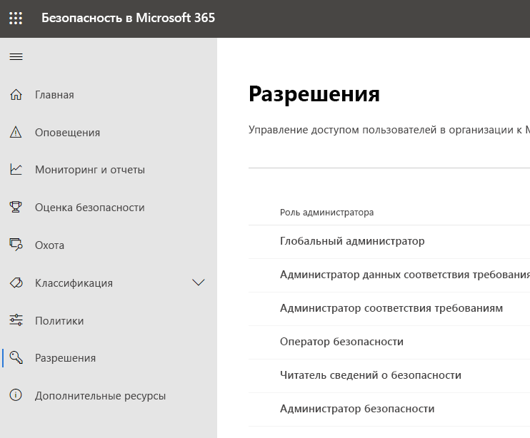
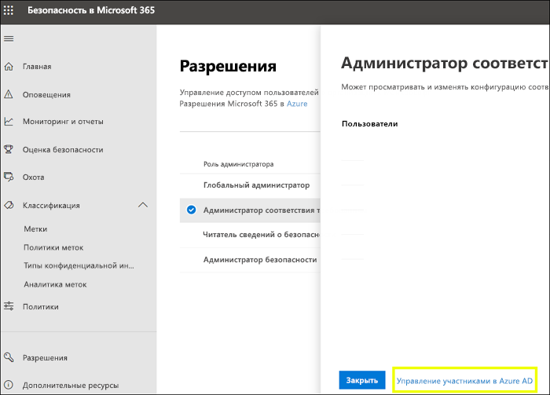
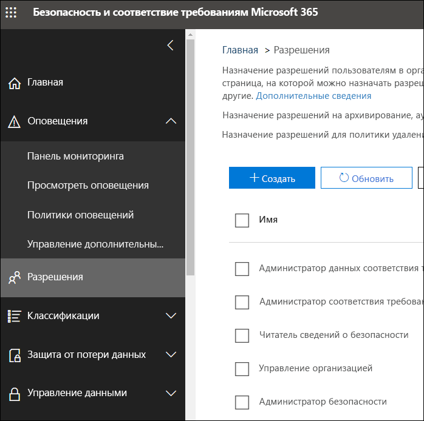

# Разрешения в Центре соответствия требованиям Microsoft 365 и Центре безопасности Microsoft 365

Вашей организации необходимо управление сценариями безопасности и соответствия требованиям, которые охватывают все службы Microsoft 365. Также должна быть возможность предоставления необходимых прав администратора соответствующим сотрудникам ИТ-отдела вашей организации. Используя Центр безопасности Microsoft 365 или Центр соответствия требованиям Microsoft 365, можно централизованно управлять разрешениями для всех задач, связанных с безопасностью и соответствием требованиям.

После того как глобальный администратор назначает роли администратора, администраторы получают доступ к функциям и данным, которые охватывают все службы в Microsoft 365, такие как Центр безопасности Microsoft 365, Центр соответствия требованиям Microsoft 365, Azure, Office 365 и Enterprise Mobility + Security.

## Что представляют собой роли в Microsoft 365

Роли, которые отображаются в Центре соответствия требованиям Microsoft 365 и Центре безопасности Microsoft 365, являются ролями Azure Active Directory. Эти роли предназначены для выполнения соответствующих должностных обязанностей в ИТ-отделе вашей организации, упрощая предоставление пользователю всех необходимых разрешений в рамках рабочих задач.

|**Роль**|**Описание**|
|:-----|:-----|
|**Глобальный администратор**|Пользователи с этой ролью имеют доступ ко всем возможностям администрирования во всех службах Microsoft 365. Только глобальные администраторы могут назначать другие административные роли.|
|**Администратор данных соответствия требованиям**|Пользователи с этой ролью могут отслеживать данные вашей организации в службах Microsoft 365, проверять, насколько они защищены, и получать данные аналитики в случае любых проблем для управления рисками.|
|**Администратор соответствия требованиям**|Пользователи с этой ролью могут помочь вашей организации соблюдать любые нормативные требования, управлять делами обнаружения электронных данных и вести политики управления данными в расположениях, удостоверениях и приложениях Microsoft 365.|
|**Оператор безопасности**|Пользователи с этой ролью могут просматривать и изучать активные угрозы безопасности пользователей Microsoft 365, устройств, работающих с этой службой, и хранящегося в ней содержимого, а также реагировать на них.|
|**Читатель безопасности**|Пользователи с этой ролью могут просматривать и изучать активные угрозы безопасности пользователей Microsoft 365, устройств, работающих с этой службой, и хранящегося в ней содержимого, но (в отличие от оператора безопасности) у них нет разрешений, чтобы реагировать на угрозы, предпринимая определенные действия.|
|**Администратор безопасности**|Пользователи с этой ролью контролируют общую безопасность вашей организации: они могут управлять политиками безопасности, просматривать аналитику и отчеты о безопасности в различных продуктах Microsoft 365, а также получать последние данные о текущем ландшафте угроз.|

## Возможности, доступные различным ролям в Microsoft 365

Ниже описаны существующие роли и возможности, которые они предоставляют.

### Глобальный администратор

Пользователи с этой ролью имеют доступ ко всем административным функциям в Azure Active Directory, а также к службам, использующим идентификаторы Azure Active Directory, например Центр безопасности Microsoft 365, Центр соответствия требованиям Microsoft 365, Exchange Online, SharePoint Online и Skype для бизнеса Online. Пользователь, зарегистрировавший клиент Azure Active Directory, становится глобальным администратором. Только глобальные администраторы могут назначать другие административные роли. В компании может быть несколько глобальных администраторов. Глобальные администраторы могут сбросить пароль любого пользователя и администратора.

### Администратор соответствия требованиям

Пользователи с этой ролью имеют разрешения на управление функциями соответствия требованиям в Центре соответствия требованиям Microsoft 365, Центре администрирования Microsoft 365, Azure и Центре безопасности и соответствия требованиям Office 365. Пользователи также могут управлять всеми функциями в Центре администрирования Exchange, Центре администрирования Teams и Skype для бизнеса и создавать запросы в службу поддержки для Azure и Microsoft 365.

|**В этой службе…**|**Возможности администратора соответствия требованиям**|
|:-----|:-----|
|[**Центр соответствия требованиям Microsoft 365**](https://compliance.microsoft.com/)|Защита данных организации во всех службах Microsoft 365 и управление ими.    Управление оповещениями по соответствию требованиям.|
|[**Диспетчер соответствия требованиям**](https://docs.microsoft.com/office365/securitycompliance/meet-data-protection-and-regulatory-reqs-using-microsoft-cloud)|Отслеживание, назначение и проверка деятельности организации на соответствие требованиям.|
|[**Центр безопасности и соответствия требованиям Office 365**](https://support.office.com/article/About-Office-365-admin-roles-da585eea-f576-4f55-a1e0-87090b6aaa9d)|Управление данными.    Выполнение юридического расследования и анализа данных.    Управление запросом субъекта данных.|
|[**Intune**](https://docs.microsoft.com/intune/role-based-access-control)|Просмотр всех данных проверки Intune.|
|[**Cloud App Security**](https://docs.microsoft.com/cloud-app-security/manage-admins)|Разрешения только для чтения; возможность управления оповещениями.    Возможность создания и изменения файловых политик, а также предоставления разрешения на управление файлом.    Возможность просмотра всех встроенных отчетов в разделе "Управление данными".|

### Администратор данных соответствия требованиям

Пользователи с этой ролью имеют разрешения на защиту и отслеживание данных в Центре соответствия требованиям Microsoft 365, Центре администрирования Microsoft 365 и Azure. Пользователи также могут управлять всеми функциями в Центре администрирования Exchange, диспетчере соответствия требованиям и Центре администрирования Teams и Skype для бизнеса, а также создавать запросы в службу поддержки для Azure и Microsoft 365.

|**В этой службе…**|**Возможности администратора данных соответствия требованиям**|
|:-----|:-----|
|[**Центр соответствия требованиям Microsoft 365**](https://compliance.microsoft.com/)|Защита данных организации во всех службах Microsoft 365 и управление ими.    Управление оповещениями по соответствию требованиям.    Управление метками конфиденциальности|
|[**Диспетчер соответствия требованиям**](https://docs.microsoft.com/office365/securitycompliance/meet-data-protection-and-regulatory-reqs-using-microsoft-cloud)|Отслеживание, назначение и проверка деятельности организации на соответствие требованиям.|
|[**Центр безопасности и соответствия требованиям Office 365**](https://support.office.com/article/About-Office-365-admin-roles-da585eea-f576-4f55-a1e0-87090b6aaa9d)|Управление данными.    Выполнение юридического расследования и анализа данных.    Управление запросом субъекта данных.    Управление метками конфиденциальности|
|[**Intune**](https://docs.microsoft.com/intune/role-based-access-control) (ожидается в ближайшее время)|Просмотр всех данных проверки Intune.|
|[**Cloud App Security**](https://docs.microsoft.com/cloud-app-security/manage-admins)|Использование разрешений только для чтения с целью просмотра информации.  Управление оповещениями.    Создание и изменение файловых политик, а также предоставление разрешения на управление файлом.    Просмотр всех встроенных отчетов в разделе "Управление данными".|

### Администратор безопасности

Пользователи с этой ролью обладают разрешениями по управлению функциями безопасности в Центре безопасности Microsoft 365, службе защиты идентификации Azure Active Directory и Центре безопасности и соответствия требованиям Office 365.

|**В этой службе…**|**Возможности администратора безопасности**|
|:-----|:-----|
|[**Центр безопасности Microsoft 365**](https://security.microsoft.com/)|Отслеживание политик, связанных с безопасностью, во всех службах Microsoft 365.     Управление угрозами безопасности и оповещениями.    Просмотр отчетов.    Управление метками конфиденциальности.|
|**Центр защиты идентификации**|Все возможности, доступные роли читателя безопасности, плюс выполнение всех операций Центра защиты идентификации, кроме сброса пролей.|
|[**Управление привилегированными пользователями (PIM)**](https://docs.microsoft.com/azure/active-directory/privileged-identity-management/pim-configure)|Все возможности, доступные роли читателя безопасности.    **Нет возможности** управления назначениями роли Azure Active Directory или ее параметрами.|
|[**Центр безопасности и соответствия требованиям Office 365**](https://support.office.com/article/About-Office-365-admin-roles-da585eea-f576-4f55-a1e0-87090b6aaa9d)|Управление политиками безопасности.    Просмотр и изучение угроз безопасности, а также реагирование на них.    Просмотр отчетов.    Управление метками конфиденциальности.|
|**Расширенная защита от угроз Azure**|Отслеживание подозрительных действий и реагирование.|
|**EDR и ATP в Защитнике Windows**|Назначение ролей.    Управление группами компьютеров.    Настройка выявления угроз в конечной точке и автоматизированного исправления.    Просмотр и изучение оповещений, а также реагирование на них.|
|[**Intune**](https://docs.microsoft.com/intune/role-based-access-control)|Просмотр сведений о пользователе, устройстве, регистрации, конфигурации и приложении.    **Нет возможности** внесения изменений в Intune.|
|[**Cloud App Security**](https://docs.microsoft.com/cloud-app-security/manage-admins)|Добавление администраторов, политик и параметров, загрузка журналов и выполнение действий системы управления.|
|[**Центр безопасности Azure**](https://docs.microsoft.com/azure/role-based-access-control/built-in-roles) (ожидается в ближайшее время)|Просмотр политик и состояний безопасности, изменение политик безопасности, просмотр и отклонение оповещений и рекомендаций.|
|[**Работоспособность службы Office 365**](https://docs.microsoft.com/office365/enterprise/view-service-health)|Просмотр состояния служб Office 365.|

### Оператор безопасности

Пользователи с этой ролью могут управлять оповещениями и имеют глобальный доступ только для чтения к функциям безопасности, включая все данные в Центре безопасности Microsoft 365, Azure Active Directory, службе защиты идентификации и Privileged Identity Management, а также могут просматривать отчеты и журналы аудита входа в Azure Active Directory и в Центре безопасности и соответствия требованиям Office 365.

|**В этой службе…**|**Возможности оператора безопасности**|
|:-----|:-----|
|[**Центр безопасности Microsoft 365**](https://security.microsoft.com/)|Все возможности, доступные роли читателя безопасности.    Просмотр и изучение оповещений системы безопасности, а также реагирование на них.|
|**Центр защиты идентификации** (ожидается в ближайшее время)|Все возможности, доступные роли читателя безопасности.|
|[**Управление привилегированными пользователями (PIM)**](https://docs.microsoft.com/azure/active-directory/privileged-identity-management/pim-configure)|Все возможности, доступные роли читателя безопасности.|
|[**Центр безопасности и соответствия требованиям Office 365**](https://support.office.com/article/About-Office-365-admin-roles-da585eea-f576-4f55-a1e0-87090b6aaa9d)|Все возможности, доступные роли читателя безопасности.    Просмотр и изучение угроз безопасности, а также реагирование на них.|
|**EDR и ATP в Защитнике Windows**|Все возможности, доступные роли читателя безопасности.    Просмотр и изучение оповещений, а также реагирование на них.|
|[**Intune**](https://docs.microsoft.com/intune/role-based-access-control)|Просмотр сведений о пользователе, устройстве, регистрации, конфигурации и приложении.    **Нет возможности** внесения изменений в Intune.|
|[**Cloud App Security**](https://docs.microsoft.com/cloud-app-security/manage-admins)|Все возможности, доступные роли читателя безопасности, плюс просмотр и отклонение оповещений.|
|[**Работоспособность службы Office 365**](https://docs.microsoft.com/office365/enterprise/view-service-health)|Просмотр состояния служб Office 365.|

### Читатель безопасности

Пользователи с этой ролью имеют глобальный доступ только для чтения к функциям безопасности, включая все данные в Центре безопасности Microsoft 365, Azure Active Directory, службе защиты идентификации и Privileged Identity Management, а также могут просматривать отчеты и журналы аудита входа в Azure Active Directory и в Центре безопасности и соответствия требованиям Office 365.

|**В этой службе…**|**Возможности читателя сведений о безопасности**|
|:-----|:-----|
|[**Центр безопасности Microsoft 365**](https://security.microsoft.com/)|Просмотр политик, связанных с безопасностью, во всех службах Microsoft 365.    Просмотр угроз безопасности и оповещений.    Просмотр отчетов.|
|**Центр защиты идентификации**|Чтение всех отчетов безопасности и сведений о параметрах функций безопасности: защита от спама, шифрование, защита от потери данных (DLP), защита от вредоносных программ, расширенная защита от фишинга и правила обработки почты (также называемые правилами транспорта).|
|[**Управление привилегированными пользователями (PIM)**](https://docs.microsoft.com/azure/active-directory/privileged-identity-management/pim-configure)|Использует доступ только для чтения для просмотра всех сведений, отображаемых в службе управления привилегированными пользователями (PIM) Azure Active Directory: политик и отчетов для назначения ролей Azure Active Directory, проверок безопасности, а в будущем также данных политик и отчетов, относящихся к сценариям, помимо назначения ролей Azure Active Directory.    **Нет возможности** регистрироваться в службе управления привилегированными пользователями Azure Active Directory или вносить в нее какие-либо изменения. Используя портал службы управления привилегированными пользователями или PowerShell, кто-то в этой роли может активировать дополнительные роли (например, глобальный администратор или администратор привилегированных ролей), если пользователь является допустимым.|
|[**Центр безопасности и соответствия требованиям Office 365**](https://support.office.com/article/About-Office-365-admin-roles-da585eea-f576-4f55-a1e0-87090b6aaa9d)|Просмотр политик безопасности.    Просмотр и изучение угроз безопасности.    Просмотр отчетов.|
|**EDR и ATP в Защитнике Windows**|Просмотр и изучение оповещений.|
|[**Intune**](https://docs.microsoft.com/intune/role-based-access-control)|Просмотр сведений о пользователе, устройстве, регистрации, конфигурации и приложении.    **Нет возможности** внесения изменений в Intune.|
|[**Cloud App Security**](https://docs.microsoft.com/cloud-app-security/manage-admins)|Использование разрешений только для чтения с целью просмотра информации.    Управление оповещениями.|
|[**Центр безопасности Azure**](https://docs.microsoft.com/azure/role-based-access-control/built-in-roles)|Просмотр рекомендаций и оповещений.    Просмотр политик безопасности.    Просмотр состояний безопасности, но без внесения изменений.|
|[**Работоспособность службы Office 365**](https://docs.microsoft.com/office365/enterprise/view-service-health)|Просмотр состояния служб Office 365.|

## Глобальный администратор может управлять ролями в Azure Active Directory.

В Центре безопасности Microsoft 365 и Центре соответствия требованиям Microsoft 365 при выборе роли можно просмотреть ее назначения. Однако чтобы управлять этими назначениями, нужно перейти в Azure Active Directory.

Дополнительные сведения см. в статье [Просмотр и назначение ролей администратора в Azure Active Directory](https://docs.microsoft.com/azure/active-directory/users-groups-roles/directory-manage-roles-portal).

## Управление ролями в службе, вместо Azure Active Directory

Роли, которые отображаются в Центре соответствия требованиям Microsoft 365 и Центре безопасности Microsoft 365, также отображаются в службах, где для них имеются разрешения. Например их можно увидеть в Центре безопасности и соответствия требованиям Office 365.

### Прерывание наследования

Важно понимать, что когда выполняется управление этими ролями в Azure Active Directory, оно выполняется централизованно для **всех** служб Microsoft 365. Тем не менее, если вы управляете ролью в определенной службе, например в Центре безопасности и соответствия требованиям Office 365, вы управляете ролью **только** для такой отдельной службы. Назначения и разрешения для роли в службе переопределяют любые разрешения, предоставленные роли Azure Active Directory.

Это может быть полезно — например, если пользователю назначена роль администратора безопасности, у него не будет разрешений на управление инцидентами. Но вы можете использовать разрешения в службе Advanced Threat Protection в Защитнике Windows для предоставления специального разрешения на управление инцидентами конкретно в этой службе.

## Где найти сведения о ролях для каждой службы Microsoft 365?

Назначив пользователю одну из ролей администратора в Центре соответствия требованиям или Центре безопасности Microsoft 365, вы предоставляете разрешения для ряда служб Microsoft 365. Используйте ссылки ниже для поиска дополнительных сведений об определенных разрешениях ролей для каждой службы.

|**Служба Microsoft 365**|**Сведения о роли**|
|:-----|:-----|
|Роли администратора в бизнес-планах Office 365 и Microsoft 365|[Роли администратора в Office 365](https://docs.microsoft.com/office365/admin/add-users/about-admin-roles?view=o365-worldwide)|
|Azure Active Directory (Azure AD) и защита идентификации Azure Active Directory|[Роли администратора в Azure Active Directory](https://docs.microsoft.com/azure/active-directory/users-groups-roles/directory-assign-admin-roles)|
|Расширенная защита от угроз Azure|[Группы ролей Azure ATP](https://docs.microsoft.com/azure-advanced-threat-protection/atp-role-groups)|
|Azure Information Protection|[Роли администратора в Azure Active Directory](https://docs.microsoft.com/azure/active-directory/users-groups-roles/directory-assign-admin-roles)|
|Диспетчер соответствия требованиям|[Роли диспетчера соответствия требованиям](https://docs.microsoft.com/office365/securitycompliance/meet-data-protection-and-regulatory-reqs-using-microsoft-cloud#permissions-and-role-based-access-control)|
|Exchange Online|[Управлении доступом на основе ролей в Exchange](https://docs.microsoft.com/exchange/understanding-role-based-access-control-exchange-2013-help)|
|Intune|[Управление доступом на основе ролей в Intune](https://docs.microsoft.com/intune/role-based-access-control)|
|Управляемые компьютеры|[Роли администратора в Azure Active Directory](https://docs.microsoft.com/azure/active-directory/users-groups-roles/directory-assign-admin-roles)|
|Microsoft Cloud App Security|[Управление доступом на основе ролей](https://docs.microsoft.com/cloud-app-security/manage-admins)|
|Центр безопасности и соответствия требованиям Office 365|[Роли администратора в Office 365](https://docs.microsoft.com/office365/SecurityCompliance/permissions-in-the-security-and-compliance-center)|
|Управление привилегированными пользователями|[Роли администратора в Azure Active Directory](https://docs.microsoft.com/azure/active-directory/users-groups-roles/directory-assign-admin-roles)|
|Оценка безопасности|[Роли администратора в Azure Active Directory](https://docs.microsoft.com/azure/active-directory/users-groups-roles/directory-assign-admin-roles)|
|SharePoint Online|[Роли администратора в Azure Active Directory](https://docs.microsoft.com/azure/active-directory/users-groups-roles/directory-assign-admin-roles)    [Сведения о роли администратора SharePoint в Office 365](https://docs.microsoft.com/sharepoint/sharepoint-admin-role)|
|Teams и Skype для бизнеса|[Роли администратора в Azure Active Directory](https://docs.microsoft.com/azure/active-directory/users-groups-roles/directory-assign-admin-roles)|
|Advanced Threat Protection в Защитнике Windows|[Управление доступом на основе ролей в ATP в Защитнике Windows](https://docs.microsoft.com/windows/security/threat-protection/windows-defender-atp/rbac-windows-defender-advanced-threat-protection)|

## Ожидается в ближайшее время

Разрешения в Центре соответствия требованиям Microsoft 365 и Центре безопасности Microsoft 365 находятся в процессе разработки. Например в настоящее время мы работаем над поддержкой возможностей для:

- управления ролями в Центре соответствия требованиям Microsoft 365 и Центре безопасности Microsoft 365 без перехода в Azure Active Directory;

- настройки ролей путем добавления или удаления определенных разрешений;

- создания настраиваемых ролей с разрешениями на выбор.
