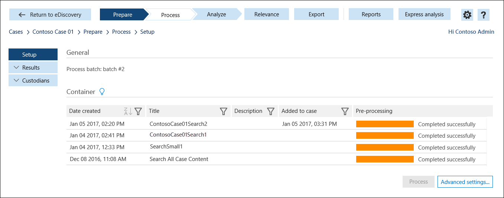

# Подготовка результатов поиска для анализа в Office 365 Advanced eDiscovery

После поиска, связанной с вариантом eDiscovery безопасности Office 365 &amp; успешного запуска центре соответствия требованиям, можно подготовить результаты поиска для дальнейшего анализа с Office 365 расширенного eDiscovery, позволяет анализировать большие, неструктурированных данных задается и сокращения объема данных, который относится к юридическим дела. Расширенные eDiscovery функции:
  
- **Распознавание текста** -при подготовке результатов поиска для расширенной eDiscovery, функциональные возможности оптического распознавания символов (OCR) автоматически извлекает текст из изображения и включает в себя это с результатами поиска, которые были загружены в Расширенные обнаружения электронных данных для анализа. Распознавание текста поддерживается для свободные файлы, вложения электронной почты и внедренные изображения. Это позволяет применять функций анализа текста из расширенных обнаружения электронных данных (рядом с дубликаты, threading электронной почты, темы и упреждающий написания кода) для текстового контента в файлы изображений. 
    
- **Обнаружение почти повторяющиеся** - позволяет более эффективно структурировать просмотра данных, один пользователь просматривает группой похожих документов. Это позволяет предотвратить нескольких рецензентов с для просмотра различных версий одного документа. 
    
- **Threading электронной почты** - поможет вам определить уникальный сообщения в поток электронной почты, поэтому можно сосредоточиться на новых содержание каждого сообщения. В потоке электронной почты второго сообщение содержит первого сообщения. Аналогичным образом более поздней версии сообщения содержат все предыдущие сообщения. Работа с потоками электронной почты устраняет необходимость в просмотрите каждого сообщения целиком в потоке электронной почты. 
    
- **Темы** - помогут ценных сведений о переносимых данных за пределы только что статистику по ключевым словам поиска. Темы, посвященные расследований Группировка связанные документы, чтобы вы могли просматривать документы в контексте. При использовании темы, можно просмотреть связанные темы для набора документов, определение любого перекрытия и затем определите поперечное связанных данных. 
    
- **Создание кода Predictive** - позволяет обучение пользователей системы на то, что вы ищете, позволяя решения (о ли что-то уместно, или нет) на небольшой набор документов. Расширенные eDiscovery применяется, обучения (на основании вашего рекомендации) при анализе все документы в наборе данных. Расширенные обнаружения электронных данных на основании этого обучения, предоставляет ранжирования релевантности, чтобы выбрать, какие документы для просмотра на основании какой документ, скорее всего релевантным в рамках данного экземпляра. 
    
- **Экспорт данных для просмотра приложений** - можно экспортировать данные из дополнительных обнаружения электронных данных и Office 365 после завершения анализа и сокращение набора данных. Пакет экспорта включает в себя CSV-файл, содержащий свойства из экспортированного контента и анализа метаданных. Этот пакет экспорта можно импортировать в приложение Обзор обнаружения электронных данных. 
    
## Перед началом работы

- Для анализа данных с помощью расширенных eDiscovery, пользователя (custodian данные) должны быть назначены лицензии Office 365 E5 пользователя. Кроме того пользователи, имеющие лицензию на Office 365 E1 или E3 может быть назначен расширенной eDiscovery отдельная лицензия. Администраторы и контролеры, назначенных для случаев и использовать расширенные обнаружения электронных данных для анализа данных, не требуется лицензия на E5. 
    
- Необходимо быть диспетчеру eDiscovery или eDiscovery администратор безопасности Office 365 &amp; центре соответствия требованиям для подготовки результатов поиска для расширенной обнаружения электронных данных. Диспетчеру eDiscovery, является участником группы обнаружения электронных данных диспетчера ролей. EDiscovery администратор также участника группы ролей диспетчер обнаружения электронных данных, но назначены дополнительных eDiscovery привилегии. За инструкциями о назначении разрешений администратора eDiscovery содержатся шаг 1 в [вариантах eDiscovery в Office 365 безопасности & центре соответствия требованиям](ediscovery-cases.md#step-1-assign-ediscovery-permissions-to-potential-case-members).
    
## Шаг 1: Подготовьте результаты расширенной обнаружения электронных данных поиска

Можно подготовить результаты поиска, связанной с вариантом eDiscovery. При подготовке результатов поиска для расширенной eDiscovery данные загружаться и временно хранятся в уникальные области хранилища Windows Azure в облаке Майкрософт. На этом этапе это, что функциональные возможности оптического распознавания символов извлекает текст из изображения в результатах поиска. В [шаге 2](#step-2-add-the-search-results-data-to-the-case-in-advanced-ediscovery), этот текст и другие поиска данных результатов будет загружен в case в расширенной обнаружения электронных данных.
  
1. В разделе Безопасность &amp; центре соответствия требованиям, нажмите кнопку **поиска &amp; расследования** \> **обнаружения электронных данных** для отображения списка случаев в вашей организации. 
    
2. Рядом с пунктом обращение, которое требуется подготовить результатов поиска для анализа в расширенной обнаружения электронных данных, нажмите кнопку **Открыть** . 
    
3. На **домашней** странице для случая нажмите кнопку **поиска**и выберите поиск.
    
4. В области сведений в разделе **Анализ результатов с помощью расширенных обнаружения электронных данных**, щелкните **подготовить результаты для анализа**.
    
    > [!NOTE]
    > Если результаты поиска созданы более семи дней назад, вам будет предложено обновить их. 
  
5. На странице **Подготовка результатов для анализа** выполните следующие действия.  
    
    - Выберите для подготовки индексированных элементов, индексированные и неиндексированные элементы или только неиндексированные элементы для анализа в расширенной обнаружения электронных данных.
    
    - Выберите, следует ли включать все версии документы в SharePoint, которое удовлетворении условий поиска. Этот параметр доступен только в том случае, если источников контента для поиска включает сайты.
    
    - Укажите, должно ли сообщение уведомления отправляются (или скопировать) другому человеку после завершения процесса подготовки и данных готова для обработки в расширенной обнаружения электронных данных.
    
6. Нажмите кнопку **Подготовка**.
    
    Результаты поиска готовы для анализа с расширенной обнаружения электронных данных.
    
7. В области сведений нажмите кнопку **проверить состояние подготовки** для отображения сведений о процесс подготовки. После завершения подготовки можно перейти к варианту в расширенной обнаружения электронных данных для обработки данных для анализа. 
    
## Шаг 2: Добавление данных результатов поиска в рамках данного экземпляра в расширенной обнаружения электронных данных

После завершения подготовки следующим шагом является перейдите к расширенной обнаружения электронных данных и загрузка данных результатов поиска (который были загружены в области хранилища Azure в облаке Майкрософт) в рамках данного экземпляра в расширенной обнаружения электронных данных. Как уже описано, для доступа к расширенных обнаружения электронных данных, необходимо быть eDiscovery администратор безопасности &amp; центре соответствия требованиям или администратора в расширенной обнаружения электронных данных.
  
> [!NOTE]
> Время, необходимое для данных из системы &amp; центре соответствия требованиям, чтобы оно было доступно для добавления к варианту в расширенной обнаружения электронных данных, может изменяться в зависимости от размера результаты поиска обнаружения электронных данных. 
  
1. В разделе Безопасность &amp; центре соответствия требованиям, нажмите кнопку **поиска &amp; расследования** \> **обнаружения электронных данных** для отображения списка случаев в вашей организации. 
    
2. Рядом с пунктом регистр, которую требуется загрузка данных в в расширенной обнаружения электронных данных, нажмите кнопку **Открыть** . 
    
3. На **домашней** странице для случая нажмите кнопку **Дополнительно обнаружения электронных данных**. 
    
    
  
    Отображается индикатор **подключения к расширенной обнаружения электронных данных** . При подключении к расширенной обнаружения электронных данных на странице Настройка для случая отображается список контейнеров. 
    
    
  
     Эти контейнеры представляют результаты поиска, подготовленного для анализа в расширенной обнаружения электронных данных на шаге 1. Обратите внимание, что имя контейнера совпадает с именем поиска в случае в системы &amp; центре соответствия требованиям. Контейнеры в списке являются из них подготовленные. Если другой пользователь подготовлено результатов поиска для расширенной обнаружения электронных данных, соответствующих контейнеров не включены в список. 
    
4. Для загрузки данных результатов поиска из контейнера в к варианту в расширенной eDiscovery, выберите контейнер и нажмите кнопку **процесса**.
    
## Дальнейшие действия

После результаты eDiscovery поиска добавляются в случае следующим шагом является использование средств расширенной обнаружения электронных данных для анализа данных и определите контент, реагировать на конкретном случае юридических. Для получения сведений об использовании расширенных eDiscovery видеть [Office 365 расширенного обнаружения электронных данных](office-365-advanced-ediscovery.md).
  
## Дополнительные сведения

Любой шифрования RMS сообщений, которые включаются в результаты поиска будут расшифрованы при подготовке для анализа в расширенной обнаружения электронных данных. Эта возможность расшифровки включен по умолчанию для членов группы обнаружения электронных данных диспетчера ролей. Это роль управления расшифровки RMS назначается этой группе ролей. Помните следующее помните о Расшифровка сообщений электронной почты.
  
- На данный момент эта возможность расшифровки сюда не включены зашифрованное содержимое из SharePoint и OneDrive для бизнеса сайтов. Только сообщения электронной почты службы управления правами зашифрованных будут расшифрованы, при экспорте их.
    
- Если сообщение электронной почты службы управления правами зашифрованных вложений (например, документа или другое сообщение электронной почты), который также шифрования, будут расшифрованы, только сообщения электронной почты верхнего уровня.
    
- Если требуется запретить другим Расшифровка сообщений, зашифрованных RMS при подготовке результатов поиска для анализа в расширенной обнаружения электронных данных, необходимо создать пользовательскую группу ролей (, скопировав встроенные группы ролей диспетчер обнаружения электронных данных), а затем удалить службы управления правами Расшифровки роль управления в пользовательскую группу ролей. Затем добавьте человека, который требуется для расшифровки сообщения как член группы настраиваемых ролей.
