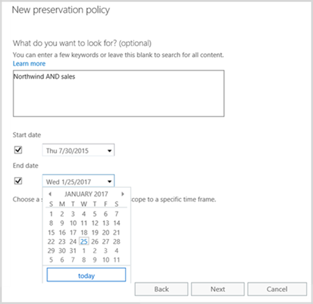

# Обзор политик сохранения

> [!IMPORTANT]
> При использовании политики хранения, политики автоматически преобразуется в политику хранения, — это новая возможность, которая выполняет политики хранения и многое другое. Политики хранения будет продолжать работать и сохранять содержимое без необходимости изменения от вас. Эти политики можно найти на странице **удержания** в безопасности &amp; центре соответствия требованиям. Дополнительные сведения можно [что случилось с политиками хранения?](retention-policies.md#what-happened-to-preservation-policies)
  
Для соответствия законодательным нормам или внутренних политик, организациям необходимо сохранять содержимое в течение определенного периода времени. С политикой хранения в Office 365 можно сохранить содержимое на сайтах, почтовые ящики и общие папки неограниченное время или в течение определенного периода времени. Также можно фильтровать контент, который будет сохранен, передав ключевые слова или диапазон дат, чтобы сузить результаты.
  
Например можно сохранить содержимое в определенных почтовых ящиков и сайты, относящегося к отдела продаж семь лет и сокращения область политики с сообщением о том, что необходимо сохранить только содержимое из двух лет назад, который содержит определенный Имя клиента.
  
Когда содержимое может быть политики хранения, людей можно продолжить редактирование и работы с содержимым, как если ничего не изменилось, так как содержимое сохраняется на месте в его исходное расположение. Однако если кто-то редактирование или удаление контента, который зависит от политики, копия сохраняется в безопасное место, где он сохраняется, пока действует политика.
  
И, наконец в некоторых организациях может потребоваться соблюдать правила, определенные с нормативными текст сообщений, таких как правило комиссии по бирже по ценным бумагам and (сек) 17a-4, что требует, что после включения политики хранения не может отключить или выполненных меньше ограничений. Для выполнения этого условия, можно использовать сохранение блокировки. После элемента блокировки политики, ни один — включая администратора, можно отключить политику или сделать его меньше ограничений.
  
Создание и управление политиками хранения на странице удержания в Office 365 безопасность &amp; центре соответствия требованиям.
  

  
> [!NOTE]
> Чтобы включить почтовый ящик Exchange Online в политику хранения, почтовый ящик должна быть назначена лицензия на Exchange Online (план 2). Если почтовый ящик назначена лицензия на Exchange Online план 1, необходимо назначить его отдельная лицензия архивации Exchange Online для включения в политику хранения. 
  
## Что делает политика сохранения с содержимым на месте

При включении сайта, почтовых ящиков или общих папок в политики хранения контента остается в его исходное расположение. Людей можно продолжать работать с их документы или почты, но копии контента, как оно существовало во время инициировал политики сохраняется. Для сайтов содержимого сохраняются в библиотеке удержания хранения. для почтовых ящиков и общих папок этого содержимого сохраняются в папке элементов для восстановления. Эти надежном месте и сохраненного контента невидимы для большинства пользователей. С политикой хранения людей не еще нужно знать, что их содержимое может быть политики.
  

  
### Контент веб-сайта

Политика хранения применяется на уровне сайта. При включении сайта в политике хранения, удерживайте архивная библиотека создается, если он еще не создан. Большинство пользователи не могут просматривать библиотеки удержания хранения, так как этот номер виден только владельцам семейства веб-сайтов.
  
Если пользователь пытается изменения или удаления контента на сайте, который зависит от политики хранения, сначала политики проверяет, ли содержимое элемента были изменены с момента применения политики. Если это первый изменения с момента применения политики хранения, политики копирует содержимое в библиотеке удержания хранения и затем позволяет человека, который требуется изменить или удалить исходное содержимое. Обратите внимание, что все содержимое узла могут быть скопированы в библиотеку удержания хранения, даже если содержимое не соответствует фильтру запрос, используемый политикой хранения.
  
Затем архивная библиотека будет очищена заданием таймера. Задание таймера выполняется периодически. При этом сравнивается все содержимое архивной библиотеки с фильтрами, которые используются политикой сохранения на сайте. Пока контент не будет соответствовать хотя бы одному из фильтров, задание таймера будет окончательно удалять его из архивной библиотеки.
  
Старый применяется к содержимому, существует ли после применения политики хранения. Кроме того любой новый контент, который создал или добавляются на сайт после оно было включено в политике будут сохранены после удаления. Тем не менее новое содержимое не копируется библиотека первый время удержания хранения, когда изменен, только в том случае, когда она удаляется. Чтобы сохранить версии для всех файлов, необходимо включить управление версиями — к разделу, посвященному более поздней версии на управление версиями.
  
### Содержимое почтового ящика и общедоступной папки

Политика сохранения почты и других элементов пользователя применяется на уровне почтового ящика. Политика сохранения общедоступной папки применяется на уровне папки, а не на уровне почтового ящика. Элементы почтового ящика и общедоступной папки хранятся в папке "Элементы с возможностью восстановления". Только пользователи, которым назначены разрешения на обнаружение электронных данных, могут просматривать папки "Элементы с возможностью восстановления" других пользователей.  
  
По умолчанию когда пользователь удаляет сообщение из папки кроме папки «Удаленные» сообщение перемещается для папки «Удаленные». Если пользователь удаляет элемент из папки «Удаленные», сообщение перемещено в папку элементов для восстановления и исчезает из виду пользователя. Кроме того другим Мягкая можно удалить элемент (SHIFT + DELETE) в любой папке, которая обходит папки «Удаленные» и размещает элемент непосредственно в папке элементов для восстановления.
  
Если для почтового ящика включена политика сохранения, удаляемые элементы перемещаются в папку DiscoveryHold, которая находится в папке "Элементы с возможностью восстановления". Помощник по обслуживанию почтового ящика периодически просматривает его, оценивая сообщения в этой папке. Если содержимое не соответствует ни одному из фильтров политики сохранения, помощник окончательно удаляет его из папки "Элементы с возможностью восстановления".
  
Папка элементов для восстановления также содержит папку версий. При попытке пользователя изменить некоторые свойства элемента почтового ящика, такие как темы, body, вложения, отправителей и получателей, или Дата отправки или получения для сообщения — сохранения копии исходного элемента в папку версий перед сохранением изменений. Это происходит для каждого последующего изменения. После удаления политики хранения копий в папку версий будут удалены помощником почтовых ящиков.
  
### Где хранится политика сохранения

При создании политики хранения, его хранятся централизованно в системы &amp; центре соответствия требованиям и затем развертывается на разные источники контента, которые включены политики, таких как сайты, почтовых ящиков и общих папок.
  
После применения политики сохранения к этим источникам содержимого она работает точно так же, как хранение на месте при обнаружении электронных данных. Дополнительные сведения об удержаниях на месте см. в статьях:
  
- [Обзор обнаружения электронных данных и в месте хранения](https://go.microsoft.com/fwlink/p/?LinkID=404352) (SharePoint Online) 
    
- [На месте удержания и хранение для судебного разбирательства](https://go.microsoft.com/fwlink/p/?LinkID=404353) (Exchange Online) 
    
- [Папка элементов для восстановления](https://go.microsoft.com/fwlink/p/?LinkID=404354) (Exchange Online) 
    
### Политики хранения и удержание электронных данных

Хотя верно, что обе эти возможности хранения содержимого, эти возможности не следует путать так как они могут использоваться в различных целей:
  
- **Если необходимо сохранить содержимое как часть является обязательным требованием хранения с помощью политики хранения.** Например если требуется сохранить содержимое семь лет как часть плана хранения, используйте политики хранения. Политики хранения можно сохранять содержимое для конкретного периода времени, а в конце этого периода времени, содержимое автоматически отправлено из политики. Также можно блокировать политики, чтобы никто не может отключить политику или сделать меньше ограничений. Удержание электронных данных может быть заблокирован и укажите период времени. Кроме того политики хранения часто длительностью годы, во время удержания eDiscovery временные и обычно длится только длительность юридических обращения. 
    
    Кроме того можно создать политику хранения без дополнительные действия, что может потребоваться обнаружения электронных данных, таких как создание случаев, добавлении членов, или выполнив содержимого выполняется поиск.
    
- **Для хранения содержимого в составе является обязательным требованием юридическим и обнаружения электронных данных, используйте хранение электронных данных.** Например для хранения содержимого в определенные расположения в юридических запросе, используйте удержание электронных данных. Возможности обнаружения электронных данных контента, относящегося к обращению обычно конфиденциальной или привилегированной, поэтому различных случаях можно ограничить различные элементы. Кроме того обнаружения электронных данных поддерживает контента поиска, можно сохранить, предварительного просмотра, анализ с помощью расширенных eDiscovery или экспорта результатов. 
    
    В отличие от политики хранения удержание электронных данных нельзя задать период времени - удержание электронных данных в силу только после его отключить или удалить его. Кроме того хранение электронных данных не может быть заблокирован.
    
## Что политика сохранения делает с версиями документов на сайте

Политики хранения не автоматически сохраняет все версии документа на сайте. Для этого необходимо включить управление версиями для библиотеки документов на сайте. Для получения дополнительных сведений см. [Включение и настройка управления версиями для списка или библиотеки](https://go.microsoft.com/fwlink/p/?LinkID=404350).
  
Если документ удален с сайта, который является сохранение, а для библиотеки включено управление версиями документов, сохраняются все версии удаленного документа. 
  
Если элемент не может быть несколько политик хранения не включено управление версиями документов, версию, которая сохраняется как тот момент каждой политики хранения вступает в силу. Например если версии 27 элемента последнего при сайта сохраняется первого времени и версии 51 равно самыми последними при сайта сохраняется еще раз, версии 27 и 51, сохраняются.
  
## Фильтрация политики сохранения

Вы можете сузить условия для содержимого, к которому необходимо применять политику сохранения, добавив в нее ключевые слова или диапазон дат. 
  

  
### Фильтрация с помощью ключевых слов

Политика хранения поддерживает ключевое слово Query Language (KQL). Например, можно использовать основные операторы like и и или, и можно выполнить поиск близости которых «marketing NEAR(30) wingtip» определяет результаты где «wingtip» — в пределах 30 символов «маркетинг». Ключевое слово запроса поможет вам определить и сохранить только что соответствующий контент.
  
### Фильтрация с помощью диапазона дат

Можно также применять фильтры к политике таким образом, чтобы сохранялось только содержимое в пределах указанного диапазона дат. Для сообщений дата относится к дате получения, а для документов и веб-сайтов — к дате изменения. Это значит, что можно сохранить контент, включающий полученную почту и измененные документы в пределах указанного диапазона или до или после даты начала или даты окончания.
  
## Сохранение содержимого в течение определенного периода времени

Благодаря политике сохранения можно хранить содержимое бесконечно или в течение определенного количества дней, месяцев или лет. Обратите внимание на то, что период хранения содержимого рассчитывается с учетом возраста содержимого, а не времени с момента создания политики сохранения. 
  
Например если вы хотите сохранить контента на сайте семь лет и документов в этот сайт не был изменен в шесть лет, документа будут сохранены только другой года, если они не были изменены. Если редактирование документа выполняется еще раз, вычисления срока документа из новых даты последнего изменения, и он будет сохранен еще семь лет.
  
Подобным образом, если требуется сохранять содержимое в почтовом ящике в течение семи лет, при этом сообщение было отправлено шесть лет назад, то сообщение будет сохраняться еще только один год, если не изменить дату получения. В этом случае новая версия сообщения в том виде, в котором она существовала до изменений, сохраняется в папке элементов, подлежащих восстановлению, а отсчет возраста сообщения начинается с новой даты получения, при этом это сообщение будет сохраняться еще семь лет.
  

  
## Блокировка политики сохранения

Некоторым организациям может потребоваться соблюдать правила, определенные с нормативными текст сообщений, таких как правило комиссии по бирже по ценным бумагам and (сек) 17a-4, что требует, что после включения политики хранения не может отключить или выполненных меньше ограничений. С хранением блокировки, можно ограничить политику так что — включая администратора, можно отключить политику или сделать его меньше ограничений.
  
После блокировки политику абонента, никто можно отключить его или удаление содержимого из политики. И невозможно для изменения или удаления содержимого, которое может быть политики в течение периода хранения. После блокировки политики абонента, только способами, можно изменить политику хранения, путем добавления содержимого или расширение его длительность. Заблокированные политики можно увеличить или расширенный, но сокращенный или отключена.
  
Таким образом прежде чем заблокировать политику хранения, очень важно, что вы понимаете требования соответствия требованиям вашей организации, а не блокировать политику, пока вы уверены, что это, что вам нужно.
  

  
## Отключение политики хранения

Если выбран не для блокировки политики хранения, его можно открыть в любое время, в том числе до окончания периода времени, заданного в политике. Чтобы сделать это, просто отключите политику.
  

  
Тем не менее нельзя удалить политику хранения, пока политики остаются активными. Чтобы удалить политику хранения, сначала отключить и затем удалите ее.
  
После отключения политики сохранения всех элементов, относящихся к этой политики в библиотеке удержание хранения или папки восстанавливаемых элементов могут быть использованы для процесса очистки standard, описанными ранее. Обратите внимание на то, что это означает, что элементы, выпущенные из политики не удаляются сразу же; Вместо этого они остаются в удержание хранения библиотеки или папки элементов для восстановления, пока процесс периодически очищает библиотеку или папку.
  
## Использование политик сохранения вместе с политиками хранения и удаления документов

Политика сохранения позволяет сохранять содержимое бесконечно или в течение определенного периода времени, в то время как политика хранения для почтового ящика и политика удаления документов для веб-сайта обеспечивает удаление содержимого после указанного периода времени. Если необходимо сохранять содержимое в течение фиксированного периода времени, можно использовать политику сохранения в сочетании с политикой хранения или удаления. 
  
### Контент веб-сайта

Для веб-сайта можно использовать политику сохранения в сочетании с политикой удаления документов. Например, можно назначить для документов сохранение на пять лет после их изменения, а затем установить политику удаления, чтобы удалить их через пять лет после внесения последних изменений.
  
Если политики удаления документов удаляет содержимого, которое может быть политики хранения, содержимое по-прежнему будут сохранены в библиотеке удержания хранения. К примеру Если политика хранения сохраняет содержимое двух лет, но политики удаления документов удаляет содержимое через один год, любое содержимое, которое будет удален по-прежнему сохраняются. Для получения дополнительных сведений см [политики удаления документов](https://support.office.com/article/55e8d858-f278-482b-a198-2e62d6a2e6e5).
  
### Контент почтового ящика

Для почтового ящика можно объединить политики хранения с политикой хранения, которое содержит тег политики по умолчанию одного. Например вы сохраняются элементы почтовых ящиков семь лет и затем настроить политику хранения для удаления их семь лет после их полученных (для сообщений) или (для элементов, не отправляются как примечания). Политики хранения гарантирует, что элементы, которые будут удалены сохраняются для по крайней мере указанного длительность, в то время как политика хранения гарантирует, что в конце этого периода времени, удаляются элементы почтового ящика. Для получения дополнительных сведений см [тегов хранения и политики хранения](https://go.microsoft.com/fwlink/p/?LinkID=404351).
  
## Разрешения

Члены группы соответствия требованиям, которые будут использовать безопасности &amp; центре соответствия требованиям для создания политики хранения для требуются разрешения:
  
-  Безопасность Office 365 &amp; центре соответствия требованиям 
    
- сайтам, содержимое которых необходимо сохранить;
    
- почтовым ящикам, содержимое которых необходимо сохранить.
    
### Безопасность Office 365 &amp; центре соответствия требованиям

Как администратор клиента, необходимо иметь возможность предоставить контролеры и другим пользователям доступа к безопасности &amp; центре соответствия требованиям, без предоставления все необходимые разрешения администратора клиента. Дополнительные сведения можно [разрешения безопасности Office 365 &amp; центре соответствия требованиям](permissions-in-the-security-and-compliance-center.md).
  
### Сайты

Членам группы по обеспечению соответствия требованиям, которые создают политики сохранения, необходимы разрешения для соответствующих семейств веб-сайтов. Кроме того, если ответственные за обеспечение соответствия требованиям также создают политики удаления документов, им необходимы разрешения для семейства веб-сайтов Центра политики соответствия, где создаются и хранятся политики удаления документов. Рекомендации
  
1. Создание группы безопасности, которая содержит всех пользователей в центре соответствия требованиям политики, вероятнее всего ваша группа Управление политиками соответствия требованиям. [Группы безопасности Manage Mail-Enabled](https://go.microsoft.com/fwlink/p/?LinkID=404345) более подробные сведения. 
    
2. Добавьте в группу безопасности в центре соответствия требованиям политики группы владельцев семейства сайтов. Для получения дополнительных сведений см [разрешения для администраторов семейства сайтов](https://go.microsoft.com/fwlink/p/?LinkID=404346) . 
    
3. В каждом семействе веб-сайтов, для которого необходимо назначить политики сохранения, добавьте группу безопасности к группе посетителей семейства веб-сайтов (разрешения на чтение).
    
### Почтовые ящики и общедоступные папки

Чтобы применить политику сохранения к почтовому ящику, сотрудник, ответственный за соответствие требованиям, должен иметь хотя бы разрешения на чтение для этого почтового ящика. 
  
Чтобы применить политику сохранения к общедоступной папке, ответственным за обеспечение соответствия требованиям необходимы по крайней мере разрешения на чтение для всех общедоступных папок.
  

