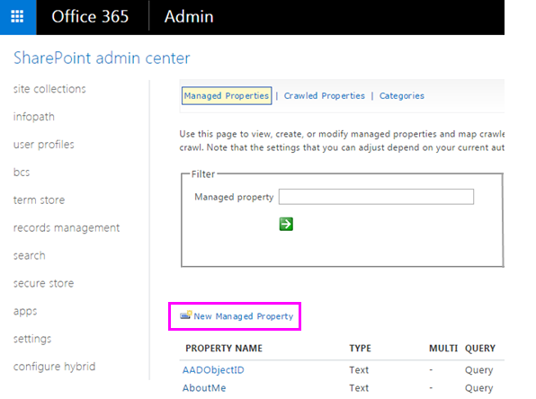

# <a name="create-a-dlp-policy-to-protect-documents-with-fci-or-other-properties"></a>Создание политики защиты от потери данных для защиты документов с помощью FCI или других свойств

В Office 365 вы можете использовать политику защиты от потери данных (DLP) для определения, отслеживания и защиты конфиденциальной информации. Во многих организациях уже есть процесс идентификации и классификации конфиденциальной информации с помощью свойств классификации в инфраструктуре классификации файлов Windows Server (FCI), свойств документа в SharePoint или свойств документа. применяется в сторонней системе. Если это описание организации, вы можете создать политику защиты от потери данных в Office 365, которая распознает свойства, примененные к документам в Windows Server FCI или другой системе, чтобы политика защиты от потери данных могла быть применена к документам Office с определенными FCI или другими значения свойств.
  

  
Например, ваша организация может использовать Windows Server FCI для определения документов с личными данными (PII), например номерами социального страхования, а затем для классификации документа путем настройки **сведений личного характера** . для свойства значение **Высокая**, **Средняя**, **Минимальная**, общедоступная или **не PII** , в зависимости от типа и количества экземпляров персональных данных, обнаруженных в документе. **** В Office 365 вы можете создать политику защиты от потери данных, определяющую документы, для которых для этого свойства задано определенное значение, например **High** и **Medium**, а затем выполняются действия, такие как блокировка доступа к этим файлам. Одна и та же политика может иметь другое правило, которое принимает другое действие, если для свойства **** задано значение "низкое", например Отправка уведомления по электронной почте. Таким образом, DLP в Office 365 интегрируется с Windows Server FCI и может помочь защитить документы Office, отправленные или предоставленные в Office 365 с файловых серверов под управлением Windows Server.
  
Политика защиты от потери данных просто ищет определенную для свойства комбинацию "имя-значение". Можно использовать любое свойство документа, если свойство имеет соответствующее управляемое свойство для поиска SharePoint. Например, в семействе веб-сайтов SharePoint может использоваться тип контента с именем " **отчет о командировках** " и обязательное поле с именем **Customer**. Каждый раз, когда пользователь создает отчет о командировках, он должен ввести имя клиента. Эту возможность можно также использовать в политике защиты от потери данных, например, если требуется правило, блокирующее доступ к документу для внешних пользователей, если поле **клиент** содержит **contoso**.
  
Обратите внимание, что если вы хотите применить политику защиты от потери данных к содержимому с определенными метками Office 365, не выполняйте действия, описанные в этой статье. Вместо этого Узнайте, как [использовать метку в качестве условия в политике защиты от потери](data-loss-prevention-policies.md#using-a-label-as-a-condition-in-a-dlp-policy)данных.
  
## <a name="before-you-create-the-dlp-policy"></a>Перед созданием политики защиты от потери данных

Прежде чем можно будет использовать свойство Windows Server FCI или другое свойство в политике защиты от потери данных, необходимо создать управляемое свойство в центре администрирования SharePoint. Вот почему.
  
В SharePoint Online и OneDrive для бизнеса индекс поиска создается путем обхода контента на сайтах. Программа-обходчик извлекает контент и метаданные из документов в форме свойств для обхода. Схема поиска помогает программе-обходчику определить, какое содержимое и метаданные следует отбирать. Примерами метаданных являются автор и название документа. Тем не менее, чтобы получить содержимое и метаданные из документов в индексе поиска, свойства для обхода должны быть сопоставлены с управляемыми свойствами. Индекс содержит только управляемые свойства. Например, свойство для обхода, связанное с автором, сопоставляется с управляемым свойством, связанным с автором.
  
Это важно, так как DLP в Office 365 использует обходчика поиска для определения и классификации конфиденциальной информации на сайтах, а затем для сохранения конфиденциальной информации в надежной части индекса поиска. При отправке документа в Office 365 SharePoint автоматически создает свойства для обхода на основе свойств документа. Но чтобы использовать FCI или другое свойство в политике DLP, это свойство для обхода должно быть сопоставлено с управляемым свойством, чтобы контент с этим свойством сохранялся в индексе.
  
Дополнительную информацию о свойствах поиска и управляемых свойствах можно узнать [в статье Управление схемой поиска в SharePoint Online](http://go.microsoft.com/fwlink/p/?LinkID=627454).
  
### <a name="step-1-upload-a-document-with-the-needed-property-to-office-365"></a>Шаг 1: Отправьте документ с требуемым свойством в Office 365

Сначала необходимо отправить документ со свойством, на которое вы хотите создать ссылку в политике защиты от потери данных. Office 365 обнаружит свойство и автоматически создаст из него свойство для обхода. На следующем этапе вы создадите управляемое свойство, а затем сопоставьте управляемое свойство с этим свойством для обхода.
  
### <a name="step-2-create-a-managed-property"></a>Шаг 2: создание управляемого свойства

1. Войдите в центр администрирования Microsoft 365.
    
2. В области навигации слева выберите пункт **центры** \> администрирования **SharePoint**. Теперь вы в Центре администрирования SharePoint.
    
3. На панели навигации слева выберите **Поиск** \> на \> странице **администрирования поиска** **Управление схемой поиска**.
    
    
  
4. На странице \> " **управляемые свойства** " **Создайте управляемое свойство**.
    
    
  
5. Введите имя и описание свойства. Это имя будет отображаться в политиках защиты от потери данных.
    
6. В поле **тип**выберите **текст**. 
    
7. В разделе **Основные характеристики**выберите возможность **запроса** и **извлечения**.
    
8. В разделе \> **сопоставления со свойствами для обхода** **добавьте сопоставление**.
    
9. В диалоговом окне **Выбор свойств для обхода** \> найдите и выберите свойство для обхода, соответствующее свойству Windows Server FCI или другому свойству, которое будет использоваться в политике \> **** защиты от потери данных.
    
    
  
10. В нижней части страницы \> **ОК**.
    
## <a name="create-a-dlp-policy-that-uses-an-fci-property-or-other-property"></a>Создание политики защиты от потери данных, использующей свойство FCI или другое свойство

В этом примере организация использует FCI на своих файловых серверах под управлением Windows Server; в частности, они используют свойство классификации FCI с **личными сведениями** с возможными значениями **High**, **Moderate**, un, **Public**и **Not PII**. **** Теперь они хотят использовать существующую классификацию FCI в политиках защиты от потери данных в Office 365.
  
Для начала выполните описанные выше действия, чтобы создать управляемое свойство в SharePoint Online, которое сопоставляется со свойством для обхода, созданным автоматически из свойства FCI.
  
Затем создайте политику DLP с двумя правилами, в которых оба правила используют **Свойства документа Condition, содержащие любое из следующих значений**:
  
- **Персональные данные FCI — высокий, средний** Первое правило разрешает доступ к документу, если свойство классификации FCI с личными **данными** имеет высокий или средний **уровень** , **** а документ предоставляется пользователям за преличную организацию. 
    
- **FCI личных сведений — минимум** Второе правило отправляет уведомление владельцу документа, если свойство классификации FCI с **личными данными** имеет значение " **маленький** " и документ предоставляется пользователям за преличную организацию. 
    
### <a name="create-the-dlp-policy-by-using-powershell"></a>Создание политики защиты от потери данных с помощью PowerShell

Обратите внимание, что в **свойствах документа Condition содержатся какие-либо из этих значений** , которые временно недоступны &amp; в пользовательском интерфейсе центра безопасности, но вы можете использовать это условие с помощью PowerShell. Вы можете использовать `New\Set\Get-DlpCompliancePolicy` командлеты для работы с политикой защиты от потери данных и использовать `New\Set\Get-DlpComplianceRule` командлеты с `ContentPropertyContainsWords` параметром, чтобы добавить **Свойства документа Condition, содержащие любое из этих значений**.
  
Дополнительные сведения об этих командлетах можно найти в статье [командлеты центра безопасности &amp; и соответствия требованиям Office 365](http://go.microsoft.com/fwlink/?LinkID=799772&amp;clcid=0x409).
  
1. [Подключитесь к Центру безопасности и соответствия требованиям Office 365 с помощью удаленного сеанса PowerShell](http://go.microsoft.com/fwlink/?LinkID=799771&amp;clcid=0x409).
    
2. Создайте политику с помощью `New-DlpCompliancePolicy`.
    
    Ниже приведен пример PowerShell, который создает политику защиты от потери данных, которая применяется ко всем расположениям.
    
      ```
      New-DlpCompliancePolicy -Name FCI_PII_policy -ExchangeLocation All -SharePointLocation All -OneDriveLocation All -Mode Enable
      ```

3. Создайте два правила, описанные выше, `New-DlpComplianceRule`с помощью, где одно правило применяется **** к минимальному значению, а еще одно правило для значений **High** и **Moderate** . 
    
    Ниже приведен пример PowerShell, который создает эти два правила. Обратите внимание, что пары имя-значение свойства заключаются в кавычки, а имя свойства может указывать несколько значений, разделенных запятыми без пробелов, например`"<Property1>:<Value1>,<Value2>","<Property2>:<Value3>,<Value4>"....`
    
      ```
      New-DlpComplianceRule -Name FCI_PII_content-High,Moderate -Policy FCI_PII_policy -AccessScope NotInOrganization -BlockAccess $true -ContentPropertyContainsWords "Personally Identifiable Information:High,Moderate" -Disabled $falseNew-DlpComplianceRule -Name FCI_PII_content-Low -Policy FCI_PII_policy -AccessScope NotInOrganization -BlockAccess $false -ContentPropertyContainsWords "Personally Identifiable Information:Low" -Disabled $false -NotifyUser Owner
      ```

    Обратите внимание, что Windows Server FCI включает множество встроенных свойств, включая персональные **данные** , используемые в этом примере. Возможные значения для каждого свойства могут различаться для каждой организации. Значения **High**, **Moderate**и **низкие** используются только в качестве примера. Для организации можно просмотреть свойства классификации FCI Windows Server с их возможными значениями в диспетчере ресурсов файлового сервера на файловом сервере под управлением Windows Server. Дополнительные сведения можно найти [в статье Создание свойства классификации](http://go.microsoft.com/fwlink/p/?LinkID=627456).
    
По завершении политика должна иметь два новых правила, которые оба используют **Свойства документа содержат любое из этих значений** . Обратите внимание, что это условие не будет отображаться в ПОЛЬЗОВАТЕЛЬСКОМ ИНТЕРФЕЙСе, хотя отобразятся другие условия, действия и параметры. 
  
Одно правило блокирует доступ к контенту, для которого свойство **личного** характера имеет значение **High** или **Moderate**. Второе правило отправляет уведомление о контенте, в котором свойство **личного** характера имеет значение " **маленький**".
  

  
## <a name="after-you-create-the-dlp-policy"></a>После создания политики защиты от потери данных

Действия, описанные в предыдущих разделах, помогут создать политику защиты от потери данных, которая быстро обнаружит контент с этим свойством, но только в том случае, если это содержимое было недавно Отправлено (таким образом, что индексирование контента), или если это содержимое устарело, но только что редактировалось (переиндексация контента). .
  
Для обнаружения контента с помощью этого свойства можно вручную запросить повторное индексирование библиотеки, сайта или семейства веб-сайтов, чтобы политика защиты от потери данных сознала все содержимое с этим свойством. В SharePoint Online обход контента выполняется автоматически по определенному расписанию. Программа-обходчик выбирает контент, который изменился с момента последнего обхода, и обновляет индекс. Если вам необходима политика DLP для защиты содержимого перед следующим запланированным обходным путем, выполните указанные ниже действия.
  
> [!CAUTION]
> [!Внимание!]  Переиндексация сайта может создать большую нагрузку на систему поиска. Не переиндексируюте сайт, если он совершенно не нужен. 
  
Дополнительные сведения см. в статье [запрос на обход и повторная индексация сайта, библиотеки или списка вручную](http://go.microsoft.com/fwlink/p/?LinkID=627457).
  
### <a name="re-index-a-site-optional"></a>Повторное индексирование сайта (необязательно)

1. На сайте выберите параметры **сайта**в разделе **Параметры** (значок шестеренки в \> верхнем правом углу).
    
2. В разделе **Поиск**выберите пункт **Поиск и** \> переиндексация доступности на **сайте**.
    
## <a name="more-information"></a>Дополнительные сведения

- [Обзор политик защиты от потери данных](data-loss-prevention-policies.md)
    
- [Создание политики защиты от потери данных на основе шаблона](create-a-dlp-policy-from-a-template.md)
    
- [Отправка уведомлений и отображение подсказок для политик защиты от потери данных](use-notifications-and-policy-tips.md)
    
- [Что входит в шаблоны политик защиты от потери данных](what-the-dlp-policy-templates-include.md)
    
- [Перечень типов конфиденциальной информации](what-the-sensitive-information-types-look-for.md)
    

