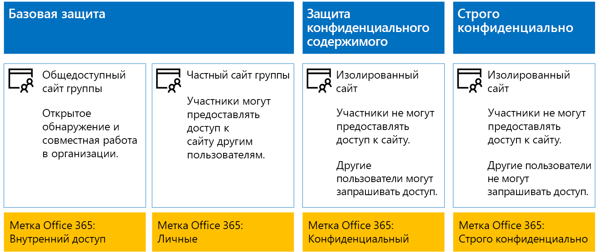
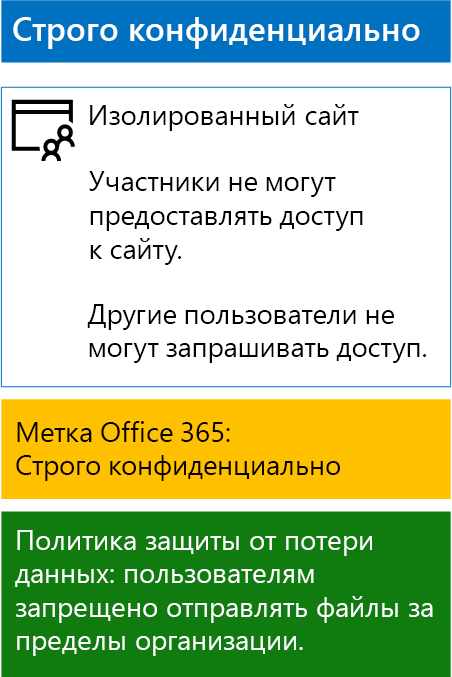

# <a name="protect-sharepoint-online-files-with-office-365-labels-and-dlp"></a>Защита файлов SharePoint Online с помощью меток Office 365 и DLP

 **Сводка.** Применяйте метки Office 365 и политики защиты от потери данных для сайтов групп SharePoint Online с различными уровнями защиты информации.
  
В этой статье описано создание и развертывание меток Office 365 и политик защиты от потери данных для базовых, конфиденциальных и строго конфиденциальных сайтов группы SharePoint Online. Дополнительные сведения об этих трех уровнях защиты см. в статье [Безопасность сайтов и файлов SharePoint Online](secure-sharepoint-online-sites-and-files.md).
  
## <a name="how-this-works"></a>Как это работает
1. Создайте нужные метки и опубликуйте их. Для их публикации может потребоваться до 12 часов.
2. Для нужных сайтов SharePoint измените параметры библиотеки документов, чтобы присвоить метку к элементам в библиотеке.
3. Создайте политики защиты от потери данных, чтобы выполнять действия на основе меток.

Когда пользователи добавляют документ в библиотеку, этот документ получает назначенную метку по умолчанию. При необходимости пользователи могут изменить метку. Если пользователь делится документом за пределами организации, служба защиты от потери данных проверяет, назначена ли метка, и выполняет действия, если политика защиты от потери данных соответствует метке. Служба защиты от потери данных также проверяет соответствие другим политикам, таким как защита файлов с номерами кредитных карт, если этот тип политики настроен. 

## <a name="office-365-labels-for-your-sharepoint-online-sites"></a>Метки Office 365 для сайтов SharePoint Online

Существует три этапа создания и назначения меток Office 365 для сайтов группы SharePoint Online.
  
### <a name="phase-1-determine-the-office-365-label-names"></a>Этап 1. Определение имен меток Office 365

На этом этапе нужно определить названия меток Office 365 для четырех уровней защиты информации, применяемых к сайтам группы SharePoint Online. В приведенной ниже таблице перечислены рекомендуемые имена для каждого уровня.
  
|**Уровень защиты сайта группы SharePoint Online**|**Имя метки**|
|:-----|:-----|
|Базовый общедоступный  <br/> |Внутренний общедоступный  <br/> |
|Базовый частный  <br/> |Private  <br/> |
|Конфиденциальный  <br/> |Конфиденциальный  <br/> |
|Строго конфиденциально  <br/> |Строго конфиденциально  <br/> |
   
### <a name="phase-2-create-the-office-365-labels"></a>Этап 2. Создание меток Office 365

На этом этапе нужно создать и опубликовать определенные метки для разных уровней защиты информации.
  
Создать метки можно с помощью Microsoft PowerShell или Центра администрирования Office 365.
  
### <a name="create-office-365-labels-with-the-office-365-admin-center"></a>Создание меток Office 365 в Центре администрирования Office 365

1. Войдите на портал Office 365, используя учетную запись с ролью администратора компании или администратора безопасности. Справочные сведения см. в статье [Вход в Office 365](https://support.office.com/Article/Where-to-sign-in-to-Office-365-e9eb7d51-5430-4929-91ab-6157c5a050b4).
    
2. На вкладке **Домашняя страница Microsoft Office** щелкните плитку **Администрирование**.
    
3. На новой вкладке браузера **Центр администрирования Office** выберите **Центры администрирования > Безопасность и соответствие требованиям**.
    
4. На новой вкладке браузера **Главная — безопасность и соответствие требованиям** выберите **Классификации > Метки**.
    
5. В области **Главная > Метки** щелкните вкладку **Хранение** и нажмите кнопку **Создать метку**.
    
6. В области **Назовите метку** введите название метки и описание для администраторов и пользователей, а затем нажмите кнопку **Далее**.

7. В области **Параметры метки** нажмите кнопку **Далее**.
    
8. В области **Проверьте параметры** нажмите **Создать**, а затем нажмите кнопку **Закрыть**.
    
9. Повторите действия 5–8, чтобы создать дополнительные метки.
    
### <a name="create-office-365-labels-with-powershell"></a>Создание меток Office 365 с помощью PowerShell

1. [Подключитесь к Центру безопасности и соответствия требованиям Office 365 с помощью удаленного сеанса PowerShell](http://go.microsoft.com/fwlink/?LinkID=799771&amp;clcid=0x409) и укажите данные учетной записи, которой назначена роль администратора безопасности или роль администратора организации.
    
2. Заполните список имен меток, а затем выполните эти команды в командной строке PowerShell:
    
  ```
  $labelNames=@(<list of label names, each enclosed in quotes and separated by commas>)
ForEach ($element in $labelNames){ New-ComplianceTag -Name $element }
  ```

### <a name="publish-your-new-labels"></a>Публикация новых меток

Для публикации новых меток Office 365 выполните действия, указанные ниже.
  
1. В области **Главная > Метки** Центра безопасности и соответствия требованиям выберите вкладку **Хранение** и нажмите кнопку **Опубликовать метки**.
    
2. В области **Выберите метки для публикации** щелкните **Выберите метки для публикации**.
    
3. В области **Выбор меток** нажмите кнопку **Добавить** и выберите все четыре метки.
    
4. Нажмите кнопку **Готово**.
    
5. В области **Выберите метки для публикации** нажмите кнопку **Далее**.
    
6. В области **Выбор расположений** нажмите кнопку **Далее**.
    
7. В области **Назовите политику** введите название для своего набора меток в поле **Название**, а затем нажмите кнопку **Далее**.
    
8. В области **Проверьте настройки** выберите **Опубликовать метки** и нажмите кнопку **Закрыть**.

    
### <a name="phase-3-apply-the-office-365-labels-to-your-sharepoint-online-sites"></a>Этап 3. Применение меток Office 365 к сайтам SharePoint Online

Инструкции по применению меток Office 365 к папкам документов, размещенным на сайтах группы SharePoint Online, приведены ниже.
  
1. На вкладке браузера **Домашняя страница Microsoft Office** щелкните плитку **SharePoint**.
    
2. На новой вкладке **SharePoint** в браузере выберите сайт, которому нужно назначить метку Office 365.
    
3. На новой вкладке SharePoint в браузере щелкните **Документы**.
    
4. Щелкните значок параметров, а затем **Параметры библиотеки**.
    
5. В разделе **Разрешения и управление** нажмите **Применить метку к элементам в этой библиотеке**.
    
6. В разделе **Параметры — применение метки** выберите соответствующую метку, а затем нажмите кнопку **Сохранить**.
    
7. Закройте вкладку сайта SharePoint Online.
    
8. Повторите шаги с 3 по 8, чтобы назначить метки Office 365 для дополнительных сайтов SharePoint Online.
    
Ниже показана итоговая конфигурация.
  

  
## <a name="dlp-policies-for-your-sharepoint-online-sites"></a>Политики защиты от потери данных для сайтов SharePoint Online

Выполните указанные ниже действия, чтобы настроить политику защиты от потери данных, которая уведомляет пользователей, когда они предоставляют доступ к документу с конфиденциального сайта группы SharePoint Online пользователям не из организации.

1. На вкладке **Домашняя страница Microsoft Office** щелкните плитку **Администрирование**.
    
2. На новой вкладке браузера **Центр администрирования Office** выберите **Центры администрирования > Безопасность и соответствие требованиям**.
    
3. На новой вкладке **Безопасность и соответствие требованиям** выберите **Защита от потери данных > Политика**.
    
4. В области **Защита от потери данных** нажмите кнопку **+ Создание политики**.
    
5. В области **Начать с шаблона или создать настраиваемую политику** выберите **Настраиваемая**, а затем нажмите кнопку **Далее**.
    
5. В области **Назовите политику** введите название для политики защиты от потери конфиденциальных данных в поле **Название**, а затем нажмите кнопку **Далее**.
    
6. В области **Выберите расположения** щелкните **Позволить мне выбрать расположения** и нажмите кнопку **Далее**.
    
7. В списке расположений отключите параметры **Электронная почта Exchange** и **Учетные записи OneDrive**, а затем нажмите кнопку **Далее**.
    
8. В области **Выберите тип содержимого, которое вы хотите защитить** щелкните ссылку **Изменить**.
    
9. В области **Выбрать типы содержимого для защиты** выберите **Добавить** в раскрывающемся списке, а затем выберите **Метки**.
    
10. В области **Метки** нажмите кнопку **+ Добавить**, укажите метку **Конфиденциальный** и последовательно нажмите кнопки **Добавить** > **Готово**.
    
11. В области **Выбрать типы содержимого для защиты** нажмите кнопку **Сохранить**.
    
12. В области **Выберите тип содержимого, которое вы хотите защитить** нажмите кнопку **Далее**.

13. В области **Что необходимо делать, если мы обнаружим конфиденциальные сведения?** щелкните **Настройка подсказки и уведомления**.
    
14. В области **Настройка подсказок политики и уведомлений по электронной почте** щелкните **Измените текст подсказки политики**.
    
15. В текстовом поле введите или вставьте одну из следующих подсказок в зависимости от того, применена ли служба Azure Information Protection, чтобы защитить строго конфиденциальные файлы:
    
  - Чтобы предоставить доступ пользователю за пределами организации, скачайте файл и откройте его. Выберите пункты "Файл > Защитить документ > Зашифровать паролем", а затем укажите надежный пароль. Отправьте пароль в отдельном сообщении или с помощью других средств связи.
  - Строго конфиденциальные файлы защищены с помощью шифрования. Их могут просматривать только те внешние пользователи, которым ваш ИТ-отдел предоставил разрешения для этих файлов.
    
    Вы также можете ввести или вставить собственную подсказку политики, которая укажет пользователям, как делиться файлом с людьми за пределами организации.
    
16. Нажмите кнопку **ОК**.
    
17. В области **Что необходимо делать, если мы обнаружим конфиденциальные сведения?** нажмите кнопку **Далее**.
    
18. В области **Вы хотите включить политику или сначала проверить, как все работает?** выберите пункт **Да, включить сразу**, а затем нажмите кнопку **Далее**.
    
19. В области **Проверьте параметры** нажмите **Создать**, а затем нажмите кнопку **Закрыть**.
    
Здесь показана итоговая конфигурация для конфиденциальных сайтов групп SharePoint Online.
  

  
Выполните следующие действия, чтобы настроить политику защиты от потери данных, которая блокирует пользователей, когда они совместно используют документы на строго конфиденциальном сайте группы SharePoint Online за пределами организации.
  
1. На вкладке браузера **Домашняя страница Microsoft Office** щелкните плитку **Безопасность и соответствие требованиям**.
    
2. На новой вкладке **Безопасность и соответствие требованиям** выберите **Защита от потери данных > Политика**.
    
3. В области **Защита от потери данных** нажмите кнопку **+ Создание политики**.
    
4. В области **Начать с шаблона или создать настраиваемую политику** выберите **Настраиваемая**, а затем нажмите кнопку **Далее**.
    
5. В области **Назовите политику** введите название для политики защиты от потери строго конфиденциальных данных в поле **Название**, а затем нажмите кнопку **Далее**.
    
6. В области **Выберите расположения** щелкните **Позволить мне выбрать расположения** и нажмите кнопку **Далее**.
    
7. В списке расположений отключите параметры **Электронная почта Exchange** и **Учетные записи OneDrive**, а затем нажмите кнопку **Далее**.
    
8. В области **Выберите тип содержимого, которое вы хотите защитить** щелкните ссылку **Изменить**.
    
9. В области **Выбрать типы содержимого для защиты** выберите **Добавить** в раскрывающемся списке, а затем выберите **Метки**.
    
10. В области **Метки** нажмите кнопку **+ Добавить**, выберите метку **Строго конфиденциальный**, нажмите **Добавить**, а затем нажмите кнопку **Готово**.
    
11. В области **Выбрать типы содержимого для защиты** нажмите кнопку **Сохранить**.
    
12. В области **Выберите тип содержимого, которое вы хотите защитить** нажмите кнопку **Далее**.
    
13. В области **Что необходимо делать, если мы обнаружим конфиденциальные сведения?** щелкните **Настройка подсказки и уведомления**.
    
14. В области **Настройка подсказок политики и уведомлений по электронной почте** щелкните **Измените текст подсказки политики**.
    
15. В текстовом поле введите или вставьте следующее:
    
  - Чтобы предоставить доступ пользователю за пределами организации, скачайте файл и откройте его. Выберите пункты "Файл > Защитить документ > Зашифровать паролем", а затем укажите надежный пароль. Отправьте пароль в отдельном сообщении или с помощью других средств связи.
    
    Вы также можете ввести или вставить, скопировав, собственную подсказку политики, которая укажет пользователям, как делиться файлом с людьми за пределами организации.
    
16. Нажмите кнопку **ОК**.
    
17. В области **Что необходимо делать, если мы обнаружим конфиденциальные сведения?** нажмите кнопку **Далее**.
    
18. В области **Вы хотите включить политику или сначала проверить, как все работает?** выберите пункт **Да, включить сразу**, а затем нажмите кнопку **Далее**.
    
19. В области **Проверьте параметры** нажмите **Создать**, а затем нажмите кнопку **Закрыть**.
    
Ниже показана итоговая конфигурация для строго конфиденциальных сайтов групп SharePoint Online.
  

  
## <a name="next-step"></a>Следующий шаг

[Защита файлов SharePoint Online с помощью Azure Information Protection](protect-sharepoint-online-files-with-azure-information-protection.md)
    
## <a name="see-also"></a>См. также

[Безопасность сайтов и файлов SharePoint Online](secure-sharepoint-online-sites-and-files.md)
  
[Защита сайтов SharePoint Online в среде разработки и тестирования](secure-sharepoint-online-sites-in-a-dev-test-environment.md)
  
[Руководство по безопасности (Майкрософт) для политических кампаний, некоммерческих и других динамических организаций](microsoft-security-guidance-for-political-campaigns-nonprofits-and-other-agile-o.md)
  
[Освоение облака и гибридные решения](https://docs.microsoft.com/office365/enterprise/cloud-adoption-and-hybrid-solutions)


