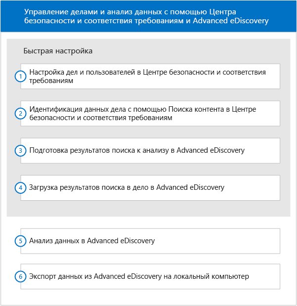

# Быстрая настройка для Office 365 Advanced eDiscovery

Этот раздел о настройках содержит сведения для менеджера обнаружения электронных данных в Центре безопасности и соответствия требованиям Office 365 о том, как начать работу с Advanced eDiscovery. Предполагается, что есть общее представление об обеих службах.
  
> [!NOTE]
> Advanced eDiscovery требует наличия Office 365 E3 с надстройкой Advanced Compliance или подписки на E5 для организации. Если у вас этого плана нет и вы хотите попробовать Advanced eDiscovery, можете [зарегистрироваться для получения пробной версии Office 365 корпоративный E5](https://go.microsoft.com/fwlink/p/?LinkID=698279). 
  
## Получение доступа к делу в Advanced eDiscovery

Доступ к Advanced eDiscovery можно получить в Центре безопасности и соответствия требованиям Office 365. Но нужно быть участником дела обнаружения электронных данных в Центре безопасности и соответствия требованиям, чтобы получить доступ к этому делу в Advanced eDiscovery. Сведения о предоставлении разрешений в отношении дела обнаружения электронных данных и добавлении пользователей для такого дела см. в статье [Управление делами обнаружения электронных данных в Office 365](manage-ediscovery-cases.md). 
  
Чтобы перейти к делу в Advanced eDiscovery: 
  
1. [Откройте Центр безопасности и соответствия требованиям Office 365](go-to-the-securitycompliance-center.md). 
    
2. Чтобы отобразился список дел в организации, в Центре безопасности и соответствия требованиям выберите **Поиск и исследование** \> **Обнаружение электронных данных**. 
    
3. На странице **Обнаружение электронных данных** нажмите кнопку **Открыть** рядом с названием дела, к которому хотите перейти в Advanced eDiscovery. 
    
4. На странице **Главная** для этого дела выберите **Advanced eDiscovery**.
    
    Отобразится индикатор выполнения **Подключение к Advanced eDiscovery**. После подключения дело откроется в Advanced eDiscovery. 
    
## Рабочий процесс

На приведенной ниже схеме показан типичный рабочий процесс для использования дел обнаружения электронных данных и управления ими в Центре безопасности и соответствия требованиям и Advanced eDiscovery. 
  

  
Этот раздел о настройках содержит сведения о первых четырех этапах рабочего процесса. Описание других этапов см. далее.
  
## Анализ

[Анализ данных дела](analyze-case-data-with-advanced-ediscovery.md) идентифицирует и упорядочивает файлы по различным параметрам, обеспечивает использование категории "Темы", отображает результаты. Для получения улучшенных результатов можно настроить функциональность анализа с учетом пользователя. 
  
## Настройка релевантности и модуль релевантности

[Настройка релевантности](manage-relevance-setup-in-advanced-ediscovery.md) и [Использование модуля релевантности](use-relevance-in-advanced-ediscovery.md) обеспечивают оценку и обучение релевантности на основе случайной выборки файлов и используют их для реализации решений в процессе прогнозирующего кодирования. Вычисляют и отображают промежуточные результаты, отслеживая статистическую достоверность процесса. Отображают результаты для помощи в принятии решений при просмотре. 
  
## Экспорт

[Экспорт данных дела](export-case-data-in-advanced-ediscovery.md) обеспечивает экспорт результатов и содержимого Advanced eDiscovery для внешней проверки. 
  
## Отчет

[Создание отчетов](run-reports-in-advanced-ediscovery.md) обеспечивает создание выбранных отчетов, связанных с обработкой Advanced eDiscovery. 
  
## См. также

[Office 365 Advanced eDiscovery](office-365-advanced-ediscovery.md)
  
[Настройка пользователей и дел](set-up-users-and-cases-in-advanced-ediscovery.md)
  
[Подготовка данных](prepare-data-for-advanced-ediscovery.md)

