# Общие сведения о политиках храненияOverview of retention policies

В большинстве организаций объем и сложность данных возрастают с каждым днем: накапливаются электронные сообщения, документы, мгновенные сообщения и многое другое. Важно уметь эффективно управлять такой информацией, потому что нужно выполнять следующее:For most organizations, the volume and complexity of their data is increasing daily - email, documents, instant messages, and more. Effectively managing or governing this information is important because you need to:
  
- **Заблаговременно обеспечивать соответствие отраслевым нормативным актам и внутренним политикам**, требующим хранить содержимое в течение некоторого минимального периода. Например, закон Сарбейнса — Оксли может обязывать вас хранить определенные типы содержимого в течение семи лет.**Comply proactively with industry regulations and internal policies** that require you to retain content for a minimum period of time - for example, the Sarbanes-Oxley Act might require you to retain certain types of content for seven years. 
    
- **Снизить риск на случай судебного разбирательства или нарушения безопасности** путем окончательного удаления старого содержимого, которое вы больше не обязаны хранить.**Reduce your risk in the event of litigation or a security breach** by permanently deleting old content that you're no longer required to keep. 
    
- **Способствовать динамичности организации и эффективному обмену знаниями в ней**, обеспечив актуальность и релевантность данных, с которыми работают пользователи.**Help your organization to share knowledge effectively and be more agile** by ensuring that your users work only with content that's current and relevant to them. 
    
Достичь всех этих целей помогает политика хранения в Office 365. Как правило, управление содержимым предполагает два действия:A retention policy in Office 365 can help you achieve all of these goals. Managing content commonly requires two actions:
  
- **Хранение** содержимого таким образом, чтобы его нельзя было удалить без возможности восстановления до окончания периода хранения.**Retaining** content so that it can't be permanently deleted before the end of the retention period. 
    
- **Удаление** содержимого без возможности восстановления в конце периода хранения.**Deleting** content permanently at the end of the retention period. 
    
Политика хранения позволяет следующее:With a retention policy, you can:
  
- Заблаговременно решать, как поступить с содержимым — хранить его, удалить или удалить через какой-то период.Decide proactively whether to retain content, delete content, or both - retain and then delete the content.
    
- Применять единую политику ко всей организации или только к некоторым расположениям либо пользователям.Apply a single policy to the entire organization or just specific locations or users.
    
- Применять политику ко всему содержимому или только к такому, которое удовлетворяет определенным условиям (например, включающему определенные ключевые слова или [определенные типы конфиденциальной информации](what-the-sensitive-information-types-look-for.md)).Apply a policy to all content or just content meeting certain conditions, such as content containing specific keywords or [specific types of sensitive information](what-the-sensitive-information-types-look-for.md).
    
Когда к содержимому применяется политика хранения, пользователи могут изменять его и работать с ним так же, как и раньше, потому что содержимое никуда не делось и находится в исходном расположении. Но если кто-либо изменит или удалит такое содержимое, его копия попадет в надежное расположение и будет там храниться до момента окончания действия политики хранения.When content is subject to a retention policy, people can continue to edit and work with the content as if nothing's changed because the content is retained in place, in its original location. But if someone edits or deletes content that's subject to the policy, a copy is saved to a secure location where it's retained while the policy is in effect.
  
От некоторых организаций требуется выполнять требования нормативных актов, например постановления 17a-4 Комиссии по ценным бумагам и биржам (США), которое запрещает отключать политику хранения или делать ее менее строгой. В этом случае можно использовать блокировку хранения. После блокировки никто, в том числе администратор, не сможет отключить политику или сделать ее менее строгой.Finally, some organizations might need to comply with regulations such as Securities and Exchange Commission (SEC) Rule 17a-4, which requires that after a retention policy is turned on, it cannot be turned off or made less restrictive. To meet this requirement, you can use Preservation Lock. After a policy's been locked, no one—including the administrator—can turn off the policy or make it less restrictive.
  
Создавать политики хранения и управлять ими можно на странице **Хранение** в Центре безопасности и соответствия требованиям Office 365.You create and manage retention policies on the **Retention** page in the Office 365 Security &amp; Compliance Center. 
  
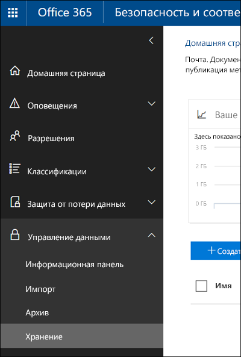
  
> [!NOTE]
> Чтобы включить почтовый ящик Exchange Online в политику хранения, ему необходимо назначить лицензию на Exchange Online (план 2). Если почтовому ящику назначена лицензия на Exchange Online (план 1), необходимо назначить ему отдельную лицензию на Exchange Online Archiving, чтобы включить его в политику хранения.To include an Exchange Online mailbox in a retention policy, the mailbox must be assigned an Exchange Online Plan 2 license. If a mailbox is assigned an Exchange Online Plan 1 license, you would have to assign it a separate Exchange Online Archiving license to include it in a retention policy. 
  
## Что делает политика хранения с содержимым на местеHow a retention policy works with content in place

При добавлении расположения, например сайта или почтового ящика, в политику хранения содержимое остается в исходном расположении. Пользователи могут продолжать работать со своими документами или почтой, как будто ничего не изменилось. Но если они изменят или удалят содержимое, включенное в политику, его копия сохранится в том виде, в каком было содержимое на момент применения политики.When you include a location such as a site or mailbox in a retention policy, the content remains in its original location. People can continue to work with their documents or mail as if nothing's changed. But if they edit or delete content that's included in the policy, a copy of the content as it existed when you applied the policy is retained.
  
Для сайтов копия исходного содержимого, измененного или удаленного пользователями, сохраняется в архивной библиотеке. Для электронной почты и общедоступных папок копия сохраняется в папке "Элементы с возможностью восстановления". Эти надежные расположения и хранимое в них содержимое не видны большинству пользователей. Политика хранения такова, что пользователям не нужно знать о ее применении к содержимому.For sites, a copy of the original content is retained in the Preservation Hold library when users edit or delete it; for email and public folders, the copy is retained in the Recoverable Items folder. These secure locations and the retained content are not visible to most people. With a retention policy, people do not even need to know that their content is subject to the policy.
  
Примечания.Notes:
  
- Содержимое Skype хранится в Exchange, где политика применяется на основе типа сообщений (электронная почта или беседы).Skype content is stored in Exchange, where the policy is applied based on message type (email or conversation).
    
- Политика хранения, примененная к группе Office 365, включает в себя как сайт, так и почтовый ящик группы.A retention policy applied to an Office 365 group includes both the group mailbox and site.
    
### Содержимое учетных записей OneDrive и сайтов SharePointContent in OneDrive accounts and SharePoint sites

Политика хранения применяется на уровне сайта. Когда вы включаете в политику хранения сайт SharePoint или учетную запись OneDrive, создается архивная библиотека, если таковая еще не существует. Большинство пользователей не могут ее просматривать, потому что она видна только администраторам семейств веб-сайтов.A retention policy is applied at the level of a site. When you include a SharePoint site or OneDrive account in a retention policy, a Preservation Hold library is created, if one doesn't already exist. Most users can't view the Preservation Hold library because it's visible only to site collection administrators.
  
Если кто-то пытается изменить или удалить содержимое сайта, к которому применяется политика хранения, сначала эта политика проверяет, было ли это содержимое изменено с момента ее применения. Если это первое изменение с момента назначения этой политики, содержимое копируется в архивную библиотеку, а затем пользователь сможет изменить или удалить исходный вариант. Обратите внимание на то, что в архивную библиотеку можно скопировать любое содержимое сайта, даже если оно не соответствует запросу, который используется для политики хранения.If a person attempts to change or delete content in a site that's subject to a retention policy, first the policy checks whether the content's been changed since the policy was applied. If this is the first change since the policy was applied, the retention policy copies the content to the Preservation Hold library, and then allows the person to change or delete the original content. Note that any content in the site can be copied to the Preservation Hold library, even if the content does not match the query used by the retention policy.
  
Затем архивная библиотека будет очищена заданием таймера. Задание таймера выполняется периодически. При этом сравнивается все содержимое архивной библиотеки со всеми запросами, которые используются для политики хранения на сайте. Пока содержимое не будет соответствовать хотя бы одному из запросов, задание таймера будет окончательно удалять его из архивной библиотеки.Then a timer job cleans up the Preservation Hold library. The timer job runs periodically and compares all content in the Preservation Hold library to all of the queries used by the retention policies on the site. Unless content matches at least one of the queries, the timer job permanently deletes the content from the Preservation Hold library.
  
Описанное выше касается содержимого, существующего на момент применения политики хранения. Кроме того, новое содержимое, созданное на сайте или добавленное на него после включения сайта в политику, будет сохранено после удаления. Однако новое содержимое копируется в архивную библиотеку не при первом изменении, а только при удалении. Чтобы сохранить все версии файла, необходимо включить управление версиями (см. следующий раздел).The previous applies to content that exists when the retention policy is applied. In addition, any new content that's created or added to the site after it was included in the policy will be retained after deletion. However, new content isn't copied to the Preservation Hold library the first time it's edited, only when it's deleted. To retain all versions of a file, you need to turn on versioning — see the below section on versioning.
  
Обратите внимание на то, что пользователь получит сообщение об ошибке при попытке удалить библиотеку, список, папку или сайт, на которые распространяется политика хранения. Пользователь сможет удалить папку, если сначала переместит или удалит находящиеся в этой папке файлы, к которым применена эта политика.Note that a user will receive an error if they try to delete a library, list, folder, or site that's subject to a retention policy. A user can delete a folder if they first move or delete any files in the folder that are subject to the policy.
  
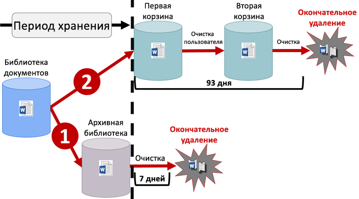
  
После назначения политики хранения учетной записи OneDrive или сайту SharePoint содержимое обрабатывается одним из указанных ниже способов.After a retention policy is assigned to a OneDrive account or SharePoint site, content can follow one of two paths:
  
1. **Если содержимое изменяется или удаляется** во время периода хранения, копия исходного содержимого по состоянию на момент назначения политики хранения создается в архивной библиотеке. Периодически запускается задание таймера, определяющее элементы с истекшим сроком хранения, и эти элементы удаляются в течение семи дней после окончания периода хранения без возможности восстановления.**If the content is modified or deleted** during the retention period, a copy of the original content as it existed when the retention policy was assigned is created in the Preservation Hold library. There, a timer job runs periodically and identifies items whose retention period has expired, and these items are permanently deleted within seven days of the end of the retention period. 
    
2. **Если содержимое не изменяется и не удаляется** во время периода хранения, оно перемещается в первую корзину в конце периода хранения. Если пользователь удаляет содержимое из нее или очищает эту корзину (такое действие называется очисткой), то документ перемещается во вторую корзину. 93-дневный период хранения распространяется и на первую, и на вторую корзину. По истечении 93 дней документ окончательно удаляется из места своего расположения — первой или второй корзины. Обратите внимание, что корзина не индексируется, поэтому найти в ней содержимое с помощью операции поиска невозможно. Это означает, что функция обнаружения электронных данных не позволит найти содержимое в корзине.**If the content is not modified or deleted** during the retention period, it's moved to the first-stage Recycle Bin at the end of the retention period. If a user deletes the content from there or empties this Recycle Bin (also known as purging), the document is moved to the second-stage Recycle Bin. A 93-day retention period spans both the first- and second-stage recycle bins. At the end of 93 days, the document is permanently deleted from wherever it resides, in either the first- or second-stage Recycle Bin. Note that the Recycle Bin is not indexed and therefore searches do not find content there. This means that an eDiscovery hold can't locate any content in the Recycle Bin in order to hold it. 
    
### Содержимое в почтовых ящиках и общедоступных папкахContent in mailboxes and public folders

Политика хранения почты, календаря и других элементов пользователя применяется на уровне почтового ящика. Политика хранения общедоступной папки применяется на уровне папки, а не на уровне почтового ящика. Элементы почтового ящика и общедоступной папки хранятся в папке "Элементы с возможностью восстановления". Только пользователи, которым назначены разрешения на обнаружение электронных данных, могут просматривать папки "Элементы с возможностью восстановления" других пользователей.For a user's mail, calendar, and other items, a retention policy is applied at the level of a mailbox. For a public folder, a retention policy is applied at the folder level, not the mailbox level. Both a mailbox and a public folder use the Recoverable Items folder to retain items. Only people whom have been assigned eDiscovery permissions can view items in another user's Recoverable Items folder.
  
По умолчанию при удалении сообщения из папки, отличной от папки "Удаленные", сообщение перемещается в папку "Удаленные". При удалении элемента из папки "Удаленные" сообщение перемещается в папку "Элементы с возможностью восстановления". Кроме того, пользователь может выполнить обратимое удаление элемента (SHIFT+DELETE) в любой папке, что позволяет обойти папку "Удаленные" и переместить этот элемент непосредственно в папку "Элементы с возможностью восстановления".By default, when a person deletes a message in a folder other than the Deleted Items folder, the message is moved to the Deleted Items folder. When a person deletes an item in the Deleted Items folder, the message is moved to the Recoverable Items folder. In addition, a person can soft delete an item (SHIFT+DELETE) in any folder, which bypasses the Deleted Items folder and moves the item directly to the Recoverable Items folder.
  
Процесс периодически проверяет содержимое папки "Элементы с возможностью восстановления". Если элемент не соответствует правилам по крайней мере одной политики хранения, он окончательно удаляется (такое удаление также называется необратимым) из этой папки.A process periodically evaluates items in the Recoverable Items folder. If an item doesn't match the rules of at least one retention policy, the item is permanently deleted (also called hard deleted) from the Recoverable Items folder.
  
При попытке пользователя изменить определенные свойства элемента почтового ящика (например, тему, текст сообщения, вложения, отправителей и получателей, дату отправки или получения сообщения) копия исходного элемента сохраняется в папке "Элементы с возможностью восстановления", прежде чем изменение вступит в силу. Так будет происходить при каждом последующем изменении. В конце периода хранения копии в папке "Элементы с возможностью восстановления" окончательно удаляются.When a person attempts to change certain properties of a mailbox item — such as the subject, body, attachments, senders and recipients, or date sent or received for a message — a copy of the original item is saved to the Recoverable Items folder before the change is committed. This happens for each subsequent change. At the end of the retention period, copies in the Recoverable Items folder are permanently deleted.
  
Если пользователь уходит из организации, а для его почтового ящика действует политика хранения, такой почтовый ящик становится неактивным при удалении учетной записи Office 365 пользователя. К содержимому неактивного почтового ящика по-прежнему применяется политика хранения, назначенная до того, как почтовый ящик стал неактивным, и такое содержимое можно найти при обнаружении электронных данных. Дополнительные сведения см. в статье [Неактивные почтовые ящики в Exchange Online](https://go.microsoft.com/fwlink/?linkid=846909).If a user leaves your organization, and their mailbox is included in a retention policy, the mailbox becomes an inactive mailbox when the user's Office 365 account is deleted. The contents of an inactive mailbox are still subject to any retention policy that was placed on the mailbox before it was made inactive, and the contents are available to an eDiscovery search. For more information, see [Inactive mailboxes in Exchange Online](https://go.microsoft.com/fwlink/?linkid=846909).
  
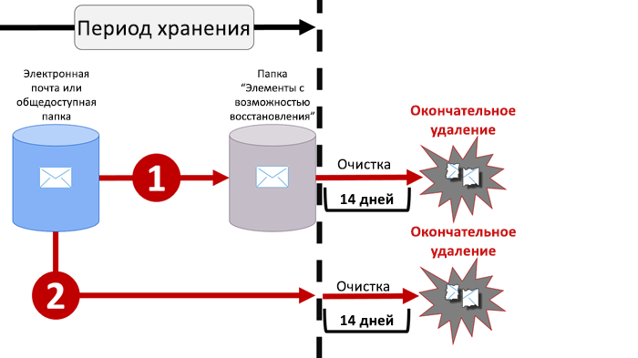
  
После назначения политики хранения почтовому ящику или общедоступной папке содержимое обрабатывается одним из указанных ниже способов.After a retention policy is assigned to a mailbox or public folder, content can follow one of two paths:
  
1. **Если элемент изменяется или окончательно удаляется** пользователем во время периода хранения, то копируется или перемещается в папку "Элементы с возможностью восстановления" соответственно. (К окончательному удалению элемента приводит нажатие клавиш SHIFT+DELETE или удаление элемента из папки "Удаленные элементы".) После чего периодически запускается процесс, который выявляет элементы с истекшим сроком хранения, и они удаляются в течение 14 дней после окончания периода хранения без возможности восстановления. Обратите внимание на то, что 14 дней — это значение по умолчанию. Его можно менять, указывая до 30 дней.**If the item is modified or permanently deleted** by the user (either SHIFT+DELETE or deleted from Deleted Items) during the retention period, the item is moved (or copied, in the case of edit) to the Recoverable Items folder. There, a process runs periodically and identifies items whose retention period has expired, and these items are permanently deleted within 14 days of the end of the retention period. Note that 14 days is the default setting, but it can be configured up to 30 days. 
    
2. **Если элемент не изменяется и не удаляется** во время периода хранения, тот же процесс периодически запускается для всех папок в почтовом ящике и выявляет элементы с истекшим сроком хранения. Эти элементы удаляются в течение 14 дней после окончания периода хранения без возможности восстановления. Обратите внимание на то, что 14 дней — это значение по умолчанию. Его можно менять, указывая до 30 дней.**If the item is not modified or deleted** during the retention period, the same process runs periodically on all folders in the mailbox and identifies items whose retention period has expired, and these items are permanently deleted within 14 days of the end of the retention period. Note that 14 days is the default setting but it can be configured up to 30 days. 
    
## Что политика хранения делает с версиями документов на сайтеHow a retention policy works with document versions in a site

Управление версиями — это функция всех библиотек документов в SharePoint Online и OneDrive для бизнеса. По умолчанию при управлении версиями сохраняется не менее пятисот основных номеров версий, хотя можно увеличить это значение. Дополнительные сведения см. в статье [Включение и настройка управления версиями для списка или библиотеки](https://support.office.com/article/1555d642-23ee-446a-990a-bcab618c7a37).Versioning is a feature of all document libraries in SharePoint Online and OneDrive for Business. By default, versioning retains a minimum of five hundred major versions, though you can increase this limit. For more information, see [Enable and configure versioning for a list or library](https://support.office.com/article/1555d642-23ee-446a-990a-bcab618c7a37).
  
Политика хранения сохраняет все версии документа на сайте SharePoint или в учетной записи OneDrive. При каждом изменении или удаления документа, к которому применяется политика хранения, версия копируется в архивную библиотеку. Каждая версия документа в архивной библиотеке существует как отдельный элемент с собственным периодом хранения.A retention policy retains all versions of a document in a SharePoint site or OneDrive account. Each time a document subject to a retention policy is edited or deleted, a version is copied to the Preservation Hold library. Each version of a document in the Preservation Hold library exists as a separate item with its own retention period:
  
- Если политика хранения основана на времени создания содержимого, все версии имеют ту же дату истечения срока хранения, что и исходный документ.If the retention policy is based on when the content was created, each version has the same expiration date as the original document. The original document and its versions all expire at the same time.
    
- Если политика хранения основана на времени последнего изменения содержимого, каждая из версий имеет собственный срок хранения, определенный с учетом времени изменения исходного документа для ее создания. Сроки для исходного документа и его версий истекают независимо друг от друга.If the retention policy is based on when the content was last modified, each version has its own expiration date based on when the original document was modified to create that version. The original documents and its versions expire independently of each other.
    
## Хранение содержимого в течение определенного периода времениRetaining content for a specific period of time

С помощью политики хранения можно хранить содержимое бесконечно или в течение определенного количества дней, месяцев или лет. Обратите внимание, что длительность хранения содержимого рассчитывается с учетом возраста содержимого, а не момента применения политики хранения. Можно указать способ расчета возраста содержимого — по времени создания или (для OneDrive и SharePoint) по времени последнего изменения.With a retention policy, you can retain content indefinitely or for a specific number of days, months, or years. Note that the duration for how long content is retained is calculated from the age of the content, not from when the retention policy is applied. You can choose whether the age is based on when the content was created or (for OneDrive and SharePoint) when it was last modified.
  
Например, если необходимо хранить содержимое на сайте на протяжении семи лет с момента его последнего изменения, а документ на этом сайте не изменялся в течение шести лет, то он будет сохраняться еще только один год, если в него не внесут изменений. В случае повторного изменения документа отсчет его возраста начинается с новой даты последнего изменения, при этом он будет сохраняться еще семь лет.For example, if you want to retain content in a site for seven years since it was last modified, and a document in that site hasn't been modified in six years, the document will be retained for only another year if it's not modified. If the document is edited again, the age of the document is calculated from the new last modified date, and it will be retained for another seven years.
  
Кроме того, если вы хотите хранить содержимое почтового ящика в течение семи лет, а сообщение было отправлено шесть лет назад, оно будет храниться всего один год. Для содержимого Exchange возраст всегда определяется с учетом даты получения или отправки (они совпадают). Хранение содержимого с учетом времени последнего изменения применяется только для содержимого сайтов в OneDrive и SharePoint.Similarly, if you want to retain content in a mailbox for seven years, and a message was sent six years ago, the message will be retained for only one year. For Exchange content, the age is always based on the date received or sent (they are the same). Retaining content based on when it was last modified applies only to site content in OneDrive and SharePoint.
  
Можно указать, следует ли окончательно удалять содержимое в конце периода хранения. Согласно политике хранения старое содержимое может просто удаляться, а не храниться (см. следующий раздел).You can choose whether you want the content to be permanently deleted at the end of the retention period. A retention policy can also simply delete old content without retaining it - see the next section.
  
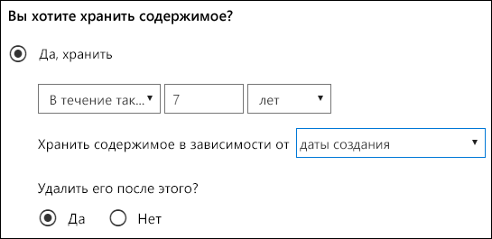
  
## Удаление содержимого, которое старше указанного возрастаDeleting content that's older than a specific age

Политика хранения может предусматривать как хранение содержимого с последующим удалением, так и простое удаление старого содержимого без хранения.A retention policy can both retain and then delete content, or simply delete old content without retaining it.
  
Если политика хранения предусматривает удаление содержимого, важно понимать, что период, указанный для политики хранения, рассчитывается со времени создания или изменения содержимого, а не со времени назначения политики.If your retention policy deletes content, it's important to understand that the time period specified for a retention policy is calculated from the time when the content was created or modified, not the time since the policy was assigned.
  
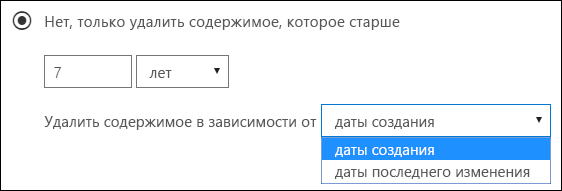
  
Предположим, вы создаете политику хранения, согласно которой содержимое удаляется через три года, а затем назначаете эту политику всем учетным записям OneDrive с большим объемом содержимого, созданного четыре или пять лет назад. В этом случае такое содержимого будет удалено вскоре после назначения политики хранения в первый раз. По этой причине **политика хранения, предусматривающая удаление содержимого, может серьезно повлиять на содержимое**.For example, suppose that you create a retention policy that deletes content after three years, and then assign that policy to all OneDrive accounts, which contain a lot of content that was created four or five years ago. In this case, a lot of content will be deleted soon after assigning the retention policy for the first time. For this reason, **a retention policy that deletes content can have a considerable impact on your content**. 
  
Потому перед первым назначением политики хранения сайту следует сначала определить возраст содержимого и подумать о том, как может эта политика повлиять на такое содержимое. Кроме того, может потребоваться уведомить ваших пользователей о новой политике, прежде чем назначать ее, чтобы у них было время оценить возможное ее влияние. Обратите внимание на это предупреждение, которое появляется при просмотре параметров политики хранения непосредственно перед ее созданием.Therefore, before you assign a retention policy to a site for the first time, you should first consider the age of the existing content and how the policy may impact that content. You may also want to communicate the new policy to your users before assigning it, to give them time to assess the possible impact. Note this warning that appears when you review the settings for your retention policy just before creating it.
  

  
## Дополнительные параметры, с помощью которых политика применяется только к содержимому, соответствующему определенным условиямAdvanced settings that apply a policy only to content that meets certain conditions

Политику хранения можно применить ко всему содержимому в расположениях, на которые она распространяется, или же только к содержимому, включающему определенные ключевые слова или [определенные типы конфиденциальной информации](what-the-sensitive-information-types-look-for.md).A retention policy can apply to all content in the locations that it includes, or you can choose to apply a retention policy only to content that contains specific keywords or [specific types of sensitive information](what-the-sensitive-information-types-look-for.md).
  
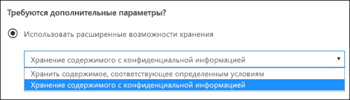
  
### Хранение содержимого с определенными ключевыми словамиRetain content that contains specific keywords

Вы можете применить политику хранения к содержимому, соответствующему определенным условиям, а затем предпринять действия по хранению только в отношении такого содержимого. Доступные в данный момент условия поддерживают применение политики хранения к содержимому, содержащему определенные слова или фразы. Вы можете уточнить запрос с помощью таких операторов поиска, как И, ИЛИ и НЕ. Дополнительные сведения об операторах см. в статье [Запросы по ключевым словам и условия поиска содержимого](keyword-queries-and-search-conditions.md).You can apply a retention policy only to content that satisfies certain conditions, and then take retention actions on just that content. The conditions available now support applying a retention policy to content that contains specific words or phrases. You can refine your query by using search operators like AND, OR, and NOT. For more information on these operators, see [Keyword queries and search conditions for Content Search](keyword-queries-and-search-conditions.md).
  
Поддержка добавления свойств, поддерживающих поиск (например, **subject:**), появится в скором времени.Support for adding searchable properties (for example, **subject:**) is coming soon.
  
Обратите внимание, что при хранении на основе запросов используется индекс поиска для определения содержимого.Note that query-based retention uses the search index to identify content.
  
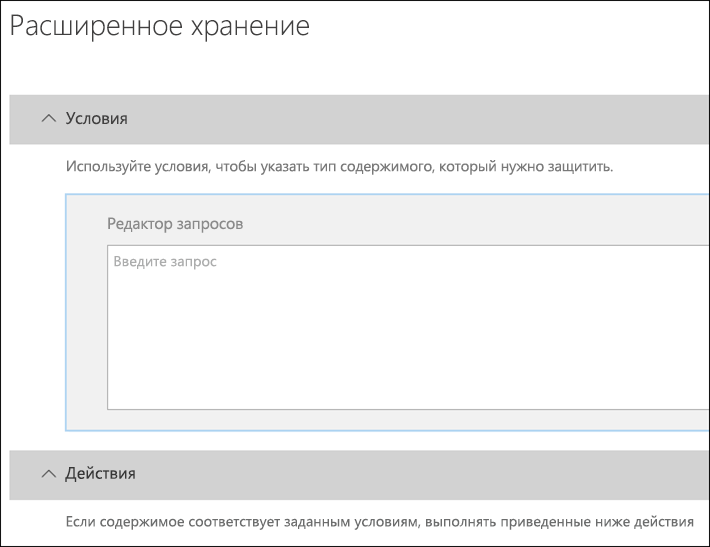
  
### Хранение содержимого с конфиденциальной информациейRetain content that contains sensitive information

Политику хранения можно также применить только к содержимому с [определенными типами конфиденциальной информации](what-the-sensitive-information-types-look-for.md). Например, можно установить уникальные требования к хранению только содержимого, которое включает такие персональные данные, как идентификационные номера налогоплательщиков, номера социального страхования или номера паспортов.You can also apply a retention policy only to content that contains [specific types of sensitive information](what-the-sensitive-information-types-look-for.md). For example, you can choose to apply unique retention requirements only to content that contains personally identifiable information (PII) such as taxpayer identification numbers, social security numbers, or passport numbers.
  
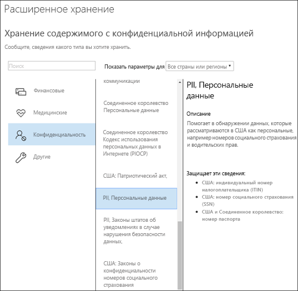
  
Примечания.Notes:
  
- Дополнительные параметры хранения конфиденциальной информации не применяются к общедоступным папкам Exchange и Skype для бизнеса, так как эти расположения не поддерживают типы конфиденциальной информации.Advanced retention for sensitive information doesn't apply to Exchange public folders or Skype for Business because those locations don't support sensitive information types.
    
- Следует понимать, что Exchange Online использует правила транспорта для выявления конфиденциальной информации, поэтому этот способ применим только к сообщениям во время их передачи, а не ко всем элементам, уже сохраненным в почтовом ящике. Для Exchange Online это означает, что политика хранения может выявить конфиденциальную информацию и выполнить действия по хранению только над сообщениями, которые были получены **после** применения политики к почтовому ящику. (Обратите внимание на то, что хранение на основе запросов, описанное в предыдущем разделе, не имеет такого ограничения, так как при нем используется индекс поиска для выявления содержимого.)You should understand that Exchange Online uses transport rules to identify sensitive information, so this works only on messages in transit — not on all items already stored in a mailbox. For Exchange Online, this means that a retention policy can identify sensitive information and take retention actions only on messages that are received **after** the policy is applied to the mailbox. (Note that query-based retention described in the previous section doesn't have this limitation because it uses the search index to identify content.) 
    
## Применение политики хранения ко всей организации или определенным расположениямApplying a retention policy to an entire organization or specific locations

Вы можете легко применить политику хранения ко всей организации, целому расположению или только к отдельным его частям или пользователям.You can easily apply a retention policy to an entire organization, entire locations, or only to specific locations or users.
  
### Политика для всей организацииOrg-wide policy

Одно из самых замечательных свойств политики хранения заключается в том, что по умолчанию она применяется к расположениям в Office 365, включающим следующие:One of the most powerful features of a retention policy is that by default it applies to locations across Office 365, including:
  
- почта Exchange;Exchange email
    
- Сайты SharePointSharePoint sites
    
- учетные записи OneDrive;OneDrive accounts
    
- группы Office 365 (применяется к содержимому в документах, на сайтах, в почтовом ящике группы, вскоре будет применяться к содержимому Планировщика, Yammer и CRM);Office 365 groups (applies to content in the group's mailbox, site, and documents. Support for content in Planner, Yammer, and CRM is coming soon.)
    
- общедоступные папки Exchange.Exchange public folders
    
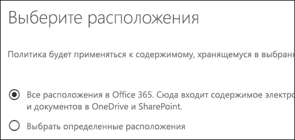
  
Ниже перечислены другие важные возможности политики хранения для всей организации.Other important features of an org-wide retention policy include:
  
- Количество почтовых ящиков или сайтов, на которые может распространяться политика, не ограничено.There is no limit to the number of mailboxes or sites the policy can include.
    
- Для Exchange каждый новый почтовый ящик, созданный после применения политики, будет автоматически ее наследовать.For Exchange, any new mailbox created after the policy is applied will automatically inherit the policy.
  
### Политика, применяемая к целому расположениюA policy that applies to entire locations

При выборе расположений можно легко включить или исключить целое расположение (например, почту Exchange или учетные записи OneDrive). Для этого просто установите переключатель **Состояние** этого расположения в положение включения или выключения.When you choose locations, you can easily include or exclude an entire location, such as Exchange email or OneDrive accounts. To do so, simply toggle the **Status** of that location on or off. 
  
Как и в случае с политикой для всей организации, политика, применяемая к любому сочетанию целых расположений, не ограничена в количестве почтовых ящиков или сайтов, которые может охватывать. Например, если политика охватывает всю почту Exchange и все сайты SharePoint, будут включены все сайты и почтовые ящики независимо от их количества. Для Exchange каждый новый почтовый ящик, созданный после применения политики, будет автоматически ее наследовать.Like an org-wide policy, if a policy applies to any combination of entire locations, there is no limit to the number of mailboxes or sites the policy can include. For example, if a policy includes all Exchange email and all SharePoint sites, all sites and mailboxes will be included, no matter how many. And for Exchange, any new mailbox created after the policy is applied will automatically inherit the policy.
 
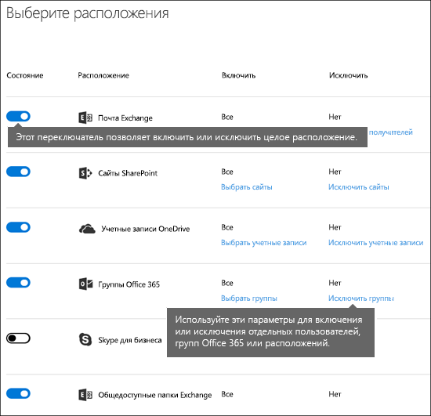
  
### Политика, в которую включены нужные элементыA policy with specific inclusions or exclusions

Можно также применить политику хранения к определенным пользователям. Для этого установите переключатель **Состояние** такого расположения в положение включения и затем с помощью ссылок включите или исключите отдельных пользователей, группы Office 365 или расположения.You can also apply a retention policy to specific users. To do so, toggle the **Status** of that location on, and then use the links to include or exclude specific users, Office 365 groups, or locations. 
  
Обратите внимание на указанные ниже ограничения политики хранения, которая включает или исключает свыше 1000 конкретных пользователей.However, note that the following limits exist for a retention policy that includes or excludes over 1,000 specific users:
  
- Такая политика хранения не может содержать более 1000 почтовых ящиков и 100 сайтов.Such a retention policy can contain no more than 1,000 mailboxes and 100 sites.
    
- Клиент не может содержать более 10 000 политик хранения.A tenant can contain no more than 1,000 such retention policies.
    
Существующие ограничения можно превысить, применив политику ко всей организации или к целым расположениям.Although these limits exist, understand that you can get over these limits by applying either an org-wide policy or a policy that applies to entire locations.
  
### Расположения SkypeSkype locations

В отличие от почты Exchange, состояние расположения Skype нельзя просто изменить так, чтобы добавить всех пользователей, но можно включить это расположение, а затем вручную выбрать пользователей, чьи беседы нужно сохранить.Unlike Exchange email, you can't simply toggle the status of the Skype location on to include all users, but you can turn on that location and then manually choose the users whose conversations you want to retain.
  
При выборе пользователей Skype для бизнеса можно быстро включить всех пользователей, выбрав поле **Имя** в заголовке столбца. Однако важно понимать, что каждый пользователь засчитывается как отдельно включенный в политику элемент. Если включить более 1000 пользователей, будут применены ограничения, указанные в предыдущем разделе. Выбор всех пользователей Skype в данном случае не выполняется так, будто политика для всей организации включает всех пользователей Skype по умолчанию.When you choose Skype for Business users, you can quickly include all users by selecting the **Name** box in the column header - however, it's important to understand that each user counts as a specific inclusion in the policy. Therefore, if you include over 1,000 users, the limits noted in the previous section apply. Selecting all Skype users here is not the same as if an org-wide policy were able to include all Skype users by default. 
  

  
Обратите внимание, что **Журнал бесед**, папка в Outlook, не имеет отношения к архивам Skype. **Журнал бесед** может быть отключен пользователем, однако архивация для Skype выполняется путем сохранения копии бесед Skype в скрытой папке, не доступной для пользователя, но доступной для обнаружения электронных данных.Note that **Conversation History**, a folder in Outlook, is a feature that has nothing to do with Skype archiving. **Conversation History** can be turned off by the end user, but archiving for Skype is done by storing a copy of Skype conversations in a hidden folder that is inaccessible to the user but available to eDiscovery. 
  
### Расположения TeamsTeams locations

Для хранения чатов и сообщений канала в Teams можно использовать политику хранения. Чаты Teams хранятся в скрытой папке почтового ящика каждого пользователя, включенного в чат, а сообщения канала Teams хранятся в похожей скрытой папке в почтовом ящике группы. Важно понимать, что Teams использует службу чата на базе Azure, которая также сохраняет эти данные, а по умолчанию эта служба хранит данные бесконечно. По этой причине мы настоятельно рекомендуем использовать расположение Teams для хранения и удаления данных Teams. Использование этого расположения позволит окончательно удалять данные из почтовых ящиков Exchange и службы чата на базе Azure. Дополнительные сведения см. в статье [Общие сведения о безопасности и соответствии требованиям в Microsoft Teams](https://go.microsoft.com/fwlink/?linkid=871258).You can use a retention policy to retain chats and channel messages in Teams. Teams chats are stored in a hidden folder in the mailbox of each user included in the chat, and Teams channel messages are stored in a similar hidden folder in the group mailbox for the team. However, it's important to understand that Teams uses an Azure-powered chat service that also stores this data, and by default this service stores the data forever. For this reason, we strongly recommend that you use the Teams location to retain and delete Teams data. Using the Teams location will permanently delete data from both the Exchange mailboxes and the underlying Azure-powered chat service. For more information, see [Overview of security and compliance in Microsoft Teams](https://go.microsoft.com/fwlink/?linkid=871258).
  
Обратите внимание, что на чаты Teams и сообщения канала не повлияют политики хранения, применяемые к почтовым ящикам пользователя или группы в расположениях групп Office 365 или Exchange. Несмотря на то что сообщения канала и чаты Teams хранятся в Exchange, на них влияет только политика хранения, которая применяется к расположению Teams.Note that Teams chats and channel messages are not affected by retention policies applied to user or group mailboxes in the Exchange or Office 365 groups locations. Even though Teams chats and channel messages are stored in Exchange, they're affected only by a retention policy that's applied to the Teams location.
  
Мы по-прежнему работаем над хранением в Teams, и скоро будут доступны дополнительные возможности. А пока следует учитывать несколько ограничений, которые приведены ниже.We're still working on retention in Teams, and additional features are coming. In the meantime, here are a few limitations to be aware of:
  
- **Для Teams требуется отдельная политика хранения.** При создании политики хранения и включении расположения Teams все другие расположения выключаются. Политика хранения, которая распространяется на Teams, может включать только Teams и никакие другие расположения.**Teams require a separate retention policy** When you create a retention policy and toggle on the Teams location, all other locations toggle off. A retention policy that includes Teams can include only Teams and no other locations. 
    
- **Teams не включается в политику для всей организации.** При создании такой политики Teams в нее не включается, так как требует отдельной политики хранения.**Teams are not included in an org-wide policy** If you create an org-wide policy, Teams are not included because they require a separate retention policy. 
    
- **Teams не поддерживает расширенные функции хранения.** При создании политики хранения и выборе пункта [Дополнительные параметры для применения политики только к содержимому, отвечающему определенным условиям](retention-policies.md#advanced) расположение Teams недоступно. Хранение в Teams пока применяется ко всему содержимому сообщений в чатах и каналах.**Teams doesn't support advanced retention** When you create a retention policy, if you choose the [Advanced settings that apply a policy only to content that meets certain conditions](retention-policies.md#advanced), the Teams location is not available. At this time, retention in Teams applies to all of the chat and channel message content.
    
- **Чтобы содержимое Teams можно было удалить, его возраст должен быть по крайней мере 30 дней.** В настоящее время нельзя создать политику для удаления содержимого Teams, возраст которого менее 30 дней. Если вы хотите применять такую политику к содержимому Teams, укажите период хранения 30 дней или больше.**Teams content must be at least 30 days old to be deleted** At this time, creating a policy to delete Teams content that's less than 30 days old is not supported. If you want this policy to apply to Teams content, specify a retention period that's equal to or greater than 30 days. 
    
- **Очистка хранящегося содержимого Teams может длиться до 30 дней.** Политика хранения, примененная к Teams, будет приводить к удалению содержимого из всех соответствующих мест хранения. Но сразу же после запуска клиенты Teams могут очищать содержимое с учетом политики хранения до 30 дней. Хотя содержимое по-прежнему будет отображаться в клиентах Teams, оно не будет отображаться при поиске и обнаружении электронных данных после окончания периода хранения.**Teams may take up to 30 days to clean up retained content** A retention policy applied to Teams will delete the content from all relevant storage locations. However, immediately after launch, it may take up to 30 days for Teams clients to clean up content based on the retention policy. But even though content still appears in the Teams clients, that content will not appear in content search or eDiscovery after the end of the retention period. 
    
Для команды файлы, которыми поделились в чате, хранятся в учетной записи OneDrive пользователя, который ими поделился. Файлы, которые переданы в каналы, хранятся на сайте SharePoint для команды. Чтобы хранить или удалять файлы для команды, необходимо создать политику хранения, которая применяется к расположениям SharePoint и OneDrive. Если вы хотите применить политику к файлам только определенной команды, можете выбрать сайт SharePoint для команды и учетные записи OneDrive пользователей в команде.In a Team, files that are shared in chat are stored in the OneDrive account of the user who shared the file. Files that are uploaded into channels are stored in the SharePoint site for the Team. Therefore, to retain or delete files in a Team, you need to create a retention policy that applies to the SharePoint and OneDrive locations. If you want to apply a policy to the files of just a specific team, you can choose the SharePoint site for the Team and the OneDrive accounts of users in the Team.
  
В политике хранения, применимой к Teams, можно использовать [блокировку хранения](retention-policies.md#locking).A retention policy that applies to Teams can use [Preservation Lock](retention-policies.md#locking).
  
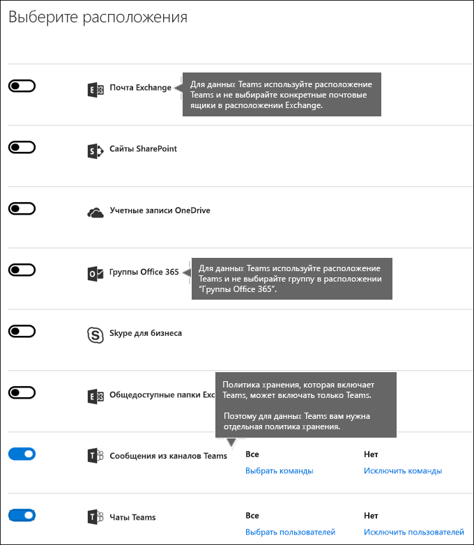
  
## Исключение определенных типов элементов Exchange из политики храненияExcluding specific types of Exchange items from a retention policy
С помощью PowerShell можно исключить определенные типы элементов Exchange из политики хранения. Например, можно исключить голосовые сообщения, мгновенные сообщения и другое содержимое Skype для бизнеса Online в почтовых ящиках. Кроме того, можно исключить календарь, заметки и задачи. Эта возможность доступна только в PowerShell, она недоступна в пользовательском интерфейсе, когда вы создаете политику хранения.By using PowerShell, you can exclude specific types of Exchange items from a retention policy. For example, you can exclude voicemail messages, IM conversations, and other Skype for Business Online content in mailboxes. You can also exclude calendar, note, and task items. This capability is available only by using PowerShell; it's not available in the UI when you create a retention policy.
  
Для этого используйте параметр `ExcludedItemClasses` командлетов `New-RetentionComplianceRule` и `Set-RetentionComplianceRule`. Дополнительные сведения о PowerShell см. далее в разделе [Поиск командлетов PowerShell для политик хранения](#find-the-powershell-cmdlets-for-retention-policies).To do this, use the  `ExcludedItemClasses` parameter of the  `New-RetentionComplianceRule` and  `Set-RetentionComplianceRule` cmdlets. For more information about PowerShell, see the below section [Find the PowerShell cmdlets for retention policies](#find-the-powershell-cmdlets-for-retention-policies).
  
## Блокировка политики храненияLocking a retention policy
От некоторых организаций требуется выполнять требования органов надзора. Например, следовать постановлению 17a-4 Комиссии по ценным бумагам и биржам (США), которое запрещает отключать политику хранения или делать ее менее строгой. Если вы настроите блокировку хранения, никто, в том числе администратор, не сможет отключить политику или сделать ее менее строгой.Some organizations may need to comply with rules defined by regulatory bodies such as the Securities and Exchange Commission (SEC) Rule 17a-4, which requires that after a retention policy is turned on, it cannot be turned off or made less restrictive. With Preservation Lock, you can lock the policy so that no one—including the administrator—can turn off the policy or make it less restrictive.
  
После блокировки политики никто не сможет ее отключить или исключить из нее расположения. В период хранения невозможно изменить или удалить содержимое, в отношении которого действует такая политика. После блокировки можно включать в политику хранения дополнительные расположения и увеличивать срок ее действия. Заблокированную политику можно только дополнить.After a policy's been locked, no one can turn it off or remove locations from the policy. And it's not possible to modify or delete content that's subject to the policy during the retention period. After the policy's been locked, the only ways you can modify the retention policy are by adding locations to it or extending its duration. A locked policy can be increased or extended, but it can't be reduced or turned off.
  
Прежде чем блокировать политику хранения, **крайне необходимо** изучить критерии организации в отношении обеспечения соответствия требованиям и **быть уверенным** в результате.Therefore, before you lock a retention policy, it's **critical** that you understand your organization's compliance requirements, and that **you do not lock a policy** until you're certain that it's what you need.
  
Вы можете заблокировать политику хранения только с помощью PowerShell. Используйте параметр `RestrictiveRetention` командлета `New-RetentionCompliancePolicy` или `Set-RetentionCompliancePolicy`. Дополнительные сведения о PowerShell см. далее в разделе [Поиск командлетов PowerShell для политик хранения](#find-the-powershell-cmdlets-for-retention-policies).You can lock a retention policy only by using PowerShell. Use the  `RestrictiveRetention` parameter of the  `New-RetentionCompliancePolicy` or  `Set-RetentionCompliancePolicy` cmdlet. For more information about PowerShell, see the below section [Find the PowerShell cmdlets for retention policies](#find-the-powershell-cmdlets-for-retention-policies).
  
## Приоритеты и принципы храненияThe principles of retention, or what takes precedence?

Возможно (и даже вероятно), что к содержимому применено несколько политик хранения с разными действиями (хранением и/или удалением) и периодом хранения. Какая политика имеет приоритет? Во-первых, вы можете быть уверены, что содержимое, сохраняемое одной политикой, не может быть безвозвратно удалено другой.It's possible or even likely that content might have several retention policies applied to it, each with a different action (retain, delete, or both) and retention period. What takes precedence? At the highest level, rest assured that content being retained by one policy can't be permanently deleted by another policy.
  
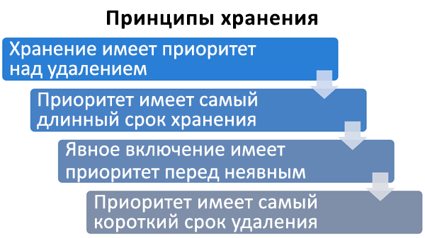
  
Чтобы понять, как различные политики хранения применяются к содержимому, запомните следующие принципы хранения:To understand how different retention policies are applied to content, keep these principles of retention in mind:
  
1. **Хранение имеет приоритет перед удалением.** Допустим, одна политика хранения предписывает удаление почты Exchange спустя три года, а другая — ее хранение в течение пяти лет с последующим удалением. Все содержимое трехлетней давности будет удалено и скрыто от пользователя, но останется в папке "Элементы с возможностью восстановления", пока его возраст не достигнет пяти лет, после чего оно будет окончательно удалено.**Retention wins over deletion.** Suppose that one retention policy says to delete Exchange email after three years, but another retention policy says to retain Exchange email for five years and then delete it. Any content that reaches three years old will be deleted and hidden from the users' view, but still retained in the Recoverable Items folder until the content reaches five years old, when it will be permanently deleted. 
    
2. **Самый продолжительный период хранения имеет приоритет.** Если к содержимому применено несколько политик, сохраняющих его, оно будет храниться до окончания самого длительного периода хранения.**The longest retention period wins.** If content's subject to multiple policies that retain content, it will be retained until the end of the longest retention period. 
    
3. **Явное включение имеет приоритет перед неявным.** Это означает следующее:**Explicit inclusion wins over implicit inclusion.** This means: 
    
    1. Если пользователь вручную назначает метку с параметрами хранения элементу, например электронному сообщению Exchange или документу OneDrive, эта метка имеет приоритет как перед политикой, назначенной на уровне сайта или почтового ящика, так и перед стандартной меткой, назначенной библиотекой документов. Например, если явная метка предписывает хранение в течение десяти лет, но политика, назначенная сайту, предписывает хранение только в течение пяти лет, то метка имеет приоритет. Обратите внимание, что автоматически применяемые метки считаются неявными, потому что их автоматически применяет Office 365.If a label with retention settings is manually assigned by a user to an item, such as an Exchange email or OneDrive document, that label takes precedence over both a policy assigned at the site or mailbox level and a default label assigned by the document library. For example, if the explicit label says to retain for ten years, but the policy assigned to the site says to retain for only five years, the label takes precedence. Note that auto-apply labels are considered implicit, not explicit, because they're applied automatically by Office 365.
    
    2. Если политика хранения включает определенное расположение, например учетную запись OneDrive для бизнеса или почтовый ящик конкретного пользователя, то эта политика имеет приоритет перед другой политикой хранения, которая применяется к учетным записям OneDrive для бизнеса или почтовым ящикам всех пользователей, но не включает почтовый ящик именно этого пользователя.If a retention policy includes a specific location, such as a specific user's mailbox or OneDrive for Business account, that policy takes precedence over another retention policy that applies to all users' mailboxes or OneDrive for Business accounts but doesn't specifically include that user's mailbox.
    
4. **Кратчайший период удаления имеет приоритет.** Если же к содержимому применено несколько политик, удаляющих его (без хранения), то оно будет удалено по истечении кратчайшего периода хранения.**The shortest deletion period wins.** Similarly, if content's subject to multiple policies that delete content (with no retention), it will be deleted at the end of the shortest retention period. 
    
Следует понимать, что принципы хранения используются как поток разрешения конфликтов (сверху вниз): если правила, применяемые всеми политиками или метками, совпадают на одном уровне, то поток переходит на уровень ниже, чтобы определить приоритет применения правил.Understand that the principles of retention work as a tie-breaking flow from top to bottom: If the rules applied by all policies or labels are the same at one level, the flow moves down to the next level to determine precedence for which rule is applied.
  
Политика хранения или метка не может безвозвратно удалить какое-либо содержимое, находящееся на удержании для обнаружения электронных данных. При отмене удержания содержимое снова становится доступным для вышеописанного процесса очистки.Finally, a retention policy or label cannot permanently delete any content that's on hold for eDiscovery. When the hold is released, the content again becomes eligible for the cleanup process described above.
  
## Вместо некоторых функций лучше использовать политику храненияUse a retention policy instead of these features

Одну политику хранения можно легко применить ко всей организации и расположениям в Office 365, включая Exchange Online, SharePoint Online, OneDrive для бизнеса и группы Office 365. Если требуется хранить или удалять содержимое в Office 365, рекомендуем использовать политику хранения. (Вы также можете использовать метки с параметрами хранения. Дополнительные сведения см. в статье [Общие сведения о метках](labels.md).)A single retention policy can easily apply to an entire organization and locations across Office 365, including Exchange Online, SharePoint Online, OneDrive for Business, and Office 365 groups. If you need to retain or delete content anywhere in Office 365, we recommend that you use a retention policy. (You can also use labels with retention settings - for more information, see [Overview of labels](labels.md).)
  
Существует ряд других функций, которые ранее использовались для хранения и удаления содержимого в Office 365. Они перечислены ниже. Эти функции будут работать наряду с политиками хранения и метками, созданными в Центре безопасности и соответствия требованиям. Но в дальнейшем для управления данными рекомендуем использовать политику хранения или метки вместо всех этих функций. Политика хранения — это единственная функция, которая может хранить и удалять содержимое в Office 365.There are several other features that have previously been used to retain or delete content in Office 365. These are listed below. These features will continue to work side by side with retention policies and labels created in the Security &amp; Compliance Center. But moving forward, for data governance, we recommend that you use a retention policy or labels instead of all of these features. A retention policy is the only feature that can both retain and delete content across Office 365.
  
### Exchange OnlineExchange Online

- [Управление делами обнаружения электронных данных в Центре безопасности и соответствия требованиям Office 365](https://support.office.com/article/edea80d6-20a7-40fb-b8c4-5e8c8395f6da) (удержание для обнаружения электронных данных)[Manage eDiscovery cases in the Office 365 Security &amp; Compliance Center](https://support.office.com/article/edea80d6-20a7-40fb-b8c4-5e8c8395f6da) (eDiscovery hold) 
    
- [Удержание на месте и хранение для судебного разбирательства](https://go.microsoft.com/fwlink/?linkid=846124) (удержание для обнаружения электронных данных)[In-Place Hold and Litigation Hold](https://go.microsoft.com/fwlink/?linkid=846124) (eDiscovery hold) 
    
- [Теги хранения и политики хранения](https://go.microsoft.com/fwlink/?linkid=846125), также называемые средствами [управления записями сообщений](https://go.microsoft.com/fwlink/?linkid=846126) (только для удаления)[Retention tags and retention policies](https://go.microsoft.com/fwlink/?linkid=846125), also known as [messaging records management (MRM)](https://go.microsoft.com/fwlink/?linkid=846126) (Deletion only) 
    
### SharePoint Online и OneDrive для бизнесаSharePoint Online and OneDrive for Business

- [Управление делами обнаружения электронных данных в Центре безопасности и соответствия требованиям Office 365](https://support.office.com/article/edea80d6-20a7-40fb-b8c4-5e8c8395f6da) (удержание для обнаружения электронных данных)[Manage eDiscovery cases in the Office 365 Security &amp; Compliance Center](https://support.office.com/article/edea80d6-20a7-40fb-b8c4-5e8c8395f6da) (eDiscovery hold) 
    
- [Добавление содержимого к делу и настройка удержания источников в Центре обнаружения электронных данных](https://support.office.com/article/54d70de9-1ec2-4325-84f3-aeb588554479) (удержание для обнаружения электронных данных)[Add content to a case and place sources on hold in the eDiscovery Center](https://support.office.com/article/54d70de9-1ec2-4325-84f3-aeb588554479) (eDiscovery hold) 
    
- [Обзор политик удаления документов](https://support.office.com/article/55e8d858-f278-482b-a198-2e62d6a2e6e5) (только удаление)[Overview of document deletion policies](https://support.office.com/article/55e8d858-f278-482b-a198-2e62d6a2e6e5) (Deletion only) 
    
- [Настройка управления записями на месте](https://support.office.com/article/7707a878-780c-4be6-9cb0-9718ecde050a) (хранение)[Configuring in place records management](https://support.office.com/article/7707a878-780c-4be6-9cb0-9718ecde050a) (Retention) 
    
- [Использование политик для закрытия и удаления сайта](https://support.office.com/article/a8280d82-27fd-48c5-9adf-8a5431208ba5) (только удаление)[Use policies for site closure and deletion](https://support.office.com/article/a8280d82-27fd-48c5-9adf-8a5431208ba5) (Deletion only) 
    
- [Политики управления информацией](intro-to-info-mgmt-policies.md) (только удаление)[Information management policies](intro-to-info-mgmt-policies.md) (Deletion only) 
    
Обратите внимание: если ранее вы применяли удержание для обнаружения электронных данных в целях управления данными, следует вместо этого использовать политику хранения, чтобы заблаговременно обеспечить соответствие требованиям. Запрос на удержание, созданный в Центре безопасности и соответствия требованиям, следует использовать только для обнаружения электронных данных.Note that if you've previously used any of the eDiscovery holds for the purpose of data governance, you should instead use a retention policy for proactive compliance. You should use a hold created in the Security &amp; Compliance Center only for eDiscovery.
  
### Политики управления данными переопределяются политиками храненияRetention policies override information management policies

На сайтах SharePoint можно использовать [политики управления данными](intro-to-info-mgmt-policies.md) для хранения содержимого. Если применить политику хранения, созданную в Центре безопасности и соответствия требованиям, к сайту, на котором уже используются политики типов контента и политики управления данными для списка или библиотеки, такие политики игнорируются, пока действует политика хранения.In SharePoint sites, you may be using [information management policies](intro-to-info-mgmt-policies.md) to retain content. If you apply a retention policy created in the Security and Compliance Center to a site that already uses content type policies or information management policies for a list or library, those policies are ignored while the retention policy is in effect. 
  
## Что произошло с политиками сохранения?What happened to preservation policies?

Если вы применяли политику сохранения, она автоматически преобразовалась в политику хранения, предусматривающую только хранение. То есть эта политика не приводит к удалению содержимого. Политика сохранения продолжит работать и сохранять содержимое, не требуя от вас каких-либо изменений. Эти политики можно найти на странице **Хранение** в Центре безопасности и соответствия требованиям. Можно изменить политику сохранения, указав другой срок хранения, но невозможно внести другие изменения (например, добавить или удалить расположения).If you were using a preservation policy, that policy has been automatically converted to a retention policy that uses only the retain action - the policy won't delete content. The preservation policy will continue to work and preserve your content without requiring any changes from you. You can find these policies on the **Retention** page in the Security &amp; Compliance Center. You can edit a preservation policy to change the retention period, but you can't make other changes, such as adding or removing locations. 
  
## РазрешенияPermissions

Членам вашей команды по обеспечению соответствия требованиям, которые будут создавать политики хранения, необходимы разрешения на доступ к Центру безопасности и соответствия требованиям. По умолчанию администратор клиента будет иметь доступ к этому расположению и сможет предоставлять ответственным за обеспечение соответствия требованиям и другим пользователям доступ к Центру безопасности и соответствия требованиям, не предоставляя им все разрешения администратора клиента. Для этого рекомендуем перейти на страницу **Разрешения** в Центре безопасности и соответствия требованиям, изменить группу ролей **Администратор соответствия требованиям** и добавить членов этой группы ролей.Members of your compliance team who will create retention policies need permissions to the Security &amp; Compliance Center. By default, your tenant admin will have access to this location and can give compliance officers and other people access to the Security &amp; Compliance Center, without giving them all of the permissions of a tenant admin. To do this, we recommend that you go to the **Permissions** page of the Security &amp; Compliance Center, edit the **Compliance Administrator** role group, and add members to that role group. 
  
Дополнительные сведения см. в статье [Предоставление пользователям доступа к Центру безопасности и соответствия требованиям Office 365](grant-access-to-the-security-and-compliance-center.md).For more information, see [Give users access to the Office 365 Security &amp; Compliance Center](grant-access-to-the-security-and-compliance-center.md).
  
Эти разрешения необходимы только для создания и применения политики хранения. Для реализации политики не требуется доступ к содержимому.These permissions are required only to create and apply a retention policy. Policy enforcement does not require access to the content.
  
## Поиск командлетов PowerShell для политик храненияFind the PowerShell cmdlets for retention policies

Чтобы использовать командлеты политики хранения:To use the retention policy cmdlets, you need to:
  
1. [Подключитесь к Центру безопасности и соответствия требованиям Office 365 с помощью удаленного сеанса PowerShell](http://go.microsoft.com/fwlink/?LinkID=799771&amp;clcid=0x409).[Connect to the Office 365 Security &amp; Compliance Center using remote PowerShell](http://go.microsoft.com/fwlink/?LinkID=799771&amp;clcid=0x409)
    
2. Используйте эти [командлеты Центра безопасности и соответствия требованиям Office 365](http://go.microsoft.com/fwlink/?LinkID=799772&amp;clcid=0x409).Use these [Office 365 Security &amp; Compliance Center cmdlets](http://go.microsoft.com/fwlink/?LinkID=799772&amp;clcid=0x409)
    
## Дополнительные сведенияMore information

- [Общие сведения о меткахOverview of labels](labels.md)
    

