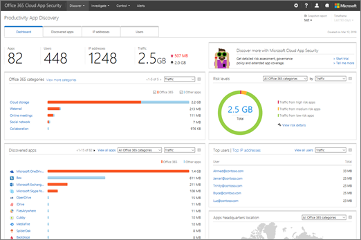

# Просмотр результатов обнаружения приложений в Office 365 Cloud App SecurityReview app discovery findings in Office 365 Cloud App Security
  
|Ознакомительная версия \* *\>*\*\*\*\*\*Evaluation\*\* \>\*\*|Планирование \* *\>*\*\*\*\*\*Planning\*\* \>\*\*|Развертывание \* *\>*\*\*\*\*\*Deployment\*\* \>\*\*|Использование \* \* \* \*\*\*\*\*Utilization\*\*\*\*|
|:-----|:-----|:-----|:-----|
|[Начало оценкиStart evaluating](office-365-cas-overview.md)   |[Начало планированияStart planning](get-ready-for-office-365-cas.md)   |[Начало развертыванияStart deploying](turn-on-office-365-cas.md)   |Вот что вам!You are here!    [Дальнейшие действияNext steps](#next-steps)   |
   
Панель мониторинга облачного обнаружения работает с журналами веб-трафика вашей организации, чтобы предоставить подробные сведения об использовании облачных приложений. Если вы являетесь глобальным администратором, администратором безопасности или средством чтения безопасности, а ваша организация [создала отчеты об обнаружении приложений в Office 365 Cloud App Security](create-app-discovery-reports-in-ocas.md), вы можете использовать панель мониторинга облачного обнаружения для получения сведений о том, как люди в вашей организации организация использует Office 365 и другие облачные приложения. (Панель мониторинга облачного обнаружения также называется производительностью обнаружения приложений.)The Cloud Discovery dashboard works with your organization's web traffic logs to provide detailed information about cloud app usage. If you're a global administrator, security administrator, or security reader, and your organization has [created app discovery reports in Office 365 Cloud App Security](create-app-discovery-reports-in-ocas.md), you can use the Cloud Discovery dashboard to gain insight into how people in your organization are using Office 365 and other cloud apps. (The Cloud Discovery dashboard is also known as Productivity App Discovery.)
  
 Панель мониторинга облачного обнаружения позволяет просматривать подробные сведения о том, как пользователи в организации используют Office 365 и другие приложения.The Cloud Discovery dashboard enables you to view detailed information about how people in your organization are using Office 365 and other apps. 
  

     
## Переход на панель мониторинга облачного обнаруженияGo to the Cloud Discovery dashboard

1. Перейдите на портал Cloud App Security ([https://portal.cloudappsecurity.com](https://portal.cloudappsecurity.com)) и выполните вход.Go to the Cloud App Security portal ([https://portal.cloudappsecurity.com](https://portal.cloudappsecurity.com)) and sign in.
    
2. Перейдите на страницу **Обнаружение** \> **облачной панели мониторинга**.Go to **Discover** \> **Cloud Discovery dashboard**.
    
## Просмотр лучших пользователей, IP-адресов, приложений и уровней рискаSee your top users, IP addresses, apps, and risk levels

С помощью панели мониторинга облачного обнаружения вы получите общий обзор приложений, которые используются с Office 365 в вашей организации, все открытые оповещения, лучшие пользователи и уровни риска.The Cloud Discovery dashboard gives you an at-a-glance overview of apps that are used with Office 365 in your organization, any open alerts, top users, and risk levels.
  

  
1. На вкладке **Dashboard (панель мониторинга** ) просмотрите общее использование облачного приложения в Организации в разделе Обзор в верхней части экрана.On the **Dashboard** tab, look at the overall cloud app use in your organization in the overview section across the top of the screen. 
    
2. Просмотрите **категории Office 365** для приложений, используемых в вашей организации.See the **Office 365 categories** for apps that are used in your organization. 
    
3. Просмотрите мини-приложение " **обнаруженные приложения** ", чтобы увидеть использование Office 365 и других приложений в этом представлении.Look at the **Discovered apps** widget to see usage of Office 365 and other apps in this view. 
    
4. ПроУчите мини-приложение **Топ пользователей** и **Топ IP-адресов** , чтобы определить тех, кто использует Office 365 и облачные приложения в вашей организации.Look at the **Top users** and **Top IP addresses** widget to identify those who use Office 365 and cloud apps the most in your organization. 
    
5. Узнайте, где люди используют приложения, по географическому расположению с помощью карты расположений в **офисе приложений** .See where the apps people are using are by geographical location by using the **Apps headquarters location** map. 
    
6. Над областью "карты" Взгляните на показатель риска обнаруженных приложений в обзоре **уровней риска** . Вы можете просмотреть риски, используя те же группы и категории, которые использовались в области **обнаруженных приложений** . Например, вы можете узнать, какой объем трафика в каждой группе относится к приложениям высокого, среднего или низкого риска.Above the maps area, take a look at the risk score of the discovered apps in the **Risk levels** overview. You can look at risks by the same groups and categories that you used in the **Discovered apps** area. For example, you can see how much traffic in each grouping is from high, medium, or low risk apps. 
    
## Подробное углублениеDive deeper into the information

Облачное обнаружение можно использовать для более глубокого изучения приложений, поддоменов, IP-адресов и пользователей.You can use Cloud Discovery to take a deeper look at apps, subdomains, IP addresses, and users.
  
1. В панели мониторинга облачного обнаружения перейдите на вкладку **обнаруженные приложения** .In the Cloud Discovery dashboard, choose the **Discovered apps** tab. 
    
2. Используйте раздел фильтры для просмотра приложений по имени, категории, уровню использования или дате последнего рассмотрения.Use the filters section to view apps by name, category, usage level, or last seen date.
    
3. В списке результатов наведите указатель мыши на имя приложения, чтобы открыть ссылку **Просмотр дочерних доменов** .In the list of results, hover by an app name to reveal the **View sub-domains** link.   Будут отображены подробные сведения о выбранном приложении.Detailed information about the selected app will appear.
    
4. Чтобы просмотреть сведения об IP-адресах, перейдите на вкладку **IP-адреса** .To view details about IP addresses, choose the **IP addresses** tab.  В списке результатов выберите отдельный IP-адрес, чтобы просмотреть более подробные сведения.In the list of results, select an individual IP address to view more detailed information.
    
5. Чтобы просмотреть сведения о пользователях Office 365 в Организации, перейдите на вкладку **Пользователи** .To view details about Office 365 users within your organization, choose the **Users** tab. 
  
## Исключение сущностейExclude entities

Вы можете исключить некоторые системные пользователи или IP-адреса, чтобы сосредоточиться на более конкретных данных.You can exclude certain system users or IP addresses in order to focus on more specific information.
  
1. Выберите **Параметры** \> **облачного обнаружения**.Choose **Settings** \> **Cloud Discovery settings**.
    
2. Выберите **исключить сущности**.Choose **Exclude entities**.
    
3. Выберите **исключенных пользователей** или **исключенных IP-адресов**.Choose either **Excluded users** or **Excluded IP addresses**.
    
4. Укажите пользователей или IP-адреса, а в поле **Комментарии** введите сведения о причинах исключения этих пользователей или IP-адресов.Specify the users or IP addresses, and in the **Comments** box, type information about why you are excluding those users or IP addresses. 
    
5. Выберите **Add** (Добавить).Choose **Add**.
    
## Дальнейшие действияNext steps

- [Просмотр оповещений и выполнение действий с нимиReview and take action on alerts](review-office-365-cas-alerts.md)
    
- [Создание отчетов об обнаружении приложенийCreate app discovery reports](create-app-discovery-reports-in-ocas.md)
    
- Обзор [действий по использованию для Office 365 Cloud App Security](utilization-activities-for-ocas.md)Review your [utilization activities for Office 365 Cloud App Security](utilization-activities-for-ocas.md)
    

