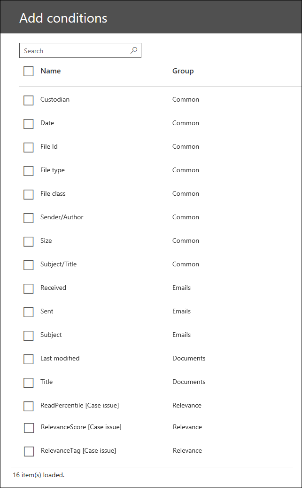

# Поиск и маркировка

В Advanced eDiscovery модуль поиска и тегирования позволяет искать, просматривать и упорядочивать документы в своем случае. В настоящее время этот модуль находится в бета-версии. Краткий пример поиска и маркировки можно найти в статье [Управление данными с помощью расширенного видео eDiscovery](https://www.youtube.com/watch?v=VaPYL3DHP6I) .

> [!NOTE]
> Чтобы можно было использовать Advanced eDiscovery, требуется подписка на Office 365 E3 с надстройкой Advanced Compliance или E5 для организации. Если у вас этого плана нет и вы хотите попробовать Advanced eDiscovery, можете [зарегистрироваться для получения пробной версии Office 365 корпоративный E5](https://go.microsoft.com/fwlink/p/?LinkID=698279). 
  
## Поиск в документах в своем случае

После обработки документов в расширенном случае обнаружения электронных данных (и при необходимости запуска модуля анализа или релевантности) можно использовать поиск и маркировку для поиска документов, а затем упорядочивать их, применяя теги, зависящие от регистра (также называемые метками). Вы можете определить поисковый запрос с помощью предоставленных карточек условий или с помощью KQL языка запросов в карточке ключевых слов. Поддерживается общий синтаксис KQL, например, AND, OR, NOT и NEAR (n), а также замыкающий символ подстановочного знака (*). 

В следующей таблице перечислены свойства, которые можно искать с помощью запроса ключевого слова KQL. Кроме того, вы можете использовать карточку условия в средстве расширенного поиска eDiscovery для добавления условия (для выбранных свойств) в поисковый запрос.

|**Свойство**|**Описание**|
|:-----|:-----|
|**каселабел**   | Имя тега, созданного/примененного при разметке документа.   |
|**Хранитель**   | Хранитель, связанный с документом; подлежит ограничениям.   |
|**будущ**   | Дата отправки для электронной почты; Дата изменения документов сайта.   |
|**ИД**   | Идентификатор файла в случае.   |
|**filetype**   | Собственное расширение файла.   |
|**филекласс**   | Электронная почта, документ или вложение.   |
|**сендераусор**   | Отправитель сообщения электронной почты; Автор документов сайта.   |
|**Размер**   | Размер файла в КИЛОБАЙТах.   |
|**субжекттитле**   | Тема сообщения электронной почты; название документов сайта.   |
|**СК.**   | Поле "Скрытая копия" сообщения электронной почты.   |
|**копия;**   | Поле "копия" сообщения электронной почты.   |
|**участниками**   | Адрес электронной почты всех участников в цепочке электронной почты, в том числе отсутствующие ссылки.   |
|**доставлен**   | Дата получения электронного сообщения.   |
|**получателей**   | Получатели сообщения электронной почты, включаемые в поля "Кому", "копия" или "Скрытая копия".   |
|**отправитель;**   | Отправитель сообщения электронной почты.   |
|**ластмодифиеддате**   | Дата последнего изменения документа сайта.   |
|**отправлял**   | Дата отправки сообщения электронной почты.   |
|**Кому**   | Получатель, указанный в поле "Кому" сообщения электронной почты.   |
|**Редактирование**   | Автор документа сайта.   |
|**title**   | Название документа сайта.   |
|**доминантсеме**\*   | Тема элемента.   |
|**семеслист**\*   | Темы, связанные с элементом.   |
|**реадперцентиле_ [иссуенум]**\*\*   | Засчитанный процентиль элемента для вопроса, определяемого [иссуенум].   |
|**релеванцескоре_ [иссуенум]**\*\*   | Показатель релевантности элемента для вопроса, определенного с помощью [иссуенум].   |
|**релеванцетаг_ [TagName]**\*\*   | Если элемент был помечен вручную для релевантности, тег определяется [TagName].   |
|||

\*Доступно только в том случае, если запущен модуль Themes.

\*\*Доступно, только если запущен модуль релевантности.

Кроме того, вы можете использовать карточку условия в средстве расширенного поиска eDiscovery, чтобы добавить условие (для выбранных свойств) в поисковый запрос. На следующем снимке экрана показаны условия, которые можно добавить в запрос. Столбец **Group** указывает, применяется ли свойство к электронной почте, документам сайта или обоим (указывается *общим*значением). Этот столбец также определяет доступные для поиска свойства, доступные после запуска модуля релевантности.

Дополнительные сведения о свойствах, включаемых в поиск, можно найти в разделе [запросы и условия поиска по ключевым словам](keyword-queries-and-search-conditions.md).
  
## См. также

[Office 365 Advanced eDiscovery](office-365-advanced-ediscovery.md)
  
[Понимание оценки релевантности](assessment-in-relevance-in-advanced-ediscovery.md)
  
[Маркировка и оценка](tagging-and-assessment-in-advanced-ediscovery.md)
  
[РасСтановка тегов и релевантности](tagging-and-relevance-training-in-advanced-ediscovery.md)
  
[Анализ релевантности отслеживания](track-relevance-analysis-in-advanced-ediscovery.md)
  
[Выбор на основе результатов](decision-based-on-the-results-in-advanced-ediscovery.md)
  
[Анализ релевантности тестирования](test-relevance-analysis-in-advanced-ediscovery.md)

