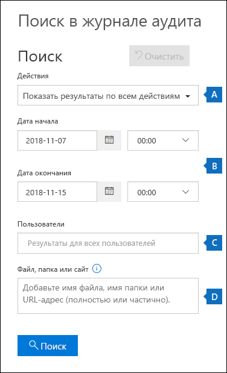
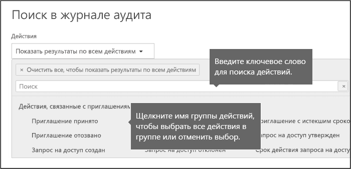
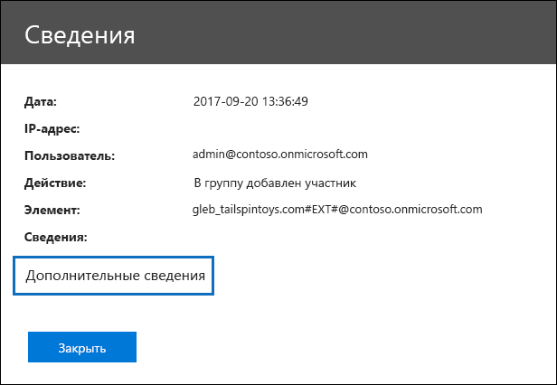
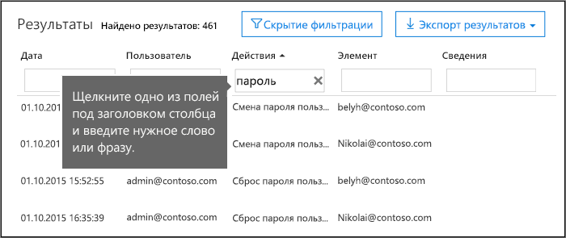
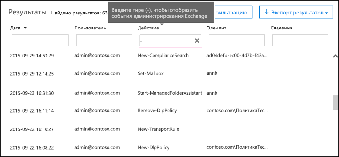

# <a name="search-the-audit-log-in-the-office-365-security--compliance-center"></a><span data-ttu-id="b799b-103">Поиск в журнале аудита в Office 365 безопасности & центре соответствия требованиям</span><span class="sxs-lookup"><span data-stu-id="b799b-103">Search the audit log in the Office 365 Security & Compliance Center</span></span>

<span data-ttu-id="b799b-p101">Требуется для поиска, если пользователь просматривать конкретного документа или очищены элемента из их почтовых ящиков? Если Да, можно использовать безопасности Office 365 &amp; центре соответствия требованиям к поиск в журнале аудита объединенных для просмотра активности пользователей и администраторов в организации Office 365. Почему журнал объединенных аудита? Так как можно выполнить поиск для следующих типов активности пользователя и администратора в Office 365:</span><span class="sxs-lookup"><span data-stu-id="b799b-p101">Need to find if a user viewed a specific document or purged an item from their mailbox? If so, you can use the Office 365 Security &amp; Compliance Center to search the unified audit log to view user and administrator activity in your Office 365 organization. Why a unified audit log? Because you can search for the following types of user and admin activity in Office 365:</span></span>
  
- <span data-ttu-id="b799b-108">Действие пользователя в SharePoint Online и OneDrive для бизнеса</span><span class="sxs-lookup"><span data-stu-id="b799b-108">User activity in SharePoint Online and OneDrive for Business</span></span>
    
- <span data-ttu-id="b799b-109">Действие пользователя в Exchange Online (Ведение журнала аудита почтовых ящиков Exchange)</span><span class="sxs-lookup"><span data-stu-id="b799b-109">User activity in Exchange Online (Exchange mailbox audit logging)</span></span>
    
    > [!IMPORTANT]
    > <span data-ttu-id="b799b-p102">Аудита ведения журналов может быть включена для каждого почтового ящика пользователя перед действие пользователя в Exchange Online в журнал будет занесен. Дополнительные сведения можно [Включить аудит в Office 365 почтового ящика](enable-mailbox-auditing.md).</span><span class="sxs-lookup"><span data-stu-id="b799b-p102">Mailbox audit logging must be turned on for each user mailbox before user activity in Exchange Online will be logged. For more information, see [Enable mailbox auditing in Office 365](enable-mailbox-auditing.md).</span></span>
  
- <span data-ttu-id="b799b-112">Действия администратора в SharePoint Online</span><span class="sxs-lookup"><span data-stu-id="b799b-112">Admin activity in SharePoint Online</span></span>
    
- <span data-ttu-id="b799b-113">Действия администратора в Azure Active Directory (службы каталогов для Office 365)</span><span class="sxs-lookup"><span data-stu-id="b799b-113">Admin activity in Azure Active Directory (the directory service for Office 365)</span></span>
    
- <span data-ttu-id="b799b-114">Действия администратора в Exchange Online (Ведение журнала аудита администратора Exchange)</span><span class="sxs-lookup"><span data-stu-id="b799b-114">Admin activity in Exchange Online (Exchange admin audit logging)</span></span>
    
- <span data-ttu-id="b799b-115">Пользователь и администратор активности в Sway</span><span class="sxs-lookup"><span data-stu-id="b799b-115">User and admin activity in Sway</span></span>
    
- <span data-ttu-id="b799b-116">действия обнаружения электронных данных в Office 365 безопасности & центре соответствия требованиям</span><span class="sxs-lookup"><span data-stu-id="b799b-116">eDiscovery activities in the Office 365 Security & Compliance Center</span></span>
    
- <span data-ttu-id="b799b-117">Пользователь и администратор активности в Power BI</span><span class="sxs-lookup"><span data-stu-id="b799b-117">User and admin activity in Power BI</span></span>
    
- <span data-ttu-id="b799b-118">Пользователь и администратор активности в группах Майкрософт</span><span class="sxs-lookup"><span data-stu-id="b799b-118">User and admin activity in Microsoft Teams</span></span>

- <span data-ttu-id="b799b-119">Пользователь и администратор активности в Dynamics 365</span><span class="sxs-lookup"><span data-stu-id="b799b-119">User and admin activity in Dynamics 365</span></span>
    
- <span data-ttu-id="b799b-120">Пользователь и администратор активности в Yammer</span><span class="sxs-lookup"><span data-stu-id="b799b-120">User and admin activity in Yammer</span></span>
 
- <span data-ttu-id="b799b-121">Пользователь и администратор активности в потоке Microsoft</span><span class="sxs-lookup"><span data-stu-id="b799b-121">User and admin activity in Microsoft Flow</span></span>
    
- <span data-ttu-id="b799b-122">Пользователь и администратор активности в потоке Microsoft</span><span class="sxs-lookup"><span data-stu-id="b799b-122">User and admin activity in Microsoft Stream</span></span>
    
   
## <a name="before-you-begin"></a><span data-ttu-id="b799b-123">Перед началом работы</span><span class="sxs-lookup"><span data-stu-id="b799b-123">Before you begin</span></span>

<span data-ttu-id="b799b-124">Обязательно прочтите следующие элементы, прежде чем начать поиск в Office 365 журнал аудита.</span><span class="sxs-lookup"><span data-stu-id="b799b-124">Be sure to read the following items before you start searching the Office 365 audit log.</span></span>
  
- <span data-ttu-id="b799b-p103">Вы (или другой администрирования) необходимо сначала включить ведение журнала аудита, перед тем как начать поиск в журнале аудита Office 365. Включить эту возможность, просто щелкните **Начать запись действия администратора и пользователя** на странице **поиска журнала аудита** в системы &amp; центре соответствия требованиям. (Если не отображается ссылка, аудит уже был включен для вашей организации.) После включения его, отображается сообщение, рекомендующее подготовлено журнала аудита и что можно выполнить поиск в нескольких часов после завершения подготовки. Имеется только один раз это сделать.</span><span class="sxs-lookup"><span data-stu-id="b799b-p103">You (or another admin) must first turn on audit logging before you can start searching the Office 365 audit log. To turn it on, just click **Start recording user and admin activity** on the **Audit log search** page in the Security &amp; Compliance Center. (If you don't see this link, auditing has already been turned on for your organization.) After you turn it on, a message is displayed that says the audit log is being prepared and that you can run a search in a couple of hours after the preparation is complete. You only have to do this once.</span></span> 
    
    > [!NOTE]
    > <span data-ttu-id="b799b-p104">Мы в процессе для включения аудита по умолчанию. До тех пор можно включить его как описано выше.</span><span class="sxs-lookup"><span data-stu-id="b799b-p104">We're in the process of turning on auditing by default. Until then, you can turn it on as previously described.</span></span> 
  
- <span data-ttu-id="b799b-p105">Вы должны быть назначены роли журналы аудита только для просмотра или журналов аудита в Exchange Online поиск в журнале аудита Office 365. По умолчанию эти роли, назначенные группы ролей управления организацией и Управление соответствием требованиям на странице " **разрешения** " в центре администрирования Exchange. Чтобы предоставить пользователю возможность выполнять поиск в журнале аудита Office 365 с минимальным уровнем привилегий, создание группы настраиваемых ролей в Exchange Online, добавления роли журналы аудита только для просмотра или журналов аудита и нажмите Добавить пользователя в качестве члена в новую группу ролей. Для получения дополнительных сведений см [групп ролей управление Exchange Online](https://go.microsoft.com/fwlink/p/?LinkID=730688).</span><span class="sxs-lookup"><span data-stu-id="b799b-p105">You have to be assigned the View-Only Audit Logs or Audit Logs role in Exchange Online to search the Office 365 audit log. By default, these roles are assigned to the Compliance Management and Organization Management role groups on the **Permissions** page in the Exchange admin center. To give a user the ability to search the Office 365 audit log with the minimum level of privileges, you can create a custom role group in Exchange Online, add the View-Only Audit Logs or Audit Logs role, and then add the user as a member of the new role group. For more information, see [Manage role groups in Exchange Online](https://go.microsoft.com/fwlink/p/?LinkID=730688).</span></span>
    
    > [!IMPORTANT]
    > <span data-ttu-id="b799b-p106">Если вы назначили роли журналы аудита только для просмотра или журналов аудита на странице " **разрешения** " в параметрах безопасности &amp; центре соответствия требованиям, они не сможет получить поиск в журнале аудита Office 365. Необходимо назначить разрешения в Exchange Online. Это основной командлет используется для поиска по журналу аудита — это командлет командной Exchange Online.</span><span class="sxs-lookup"><span data-stu-id="b799b-p106">If you assign a user the View-Only Audit Logs or Audit Logs role on the **Permissions** page in the Security &amp; Compliance Center, they won't be able to search the Office 365 audit log. You have to assign the permissions in Exchange Online. This is because the underlying cmdlet used to search the audit log is an Exchange Online cmdlet.</span></span> 
  
- <span data-ttu-id="b799b-p107">При выполнении аудита действий, пользователь или администратор записи аудита и сохраняется в журнале аудита Office 365 для вашей организации. Продолжительность времени, записи аудита нераспределенной (и для поиска в журнале аудита) зависит от подписки Office 365 и специально тип лицензии, назначенной конкретному пользователю.</span><span class="sxs-lookup"><span data-stu-id="b799b-p107">When an audited activity is performed by a user or admin, an audit record is generated and stored in the Office 365 audit log for your organization. The length of time that an audit record is retained (and searchable in the audit log) depends on your Office 365 subscription, and specifically the type of the license that is assigned to a specific user.</span></span>

     - <span data-ttu-id="b799b-p108">**Office 365 E3** - аудита записями, сохраняются в течение 90 дней. Это означает, что можно выполнить поиск журнала аудита для мероприятий, которые были выполнены за последние 90 дней.</span><span class="sxs-lookup"><span data-stu-id="b799b-p108">**Office 365 E3** - Audit records are retained for 90 days. That means you can search the audit log for activities that were performed within the last 90 days.</span></span>

     - <span data-ttu-id="b799b-p109">**Office 365 E5** - 365 дней (один год) для хранения записей аудита. Это означает, что можно выполнить поиск журнала аудита для мероприятий, которые были выполнены за последний год. Хранение записей аудита для одного года также доступен для пользователей, которые назначены лицензии E3 и Exchange Online план 1 и иметь лицензию надстроек Office 365 дополнительные соответствия.</span><span class="sxs-lookup"><span data-stu-id="b799b-p109">**Office 365 E5** - Audit records are retained for 365 days (one year). That means you can search the audit log for activities that were performed within the last year. Retaining audit records for one year is also available for users that are assigned an E3/Exchange Online Plan 1 license and have an Office 365 Advanced Compliance add-on license.</span></span>

        > [!NOTE]
        > <span data-ttu-id="b799b-p110">Период хранения один год для записей аудита для организаций E5 (или E3 организаций, которые есть дополнительные соответствия дополнительный компонент лицензии) в настоящее время доступен только в рамках программы закрытый предварительного просмотра. Для регистрации в программу предварительного просмотра файл запроса с помощью [Службы поддержки Майкрософт](https://docs.microsoft.com/en-us/office365/admin/contact-support-for-business-products?redirectSourcePath=%252fen-us%252farticle%252fcontact-support-for-business-products-admin-help-32a17ca7-6fa0-4870-8a8d-e25ba4ccfd4b&view=o365-worldwide&tabs=online) и включить следующее описание вам требуется помощь: «Долгосрочного аудита журнала закрытый ознакомительную версию Office 365».</span><span class="sxs-lookup"><span data-stu-id="b799b-p110">The one-year retention period for audit records for E5 organizations (or E3 organizations that have Advanced Compliance add-on licenses) is currently available only as part of a private preview program. To enroll in this preview program, please file a request with [Microsoft Support](https://docs.microsoft.com/en-us/office365/admin/contact-support-for-business-products?redirectSourcePath=%252fen-us%252farticle%252fcontact-support-for-business-products-admin-help-32a17ca7-6fa0-4870-8a8d-e25ba4ccfd4b&view=o365-worldwide&tabs=online) and include the following as the description of what you need help with: "Long-term Office 365 audit log private preview".</span></span>

- <span data-ttu-id="b799b-147">Если вы хотите отключить поиск журнала аудита в Office 365 для вашей организации, в удаленной оболочки PowerShell, подключенных к организации Exchange Online можно выполните следующую команду:</span><span class="sxs-lookup"><span data-stu-id="b799b-147">If you want to turn off audit log search in Office 365 for your organization, you can run the following command in remote PowerShell connected to your Exchange Online organization:</span></span>
    
  ```
  Set-AdminAuditLogConfig -UnifiedAuditLogIngestionEnabled $false
  ```

    <span data-ttu-id="b799b-148">Чтобы включить аудит поиска еще раз, можно выполнить следующую команду в Exchange Online PowerShell:</span><span class="sxs-lookup"><span data-stu-id="b799b-148">To turn on audit search again, you can run the following command in Exchange Online PowerShell:</span></span>
    
  ```
  Set-AdminAuditLogConfig -UnifiedAuditLogIngestionEnabled $true
  ```

    <span data-ttu-id="b799b-149">Дополнительные сведения можно [Отключить поиск в журнале аудита в Office 365](turn-audit-log-search-on-or-off.md).</span><span class="sxs-lookup"><span data-stu-id="b799b-149">For more information, see [Turn off audit log search in Office 365](turn-audit-log-search-on-or-off.md).</span></span>
    
- <span data-ttu-id="b799b-p111">Как было сказано ранее основной командлет используется для поиска по журналу аудита — это командлет Exchange Online которого является **UnifiedAuditLog поиска**. Это означает, что этот командлет можно использовать для поиска по журналу аудита Office 365 вместо на странице **поиска журналов аудита** в безопасности &amp; центре соответствия требованиям. Необходимо выполнить этот командлет в удаленной оболочки PowerShell, подключенных к организации Exchange Online. Для получения дополнительных сведений см [UnifiedAuditLog поиска](https://go.microsoft.com/fwlink/p/?linkid=834776).</span><span class="sxs-lookup"><span data-stu-id="b799b-p111">As previously stated, the underlying cmdlet used to search the audit log is an Exchange Online cmdlet, which is **Search-UnifiedAuditLog**. That means you can use this cmdlet to search the Office 365 audit log instead of using the **Audit log search** page in the Security &amp; Compliance Center. You have to run this cmdlet in remote PowerShell connected to your Exchange Online organization. For more information, see [Search-UnifiedAuditLog](https://go.microsoft.com/fwlink/p/?linkid=834776).</span></span>
    
- <span data-ttu-id="b799b-p112">Если вы хотите программным путем загрузки данных из журнала аудита Office 365, рекомендуется использовать API действия для управления Office 365 вместо использования скрипта PowerShell. API действия для управления Office 365 — это веб-службы REST, которые можно использовать для разработки операций, безопасности и соответствия требованиям мониторинга решений для вашей организации. Для получения дополнительных сведений см [Справочник по API действия для управления Office 365](https://go.microsoft.com/fwlink/?linkid=852309).</span><span class="sxs-lookup"><span data-stu-id="b799b-p112">If you want to programmatically download data from the Office 365 audit log, we recommend that you use the Office 365 Management Activity API instead of using a PowerShell script. The Office 365 Management Activity API is a REST web service that you can use to develop operations, security, and compliance monitoring solutions for your organization. For more information, see [Office 365 Management Activity API reference](https://go.microsoft.com/fwlink/?linkid=852309).</span></span>
    
- <span data-ttu-id="b799b-p113">Он может занять более 30 минут или копирование на 24 часа после событие происходит соответствующие записи журнала аудита для отображения в результатах поиска. В следующей таблице показаны время, необходимое для различных служб в Office 365.</span><span class="sxs-lookup"><span data-stu-id="b799b-p113">It can take up to 30 minutes or up to 24 hours after an event occurs for the corresponding audit log entry to be displayed in the search results. The following table shows the time it takes for the different services in Office 365.</span></span>
    
    |<span data-ttu-id="b799b-159">**Служба Office 365**</span><span class="sxs-lookup"><span data-stu-id="b799b-159">**Office 365 service**</span></span>|<span data-ttu-id="b799b-160">**30 minutes**</span><span class="sxs-lookup"><span data-stu-id="b799b-160">**30 minutes**</span></span>|<span data-ttu-id="b799b-161">**24 часа**</span><span class="sxs-lookup"><span data-stu-id="b799b-161">**24 hours**</span></span>|
    |:-----|:-----|:-----|
    |<span data-ttu-id="b799b-162">Анализ угроз и расширенной защитой</span><span class="sxs-lookup"><span data-stu-id="b799b-162">Advanced Threat Protection and Threat Intelligence</span></span>  <br/> || |
    |<span data-ttu-id="b799b-164">Azure Active Directory (события входа в систему пользователя)</span><span class="sxs-lookup"><span data-stu-id="b799b-164">Azure Active Directory (user login events)</span></span>  <br/> ||           <br/> |
    |<span data-ttu-id="b799b-166">Azure Active Directory (admin события)</span><span class="sxs-lookup"><span data-stu-id="b799b-166">Azure Active Directory (admin events)</span></span>  <br/> || |
    |<span data-ttu-id="b799b-168">Azure Active Directory (события входа в систему пользователя)</span><span class="sxs-lookup"><span data-stu-id="b799b-168">Azure Active Directory (user login events)</span></span>  <br/> ||           <br/> |
    |<span data-ttu-id="b799b-170">Защита от потери данных</span><span class="sxs-lookup"><span data-stu-id="b799b-170">Data Loss Prevention</span></span>  <br/> |           <br/>| |
    |<span data-ttu-id="b799b-172">Dynamics 365 CRM</span><span class="sxs-lookup"><span data-stu-id="b799b-172">Dynamics 365 CRM</span></span> <br/> |           <br/>| |
    |<span data-ttu-id="b799b-174">Обнаружение электронных данных</span><span class="sxs-lookup"><span data-stu-id="b799b-174">eDiscovery</span></span>  <br/> |           <br/>| |
    |<span data-ttu-id="b799b-176">Exchange Online</span><span class="sxs-lookup"><span data-stu-id="b799b-176">Exchange Online</span></span>  <br/> |           <br/> ||
    |<span data-ttu-id="b799b-178">Microsoft Flow</span><span class="sxs-lookup"><span data-stu-id="b799b-178">Microsoft Flow</span></span>  <br/> |           <br/>| |
    |<span data-ttu-id="b799b-180">Microsoft Forms</span><span class="sxs-lookup"><span data-stu-id="b799b-180">Microsoft Forms</span></span>  <br/> |           <br/>| |
    |<span data-ttu-id="b799b-182">Microsoft Project</span><span class="sxs-lookup"><span data-stu-id="b799b-182">Microsoft Project</span></span>  <br/> |           <br/>| |
    |<span data-ttu-id="b799b-184">Microsoft Stream</span><span class="sxs-lookup"><span data-stu-id="b799b-184">Microsoft Stream</span></span>  <br/> |           <br/>| |
    |<span data-ttu-id="b799b-186">Microsoft Teams</span><span class="sxs-lookup"><span data-stu-id="b799b-186">Microsoft Teams</span></span>  <br/> |           <br/> ||
    |<span data-ttu-id="b799b-188">Power BI</span><span class="sxs-lookup"><span data-stu-id="b799b-188">Power BI</span></span>  <br/> |           <br/>| |
    |<span data-ttu-id="b799b-190">Безопасность &amp; центре соответствия требованиям</span><span class="sxs-lookup"><span data-stu-id="b799b-190">Security &amp; Compliance Center</span></span>  <br/> |           <br/> ||
    |<span data-ttu-id="b799b-192">SharePoint Online и OneDrive для бизнеса</span><span class="sxs-lookup"><span data-stu-id="b799b-192">SharePoint Online and OneDrive for Business</span></span>  <br/> |           <br/> ||
    |<span data-ttu-id="b799b-194">Sway</span><span class="sxs-lookup"><span data-stu-id="b799b-194">Sway</span></span>  <br/> ||           <br/> |
    |<span data-ttu-id="b799b-196">Yammer</span><span class="sxs-lookup"><span data-stu-id="b799b-196">Yammer</span></span>  <br/> ||           <br/> |
   
- <span data-ttu-id="b799b-p114">Azure Active Directory (Azure AD) — это служба каталогов для Office 365. Журнал аудита объединенных содержит пользователей и групп, приложения, домена и каталог действий, выполняемых в центре администрирования Office 365 или в Azure в портал управления. Полный список событий Azure AD в разделе [Azure Active Directory отчет аудит](https://go.microsoft.com/fwlink/p/?LinkID=616549).</span><span class="sxs-lookup"><span data-stu-id="b799b-p114">Azure Active Directory (Azure AD) is the directory service for Office 365. The unified audit log contains user, group, application, domain, and directory activities performed in the Office 365 admin center or in the in Azure management portal. For a complete list of Azure AD events, see [Azure Active Directory Audit Report Events](https://go.microsoft.com/fwlink/p/?LinkID=616549).</span></span>
    
- <span data-ttu-id="b799b-p115">Exchange Online журналы аудита состоят из двух типов событий: Exchange admin (действиях, выполненных администраторов) и события почтового ящика (действий пользователей на почтовые ящики). Обратите внимание на то, что аудит почтового ящика не включена по умолчанию. Это должен быть включен для каждого почтового ящика пользователя перед событиями почтовых ящиков, которые можно найти в журнале аудита Office 365. Дополнительные сведения об аудите почтовых ящиков и почтовых ящиков, аудит действий, которые записываются в разделе [Включить аудит в Office 365 почтового ящика](enable-mailbox-auditing.md).</span><span class="sxs-lookup"><span data-stu-id="b799b-p115">Exchange Online audit logs consist of two types of events: Exchange admin events (actions taken by administrators) and mailbox events (actions taken by users on mailboxes). Note that mailbox auditing isn't enabled by default. It must be enable for each user mailbox before mailbox events can be searched for in the Office 365 audit log. For more information about mailbox auditing and the mailbox auditing actions that are logged, see [Enable mailbox auditing in Office 365](enable-mailbox-auditing.md).</span></span>
    
- <span data-ttu-id="b799b-p116">Ведение журнала аудита для Power BI не включена по умолчанию. Для поиска мероприятий Power BI в журнале аудита Office 365, необходимо включить аудит на портале администрирования Power BI. Для получения инструкций обратитесь к разделу «Журналы аудита» в [портал администрирования Power BI](https://docs.microsoft.com/power-bi/service-admin-portal#audit-logs).</span><span class="sxs-lookup"><span data-stu-id="b799b-p116">Audit logging for Power BI isn't enabled by default. To search for Power BI activities in the Office 365 audit log, you have to enable auditing in the Power BI admin portal. For instructions, see the "Audit logs" section in [Power BI admin portal](https://docs.microsoft.com/power-bi/service-admin-portal#audit-logs).</span></span>
    
    
## <a name="search-the-audit-log"></a><span data-ttu-id="b799b-208">Поиск в журнале аудита</span><span class="sxs-lookup"><span data-stu-id="b799b-208">Search the audit log</span></span>

<span data-ttu-id="b799b-209">Вот как это делается при поиске в журнал аудита в Office 365.</span><span class="sxs-lookup"><span data-stu-id="b799b-209">Here's the process for searching the audit log in Office 365.</span></span>
  
[<span data-ttu-id="b799b-210">Шаг 1: Запустить поиск журнала аудита</span><span class="sxs-lookup"><span data-stu-id="b799b-210">Step 1: Run an audit log search</span></span>](#step-1-run-an-audit-log-search)
  
[<span data-ttu-id="b799b-211">Шаг 2: Просмотр результатов поиска</span><span class="sxs-lookup"><span data-stu-id="b799b-211">Step 2: View the search results</span></span>](#step-2-view-the-search-results)

[<span data-ttu-id="b799b-212">Шаг 3: Фильтровать результаты поиска</span><span class="sxs-lookup"><span data-stu-id="b799b-212">Step 3: Filter the search results</span></span>](#step-3-filter-the-search-results)

[<span data-ttu-id="b799b-213">Шаг 4: Экспорт результатов поиска в файл</span><span class="sxs-lookup"><span data-stu-id="b799b-213">Step 4: Export the search results to a file</span></span>](#step-4-export-the-search-results-to-a-file)
  
### <a name="step-1-run-an-audit-log-search"></a><span data-ttu-id="b799b-214">Шаг 1: Запустить поиск журнала аудита</span><span class="sxs-lookup"><span data-stu-id="b799b-214">Step 1: Run an audit log search</span></span>

1. <span data-ttu-id="b799b-215">Перейдите по ссылке [https://protection.office.com](https://protection.office.com).</span><span class="sxs-lookup"><span data-stu-id="b799b-215">Go to [https://protection.office.com](https://protection.office.com).</span></span>
    
    > [!TIP]
    > <span data-ttu-id="b799b-p117">Используйте закрытый сеанса (обычный сеанс) для доступа к Office 365 безопасность &amp; центра обработки соответствия требованиям, так как это предотвратит учетные данные, которые в настоящее время входа в систему от использования. Чтобы открыть сеанс просмотра InPrivate в Internet Explorer или пограничного сервера Microsoft, просто нажмите сочетание клавиш CTRL + SHIFT + P. Чтобы открыть закрытый сеанса в Google Chrome (называемые incognito окна), нажмите клавиши CTRL + SHIFT + N.</span><span class="sxs-lookup"><span data-stu-id="b799b-p117">Use a private browsing session (not a regular session) to access the Office 365 Security &amp; Compliance Center because this will prevent the credential that you are currently logged on with from being used. To open an InPrivate Browsing session in Internet Explorer or Microsoft Edge, just press CTRL+SHIFT+P. To open a private browsing session in Google Chrome (called an incognito window), press CTRL+SHIFT+N.</span></span> 
  
2. <span data-ttu-id="b799b-219">Войдите в Office 365 с помощью своей рабочей или учебной учетной записи.</span><span class="sxs-lookup"><span data-stu-id="b799b-219">Sign in to Office 365 using your work or school account.</span></span>
    
3. <span data-ttu-id="b799b-220">В левой области безопасности &amp; центре соответствия требованиям, нажмите кнопку **поиска &amp; расследования**и нажмите кнопку **Поиск журнала аудита**.</span><span class="sxs-lookup"><span data-stu-id="b799b-220">In the left pane of the Security &amp; Compliance Center, click **Search &amp; investigation**, and then click **Audit log search**.</span></span>
    
    <span data-ttu-id="b799b-221">Отображается страница **поиска журнала аудита** .</span><span class="sxs-lookup"><span data-stu-id="b799b-221">The **Audit log search** page is displayed.</span></span> 
    
    
  
    > [!NOTE]
    > <span data-ttu-id="b799b-p118">Необходимо первого включить ведение журнала аудита перед запуском поискового запроса журнала аудита. Если отображается ссылка **Начать запись действия администратора и пользователя** , щелкните ее, чтобы включить аудит. Если не отображается ссылка, аудит уже был включен для вашей организации.</span><span class="sxs-lookup"><span data-stu-id="b799b-p118">You have to first turn on audit logging before you can run an audit log search. If the **Start recording user and admin activity** link is displayed, click it to turn on auditing. If you don't see this link, auditing has already been turned on for your organization.</span></span> 
  
4. <span data-ttu-id="b799b-226">Настройте следующие условия поиска:</span><span class="sxs-lookup"><span data-stu-id="b799b-226">Configure the following search criteria:</span></span>
    
    <span data-ttu-id="b799b-p119">a. **действия** нажмите кнопку раскрывающегося списка для отображения действия, которые можно выполнить поиск. Действия пользователя и администратора расположены в группы действий, связанных с ними. Вы можете выбрать действия или щелкнуть имя группы активности, чтобы выбрать все действия в группе. Кроме того, можно нажать кнопку выбранного действия для снимите флажок. После выполнения поиска отображаются только записи журнала аудита для выбранного действия. Выбрав **Показать результаты для всех действий** будет отображаться результаты для всех действий, выполняемых с помощью выбранного пользователя или группы пользователей.</span><span class="sxs-lookup"><span data-stu-id="b799b-p119">a. **Activities** Click the drop-down list to display the activities that you can search for. User and admin activities are organized in to groups of related activities. You can select specific activities or you can click the activity group name to select all activities in the group. You can also click a selected activity to clear the selection. After you run the search, only the audit log entries for the selected activities are displayed. Selecting **Show results for all activities** will display results for all activities performed by the selected user or group of users.</span></span> 
    
    <span data-ttu-id="b799b-p120">Более 100 пользователей и администрирования действия записываются в журнал аудита Office 365. Перейдите на вкладку **Audited действия** в разделе данной статьи, чтобы просмотреть описания каждой операции в каждой из служб Office 365.</span><span class="sxs-lookup"><span data-stu-id="b799b-p120">Over 100 user and admin activities are logged in the Office 365 audit log. Click the **Audited activities** tab at the topic of this article to see the descriptions of every activity in each of the different Office 365 services.</span></span> 
    
    <span data-ttu-id="b799b-p121">по умолчанию выбран б. **Дата начала** и **Дата окончания** за последние семь дней. Выберите дату и время диапазона просмотра событий, возникших в течение этого периода. Дата и время представлены в формате по Гринвичу (UTC). Максимальный период, которые можно выбрать — 90 дней. Если выбранного диапазона дат больше 90 дней выводится сообщение об ошибке.</span><span class="sxs-lookup"><span data-stu-id="b799b-p121">b. **Start date** and **End date** The last seven days are selected by default. Select a date and time range to display the events that occurred within that period. The date and time are presented in Coordinated Universal Time (UTC) format. The maximum date range that you can specify is 90 days. An error is displayed if the selected date range is greater than 90 days.</span></span> 
    
    > [!TIP]
    > <span data-ttu-id="b799b-p122">Если вы используете максимальный период 90 дней, выберите текущее время, **Дата начала**. В противном случае вы получите сообщение о том, дату начала является более ранней, чем дата окончания. Если включен аудит за последние 90 дней, не может запуститься максимальный период до даты, которая была включить аудит.</span><span class="sxs-lookup"><span data-stu-id="b799b-p122">If you're using the maximum date range of 90 days, select the current time for the **Start date**. Otherwise, you'll receive an error saying that the start date is earlier than the end date. If you've turned on auditing within the last 90 days, the maximum date range can't start before the date that auditing was turned on.</span></span> 
  
    <span data-ttu-id="b799b-p123">c. **пользователей** щелкните в этом поле и затем выберите одного или нескольких пользователей, чтобы отобразить поиска по результатам. Записи журнала аудита для выбранной операции, выполненные для пользователей, выбранного в этом поле отображаются в списке результатов. Оставьте это поле пустым для возвращения записей для всех пользователей (и учетных записей служб) в организации.</span><span class="sxs-lookup"><span data-stu-id="b799b-p123">c. **Users** Click in this box and then select one or more users to display search results for. The audit log entries for the selected activity performed by the users you select in this box are displayed in the list of results. Leave this box blank to return entries for all users (and service accounts) in your organization.</span></span> 
    
    <span data-ttu-id="b799b-p124">г., **файла, папки или сайта** введите некоторые или все имя файла или папки для поиска действия, связанные с файлов из папки, содержащей указанного ключевого слова. Можно также указать URL-адрес файла или папки. Если вы используете: URL-адрес, должен быть выбран тип полный URL-адрес или просто введите часть URL-адреса, не добавляйте любые специальные символы или пробелы.</span><span class="sxs-lookup"><span data-stu-id="b799b-p124">d. **File, folder, or site** Type some or all of a file or folder name to search for activity related to the file of folder that contains the specified keyword. You can also specify a URL of a file or folder. If you use a URL, be sure the type the full URL path or if you just type a portion of the URL, don't include any special characters or spaces.</span></span> 
    
    <span data-ttu-id="b799b-253">Оставьте это поле пустым для возвращения записей для всех файлов и папок в организации.</span><span class="sxs-lookup"><span data-stu-id="b799b-253">Leave this box blank to return entries for all files and folders in your organization.</span></span>
    
5. <span data-ttu-id="b799b-254">Нажмите кнопку **поиска** , чтобы запустить поиск, используя условия поиска.</span><span class="sxs-lookup"><span data-stu-id="b799b-254">Click **Search** to run the search using your search criteria.</span></span> 
    
    <span data-ttu-id="b799b-p125">Загрузить результаты поиска, а через несколько секунд, отображаемых в области **результатов**. После завершения поиска отображается число обнаруженных результатов. Обратите внимание на то, что не более 5000 событий будет отображаться в области **результатов** с шагом 150 события; Если более 5000 события условиям поиска отображаются 5000 последних событий.</span><span class="sxs-lookup"><span data-stu-id="b799b-p125">The search results are loaded, and after a few moments they are displayed under **Results**. When the search is finished, the number of results found is displayed. Note that a maximum of 5,000 events will be displayed in the **Results** pane in increments of 150 events; if more than 5,000 events meet the search criteria, the most recent 5,000 events are displayed.</span></span> 
    
    
  
  
#### <a name="tips-for-searching-the-audit-log"></a><span data-ttu-id="b799b-259">Советы по поиску в журнал аудита</span><span class="sxs-lookup"><span data-stu-id="b799b-259">Tips for searching the audit log</span></span>

- <span data-ttu-id="b799b-p126">Вы можете выбрать действия для поиска, щелкнув имя действия. Или можно выполнить поиск для всех действий в группу (например, **файлов и папок действия**) щелкните имя группы. Если выбран действия, можно щелкнуть его для отмены выбора. Поле «Поиск» можно также использовать для отображения действия, которые содержат ключевое слово, которое задано.</span><span class="sxs-lookup"><span data-stu-id="b799b-p126">You can select specific activities to search for by clicking on the activity name. Or you can search for all activities in a group (such as **File and folder activities**) by clicking on the group name. If an activity is selected, you can click it to cancel the selection. You can also use the search box to display the activities that contain the keyword that you type.</span></span>
    
    
  
- <span data-ttu-id="b799b-p127">Необходимо выбрать **Показать результаты для всех действий** в списке **действий** для отображения событий из журнала аудита действий администратора Exchange. События из этого журнала аудита отображаемое имя командлета (например, **Set-Mailbox** ) в столбце **Действие** в результаты. Для получения дополнительных сведений выберите вкладку **действия Audited** данного раздела и нажмите кнопку **действия администратора Exchange**.</span><span class="sxs-lookup"><span data-stu-id="b799b-p127">You have to select **Show results for all activities** in the **Activities** list to display events from the Exchange admin audit log. Events from this audit log display a cmdlet name (for example, **Set-Mailbox** ) in the **Activity** column in the results. For more information, click the **Audited activities** tab in this topic and then click **Exchange admin activities**.</span></span>
    
    <span data-ttu-id="b799b-p128">Аналогично существуют некоторые аудита действий, не имеющих соответствующих элементов в списке **действий** . Если вы знаете имя операции для этих действий, можно найти все действия, а затем отфильтровать результаты, введя имя операции, в поле значение в столбце **Действие** . Просмотреть [Шаг 3: фильтровать результаты поиска](#step-3-filter-the-search-results) Дополнительные сведения о фильтрации результатов.</span><span class="sxs-lookup"><span data-stu-id="b799b-p128">Similarly, there are some auditing activities that don't have a corresponding item in the **Activities** list. If you know the name of the operation for these activities, you can search for all activities, then filter the results by typing the name of the operation in the box for the **Activity** column. See [Step 3: Filter the search results](#step-3-filter-the-search-results) for more information about filtering the results.</span></span> 
    
- <span data-ttu-id="b799b-p129">Нажмите кнопку, **снимите флажок** , чтобы очистить текущие условия поиска. Диапазон дат возвращает значения по умолчанию за последние семь дней. Можно нажать кнопку **Очистить все, чтобы показать результаты для всех действий** для отмены все выбранные действия.</span><span class="sxs-lookup"><span data-stu-id="b799b-p129">Click **Clear** to clear the current search criteria. The date range returns to the default of the last seven days. You can also click **Clear all to show results for all activities** to cancel all selected activities.</span></span> 
    
- <span data-ttu-id="b799b-p130">Если 5000 результатов, возможно, можно предположить, что более 5000 события удовлетворении условий поиска. Можно уточнить условия поиска и повторно выполнить поиска для возвращения результатов меньшего числа или экспортировать все результаты поиска, выбрав **экспортировать результаты** \> **Загрузите все результаты**.</span><span class="sxs-lookup"><span data-stu-id="b799b-p130">If 5,000 results are found, you can probably assume there are more than 5,000 events that met the search criteria. You can either refine the search criteria and rerun the search to return fewer results, or you can export all of the search results by selecting **Export results** \> **Download all results**.</span></span>

  
### <a name="step-2-view-the-search-results"></a><span data-ttu-id="b799b-276">Шаг 2: Просмотр результатов поиска</span><span class="sxs-lookup"><span data-stu-id="b799b-276">Step 2: View the search results</span></span>

<span data-ttu-id="b799b-p131">Результаты поиска журнала аудита отображаются в области **результатов** на странице **поиска журналов аудита** . Как уже указано более 5000 (самые новые) событий отображаются с шагом 150 событий. Чтобы отобразить дополнительные события можно использовать полосы прокрутки в области **результатов** или следует нажать клавиши **Shift + End** просмотра событий, затем 150.</span><span class="sxs-lookup"><span data-stu-id="b799b-p131">The results of an audit log search are displayed under **Results** on the **Audit log search** page. As previously stated a maximum of 5,000 (newest) events are displayed in increments of 150 events. To display more events you can use the scroll bar in the **Results** pane or you can press **Shift + End** to display the next 150 events.</span></span> 
  
<span data-ttu-id="b799b-280">Результаты содержат следующие сведения о каждом событии, возвращенных в результате поиска.</span><span class="sxs-lookup"><span data-stu-id="b799b-280">The results contain the following information about each event returned by the search.</span></span>
  
- <span data-ttu-id="b799b-281">**Дата:** Дата и время (в формате UTC) при возникновении события.</span><span class="sxs-lookup"><span data-stu-id="b799b-281">**Date:** The date and time (in UTC format) when the event occurred.</span></span> 
    
- <span data-ttu-id="b799b-p132">**IP-адрес:** IP-адрес устройства, который использовался при входе действия. IP-адрес отображается в формате адреса IPv4 или IPv6.</span><span class="sxs-lookup"><span data-stu-id="b799b-p132">**IP address:** The IP address of the device that was used when the activity was logged. The IP address is displayed in either an IPv4 or IPv6 address format.</span></span> 
    
- <span data-ttu-id="b799b-284">**Пользователя:** Пользователь (или учетная запись службы), выполнить действие, которое вызвало событие.</span><span class="sxs-lookup"><span data-stu-id="b799b-284">**User:** The user (or service account) who performed the action that triggered the event.</span></span> 
    
- <span data-ttu-id="b799b-p133">**Активности:** Операции, выполненные пользователем. Это значение соответствует действия, выбранные в раскрывающемся списке **действия** . Для события из журнала аудита действий администратора Exchange значение в этом столбце — это командлет Exchange.</span><span class="sxs-lookup"><span data-stu-id="b799b-p133">**Activity:** The activity performed by the user. This value corresponds to the activities that you selected in the **Activities** drop down list. For an event from the Exchange admin audit log, the value in this column is an Exchange cmdlet.</span></span> 
    
- <span data-ttu-id="b799b-p134">**Элемента:** Объект, которые были созданы или изменены в результате соответствующих действий. Например файл, который был просматривать или изменять или учетная запись пользователя, который был обновлен. Не все действия иметь значение в этом столбце.</span><span class="sxs-lookup"><span data-stu-id="b799b-p134">**Item:** The object that was created or modified as a result of the corresponding activity. For example, the file that was viewed or modified or the user account that was updated. Not all activities have a value in this column.</span></span> 
    
- <span data-ttu-id="b799b-p135">**Подробно:** Дополнительная информация об активности. Еще раз не все действия будут иметь значение.</span><span class="sxs-lookup"><span data-stu-id="b799b-p135">**Detail:** Additional detail about an activity. Again, not all activities will have a value.</span></span> 
    
> [!TIP]
> <span data-ttu-id="b799b-p136">Щелкните заголовок столбца в области **результатов** для сортировки результатов. Можно сортировать результаты от А до я или Z A. Щелкните заголовок **даты** для сортировки результатов от более ранних к новым или от новых к старым.</span><span class="sxs-lookup"><span data-stu-id="b799b-p136">Click a column header under **Results** to sort the results. You can sort the results from A to Z or Z to A. Click the **Date** header to sort the results from oldest to newest or newest to oldest.</span></span> 
  
#### <a name="view-the-details-for-a-specific-event"></a><span data-ttu-id="b799b-295">Просмотр сведений для определенных событий</span><span class="sxs-lookup"><span data-stu-id="b799b-295">View the details for a specific event</span></span>

<span data-ttu-id="b799b-p137">Дополнительные сведения о событии можно просмотреть с помощью команды запись событий в списке результатов поиска. Отображается страница **сведений** , содержащий подробные свойства из записи журнала событий. Отображаемые свойства зависят от службы Office 365, в которой происходит событие. Чтобы открыть эти сведения, нажмите кнопку **Дополнительные сведения**. Описание приведено в разделе [журнал аудита подробные свойства в Office 365](detailed-properties-in-the-office-365-audit-log.md).</span><span class="sxs-lookup"><span data-stu-id="b799b-p137">You can view more details about an event by clicking the event record in the list of search results. A **Details** page is displayed that contains the detailed properties from the event record. The properties that are displayed depend on the Office 365 service in which the event occurs. To display these details, click **More information**. For descriptions, see [Detailed properties in the Office 365 audit log](detailed-properties-in-the-office-365-audit-log.md).</span></span>
  


  
### <a name="step-3-filter-the-search-results"></a><span data-ttu-id="b799b-302">Шаг 3: Фильтровать результаты поиска</span><span class="sxs-lookup"><span data-stu-id="b799b-302">Step 3: Filter the search results</span></span>

<span data-ttu-id="b799b-p138">В дополнение к сортировке, также можно отфильтровать результаты поиска журнала аудита. Это прекрасная возможность, которая поможет вам быстро фильтровать результаты для определенных пользователей или активности. Можно создать исходный широкий поиска и быстро фильтровать результаты для просмотра определенных событий. Затем можно уменьшить количество условий поиска и повторно запустить поиска для возвращения меньшего размера, более кратким набора результатов.</span><span class="sxs-lookup"><span data-stu-id="b799b-p138">In addition to sorting, you can also filter the results of an audit log search. This is a great feature that can help you quickly filter the results for a specific user or activity. You can initially create a wide search and then quickly filter the results to see specific events. Then you can narrow the search criteria and re-run the search to return a smaller, more concise set of results.</span></span>
  
<span data-ttu-id="b799b-307">Для фильтрации результатов:</span><span class="sxs-lookup"><span data-stu-id="b799b-307">To filter the results:</span></span>
  
1. <span data-ttu-id="b799b-308">Запуск поискового запроса журнала аудита.</span><span class="sxs-lookup"><span data-stu-id="b799b-308">Run an audit log search.</span></span>
    
2. <span data-ttu-id="b799b-309">При отображении результатов, щелкните **фильтровать результаты**.</span><span class="sxs-lookup"><span data-stu-id="b799b-309">When the results are displayed, click **Filter results**.</span></span>
    
    <span data-ttu-id="b799b-310">Ключевое слово полей отображаются под заголовком каждого столбца.</span><span class="sxs-lookup"><span data-stu-id="b799b-310">Keyword boxes are displayed under each column header.</span></span>
    
3. <span data-ttu-id="b799b-p139">Выберите один из поля в разделе заголовка столбца и введите слово или фразу, в зависимости от столбца, по которому выполняется фильтрация на. Результаты будут динамически перенастроить просмотра событий, которые соответствуют фильтра.</span><span class="sxs-lookup"><span data-stu-id="b799b-p139">Click one of the boxes under a column header and type a word or phrase, depending on the column you're filtering on. The results will dynamically readjust to display the events that match your filter.</span></span>
    
    
  
4. <span data-ttu-id="b799b-314">Чтобы очистить фильтр, нажмите кнопку **X** в поле фильтра или просто щелкните **Скрыть фильтрации**.</span><span class="sxs-lookup"><span data-stu-id="b799b-314">To clear a filter, click the **X** in the filter box or just click **Hide filtering**.</span></span>
    
> [!TIP]
> <span data-ttu-id="b799b-p140">Чтобы отобразить события из журнала аудита действий администратора Exchange, введите **-** (тире) в поле Фильтр **действий** . Это позволит отображать имена командлетов, которые отображаются в столбце **Действие** для события администрирования Exchange. Затем можно сортировать имена в алфавитном порядке.</span><span class="sxs-lookup"><span data-stu-id="b799b-p140">To display events from the Exchange admin audit log, type a **-** (dash) in the **Activity** filter box. This will display cmdlet names, which are displayed in the **Activity** column for Exchange admin events. Then you can sort the cmdlet names in alphabetical order.</span></span> 

### <a name="step-4-export-the-search-results-to-a-file"></a><span data-ttu-id="b799b-318">Шаг 4: Экспорт результатов поиска в файл</span><span class="sxs-lookup"><span data-stu-id="b799b-318">Step 4: Export the search results to a file</span></span>

<span data-ttu-id="b799b-p141">Результаты поиска журнала аудита можно экспортировать в файл значений, разделенных запятыми (CSV) запятой на локальном компьютере. Можно открыть этот файл в Microsoft Excel и использовать компонентов, таких как поиск, сортировка, фильтрация и Разделение одного столбца (, который содержит ячейки с несколькими значениями) в несколько столбцов.</span><span class="sxs-lookup"><span data-stu-id="b799b-p141">You can export the results of an audit log search to a comma separated value (CSV) file on your local computer. You can open this file in Microsoft Excel and use features such as search, sorting, filtering, and splitting a single column (that contains multi-value cells) into multiple columns.</span></span>
  
1. <span data-ttu-id="b799b-321">Запустить поиск журнала аудита и нажмите Изменить условия поиска, пока получите требуемых результатов.</span><span class="sxs-lookup"><span data-stu-id="b799b-321">Run an audit log search, and then revise the search criteria until you have the desired results.</span></span>
    
2. <span data-ttu-id="b799b-322">Нажмите кнопку **Экспорт результатов** и выберите один из следующих вариантов:</span><span class="sxs-lookup"><span data-stu-id="b799b-322">Click **Export results** and select one of the following options:</span></span> 
    
  - <span data-ttu-id="b799b-p142">**Сохранить загрузить результаты** Выберите этот параметр, чтобы экспортировать только записи, которые отображаются в области **результатов** на \*\* поиска журналов аудита \*\* страницы. CSV-файл, который будет загружен содержит те же столбцы (и данные) отображается на странице (даты, пользователей, активность, элемента и подробные сведения). Дополнительный столбец (с именем **Дополнительные**) включен в CSV-файл, содержащий дополнительные сведения из записи журнала аудита. Так как экспорте одинаковые результаты, которые загружаются (и для просмотра) на странице **поиска журнала аудита** экспортируются не более 5000 записей.</span><span class="sxs-lookup"><span data-stu-id="b799b-p142">**Save loaded results** Choose this option to export only the entries that are displayed under **Results** on the \*\* Audit log search \*\* page. The CSV file that is downloaded contains the same columns (and data) displayed on the page (Date, User, Activity, Item, and Details). An additional column (named **More**) is included in the CSV file that contains more information from the audit log entry. Because you're exporting the same results that are loaded (and viewable) on the **Audit log search** page, a maximum of 5,000 entries are exported.</span></span> 
    
  - <span data-ttu-id="b799b-p143">**Загрузить все результаты** Выберите этот параметр, чтобы экспортировать все записи из журнала аудита Office 365, которые соответствуют условиям поиска. Для большого набора результатов поиска выберите этот параметр, чтобы загрузить все записи из журнала аудита в дополнение к 5000 результатов, которые могут быть отображены на странице **поиска журнала аудита** . Этот параметр, загрузите необработанные данные из журнала аудита в CSV-файл и содержит дополнительные сведения из журнала аудита записи в столбце с именем **AuditData**. Может потребоваться больше времени для загрузки файла, если выбран этот параметр экспорта, так как файл может быть значительно больше, если выбран параметр других загружается.</span><span class="sxs-lookup"><span data-stu-id="b799b-p143">**Download all results** Choose this option to export all entries from the Office 365 audit log that meet the search criteria. For a large set of search results, choose this option to download all entries from the audit log in addition to the 5,000 results that can be displayed on the **Audit log search** page. This option will download the raw data from the audit log to a CSV file, and contains additional information from the audit log entry in a column named **AuditData**. It may take longer to download the file if you choose this export option because the file may be much larger than the one that's downloaded if you choose the other option.</span></span>
    
    > [!IMPORTANT]
    > <span data-ttu-id="b799b-p144">Не более 50 000 записей в CSV-файл можно загрузить из поиска журналов аудита единого. Если 50 000 записей загружаются в CSV-файл, вероятно, можно предположить, что более 50 000 событий, выполнены условия поиска. Чтобы экспортировать больше, чем это ограничение, попробуйте использовать диапазон дат для уменьшения количества записей журнала аудита. Может потребоваться использовать несколько поисков для работы с меньшего размера диапазона дат для экспорта более 50 000 записей.</span><span class="sxs-lookup"><span data-stu-id="b799b-p144">You can download a maximum of 50,000 entries to a CSV file from a single audit log search. If 50,000 entries are downloaded to the CSV file, you can probably assume there are more than 50,000 events that met the search criteria. To export more than this limit, try using a date range to reduce the number of audit log entries. You might have to run multiple searches with smaller date ranges to export more than 50,000 entries.</span></span> 
  
3. <span data-ttu-id="b799b-335">После выбора параметра экспорта сообщения отображается в нижней части окна, предлагающее Открытие CSV-файл, сохраните его в папку файлы для загрузки и сохраните его в указанную папку.</span><span class="sxs-lookup"><span data-stu-id="b799b-335">After you select an export option, a message is displayed at the bottom of the window that prompts you to open the CSV file, save it to the Downloads folder, or save it to a specific folder.</span></span>

  
#### <a name="more-information-about-exporting-audit-log-search-results"></a><span data-ttu-id="b799b-336">Дополнительные сведения о Экспорт результатов поиска в журнале аудита</span><span class="sxs-lookup"><span data-stu-id="b799b-336">More information about exporting audit log search results</span></span>

- <span data-ttu-id="b799b-p145">**Загрузить все результаты** загружаются необработанные данные из журнала аудита Office 365 в CSV-файл. Этот файл содержит имена различных столбцов (CreationDate, UserIds, операции, AuditData) чем файл, который загружается при выборе параметра **сохранения загруженных результатов** . Также могут быть различные значения в двух различных CSV-файлы для того же действия. Например, активности в столбце **Действие** в CSV-файл и может иметь разные значения, чем версия «понятное», которая отображается в столбце **Действие** на странице **поиска журнала аудита** ; Например MailboxLogin и пользователь входил в почтовый ящик.</span><span class="sxs-lookup"><span data-stu-id="b799b-p145">The **Download all results** option downloads the raw data from the Office 365 audit log to a CSV file. This file contains different column names (CreationDate, UserIds, Operation, AuditData) than the file that's downloaded if you select the **Save loaded results** option. The values in the two different CSV files for the same activity may also be different. For example, the activity in the **Action** column in the CSV file and may have a different value than the "user-friendly" version that's displayed in the **Activity** column on the **Audit log search** page; for example, MailboxLogin vs. User signed in to mailbox.</span></span>
    
- <span data-ttu-id="b799b-p146">При загрузке всех результатов CSV-файл содержит столбец с именем **AuditData**, который содержит дополнительные сведения о каждом событии. Как было сказано ранее этот столбец содержит свойство Многозначный для нескольких свойств из записи журнала аудита. Каждой из пар **свойство: значение** в этом свойстве Многозначный, разделенных запятыми. Можно использовать Power запроса в Excel для разделения этот столбец в несколько столбцов, чтобы каждое свойство будет иметь свои собственные столбца. Это позволит программная сортировка и фильтрация по одному или нескольким из этих свойств. Чтобы узнать, как это сделать, обратитесь к разделу «Разделение столбец с разделителем» разбиению [столбец текста (Power запроса)](https://support.office.com/article/5282d425-6dd0-46ca-95bf-8e0da9539662).</span><span class="sxs-lookup"><span data-stu-id="b799b-p146">If you download all results, the CSV file contains a column named **AuditData**, which contains additional information about each event. As previously stated, this column contains a multi-value property for multiple properties from the audit log record. Each of the **property:value** pairs in this multi-value property are separated by a comma. You can use the Power Query in Excel to split this column into multiple columns so that each property will have its own column. This will let you sort and filter on one or more of these properties. To learn how to do this, see the "Split a column by delimiter" section in [Split a column of text (Power Query)](https://support.office.com/article/5282d425-6dd0-46ca-95bf-8e0da9539662).</span></span>
    
    <span data-ttu-id="b799b-347">После разделения в столбце **AuditData** можно фильтровать по столбцу **операций** для отображения подробных свойств для определенного типа действия.</span><span class="sxs-lookup"><span data-stu-id="b799b-347">After you split the **AuditData** column, you can filter on the **Operations** column to display the detailed properties for a specific type of activity.</span></span> 
    
- <span data-ttu-id="b799b-p147">Существует ограничение 3,060 символов для данных, отображаемых в поле **AuditData** для записи аудита. В случае превышения 3,060 знаков усекается данных в этом поле.</span><span class="sxs-lookup"><span data-stu-id="b799b-p147">There's a 3,060-character limit for the data that's displayed in the **AuditData** field for an audit record. If the 3,060-character limit is exceeded, the data in this field is truncated.</span></span> 
    
- <span data-ttu-id="b799b-p148">При загрузке всех результатов из поискового запроса, который содержит события из различных службах Office 365 **AuditData** столбец в CSV-файл содержит различные свойства, в зависимости от того, что служба действие было выполнено в. Примеры записей из журналов аудита Exchange и Azure AD: свойство с именем **ResultStatus** , указывающее, если действие успешно или нет. Это свойство не входит в состав для событий в SharePoint. Аналогично, события SharePoint имеют свойство, указывающее сайт действий, связанных с URL-адрес для файлов и папок. Для устранения этой проблемы рекомендуется использовать различных операций поиска для экспорта результатов для действий из одной службы.</span><span class="sxs-lookup"><span data-stu-id="b799b-p148">When you download all results from a search query that contains events from different Office 365 services, the **AuditData** column in the CSV file contains different properties depending on which service the action was performed in. For example, entries from Exchange and Azure AD audit logs include a property named **ResultStatus** that indicates if the action was successful or not. This property isn't included for events in SharePoint. Similarly, SharePoint events have a property that identifies the site URL for file and folder related activities. To mitigate this behavior, consider using different searches to export the results for activities from a single service.</span></span> 
    
    <span data-ttu-id="b799b-355">Описание свойства, перечисленные в столбце **AuditData** в CSV-файла при загрузке всех результатов и служба каждого один применяется к, просмотрите [журнал аудита подробные свойства в Office 365](detailed-properties-in-the-office-365-audit-log.md).</span><span class="sxs-lookup"><span data-stu-id="b799b-355">For a description of the properties that are listed in the **AuditData** column in the CSV file when you download all results, and the service each one applies to, see [Detailed properties in the Office 365 audit log](detailed-properties-in-the-office-365-audit-log.md).</span></span>

## <a name="audited-activities"></a><span data-ttu-id="b799b-356">Аудит действий</span><span class="sxs-lookup"><span data-stu-id="b799b-356">Audited activities</span></span>

<span data-ttu-id="b799b-p149">В таблицах в этом разделе описываются действия, которые были проверены в Office 365. Поиск эти события поиск по ключевым словам аудита журнал безопасности &amp; центре соответствия требованиям. Перейдите на вкладку **поиска журнала аудита** для получения пошаговых инструкций.</span><span class="sxs-lookup"><span data-stu-id="b799b-p149">The tables in this section describe the activities that are audited in Office 365. You can search for these events by searching the audit log in the Security &amp; Compliance Center. Click the **Search the audit log** tab for step-by-step instructions.</span></span> 
  
<span data-ttu-id="b799b-p150">Эти таблицы группы связанных действий или действий для определенной службы Office 365. Таблицы содержат понятное имя, отображаемое в раскрывающемся списке **действия** и имя соответствующего операции, который отображается в подробные сведения о записи аудита и в CSV-файла при экспорте результатов поиска. Описания подробных сведений в разделе [журнал аудита подробные свойства в Office 365](detailed-properties-in-the-office-365-audit-log.md).</span><span class="sxs-lookup"><span data-stu-id="b799b-p150">These tables group related activities or the activities from a specific Office 365 service. The tables include the friendly name that's displayed in the **Activities** drop-down list and the name of the corresponding operation that appears in the detailed information of an audit record and in the CSV file when you export the search results. For descriptions of the detailed information, see [Detailed properties in the Office 365 audit log](detailed-properties-in-the-office-365-audit-log.md).</span></span>
  
<span data-ttu-id="b799b-363">Щелкните одну из следующих ссылок, чтобы перейти к определенной таблице.</span><span class="sxs-lookup"><span data-stu-id="b799b-363">Click one of the following links to go to a specific table.</span></span>
  
||||
|:-----|:-----|:-----|
|[<span data-ttu-id="b799b-364">Файл и действий</span><span class="sxs-lookup"><span data-stu-id="b799b-364">File and page activities</span></span>](#file-and-page-activities)<br/> |[<span data-ttu-id="b799b-365">Папка действий</span><span class="sxs-lookup"><span data-stu-id="b799b-365">Folder activities</span></span>](#folder-activities)<br/> |[<span data-ttu-id="b799b-366">Совместное использование и доступ действия запроса</span><span class="sxs-lookup"><span data-stu-id="b799b-366">Sharing and access request activities</span></span>](#sharing-and-access-request-activities)<br/> |
|[<span data-ttu-id="b799b-367">Операции синхронизации</span><span class="sxs-lookup"><span data-stu-id="b799b-367">Synchronization activities</span></span>](#synchronization-activities)<br/> |[<span data-ttu-id="b799b-368">Действия сайта администрирования</span><span class="sxs-lookup"><span data-stu-id="b799b-368">Site administration activities</span></span>](#site-administration-activities)<br/> |[<span data-ttu-id="b799b-369">Действия почтовых ящиков Exchange</span><span class="sxs-lookup"><span data-stu-id="b799b-369">Exchange mailbox activities</span></span>](#exchange-mailbox-activities)<br/> |
|[<span data-ttu-id="b799b-370">Sway действия</span><span class="sxs-lookup"><span data-stu-id="b799b-370">Sway activities</span></span>](#sway-activities) <br/> |[<span data-ttu-id="b799b-371">Действия пользователя администрирования</span><span class="sxs-lookup"><span data-stu-id="b799b-371">User administration activities</span></span>](#user-administration-activities) <br/> |[<span data-ttu-id="b799b-372">Действия администрирования группы Azure AD</span><span class="sxs-lookup"><span data-stu-id="b799b-372">Azure AD group administration activities</span></span>](#azure-ad-group-administration-activities) <br/> |
|[<span data-ttu-id="b799b-373">Действия администрирования приложения</span><span class="sxs-lookup"><span data-stu-id="b799b-373">Application administration activities</span></span>](#application-administration-activities) <br/> |[<span data-ttu-id="b799b-374">Роль администрирования действия</span><span class="sxs-lookup"><span data-stu-id="b799b-374">Role administration activities</span></span>](#role-administration-activities) <br/> |[<span data-ttu-id="b799b-375">Каталог действий администрирования</span><span class="sxs-lookup"><span data-stu-id="b799b-375">Directory administration activities</span></span>](#directory-administration-activities) <br/> |
|[<span data-ttu-id="b799b-376">действия обнаружения электронных данных</span><span class="sxs-lookup"><span data-stu-id="b799b-376">eDiscovery activities</span></span>](#ediscovery-activities) <br/> |[<span data-ttu-id="b799b-377">Действия бизнес-Аналитики питания</span><span class="sxs-lookup"><span data-stu-id="b799b-377">Power BI activities</span></span>](#power-bi-activities) <br/> |[<span data-ttu-id="b799b-378">Действия рабочих групп Майкрософт</span><span class="sxs-lookup"><span data-stu-id="b799b-378">Microsoft Teams activities</span></span>](#microsoft-teams-activities) <br/> |
|[<span data-ttu-id="b799b-379">Действия Yammer</span><span class="sxs-lookup"><span data-stu-id="b799b-379">Yammer activities</span></span>](#yammer-activities) <br/> |[<span data-ttu-id="b799b-380">Microsoft Flow</span><span class="sxs-lookup"><span data-stu-id="b799b-380">Microsoft Flow</span></span>](#microsoft-flow) <br/> |[<span data-ttu-id="b799b-381">Microsoft Stream</span><span class="sxs-lookup"><span data-stu-id="b799b-381">Microsoft Stream</span></span>](#microsoft-stream) <br/>|
|[<span data-ttu-id="b799b-382">Журнала аудита действий администратора Exchange</span><span class="sxs-lookup"><span data-stu-id="b799b-382">Exchange admin audit log</span></span>](#exchange-admin-audit-log) <br/> |
   
  
### <a name="file-and-page-activities"></a><span data-ttu-id="b799b-383">Файл и действий</span><span class="sxs-lookup"><span data-stu-id="b799b-383">File and page activities</span></span>
  
<span data-ttu-id="b799b-384">В следующей таблице описываются действия файлов и страниц в SharePoint Online и OneDrive для бизнеса.</span><span class="sxs-lookup"><span data-stu-id="b799b-384">The following table describes the file and page activities in SharePoint Online and OneDrive for Business.</span></span>
  
|<span data-ttu-id="b799b-385">**Понятное имя**</span><span class="sxs-lookup"><span data-stu-id="b799b-385">**Friendly name**</span></span>|<span data-ttu-id="b799b-386">**Operation**</span><span class="sxs-lookup"><span data-stu-id="b799b-386">**Operation**</span></span>|<span data-ttu-id="b799b-387">**Описание**</span><span class="sxs-lookup"><span data-stu-id="b799b-387">**Description**</span></span>|
|:-----|:-----|:-----|
|<span data-ttu-id="b799b-388">Обращений к файлам</span><span class="sxs-lookup"><span data-stu-id="b799b-388">Accessed file</span></span>  <br/> |<span data-ttu-id="b799b-389">FileAccessed</span><span class="sxs-lookup"><span data-stu-id="b799b-389">FileAccessed</span></span>  <br/> |<span data-ttu-id="b799b-390">Учетная запись пользователя или системы обращается к файлу.</span><span class="sxs-lookup"><span data-stu-id="b799b-390">User or system account accesses a file.</span></span>  <br/> |
|<span data-ttu-id="b799b-391">(нет)</span><span class="sxs-lookup"><span data-stu-id="b799b-391">(none)</span></span>  <br/> |<span data-ttu-id="b799b-392">FileAccessedExtended</span><span class="sxs-lookup"><span data-stu-id="b799b-392">FileAccessedExtended</span></span>  <br/> |<span data-ttu-id="b799b-p151">Это связано с «файл Accessed» активности (FileAccessed). Событие FileAccessedExtended — это то же лицо постоянно обращается к файлу в течение длительного времени (до 3 часа). Протоколирование событий FileAccessedExtended предназначен для уменьшения числа FileAccessed событий, которые записываются в файл постоянно при доступе к. Это помогает сократить пропускаемых нескольких записей FileAccessed для что практически не отличается активность пользователей и позволяет сосредоточиться на событие FileAccessed начальной (и более важных).</span><span class="sxs-lookup"><span data-stu-id="b799b-p151">This is related to the "Accessed file" (FileAccessed) activity. A FileAccessedExtended event is logged when the same person continually accesses a file for an extended period of time (up to 3 hours). The purpose of logging FileAccessedExtended events is to reduce the number of FileAccessed events that are logged when a file is continually accessed. This helps reduce the noise of multiple FileAccessed records for what is essentially the same user activity, and lets you focus on the initial (and more important) FileAccessed event.</span></span>  <br/> |
|<span data-ttu-id="b799b-397">Возвращен в файл</span><span class="sxs-lookup"><span data-stu-id="b799b-397">Checked in file</span></span>  <br/> |<span data-ttu-id="b799b-398">FileCheckedIn</span><span class="sxs-lookup"><span data-stu-id="b799b-398">FileCheckedIn</span></span>  <br/> |<span data-ttu-id="b799b-399">Для отправки в документ, который они извлечен из библиотеки документов.</span><span class="sxs-lookup"><span data-stu-id="b799b-399">User checks in a document that they checked out from a document library.</span></span>  <br/> |
|<span data-ttu-id="b799b-400">Извлеченный файл</span><span class="sxs-lookup"><span data-stu-id="b799b-400">Checked out file</span></span>  <br/> |<span data-ttu-id="b799b-401">FileCheckedOut</span><span class="sxs-lookup"><span data-stu-id="b799b-401">FileCheckedOut</span></span>  <br/> |<span data-ttu-id="b799b-p152">Пользователь извлекает документ находится в библиотеке документов. Пользователи могут извлекать и вносить изменения в документы, общие с ними.</span><span class="sxs-lookup"><span data-stu-id="b799b-p152">User checks out a document located in a document library. Users can check out and make changes to documents that have been shared with them.</span></span>  <br/> |
|<span data-ttu-id="b799b-404">Скопированный файл</span><span class="sxs-lookup"><span data-stu-id="b799b-404">Copied file</span></span>  <br/> |<span data-ttu-id="b799b-405">FileCopied</span><span class="sxs-lookup"><span data-stu-id="b799b-405">FileCopied</span></span>  <br/> |<span data-ttu-id="b799b-p153">Пользователь копирует документ с сайта. Скопированный файл можно сохранить в другую папку на сайте.</span><span class="sxs-lookup"><span data-stu-id="b799b-p153">User copies a document from a site. The copied file can be saved to another folder on the site.</span></span>  <br/> |
|<span data-ttu-id="b799b-408">Удаленный файл</span><span class="sxs-lookup"><span data-stu-id="b799b-408">Deleted file</span></span>  <br/> |<span data-ttu-id="b799b-409">FileDeleted</span><span class="sxs-lookup"><span data-stu-id="b799b-409">FileDeleted</span></span>  <br/> |<span data-ttu-id="b799b-410">Пользователь удаляет документ с сайта.</span><span class="sxs-lookup"><span data-stu-id="b799b-410">User deletes a document from a site.</span></span>  <br/> |
|<span data-ttu-id="b799b-411">Удаленный файл из корзины</span><span class="sxs-lookup"><span data-stu-id="b799b-411">Deleted file from recycle bin</span></span>  <br/> |<span data-ttu-id="b799b-412">FileDeletedFirstStageRecycleBin</span><span class="sxs-lookup"><span data-stu-id="b799b-412">FileDeletedFirstStageRecycleBin</span></span>  <br/> |<span data-ttu-id="b799b-413">Пользователь удаляет файл из корзины сайта.</span><span class="sxs-lookup"><span data-stu-id="b799b-413">User deletes a file from the recycle bin of a site.</span></span>  <br/> |
|<span data-ttu-id="b799b-414">Удаленный файл из корзины второго уровня</span><span class="sxs-lookup"><span data-stu-id="b799b-414">Deleted file from second-stage recycle bin</span></span>  <br/> |<span data-ttu-id="b799b-415">FileDeletedSecondStageRecycleBin</span><span class="sxs-lookup"><span data-stu-id="b799b-415">FileDeletedSecondStageRecycleBin</span></span>  <br/> |<span data-ttu-id="b799b-416">Пользователь удаляет файл из корзины второго уровня сайта.</span><span class="sxs-lookup"><span data-stu-id="b799b-416">User deletes a file from the second-stage recycle bin of a site.</span></span>  <br/> |
|<span data-ttu-id="b799b-417">Обнаруженных вредоносных программ в файл</span><span class="sxs-lookup"><span data-stu-id="b799b-417">Detected malware in file</span></span>  <br/> |<span data-ttu-id="b799b-418">FileMalwareDetected</span><span class="sxs-lookup"><span data-stu-id="b799b-418">FileMalwareDetected</span></span>  <br/> |<span data-ttu-id="b799b-419">Модуль защиты от вирусов SharePoint обнаруживает вредоносных программ в файле.</span><span class="sxs-lookup"><span data-stu-id="b799b-419">SharePoint anti-virus engine detects malware in a file.</span></span>  <br/> |
|<span data-ttu-id="b799b-420">Извлечение удаляемые файла</span><span class="sxs-lookup"><span data-stu-id="b799b-420">Discarded file checkout</span></span>  <br/> |<span data-ttu-id="b799b-421">FileCheckOutDiscarded</span><span class="sxs-lookup"><span data-stu-id="b799b-421">FileCheckOutDiscarded</span></span>  <br/> |<span data-ttu-id="b799b-p154">Пользователь отменяет изменение полученного файла. Это значит, что все изменения, внесенные в файл после получения, отменяются и не сохраняются в версии документа в библиотеке.</span><span class="sxs-lookup"><span data-stu-id="b799b-p154">User discards (or undos) a checked out file. That means any changes they made to the file when it was checked out are discarded, and not saved to the version of the document in the document library.</span></span>  <br/> |
|<span data-ttu-id="b799b-424">Загруженный файл</span><span class="sxs-lookup"><span data-stu-id="b799b-424">Downloaded file</span></span>  <br/> |<span data-ttu-id="b799b-425">FileDownloaded</span><span class="sxs-lookup"><span data-stu-id="b799b-425">FileDownloaded</span></span>  <br/> |<span data-ttu-id="b799b-426">Пользователь загружает документ с сайта.</span><span class="sxs-lookup"><span data-stu-id="b799b-426">User downloads a document from a site.</span></span>  <br/> |
|<span data-ttu-id="b799b-427">Измененного файла</span><span class="sxs-lookup"><span data-stu-id="b799b-427">Modified file</span></span>  <br/> |<span data-ttu-id="b799b-428">FileModified</span><span class="sxs-lookup"><span data-stu-id="b799b-428">FileModified</span></span>  <br/> |<span data-ttu-id="b799b-429">Система учетную запись пользователя или изменяет контент или свойства документа, расположенного на сайте.</span><span class="sxs-lookup"><span data-stu-id="b799b-429">User or system account modifies the content or the properties of a document located on a site.</span></span>  <br/> |
|<span data-ttu-id="b799b-430">(нет)</span><span class="sxs-lookup"><span data-stu-id="b799b-430">(none)</span></span>  <br/> |<span data-ttu-id="b799b-431">FileModifiedExtended</span><span class="sxs-lookup"><span data-stu-id="b799b-431">FileModifiedExtended</span></span>  <br/> |<span data-ttu-id="b799b-p155">Это связано с «изменен файл» активности (FileModified). Событие FileModifiedExtended — это то же лицо постоянно изменяет файл в течение длительного времени (до 3 часа). Протоколирование событий FileModifiedExtended предназначен для уменьшения количества событий FileModified постоянно при изменении файла. Это помогает сократить пропускаемых нескольких записей FileModified для что практически не отличается активность пользователей и позволяет сосредоточиться на событие FileModified начальной (и более важных).</span><span class="sxs-lookup"><span data-stu-id="b799b-p155">This is related to the "Modified file" (FileModified) activity. A FileModifiedExtended event is logged when the same person continually modifies a file for an extended period of time (up to 3 hours). The purpose of logging FileModifiedExtended events is to reduce the number of FileModified events that are logged when a file is continually modified. This helps reduce the noise of multiple FileModified records for what is essentially the same user activity, and lets you focus on the initial (and more important) FileModified event.</span></span>  <br/> |
|<span data-ttu-id="b799b-436">Перемещенный файл</span><span class="sxs-lookup"><span data-stu-id="b799b-436">Moved file</span></span>  <br/> |<span data-ttu-id="b799b-437">FileMoved</span><span class="sxs-lookup"><span data-stu-id="b799b-437">FileMoved</span></span>  <br/> |<span data-ttu-id="b799b-438">Пользователь перемещает документа из текущего места на сайте, в новое расположение.</span><span class="sxs-lookup"><span data-stu-id="b799b-438">User moves a document from its current location on a site to a new location.</span></span>  <br/> |
|<span data-ttu-id="b799b-439">Повторно все дополнительный номер версии файла</span><span class="sxs-lookup"><span data-stu-id="b799b-439">Recycled all minor versions of file</span></span>  <br/> |<span data-ttu-id="b799b-440">FileVersionsAllMinorsRecycled</span><span class="sxs-lookup"><span data-stu-id="b799b-440">FileVersionsAllMinorsRecycled</span></span>  <br/> |<span data-ttu-id="b799b-p156">Пользователь удаляет все дополнительный номер версии из журнала версий файла. Удаленные версии перемещаются в корзину сайта.</span><span class="sxs-lookup"><span data-stu-id="b799b-p156">User deletes all minor versions from the version history of a file. The deleted versions are moved to the site's recycle bin.</span></span>  <br/> |
|<span data-ttu-id="b799b-443">Повторно все версии файла</span><span class="sxs-lookup"><span data-stu-id="b799b-443">Recycled all versions of file</span></span>  <br/> |<span data-ttu-id="b799b-444">FileVersionsAllRecycled</span><span class="sxs-lookup"><span data-stu-id="b799b-444">FileVersionsAllRecycled</span></span>  <br/> |<span data-ttu-id="b799b-p157">Пользователь удаляет все версии из журнала версий файла. Удаленные версии перемещаются в корзину сайта.</span><span class="sxs-lookup"><span data-stu-id="b799b-p157">User deletes all versions from the version history of a file. The deleted versions are moved to the site's recycle bin.</span></span>  <br/> |
|<span data-ttu-id="b799b-447">Повторно версию файла</span><span class="sxs-lookup"><span data-stu-id="b799b-447">Recycled version of file</span></span>  <br/> |<span data-ttu-id="b799b-448">FileVersionRecycled</span><span class="sxs-lookup"><span data-stu-id="b799b-448">FileVersionRecycled</span></span>  <br/> |<span data-ttu-id="b799b-p158">Пользователь удаляет версии из журнала версий файла. Удаленные версии перемещается в корзину сайта.</span><span class="sxs-lookup"><span data-stu-id="b799b-p158">User deletes a version from the version history of a file. The deleted version is moved to the site's recycle bin.</span></span>  <br/> |
|<span data-ttu-id="b799b-451">Переименованный файл</span><span class="sxs-lookup"><span data-stu-id="b799b-451">Renamed file</span></span>  <br/> |<span data-ttu-id="b799b-452">FileRenamed</span><span class="sxs-lookup"><span data-stu-id="b799b-452">FileRenamed</span></span>  <br/> |<span data-ttu-id="b799b-453">Пользователь переименовывает документ на сайте.</span><span class="sxs-lookup"><span data-stu-id="b799b-453">User renames a document on a site.</span></span>  <br/> |
|<span data-ttu-id="b799b-454">Восстановленных файлов</span><span class="sxs-lookup"><span data-stu-id="b799b-454">Restored file</span></span>  <br/> |<span data-ttu-id="b799b-455">FileRestored</span><span class="sxs-lookup"><span data-stu-id="b799b-455">FileRestored</span></span>  <br/> |<span data-ttu-id="b799b-456">Пользователь восстанавливает документа из корзины сайта.</span><span class="sxs-lookup"><span data-stu-id="b799b-456">User restores a document from the recycle bin of a site.</span></span>  <br/> |
|<span data-ttu-id="b799b-457">Загружаемого файла</span><span class="sxs-lookup"><span data-stu-id="b799b-457">Uploaded file</span></span>  <br/> |<span data-ttu-id="b799b-458">FileUploaded</span><span class="sxs-lookup"><span data-stu-id="b799b-458">FileUploaded</span></span>  <br/> |<span data-ttu-id="b799b-459">Пользователь отправляет документ в папку на сайте.</span><span class="sxs-lookup"><span data-stu-id="b799b-459">User uploads a document to a folder on a site.</span></span>  <br/> |
|<span data-ttu-id="b799b-460">Просматривать страницы</span><span class="sxs-lookup"><span data-stu-id="b799b-460">Viewed page</span></span>  <br/> |<span data-ttu-id="b799b-461">PageViewed</span><span class="sxs-lookup"><span data-stu-id="b799b-461">PageViewed</span></span>  <br/> |<span data-ttu-id="b799b-p159">Пользователь просматривает страницу на сайте. Это не относится к с помощью веб-браузера для просмотра файлов, расположенных в библиотеке документов.</span><span class="sxs-lookup"><span data-stu-id="b799b-p159">User views a page on a site. This doesn't include using a Web browser to view files located in a document library.</span></span>  <br/> |
|<span data-ttu-id="b799b-464">(нет)</span><span class="sxs-lookup"><span data-stu-id="b799b-464">(none)</span></span>  <br/> |<span data-ttu-id="b799b-465">PageViewedExtended</span><span class="sxs-lookup"><span data-stu-id="b799b-465">PageViewedExtended</span></span>  <br/> |<span data-ttu-id="b799b-p160">Это связано с «Viewed страницы» активности (PageViewed). Событие PageViewedExtended — это то же лицо постоянно представления веб-страницы в течение длительного времени (до 3 часа). Протоколирование событий PageViewedExtended предназначен для уменьшения количества событий PageViewed при постоянно просмотре страницы. Это помогает сократить пропускаемых нескольких записей PageViewed для что практически не отличается активность пользователей и позволяет сосредоточиться на событие PageViewed начальной (и более важных).</span><span class="sxs-lookup"><span data-stu-id="b799b-p160">This is related to the "Viewed page" (PageViewed) activity. A PageViewedExtended event is logged when the same person continually views a web page for an extended period of time (up to 3 hours). The purpose of logging PageViewedExtended events is to reduce the number of PageViewed events that are logged when a page is continually viewed. This helps reduce the noise of multiple PageViewed records for what is essentially the same user activity, and lets you focus on the initial (and more important) PageViewed event.</span></span>  <br/> |
  
### <a name="folder-activities"></a><span data-ttu-id="b799b-470">Папка действий</span><span class="sxs-lookup"><span data-stu-id="b799b-470">Folder activities</span></span>
  
<span data-ttu-id="b799b-471">В следующей таблице описываются действия папки в SharePoint Online и OneDrive для бизнеса.</span><span class="sxs-lookup"><span data-stu-id="b799b-471">The following table describes the folder activities in SharePoint Online and OneDrive for Business.</span></span>
  
|<span data-ttu-id="b799b-472">**Понятное имя**</span><span class="sxs-lookup"><span data-stu-id="b799b-472">**Friendly name**</span></span>|<span data-ttu-id="b799b-473">**Operation**</span><span class="sxs-lookup"><span data-stu-id="b799b-473">**Operation**</span></span>|<span data-ttu-id="b799b-474">**Описание**</span><span class="sxs-lookup"><span data-stu-id="b799b-474">**Description**</span></span>|
|:-----|:-----|:-----|
|<span data-ttu-id="b799b-475">Скопированной папке</span><span class="sxs-lookup"><span data-stu-id="b799b-475">Copied folder</span></span>  <br/> |<span data-ttu-id="b799b-476">FolderCopied</span><span class="sxs-lookup"><span data-stu-id="b799b-476">FolderCopied</span></span>  <br/> |<span data-ttu-id="b799b-477">Пользователь копирует папку из сайта в другое расположение в SharePoint или OneDrive для бизнеса.</span><span class="sxs-lookup"><span data-stu-id="b799b-477">User copies a folder from a site to another location in SharePoint or OneDrive for Business.</span></span>  <br/> |
|<span data-ttu-id="b799b-478">Созданной папки</span><span class="sxs-lookup"><span data-stu-id="b799b-478">Created folder</span></span>  <br/> |<span data-ttu-id="b799b-479">FolderCreated</span><span class="sxs-lookup"><span data-stu-id="b799b-479">FolderCreated</span></span>  <br/> |<span data-ttu-id="b799b-480">Пользователь создает папку на сайте.</span><span class="sxs-lookup"><span data-stu-id="b799b-480">User creates a folder on a site.</span></span>  <br/> |
|<span data-ttu-id="b799b-481">Папки "Удаленные"</span><span class="sxs-lookup"><span data-stu-id="b799b-481">Deleted folder</span></span>  <br/> |<span data-ttu-id="b799b-482">FolderDeleted</span><span class="sxs-lookup"><span data-stu-id="b799b-482">FolderDeleted</span></span>  <br/> |<span data-ttu-id="b799b-483">Пользователь удаляет папку из сайта.</span><span class="sxs-lookup"><span data-stu-id="b799b-483">User deletes a folder from a site.</span></span>  <br/> |
|<span data-ttu-id="b799b-484">Папки "Удаленные" из корзины</span><span class="sxs-lookup"><span data-stu-id="b799b-484">Deleted folder from recycle bin</span></span>  <br/> |<span data-ttu-id="b799b-485">FolderDeletedFirstStageRecycleBin</span><span class="sxs-lookup"><span data-stu-id="b799b-485">FolderDeletedFirstStageRecycleBin</span></span>  <br/> |<span data-ttu-id="b799b-486">Пользователь удаляет папку из корзины для сайта.</span><span class="sxs-lookup"><span data-stu-id="b799b-486">User deletes a folder from the recycle bin on a site.</span></span>  <br/> |
|<span data-ttu-id="b799b-487">Папки "Удаленные" из корзины второго уровня</span><span class="sxs-lookup"><span data-stu-id="b799b-487">Deleted folder from second-stage recycle bin</span></span>  <br/> |<span data-ttu-id="b799b-488">FolderDeletedSecondStageRecycleBin</span><span class="sxs-lookup"><span data-stu-id="b799b-488">FolderDeletedSecondStageRecycleBin</span></span>  <br/> |<span data-ttu-id="b799b-489">Пользователь удаляет папку из корзины второго уровня для сайта.</span><span class="sxs-lookup"><span data-stu-id="b799b-489">User deletes a folder from the second-stage recycle bin on a site.</span></span>  <br/> |
|<span data-ttu-id="b799b-490">Измененная папка</span><span class="sxs-lookup"><span data-stu-id="b799b-490">Modified folder</span></span>  <br/> |<span data-ttu-id="b799b-491">FolderModified</span><span class="sxs-lookup"><span data-stu-id="b799b-491">FolderModified</span></span>  <br/> |<span data-ttu-id="b799b-p161">Пользователь изменяет в папку на сайте. Этот компонент включает изменение папки метаданных, такие как изменение свойств и тегов.</span><span class="sxs-lookup"><span data-stu-id="b799b-p161">User modifies a folder on a site. This includes changing the folder metadata, such as changing tags and properties.</span></span>  <br/> |
|<span data-ttu-id="b799b-494">Перемещенной папки</span><span class="sxs-lookup"><span data-stu-id="b799b-494">Moved folder</span></span>  <br/> |<span data-ttu-id="b799b-495">FolderMoved</span><span class="sxs-lookup"><span data-stu-id="b799b-495">FolderMoved</span></span>  <br/> |<span data-ttu-id="b799b-496">Пользователь перемещает папку в другое место на сайте.</span><span class="sxs-lookup"><span data-stu-id="b799b-496">User moves a folder to a different location on a site.</span></span>  <br/> |
|<span data-ttu-id="b799b-497">Переименованную папку</span><span class="sxs-lookup"><span data-stu-id="b799b-497">Renamed folder</span></span>  <br/> |<span data-ttu-id="b799b-498">FolderRenamed</span><span class="sxs-lookup"><span data-stu-id="b799b-498">FolderRenamed</span></span>  <br/> |<span data-ttu-id="b799b-499">Пользователь переименовывает его в папку на сайте.</span><span class="sxs-lookup"><span data-stu-id="b799b-499">User renames a folder on a site.</span></span>  <br/> |
|<span data-ttu-id="b799b-500">Восстановленные папки</span><span class="sxs-lookup"><span data-stu-id="b799b-500">Restored folder</span></span>  <br/> |<span data-ttu-id="b799b-501">FolderRestored</span><span class="sxs-lookup"><span data-stu-id="b799b-501">FolderRestored</span></span>  <br/> |<span data-ttu-id="b799b-502">Пользователь восстанавливает удаленной папке из корзины для сайта.</span><span class="sxs-lookup"><span data-stu-id="b799b-502">User restores a deleted folder from the recycle bin on a site.</span></span>  <br/> |
  
### <a name="sharing-and-access-request-activities"></a><span data-ttu-id="b799b-503">Совместное использование и доступ действия запроса</span><span class="sxs-lookup"><span data-stu-id="b799b-503">Sharing and access request activities</span></span>
  
<span data-ttu-id="b799b-p162">В следующей таблице описываются действия пользователя общего доступа и доступа запроса в SharePoint Online и OneDrive для бизнеса. Для общего доступа к событиям, столбец **данных** в области **результатов** определяет имя пользователя или группы, к которой элемент был предоставлен и является ли этому пользователю или группе члена или гостевой в вашей организации. Дополнительные сведения можно [использовать общий доступ к аудит в журнале аудита Office 365](use-sharing-auditing.md).</span><span class="sxs-lookup"><span data-stu-id="b799b-p162">The following table describes the user sharing and access request activities in SharePoint Online and OneDrive for Business. For sharing events, the **Detail** column under **Results** identifies the name of the user or group the item was shared with and whether that user or group is a member or guest in your organization. For more information, see [Use sharing auditing in the Office 365 audit log](use-sharing-auditing.md).</span></span>
  
> [!NOTE]
> <span data-ttu-id="b799b-p163">Пользователи могут быть *элементы* или *Гости* на основе пользовательского свойства объекта пользователя. Участник обычно является сотрудником и гостя обычно является collaborator за пределами вашей организации. Когда пользователь принимает приглашение к совместному использованию (и еще не являются сотрудниками организации), гостевая учетная запись создается для них в телефонном справочнике организации. После гостевой пользователь имеет учетную запись в каталоге, ресурсы может использоваться совместно с ними напрямую (без необходимости установки приглашение принять участие в).</span><span class="sxs-lookup"><span data-stu-id="b799b-p163">Users can be either  *members*  or  *guests*  based on the UserType property of the user object. A member is usually an employee, and a guest is usually a collaborator outside of your organization. When a user accepts a sharing invitation (and isn't already part of your organization), a guest account is created for them in your organization's directory. Once the guest user has an account in your directory, resources may be shared directly with them (without requiring an invitation).</span></span> 
  
|<span data-ttu-id="b799b-511">**Понятное имя**</span><span class="sxs-lookup"><span data-stu-id="b799b-511">**Friendly name**</span></span>|<span data-ttu-id="b799b-512">**Operation**</span><span class="sxs-lookup"><span data-stu-id="b799b-512">**Operation**</span></span>|<span data-ttu-id="b799b-513">**Описание**</span><span class="sxs-lookup"><span data-stu-id="b799b-513">**Description**</span></span>|
|:-----|:-----|:-----|
|<span data-ttu-id="b799b-514">Принял запрос доступа</span><span class="sxs-lookup"><span data-stu-id="b799b-514">Accepted access request</span></span>  <br/> |<span data-ttu-id="b799b-515">AccessRequestAccepted</span><span class="sxs-lookup"><span data-stu-id="b799b-515">AccessRequestAccepted</span></span>  <br/> |<span data-ttu-id="b799b-516">Был принят запрос доступа для сайта, папки или документа и запрашивающего пользователя был предоставлен доступ.</span><span class="sxs-lookup"><span data-stu-id="b799b-516">An access request to a site, folder, or document was accepted and the requesting user has been granted access.</span></span>  <br/> |
|<span data-ttu-id="b799b-517">Принял приглашение для совместного использования</span><span class="sxs-lookup"><span data-stu-id="b799b-517">Accepted sharing invitation</span></span>  <br/> |<span data-ttu-id="b799b-518">SharingInvitationAccepted</span><span class="sxs-lookup"><span data-stu-id="b799b-518">SharingInvitationAccepted</span></span>  <br/> |<span data-ttu-id="b799b-p164">Пользователь (член или гостя) принятия приглашения на общий доступ и был предоставлен доступ к ресурсам. Это событие содержит сведения о пользователя, приглашенного и адрес электронной почты, который использовался для принятия приглашения (это может быть другой). Это действие часто сопровождается второго события, описывающий, как пользователь был предоставлен доступ к ресурсов, например, для добавления пользователя в группу, которая имеет доступ к ресурсу.</span><span class="sxs-lookup"><span data-stu-id="b799b-p164">User (member or guest) accepted a sharing invitation and was granted access to a resource. This event includes information about the user who was invited and the email address that was used to accept the invitation (they could be different). This activity is often accompanied by a second event that describes how the user was granted access to the resource, for example, adding the user to a group that has access to the resource.</span></span>  <br/> |
|<span data-ttu-id="b799b-522">Уровень добавлены разрешений для семейства веб-сайтов</span><span class="sxs-lookup"><span data-stu-id="b799b-522">Added permission level to site collection</span></span>  <br/> |<span data-ttu-id="b799b-523">PermissionLevelAdded</span><span class="sxs-lookup"><span data-stu-id="b799b-523">PermissionLevelAdded</span></span>  <br/> |<span data-ttu-id="b799b-524">Уровень разрешений был добавлен к семейству сайтов.</span><span class="sxs-lookup"><span data-stu-id="b799b-524">A permission level was added to a site collection.</span></span>  <br/> |
|<span data-ttu-id="b799b-525">Пользователи, добавляемые в безопасной связи</span><span class="sxs-lookup"><span data-stu-id="b799b-525">User added to secure link</span></span>  <br/> |<span data-ttu-id="b799b-526">AddedToSecureLink</span><span class="sxs-lookup"><span data-stu-id="b799b-526">AddedToSecureLink</span></span>  <br/> |<span data-ttu-id="b799b-527">Пользователь был добавлен в список сущностей, которые можно использовать в этом безопасный канал общего доступа.</span><span class="sxs-lookup"><span data-stu-id="b799b-527">A user was added to the list of entities who can use this secure sharing link.</span></span>  <br/> |
|<span data-ttu-id="b799b-528">Заблокировано приглашение для совместного использования</span><span class="sxs-lookup"><span data-stu-id="b799b-528">Blocked sharing invitation</span></span>  <br/> |<span data-ttu-id="b799b-529">SharingInvitationBlocked</span><span class="sxs-lookup"><span data-stu-id="b799b-529">SharingInvitationBlocked</span></span>  <br/> | <span data-ttu-id="b799b-p165">Приглашения на общий доступ, отправленное пользователем в вашей организации заблокировано из-за внешних политики общего доступа, который разрешает или запрещает внешний общий доступ на основе домена конечного пользователя. В этом случае приглашение к совместному использованию заблокирован, так как:</span><span class="sxs-lookup"><span data-stu-id="b799b-p165">A sharing invitation sent by a user in your organization is blocked because of an external sharing policy that either allows or denies external sharing based on the domain of the target user. In this case, the sharing invitation was blocked because:  </span></span><br/>  <span data-ttu-id="b799b-532">Домен конечного пользователя не будет включен в список разрешенных доменов.</span><span class="sxs-lookup"><span data-stu-id="b799b-532">The target user's domain isn't included in the list of allowed domains.</span></span>  <br/>  <span data-ttu-id="b799b-533">или</span><span class="sxs-lookup"><span data-stu-id="b799b-533">Or</span></span>  <br/>  <span data-ttu-id="b799b-534">Домен конечного пользователя включен в список заблокированных доменов.</span><span class="sxs-lookup"><span data-stu-id="b799b-534">The target user's domain is included in the list of blocked domains.</span></span>  <br/>  <span data-ttu-id="b799b-535">Дополнительные сведения о разрешение или блокирование внешний общий доступ на основании доменов см [ограниченных общего доступа в SharePoint Online и OneDrive для бизнеса](https://support.office.com/article/5d7589cd-0997-4a00-a2ba-2320ec49c4e9).</span><span class="sxs-lookup"><span data-stu-id="b799b-535">For more information about allowing or blocking external sharing based on domains, see [Restricted domains sharing in SharePoint Online and OneDrive for Business](https://support.office.com/article/5d7589cd-0997-4a00-a2ba-2320ec49c4e9).</span></span>  <br/> |
|<span data-ttu-id="b799b-536">Было передано уровня наследование разрешений</span><span class="sxs-lookup"><span data-stu-id="b799b-536">Broke permission level inheritance</span></span>  <br/> |<span data-ttu-id="b799b-537">PermissionLevelsInheritanceBroken</span><span class="sxs-lookup"><span data-stu-id="b799b-537">PermissionLevelsInheritanceBroken</span></span>  <br/> |<span data-ttu-id="b799b-538">Элемент был изменен, чтобы он больше не наследует уровни разрешений от родительского.</span><span class="sxs-lookup"><span data-stu-id="b799b-538">An item was changed so that it no longer inherits permission levels from its parent.</span></span>  <br/> |
|<span data-ttu-id="b799b-539">Было передано наследования общего доступа</span><span class="sxs-lookup"><span data-stu-id="b799b-539">Broke sharing inheritance</span></span>  <br/> |<span data-ttu-id="b799b-540">SharingInheritanceBroken</span><span class="sxs-lookup"><span data-stu-id="b799b-540">SharingInheritanceBroken</span></span>  <br/> |<span data-ttu-id="b799b-541">Элемент был изменен, чтобы он больше не наследует разрешения общего доступа от родительского.</span><span class="sxs-lookup"><span data-stu-id="b799b-541">An item was changed so that it no longer inherits sharing permissions from its parent.</span></span>  <br/> |
|<span data-ttu-id="b799b-542">Созданы ссылки совместного использования компании</span><span class="sxs-lookup"><span data-stu-id="b799b-542">Created a company shareable link</span></span>  <br/> |<span data-ttu-id="b799b-543">CompanyLinkCreated</span><span class="sxs-lookup"><span data-stu-id="b799b-543">CompanyLinkCreated</span></span>  <br/> |<span data-ttu-id="b799b-p166">Ссылка на ресурс всей компании, созданный пользователем. ссылки всей компании можно использовать только члены в вашей организации. Они не могут использоваться Гости.</span><span class="sxs-lookup"><span data-stu-id="b799b-p166">User created a company-wide link to a resource. company-wide links can only be used by members in your organization. They can't be used by guests.</span></span>  <br/> |
|<span data-ttu-id="b799b-547">Создать запрос на доступ</span><span class="sxs-lookup"><span data-stu-id="b799b-547">Created access request</span></span>  <br/> |<span data-ttu-id="b799b-548">AccessRequestCreated</span><span class="sxs-lookup"><span data-stu-id="b799b-548">AccessRequestCreated</span></span>  <br/> |<span data-ttu-id="b799b-549">Пользователь запрашивает доступ к сайта, папки или документа у них нет разрешений на доступ.</span><span class="sxs-lookup"><span data-stu-id="b799b-549">User requests access to a site, folder, or document they don't have permissions to access.</span></span>  <br/> |
|<span data-ttu-id="b799b-550">Создан анонимных ссылок</span><span class="sxs-lookup"><span data-stu-id="b799b-550">Created an anonymous link</span></span>  <br/> |<span data-ttu-id="b799b-551">AnonymousLinkCreated</span><span class="sxs-lookup"><span data-stu-id="b799b-551">AnonymousLinkCreated</span></span>  <br/> |<span data-ttu-id="b799b-p167">Анонимные ссылка на ресурс, созданный пользователем. Любой пользователь с этой ссылки доступа к ресурсу без необходимости проходить проверку подлинности.</span><span class="sxs-lookup"><span data-stu-id="b799b-p167">User created an anonymous link to a resource. Anyone with this link can access the resource without having to be authenticated.</span></span>  <br/> |
|<span data-ttu-id="b799b-554">Создан безопасный канал</span><span class="sxs-lookup"><span data-stu-id="b799b-554">Created secure link</span></span>  <br/> |<span data-ttu-id="b799b-555">SecureLinkCreated</span><span class="sxs-lookup"><span data-stu-id="b799b-555">SecureLinkCreated</span></span>  <br/> |<span data-ttu-id="b799b-556">Этот элемент был создан безопасный канал общего доступа.</span><span class="sxs-lookup"><span data-stu-id="b799b-556">A secure sharing link was created to this item.</span></span>  <br/> |
|<span data-ttu-id="b799b-557">Создан приглашение к совместному использованию</span><span class="sxs-lookup"><span data-stu-id="b799b-557">Created sharing invitation</span></span>  <br/> |<span data-ttu-id="b799b-558">SharingInvitationCreated</span><span class="sxs-lookup"><span data-stu-id="b799b-558">SharingInvitationCreated</span></span>  <br/> |<span data-ttu-id="b799b-559">Пользователь общих ресурсов в SharePoint Online или OneDrive для бизнеса с пользователем, который не находится в каталоге организации.</span><span class="sxs-lookup"><span data-stu-id="b799b-559">User shared a resource in SharePoint Online or OneDrive for Business with a user who isn't in your organization's directory.</span></span>  <br/> |
|<span data-ttu-id="b799b-560">Удаленные безопасный канал</span><span class="sxs-lookup"><span data-stu-id="b799b-560">Deleted secure link</span></span>  <br/> |<span data-ttu-id="b799b-561">SecureLinkDeleted</span><span class="sxs-lookup"><span data-stu-id="b799b-561">SecureLinkDeleted</span></span>  <br/> |<span data-ttu-id="b799b-562">Безопасный канал общего доступа был удален.</span><span class="sxs-lookup"><span data-stu-id="b799b-562">A secure sharing link was deleted.</span></span>  <br/> |
|<span data-ttu-id="b799b-563">Запрос на доступ запрещен</span><span class="sxs-lookup"><span data-stu-id="b799b-563">Denied access request</span></span>  <br/> |<span data-ttu-id="b799b-564">AccessRequestDenied</span><span class="sxs-lookup"><span data-stu-id="b799b-564">AccessRequestDenied</span></span>  <br/> |<span data-ttu-id="b799b-565">Отказано запрос доступа для сайта, папки или документа.</span><span class="sxs-lookup"><span data-stu-id="b799b-565">An access request to a site, folder, or document was denied.</span></span>  <br/> |
|<span data-ttu-id="b799b-566">Уровень измененные разрешения на семейства веб-сайтов</span><span class="sxs-lookup"><span data-stu-id="b799b-566">Modified permission level on site collection</span></span>  <br/> |<span data-ttu-id="b799b-567">PermissionLevelModified</span><span class="sxs-lookup"><span data-stu-id="b799b-567">PermissionLevelModified</span></span>  <br/> |<span data-ttu-id="b799b-568">Уровень разрешений был изменен в семействе сайтов.</span><span class="sxs-lookup"><span data-stu-id="b799b-568">A permission level was changed on a site collection.</span></span>  <br/> |
|<span data-ttu-id="b799b-569">Удалена ссылка совместного использования компании</span><span class="sxs-lookup"><span data-stu-id="b799b-569">Removed a company shareable link</span></span>  <br/> |<span data-ttu-id="b799b-570">CompanyLinkRemoved</span><span class="sxs-lookup"><span data-stu-id="b799b-570">CompanyLinkRemoved</span></span>  <br/> |<span data-ttu-id="b799b-p168">Ссылка на ресурс всей компании удалить пользователя. Больше не ссылку можно использовать для доступа к ресурсу.</span><span class="sxs-lookup"><span data-stu-id="b799b-p168">User removed a company-wide link to a resource. The link can no longer be used to access the resource.</span></span>  <br/> |
|<span data-ttu-id="b799b-573">Удалены анонимных ссылок</span><span class="sxs-lookup"><span data-stu-id="b799b-573">Removed an anonymous link</span></span>  <br/> |<span data-ttu-id="b799b-574">AnonymousLinkRemoved</span><span class="sxs-lookup"><span data-stu-id="b799b-574">AnonymousLinkRemoved</span></span>  <br/> |<span data-ttu-id="b799b-p169">Анонимные ссылка на ресурс удалить пользователя. Больше не ссылку можно использовать для доступа к ресурсу.</span><span class="sxs-lookup"><span data-stu-id="b799b-p169">User removed an anonymous link to a resource. The link can no longer be used to access the resource.</span></span>  <br/> |
|<span data-ttu-id="b799b-577">Удален уровень разрешений из семейства веб-сайтов</span><span class="sxs-lookup"><span data-stu-id="b799b-577">Removed permission level from site collection</span></span>  <br/> |<span data-ttu-id="b799b-578">PermissionLevelRemoved</span><span class="sxs-lookup"><span data-stu-id="b799b-578">PermissionLevelRemoved</span></span>  <br/> |<span data-ttu-id="b799b-579">Уровень разрешений был удален из семейства веб-сайтов.</span><span class="sxs-lookup"><span data-stu-id="b799b-579">A permission level was removed from a site collection.</span></span>  <br/> |
|<span data-ttu-id="b799b-580">Восстановление наследования общего доступа</span><span class="sxs-lookup"><span data-stu-id="b799b-580">Restored sharing inheritance</span></span>  <br/> |<span data-ttu-id="b799b-581">SharingInheritanceReset</span><span class="sxs-lookup"><span data-stu-id="b799b-581">SharingInheritanceReset</span></span>  <br/> |<span data-ttu-id="b799b-582">Был изменен, чтобы элемент наследует от родительского разрешения общего доступа.</span><span class="sxs-lookup"><span data-stu-id="b799b-582">A change was made so that an item inherits sharing permissions from its parent.</span></span>  <br/> |
|<span data-ttu-id="b799b-583">Общего файла, папки или сайта</span><span class="sxs-lookup"><span data-stu-id="b799b-583">Shared file, folder, or site</span></span>  <br/> |<span data-ttu-id="b799b-584">SharingSet</span><span class="sxs-lookup"><span data-stu-id="b799b-584">SharingSet</span></span>  <br/> |<span data-ttu-id="b799b-p170">Пользователь (член или гостя) общего файла, папки или сайта в SharePoint или OneDrive для бизнеса с пользователем в телефонном справочнике организации. Значение в столбце **сведений** для этого действия определяет имя пользователя, которому был предоставлен ресурса и является ли этот пользователь является участником или гостя. Это действие часто сопровождается второго события, описывающий, как пользователь был предоставлен доступ к ресурсов; Например, для добавления пользователя в группу, которая имеет доступ к ресурсу.</span><span class="sxs-lookup"><span data-stu-id="b799b-p170">User (member or guest) shared a file, folder, or site in SharePoint or OneDrive for Business with a user in your organization's directory. The value in the **Detail** column for this activity identifies the name of the user the resource was shared with and whether this user is a member or a guest. This activity is often accompanied by a second event that describes how the user was granted access to the resource; for example, adding the user to a group that has access to the resource.  </span></span><br/> |
|<span data-ttu-id="b799b-588">Запрос на обновленный доступ</span><span class="sxs-lookup"><span data-stu-id="b799b-588">Updated access request</span></span>  <br/> |<span data-ttu-id="b799b-589">AccessRequestUpdated</span><span class="sxs-lookup"><span data-stu-id="b799b-589">AccessRequestUpdated</span></span>  <br/> |<span data-ttu-id="b799b-590">Запрос на доступ к элементу было обновлено.</span><span class="sxs-lookup"><span data-stu-id="b799b-590">An access request to an item was updated.</span></span>  <br/> |
|<span data-ttu-id="b799b-591">Обновлено анонимных ссылок</span><span class="sxs-lookup"><span data-stu-id="b799b-591">Updated an anonymous link</span></span>  <br/> |<span data-ttu-id="b799b-592">AnonymousLinkUpdated</span><span class="sxs-lookup"><span data-stu-id="b799b-592">AnonymousLinkUpdated</span></span>  <br/> |<span data-ttu-id="b799b-p171">Пользователь добавлены анонимных ссылок ресурса. Обновленное поле включается в свойстве того при Экспорт результатов поиска.</span><span class="sxs-lookup"><span data-stu-id="b799b-p171">User updated an anonymous link to a resource. The updated field is included in the EventData property when you export the search results.</span></span>  <br/> |
|<span data-ttu-id="b799b-595">Обновленные приглашение к совместному использованию</span><span class="sxs-lookup"><span data-stu-id="b799b-595">Updated sharing invitation</span></span>  <br/> |<span data-ttu-id="b799b-596">SharingInvitationUpdated</span><span class="sxs-lookup"><span data-stu-id="b799b-596">SharingInvitationUpdated</span></span>  <br/> |<span data-ttu-id="b799b-597">Внешние приглашение к совместному использованию был обновлен.</span><span class="sxs-lookup"><span data-stu-id="b799b-597">An external sharing invitation was updated.</span></span>  <br/> |
|<span data-ttu-id="b799b-598">Используется анонимные ссылок</span><span class="sxs-lookup"><span data-stu-id="b799b-598">Used an anonymous link</span></span>  <br/> |<span data-ttu-id="b799b-599">AnonymousLinkUsed</span><span class="sxs-lookup"><span data-stu-id="b799b-599">AnonymousLinkUsed</span></span>  <br/> |<span data-ttu-id="b799b-p172">Анонимного пользователя доступ к ресурсу с помощью анонимных ссылок. Удостоверение пользователя может быть неизвестно, но можно получить другие сведения, такие как IP-адрес пользователя.</span><span class="sxs-lookup"><span data-stu-id="b799b-p172">An anonymous user accessed a resource by using an anonymous link. The user's identity might be unknown, but you can get other details such as the user's IP address.</span></span>  <br/> |
|<span data-ttu-id="b799b-602">Общий доступ файла, папки или сайта</span><span class="sxs-lookup"><span data-stu-id="b799b-602">Unshared file, folder, or site</span></span>  <br/> |<span data-ttu-id="b799b-603">SharingRevoked</span><span class="sxs-lookup"><span data-stu-id="b799b-603">SharingRevoked</span></span>  <br/> |<span data-ttu-id="b799b-604">Пользователь (член или гостя) без предоставления общего доступа файла, папки или сайт, который ранее был совместно с другим пользователем.</span><span class="sxs-lookup"><span data-stu-id="b799b-604">User (member or guest) unshared a file, folder, or site that was previously shared with another user.</span></span>  <br/> |
|<span data-ttu-id="b799b-605">Используется совместно используемый ссылка компании</span><span class="sxs-lookup"><span data-stu-id="b799b-605">Used a company shareable link</span></span>  <br/> |<span data-ttu-id="b799b-606">CompanyLinkUsed</span><span class="sxs-lookup"><span data-stu-id="b799b-606">CompanyLinkUsed</span></span>  <br/> |<span data-ttu-id="b799b-607">Доступ пользователя к ресурсу, используя ссылку всей компании.</span><span class="sxs-lookup"><span data-stu-id="b799b-607">User accessed a resource by using a company-wide link.</span></span>  <br/> |
|<span data-ttu-id="b799b-608">Использовать безопасный канал</span><span class="sxs-lookup"><span data-stu-id="b799b-608">Used secure link</span></span>  <br/> |<span data-ttu-id="b799b-609">SecureLinkUsed</span><span class="sxs-lookup"><span data-stu-id="b799b-609">SecureLinkUsed</span></span>  <br/> |<span data-ttu-id="b799b-610">Пользователь используется безопасный канал.</span><span class="sxs-lookup"><span data-stu-id="b799b-610">A user used a secure link.</span></span>  <br/> |
|<span data-ttu-id="b799b-611">Пользователи, добавляемые в безопасной связи</span><span class="sxs-lookup"><span data-stu-id="b799b-611">User added to secure link</span></span>  <br/> |<span data-ttu-id="b799b-612">AddedToSecureLink</span><span class="sxs-lookup"><span data-stu-id="b799b-612">AddedToSecureLink</span></span>  <br/> |<span data-ttu-id="b799b-613">Пользователь был добавлен в список сущностей, которые можно использовать безопасный канал общего доступа.</span><span class="sxs-lookup"><span data-stu-id="b799b-613">A user was added to the list of entities who can use a secure sharing link.</span></span>  <br/> |
|<span data-ttu-id="b799b-614">Пользователь, удаленные из безопасный канал</span><span class="sxs-lookup"><span data-stu-id="b799b-614">User removed from secure link</span></span>  <br/> |<span data-ttu-id="b799b-615">RemovedFromSecureLink</span><span class="sxs-lookup"><span data-stu-id="b799b-615">RemovedFromSecureLink</span></span>  <br/> |<span data-ttu-id="b799b-616">Пользователь был удален из списка сущностей, которые можно использовать безопасный канал общего доступа.</span><span class="sxs-lookup"><span data-stu-id="b799b-616">A user was removed from the list of entities who can use a secure sharing link.</span></span>  <br/> |
|<span data-ttu-id="b799b-617">Withdrew приглашение к совместному использованию</span><span class="sxs-lookup"><span data-stu-id="b799b-617">Withdrew sharing invitation</span></span>  <br/> |<span data-ttu-id="b799b-618">SharingInvitationRevoked</span><span class="sxs-lookup"><span data-stu-id="b799b-618">SharingInvitationRevoked</span></span>  <br/> |<span data-ttu-id="b799b-619">Пользователь withdrew приглашения на общий доступ к ресурсам.</span><span class="sxs-lookup"><span data-stu-id="b799b-619">User withdrew a sharing invitation to a resource.</span></span>  <br/> |
  
### <a name="synchronization-activities"></a><span data-ttu-id="b799b-620">Операции синхронизации</span><span class="sxs-lookup"><span data-stu-id="b799b-620">Synchronization activities</span></span>
  
<span data-ttu-id="b799b-621">В следующей таблице приведены действия синхронизации файлов в SharePoint Online и OneDrive для бизнеса.</span><span class="sxs-lookup"><span data-stu-id="b799b-621">The following table lists file synchronization activities in SharePoint Online and OneDrive for Business.</span></span>
  
|<span data-ttu-id="b799b-622">**Понятное имя**</span><span class="sxs-lookup"><span data-stu-id="b799b-622">**Friendly name**</span></span>|<span data-ttu-id="b799b-623">**Operation**</span><span class="sxs-lookup"><span data-stu-id="b799b-623">**Operation**</span></span>|<span data-ttu-id="b799b-624">**Описание**</span><span class="sxs-lookup"><span data-stu-id="b799b-624">**Description**</span></span>|
|:-----|:-----|:-----|
|<span data-ttu-id="b799b-625">Допускается компьютер для синхронизации файлов</span><span class="sxs-lookup"><span data-stu-id="b799b-625">Allowed computer to sync files</span></span>  <br/> |<span data-ttu-id="b799b-626">ManagedSyncClientAllowed</span><span class="sxs-lookup"><span data-stu-id="b799b-626">ManagedSyncClientAllowed</span></span>  <br/> |<span data-ttu-id="b799b-p173">Пользователь успешно устанавливает отношение синхронизации с сайтом. Отношения синхронизации выполняется успешно, так как на компьютере должна быть членом домена, который добавляется в список доменов (называемые в *список надежных получателей* ), которые можно получить доступ к библиотекам документов в вашей организации.</span><span class="sxs-lookup"><span data-stu-id="b799b-p173">User successfully establishes a sync relationship with a site. The sync relationship is successful because the user's computer is a member of a domain that's been added to the list of domains (called the  *safe recipients list*  ) that can access document libraries in your organization.  </span></span><br/> <span data-ttu-id="b799b-629">Дополнительные сведения об этой функции можно [командлетов Windows PowerShell используется для включения синхронизации OneDrive для доменов, которые входят в список надежных получателей](https://go.microsoft.com/fwlink/p/?LinkID=534609).</span><span class="sxs-lookup"><span data-stu-id="b799b-629">For more information about this feature, see [Use Windows PowerShell cmdlets to enable OneDrive sync for domains that are on the safe recipients list](https://go.microsoft.com/fwlink/p/?LinkID=534609).</span></span>  <br/> |
|<span data-ttu-id="b799b-630">Заблокировано компьютер синхронизацию файлов</span><span class="sxs-lookup"><span data-stu-id="b799b-630">Blocked computer from syncing files</span></span>  <br/> |<span data-ttu-id="b799b-631">UnmanagedSyncClientBlocked</span><span class="sxs-lookup"><span data-stu-id="b799b-631">UnmanagedSyncClientBlocked</span></span>  <br/> |<span data-ttu-id="b799b-p174">Пользователь пытается установить отношения синхронизации с сайтом с компьютера, не должна быть членом домена вашей организации или является членом домена, которые не были добавлены в список доменов (вызов *списка надежных получателей)* , который можно получить доступ к документу библиотеки в вашей организации. Отношения синхронизации не допускается, а на компьютере запретом синхронизации, загрузки или отправки файлов в библиотеке документов.</span><span class="sxs-lookup"><span data-stu-id="b799b-p174">User tries to establish a sync relationship with a site from a computer that isn't a member of your organization's domain or is a member of a domain that hasn't been added to the list of domains (called the  *safe recipients list)*  that can access document libraries in your organization. The sync relationship is not allowed, and the user's computer is blocked from syncing, downloading, or uploading files on a document library.  </span></span><br/> <span data-ttu-id="b799b-634">Сведения об этой функции можно [командлетов Windows PowerShell используется для включения синхронизации OneDrive для доменов, которые входят в список надежных получателей](https://go.microsoft.com/fwlink/p/?LinkID=534609).</span><span class="sxs-lookup"><span data-stu-id="b799b-634">For information about this feature, see [Use Windows PowerShell cmdlets to enable OneDrive sync for domains that are on the safe recipients list](https://go.microsoft.com/fwlink/p/?LinkID=534609).</span></span>  <br/> |
|<span data-ttu-id="b799b-635">Загружаемые файлы для компьютера</span><span class="sxs-lookup"><span data-stu-id="b799b-635">Downloaded files to computer</span></span>  <br/> |<span data-ttu-id="b799b-636">FileSyncDownloadedFull</span><span class="sxs-lookup"><span data-stu-id="b799b-636">FileSyncDownloadedFull</span></span>  <br/> |<span data-ttu-id="b799b-637">Пользователь устанавливает отношение синхронизации и успешно загружает файлы в первый раз на свои компьютеры из библиотеки документов.</span><span class="sxs-lookup"><span data-stu-id="b799b-637">User establishes a sync relationship and successfully downloads files for the first time to their computer from a document library.</span></span>  <br/> |
|<span data-ttu-id="b799b-638">Изменение загруженный файл на компьютере</span><span class="sxs-lookup"><span data-stu-id="b799b-638">Downloaded file changes to computer</span></span>  <br/> |<span data-ttu-id="b799b-639">FileSyncDownloadedPartial</span><span class="sxs-lookup"><span data-stu-id="b799b-639">FileSyncDownloadedPartial</span></span>  <br/> |<span data-ttu-id="b799b-p175">Пользователь успешно загружает все изменения в файлы из библиотеки документов. Это действие указывает, что все изменения, внесенные в файлы в библиотеке документов, были загружены на компьютер пользователя. Только изменения были загружены, так как библиотеки документов ранее загруженный пользователем (как указано в активности **загружаемых файлов на компьютере** ).</span><span class="sxs-lookup"><span data-stu-id="b799b-p175">User successfully downloads any changes to files from a document library. This activity indicates that any changes that were made to files in the document library were downloaded to the user's computer. Only changes were downloaded because the document library was previously downloaded by the user (as indicated by the **Downloaded files to computer** activity).  </span></span><br/> |
|<span data-ttu-id="b799b-643">Загруженные файлы для библиотеки документов</span><span class="sxs-lookup"><span data-stu-id="b799b-643">Uploaded files to document library</span></span>  <br/> |<span data-ttu-id="b799b-644">FileSyncUploadedFull</span><span class="sxs-lookup"><span data-stu-id="b799b-644">FileSyncUploadedFull</span></span>  <br/> |<span data-ttu-id="b799b-645">Пользователь устанавливает отношение синхронизации и успешно загружает файлы в первый раз со своего компьютера в библиотеку документов.</span><span class="sxs-lookup"><span data-stu-id="b799b-645">User establishes a sync relationship and successfully uploads files for the first time from their computer to a document library.</span></span>  <br/> |
|<span data-ttu-id="b799b-646">Изменения файла в библиотеку документов</span><span class="sxs-lookup"><span data-stu-id="b799b-646">Uploaded file changes to document library</span></span>  <br/> |<span data-ttu-id="b799b-647">FileSyncUploadedPartial</span><span class="sxs-lookup"><span data-stu-id="b799b-647">FileSyncUploadedPartial</span></span>  <br/> |<span data-ttu-id="b799b-p176">Пользователь успешно отправляет изменения в файлы в библиотеке документов. Указывает, что любые изменения, внесенные в локальной версии файла из библиотеки документов успешно выгружаются в библиотеку документов. Только для изменения выгружаются, так как эти файлы ранее были отправлены пользователем (как указано в \*\* загружаемых файлов в библиотеку документов \*\* активности).</span><span class="sxs-lookup"><span data-stu-id="b799b-p176">User successfully uploads changes to files on a document library. This event indicates that any changes made to the local version of a file from a document library are successfully uploaded to the document library. Only changes are unloaded because those files were previously uploaded by the user (as indicated by the \*\* Uploaded files to document library \*\* activity).</span></span>  <br/> |
  
### <a name="site-administration-activities"></a><span data-ttu-id="b799b-651">Действия сайта администрирования</span><span class="sxs-lookup"><span data-stu-id="b799b-651">Site administration activities</span></span>
  
<span data-ttu-id="b799b-652">В следующей таблице перечислены события, к которым приводят задачи администрирования сайта в SharePoint Online.</span><span class="sxs-lookup"><span data-stu-id="b799b-652">The following table lists the events that result from site administration tasks in SharePoint Online.</span></span>
  
|<span data-ttu-id="b799b-653">**Понятное имя**</span><span class="sxs-lookup"><span data-stu-id="b799b-653">**Friendly name**</span></span>|<span data-ttu-id="b799b-654">**Operation**</span><span class="sxs-lookup"><span data-stu-id="b799b-654">**Operation**</span></span>|<span data-ttu-id="b799b-655">**Описание**</span><span class="sxs-lookup"><span data-stu-id="b799b-655">**Description**</span></span>|
|:-----|:-----|:-----|
|<span data-ttu-id="b799b-656">Добавлена исключенные пользовательские агента</span><span class="sxs-lookup"><span data-stu-id="b799b-656">Added exempt user agent</span></span>  <br/> |<span data-ttu-id="b799b-657">ExemptUserAgentSet</span><span class="sxs-lookup"><span data-stu-id="b799b-657">ExemptUserAgentSet</span></span>  <br/> |<span data-ttu-id="b799b-658">SharePoint или глобальный администратор добавляет агент пользователя в список исключенные пользовательские агенты в центре администрирования SharePoint.</span><span class="sxs-lookup"><span data-stu-id="b799b-658">A SharePoint or global administrator adds a user agent to the list of exempt user agents in the SharePoint admin center.</span></span>  <br/> |
|<span data-ttu-id="b799b-659">Добавлены сайт администрирования семейства сайтов</span><span class="sxs-lookup"><span data-stu-id="b799b-659">Added site collection admin</span></span>  <br/> |<span data-ttu-id="b799b-660">SiteCollectionAdminAdded</span><span class="sxs-lookup"><span data-stu-id="b799b-660">SiteCollectionAdminAdded</span></span>  <br/> |<span data-ttu-id="b799b-p177">Администратор семейства веб-сайтов или владельца добавляет пользователя в качестве администратора семейства сайтов для сайта. Администраторы семейства сайтов имеют разрешения на полный доступ для семейства веб-сайтов и все дочерние сайты.</span><span class="sxs-lookup"><span data-stu-id="b799b-p177">Site collection administrator or owner adds a person as a site collection administrator for a site. Site collection administrators have full control permissions for the site collection and all subsites.</span></span>  <br/> |
|<span data-ttu-id="b799b-663">Добавлены пользователя или группы в группу SharePoint</span><span class="sxs-lookup"><span data-stu-id="b799b-663">Added user or group to SharePoint group</span></span>  <br/> |<span data-ttu-id="b799b-664">AddedToGroup</span><span class="sxs-lookup"><span data-stu-id="b799b-664">AddedToGroup</span></span>  <br/> |<span data-ttu-id="b799b-p178">Компонент или гостевой добавить пользователя в группу SharePoint. Это возможно были намеренного действие или результат другой операции, такие как общего доступа события.</span><span class="sxs-lookup"><span data-stu-id="b799b-p178">User added a member or guest to a SharePoint group. This might have been an intentional action or the result of another activity, such as a sharing event.</span></span>  <br/> |
|<span data-ttu-id="b799b-667">Допускается пользователя для создания групп</span><span class="sxs-lookup"><span data-stu-id="b799b-667">Allowed user to create groups</span></span>  <br/> |<span data-ttu-id="b799b-668">AllowGroupCreationSet</span><span class="sxs-lookup"><span data-stu-id="b799b-668">AllowGroupCreationSet</span></span>  <br/> |<span data-ttu-id="b799b-669">Администратор веб-сайтов или владельца Добавление уровня разрешений на сайт, который позволяет пользователям, назначенных этого разрешения, чтобы создать группу для этого сайта.</span><span class="sxs-lookup"><span data-stu-id="b799b-669">Site administrator or owner adds a permission level to a site that allows a user assigned that permission to create a group for that site.</span></span>  <br/> |
|<span data-ttu-id="b799b-670">Перемещение географически отменено сайта</span><span class="sxs-lookup"><span data-stu-id="b799b-670">Cancelled site geo move</span></span>  <br/> |<span data-ttu-id="b799b-671">SiteGeoMoveCancelled</span><span class="sxs-lookup"><span data-stu-id="b799b-671">SiteGeoMoveCancelled</span></span>  <br/> |<span data-ttu-id="b799b-p179">SharePoint или глобального администратора успешно отменяет SharePoint, либо переместите географически OneDrive сайта. Возможность несколькими географически позволяет организации Office 365 охватывать разных регионов Office 365 центра обработки данных, которые называются geos. Дополнительные сведения см в [Функциях несколькими географически OneDrive и SharePoint Online в Office 365](https://go.microsoft.com/fwlink/?linkid=860840).</span><span class="sxs-lookup"><span data-stu-id="b799b-p179">A SharePoint or global administrator successfully cancels a SharePoint or OneDrive site geo move. The Multi-Geo capability lets an Office 365 organization span multiple Office 365 datacenter geographies, which are called geos. For more information, see [Multi-Geo Capabilities in OneDrive and SharePoint Online in Office 365](https://go.microsoft.com/fwlink/?linkid=860840).  </span></span><br/> |
|<span data-ttu-id="b799b-675">Изменения политики общего доступа</span><span class="sxs-lookup"><span data-stu-id="b799b-675">Changed a sharing policy</span></span>  <br/> |<span data-ttu-id="b799b-676">SharingPolicyChanged</span><span class="sxs-lookup"><span data-stu-id="b799b-676">SharingPolicyChanged</span></span>  <br/> |<span data-ttu-id="b799b-p180">SharePoint или глобального администратора изменить SharePoint политики общего доступа с помощью портала администрирования Office 365, портал администрирования SharePoint или Командная консоль SharePoint Online. Любые изменения в параметры политики общего доступа в вашей организации будет регистрироваться. Политики, которая была изменена идентифицируется в поле **ModifiedProperties** в свойствах подробные записи журнала событий.</span><span class="sxs-lookup"><span data-stu-id="b799b-p180">A SharePoint or global administrator changed a SharePoint sharing policy by using the Office 365 admin portal, SharePoint admin portal, or SharePoint Online Management Shell. Any change to the settings in the sharing policy in your organization will be logged. The policy that was changed is identified in the **ModifiedProperties** field in the detailed properties of the event record.  </span></span><br/> |
|<span data-ttu-id="b799b-680">Изменить политику доступа устройства</span><span class="sxs-lookup"><span data-stu-id="b799b-680">Changed device access policy</span></span>  <br/> |<span data-ttu-id="b799b-681">DeviceAccessPolicyChanged</span><span class="sxs-lookup"><span data-stu-id="b799b-681">DeviceAccessPolicyChanged</span></span>  <br/> |<span data-ttu-id="b799b-p181">SharePoint или глобального администратора изменить политику неуправляемые устройства для вашей организации. Эта политика управляет доступом к SharePoint, OneDrive и Office 365 с устройств, которые не присоединен к вашей организации. Для настройки этой политики требуется мобильности Enterprise + безопасности подписки. Для получения дополнительных сведений см. [Управление доступом с неуправляемых устройств](https://support.office.com/article/5ae550c4-bd20-4257-847b-5c20fb053622).</span><span class="sxs-lookup"><span data-stu-id="b799b-p181">A SharePoint or global administrator changed the unmanaged devices policy for your organization. This policy controls access to SharePoint, OneDrive, and Office 365 from devices that aren't joined to your organization. Configuring this policy requires an Enterprise Mobility + Security subscription. For more information, see [Control access from unmanaged devices](https://support.office.com/article/5ae550c4-bd20-4257-847b-5c20fb053622).  </span></span><br/> |
|<span data-ttu-id="b799b-686">Измененные исключенные пользовательские агенты</span><span class="sxs-lookup"><span data-stu-id="b799b-686">Changed exempt user agents</span></span>  <br/> |<span data-ttu-id="b799b-687">CustomizeExemptUsers</span><span class="sxs-lookup"><span data-stu-id="b799b-687">CustomizeExemptUsers</span></span>  <br/> |<span data-ttu-id="b799b-p182">SharePoint или глобального администратора настраиваемых списков исключенные пользовательские агенты в центре администрирования SharePoint. Можно указать какие агенты пользователей для освобождения принимать всей веб-страницы для индекса. Это означает, что при агента пользователя, указанные пользователем в качестве освобождения обнаруживает формы InfoPath, форм будут возвращены в XML-файл, а не всей веб-страницы. Это позволяет быстрее индексирования форм InfoPath.</span><span class="sxs-lookup"><span data-stu-id="b799b-p182">A SharePoint or global administrator customized the list of exempt user agents in the SharePoint admin center. You can specify which user agents to exempt from receiving an entire web page to index. This means when a user agent you've specified as exempt encounters an InfoPath form, the form will be returned as an XML file, instead of an entire web page. This makes indexing InfoPath forms faster.</span></span>  <br/> |
|<span data-ttu-id="b799b-692">Изменения политики доступа к сети</span><span class="sxs-lookup"><span data-stu-id="b799b-692">Changed network access policy</span></span>  <br/> |<span data-ttu-id="b799b-693">NetworkAccessPolicyChanged</span><span class="sxs-lookup"><span data-stu-id="b799b-693">NetworkAccessPolicyChanged</span></span>  <br/> |<span data-ttu-id="b799b-p183">SharePoint или глобального администратора изменить политику доступ на основе расположения (также называемая границе надежной сети) в центре администрирования SharePoint или с помощью SharePoint Online PowerShell. Этот тип политики позволяет контролировать, кто может получить доступ к ресурсам SharePoint и OneDrive в вашей организации, основанной на авторизованного диапазоны IP-адресов, указанных. Для получения дополнительных сведений см. [Управление доступом к SharePoint Online и OneDrive данные на основании сетевую папку](https://support.office.com/article/b5a5f1f1-1174-4c6b-91d0-9273a6b6971f).</span><span class="sxs-lookup"><span data-stu-id="b799b-p183">A SharePoint or global administrator changed the location-based access policy (also called a trusted network boundary) in the SharePoint admin center or by using SharePoint Online PowerShell. This type of policy controls who can access SharePoint and OneDrive resources in your organization based on authorized IP address ranges that you specify. For more information, see [Control access to SharePoint Online and OneDrive data based on network location](https://support.office.com/article/b5a5f1f1-1174-4c6b-91d0-9273a6b6971f).  </span></span><br/> |
|<span data-ttu-id="b799b-697">Перемещение географически завершенных сайта</span><span class="sxs-lookup"><span data-stu-id="b799b-697">Completed site geo move</span></span>  <br/> |<span data-ttu-id="b799b-698">SiteGeoMoveCompleted</span><span class="sxs-lookup"><span data-stu-id="b799b-698">SiteGeoMoveCompleted</span></span>  <br/> |<span data-ttu-id="b799b-p184">Перемещение географически сайта, который был помощнику по глобального администратора в вашей организации успешно завершена. Возможность несколькими географически позволяет организации Office 365 охватывать разных регионов Office 365 центра обработки данных, которые называются geos. Дополнительные сведения см в [Функциях несколькими географически OneDrive и SharePoint Online в Office 365](https://go.microsoft.com/fwlink/?linkid=860840).</span><span class="sxs-lookup"><span data-stu-id="b799b-p184">A site geo move that was scheduled by a global administrator in your organization was successfully completed. The Multi-Geo capability lets an Office 365 organization span multiple Office 365 datacenter geographies, which are called geos. For more information, see [Multi-Geo Capabilities in OneDrive and SharePoint Online in Office 365](https://go.microsoft.com/fwlink/?linkid=860840).  </span></span><br/> |
|<span data-ttu-id="b799b-702">Созданные группы</span><span class="sxs-lookup"><span data-stu-id="b799b-702">Created group</span></span>  <br/> |<span data-ttu-id="b799b-703">GroupAdded</span><span class="sxs-lookup"><span data-stu-id="b799b-703">GroupAdded</span></span>  <br/> |<span data-ttu-id="b799b-p185">Администратор веб-сайтов или владельца создает группу для сайта или выполняет задачу, которая приводит к создаваемой группы. К примеру впервые пользователь создает ссылку для совместного использования файла, системы добавляется группа пользователя onedrive для бизнеса сайта. Это событие также может быть в результате создания пользователем связи с изменение разрешений для общих файлов.</span><span class="sxs-lookup"><span data-stu-id="b799b-p185">Site administrator or owner creates a group for a site, or performs a task that results in a group being created. For example, the first time a user creates a link to share a file, a system group is added to the user's OneDrive for Business site. This event can also be a result of a user creating a link with edit permissions to a shared file.</span></span>  <br/> |
|<span data-ttu-id="b799b-707">Созданное подключение для отправки</span><span class="sxs-lookup"><span data-stu-id="b799b-707">Created Sent To connection</span></span>  <br/> |<span data-ttu-id="b799b-708">SendToConnectionAdded</span><span class="sxs-lookup"><span data-stu-id="b799b-708">SendToConnectionAdded</span></span>  <br/> |<span data-ttu-id="b799b-p186">SharePoint или глобальный администратор создает новое подключение для отправки на странице управления записями в центре администрирования SharePoint. Подключение для отправки заданы параметры для репозиторию документов или центру записей. При создании подключения для отправки организатор контента можно отправлять документы в указанном расположении.</span><span class="sxs-lookup"><span data-stu-id="b799b-p186">A SharePoint or global administrator creates a new Send To connection on the Records management page in the SharePoint admin center. A Send To connection specifies settings for a document repository or a records center. When you create a Send To connection, a Content Organizer can submit documents to the specified location.</span></span>  <br/> |
|<span data-ttu-id="b799b-712">Созданный сайт семейства сайтов</span><span class="sxs-lookup"><span data-stu-id="b799b-712">Created site collection</span></span>  <br/> |<span data-ttu-id="b799b-713">SiteCollectionCreated</span><span class="sxs-lookup"><span data-stu-id="b799b-713">SiteCollectionCreated</span></span>  <br/> |<span data-ttu-id="b799b-714">SharePoint или глобальный администратор создает новое семейство сайтов в SharePoint Online организации или как пользователь зарезервировал их OneDrive для бизнеса сайта.</span><span class="sxs-lookup"><span data-stu-id="b799b-714">A SharePoint or global administrator creates a new site collection in your SharePoint Online organization or a user provisions their OneDrive for Business site.</span></span>  <br/> |
|<span data-ttu-id="b799b-715">Удаленные группы</span><span class="sxs-lookup"><span data-stu-id="b799b-715">Deleted group</span></span>  <br/> |<span data-ttu-id="b799b-716">GroupRemoved</span><span class="sxs-lookup"><span data-stu-id="b799b-716">GroupRemoved</span></span>  <br/> |<span data-ttu-id="b799b-717">Пользователь удаляет группу с сайта.</span><span class="sxs-lookup"><span data-stu-id="b799b-717">User deletes a group from a site.</span></span>  <br/> |
|<span data-ttu-id="b799b-718">Удаленного подключения для отправки</span><span class="sxs-lookup"><span data-stu-id="b799b-718">Deleted Sent To connection</span></span>  <br/> |<span data-ttu-id="b799b-719">SendToConnectionRemoved</span><span class="sxs-lookup"><span data-stu-id="b799b-719">SendToConnectionRemoved</span></span>  <br/> |<span data-ttu-id="b799b-720">SharePoint или глобальный администратор удаляет подключение для отправки на странице управления записями в центре администрирования SharePoint.</span><span class="sxs-lookup"><span data-stu-id="b799b-720">A SharePoint or global administrator deletes a Send To connection on the Records management page in the SharePoint admin center.</span></span>  <br/> |
|<span data-ttu-id="b799b-721">Удаленный сайт</span><span class="sxs-lookup"><span data-stu-id="b799b-721">Deleted site</span></span>  <br/> |<span data-ttu-id="b799b-722">SiteDeleted</span><span class="sxs-lookup"><span data-stu-id="b799b-722">SiteDeleted</span></span>  <br/> |<span data-ttu-id="b799b-723">Администратор веб-сайтов удаление сайта.</span><span class="sxs-lookup"><span data-stu-id="b799b-723">Site administrator deletes a site.</span></span>  <br/> |
|<span data-ttu-id="b799b-724">Включено предварительного просмотра документов</span><span class="sxs-lookup"><span data-stu-id="b799b-724">Enabled document preview</span></span>  <br/> |<span data-ttu-id="b799b-725">PreviewModeEnabledSet</span><span class="sxs-lookup"><span data-stu-id="b799b-725">PreviewModeEnabledSet</span></span>  <br/> |<span data-ttu-id="b799b-726">Администратор веб-сайтов включает предварительного просмотра документов для сайта.</span><span class="sxs-lookup"><span data-stu-id="b799b-726">Site administrator enables document preview for a site.</span></span>  <br/> |
|<span data-ttu-id="b799b-727">Включено прежних версий рабочего процесса</span><span class="sxs-lookup"><span data-stu-id="b799b-727">Enabled legacy workflow</span></span>  <br/> |<span data-ttu-id="b799b-728">LegacyWorkflowEnabledSet</span><span class="sxs-lookup"><span data-stu-id="b799b-728">LegacyWorkflowEnabledSet</span></span>  <br/> |<span data-ttu-id="b799b-p187">Администратор или владелец сайта добавляет на сайт тип контента "Задача рабочего процесса SharePoint 2013". Глобальные администраторы также могут включать рабочие процессы для всей организации в Центре администрирования SharePoint.</span><span class="sxs-lookup"><span data-stu-id="b799b-p187">Site administrator or owner adds the SharePoint 2013 Workflow Task content type to the site. Global administrators can also enable work flows for the entire organization in the SharePoint admin center.</span></span>  <br/> |
|<span data-ttu-id="b799b-731">Включено Office по запросу</span><span class="sxs-lookup"><span data-stu-id="b799b-731">Enabled Office on Demand</span></span>  <br/> |<span data-ttu-id="b799b-732">OfficeOnDemandSet</span><span class="sxs-lookup"><span data-stu-id="b799b-732">OfficeOnDemandSet</span></span>  <br/> |<span data-ttu-id="b799b-p188">Администратор веб-сайтов включает Office по запросу, которая позволяет пользователям получить доступ к последней версии настольных приложений Office. Office по запросу включено в центре администрирования SharePoint, требуется подписка на Office 365, которая включает в себя полный, установленных приложениях Office.</span><span class="sxs-lookup"><span data-stu-id="b799b-p188">Site administrator enables Office on Demand, which lets users access the latest version of Office desktop applications. Office on Demand is enabled in the SharePoint admin center and requires an Office 365 subscription that includes full, installed Office applications.</span></span>  <br/> |
|<span data-ttu-id="b799b-735">Включено RSS-каналов</span><span class="sxs-lookup"><span data-stu-id="b799b-735">Enabled RSS feeds</span></span>  <br/> |<span data-ttu-id="b799b-736">NewsFeedEnabledSet</span><span class="sxs-lookup"><span data-stu-id="b799b-736">NewsFeedEnabledSet</span></span>  <br/> |<span data-ttu-id="b799b-p189">Администратор веб-сайтов или владельца включает RSS-каналов для сайта. Глобальные администраторы могут разрешить RSS-каналы для всей организации в центре администрирования SharePoint.</span><span class="sxs-lookup"><span data-stu-id="b799b-p189">Site administrator or owner enables RSS feeds for a site. Global administrators can enable RSS feeds for the entire organization in the SharePoint admin center.</span></span>  <br/> |
|<span data-ttu-id="b799b-739">Настройка запроса измененные доступа</span><span class="sxs-lookup"><span data-stu-id="b799b-739">Modified access request setting</span></span>  <br/> |<span data-ttu-id="b799b-740">WebRequestAccessModified</span><span class="sxs-lookup"><span data-stu-id="b799b-740">WebRequestAccessModified</span></span>  <br/> |<span data-ttu-id="b799b-741">Параметры запроса доступа были изменены на сайте.</span><span class="sxs-lookup"><span data-stu-id="b799b-741">The access request settings were modified on a site.</span></span>  <br/> |
|<span data-ttu-id="b799b-742">Измененные параметр общий доступ могут члены</span><span class="sxs-lookup"><span data-stu-id="b799b-742">Modified Members Can Share setting</span></span>  <br/> |<span data-ttu-id="b799b-743">WebMembersCanShareModified</span><span class="sxs-lookup"><span data-stu-id="b799b-743">WebMembersCanShareModified</span></span>  <br/> |<span data-ttu-id="b799b-744">Параметр **Элементы папки можно** было изменено на сайте.</span><span class="sxs-lookup"><span data-stu-id="b799b-744">The **Members Can Share** setting was modified on a site.</span></span>  <br/> |
|<span data-ttu-id="b799b-745">Разрешения для изменения сайта</span><span class="sxs-lookup"><span data-stu-id="b799b-745">Modified site permissions</span></span>  <br/> |<span data-ttu-id="b799b-746">SitePermissionsModified</span><span class="sxs-lookup"><span data-stu-id="b799b-746">SitePermissionsModified</span></span>  <br/> |<span data-ttu-id="b799b-p190">Администратор веб-сайтов или владельца (или системной учетной записи) изменяется уровень разрешений, назначенных группе на сайте. Это действие также вход, если все разрешения, удаляются из группы.</span><span class="sxs-lookup"><span data-stu-id="b799b-p190">Site administrator or owner (or system account) changes the permission level that are assigned to a group on a site. This activity is also logged if all permissions are removed from a group.  </span></span><br/> <span data-ttu-id="b799b-p191">> [!NOTE]> Эта операция устарел и в SharePoint Online. Чтобы найти связанные события, можно выполнить поиск других действий, связанных с разрешением **администратору семейству сайтов добавлены**, **добавлены пользователя или группы в группу SharePoint**, **пользователю разрешено создавать группы**, **созданные группы**и **Удаленные Группа.**</span><span class="sxs-lookup"><span data-stu-id="b799b-p191">> [!NOTE]> This operation has been deprecated in SharePoint Online. To find related events, you can search for other permission-related activities such as **Added site collection admin**, **Added user or group to SharePoint group**, **Allowed user to create groups**, **Created group**, and **Deleted group.**</span></span>         |
|<span data-ttu-id="b799b-751">Удалить пользователя или группы из группы SharePoint</span><span class="sxs-lookup"><span data-stu-id="b799b-751">Removed user or group from SharePoint group</span></span>  <br/> |<span data-ttu-id="b799b-752">RemovedFromGroup</span><span class="sxs-lookup"><span data-stu-id="b799b-752">RemovedFromGroup</span></span>  <br/> |<span data-ttu-id="b799b-p192">Компонент или гостя удалить пользователя из группы SharePoint. Это возможно были намеренного действие или результат другой операции, такие как разрешение события.</span><span class="sxs-lookup"><span data-stu-id="b799b-p192">User removed a member or guest from a SharePoint group. This might have been an intentional action or the result of another activity, such as an unsharing event.</span></span>  <br/> |
|<span data-ttu-id="b799b-755">Переименованные сайта</span><span class="sxs-lookup"><span data-stu-id="b799b-755">Renamed site</span></span>  <br/> |<span data-ttu-id="b799b-756">SiteRenamed</span><span class="sxs-lookup"><span data-stu-id="b799b-756">SiteRenamed</span></span>  <br/> |<span data-ttu-id="b799b-757">Администратор веб-сайтов или владельца переименовывает сайта</span><span class="sxs-lookup"><span data-stu-id="b799b-757">Site administrator or owner renames a site</span></span>  <br/> |
|<span data-ttu-id="b799b-758">Разрешения администратора запрошенные сайта</span><span class="sxs-lookup"><span data-stu-id="b799b-758">Requested site admin permissions</span></span>  <br/> |<span data-ttu-id="b799b-759">SiteAdminChangeRequest</span><span class="sxs-lookup"><span data-stu-id="b799b-759">SiteAdminChangeRequest</span></span>  <br/> |<span data-ttu-id="b799b-p193">Запросы пользователей для добавления в качестве администратора семейства сайтов для семейства веб-сайтов. Администраторы семейства сайтов имеют разрешения на полный доступ для семейства веб-сайтов и все дочерние сайты.</span><span class="sxs-lookup"><span data-stu-id="b799b-p193">User requests to be added as a site collection administrator for a site collection. Site collection administrators have full control permissions for the site collection and all subsites.</span></span>  <br/> |
|<span data-ttu-id="b799b-762">Перемещение географически запланированного сайта</span><span class="sxs-lookup"><span data-stu-id="b799b-762">Scheduled site geo move</span></span>  <br/> |<span data-ttu-id="b799b-763">SiteGeoMoveScheduled</span><span class="sxs-lookup"><span data-stu-id="b799b-763">SiteGeoMoveScheduled</span></span>  <br/> |<span data-ttu-id="b799b-p194">SharePoint или глобального администратора успешно планирует SharePoint, либо переместите географически OneDrive сайта. Возможность несколькими географически позволяет организации Office 365 охватывать разных регионов Office 365 центра обработки данных, которые называются geos. Дополнительные сведения см в [Функциях несколькими географически OneDrive и SharePoint Online в Office 365](https://go.microsoft.com/fwlink/?linkid=860840).</span><span class="sxs-lookup"><span data-stu-id="b799b-p194">A SharePoint or global administrator successfully schedules a SharePoint or OneDrive site geo move. The Multi-Geo capability lets an Office 365 organization span multiple Office 365 datacenter geographies, which are called geos. For more information, see [Multi-Geo Capabilities in OneDrive and SharePoint Online in Office 365](https://go.microsoft.com/fwlink/?linkid=860840).  </span></span><br/> |
|<span data-ttu-id="b799b-767">Набор узлов сайта</span><span class="sxs-lookup"><span data-stu-id="b799b-767">Set host site</span></span>  <br/> |<span data-ttu-id="b799b-768">HostSiteSet</span><span class="sxs-lookup"><span data-stu-id="b799b-768">HostSiteSet</span></span>  <br/> |<span data-ttu-id="b799b-769">SharePoint или глобального администратора изменяет выделенный сайт для размещения личных или OneDrive для бизнеса сайтов.</span><span class="sxs-lookup"><span data-stu-id="b799b-769">A SharePoint or global administrator changes the designated site to host personal or OneDrive for Business sites.</span></span>  <br/> |
|<span data-ttu-id="b799b-770">Обновленные группы</span><span class="sxs-lookup"><span data-stu-id="b799b-770">Updated group</span></span>  <br/> |<span data-ttu-id="b799b-771">GroupUpdated</span><span class="sxs-lookup"><span data-stu-id="b799b-771">GroupUpdated</span></span>  <br/> |<span data-ttu-id="b799b-p195">Администратор веб-сайтов или владельца изменение параметров группы для сайта. Это может включать изменять имя группы, пользователей, которые можно просмотреть или изменить членство в группах и обработки запросов членства.</span><span class="sxs-lookup"><span data-stu-id="b799b-p195">Site administrator or owner changes the settings of a group for a site. This can include changing the group's name, who can view or edit the group membership, and how membership requests are handled.</span></span>  <br/> |
  
### <a name="exchange-mailbox-activities"></a><span data-ttu-id="b799b-774">Действия почтовых ящиков Exchange</span><span class="sxs-lookup"><span data-stu-id="b799b-774">Exchange mailbox activities</span></span>
  
<span data-ttu-id="b799b-p196">В следующей таблице перечислены действия, которые могут выполнить вход с почтовых ящиков ведения журнала аудита. Регистрируются почтового ящика, выполняемых владельца почтового ящика, делегированный пользователь или администратор. По умолчанию аудита почтовых ящиков в Office 365 не включено. Аудита ведения журналов может быть включена для каждого почтового ящика перед активности почтовых ящиков в журнал будет занесен. Дополнительные сведения можно [Включить аудит в Office 365 почтового ящика](https://go.microsoft.com/fwlink/p/?LinkID=626109).</span><span class="sxs-lookup"><span data-stu-id="b799b-p196">The following table lists the activities that can be logged by mailbox audit logging. Mailbox activities performed by the mailbox owner, a delegated user, or an administrator are logged. By default, mailbox auditing in Office 365 isn't turned on. Mailbox audit logging must be turned on for each mailbox before mailbox activity will be logged. For more information, see [Enable mailbox auditing in Office 365](https://go.microsoft.com/fwlink/p/?LinkID=626109).</span></span>
  
|<span data-ttu-id="b799b-780">**Понятное имя**</span><span class="sxs-lookup"><span data-stu-id="b799b-780">**Friendly name**</span></span>|<span data-ttu-id="b799b-781">**Operation**</span><span class="sxs-lookup"><span data-stu-id="b799b-781">**Operation**</span></span>|<span data-ttu-id="b799b-782">**Описание**</span><span class="sxs-lookup"><span data-stu-id="b799b-782">**Description**</span></span>|
|:-----|:-----|:-----|
|<span data-ttu-id="b799b-783">Разрешения для почтового ящика добавлены делегат</span><span class="sxs-lookup"><span data-stu-id="b799b-783">Added delegate mailbox permissions</span></span>  <br/> |<span data-ttu-id="b799b-784">Добавление MailboxPermission</span><span class="sxs-lookup"><span data-stu-id="b799b-784">Add-MailboxPermission</span></span>  <br/> |<span data-ttu-id="b799b-p197">Администратор разрешение FullAccess почтового ящика пользователя (известную как делегат) для почтового ящика другого пользователя. Разрешение FullAccess позволяет представителю открывать почтового ящика другого пользователя и читать и управлять ими содержимое почтового ящика.</span><span class="sxs-lookup"><span data-stu-id="b799b-p197">An administrator assigned the FullAccess mailbox permission to a user (known as a delegate) to another person's mailbox. The FullAccess permission allows the delegate to open the other person's mailbox, and read and manage the contents of the mailbox.</span></span>  <br/> |
|<span data-ttu-id="b799b-787">Скопированные сообщения в другую папку</span><span class="sxs-lookup"><span data-stu-id="b799b-787">Copied messages to another folder</span></span>  <br/> |<span data-ttu-id="b799b-788">Copy</span><span class="sxs-lookup"><span data-stu-id="b799b-788">Copy</span></span>  <br/> |<span data-ttu-id="b799b-789">Сообщение было скопировано в другую папку.</span><span class="sxs-lookup"><span data-stu-id="b799b-789">A message was copied to another folder.</span></span>  <br/> |
|<span data-ttu-id="b799b-790">Элемент созданного почтового ящика</span><span class="sxs-lookup"><span data-stu-id="b799b-790">Created mailbox item</span></span>  <br/> |<span data-ttu-id="b799b-791">Create</span><span class="sxs-lookup"><span data-stu-id="b799b-791">Create</span></span>  <br/> |<span data-ttu-id="b799b-p198">Создать элемент в папке календаря, контакты, заметки или задачи в почтовом ящике; Например, для создания нового приглашения на собрание. Обратите внимание на то, что создание, отправке или получении сообщения при этом не записывается. Кроме того Создание папки почтового ящика не записывается.</span><span class="sxs-lookup"><span data-stu-id="b799b-p198">An item is created in the Calendar, Contacts, Notes, or Tasks folder in the mailbox; for example, a new meeting request is created. Note that creating, sending, or receiving a message isn't audited. Also, creating a mailbox folder is not audited.</span></span>  <br/> |
|<span data-ttu-id="b799b-795">Удаленные сообщения из папки "Удаленные"</span><span class="sxs-lookup"><span data-stu-id="b799b-795">Deleted messages from Deleted Items folder</span></span>  <br/> |<span data-ttu-id="b799b-796">SoftDelete</span><span class="sxs-lookup"><span data-stu-id="b799b-796">SoftDelete</span></span>  <br/> |<span data-ttu-id="b799b-p199">Сообщение окончательного удаления или удален из папки "Удаленные". Эти элементы перемещаются в папку элементов для восстановления. Сообщения также перемещаются в папку элементов для восстановления, когда пользователь выбирает его и нажимает клавишу **Shift + Delete**.</span><span class="sxs-lookup"><span data-stu-id="b799b-p199">A message was permanently deleted or deleted from the Deleted Items folder. These items are moved to the Recoverable Items folder. Messages are also moved to the Recoverable Items folder when a user selects it and presses **Shift+Delete**.  </span></span><br/> |
|<span data-ttu-id="b799b-800">Переместить сообщения в другую папку</span><span class="sxs-lookup"><span data-stu-id="b799b-800">Moved messages to another folder</span></span>  <br/> |<span data-ttu-id="b799b-801">Move</span><span class="sxs-lookup"><span data-stu-id="b799b-801">Move</span></span>  <br/> |<span data-ttu-id="b799b-802">Сообщение было перемещено в другую папку.</span><span class="sxs-lookup"><span data-stu-id="b799b-802">A message was moved to another folder.</span></span>  <br/> |
|<span data-ttu-id="b799b-803">Перемещения сообщений в папки "Удаленные"</span><span class="sxs-lookup"><span data-stu-id="b799b-803">Moved messages to Deleted Items folder</span></span>  <br/> |<span data-ttu-id="b799b-804">MoveToDeletedItems</span><span class="sxs-lookup"><span data-stu-id="b799b-804">MoveToDeletedItems</span></span>  <br/> |<span data-ttu-id="b799b-805">Сообщение было удалено и перемещено в папку "Удаленные".</span><span class="sxs-lookup"><span data-stu-id="b799b-805">A message was deleted and moved to the Deleted Items folder.</span></span>  <br/> |
|<span data-ttu-id="b799b-806">Измененные папки</span><span class="sxs-lookup"><span data-stu-id="b799b-806">Modified folder permission</span></span>  <br/> |<span data-ttu-id="b799b-807">UpdateFolderPermissions</span><span class="sxs-lookup"><span data-stu-id="b799b-807">UpdateFolderPermissions</span></span>  <br/> |<span data-ttu-id="b799b-p200">Разрешения папки был изменен. Управление разрешениями папки пользователей в вашей организации, которые можно получить доступ к папки почтовых ящиков и сообщения в папке.</span><span class="sxs-lookup"><span data-stu-id="b799b-p200">A folder permission was changed. Folder permissions control which users in your organization can access mailbox folders and the messages in the folder.</span></span>  <br/> |
|<span data-ttu-id="b799b-810">Удаленные сообщения из почтового ящика</span><span class="sxs-lookup"><span data-stu-id="b799b-810">Purged messages from the mailbox</span></span>  <br/> |<span data-ttu-id="b799b-811">HardDelete</span><span class="sxs-lookup"><span data-stu-id="b799b-811">HardDelete</span></span>  <br/> |<span data-ttu-id="b799b-812">Сообщение удалено из папки элементов для восстановления (окончательно удалены из почтового ящика).</span><span class="sxs-lookup"><span data-stu-id="b799b-812">A message was purged from the Recoverable Items folder (permanently deleted from the mailbox).</span></span>  <br/> |
|<span data-ttu-id="b799b-813">Удаляемый делегат почтовому ящику</span><span class="sxs-lookup"><span data-stu-id="b799b-813">Removed delegate mailbox permissions</span></span>  <br/> |<span data-ttu-id="b799b-814">Remove-MailboxPermission</span><span class="sxs-lookup"><span data-stu-id="b799b-814">Remove-MailboxPermission</span></span>  <br/> |<span data-ttu-id="b799b-p201">Администратор удалены разрешения FullAccess (, которая была назначена делегата) из почтового ящика другого пользователя. После удаления разрешения FullAccess делегат не могут открыть почтового ящика другого пользователя или получить доступ к все содержимое.</span><span class="sxs-lookup"><span data-stu-id="b799b-p201">An administrator removed the FullAccess permission (that was assigned to a delegate) from a person's mailbox. After the FullAccess permission is removed, the delegate can't open the other person's mailbox or access any content in it.</span></span>  <br/> |
|<span data-ttu-id="b799b-817">Отправлено сообщение с помощью разрешения Отправить как</span><span class="sxs-lookup"><span data-stu-id="b799b-817">Sent message using Send As permissions</span></span>  <br/> |<span data-ttu-id="b799b-818">SendAs</span><span class="sxs-lookup"><span data-stu-id="b799b-818">SendAs</span></span>  <br/> |<span data-ttu-id="b799b-p202">Сообщение было отправлено с использованием разрешения SendAs. Это означает, что другой пользователь отправил сообщение от имени владельца почтового ящика.</span><span class="sxs-lookup"><span data-stu-id="b799b-p202">A message was sent using the SendAs permission. This means another user sent the message as though it came from the mailbox owner.</span></span>  <br/> |
|<span data-ttu-id="b799b-821">Отправлено сообщение с помощью разрешения Отправить от имени</span><span class="sxs-lookup"><span data-stu-id="b799b-821">Sent message using Send On Behalf permissions</span></span>  <br/> |<span data-ttu-id="b799b-822">SendOnBehalf</span><span class="sxs-lookup"><span data-stu-id="b799b-822">SendOnBehalf</span></span>  <br/> |<span data-ttu-id="b799b-p203">Сообщение отправлено с помощью разрешения SendOnBehalf. Это означает, что другой пользователь отправил сообщение от имени владельца почтового ящика. В сообщении будет указано, от чьего имени и кем было отправлено сообщение.</span><span class="sxs-lookup"><span data-stu-id="b799b-p203">A message was sent using the SendOnBehalf permission. This means another user sent the message on behalf of the mailbox owner. The message indicates to the recipient who the message was sent on behalf of and who actually sent the message.</span></span>  <br/> |
|<span data-ttu-id="b799b-826">Обновленные делегированный доступ к папке календаря</span><span class="sxs-lookup"><span data-stu-id="b799b-826">Updated delegate access to calendar folder</span></span>  <br/> |<span data-ttu-id="b799b-827">UpdateCalendarDelegation</span><span class="sxs-lookup"><span data-stu-id="b799b-827">UpdateCalendarDelegation</span></span>  <br/> |<span data-ttu-id="b799b-p204">Делегирование календаря была назначена в почтовый ящик. Делегирование календаря позволяет другому пользователю в организации разрешения для управления календаря владельца почтового ящика.</span><span class="sxs-lookup"><span data-stu-id="b799b-p204">A calendar delegation was assigned to a mailbox. Calendar delegation gives someone else in the same organization permissions to manage the mailbox owner's calendar.</span></span>  <br/> |
|<span data-ttu-id="b799b-830">Обновленные сообщения</span><span class="sxs-lookup"><span data-stu-id="b799b-830">Updated message</span></span>  <br/> |<span data-ttu-id="b799b-831">Update</span><span class="sxs-lookup"><span data-stu-id="b799b-831">Update</span></span>  <br/> |<span data-ttu-id="b799b-832">Сообщение или его свойства были изменены.</span><span class="sxs-lookup"><span data-stu-id="b799b-832">A message or its properties was changed.</span></span>  <br/> |
|<span data-ttu-id="b799b-833">Пользователь входил в почтовый ящик</span><span class="sxs-lookup"><span data-stu-id="b799b-833">User signed in to mailbox</span></span>  <br/> |<span data-ttu-id="b799b-834">MailboxLogin</span><span class="sxs-lookup"><span data-stu-id="b799b-834">MailboxLogin</span></span>  <br/> |<span data-ttu-id="b799b-835">Пользователь выполнил вход в свой почтовый ящик.</span><span class="sxs-lookup"><span data-stu-id="b799b-835">The user signed in to their mailbox.</span></span>  <br/> |
|<span data-ttu-id="b799b-836">(нет)</span><span class="sxs-lookup"><span data-stu-id="b799b-836">(none)</span></span>  <br/> |<span data-ttu-id="b799b-837">UpdateInboxRules</span><span class="sxs-lookup"><span data-stu-id="b799b-837">UpdateInboxRules</span></span>  <br/> |<span data-ttu-id="b799b-p205">Правила папки «Входящие» были добавлены, удалены или изменены. Правила папки «Входящие» используется для обработки сообщений в папку Входящие», на основании заданных условий и выполните действия, при удовлетворении условий правила, такие как перемещение сообщений в указанную папку или удаления сообщения.</span><span class="sxs-lookup"><span data-stu-id="b799b-p205">An inbox rule has been added, removed, or changed. Inbox rules are used to process messages in the user's Inbox based on the specified conditions and take actions when the conditions of a rule are met, such as moving a message to a specified folder or deleting a message.  </span></span><br/> <span data-ttu-id="b799b-p206">Для возвращения записей для действия правила папки «Входящие», необходимо выбрать **Показать результаты для всех действий** в списке **действий** . Чтобы сузить результаты поиска, используйте поля диапазон дат и список **пользователей** .</span><span class="sxs-lookup"><span data-stu-id="b799b-p206">To return entries for inbox rule activities, you have to select **Show results for all activities** in the **Activities** list. Use the date range boxes and the **Users** list to narrow the search results.  </span></span><br/> |
  
### <a name="sway-activities"></a><span data-ttu-id="b799b-842">Sway действия</span><span class="sxs-lookup"><span data-stu-id="b799b-842">Sway activities</span></span>
  
<span data-ttu-id="b799b-p207">В следующей таблице приведены действия пользователя и администратора в Sway. Sway представляет собой приложение Office 365, позволяющих пользователям необходимо собрать, форматирование и обмениваться идеями, материалы и презентаций на интерактивных, веб-полотно. Для получения дополнительных сведений см [часто задаваемые вопросы о Sway - Admin справки](https://support.office.com/article/446380fa-25bf-47b2-996c-e12cb2f9d075).</span><span class="sxs-lookup"><span data-stu-id="b799b-p207">The following table lists user and admin activities in Sway. Sway is an Office 365 app that helps users gather, format, and share ideas, stories, and presentations on an interactive, web-based canvas. For more information, see [Frequently asked questions about Sway - Admin Help](https://support.office.com/article/446380fa-25bf-47b2-996c-e12cb2f9d075).</span></span>
  
|<span data-ttu-id="b799b-846">**Понятное имя**</span><span class="sxs-lookup"><span data-stu-id="b799b-846">**Friendly name**</span></span>|<span data-ttu-id="b799b-847">**Operation**</span><span class="sxs-lookup"><span data-stu-id="b799b-847">**Operation**</span></span>|<span data-ttu-id="b799b-848">**Описание**</span><span class="sxs-lookup"><span data-stu-id="b799b-848">**Description**</span></span>|
|:-----|:-----|:-----|
|<span data-ttu-id="b799b-849">Измененные уровня Sway совместный доступ</span><span class="sxs-lookup"><span data-stu-id="b799b-849">Changed Sway share level</span></span>  <br/> |<span data-ttu-id="b799b-850">SwayChangeShareLevel</span><span class="sxs-lookup"><span data-stu-id="b799b-850">SwayChangeShareLevel</span></span>  <br/> |<span data-ttu-id="b799b-p208">Пользователь изменяет уровень Sway совместный доступ. Это событие захватывает пользователя, изменение области общего доступа, связанные с Sway; Например, общедоступный или в организации.</span><span class="sxs-lookup"><span data-stu-id="b799b-p208">User changes the share level of a Sway. This event captures the user changing the scope of sharing associated with a Sway; for example, public versus inside the organization.</span></span>  <br/> |
|<span data-ttu-id="b799b-853">Созданный Sway</span><span class="sxs-lookup"><span data-stu-id="b799b-853">Created Sway</span></span>  <br/> |<span data-ttu-id="b799b-854">SwayCreate</span><span class="sxs-lookup"><span data-stu-id="b799b-854">SwayCreate</span></span>  <br/> |<span data-ttu-id="b799b-855">Пользователь создает Sway.</span><span class="sxs-lookup"><span data-stu-id="b799b-855">User creates a Sway.</span></span>  <br/> |
|<span data-ttu-id="b799b-856">Удаленный Sway</span><span class="sxs-lookup"><span data-stu-id="b799b-856">Deleted Sway</span></span>  <br/> |<span data-ttu-id="b799b-857">SwayDelete</span><span class="sxs-lookup"><span data-stu-id="b799b-857">SwayDelete</span></span>  <br/> |<span data-ttu-id="b799b-858">Пользователь удаляет Sway.</span><span class="sxs-lookup"><span data-stu-id="b799b-858">User deletes a Sway.</span></span>  <br/> |
|<span data-ttu-id="b799b-859">Отключенный дублирование Sway</span><span class="sxs-lookup"><span data-stu-id="b799b-859">Disabled Sway duplication</span></span>  <br/> |<span data-ttu-id="b799b-860">SwayDisableDuplication</span><span class="sxs-lookup"><span data-stu-id="b799b-860">SwayDisableDuplication</span></span>  <br/> |<span data-ttu-id="b799b-861">Пользователь отключается дублирование Sway.</span><span class="sxs-lookup"><span data-stu-id="b799b-861">User disables duplication of a Sway.</span></span>  <br/> |
|<span data-ttu-id="b799b-862">Повторяющиеся Sway</span><span class="sxs-lookup"><span data-stu-id="b799b-862">Duplicated Sway</span></span>  <br/> |<span data-ttu-id="b799b-863">SwayDuplicate</span><span class="sxs-lookup"><span data-stu-id="b799b-863">SwayDuplicate</span></span>  <br/> |<span data-ttu-id="b799b-864">Пользователь дублирует Sway.</span><span class="sxs-lookup"><span data-stu-id="b799b-864">User duplicates a Sway.</span></span>  <br/> |
|<span data-ttu-id="b799b-865">Измененный Sway</span><span class="sxs-lookup"><span data-stu-id="b799b-865">Edited Sway</span></span>  <br/> |<span data-ttu-id="b799b-866">SwayEdit</span><span class="sxs-lookup"><span data-stu-id="b799b-866">SwayEdit</span></span>  <br/> |<span data-ttu-id="b799b-867">Пользователь изменяет Sway.</span><span class="sxs-lookup"><span data-stu-id="b799b-867">User edits a Sway.</span></span>  <br/> |
|<span data-ttu-id="b799b-868">Включено дублирование Sway</span><span class="sxs-lookup"><span data-stu-id="b799b-868">Enabled Sway duplication</span></span>  <br/> |<span data-ttu-id="b799b-869">EnableDuplication</span><span class="sxs-lookup"><span data-stu-id="b799b-869">EnableDuplication</span></span>  <br/> |<span data-ttu-id="b799b-870">У пользователя позволяет дублирование Sway; возможность для пользователя с целью дублирование Sway включен по умолчанию.</span><span class="sxs-lookup"><span data-stu-id="b799b-870">User enables duplication of a Sway; the ability for a user to enable duplication of a Sway is enabled by default.</span></span>  <br/> |
|<span data-ttu-id="b799b-871">Совместное использование отозванного Sway</span><span class="sxs-lookup"><span data-stu-id="b799b-871">Revoked Sway sharing</span></span>  <br/> |<span data-ttu-id="b799b-872">SwayRevokeShare</span><span class="sxs-lookup"><span data-stu-id="b799b-872">SwayRevokeShare</span></span>  <br/> |<span data-ttu-id="b799b-p209">Пользователь запрещает общий доступ к Sway, Отмена доступа к нему. Отмена доступа изменение ссылки, связанные с Sway.</span><span class="sxs-lookup"><span data-stu-id="b799b-p209">User stops sharing a Sway by revoking access to it. Revoking access changes the links associated with a Sway.</span></span>  <br/> |
|<span data-ttu-id="b799b-875">Общие Sway</span><span class="sxs-lookup"><span data-stu-id="b799b-875">Shared Sway</span></span>  <br/> |<span data-ttu-id="b799b-876">SwayShare</span><span class="sxs-lookup"><span data-stu-id="b799b-876">SwayShare</span></span>  <br/> |<span data-ttu-id="b799b-p210">Пользователь планирует совместно использовать Sway. Это событие захватывает нажатие определенного общего назначения в меню совместный доступ Sway действие пользователя. Событие не указывает, является ли пользователь завершит действие совместный доступ.</span><span class="sxs-lookup"><span data-stu-id="b799b-p210">User intends to share a Sway. This event captures the user action of clicking a specific share destination within the Sway share menu. The event doesn't indicate whether the user completed the share action.</span></span>  <br/> |
|<span data-ttu-id="b799b-880">Внешний общий доступ Sway отключен</span><span class="sxs-lookup"><span data-stu-id="b799b-880">Turned off external sharing of Sway</span></span>  <br/> |<span data-ttu-id="b799b-881">SwayExternalSharingOff</span><span class="sxs-lookup"><span data-stu-id="b799b-881">SwayExternalSharingOff</span></span>  <br/> |<span data-ttu-id="b799b-882">Администратор отключает внешний Sway общий доступ для всей организации с помощью центра администрирования Office 365.</span><span class="sxs-lookup"><span data-stu-id="b799b-882">Administrator disables external Sway sharing for the entire organization by using the Office 365 admin center.</span></span>  <br/> |
|<span data-ttu-id="b799b-883">Выключение внешний общий доступ Sway</span><span class="sxs-lookup"><span data-stu-id="b799b-883">Turned on external sharing of Sway</span></span>  <br/> |<span data-ttu-id="b799b-884">SwayExternalSharingOn</span><span class="sxs-lookup"><span data-stu-id="b799b-884">SwayExternalSharingOn</span></span>  <br/> |<span data-ttu-id="b799b-885">Администратор включает внешний Sway общий доступ для всей организации с помощью центра администрирования Office 365.</span><span class="sxs-lookup"><span data-stu-id="b799b-885">Administrator enables external Sway sharing for the entire organization by using the Office 365 admin center.</span></span>  <br/> |
|<span data-ttu-id="b799b-886">Отключите службу Sway</span><span class="sxs-lookup"><span data-stu-id="b799b-886">Turned off Sway service</span></span>  <br/> |<span data-ttu-id="b799b-887">SwayServiceOff</span><span class="sxs-lookup"><span data-stu-id="b799b-887">SwayServiceOff</span></span>  <br/> |<span data-ttu-id="b799b-888">Администратор отключает Sway для всей организации с помощью центра администрирования Office 365.</span><span class="sxs-lookup"><span data-stu-id="b799b-888">Administrator disables Sway for the entire organization by using the Office 365 admin center.</span></span>  <br/> |
|<span data-ttu-id="b799b-889">Выключение Sway службы</span><span class="sxs-lookup"><span data-stu-id="b799b-889">Turned on Sway service</span></span>  <br/> |<span data-ttu-id="b799b-890">SwayServiceOn</span><span class="sxs-lookup"><span data-stu-id="b799b-890">SwayServiceOn</span></span>  <br/> |<span data-ttu-id="b799b-891">Администратор включает Sway для всей организации с помощью центра администрирования Office 365 (Sway службы включен по умолчанию).</span><span class="sxs-lookup"><span data-stu-id="b799b-891">Administrator enables Sway for the entire organization by using the Office 365 admin center (Sway service is enabled by default).</span></span>  <br/> |
|<span data-ttu-id="b799b-892">Просматриваемые Sway</span><span class="sxs-lookup"><span data-stu-id="b799b-892">Viewed Sway</span></span>  <br/> |<span data-ttu-id="b799b-893">SwayView</span><span class="sxs-lookup"><span data-stu-id="b799b-893">SwayView</span></span>  <br/> |<span data-ttu-id="b799b-894">Пользователь просматривает Sway.</span><span class="sxs-lookup"><span data-stu-id="b799b-894">User views a Sway.</span></span>  <br/> |

  
### <a name="user-administration-activities"></a><span data-ttu-id="b799b-895">Действия пользователя администрирования</span><span class="sxs-lookup"><span data-stu-id="b799b-895">User administration activities</span></span>
  
<span data-ttu-id="b799b-896">В следующей таблице приведены действия пользователя администрирования, регистрируются, когда администратор добавляет или изменяет учетную запись пользователя с помощью центра администрирования Office 365 или портала управления Azure.</span><span class="sxs-lookup"><span data-stu-id="b799b-896">The following table lists user administration activities that are logged when an admin adds or changes a user account by using the Office 365 admin center or the Azure management portal.</span></span>
  
|<span data-ttu-id="b799b-897">**Действие**</span><span class="sxs-lookup"><span data-stu-id="b799b-897">**Activity**</span></span>|<span data-ttu-id="b799b-898">**Operation**</span><span class="sxs-lookup"><span data-stu-id="b799b-898">**Operation**</span></span>|<span data-ttu-id="b799b-899">**Описание**</span><span class="sxs-lookup"><span data-stu-id="b799b-899">**Description**</span></span>|
|:-----|:-----|:-----|
|<span data-ttu-id="b799b-900">Добавлен пользователь</span><span class="sxs-lookup"><span data-stu-id="b799b-900">Added user</span></span>  <br/> |<span data-ttu-id="b799b-901">Добавление пользователя</span><span class="sxs-lookup"><span data-stu-id="b799b-901">Add user</span></span>  <br/> |<span data-ttu-id="b799b-902">Создании учетной записи пользователя в Office 365.</span><span class="sxs-lookup"><span data-stu-id="b799b-902">An Office 365 user account was created.</span></span>  <br/> |
|<span data-ttu-id="b799b-903">Измененные пользовательской лицензии</span><span class="sxs-lookup"><span data-stu-id="b799b-903">Changed user license</span></span>  <br/> |<span data-ttu-id="b799b-904">Изменение пользовательской лицензии</span><span class="sxs-lookup"><span data-stu-id="b799b-904">Change user license</span></span>  <br/> |<span data-ttu-id="b799b-p211">Лицензии, назначенных пользователю, что было изменено. Какие лицензии были изменения см соответствующего действия **пользователя обновлен** .</span><span class="sxs-lookup"><span data-stu-id="b799b-p211">The license assigned to a user what changed. To see what licenses were changes, see the corresponding **Updated user** activity.  </span></span><br/> |
|<span data-ttu-id="b799b-907">Пароль измененного пользователя</span><span class="sxs-lookup"><span data-stu-id="b799b-907">Changed user password</span></span>  <br/> |<span data-ttu-id="b799b-908">Смена пароля пользователя</span><span class="sxs-lookup"><span data-stu-id="b799b-908">Change user password</span></span>  <br/> |<span data-ttu-id="b799b-909">Администратор изменить пароль пароль для пользователя.</span><span class="sxs-lookup"><span data-stu-id="b799b-909">Administrator changed the password the password for a user.</span></span>  <br/> |
|<span data-ttu-id="b799b-910">Удаление пользователя</span><span class="sxs-lookup"><span data-stu-id="b799b-910">Deleted user</span></span>  <br/> |<span data-ttu-id="b799b-911">Удаление пользователя</span><span class="sxs-lookup"><span data-stu-id="b799b-911">Delete user</span></span>  <br/> |<span data-ttu-id="b799b-912">Учетной записи пользователя в Office 365 был удален.</span><span class="sxs-lookup"><span data-stu-id="b799b-912">An Office 365 user account was deleted.</span></span>  <br/> |
|<span data-ttu-id="b799b-913">Сбросить пароль пользователя</span><span class="sxs-lookup"><span data-stu-id="b799b-913">Reset user password</span></span>  <br/> |<span data-ttu-id="b799b-914">Сбросить пароль пользователя</span><span class="sxs-lookup"><span data-stu-id="b799b-914">Reset user password</span></span>  <br/> |<span data-ttu-id="b799b-915">Администратор сбросить пароль пользователя.</span><span class="sxs-lookup"><span data-stu-id="b799b-915">Administrator reset the password for a user.</span></span>  <br/> |
|<span data-ttu-id="b799b-916">Задайте для свойства, которое выполняет принудительное пользователь должен сменить пароль</span><span class="sxs-lookup"><span data-stu-id="b799b-916">Set property that forces user to change password</span></span>  <br/> |<span data-ttu-id="b799b-917">Набор force Смена пароля пользователя</span><span class="sxs-lookup"><span data-stu-id="b799b-917">Set force change user password</span></span>  <br/> |<span data-ttu-id="b799b-918">Администратору необходимо задать свойство, который выполняет принудительное пользователь должен сменить пароль во время следующего входа пользователя в Office 365.</span><span class="sxs-lookup"><span data-stu-id="b799b-918">Administrator set the property that forces a user to change their password the next time the user sign in to Office 365.</span></span>  <br/> |
|<span data-ttu-id="b799b-919">Задание свойств лицензии</span><span class="sxs-lookup"><span data-stu-id="b799b-919">Set license properties</span></span>  <br/> |<span data-ttu-id="b799b-920">Задание свойств лицензии</span><span class="sxs-lookup"><span data-stu-id="b799b-920">Set license properties</span></span>  <br/> |<span data-ttu-id="b799b-921">Администратор изменяет свойства лицензированным назначенных пользователю.</span><span class="sxs-lookup"><span data-stu-id="b799b-921">Administrator modifies the properties of a licensed assigned to a user.</span></span>  <br/> |
|<span data-ttu-id="b799b-922">Обновленный пользовательский</span><span class="sxs-lookup"><span data-stu-id="b799b-922">Updated user</span></span>  <br/> |<span data-ttu-id="b799b-923">Обновление пользователей</span><span class="sxs-lookup"><span data-stu-id="b799b-923">Update user</span></span>  <br/> |<span data-ttu-id="b799b-p212">Администратор изменяет одного или нескольких свойств учетной записи пользователя. Список свойств пользователей, которые могут быть обновлены см в разделе «Обновление атрибутов пользователя» в [Azure Active Directory отчет аудит](https://go.microsoft.com/fwlink/p/?LinkID=616549).</span><span class="sxs-lookup"><span data-stu-id="b799b-p212">Administrator changes one or more properties of a user account. For a list of the user properties that can be updated, see the "Update user attributes" section in [Azure Active Directory Audit Report Events](https://go.microsoft.com/fwlink/p/?LinkID=616549).  </span></span><br/> |
  
### <a name="azure-ad-group-administration-activities"></a><span data-ttu-id="b799b-926">Действия администрирования группы Azure AD</span><span class="sxs-lookup"><span data-stu-id="b799b-926">Azure AD group administration activities</span></span>
  
<span data-ttu-id="b799b-p213">В следующей таблице приведены действия группы администрирования, регистрируются, когда администратор или пользователь создает или изменяет группу Office 365 или когда администратор создает группу безопасности с помощью центра администрирования Office 365 или портала управления Azure. Дополнительные сведения о группах в Office 365 можно [просматривать, создавать и удаление групп в центре администрирования Office 365](https://support.office.com/article/a6360120-2fc4-46af-b105-6a04dc5461c7).</span><span class="sxs-lookup"><span data-stu-id="b799b-p213">The following table lists group administration activities that are logged when an admin or a user creates or changes an Office 365 group or when an admin creates a security group by using the Office 365 admin center or the Azure management portal. For more information about groups in Office 365, see [View, create, and delete Groups in the Office 365 admin center](https://support.office.com/article/a6360120-2fc4-46af-b105-6a04dc5461c7).</span></span>
  
|<span data-ttu-id="b799b-929">**Понятное имя**</span><span class="sxs-lookup"><span data-stu-id="b799b-929">**Friendly name**</span></span>|<span data-ttu-id="b799b-930">**Operation**</span><span class="sxs-lookup"><span data-stu-id="b799b-930">**Operation**</span></span>|<span data-ttu-id="b799b-931">**Описание**</span><span class="sxs-lookup"><span data-stu-id="b799b-931">**Description**</span></span>|
|:-----|:-----|:-----|
|<span data-ttu-id="b799b-932">Добавлены группы</span><span class="sxs-lookup"><span data-stu-id="b799b-932">Added group</span></span>  <br/> |<span data-ttu-id="b799b-933">Добавление группы</span><span class="sxs-lookup"><span data-stu-id="b799b-933">Add group</span></span>  <br/> |<span data-ttu-id="b799b-934">Группа была создана.</span><span class="sxs-lookup"><span data-stu-id="b799b-934">A group was created.</span></span>  <br/> |
|<span data-ttu-id="b799b-935">Добавлен элемент в группу</span><span class="sxs-lookup"><span data-stu-id="b799b-935">Added member to group</span></span>  <br/> |<span data-ttu-id="b799b-936">Добавление члена в группу</span><span class="sxs-lookup"><span data-stu-id="b799b-936">Add member to group</span></span>  <br/> |<span data-ttu-id="b799b-937">Элемент был добавлен в группу.</span><span class="sxs-lookup"><span data-stu-id="b799b-937">A member was added to a group.</span></span>  <br/> |
|<span data-ttu-id="b799b-938">Удаленные группы</span><span class="sxs-lookup"><span data-stu-id="b799b-938">Deleted group</span></span>  <br/> |<span data-ttu-id="b799b-939">Удаление группы</span><span class="sxs-lookup"><span data-stu-id="b799b-939">Delete group</span></span>  <br/> |<span data-ttu-id="b799b-940">Удаление группы.</span><span class="sxs-lookup"><span data-stu-id="b799b-940">A group was deleted.</span></span>  <br/> |
|<span data-ttu-id="b799b-941">Член удален из группы</span><span class="sxs-lookup"><span data-stu-id="b799b-941">Removed member from group</span></span>  <br/> |<span data-ttu-id="b799b-942">Удалить элемент из группы</span><span class="sxs-lookup"><span data-stu-id="b799b-942">Remove member from group</span></span>  <br/> |<span data-ttu-id="b799b-943">Член удален из группы.</span><span class="sxs-lookup"><span data-stu-id="b799b-943">A member was removed from a group.</span></span>  <br/> |
|<span data-ttu-id="b799b-944">Обновленные группы</span><span class="sxs-lookup"><span data-stu-id="b799b-944">Updated group</span></span>  <br/> |<span data-ttu-id="b799b-945">Обновление группы</span><span class="sxs-lookup"><span data-stu-id="b799b-945">Update group</span></span>  <br/> |<span data-ttu-id="b799b-946">Свойство группы был изменен.</span><span class="sxs-lookup"><span data-stu-id="b799b-946">A property of a group was changed.</span></span>  <br/> |
   
### <a name="application-administration-activities"></a><span data-ttu-id="b799b-947">Действия администрирования приложения</span><span class="sxs-lookup"><span data-stu-id="b799b-947">Application administration activities</span></span>
  
<span data-ttu-id="b799b-p214">В следующей таблице приведены действия администратора приложения, которые регистрируются, когда администратор добавляет или изменяет приложения, зарегистрированные в Azure AD. Все приложения, основанные на Azure AD для проверки подлинности обязательна в каталоге.</span><span class="sxs-lookup"><span data-stu-id="b799b-p214">The following table lists application admin activities that are logged when an admin adds or changes an application that's registered in Azure AD. Any application that relies on Azure AD for authentication must be registered in the directory.</span></span>
  
|<span data-ttu-id="b799b-950">**Понятное имя**</span><span class="sxs-lookup"><span data-stu-id="b799b-950">**Friendly name**</span></span>|<span data-ttu-id="b799b-951">**Operation**</span><span class="sxs-lookup"><span data-stu-id="b799b-951">**Operation**</span></span>|<span data-ttu-id="b799b-952">**Описание**</span><span class="sxs-lookup"><span data-stu-id="b799b-952">**Description**</span></span>|
|:-----|:-----|:-----|
|<span data-ttu-id="b799b-953">Запись добавлена делегирования</span><span class="sxs-lookup"><span data-stu-id="b799b-953">Added delegation entry</span></span>  <br/> |<span data-ttu-id="b799b-954">Добавьте запись делегирования</span><span class="sxs-lookup"><span data-stu-id="b799b-954">Add delegation entry</span></span>  <br/> |<span data-ttu-id="b799b-955">Разрешение проверки подлинности был создан и предоставлены для приложения в Azure AD.</span><span class="sxs-lookup"><span data-stu-id="b799b-955">A authentication permission was created/granted to an application in Azure AD.</span></span>  <br/> |
|<span data-ttu-id="b799b-956">Участников-служб добавлена</span><span class="sxs-lookup"><span data-stu-id="b799b-956">Added service principal</span></span>  <br/> |<span data-ttu-id="b799b-957">Добавление участников-служб</span><span class="sxs-lookup"><span data-stu-id="b799b-957">Add service principal</span></span>  <br/> |<span data-ttu-id="b799b-p215">Приложение зарегистрировано в Azure AD. Приложения, представленного участников-служб в каталоге.</span><span class="sxs-lookup"><span data-stu-id="b799b-p215">An application was registered in Azure AD. An application is represented by a service principal in the directory.</span></span>  <br/> |
|<span data-ttu-id="b799b-960">Добавлены учетные данные для участников-служб</span><span class="sxs-lookup"><span data-stu-id="b799b-960">Added credentials to a service principal</span></span>  <br/> |<span data-ttu-id="b799b-961">Добавление участника учетные данные службы</span><span class="sxs-lookup"><span data-stu-id="b799b-961">Add service principal credentials</span></span>  <br/> |<span data-ttu-id="b799b-p216">Учетные данные были добавлены к службе участника в Azure AD. Принцип службы представляет приложения в каталоге.</span><span class="sxs-lookup"><span data-stu-id="b799b-p216">Credentials were added to a service principal in Azure AD. A service principle represents an application in the directory.</span></span>  <br/> |
|<span data-ttu-id="b799b-964">Запись удаленных делегирования</span><span class="sxs-lookup"><span data-stu-id="b799b-964">Removed delegation entry</span></span>  <br/> |<span data-ttu-id="b799b-965">Удалить запись делегирования</span><span class="sxs-lookup"><span data-stu-id="b799b-965">Remove delegation entry</span></span>  <br/> |<span data-ttu-id="b799b-966">Разрешение проверки подлинности был удален из приложения в Azure AD.</span><span class="sxs-lookup"><span data-stu-id="b799b-966">A authentication permission was removed from an application in Azure AD.</span></span>  <br/> |
|<span data-ttu-id="b799b-967">Удалены участников службы из каталога</span><span class="sxs-lookup"><span data-stu-id="b799b-967">Removed a service principal from the directory</span></span>  <br/> |<span data-ttu-id="b799b-968">Удаление участника-службы</span><span class="sxs-lookup"><span data-stu-id="b799b-968">Remove service principal</span></span>  <br/> |<span data-ttu-id="b799b-p217">Приложения были удалены или не зарегистрировано с Azure AD. Приложения, представленного участников-служб в каталоге.</span><span class="sxs-lookup"><span data-stu-id="b799b-p217">An application was deleted/unregistered from Azure AD. An application is represented by a service principal in the directory.</span></span>  <br/> |
|<span data-ttu-id="b799b-971">Удаленные учетные данные из службы участника</span><span class="sxs-lookup"><span data-stu-id="b799b-971">Removed credentials from a service principal</span></span>  <br/> |<span data-ttu-id="b799b-972">Удаление участника учетные данные службы</span><span class="sxs-lookup"><span data-stu-id="b799b-972">Remove service principal credentials</span></span>  <br/> |<span data-ttu-id="b799b-p218">Учетные данные были удалены из службы участника в Azure AD. Принцип службы представляет приложения в каталоге.</span><span class="sxs-lookup"><span data-stu-id="b799b-p218">Credentials were removed from a service principal in Azure AD. A service principle represents an application in the directory.</span></span>  <br/> |
|<span data-ttu-id="b799b-975">Запись делегирования Set</span><span class="sxs-lookup"><span data-stu-id="b799b-975">Set delegation entry</span></span>  <br/> |<span data-ttu-id="b799b-976">Запись делегирования Set</span><span class="sxs-lookup"><span data-stu-id="b799b-976">Set delegation entry</span></span>  <br/> |<span data-ttu-id="b799b-977">Это разрешение проверки подлинности были обновлены для приложения в Azure AD.</span><span class="sxs-lookup"><span data-stu-id="b799b-977">An authentication permission was updated for an application in Azure AD.</span></span>  <br/> |

### <a name="role-administration-activities"></a><span data-ttu-id="b799b-978">Роль администрирования действия</span><span class="sxs-lookup"><span data-stu-id="b799b-978">Role administration activities</span></span>
  
<span data-ttu-id="b799b-979">В следующей таблице приведены действия администрирования роль Azure AD, регистрируются, когда администратор управляет роли администратора в центре администрирования Office 365 или портала управления Azure.</span><span class="sxs-lookup"><span data-stu-id="b799b-979">The following table lists Azure AD role administration activities that are logged when an admin manages admin roles in the Office 365 admin center or in the Azure management portal.</span></span>
  
|<span data-ttu-id="b799b-980">**Понятное имя**</span><span class="sxs-lookup"><span data-stu-id="b799b-980">**Friendly name**</span></span>|<span data-ttu-id="b799b-981">**Operation**</span><span class="sxs-lookup"><span data-stu-id="b799b-981">**Operation**</span></span>|<span data-ttu-id="b799b-982">**Описание**</span><span class="sxs-lookup"><span data-stu-id="b799b-982">**Description**</span></span>|
|:-----|:-----|:-----|
|<span data-ttu-id="b799b-983">Добавление члена в роль</span><span class="sxs-lookup"><span data-stu-id="b799b-983">Add member to Role</span></span>  <br/> |<span data-ttu-id="b799b-984">Добавление члена роли в роли</span><span class="sxs-lookup"><span data-stu-id="b799b-984">Add role member to role</span></span>  <br/> |<span data-ttu-id="b799b-985">Добавить пользователя к роли администратора в Office 365.</span><span class="sxs-lookup"><span data-stu-id="b799b-985">Added a user to an admin role in Office 365.</span></span>  <br/> |
|<span data-ttu-id="b799b-986">Удалить пользователя из роли каталога</span><span class="sxs-lookup"><span data-stu-id="b799b-986">Removed a user from a directory role</span></span>  <br/> |<span data-ttu-id="b799b-987">Удалить члена роли из роли</span><span class="sxs-lookup"><span data-stu-id="b799b-987">Remove role member from role</span></span>  <br/> |<span data-ttu-id="b799b-988">Удалить пользователя из роли администратора в Office 365.</span><span class="sxs-lookup"><span data-stu-id="b799b-988">Removed a user to from an admin role in Office 365.</span></span>  <br/> |
|<span data-ttu-id="b799b-989">Задайте контактных данных компании</span><span class="sxs-lookup"><span data-stu-id="b799b-989">Set company contact information</span></span>  <br/> |<span data-ttu-id="b799b-990">Задайте контактных данных компании</span><span class="sxs-lookup"><span data-stu-id="b799b-990">Set company contact information</span></span>  <br/> |<span data-ttu-id="b799b-p219">Обновление контактных параметров уровень организация для организации Office 365. Этот компонент включает адреса электронной почты для связанных с подпиской электронной почты, отправляемое с Office 365, а также технические уведомления о службах Office 365.</span><span class="sxs-lookup"><span data-stu-id="b799b-p219">Updated the company-level contact preferences for your Office 365 organization. This includes email addresses for subscription-related email sent by Office 365, as well as technical notifications about Office 365 services.</span></span>  <br/> |
   
### <a name="directory-administration-activities"></a><span data-ttu-id="b799b-993">Каталог действий администрирования</span><span class="sxs-lookup"><span data-stu-id="b799b-993">Directory administration activities</span></span>
  
<span data-ttu-id="b799b-994">В следующей таблице перечислены Azure AD каталогов и домен связанных действий, которые регистрируются, когда администратор управляет своей организации Office 365 в центре администрирования Office 365 или портала управления Azure.</span><span class="sxs-lookup"><span data-stu-id="b799b-994">The following table lists Azure AD directory and domain related activities that are logged when an administrator manages their Office 365 organization in the Office 365 admin center or in the Azure management portal.</span></span>
  
|<span data-ttu-id="b799b-995">**Понятное имя**</span><span class="sxs-lookup"><span data-stu-id="b799b-995">**Friendly name**</span></span>|<span data-ttu-id="b799b-996">**Operation**</span><span class="sxs-lookup"><span data-stu-id="b799b-996">**Operation**</span></span>|<span data-ttu-id="b799b-997">**Описание**</span><span class="sxs-lookup"><span data-stu-id="b799b-997">**Description**</span></span>|
|:-----|:-----|:-----|
|<span data-ttu-id="b799b-998">Добавленный домен компании</span><span class="sxs-lookup"><span data-stu-id="b799b-998">Added domain to company</span></span>  <br/> |<span data-ttu-id="b799b-999">Добавление домена в компании</span><span class="sxs-lookup"><span data-stu-id="b799b-999">Add domain to company</span></span>  <br/> |<span data-ttu-id="b799b-1000">Добавить домен в организации Office 365.</span><span class="sxs-lookup"><span data-stu-id="b799b-1000">Added a domain to your Office 365 organization.</span></span>  <br/> |
|<span data-ttu-id="b799b-1001">Добавляется в каталог партнер</span><span class="sxs-lookup"><span data-stu-id="b799b-1001">Added a partner to the directory</span></span>  <br/> |<span data-ttu-id="b799b-1002">Добавьте партнера компании</span><span class="sxs-lookup"><span data-stu-id="b799b-1002">Add partner to company</span></span>  <br/> |<span data-ttu-id="b799b-1003">Добавить партнера (делегированному администратору) в организации Office 365.</span><span class="sxs-lookup"><span data-stu-id="b799b-1003">Added a partner (delegated administrator) to your Office 365 organization.</span></span>  <br/> |
|<span data-ttu-id="b799b-1004">Удаленный домен из компании</span><span class="sxs-lookup"><span data-stu-id="b799b-1004">Removed domain from company</span></span>  <br/> |<span data-ttu-id="b799b-1005">Удалить домен из компании</span><span class="sxs-lookup"><span data-stu-id="b799b-1005">Remove domain from company</span></span>  <br/> |<span data-ttu-id="b799b-1006">Удалить домен из вашей организации Office 365.</span><span class="sxs-lookup"><span data-stu-id="b799b-1006">Removed a domain from your Office 365 organization.</span></span>  <br/> |
|<span data-ttu-id="b799b-1007">Удален из каталога партнера</span><span class="sxs-lookup"><span data-stu-id="b799b-1007">Removed a partner from the directory</span></span>  <br/> |<span data-ttu-id="b799b-1008">Удаление партнера из компании</span><span class="sxs-lookup"><span data-stu-id="b799b-1008">Remove partner from company</span></span>  <br/> |<span data-ttu-id="b799b-1009">Партнер (делегированному администратору) удалена из вашей организации Office 365.</span><span class="sxs-lookup"><span data-stu-id="b799b-1009">Removed a partner (delegated administrator) from your Office 365 organization.</span></span>  <br/> |
|<span data-ttu-id="b799b-1010">Сведения о компании Set</span><span class="sxs-lookup"><span data-stu-id="b799b-1010">Set company information</span></span>  <br/> |<span data-ttu-id="b799b-1011">Сведения о компании Set</span><span class="sxs-lookup"><span data-stu-id="b799b-1011">Set company information</span></span>  <br/> |<span data-ttu-id="b799b-p220">Обновлены сведения о компании для своей организации Office 365. Этот компонент включает адреса электронной почты для связанных с подпиской электронной почты, отправляемое с Office 365, а также технические уведомления о службах Office 365.</span><span class="sxs-lookup"><span data-stu-id="b799b-p220">Updated the company information for your Office 365 organization. This includes email addresses for subscription-related email sent by Office 365, as well as technical notifications about Office 365 services.</span></span>  <br/> |
|<span data-ttu-id="b799b-1014">Установка проверки подлинности домена</span><span class="sxs-lookup"><span data-stu-id="b799b-1014">Set domain authentication</span></span>  <br/> |<span data-ttu-id="b799b-1015">Установка проверки подлинности домена</span><span class="sxs-lookup"><span data-stu-id="b799b-1015">Set domain authentication</span></span>  <br/> |<span data-ttu-id="b799b-1016">Изменить параметры проверки подлинности домена для своей организации Office 365.</span><span class="sxs-lookup"><span data-stu-id="b799b-1016">Changed the domain authentication setting for your Office 365 organization.</span></span>  <br/> |
|<span data-ttu-id="b799b-1017">Обновление параметров федерации для домена</span><span class="sxs-lookup"><span data-stu-id="b799b-1017">Updated the federation settings for a domain</span></span>  <br/> |<span data-ttu-id="b799b-1018">Задать параметры федерации для домена</span><span class="sxs-lookup"><span data-stu-id="b799b-1018">Set federation settings on domain</span></span>  <br/> |<span data-ttu-id="b799b-1019">Изменить параметры федерации (внешний общий доступ) для организации Office 365.</span><span class="sxs-lookup"><span data-stu-id="b799b-1019">Changed the federation (external sharing) settings for your Office 365 organization.</span></span>  <br/> |
|<span data-ttu-id="b799b-1020">Политика паролей Set</span><span class="sxs-lookup"><span data-stu-id="b799b-1020">Set password policy</span></span>  <br/> |<span data-ttu-id="b799b-1021">Политика паролей Set</span><span class="sxs-lookup"><span data-stu-id="b799b-1021">Set password policy</span></span>  <br/> |<span data-ttu-id="b799b-1022">Изменить ограничения на длину и символ для паролей пользователей в организации Office 365.</span><span class="sxs-lookup"><span data-stu-id="b799b-1022">Changed the length and character constraints for user passwords in your Office 365 organization.</span></span>  <br/> |
|<span data-ttu-id="b799b-1023">Выключение синхронизации Azure AD</span><span class="sxs-lookup"><span data-stu-id="b799b-1023">Turned on Azure AD sync</span></span>  <br/> |<span data-ttu-id="b799b-1024">Устанавливать флаг DirSyncEnabled компании</span><span class="sxs-lookup"><span data-stu-id="b799b-1024">Set DirSyncEnabled flag on company</span></span>  <br/> |<span data-ttu-id="b799b-1025">Присвойте свойству, которая позволяет каталога для синхронизации Azure AD.</span><span class="sxs-lookup"><span data-stu-id="b799b-1025">Set the property that enables a directory for Azure AD Sync.</span></span>  <br/> |
|<span data-ttu-id="b799b-1026">Обновленный домена</span><span class="sxs-lookup"><span data-stu-id="b799b-1026">Updated domain</span></span>  <br/> |<span data-ttu-id="b799b-1027">Обновление домена</span><span class="sxs-lookup"><span data-stu-id="b799b-1027">Update domain</span></span>  <br/> |<span data-ttu-id="b799b-1028">Обновление параметров домена в организации Office 365.</span><span class="sxs-lookup"><span data-stu-id="b799b-1028">Updated the settings of a domain in your Office 365 organization.</span></span>  <br/> |
|<span data-ttu-id="b799b-1029">Подтвержденным доменом</span><span class="sxs-lookup"><span data-stu-id="b799b-1029">Verified domain</span></span>  <br/> |<span data-ttu-id="b799b-1030">Проверка домена</span><span class="sxs-lookup"><span data-stu-id="b799b-1030">Verify domain</span></span>  <br/> |<span data-ttu-id="b799b-1031">Проверить, что ваша организация является владельцем домена.</span><span class="sxs-lookup"><span data-stu-id="b799b-1031">Verified that your organization is the owner of a domain.</span></span>  <br/> |
|<span data-ttu-id="b799b-1032">Подтвержденным доменом подтвержденным электронной почты</span><span class="sxs-lookup"><span data-stu-id="b799b-1032">Verified email verified domain</span></span>  <br/> |<span data-ttu-id="b799b-1033">Проверка подтвержденным доменом электронной почты</span><span class="sxs-lookup"><span data-stu-id="b799b-1033">Verify email verified domain</span></span>  <br/> |<span data-ttu-id="b799b-1034">Используется для проверки электронной почты для убедитесь, что ваша организация, владельца домена.</span><span class="sxs-lookup"><span data-stu-id="b799b-1034">Used email verification to verify that your organization is the owner of a domain.</span></span>  <br/> |
   
### <a name="ediscovery-activities"></a><span data-ttu-id="b799b-1035">действия обнаружения электронных данных</span><span class="sxs-lookup"><span data-stu-id="b799b-1035">eDiscovery activities</span></span>
  
<span data-ttu-id="b799b-p221">Поиск и действий, связанных с обнаружения электронных данных, которые выполняются в Office 365 безопасность содержимого &amp; центре соответствия требованиям или запустив соответствующие Windows PowerShell командлеты записываются в журнал аудита Office 365. Включает в себя следующие действия:</span><span class="sxs-lookup"><span data-stu-id="b799b-p221">Content Search and eDiscovery-related activities that are performed in Office 365 Security &amp; Compliance Center or by running the corresponding Windows PowerShell cmdlets are logged in the Office 365 audit log. This includes the following activities:</span></span>
  
- <span data-ttu-id="b799b-1038">Создание и управление вариантах eDiscovery</span><span class="sxs-lookup"><span data-stu-id="b799b-1038">Creating and managing eDiscovery cases</span></span>
    
- <span data-ttu-id="b799b-1039">Создание, запуск и изменение контента поиска</span><span class="sxs-lookup"><span data-stu-id="b799b-1039">Creating, starting, and editing Content Searches</span></span>
    
- <span data-ttu-id="b799b-1040">Для выполнения действий поиска контента, например Просмотр, экспорт и удаление результатов</span><span class="sxs-lookup"><span data-stu-id="b799b-1040">Performing Content Search actions, such as previewing, exporting, and deleting search results</span></span>
    
- <span data-ttu-id="b799b-1041">Настройка разрешений фильтрации для поиска контента</span><span class="sxs-lookup"><span data-stu-id="b799b-1041">Configuring permissions filtering for Content Search</span></span>
    
- <span data-ttu-id="b799b-1042">Управление роль администратора обнаружения электронных данных</span><span class="sxs-lookup"><span data-stu-id="b799b-1042">Managing the eDiscovery Administrator role</span></span>
    
<span data-ttu-id="b799b-1043">Список и подробное описание действий обнаружения электронных данных, которые записываются в разделе [Поиск мероприятий обнаружения электронных данных в Office 365 журнал аудита](search-for-ediscovery-activities-in-the-audit-log.md).</span><span class="sxs-lookup"><span data-stu-id="b799b-1043">For a list and detailed description of the eDiscovery activities that are logged, see [Search for eDiscovery activities in the Office 365 audit log](search-for-ediscovery-activities-in-the-audit-log.md).</span></span>
  
> [!NOTE]
> <span data-ttu-id="b799b-p222">Необходимое до 30 минут для событий, которые возникают из действий, перечисленных в разделе **действия обнаружения электронных данных** в раскрывающемся списке **действия** будет отображаться в результатах поиска. С другой стороны начинает до 24 часов для соответствующих событий из eDiscovery командлет действия, которые отображаются в результатах поиска.</span><span class="sxs-lookup"><span data-stu-id="b799b-p222">It takes up to 30 minutes for events that result from the activities listed under **eDiscovery activities** in the **Activities** drop-down list to be displayed in the search results. Conversely, it takes up to 24 hours for the corresponding events from eDiscovery cmdlet activities to appear in the search results.</span></span> 
  
### <a name="power-bi-activities"></a><span data-ttu-id="b799b-1046">Действия бизнес-Аналитики питания</span><span class="sxs-lookup"><span data-stu-id="b799b-1046">Power BI activities</span></span>
  
<span data-ttu-id="b799b-p223">Можно выполнить поиск журнала аудита для действий в Power BI. Сведения о Power BI в разделе «Действия записывается по Power Power BI» в [Аудит в рамках организации с помощью](https://docs.microsoft.com/power-bi/service-admin-auditing#activities-audited-by-power-bi).</span><span class="sxs-lookup"><span data-stu-id="b799b-p223">You can search the audit log for activities in Power BI. For information about Power BI activities, see the "Activities audited by Power Power BI" section in [Using auditing within your organization](https://docs.microsoft.com/power-bi/service-admin-auditing#activities-audited-by-power-bi).</span></span>
  
<span data-ttu-id="b799b-p224">Обратите внимание на то, что ведение журнала аудита для Power BI не включена по умолчанию. Для поиска мероприятий Power BI в журнале аудита Office 365, необходимо включить аудит на портале администрирования Power BI. Для получения инструкций обратитесь к разделу «Журналы аудита» в [портал администрирования Power BI](https://docs.microsoft.com/power-bi/service-admin-portal#audit-logs).</span><span class="sxs-lookup"><span data-stu-id="b799b-p224">Note that audit logging for Power BI isn't enabled by default. To search for Power BI activities in the Office 365 audit log, you have to enable auditing in the Power BI admin portal. For instructions, see the "Audit logs" section in [Power BI admin portal](https://docs.microsoft.com/power-bi/service-admin-portal#audit-logs).</span></span>
  
### <a name="microsoft-teams-activities"></a><span data-ttu-id="b799b-1052">Действия рабочих групп Майкрософт</span><span class="sxs-lookup"><span data-stu-id="b799b-1052">Microsoft Teams activities</span></span>
  
<span data-ttu-id="b799b-p225">В следующей таблице приведены пользователя и журнал аудита действий администратора в группами Майкрософт, записываются в Office 365. Группами Майкрософт является рабочей области по центру чата в Office 365. Она соединяет бесед, собраний, файлы и примечания группы в одном месте. Дополнительные сведения и ссылки на разделы справки см.</span><span class="sxs-lookup"><span data-stu-id="b799b-p225">The following table lists the user and admin activities in Microsoft Teams that are logged in the Office 365 audit log. Microsoft Teams is a chat-centered workspace in Office 365. It brings a team's conversations, meetings, files and notes together into a single place. For more information and links to help topics, see:</span></span>
  
- [<span data-ttu-id="b799b-1057">Часто задаваемые вопросы о группами Майкрософт - Admin справки</span><span class="sxs-lookup"><span data-stu-id="b799b-1057">Frequently asked questions about Microsoft Teams - Admin Help</span></span>](https://support.office.com/article/05cbe533-2181-4e95-a4b0-52cd7695fafc)
    
- [<span data-ttu-id="b799b-1058">Справка по группами Майкрософт</span><span class="sxs-lookup"><span data-stu-id="b799b-1058">Microsoft Teams help</span></span>](https://support.office.com/article/23156c0c-2c6e-49dd-8b7b-7c564b76508c)
    
|<span data-ttu-id="b799b-1059">**Понятное имя**</span><span class="sxs-lookup"><span data-stu-id="b799b-1059">**Friendly name**</span></span>|<span data-ttu-id="b799b-1060">**Operation**</span><span class="sxs-lookup"><span data-stu-id="b799b-1060">**Operation**</span></span>|<span data-ttu-id="b799b-1061">**Описание**</span><span class="sxs-lookup"><span data-stu-id="b799b-1061">**Description**</span></span>|
|:-----|:-----|:-----|
|<span data-ttu-id="b799b-1062">Программа-робот добавлены в группу</span><span class="sxs-lookup"><span data-stu-id="b799b-1062">Added bot to team</span></span>  <br/> |<span data-ttu-id="b799b-1063">BotAddedToTeam</span><span class="sxs-lookup"><span data-stu-id="b799b-1063">BotAddedToTeam</span></span>  <br/> |<span data-ttu-id="b799b-1064">Пользователь добавляет робот группы.</span><span class="sxs-lookup"><span data-stu-id="b799b-1064">A user adds a bot to a team.</span></span>  <br/> |
|<span data-ttu-id="b799b-1065">Добавлены канала</span><span class="sxs-lookup"><span data-stu-id="b799b-1065">Added channel</span></span>  <br/> |<span data-ttu-id="b799b-1066">ChannelAdded</span><span class="sxs-lookup"><span data-stu-id="b799b-1066">ChannelAdded</span></span>  <br/> |<span data-ttu-id="b799b-1067">Пользователь добавляет канал группы.</span><span class="sxs-lookup"><span data-stu-id="b799b-1067">A user adds a channel to a team.</span></span>  <br/> |
|<span data-ttu-id="b799b-1068">Добавлены соединителя</span><span class="sxs-lookup"><span data-stu-id="b799b-1068">Added connector</span></span>  <br/> |<span data-ttu-id="b799b-1069">ConnectorAdded</span><span class="sxs-lookup"><span data-stu-id="b799b-1069">ConnectorAdded</span></span>  <br/> |<span data-ttu-id="b799b-1070">Пользователь добавляет соединитель канала.</span><span class="sxs-lookup"><span data-stu-id="b799b-1070">A user adds a connector to a channel.</span></span>  <br/> |
|<span data-ttu-id="b799b-1071">Добавлены участникам группы</span><span class="sxs-lookup"><span data-stu-id="b799b-1071">Added members to team</span></span>  <br/> |<span data-ttu-id="b799b-1072">MemberAdded</span><span class="sxs-lookup"><span data-stu-id="b799b-1072">MemberAdded</span></span>  <br/> |<span data-ttu-id="b799b-1073">Владелец группы добавляет членов группы.</span><span class="sxs-lookup"><span data-stu-id="b799b-1073">A team owner adds member(s) to a team.</span></span>  <br/> |
|<span data-ttu-id="b799b-1074">Добавлены вкладка</span><span class="sxs-lookup"><span data-stu-id="b799b-1074">Added tab</span></span>  <br/> |<span data-ttu-id="b799b-1075">TabAdded</span><span class="sxs-lookup"><span data-stu-id="b799b-1075">TabAdded</span></span>  <br/> |<span data-ttu-id="b799b-1076">Пользователь добавляет вкладку на канал.</span><span class="sxs-lookup"><span data-stu-id="b799b-1076">A user adds a tab to a channel.</span></span>  <br/> |
|<span data-ttu-id="b799b-1077">Изменен параметр канала</span><span class="sxs-lookup"><span data-stu-id="b799b-1077">Changed channel setting</span></span>  <br/> |<span data-ttu-id="b799b-1078">ChannelSettingChanged</span><span class="sxs-lookup"><span data-stu-id="b799b-1078">ChannelSettingChanged</span></span>  <br/> | <span data-ttu-id="b799b-p226">Операция ChannelSettingChanged — это участник группы выполняет следующие действия. Для каждого из этих действий описание параметра, который был изменен (как показано в скобках ниже) отображается в столбце **элемент** в списке результатов поиска журнала аудита.</span><span class="sxs-lookup"><span data-stu-id="b799b-p226">The ChannelSettingChanged operation is logged when the following activities are performed by a team member. For each of these activities, a description of the setting that was changed (shown in parenthesis below) is displayed in the **Item** column in the audit log search results.  </span></span><br/> <br/><span data-ttu-id="b799b-1081">-Изменение имени группы канала ( **имя канала**).</span><span class="sxs-lookup"><span data-stu-id="b799b-1081">- Changes the name of a team channel ( **Channel name**).</span></span>  <br/>  <br/><span data-ttu-id="b799b-1082">-Изменяет описание группы канала ( **Описание канала**).</span><span class="sxs-lookup"><span data-stu-id="b799b-1082">- Changes the description of a team channel ( **Channel description**).</span></span>  <br/> |
|<span data-ttu-id="b799b-1083">Изменен параметр организации</span><span class="sxs-lookup"><span data-stu-id="b799b-1083">Changed organization setting</span></span>  <br/> |<span data-ttu-id="b799b-1084">TeamsTenantSettingChanged</span><span class="sxs-lookup"><span data-stu-id="b799b-1084">TeamsTenantSettingChanged</span></span>  <br/> | <span data-ttu-id="b799b-p227">Операция TeamsTenantSettingChanged — это, выполняются следующие действия с помощью глобального администратора (с помощью центра администрирования Office 365). Обратите внимание на то, что эти действия влиять на уровне организации группами Майкрософт. Для получения дополнительных сведений см. [Параметры администратора для групп Майкрософт](https://support.office.com/article/3966a3f5-7e0f-4ea9-a402-41888f455ba2).</span><span class="sxs-lookup"><span data-stu-id="b799b-p227">The TeamsTenantSettingChanged operation is logged when the following activities are performed by a global admin (using the Office 365 admin center); note that these activities affect organization-wide Microsoft Teams settings. For more information, see [Administrator settings for Microsoft Teams](https://support.office.com/article/3966a3f5-7e0f-4ea9-a402-41888f455ba2).  </span></span><br/>  <span data-ttu-id="b799b-1087">Для каждого из этих действий описание параметра, который был изменен (как показано в скобках ниже) отображается в столбце **элемент** в списке результатов поиска журнала аудита.</span><span class="sxs-lookup"><span data-stu-id="b799b-1087">For each of these activities, a description of the setting that was changed (shown in parenthesis below) is displayed in the **Item** column in the audit log search results.</span></span>  <br/><br/><span data-ttu-id="b799b-1088">-Включает или отключает группами Майкрософт для организации ( **Группами Майкрософт**).</span><span class="sxs-lookup"><span data-stu-id="b799b-1088">- Enables or disables Microsoft Teams for the organization ( **Microsoft Teams**).</span></span>  <br/><br/><span data-ttu-id="b799b-1089">-Включает или отключает взаимодействие между группами Майкрософт и Скайп для бизнеса в организации ( **Скайп для обеспечения взаимодействия бизнеса**).</span><span class="sxs-lookup"><span data-stu-id="b799b-1089">- Enables or disables interoperability between Microsoft Teams and Skype for Business for the organization ( **Skype for Business interoperability**).</span></span><br/><br/><span data-ttu-id="b799b-1090">-Включает или отключает Просмотр организационной диаграммы в клиентах группами Майкрософт ( **Организационная диаграмма**).</span><span class="sxs-lookup"><span data-stu-id="b799b-1090">- Enables or disables the organizational chart view in Microsoft Teams clients ( **Org chart view**).</span></span>  <br/><br/><span data-ttu-id="b799b-1091">-Включает или отключает возможность участники рабочей группы могут планировать закрытый собрания ( **планирования собраний закрытый**).</span><span class="sxs-lookup"><span data-stu-id="b799b-1091">-  Enables or disables the ability for team members to schedule private meetings ( **Private meeting scheduling**).</span></span>  <br/><br/><span data-ttu-id="b799b-1092">-Включает или отключает возможность участники рабочей группы могут планировать собрания канала ( **планирования собраний канала**).</span><span class="sxs-lookup"><span data-stu-id="b799b-1092">- Enables or disables the ability for team members to schedule channel meetings ( **Channel meeting scheduling**).</span></span>  <br/><br/><span data-ttu-id="b799b-1093">-Включает или отключает видеосвязь в группах собрания ( **видео для собраний Скайп**).</span><span class="sxs-lookup"><span data-stu-id="b799b-1093">- Enables or disables video calling in Teams meetings ( **Video for Skype meetings**).</span></span>  <br/><br/><span data-ttu-id="b799b-1094">-Позволяет включать и отключать экран общего доступа в meetups группами Майкрософт для организации ( **совместное использование рабочего стола для собраний Скайп**).</span><span class="sxs-lookup"><span data-stu-id="b799b-1094">- Enables or disables screen sharing in Microsoft Teams meetups for the organization ( **Screen sharing for Skype meetings**).</span></span>  <br/><br/><span data-ttu-id="b799b-1095">-Включает или отключает возможность добавления анимационной изображения (называемые Giphys) команды беседы ( **анимированные изображения**).</span><span class="sxs-lookup"><span data-stu-id="b799b-1095">- Enables or disables that ability to add animated images (called Giphys) to Teams conversations ( **Animated images**).</span></span>  <br/><br/><span data-ttu-id="b799b-p228">-Изменение содержимого, оценка параметр для организации ( **оценки содержимого**). Оценки содержимого ограничивает тип анимационной изображения, которое может отображаться в беседах.</span><span class="sxs-lookup"><span data-stu-id="b799b-p228">- Changes the content rating setting for the organization ( **Content rating**). The content rating restricts the type of animated image that can be displayed in conversations.  </span></span><br/><br/><span data-ttu-id="b799b-1098">-Включает или отключает возможность участники рабочей группы могут добавлять настраиваемые изображения (называемые настраиваемых memes) из Интернета беседы группы ( **настраиваемые изображения из Интернета**).</span><span class="sxs-lookup"><span data-stu-id="b799b-1098">-   Enables or disables the ability for team members to add customizable images (called custom memes) from the Internet to team conversations ( **Customizable images from the Internet**).</span></span>  <br/><br/><span data-ttu-id="b799b-1099">-Включает или отключает возможность участники рабочей группы могут добавлять редактируемого изображения (называемые наклейки) группы беседы ( **редактируемого изображения**).</span><span class="sxs-lookup"><span data-stu-id="b799b-1099">- Enables or disables the ability for team members to add editable images (called stickers) to team conversations ( **Editable images**).</span></span><br/><br/><span data-ttu-id="b799b-1100">-Включает или отключает возможность участники рабочей группы для использования программы-роботы в беседах группами Майкрософт и каналы ( **программы-роботы масштабе организации**).</span><span class="sxs-lookup"><span data-stu-id="b799b-1100">- Enables or disables that ability for team members to use bots in Microsoft Teams chats and channels ( **Org-wide bots**).</span></span><br/><br/><span data-ttu-id="b799b-1101">-Включает определенные программы-роботы для групп Майкрософт; Это не относится к T-робот, являющийся команды справки программы-робота, доступные при включении этого параметра программы-роботы являются для организации ( **отдельные программы-роботы**).</span><span class="sxs-lookup"><span data-stu-id="b799b-1101">- Enables specific bots for Microsoft Teams; this doesn't include the T-Bot, which is Teams help bot that's available when bots are enabled for the organization ( **Individual bots**).</span></span>  <br/><br/><span data-ttu-id="b799b-1102">-Включает или отключает возможность для добавления расширения или вкладок ( **расширения или вкладок**).</span><span class="sxs-lookup"><span data-stu-id="b799b-1102">- Enables or disables the ability for team members to add extensions or tabs ( **Extensions or tabs**).</span></span>  <br/><br/><span data-ttu-id="b799b-1103">-Включает или отключает загрузку со стороны конфиденциальным программы-роботы для групп Майкрософт ( **Загрузка со стороны программы-роботы**).</span><span class="sxs-lookup"><span data-stu-id="b799b-1103">- Enables or disables the side-loading of proprietary Bots for Microsoft Teams ( **Side loading of Bots**).</span></span>  <br/><br/><span data-ttu-id="b799b-1104">-Включает или отключает возможность отправлять сообщения электронной почты для групп Майкрософт channel ( **канал электронной почты**).</span><span class="sxs-lookup"><span data-stu-id="b799b-1104">- Enables or disables the ability for users to send email messages to a Microsoft Teams channel ( **Channel email**).</span></span>  <br/> |
|<span data-ttu-id="b799b-1105">Измененные роль членов в группы</span><span class="sxs-lookup"><span data-stu-id="b799b-1105">Changed role of members in team</span></span>  <br/> |<span data-ttu-id="b799b-1106">MemberRoleChanged</span><span class="sxs-lookup"><span data-stu-id="b799b-1106">MemberRoleChanged</span></span>  <br/> |<span data-ttu-id="b799b-p229">Владелец группы изменяется роль элементы в группе. Следующие значения указывают тип роли, назначенные пользователю.</span><span class="sxs-lookup"><span data-stu-id="b799b-p229">A team owner changes the role of member(s) in a team. The following values indicate the Role type assigned to the user.  </span></span><br/><br/><br/> <span data-ttu-id="b799b-1109">**1** — показывает роль владельца.</span><span class="sxs-lookup"><span data-stu-id="b799b-1109">**1** - Indicates the Owner role.</span></span><br/><span data-ttu-id="b799b-1110">**2** — показывает роль участник.</span><span class="sxs-lookup"><span data-stu-id="b799b-1110">**2** -   Indicates the Member role.</span></span> <br/><span data-ttu-id="b799b-1111">**3** - показывает роль гостя.</span><span class="sxs-lookup"><span data-stu-id="b799b-1111">**3** - Indicates the Guest role.</span></span> <br/><span data-ttu-id="b799b-1112">Свойства Members также включает в себя имя организации и адрес электронной почты участника.</span><span class="sxs-lookup"><span data-stu-id="b799b-1112">The Members property also includes the name of your organization, and the member's email address.</span></span>  <br/> |
|<span data-ttu-id="b799b-1113">Изменен параметр группы</span><span class="sxs-lookup"><span data-stu-id="b799b-1113">Changed team setting</span></span>  <br/> |<span data-ttu-id="b799b-1114">TeamSettingChanged</span><span class="sxs-lookup"><span data-stu-id="b799b-1114">TeamSettingChanged</span></span>  <br/> | <span data-ttu-id="b799b-p230">Операция TeamSettingChanged — это владелец группы выполняются следующие действия. Для каждого из этих действий описание параметра, который был изменен (как показано в скобках ниже) отображается в столбце **элемент** в списке результатов поиска журнала аудита.</span><span class="sxs-lookup"><span data-stu-id="b799b-p230">The TeamSettingChanged operation is logged when the following activities are performed by a team owner. For each of these activities, a description of the setting that was changed (shown in parenthesis below) is displayed in the **Item** column in the audit log search results.  </span></span><br/><br/><span data-ttu-id="b799b-p231">-Изменение типа доступа для группы. Группы могут быть набор как Private или Public ( **Тип доступа группы**). Когда группа частной (по умолчанию), пользователи могут получить доступ к группа только по приглашению. Когда общедоступный группа обнаруживаемые кем-либо.</span><span class="sxs-lookup"><span data-stu-id="b799b-p231">- Changes the access type for a team. Teams can be set as Private or Public ( **Team access type**). When a team is private (the default setting), users can access the team only by invitation. When a team is public, it's discoverable by anyone.  </span></span><br/><br/><span data-ttu-id="b799b-1121">-Изменение классификации информации из team ( **Группа классификации**).</span><span class="sxs-lookup"><span data-stu-id="b799b-1121">- Changes the information classification of a team ( **Team classification**).</span></span>  <br/>  <span data-ttu-id="b799b-1122">Например данных группы можно следует рассматривать как высокой для бизнеса, среднего бизнеса или низкой для бизнеса.</span><span class="sxs-lookup"><span data-stu-id="b799b-1122">For example, team data can be classified as high business impact, medium business impact, or low business impact.</span></span><br/><br/><span data-ttu-id="b799b-1123">-Изменяется имя группы ( **имя группы**).</span><span class="sxs-lookup"><span data-stu-id="b799b-1123">- Changes the name of a team ( **Team name**).</span></span>  <br/><br/><span data-ttu-id="b799b-1124">-Изменяет описание группы ( **Описание группы**).</span><span class="sxs-lookup"><span data-stu-id="b799b-1124">- Changes the team description ( **Team description**).</span></span> <br/><br/><span data-ttu-id="b799b-p232">-Изменений, внесенных в параметры группы. Владелец группы могут получить доступ к эти параметры в клиенте групп, щелкнув правой кнопкой мыши группу, нажав кнопку **Управление группы**и перейдите на вкладку **Параметры** . Для этих действий имя параметра, которое было изменено отображается в столбце **элемент** в списке результатов поиска журнала аудита.</span><span class="sxs-lookup"><span data-stu-id="b799b-p232">- Changes made to any of the team settings. A team owner can access these settings in a Teams client by right-clicking a team, clicking **Manage team**, and then clicking the **Settings** tab. For these activities, the name of the setting that was changed is displayed in the **Item** column in the audit log search results.  </span></span><br/> |
|<span data-ttu-id="b799b-1127">Созданные группы</span><span class="sxs-lookup"><span data-stu-id="b799b-1127">Created team</span></span>  <br/> |<span data-ttu-id="b799b-1128">TeamCreated</span><span class="sxs-lookup"><span data-stu-id="b799b-1128">TeamCreated</span></span>  <br/> |<span data-ttu-id="b799b-1129">Пользователь создает новые группы.</span><span class="sxs-lookup"><span data-stu-id="b799b-1129">A user creates a new team.</span></span>  <br/> |
|<span data-ttu-id="b799b-1130">Удаленные канала</span><span class="sxs-lookup"><span data-stu-id="b799b-1130">Deleted channel</span></span>  <br/> |<span data-ttu-id="b799b-1131">ChannelDeleted</span><span class="sxs-lookup"><span data-stu-id="b799b-1131">ChannelDeleted</span></span>  <br/> |<span data-ttu-id="b799b-1132">Канал удаляет пользователя из группы.</span><span class="sxs-lookup"><span data-stu-id="b799b-1132">A user deletes a channel from a team.</span></span>  <br/> |
|<span data-ttu-id="b799b-1133">Удаленные группы</span><span class="sxs-lookup"><span data-stu-id="b799b-1133">Deleted team</span></span>  <br/> |<span data-ttu-id="b799b-1134">TeamDeleted</span><span class="sxs-lookup"><span data-stu-id="b799b-1134">TeamDeleted</span></span>  <br/> |<span data-ttu-id="b799b-1135">Владелец группы удаляет группу.</span><span class="sxs-lookup"><span data-stu-id="b799b-1135">A team owner deletes a team.</span></span>  <br/> |
|<span data-ttu-id="b799b-1136">Программа-робот удален из группы</span><span class="sxs-lookup"><span data-stu-id="b799b-1136">Removed bot from team</span></span>  <br/> |<span data-ttu-id="b799b-1137">BotRemovedFromTeam</span><span class="sxs-lookup"><span data-stu-id="b799b-1137">BotRemovedFromTeam</span></span>  <br/> |<span data-ttu-id="b799b-1138">Робот удаляет пользователя из группы.</span><span class="sxs-lookup"><span data-stu-id="b799b-1138">A user removes a bot from a team.</span></span>  <br/> |
|<span data-ttu-id="b799b-1139">Удаленные соединителя</span><span class="sxs-lookup"><span data-stu-id="b799b-1139">Removed connector</span></span>  <br/> |<span data-ttu-id="b799b-1140">ConnectorRemoved</span><span class="sxs-lookup"><span data-stu-id="b799b-1140">ConnectorRemoved</span></span>  <br/> |<span data-ttu-id="b799b-1141">Пользователь удаляется соединитель из канала.</span><span class="sxs-lookup"><span data-stu-id="b799b-1141">A user removes connector from a channel.</span></span>  <br/> |
|<span data-ttu-id="b799b-1142">Удаленные элементы из группы</span><span class="sxs-lookup"><span data-stu-id="b799b-1142">Removed members from team</span></span>  <br/> |<span data-ttu-id="b799b-1143">MemberRemoved</span><span class="sxs-lookup"><span data-stu-id="b799b-1143">MemberRemoved</span></span>  <br/> |<span data-ttu-id="b799b-1144">Владелец группы удаляет элементы из группы.</span><span class="sxs-lookup"><span data-stu-id="b799b-1144">A team owner removes member(s) from a team.</span></span>  <br/> |
|<span data-ttu-id="b799b-1145">Вкладка "Удаленные"</span><span class="sxs-lookup"><span data-stu-id="b799b-1145">Removed tab</span></span>  <br/> |<span data-ttu-id="b799b-1146">TabRemoved</span><span class="sxs-lookup"><span data-stu-id="b799b-1146">TabRemoved</span></span>  <br/> |<span data-ttu-id="b799b-1147">Пользователь удаляет вкладку из канала.</span><span class="sxs-lookup"><span data-stu-id="b799b-1147">A user removes a tab from a channel.</span></span>  <br/> |
|<span data-ttu-id="b799b-1148">Обновленные соединителя</span><span class="sxs-lookup"><span data-stu-id="b799b-1148">Updated connector</span></span>  <br/> |<span data-ttu-id="b799b-1149">ConnectorUpdated</span><span class="sxs-lookup"><span data-stu-id="b799b-1149">ConnectorUpdated</span></span>  <br/> |<span data-ttu-id="b799b-1150">Пользователь изменить соединителя в канале.</span><span class="sxs-lookup"><span data-stu-id="b799b-1150">A user modified a connector in a channel.</span></span>  <br/> |
|<span data-ttu-id="b799b-1151">Вкладка "обновленные"</span><span class="sxs-lookup"><span data-stu-id="b799b-1151">Updated tab</span></span>  <br/> |<span data-ttu-id="b799b-1152">TabUpdated</span><span class="sxs-lookup"><span data-stu-id="b799b-1152">TabUpdated</span></span>  <br/> |<span data-ttu-id="b799b-1153">Пользователь изменить вкладки в канале.</span><span class="sxs-lookup"><span data-stu-id="b799b-1153">A user modified a tab in a channel.</span></span>  <br/> |
|<span data-ttu-id="b799b-1154">Вход в систему групп пользователей</span><span class="sxs-lookup"><span data-stu-id="b799b-1154">User signed in to Teams</span></span>  <br/> |<span data-ttu-id="b799b-1155">TeamsSessionStarted</span><span class="sxs-lookup"><span data-stu-id="b799b-1155">TeamsSessionStarted</span></span>  <br/> |<span data-ttu-id="b799b-1156">Пользователь входит в клиент группами Майкрософт.</span><span class="sxs-lookup"><span data-stu-id="b799b-1156">A user signs in to a Microsoft Teams client.</span></span>  <br/> |

### <a name="yammer-activities"></a><span data-ttu-id="b799b-1157">Действия Yammer</span><span class="sxs-lookup"><span data-stu-id="b799b-1157">Yammer activities</span></span>
  
<span data-ttu-id="b799b-p233">В следующей таблице приведены пользователя и журнал аудита действий администратора в Yammer, которые записываются в Office 365. Для возврата, что журнал аудита действий, связанных с Yammer с Office 365, необходимо выбрать **Показать результаты для всех действий** в списке **действий** . Чтобы сузить результаты поиска, используйте поля диапазон дат и список **пользователей** .</span><span class="sxs-lookup"><span data-stu-id="b799b-p233">The following table lists the user and admin activities in Yammer that are logged in the Office 365 audit log. To return Yammer-related activities from the Office 365 audit log, you have to select **Show results for all activities** in the **Activities** list. Use the date range boxes and the **Users** list to narrow the search results.</span></span> 
  
|<span data-ttu-id="b799b-1161">**Понятное имя**</span><span class="sxs-lookup"><span data-stu-id="b799b-1161">**Friendly name**</span></span>|<span data-ttu-id="b799b-1162">**Operation**</span><span class="sxs-lookup"><span data-stu-id="b799b-1162">**Operation**</span></span>|<span data-ttu-id="b799b-1163">**Описание**</span><span class="sxs-lookup"><span data-stu-id="b799b-1163">**Description**</span></span>|
|:-----|:-----|:-----|
|<span data-ttu-id="b799b-1164">Политика хранения измененных данных</span><span class="sxs-lookup"><span data-stu-id="b799b-1164">Changed data retention policy</span></span>  <br/> |<span data-ttu-id="b799b-1165">SoftDeleteSettingsUpdated</span><span class="sxs-lookup"><span data-stu-id="b799b-1165">SoftDeleteSettingsUpdated</span></span>  <br/> |<span data-ttu-id="b799b-p234">Подтвержденным admin обновляет соответствующие значения для политики хранения данных сети жестко удалить или удалить программных. Только подтвержденным администраторы могут выполнить эту операцию.</span><span class="sxs-lookup"><span data-stu-id="b799b-p234">Verified admin updates the setting for the network data retention policy to either Hard Delete or Soft Delete. Only verified admins can perform this operation.</span></span>  <br/> |
|<span data-ttu-id="b799b-1168">Измененные сетевая конфигурация</span><span class="sxs-lookup"><span data-stu-id="b799b-1168">Changed network configuration</span></span>  <br/> |<span data-ttu-id="b799b-1169">NetworkConfigurationUpdated</span><span class="sxs-lookup"><span data-stu-id="b799b-1169">NetworkConfigurationUpdated</span></span>  <br/> |<span data-ttu-id="b799b-p235">Сеть или подтвержденным администратор изменений конфигурации сети Yammer. Этот компонент включает интервала для экспорта данных, а также включение чата.</span><span class="sxs-lookup"><span data-stu-id="b799b-p235">Network or verified admin changes the Yammer network's configuration. This includes setting the interval for exporting data and enabling chat.</span></span>  <br/> |
|<span data-ttu-id="b799b-1172">Изменений профиля параметров сети</span><span class="sxs-lookup"><span data-stu-id="b799b-1172">Changed network profile settings</span></span>  <br/> |<span data-ttu-id="b799b-1173">ProcessProfileFields</span><span class="sxs-lookup"><span data-stu-id="b799b-1173">ProcessProfileFields</span></span>  <br/> |<span data-ttu-id="b799b-1174">Сеть или подтвержденным администратор изменяет сведения, отображаемые на профили члена для сетевых пользователей сети.</span><span class="sxs-lookup"><span data-stu-id="b799b-1174">Network or verified admin changes the information that appears on member profiles for network users network.</span></span>  <br/> |
|<span data-ttu-id="b799b-1175">Изменены закрытый режиме содержимого</span><span class="sxs-lookup"><span data-stu-id="b799b-1175">Changed private content mode</span></span>  <br/> |<span data-ttu-id="b799b-1176">SupervisorAdminToggled</span><span class="sxs-lookup"><span data-stu-id="b799b-1176">SupervisorAdminToggled</span></span>  <br/> |<span data-ttu-id="b799b-p236">Подтвержденным admin включает *Режим содержимое Private* включено или отключено. В этом режиме позволяет представлением admin отправляет в частной групп и личные сообщения представления между отдельными пользователями (или групп пользователей). Только только подтвержденным администраторы могут выполнить эту операцию.</span><span class="sxs-lookup"><span data-stu-id="b799b-p236">Verified admin turns  *Private Content Mode*  on or off. This mode lets an admin view posts in private groups and view private messages between individual users (or groups of users). Only verified admins only can perform this operation.  </span></span><br/> |
|<span data-ttu-id="b799b-1180">Настройка измененных безопасности</span><span class="sxs-lookup"><span data-stu-id="b799b-1180">Changed security configuration</span></span>  <br/> |<span data-ttu-id="b799b-1181">NetworkSecurityConfigurationUpdated</span><span class="sxs-lookup"><span data-stu-id="b799b-1181">NetworkSecurityConfigurationUpdated</span></span>  <br/> |<span data-ttu-id="b799b-p237">Подтвержденным admin обновляет Настройка безопасности сети Yammer. Этот компонент включает параметр политики срока действия паролей и ограничения на IP-адреса. Только подтвержденным администраторы могут выполнить эту операцию.</span><span class="sxs-lookup"><span data-stu-id="b799b-p237">Verified admin updates the Yammer network's security configuration. This includes setting password expiration policies and restrictions on IP addresses. Only verified admins can perform this operation.</span></span>  <br/> |
|<span data-ttu-id="b799b-1185">Созданный файл</span><span class="sxs-lookup"><span data-stu-id="b799b-1185">Created file</span></span>  <br/> |<span data-ttu-id="b799b-1186">FileCreated</span><span class="sxs-lookup"><span data-stu-id="b799b-1186">FileCreated</span></span>  <br/> |<span data-ttu-id="b799b-1187">Пользователь отправляет файл.</span><span class="sxs-lookup"><span data-stu-id="b799b-1187">User uploads a file.</span></span>  <br/> |
|<span data-ttu-id="b799b-1188">Созданные группы</span><span class="sxs-lookup"><span data-stu-id="b799b-1188">Created group</span></span>  <br/> |<span data-ttu-id="b799b-1189">GroupCreation</span><span class="sxs-lookup"><span data-stu-id="b799b-1189">GroupCreation</span></span>  <br/> |<span data-ttu-id="b799b-1190">Пользователь создает новую группу.</span><span class="sxs-lookup"><span data-stu-id="b799b-1190">User creates a new group.</span></span>  <br/> |
|<span data-ttu-id="b799b-1191">Удаленные группы</span><span class="sxs-lookup"><span data-stu-id="b799b-1191">Deleted group</span></span>  <br/> |<span data-ttu-id="b799b-1192">GroupDeletion</span><span class="sxs-lookup"><span data-stu-id="b799b-1192">GroupDeletion</span></span>  <br/> |<span data-ttu-id="b799b-1193">Группы удаляется с Yammer.</span><span class="sxs-lookup"><span data-stu-id="b799b-1193">A group is deleted from Yammer.</span></span>  <br/> |
|<span data-ttu-id="b799b-1194">Удаленные сообщения</span><span class="sxs-lookup"><span data-stu-id="b799b-1194">Deleted message</span></span>  <br/> |<span data-ttu-id="b799b-1195">MessageDeleted</span><span class="sxs-lookup"><span data-stu-id="b799b-1195">MessageDeleted</span></span>  <br/> |<span data-ttu-id="b799b-1196">Пользователь удаляет сообщение.</span><span class="sxs-lookup"><span data-stu-id="b799b-1196">User deletes a message.</span></span>  <br/> |
|<span data-ttu-id="b799b-1197">Загруженный файл</span><span class="sxs-lookup"><span data-stu-id="b799b-1197">Downloaded file</span></span>  <br/> |<span data-ttu-id="b799b-1198">FileDownloaded</span><span class="sxs-lookup"><span data-stu-id="b799b-1198">FileDownloaded</span></span>  <br/> |<span data-ttu-id="b799b-1199">Пользователь загружает файл.</span><span class="sxs-lookup"><span data-stu-id="b799b-1199">User downloads a file.</span></span>  <br/> |
|<span data-ttu-id="b799b-1200">Экспортированные данные</span><span class="sxs-lookup"><span data-stu-id="b799b-1200">Exported data</span></span>  <br/> |<span data-ttu-id="b799b-1201">DataExport</span><span class="sxs-lookup"><span data-stu-id="b799b-1201">DataExport</span></span>  <br/> |<span data-ttu-id="b799b-p238">Подтвержденным admin экспортирует данные в сети Yammer. Только подтвержденным администраторы могут выполнить эту операцию.</span><span class="sxs-lookup"><span data-stu-id="b799b-p238">Verified admin exports Yammer network data. Only verified admins can perform this operation.</span></span>  <br/> |
|<span data-ttu-id="b799b-1204">Общий файл</span><span class="sxs-lookup"><span data-stu-id="b799b-1204">Shared file</span></span>  <br/> |<span data-ttu-id="b799b-1205">FileShared</span><span class="sxs-lookup"><span data-stu-id="b799b-1205">FileShared</span></span>  <br/> |<span data-ttu-id="b799b-1206">Пользователь совместно используют файлы с другим пользователем.</span><span class="sxs-lookup"><span data-stu-id="b799b-1206">User shares a file with another user.</span></span>  <br/> |
|<span data-ttu-id="b799b-1207">Пользователь приостановленного сети</span><span class="sxs-lookup"><span data-stu-id="b799b-1207">Suspended network user</span></span>  <br/> |<span data-ttu-id="b799b-1208">NetworkUserSuspended</span><span class="sxs-lookup"><span data-stu-id="b799b-1208">NetworkUserSuspended</span></span>  <br/> |<span data-ttu-id="b799b-1209">Сеть или подтвержденным администратор приостанавливает (деактивирует) пользователя из сети Yammer.</span><span class="sxs-lookup"><span data-stu-id="b799b-1209">Network or verified admin suspends (deactivates) a user from Yammer.</span></span>  <br/> |
|<span data-ttu-id="b799b-1210">Приостановленный пользователя</span><span class="sxs-lookup"><span data-stu-id="b799b-1210">Suspended user</span></span>  <br/> |<span data-ttu-id="b799b-1211">UserSuspension</span><span class="sxs-lookup"><span data-stu-id="b799b-1211">UserSuspension</span></span>  <br/> |<span data-ttu-id="b799b-1212">Учетная запись пользователя находится в приостановленном состоянии (отключено).</span><span class="sxs-lookup"><span data-stu-id="b799b-1212">User account is suspended (deactivated).</span></span>  <br/> |
|<span data-ttu-id="b799b-1213">Описание обновленный файл</span><span class="sxs-lookup"><span data-stu-id="b799b-1213">Updated file description</span></span>  <br/> |<span data-ttu-id="b799b-1214">FileUpdateDescription</span><span class="sxs-lookup"><span data-stu-id="b799b-1214">FileUpdateDescription</span></span>  <br/> |<span data-ttu-id="b799b-1215">Пользователь изменяет описание файла.</span><span class="sxs-lookup"><span data-stu-id="b799b-1215">User changes the description of a file.</span></span>  <br/> |
|<span data-ttu-id="b799b-1216">Имя обновленного файла</span><span class="sxs-lookup"><span data-stu-id="b799b-1216">Updated file name</span></span>  <br/> |<span data-ttu-id="b799b-1217">FileUpdateName</span><span class="sxs-lookup"><span data-stu-id="b799b-1217">FileUpdateName</span></span>  <br/> |<span data-ttu-id="b799b-1218">Пользователь изменяет имя файла.</span><span class="sxs-lookup"><span data-stu-id="b799b-1218">User changes the name of a file.</span></span>  <br/> |
|<span data-ttu-id="b799b-1219">Просматриваемые файла</span><span class="sxs-lookup"><span data-stu-id="b799b-1219">Viewed file</span></span>  <br/> |<span data-ttu-id="b799b-1220">FileVisited</span><span class="sxs-lookup"><span data-stu-id="b799b-1220">FileVisited</span></span>  <br/> |<span data-ttu-id="b799b-1221">Пользователь просматривает файл.</span><span class="sxs-lookup"><span data-stu-id="b799b-1221">User views a file.</span></span>  <br/> |
   
### <a name="microsoft-flow"></a><span data-ttu-id="b799b-1222">Microsoft Flow</span><span class="sxs-lookup"><span data-stu-id="b799b-1222">Microsoft Flow</span></span>

<span data-ttu-id="b799b-p239">Можно выполнить поиск журнала аудита для действий в Microsoft потока. Эти действия включают создание, редактирование и удаление денежных средств и изменение разрешений потока. Сведения об аудите для действия потока можно найти [Поток Microsoft аудит теперь доступен в центре соответствия требованиям и безопасности Office 365](https://flow.microsoft.com/blog/security-and-compliance-center).</span><span class="sxs-lookup"><span data-stu-id="b799b-p239">You can search the audit log for activities in Microsoft Flow. These activities include creating, editing and deleting flows, and changing flow permissions. For information about auditing for Flow activities, see the blog  [Microsoft Flow audit events now available in Office 365 Security & Compliance Center](https://flow.microsoft.com/blog/security-and-compliance-center).</span></span>


### <a name="microsoft-stream"></a><span data-ttu-id="b799b-1226">Microsoft Stream</span><span class="sxs-lookup"><span data-stu-id="b799b-1226">Microsoft Stream</span></span>
  
<span data-ttu-id="b799b-p240">Можно выполнить поиск журнала аудита для действий в потоке Microsoft. Эти действия включают видео, выполняемых пользователями, действия канала группы и администрирования деятельности, такой как управление пользователями, управление параметрами организации и экспорт отчетов. Описание этих действий обратитесь к разделу «Журнал заносятся действия в потоке Microsoft» в [Журналах аудита в потоке Microsoft](https://docs.microsoft.com/stream/audit-logs).</span><span class="sxs-lookup"><span data-stu-id="b799b-p240">You can search the audit log for activities in Microsoft Stream. These activities include video activities performed by users, group channel activities, and admin activities such as managing users, managing organization settings, and exporting reports. For a description of these activities, see the "Activities logged in Microsoft Stream" section in [Audit Logs in Microsoft Stream](https://docs.microsoft.com/stream/audit-logs).</span></span>
  
### <a name="exchange-admin-audit-log"></a><span data-ttu-id="b799b-1230">Журнала аудита действий администратора Exchange</span><span class="sxs-lookup"><span data-stu-id="b799b-1230">Exchange admin audit log</span></span>
  
<span data-ttu-id="b799b-p241">Ведение журнала аудита администратора Exchange, который включен по умолчанию в Office 365 — регистрирует событие в журнале аудита Office 365, когда администратор (или пользователя, которому назначена прав администратора) вносит изменения в организации Exchange Online. Изменения, внесенные с помощью центра администрирования Exchange или, выполнив командлет в Windows PowerShell, записываются в журнал аудита администратора Exchange. Для получения дополнительных сведений о администратора в Exchange журнал аудита, см [Ведение журнала аудита администратора](https://go.microsoft.com/fwlink/p/?LinkID=619225).</span><span class="sxs-lookup"><span data-stu-id="b799b-p241">Exchange administrator audit logging—which is enabled by default in Office 365—logs an event in the Office 365 audit log when an administrator (or a user who has been assigned administrative permissions) makes a change in your Exchange Online organization. Changes made by using the Exchange admin center or by running a cmdlet in Windows PowerShell are logged in the Exchange admin audit log. For more detailed information about admin audit logging in Exchange, see [Administrator audit logging](https://go.microsoft.com/fwlink/p/?LinkID=619225).</span></span>
  
<span data-ttu-id="b799b-1234">Ниже приведены советы по поиску активности в журнале аудита действий администратора Exchange:</span><span class="sxs-lookup"><span data-stu-id="b799b-1234">Here are some tips for searching for activity in the Exchange admin audit log:</span></span>
  
- <span data-ttu-id="b799b-p242">Для возвращения записей из журнала аудита действий администратора Exchange, необходимо выбрать **Показать результаты для всех действий** в списке **действий** . Чтобы сузить результаты поиска для командлетов, определенные администратором Exchange в определенном диапазоне дат используйте поля диапазон дат и список **пользователей** .</span><span class="sxs-lookup"><span data-stu-id="b799b-p242">To return entries from the Exchange admin audit log, you have to select **Show results for all activities** in the **Activities** list. Use the date range boxes and the **Users** list to narrow the search results for cmdlets run by a specific Exchange administrator within a specific date range.</span></span> 
    
- <span data-ttu-id="b799b-p243">Для отображения событий из журнала аудита действий администратора Exchange фильтровать результаты поиска и тип **-** (тире) в поле Фильтр **действий** . Это позволит отображать имена командлетов, которые отображаются в столбце **Действие** для события администрирования Exchange. Затем можно сортировать имена в алфавитном порядке.</span><span class="sxs-lookup"><span data-stu-id="b799b-p243">To display events from the Exchange admin audit log, filter the search results and type a **-** (dash) in the **Activity** filter box. This will display cmdlet names, which are displayed in the **Activity** column for Exchange admin events. Then you can sort the cmdlet names in alphabetical order.</span></span> 
    
    
  
- <span data-ttu-id="b799b-1241">Для получения сведений о какой командлет, какие параметры и значения параметра использовались и затронутых объектов, необходимо экспортировать результаты поиска и выберите параметр **загрузки всех результатов** .</span><span class="sxs-lookup"><span data-stu-id="b799b-1241">To get information about what cmdlet was run, which parameters and parameter values were used, and what objects were affected, you will have to export the search results and select the **Download all results** option.</span></span> 
    
- <span data-ttu-id="b799b-p244">Можно также просмотреть события в журнале аудита действий администратора Exchange с помощью центра администрирования Exchange. Для получения инструкций просмотра [журнала аудита администратора](https://technet.microsoft.com/library/dn342832%28v=exchg.150%29.aspx).</span><span class="sxs-lookup"><span data-stu-id="b799b-p244">You can also view events in the Exchange admin audit log by using the Exchange admin center. For instructions, see [View the administrator audit log](https://technet.microsoft.com/library/dn342832%28v=exchg.150%29.aspx).</span></span>
  
## <a name="frequently-asked-questions"></a><span data-ttu-id="b799b-1244">Вопросы и ответы</span><span class="sxs-lookup"><span data-stu-id="b799b-1244">Frequently asked questions</span></span>

<span data-ttu-id="b799b-1245">**Где можно найти о возможности, предоставляемые аудита службы в Office 365?**</span><span class="sxs-lookup"><span data-stu-id="b799b-1245">**Where can I find about the features offered by the auditing service in Office 365?**</span></span>

<span data-ttu-id="b799b-1246">Дополнительные сведения о функции аудита и создания отчетов, доступные в Office 365 можно [Аудит и составление отчетов в Office 365](office-365-auditing-and-reporting-overview.md).</span><span class="sxs-lookup"><span data-stu-id="b799b-1246">For more information about the auditing and reporting features available in Office 365, see [Auditing and Reporting in Office 365](office-365-auditing-and-reporting-overview.md).</span></span> 

<span data-ttu-id="b799b-1247">**Что такое различных служб Office 365, в настоящее время аудит**</span><span class="sxs-lookup"><span data-stu-id="b799b-1247">**What are different Office 365 Services that are currently audited?**</span></span>

<span data-ttu-id="b799b-p245">Как наиболее часто используемых служб Office 365 и Exchange Online, SharePoint, OneDrive, Azure Active Directory, группами Майкрософт, CRM, дополнительные защиту от угроз и защита от потери данных были проверены. В разделе [Введение](#search-the-audit-log-in-the-office-365-security-amp-compliance-center) в этой статье, чтобы получить полный список.</span><span class="sxs-lookup"><span data-stu-id="b799b-p245">The most used Office 365 Services like Exchange Online, SharePoint, OneDrive, Azure Active Directory, Microsoft Teams, CRM, Advanced Threat Protection, and Data Loss Prevention are audited. See the [Intro](#search-the-audit-log-in-the-office-365-security-amp-compliance-center) section in this article for a complete list.</span></span>

<span data-ttu-id="b799b-1250">**Какие действия были проверены, аудит службы в Office 365?**</span><span class="sxs-lookup"><span data-stu-id="b799b-1250">**What activities are audited by auditing service in Office 365?**</span></span>

<span data-ttu-id="b799b-1251">В разделе [Audited действий](#audited-activities) в данной статье список и описание действий, которые были проверены в Office 365.</span><span class="sxs-lookup"><span data-stu-id="b799b-1251">See the [Audited activities](#audited-activities) section in this article for a list and description of the activities that are audited in Office 365.</span></span>

<span data-ttu-id="b799b-1252">**Сколько времени для аудита записи будут доступны после возникновения события?**</span><span class="sxs-lookup"><span data-stu-id="b799b-1252">**How long does it take for an auditing record to be available after an event has occurred?**</span></span>

<span data-ttu-id="b799b-p246">Большинство данных аудита доступно в течение 30 минут, но может занять более 24 часа после возникновения события соответствующие записи журнала аудита для отображения в результатах поиска. В разделе таблицы в разделе [перед началом работы](#before-you-begin) в этой статье, который показывает время, необходимое для событий в различных службах Office 365, чтобы оно было доступно.</span><span class="sxs-lookup"><span data-stu-id="b799b-p246">Most auditing data is available within 30 minutes but it may take up to 24 hours after an event occurs for the corresponding audit log entry to be displayed in the search results. See the table in the [Before you begin](#before-you-begin) section of this article that shows the time it takes for events in the different Office 365 services to be available.</span></span>

<span data-ttu-id="b799b-1255">**Как долго будут хранить записи аудита для**</span><span class="sxs-lookup"><span data-stu-id="b799b-1255">**How long are the audit records retained for?**</span></span>

<span data-ttu-id="b799b-1256">Как объяснялось ранее срок хранения для записей аудита зависит от подписки Office 365 вашей организации.</span><span class="sxs-lookup"><span data-stu-id="b799b-1256">As previously explained, the retention period for audit records depends on your organization's Office 365 subscription.</span></span>  

- <span data-ttu-id="b799b-1257">**Office 365 E3** - аудита записями, сохраняются в течение 90 дней.</span><span class="sxs-lookup"><span data-stu-id="b799b-1257">**Office 365 E3** - Audit records are retained for 90 days.</span></span>

- <span data-ttu-id="b799b-p247">**Office 365 E5** - 365 дней (один год) для хранения записей аудита. Хранение записей аудита для одного года также доступен для организаций, имеющих подписка на E3 и дополнительный компонент подписки на Office 365 дополнительные соответствия.</span><span class="sxs-lookup"><span data-stu-id="b799b-p247">**Office 365 E5** - Audit records are retained for 365 days (one year). Retaining audit records for one year is also available for organizations that have an E3 subscription and an Office 365 Advanced Compliance add-on subscription.</span></span>

     > [!NOTE]
     > <span data-ttu-id="b799b-p248">Как уже описано, срок хранения один год для записей аудита для организаций E5 (или E3 организаций, которые есть дополнительные соответствия дополнительный компонент лицензии) в настоящее время доступен только в рамках программы закрытый предварительного просмотра. Для регистрации в программу предварительного просмотра файл запроса с помощью [Службы поддержки Майкрософт](https://docs.microsoft.com/en-us/office365/admin/contact-support-for-business-products?redirectSourcePath=%252fen-us%252farticle%252fcontact-support-for-business-products-admin-help-32a17ca7-6fa0-4870-8a8d-e25ba4ccfd4b&view=o365-worldwide&tabs=online) и включить следующее описание вам требуется помощь: «Долгосрочного аудита журнала закрытый ознакомительную версию Office 365».</span><span class="sxs-lookup"><span data-stu-id="b799b-p248">As previously explained, the one-year retention period for audit records for E5 organizations (or E3 organizations that have Advanced Compliance add-on licenses) is currently available only as part of a private preview program. To enroll in this preview program, please file a request with [Microsoft Support](https://docs.microsoft.com/en-us/office365/admin/contact-support-for-business-products?redirectSourcePath=%252fen-us%252farticle%252fcontact-support-for-business-products-admin-help-32a17ca7-6fa0-4870-8a8d-e25ba4ccfd4b&view=o365-worldwide&tabs=online) and include the following as the description of what you need help with: "Long-term Office 365 audit log private preview".</span></span>

<span data-ttu-id="b799b-p249">Также Обратите внимание на то, что длительность периода хранения для записей аудита зависит от пользователя лицензирования. К примеру Если лицензия на Office 365 E3 назначенную пользователю в вашей организации, записей аудита для действий, выполняемых пользователем, сохраняются 90-дневная. Если другой пользователь назначена лицензия на Office 365 E5, их записи аудита, сохраняются одного года.</span><span class="sxs-lookup"><span data-stu-id="b799b-p249">Also note that the duration of the retention period for audit records is based on per-user licensing. For example, if a user in your organization is assigned an Office 365 E3 license, then the audit records for activities performed by that user are retained for 90 days. If a different user is assigned an Office 365 E5 license, their audit records are retained for one year.</span></span> 

<span data-ttu-id="b799b-1265">**Можно ли программный доступ к данными аудита?**</span><span class="sxs-lookup"><span data-stu-id="b799b-1265">**Can I access the auditing data programmatically?**</span></span>

<span data-ttu-id="b799b-p250">Да. Управление активности Office 365 API используется для программного извлечения журналов аудита.  Чтобы начать работу, обратитесь к разделу [Начало работы с API -интерфейсы управления Office 365](https://docs.microsoft.com/office/office-365-management-api/get-started-with-office-365-management-apis).</span><span class="sxs-lookup"><span data-stu-id="b799b-p250">Yes. The Office 365 Management Activity API is used to fetch the audit logs programmatically.  To get started, see [Get started with Office 365 Management APIs](https://docs.microsoft.com/office/office-365-management-api/get-started-with-office-365-management-apis).</span></span>

<span data-ttu-id="b799b-1269">**Существуют ли другие способы получения Аудит журналов, отличный от suing безопасности Office 365 и центре соответствия требованиям или API действия для управления Office 365?**</span><span class="sxs-lookup"><span data-stu-id="b799b-1269">**Are there other ways to get auditing logs other than suing the Office 365 Security & Compliance Center or the Office 365 Management Activity API?**</span></span>

<span data-ttu-id="b799b-p251">Нет. Далее представлены только два способа для получения данных из аудита службы Office 365.</span><span class="sxs-lookup"><span data-stu-id="b799b-p251">No. These are the only two ways to get data from the Office 365 auditing service.</span></span> 

<span data-ttu-id="b799b-1272">**Нужно ли по отдельности включить аудит в каждой службы, по которому требуется для записи журналов аудита для?**</span><span class="sxs-lookup"><span data-stu-id="b799b-1272">**Do I need to individually enable auditing in each service that I want to capture audit logs for?**</span></span>

<span data-ttu-id="b799b-p252">В большинстве служб Office 365 аудит включен по умолчанию после изначально включить аудит для своей организации Office 365 (как описано в разделе [перед началом работы](#before-you-begin) в этой статье). Тем не менее необходимо включить аудит в Exchange Online для каждого почтового ящика, который вы хотите аудита почтовых ящиков.   Мы работаем на Включение аудита почтовых ящиков по умолчанию для всех почтовых ящиков в организации Office 365. Для получения дополнительных сведений см. «аудита почтовых ящиков Exchange будет доступна по умолчанию» в [блоге безопасности корпорации Майкрософт, конфиденциальность и соответствие требованиям](https://techcommunity.microsoft.com/t5/Security-Privacy-and-Compliance/Exchange-Mailbox-Auditing-will-be-enabled-by-default/ba-p/215171).</span><span class="sxs-lookup"><span data-stu-id="b799b-p252">In most Office 365 services, auditing is enabled by default after you initially turn on auditing for your Office 365 organization (as described in the [Before you begin](#before-you-begin) section in this article). However, you have to enable mailbox auditing in Exchange Online for each mailbox that you want to audit.   We are working on enabling mailbox auditing by default for all mailboxes in an Office 365 organization. For more information, see "Exchange mailbox auditing will be enabled by default" in the [Microsoft Security, Privacy, and Compliance blog](https://techcommunity.microsoft.com/t5/Security-Privacy-and-Compliance/Exchange-Mailbox-Auditing-will-be-enabled-by-default/ba-p/215171).</span></span>

<span data-ttu-id="b799b-1277">**Аудита поддержки служб Office 365 дедупликация записей?**</span><span class="sxs-lookup"><span data-stu-id="b799b-1277">**Does the Office 365 auditing service support de-duplication of records?**</span></span>

<span data-ttu-id="b799b-p253">Нет. Конвейер аудита службы — это почти в реальном времени и поэтому не поддерживает дедупликация.</span><span class="sxs-lookup"><span data-stu-id="b799b-p253">No. The auditing service pipeline is near real time, and therefore can't support de-duplication.</span></span>
 
<span data-ttu-id="b799b-1280">**Office 365 данных аудита проходит через географических расположениях?**</span><span class="sxs-lookup"><span data-stu-id="b799b-1280">**Does Office 365 auditing data flow across geographies?**</span></span>

<span data-ttu-id="b799b-p254">Нет. Настоящий момент у нас аудит развертываний конвейера в НД (Северная Америка), EMEA (Европа, Ближний Восток и Африка) и регионы АЗИАТСКО-Тихоокеанский регион. Тем не менее может потока данных между этими областями для балансировки нагрузки и только во время неполадок live сайтов. Во время выполнения этих действий, шифруются передачи данных.</span><span class="sxs-lookup"><span data-stu-id="b799b-p254">No. We currently have auditing pipeline deployments in the NA (North America), EMEA (Europe, Middle east and Africa) and APAC (Asia Pacific) regions. However, we may flow the data across these regions for load-balancing and only during live-site issues. When we do perform these activities, the data in transit is encrypted.</span></span>   
 
<span data-ttu-id="b799b-1285">**— Это аудит зашифрованные данные?**</span><span class="sxs-lookup"><span data-stu-id="b799b-1285">**Is auditing data encrypted?**</span></span>

<span data-ttu-id="b799b-p255">Аудит данных хранится в почтовые ящики Exchange (статических данных) в той же области, где развернут аудита конвейера. Эти данные не зашифрованы. Тем не менее во время передачи всегда шифрование.</span><span class="sxs-lookup"><span data-stu-id="b799b-p255">Auditing data is stored in Exchange mailboxes (data at rest) in the same region where the auditing pipeline is deployed. This data is not encrypted. However, data in transit is always encrypted.</span></span> 


