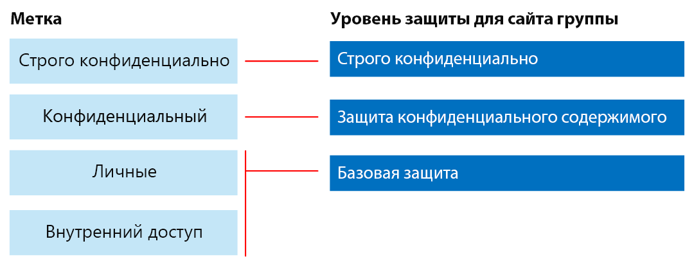
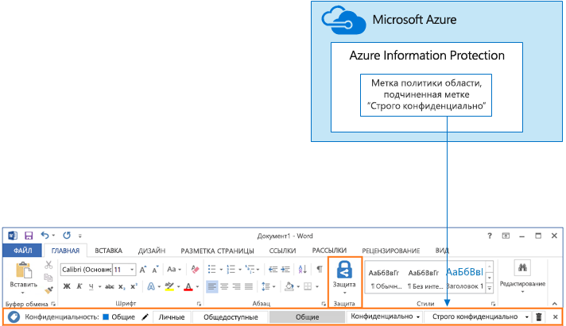

# Защита сайтов и файлов SharePoint Online

 **Сводка.** Рекомендации по настройке для защиты файлов в SharePoint Online и Office 365.
  
В этой статье представлены рекомендации по настройке сайтов группы SharePoint Online и защиты файлов, которые помогут вам достичь баланса между безопасностью и удобством совместной работы. В ней определены четыре конфигурации, начиная с общедоступного сайта в организации, для которого характерны наиболее открытые политики общего доступа. Каждая дополнительная конфигурация представляет существенное усиление защиты, но ограничивает число пользователей, у которых есть возможность доступа к ресурсам и совместной работы с ними. Используйте эти рекомендации в качестве отправной точки, меняя конфигурации в соответствии с потребностями организации. 
  
Представленные в этой статье конфигурации соответствуют приведенным ниже рекомендациям корпорации Майкрософт относительно трех уровней защиты данных, удостоверений и устройств.
  
- Базовый уровень защиты
    
- Конфиденциальный уровень защиты
    
- Строго конфиденциальный уровень защиты
    
Дополнительные сведения об этих уровнях и рекомендуемых для каждого из них возможностях см. в следующих статьях. 
  
- [Защита идентификации и устройств для Office 365](https://docs.microsoft.com/office365/enterprise/microsoft-cloud-it-architecture-resources#BKMK_O365IDP)
    
- [Решения для защиты файлов в Office 365](https://docs.microsoft.com/office365/enterprise/microsoft-cloud-it-architecture-resources#BKMK_O365fileprotect)
    
## Общие сведения о возможностях

Рекомендации для сайтов групп SharePoint Online опираются на различные возможностях Office 365. Для строго конфиденциальных сайтов рекомендуем использовать службу Azure Information Protection, которая включена в план Enterprise Mobility + Security (EMS). 
  
Ниже проиллюстрированы рекомендуемые конфигурации для четырех сайтов групп SharePoint Online.

Как следует из приведенной иллюстрации:
  
- Базовая защита включает два варианта сайтов групп SharePoint Online — общедоступные и частные. Общедоступные сайты может обнаруживать и открывать любой пользователь в организации. Частные сайты могут обнаруживать и открывать только участники сайта. Обе эти конфигурации сайтов позволяют предоставлять доступ пользователям, не состоящим в группе. 
    
- Сайты с конфиденциальным и строго конфиденциальным уровнями защиты являются частными сайтами, доступ к которым имеют только участники определенных групп.
    
- Метки Office 365 позволяют классифицировать данные, указывая необходимый уровень защиты. Каждый сайт группы SharePoint Online настраивается для автоматического добавления к файлам в библиотеках документов таких меток, которые задаются по умолчанию для сайта. В соответствии с четырьмя конфигурациями сайтов в этом примере используются метки "Внутренний общедоступный", "Частный", "Конфиденциальный" и "Строго конфиденциальный". Пользователи могут менять метки, но согласно этой конфигурации всем файлам будут присвоены метки по умолчанию.
    
- Для меток Office 365 "Конфиденциальный" и "Строго конфиденциальный" настраиваются политики защиты от потери данных. Эти политики либо предотвращают отправку, либо предупреждают пользователей, когда те пытаются отправлять файлы таких типов людям за пределами организации.
    
- Если это требуется для сценария, вы можете использовать службу Azure Information Protection для шифрования и предоставления разрешений для файлов высокого уровня конфиденциальности. Не рекомендуется использовать для всех клиентов.
    
## Параметры SharePoint Online и OneDrive для бизнеса на уровне клиента

В SharePoint Online и OneDrive для бизнеса есть параметры уровня клиента, которые влияют на все сайты и всех пользователей. Для создания дополнительных ограничений некоторые из этих параметров также можно настраивать на уровне сайта (но не ниже). В этом разделе рассматриваются параметры на уровне клиента, влияющие на безопасность и совместную работу. 
  
### Доступ

Для данного решения рекомендуем использовать следующие параметры на уровне клиента:
  
- Оставьте политику совместного доступа по умолчанию, которая разрешает делиться данными с учетными записями всех типов, в том числе анонимно.
    
- При желании вы можете ограничить срок действия анонимных ссылок.
    
- Измените тип связи по умолчанию для совместного доступа на "Внутренний". Это помогает избежать случайной утечки данных за пределы организации.
    
Может показаться нелогичным разрешать внешний общий доступ, но этот подход предоставляет больше контроля над доступом к файлам по сравнению с отправкой файлов по электронной почте. Вместе SharePoint Online и Outlook обеспечивают безопасность совместной работы с файлами. 
  
- По умолчанию Outlook отправляет в сообщении не сам файл, а ссылку на него. 
    
- SharePoint Online и OneDrive для бизнеса помогают отправлять ссылки на файлы участникам как в организации, так и за ее пределами.
    
Вам также доступны средства для управления внешним общим доступом. Например, вы можете:
  
- отключить анонимную гостевую ссылку;
    
- запретить пользователю доступ к сайту;
    
- узнать, кому доступен определенный сайт или документ;
    
- ограничить срок действия анонимных ссылок совместного доступа (параметр клиента);
    
- разрешить только определенным пользователям делиться содержимым за пределами организации (параметр клиента).
    
### Использование внешнего общего доступа вместе с защитой от потери данных (DLP)

Если вы не разрешите внешний общий доступ, то пользователи найдут альтернативные средства и способы. Корпорация Майкрософт рекомендует совмещать внешний общий доступ с политиками защиты от потери данных, чтобы защитить конфиденциальные и строго конфиденциальные файлы.
  
### Параметры доступа устройств

С помощью параметров доступа устройств в SharePoint Online и OneDrive для бизнеса вы можете определять, разрешен ли доступ только для браузеров (файлы невозможно скачивать) или заблокирован полностью. В настоящее время эти параметры предоставляются по программе раннего доступа и применяются на уровне клиента. В скором времени появится возможность настраивать политики доступа устройств на уровне сайта. Для данного решения рекомендуем не использовать параметры доступа устройств, применяемые на уровне клиента.
  
Чтобы использовать параметры доступа к устройствам в рамках программы раннего доступа, выполните действия, описанные в следующей статье: [Настройка стандартного или раннего доступа в Office 365](https://support.office.com/article/Set-up-the-Standard-or-First-Release-options-in-Office-365-3B3ADFA4-1777-4FF0-B606-FB8732101F47).
  
### OneDrive для бизнеса

Просмотрите эти параметры, чтобы решить, хотите ли вы изменить параметры по умолчанию для сайтов OneDrive для бизнеса. В настоящее время параметры доступа устройств и совместного доступа копируются из Центра администрирования SharePoint Online и применяются к обеим средам.
  
## Настройка сайта группы SharePoint

В приведенной ниже таблице представлена конфигурация каждого из сайтов группы, описанных ранее в этой статье. Используйте эти конфигурации в качестве отправной точки, меняя типы и настройки сайтов в соответствии с потребностями организации. Не каждой организации необходимы сайты всех типов. Большинству организаций не нужен уровень строгой конфиденциальности.
  
||||||
|:-----|:-----|:-----|:-----|:-----|
||**Базовый уровень защиты 1**   |**Базовый уровень защиты 2**   |**Конфиденциальный уровень защиты**   |**Строго конфиденциальный уровень защиты**   |
|Описание    |Открытое обнаружение и совместная работа в организации.    |Частные сайты и группы, где разрешено предоставление доступа пользователям за пределами группы.    |Изолированный сайт, уровни доступа на котором определяются членством в определенных группах. Предоставлять общий доступ можно только участникам сайта. Политика защиты от потери данных предупреждает пользователей при попытке отправить файлы за пределы организации.    |Изолированный сайт + шифрование файлов и разрешения с Azure Information Protection. Политика защиты от потери данных запрещает пользователям отправлять файлы за пределы организации.    |
|Частный или общедоступный сайт группы    |Открытый    |Private    |Private    |Private    |
|У кого есть доступ?    |У всех пользователей в организации, включая B2B-пользователей и гостей.    |Только у участников сайта. Другие пользователи могут запрашивать доступ.    |Только у участников сайта. Другие пользователи могут запрашивать доступ.    |Только у участников. Другие пользователи не могут запрашивать доступ.    |
|Средства управления совместным доступом на уровне сайта    |Предоставлять доступ можно всем пользователям. Параметры по умолчанию.    |Предоставлять доступ можно всем пользователям. Параметры по умолчанию.    |Участники не могут предоставлять доступ к сайту.    Пользователи, не являющиеся участниками, могут запрашивать доступ к сайту, но эти запросы должен рассматривать администратор сайта.    |Участники не могут предоставлять общий доступ к сайту.    Пользователи, не являющиеся участниками, не могут запрашивать доступ к сайту или содержимому.    |
|Средства управления доступом к устройствам на уровне сайта    |Дополнительные средства управления отсутствуют.    |Нет дополнительных средств управления.    |В ближайшее время появятся средства управления на уровне сайтов, запрещающие пользователям скачивать файлы на устройства, которые не соответствуют требованиям или не присоединены к домену. В этом случае доступ со всех других устройств будет возможен только через браузер.    |В ближайшее время появятся средства управления на уровне сайтов, блокирующие скачивание файлов на устройства, которые не соответствуют требованиям или не присоединены к домену.    |
|Метки Office 365    |Внутренний общедоступный    |Private    |Конфиденциальный    |Строго конфиденциально    |
|Политики защиты от потери данных    |||Предупреждает пользователей об отправке файлов, помеченных как конфиденциальные, людям за пределами организации.    Чтобы заблокировать внешний общий доступ к данным конфиденциальных типов, таким как номера кредитных карт и другие персональные данные, вы можете настроить дополнительные политики защиты от потери данных для этих типов данных (в том числе для настроенных вами типов данных).    |Блокирует отправку пользователями файлов, помеченных как строго конфиденциальные, людям за пределами организации. Разрешает пользователям переопределять запрет, указывая обоснование, в том числе сведения о том человеке, которому предоставляется доступ.    |
|Azure Information Protection    ||||Служба Azure Information Protection используется для автоматического шифрования файлов и предоставления разрешений на доступ к ним. Эта защита файлов продолжает действовать в случае утечки.    Office 365 не может считывать файлы, зашифрованные с помощью службы Azure Information Protection. Кроме того, политики защиты от потери данных могут применяться только к метаданным этих файлов, включая метки (не к их содержимому, например номерам кредитных карт).    |
   
Инструкции по развертыванию четырех типов сайтов групп SharePoint Online в этом решении см. в статье [Развертывание сайтов SharePoint Online для трех уровней защиты](deploy-sharepoint-online-sites-for-three-tiers-of-protection.md). Инструкции по созданию среды разработки и тестирования см. в статье [Защита сайтов SharePoint Online в среде разработки и тестирования](secure-sharepoint-online-sites-in-a-dev-test-environment.md). 
  
## Классификация и метки Office 365

Использовать метки Office 365 рекомендуется для сред с конфиденциальными данными. После настройки и развертывания меток Office 365
  
- Вы можете указать метку по умолчанию для библиотеки документов на сайте группы SharePoint Online, чтобы все документы в этой библиотеке получали эту метку. 
    
- Вы можете обеспечить автоматическое применение меток к содержимому, если оно соответствует определенным условиям.
    
- Вы можете применять политики защиты от потери данных, основанные на метках Office 365.
    
- Пользователи в организации могут вручную применять метки к содержимому в Outlook 2010 и более поздних версий, Outlook в Интернете, OneDrive для бизнеса, SharePoint Online и группах Office 365. Пользователи часто знают лучше других, с каким содержимым они работают, поэтому могут классифицировать его и применять соответствующие политики защиты от потери данных.
    

  
Как показано на иллюстрации, это решение включает создание следующих меток:
  
- Строго конфиденциально
    
- Конфиденциальный
    
- Private
    
- Внутренний общедоступный
    
Эти метки сопоставляются с рекомендуемыми сайтами на иллюстрациях и диаграммах, представленных выше в этой статье. Для данного решения рекомендуется настроить политики защиты от потери данных, чтобы предотвратить утечку конфиденциальных и строго конфиденциальных файлов.
  
Шаги по настройке меток Office 365 и политик защиты от потери данных в этом решении см. в разделе [Защита файлов SharePoint Online с помощью меток Office 365 и политики защиты от потери данных](protect-sharepoint-online-files-with-office-365-labels-and-dlp.md).
  
## Azure Information Protection

Если это оправдано для сценария безопасности, вы можете использовать службу Azure Information Protection, чтобы применять метки и способы защиты к файлу, продолжающие действовать, где бы он ни находился. Метки Azure Information Protection отличаются от меток Office 365. Для этого решения рекомендуется использовать политику области и вложенную метку "Строго конфиденциальный" Azure Information Protection, чтобы шифровать файлы, требующие самой надежной защиты, и предоставлять разрешения на доступ к этим файлам. 
  
Обратите внимание, что если к файлам, хранящимся в Office 365, применяется шифрование Azure Information Protection, эта служба не может обрабатывать содержимое таких файлов. В этом случае совместное редактирование, обнаружение электронных данных, поиск, Delve и другие функции совместной работы недоступны. Политики защиты от потери данных могут применяться только к метаданным этих файлов, включая метки Office 365 (не к их содержимому, например номерам кредитных карт).
  

  
Как следует из приведенной иллюстрации:
  
- Политики и метки Azure Information Protection можно настроить на портале Microsoft Azure. Рекомендуется настроить подчиненную метку ограниченной политики Azure Information Protection.
    
- Метки Azure Information Protection отображаются как панель **Information Protection** в приложениях Office.
    
### Добавление разрешений для внешних пользователей

Предоставить внешним пользователям доступ к файлам, защищенным с помощью Azure Information Protection, можно двумя способами. В обоих случаях внешним пользователям необходима учетная запись Azure AD. Если внешние пользователи не состоят в организации, использующей Azure AD, они могут получить личную учетную запись Azure AD на странице регистрации: [https://aka.ms/aip-signup](https://aka.ms/aip-signup).
  
- Добавление внешних пользователей в группу Azure AD, используемую для настройки защиты метки
    
     Необходимо сначала добавить учетную запись в качестве B2B пользователя в каталог. [Кэширование членства в группах в Azure Rights Management](https://docs.microsoft.com/information-protection/plan-design/prepare#group-membership-caching-by-azure-rights-management) может занять несколько часов. С помощью этого предоставляются разрешения на все существующие файлы, защищенные с помощью метки (даже файлы, защищенные перед добавлением пользователя в группу Azure AD).
    
- Непосредственное добавление внешних пользователей в защиту метки
    
     Вы можете добавить всех пользователей из организации (например, Fabrikam.com), группу Azure AD (например, финансовый отдел в организации) или отдельного пользователя. Например, вы можете добавить внешнюю команду контролеров в защиту метки. При использовании этого метода разрешения предоставляются только для файлов, которые были защищены с помощью метки после добавления внешнего объекта.
    
### Развертывание и использование Azure Information Protection

Инструкции по настройке Azure Information Protection в этом решении см. в разделе [Защита файлов SharePoint Online с помощью Azure Information Protection](protect-sharepoint-online-files-with-azure-information-protection.md).
  
## См. также

[Руководство по безопасности (Майкрософт) для политических кампаний, некоммерческих и других динамических организаций](microsoft-security-guidance-for-political-campaigns-nonprofits-and-other-agile-o.md)
  
[Освоение облака и гибридные решения](https://docs.microsoft.com/office365/enterprise/cloud-adoption-and-hybrid-solutions)
  
[Защита сайтов SharePoint Online в среде разработки и тестирования](secure-sharepoint-online-sites-in-a-dev-test-environment.md)

