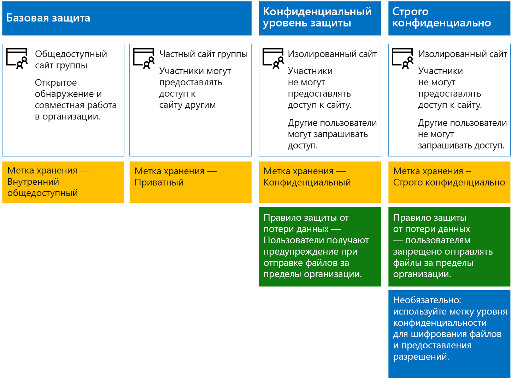

# Защита сайтов и файлов SharePoint OnlineSecure SharePoint Online sites and files

 **Сводка.** Рекомендации по настройке для защиты файлов в SharePoint Online и Office 365.**Summary:** Configuration recommendations for protecting files in SharePoint Online and Office 365.
  
В этой статье представлены рекомендации по настройке сайтов группы SharePoint Online и защиты файлов, которые помогут вам достичь баланса между безопасностью и удобством совместной работы. В ней определены четыре конфигурации, начиная с общедоступного сайта в организации, для которого характерны наиболее открытые политики общего доступа. Каждая дополнительная конфигурация представляет существенное усиление защиты, но ограничивает число пользователей, у которых есть возможность доступа к ресурсам и совместной работы с ними. Используйте эти рекомендации в качестве отправной точки, меняя конфигурации в соответствии с потребностями организации.This article provides recommendations for configuring SharePoint Online team sites and file protection that balances security with ease of collaboration. This article defines four different configurations, starting with a public site within your organization with the most open sharing policies. Each additional configuration represents a meaningful step up in protection, but the ability to access and collaborate on resources is reduced to the relevant set of users. Use these recommendations as a starting point and adjust the configurations to meet the needs of your organization. 
  
Представленные в этой статье конфигурации соответствуют приведенным ниже рекомендациям корпорации Майкрософт относительно трех уровней защиты данных, удостоверений и устройств.The configurations in this article align with Microsoft's recommendations for three tiers of protection for data, identities, and devices:
  
- Базовый уровень защитыBaseline protection
    
- Конфиденциальный уровень защитыSensitive protection
    
- Строго конфиденциальный уровень защитыHighly confidential protection
    
Дополнительные сведения об этих уровнях и рекомендуемых для каждого из них возможностях см. в следующих статьях.For more information about these tiers and capabilities recommended for each tier, see the following resources. 
  
- [Защита идентификации и устройств для Office 365Identity and Device Protection for Office 365](https://docs.microsoft.com/office365/enterprise/microsoft-cloud-it-architecture-resources#BKMK_O365IDP)
    
- [Решения для защиты файлов в Office 365File Protection Solutions in Office 365](https://docs.microsoft.com/office365/enterprise/microsoft-cloud-it-architecture-resources#BKMK_O365fileprotect)
    
## Общие сведения о возможностяхCapability overview

Рекомендации для сайтов групп SharePoint Online опираются на различные возможности Microsoft 365.Recommendations for SharePoint Online team sites draw on a variety of Microsoft 365 capabilities. Ниже проиллюстрированы рекомендуемые конфигурации для четырех сайтов групп SharePoint Online.The following illustration shows the recommended configurations for four SharePoint Online team sites.

Как следует из приведенной иллюстрации:As illustrated:
  
- Базовая защита включает два варианта сайтов групп SharePoint Online — общедоступные и частные. Общедоступные сайты может обнаруживать и открывать любой пользователь в организации. Частные сайты могут обнаруживать и открывать только участники сайта. Обе эти конфигурации сайтов позволяют предоставлять доступ пользователям, не состоящим в группе.Baseline protection includes two options for SharePoint Online team sites — a public site and private site. Public sites can be discovered and accessed by anybody in the organization. Private sites can only be discovered and accessed by members of the site. Both of these site configurations allow for sharing outside the group. 
    
- Сайты с конфиденциальным и строго конфиденциальным уровнями защиты являются частными сайтами, доступ к которым имеют только участники определенных групп.Sites for sensitive and highly confidential protection are private sites with access limited only to members of specific groups.
    
- [Метки хранения](labels.md) позволяют классифицировать файлы на сайтах.[Retention labels](labels.md) provide a way to classify files within the sites. Каждый сайт группы SharePoint Online настраивается для автоматического добавления к файлам в библиотеках документов таких меток хранения, которые задаются по умолчанию для сайта.Each of the SharePoint Online team sites are configured to automatically label files in document libraries with a default retention label for the site. В соответствии с четырьмя конфигурациями сайтов в этом примере используются метки "Внутренний общедоступный", "Частный", "Конфиденциальный" и "Строго конфиденциальный".Corresponding to the four site configurations, the labels in this example are Internal Public, Private, Sensitive, and Highly Confidential. Пользователи могут изменять метки, но согласно этой конфигурации всем файлам будут присвоены метки по умолчанию.Users can change the labels, but this configuration ensures all files receive a default label.
    
- Для меток хранения "Конфиденциальный" и "Строго конфиденциальный" настраиваются [политики защиты от потери данных](data-loss-prevention-policies.md). Эти политики либо предотвращают отправку, либо предупреждают пользователей, когда те пытаются отправлять файлы таких типов людям за пределами организации.[Data loss prevention](data-loss-prevention-policies.md) (DLP) policies are configured for the Sensitive and Highly Confidential retention labels to either warn or prevent users when they attempt to send these types of files outside the organization.
    
- Если это требуется для сценария, вы можете использовать [метки конфиденциальности](sensitivity-labels.md) для защиты файлов высокого уровня конфиденциальности с помощью шифрования и разрешений.If needed for your scenario, you can use [sensitivity labels](sensitivity-labels.md) to protect highly confidential files with encryption and permissions. Для клиентов Azure Information Protection можно использовать свои метки Azure Information Protection в Центре соответствия требованиям Microsoft 365, которые будут синхронизированы с порталом Azure, если вы решите выполнить дополнительную или расширенную настройку.For Azure Information Protection customers, you can use your Azure Information Protection labels in the Microsoft 365 compliance center, and your labels will be synced with the Azure portal in case you choose to perform additional or advanced configuration. Метки Azure Information Protection и метки конфиденциальности Office 365 полностью совместимы друг с другом.Azure Information Protection labels and Office 365 sensitivity labels are fully compatible with each other. Это означает, например, что при наличии контента с меткой Azure Information Protection вам не потребуется изменять классификацию или метку вашего контента. Этот уровень защиты требуется не для всех клиентов.This means, for example, if you have content labeled by Azure Information Protection, you won’t need to reclassify or relabel your content.Not all customers need this level of protection. 
    
## Параметры SharePoint Online и OneDrive для бизнеса на уровне клиентаTenant-wide settings for SharePoint Online and OneDrive for Business

В SharePoint Online и OneDrive для бизнеса есть параметры уровня клиента, которые влияют на все сайты и всех пользователей. Для создания дополнительных ограничений некоторые из этих параметров также можно настраивать на уровне сайта (но не ниже). В этом разделе рассматриваются параметры на уровне клиента, влияющие на безопасность и совместную работу.SharePoint Online and OneDrive for Business include tenant-wide settings that affect all sites and users. Some of these settings can also be adjusted at the site level to be more restrictive (but not less). This section discusses tenant-wide settings that affect security and collaboration. 
  
### ДоступSharing

Для данного решения рекомендуем использовать следующие параметры на уровне клиента:For this solution, we recommend the following tenant-wide settings:
  
- Оставьте политику совместного доступа по умолчанию, которая разрешает делиться данными с учетными записями всех типов, в том числе анонимно.Keep the default sharing policy that allows all sharing with all account types, including anonymous sharing.
    
- При желании вы можете ограничить срок действия анонимных ссылок.Set anonymous links to expire, if desired.
    
- Измените тип связи по умолчанию для совместного доступа на "Внутренний". Это помогает избежать случайной утечки данных за пределы организации.Change the default link type for sharing to Internal. This helps prevent accidental data leakage outside your organization.
    
Может показаться нелогичным разрешать внешний общий доступ, но этот подход предоставляет больше контроля над доступом к файлам по сравнению с отправкой файлов по электронной почте. Вместе SharePoint Online и Outlook обеспечивают безопасность совместной работы с файлами.While it might seem counterintuitive to allow external sharing, this approach provides more control over file sharing compared to sending files in email. SharePoint Online and Outlook work together to provide secure collaboration on files. 
  
- По умолчанию Outlook отправляет в сообщении не сам файл, а ссылку на него.By default, Outlook shares a link to a file instead of sending the file in email. 
    
- SharePoint Online и OneDrive для бизнеса помогают отправлять ссылки на файлы участникам как в организации, так и за ее пределами.SharePoint Online and OneDrive for Business make it easy to share links to files with contributors who are both inside and outside your organization
    
Вам также доступны средства для управления внешним общим доступом. Например, вы можете:You also have controls to help govern external sharing. For example, you can:
  
- отключить анонимную гостевую ссылку;Disable an anonymous guest link.
    
- запретить пользователю доступ к сайту;Revoke user access to a site.
    
- узнать, кому доступен определенный сайт или документ;See who has access to a specific site or document.
    
- ограничить срок действия анонимных ссылок совместного доступа (параметр клиента);Set anonymous sharing links to expire (tenant setting).
    
- разрешить только определенным пользователям делиться содержимым за пределами организации (параметр клиента).Limit who can share outside your organization (tenant setting).
    
### Использование внешнего общего доступа вместе с защитой от потери данных (DLP)Use external sharing together with data loss prevention (DLP)

Если вы не разрешите внешний общий доступ, то пользователи найдут альтернативные средства и способы. Корпорация Майкрософт рекомендует совмещать внешний общий доступ с политиками защиты от потери данных, чтобы защитить конфиденциальные и строго конфиденциальные файлы.If you don't allow external sharing, users with a business need will find alternate tools and methods. Microsoft recommends you combine external sharing with DLP policies to protect sensitive and highly confidential files.
  
### Параметры доступа устройствDevice access settings

С помощью параметров доступа устройств в SharePoint Online и OneDrive для бизнеса вы можете определять, разрешен ли доступ только для браузеров (файлы невозможно скачивать) или заблокирован полностью.Device access settings for SharePoint Online and OneDrive for Business let you determine whether access is limited to browser only (files can't be downloaded) or if access is blocked. Дополнительные сведения см. в статье [Управление доступом с неуправляемых устройств](https://docs.microsoft.com/ru-RU/sharepoint/control-access-from-unmanaged-devices).For more information, see [Control access from unmanaged devices](https://docs.microsoft.com/en-us/sharepoint/control-access-from-unmanaged-devices). 

Чтобы использовать параметры доступа устройств с рекомендованными политиками условного доступа в Azure Active Directory см. статью [Рекомендуемые политики для защиты сайтов и файлов SharePoint](https://docs.microsoft.com/ru-RU/microsoft-365/enterprise/sharepoint-file-access-policies).To use device access settings with recommended conditional access policies in Azure Active Directory, see [Policy recommendations for securing SharePoint sites and files](https://docs.microsoft.com/en-us/microsoft-365/enterprise/sharepoint-file-access-policies).
  
### OneDrive для бизнесаOneDrive for Business

Просмотрите эти параметры, чтобы решить, хотите ли вы изменить параметры по умолчанию для сайтов OneDrive для бизнеса. В настоящее время параметры доступа устройств и совместного доступа копируются из Центра администрирования SharePoint Online и применяются к обеим средам.Visit these settings to decide if you want to change the default settings for OneDrive for Business sites. Currently, the sharing and device access settings are duplicated from the SharePoint Online admin center and apply to both environments.
  
## Настройка сайта группы SharePointSharePoint team site configuration

В приведенной ниже таблице представлена конфигурация каждого из сайтов группы, описанных ранее в этой статье. Используйте эти конфигурации в качестве отправной точки, меняя типы и настройки сайтов в соответствии с потребностями организации. Не каждой организации необходимы сайты всех типов. Большинству организаций не нужен уровень строгой конфиденциальности.The following table summarizes the configuration for each of the team sites described earlier in this article. Use these configurations as starting point recommendations and adjust the site types and configurations to meet the needs of your organization. Not every organization needs every type of site. Only a small number of organizations require highly confidential protection.
  
||||||
|:-----|:-----|:-----|:-----|:-----|
||**Базовый уровень защиты 1****Baseline protection #1**   |**Базовый уровень защиты 2****Baseline protection #2**   |**Конфиденциальный уровень защиты****Sensitive protection**   |**Строго конфиденциальный уровень защиты****Highly confidential**   |
|ОписаниеDescription    |Открытое обнаружение и совместная работа в организации.Open discovery and collaboration within the organization.    |Частные сайты и группы, где разрешено предоставление доступа пользователям за пределами группы.Private site and group with sharing allowed outside the group.    |Изолированный сайт, уровни доступа на котором определяются членством в определенных группах. Предоставлять общий доступ можно только участникам сайта. Политика защиты от потери данных предупреждает пользователей при попытке отправить файлы за пределы организации.Isolated site, in which levels of access are defined by membership in specific groups. Sharing is only allowed to members of the site. DLP warns users when attempting to send files outside the organization.    |Изолированный сайт + шифрование файлов и разрешения с Azure Information Protection. Политика защиты от потери данных запрещает пользователям отправлять файлы за пределы организации.Isolated site + file encryption and permissions with Azure Information Protection. DLP prevents users from sending files outside the organization.    |
|Частный или общедоступный сайт группыPrivate or public team site    |ОткрытыйPublic    |ЧастныйPrivate    |ЧастныйPrivate    |ЧастныйPrivate    |
|У кого есть доступ?Who has access?    |У всех пользователей в организации, включая B2B-пользователей и гостей.Everybody in the organization, including B2B users and guest users.    |Только у участников сайта. Другие пользователи могут запрашивать доступ.Members of the site only. Others can request access.    |Только у участников сайта. Другие пользователи могут запрашивать доступ.Members of the site only. Others can request access.    |Только у участников. Другие пользователи не могут запрашивать доступ.Members only. Others cannot request access.    |
|Средства управления совместным доступом на уровне сайтаSite-level sharing controls    |Предоставлять доступ можно всем пользователям. Параметры по умолчанию.Sharing allowed with anybody. Default settings.    |Предоставлять доступ можно всем пользователям. Параметры по умолчанию.Sharing allowed with anybody. Default settings.    |Участники не могут предоставлять доступ к сайту.Members cannot share access to the site.    Пользователи, не являющиеся участниками, могут запрашивать доступ к сайту, но эти запросы должен рассматривать администратор сайта.Non-members can request access to the site, but these requests need to be addressed by a site administrator.    |Участники не могут предоставлять общий доступ к сайту.Members cannot share access to the site.    Пользователи, не являющиеся участниками, не могут запрашивать доступ к сайту или содержимому.Non-members cannot request access to the site or contents.    |
|Средства управления доступом к устройствам на уровне сайтаSite-level device access controls    |Дополнительные средства управления отсутствуют.No additional controls.    |Дополнительные средства управления отсутствуют.No additional controls.    |Запрещает пользователям скачивать файлы на устройства, которые не соответствуют требованиям или не присоединены к домену. Это позволяет получать доступ только с помощью браузера на всех остальных устройствах.Prevents users from downloading files to non-compliant or non-domain joined devices. This allows browser-only access from all other devices.    |Блокирует скачивание файлов на устройства, которые не соответствуют требованиям или не присоединены к домену.Block downloading of files to non-compliant or non-domain joined devices.    |
|Метки храненияRetention labels    |Внутренний общедоступныйInternal Public    |ЧастныйPrivate    |КонфиденциальныйSensitive    |Строго конфиденциальноHighly Confidential    |
|Политики защиты от потери данныхDLP policies    |||Предупреждает пользователей об отправке файлов, помеченных как конфиденциальные, людям за пределами организации.Warn users when sending files that are labeled as Sensitive outside the organization.    Чтобы заблокировать внешний общий доступ к данным конфиденциальных типов, таким как номера кредитных карт и другие персональные данные, вы можете настроить дополнительные политики защиты от потери данных для этих типов данных (в том числе для настроенных вами типов данных).To block external sharing of sensitive data types, such as credit card numbers or other personal data, you can configure additional DLP policies for these data types (including custom data types you configure).    |Блокирует отправку пользователями файлов, помеченных как строго конфиденциальные, людям за пределами организации. Разрешает пользователям переопределять запрет, указывая обоснование, в том числе сведения о том человеке, которому предоставляется доступ.Block users from sending files that are labeled as highly confidential outside organization. Allow users to override this by providing justification, including who they are sharing the file with.    |
|Метки конфиденциальностиSensitivity labels    ||||Метки конфиденциальности используются для автоматического шифрования файлов и предоставления разрешений на доступ к ним.Use sensitivity labels to automatically encrypt and grant permissions to files. Метки конфиденциальности используют службу Azure Information Protection для шифрования файлов.Sensitivity labels use Azure Information Protection to encrypt files. Эта защита файлов продолжает действовать в случае утечки.This protection travels with the files in case they are leaked.    Office 365 не может считывать файлы, зашифрованные с помощью службы Azure Information Protection. Кроме того, политики защиты от потери данных могут применяться только к метаданным этих файлов, включая метки (не к их содержимому, например номерам кредитных карт).Office 365 cannot read files encrypted with Azure Information Protection. Additionally, DLP policies can only work with the metadata (including labels) but not the contents of these files (such as credit card numbers within files).    |
   
Шаги по развертыванию четырех разных типов сайтов групп SharePoint Online в этом решении см. в статье [Развертывание сайтов SharePoint Online с тремя уровнями защиты](deploy-sharepoint-online-sites-for-three-tiers-of-protection.md).For the steps to deploy the four different types of SharePoint Online team sites in this solution, see [Deploy SharePoint Online sites for three tiers of protection](deploy-sharepoint-online-sites-for-three-tiers-of-protection.md). 
  
## Метки хранения Office 365Office 365 retention labels

Для сред с конфиденциальными данными рекомендуется использовать метки хранения.Using retention labels is recommended for environments with sensitive data. После настройки и публикации меток хранения:After you configure and publish retention labels:
  
- Вы можете указать метку по умолчанию для библиотеки документов на сайте группы SharePoint Online, чтобы все документы в этой библиотеке получали эту метку.You can apply a default label to a document library in a SharePoint Online team site, so that all documents in that library get the default label. 
    
- Вы можете обеспечить автоматическое применение меток к содержимому, если оно соответствует определенным условиям.You can apply labels to content automatically if it matches specific conditions.
    
- Вы можете применять политики защиты от потери данных, основанные на метках хранения.You can apply DLP policies that are based on retention labels.
    
- Пользователи в организации могут вручную применять метки к содержимому в Outlook 2010 и более поздних версий, Outlook в Интернете, OneDrive для бизнеса, SharePoint Online и группах Office 365. Пользователи часто знают лучше других, с каким содержимым они работают, поэтому могут классифицировать его и применять соответствующие политики защиты от потери данных.People in your organization can apply a label manually to content in Outlook on the web, Outlook 2010 and later, OneDrive for Business, SharePoint Online, and Office 365 groups. Users often know best what type of content they're working with, so they can classify it and have the appropriate DLP policy applied.
    

  
Как показано на иллюстрации, это решение включает создание следующих меток хранения:As illustrated, this solution includes creating the following retention labels:
  
- Строго конфиденциальныйHighly Confidential
    
- КонфиденциальныйSensitive
    
- ЧастныйPrivate
    
- Внутренний общедоступныйInternal Public
    
Эти метки сопоставляются с рекомендуемыми сайтами на иллюстрациях и диаграммах, представленных выше в этой статье. Для данного решения рекомендуется настроить политики защиты от потери данных, чтобы предотвратить утечку конфиденциальных и строго конфиденциальных файлов.These labels are mapped to the recommended sites in the illustrations and charts earlier in this article. This solution recommends configuring DLP policies to help prevent the leakage of files labeled as Sensitive and Highly Confidential.
  
Шаги по настройке меток хранения и политик защиты от потери данных в этом решении см. в разделе [Защита файлов SharePoint Online с помощью меток хранения и политики защиты от потери данных](protect-sharepoint-online-files-with-office-365-labels-and-dlp.md).For the steps to configure retention labels and DLP policies in this solution, see [Protect SharePoint Online files with retention labels and DLP](protect-sharepoint-online-files-with-office-365-labels-and-dlp.md).
  
## Метки конфиденциальностиSensitivity labels 

Если это оправдано для сценария безопасности, вы можете применять метки конфиденциальности к файлу, продолжающие действовать, где бы он ни находился.If warranted for your security scenario, you can use sensitivity labels to apply protections that follow the files wherever they go. Метки конфиденциальности в Центре соответствия требованиям Microsoft 365 и метки Azure Information Protection одинаковы.Sensitivity labels in the Microsoft 365 compliance center and Azure Information Protection labels are the same. Для этого решения рекомендуется использовать политику области и вложенную метку "Строго конфиденциальный" Azure Information Protection, чтобы шифровать файлы, требующие самой надежной защиты, и предоставлять разрешения на доступ к этим файлам.For this solution, we recommend you use a scoped Azure Information Protection policy and a sub-label of the Highly Confidential label to encrypt and grant permissions to files that need to be protected with the highest level of security. 
  
Обратите внимание, что если к файлам, хранящимся в Office 365, применяется шифрование Azure Information Protection, эта служба не может обрабатывать содержимое таких файлов.Be aware that when Azure Information Protection encryption is applied to files stored in Office 365, the service cannot process the contents of these files. В этом случае совместное редактирование, обнаружение электронных данных, поиск, Delve и другие функции совместной работы недоступны.Co-authoring, eDiscovery, search, Delve, and other collaborative features do not work. Политики защиты от потери данных могут применяться только к метаданным этих файлов, включая метки хранения (не к их содержимому, например номерам кредитных карт).DLP policies can only work with the metadata (including retention labels) but not the contents of these files (such as credit card numbers within files).

Дополнительные сведения см. в статье [Обзор меток конфиденциальности](sensitivity-labels.md).For more information, see [Overview of sensitivity labels](sensitivity-labels.md).

    
### Добавление разрешений для внешних пользователейAdding permissions for external users

Предоставить внешним пользователям доступ к файлам, защищенным с помощью Azure Information Protection, можно двумя способами. В обоих случаях внешним пользователям необходима учетная запись Azure AD. Если внешние пользователи не состоят в организации, использующей Azure AD, они могут получить личную учетную запись Azure AD на странице регистрации: [https://aka.ms/aip-signup](https://aka.ms/aip-signup).There are two ways you can grant external users access to files protected with Azure Information Protection. In both these cases, external users must have an Azure AD account. If external users aren't members of an organization that uses Azure AD, they can obtain an Azure AD account as an individual by using this sign-up page: [https://aka.ms/aip-signup](https://aka.ms/aip-signup).
  
- Добавление внешних пользователей в группу Azure AD, используемую для настройки защиты меткиAdd external users to an Azure AD group that is used to configure protection for a label
    
     Необходимо сначала добавить учетную запись в качестве B2B пользователя в каталог. [Кэширование членства в группах в Azure Rights Management](https://docs.microsoft.com/information-protection/plan-design/prepare#group-membership-caching-by-azure-rights-management) может занять несколько часов. С помощью этого предоставляются разрешения на все существующие файлы, защищенные с помощью метки (даже файлы, защищенные перед добавлением пользователя в группу Azure AD).You'll need to first add the account as a B2B user in your directory. It can take a couple of hours for [group membership caching by Azure Rights Management](https://docs.microsoft.com/information-protection/plan-design/prepare#group-membership-caching-by-azure-rights-management). With this method, permissions are granted to all existing files protected with the label (even files protected before a user is added to the Azure AD group).
    
- Непосредственное добавление внешних пользователей в защиту меткиAdd external users directly to the label protection
    
     Вы можете добавить всех пользователей из организации (например, Fabrikam.com), группу Azure AD (например, финансовый отдел в организации) или отдельного пользователя. Например, вы можете добавить внешнюю команду контролеров в защиту метки. При использовании этого метода разрешения предоставляются только для файлов, которые были защищены с помощью метки после добавления внешнего объекта.You can add all users from an organization (e.g. Fabrikam.com), an Azure AD group (such as a finance group within an organization), or an individual user. For example, you can add an external team of regulators to the protection for a label. With this method, permissions are granted only to files protected with the label after the external entity is added to the protection.
    
### Развертывание и использование Azure Information ProtectionDeploying and using Azure Information Protection

Инструкции по настройке Azure Information Protection в этом решении см. в разделе [Защита файлов SharePoint Online с помощью Azure Information Protection](protect-sharepoint-online-files-with-azure-information-protection.md).For the steps to configure Azure Information Protection in this solution, see [Protect SharePoint Online files with Azure Information Protection](protect-sharepoint-online-files-with-azure-information-protection.md).
  

## Дальнейшее действиеNext step

Выполните эту сборку в качестве проверки концепции с помощью статьи [Защита сайтов SharePoint Online в среде разработки и тестирования](secure-sharepoint-online-sites-in-a-dev-test-environment.md).Build this out as a proof-of-concept with [Secure SharePoint Online sites in a dev/test environment](secure-sharepoint-online-sites-in-a-dev-test-environment.md).

## См. такжеSee Also

[Руководство по безопасности (Майкрософт) для политических кампаний, некоммерческих и других динамических организацийMicrosoft Security Guidance for Political Campaigns, Nonprofits, and Other Agile Organizations](microsoft-security-guidance-for-political-campaigns-nonprofits-and-other-agile-o.md)
  
[Освоение облака и гибридные решенияCloud adoption and hybrid solutions](https://docs.microsoft.com/office365/enterprise/cloud-adoption-and-hybrid-solutions)
  
