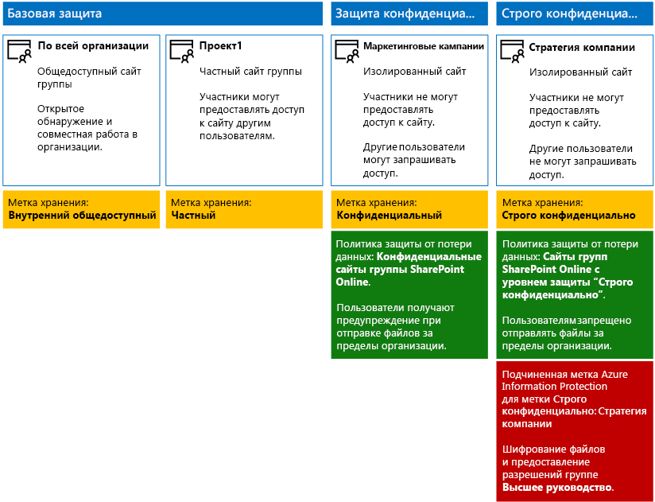
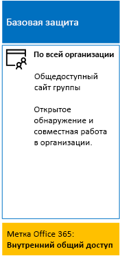
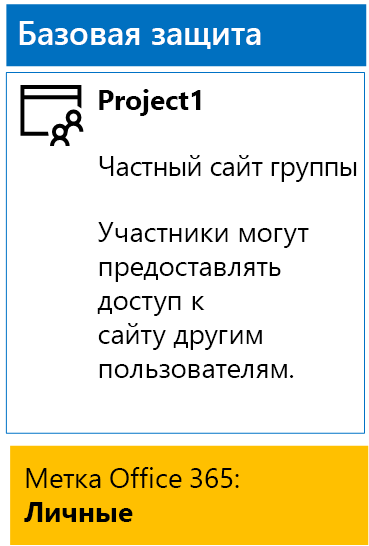
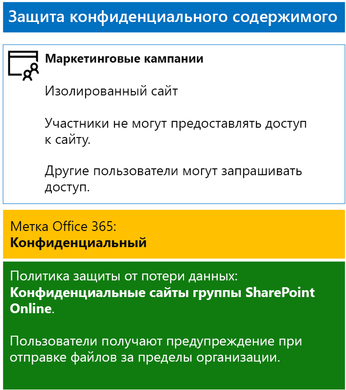
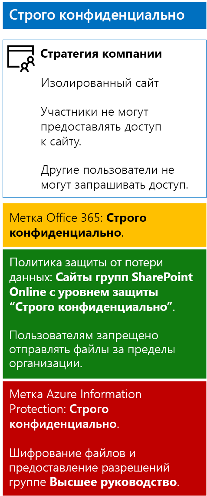

# <a name="secure-sharepoint-online-sites-in-a-devtest-environment"></a><span data-ttu-id="20843-103">Защита сайтов SharePoint Online в среде разработки и тестирования</span><span class="sxs-lookup"><span data-stu-id="20843-103">Secure SharePoint Online sites in a dev/test environment</span></span>

 <span data-ttu-id="20843-104">**Сводка.** Создание общедоступных, частных, конфиденциальных и строго конфиденциальных сайтов групп SharePoint Online в среде разработки и тестирования.</span><span class="sxs-lookup"><span data-stu-id="20843-104">**Summary:** Create public, private, sensitive, and highly confidential SharePoint Online team sites in a dev/test environment.</span></span>
  
<span data-ttu-id="20843-105">Эта статья содержит пошаговые инструкции по созданию среды разработки и тестирования, включающей четыре различных типа сайтов групп SharePoint Online для [решения по защите файлов и сайтов SharePoint Online](secure-sharepoint-online-sites-and-files.md).</span><span class="sxs-lookup"><span data-stu-id="20843-105">This article provides step-by-step instructions to create a dev/test environment that includes the four different types of SharePoint Online team sites for the [Secure SharePoint Online sites and files](secure-sharepoint-online-sites-and-files.md) solution.</span></span>
  

  
<span data-ttu-id="20843-107">Используйте это окружение разработки и тестирования для экспериментов с режимами защиты информации и настройкой перед развертыванием сайтов групп SharePoint Online в рабочей среде.</span><span class="sxs-lookup"><span data-stu-id="20843-107">Use this dev/test environment to experiment with the information protection behaviors and fine-tune settings for your specific needs before deploying SharePoint Online team sites in production.</span></span>
  
## <a name="phase-1-create-your-devtest-environment"></a><span data-ttu-id="20843-108">Этап 1. Создание среды разработки и тестирования</span><span class="sxs-lookup"><span data-stu-id="20843-108">Phase 1: Create your dev/test environment</span></span>

<span data-ttu-id="20843-109">На этом этапе вы получите пробные подписки для Office 365 и Enterprise Mobility + Security для вымышленной организации.</span><span class="sxs-lookup"><span data-stu-id="20843-109">In this phase, you obtain trial subscriptions for Office 365 and Enterprise Mobility + Security for a fictional organization.</span></span>
  
<span data-ttu-id="20843-110">Сначала следуйте инструкциям для **этапа 2**, указанного в [разделе о среде разработки и тестирования Office 365](https://docs.microsoft.com/office365/enterprise/office-365-dev-test-environment).</span><span class="sxs-lookup"><span data-stu-id="20843-110">First, follow the instructions in **Phase 2** of the [Office 365 dev/test environment](https://docs.microsoft.com/office365/enterprise/office-365-dev-test-environment).</span></span>
  
<span data-ttu-id="20843-111">Затем оформите пробную подписку на EMS и добавьте ее к той же организации, что и пробную подписку на Office 365.</span><span class="sxs-lookup"><span data-stu-id="20843-111">Next, sign up for the EMS trial subscription and add it to the same organization as your Office 365 trial subscription.</span></span>
  
1. <span data-ttu-id="20843-p101">Если необходимо, войдите на портал Office 365 с использованием учетных данных учетной записи глобального администратора пробной подписки. Справочные сведения см. в статье [Вход в Office 365](https://support.office.com/Article/Where-to-sign-in-to-Office-365-e9eb7d51-5430-4929-91ab-6157c5a050b4).</span><span class="sxs-lookup"><span data-stu-id="20843-p101">If needed, sign in to the Office 365 portal with the credentials of the global administrator account of your trial subscription. For help, see [Where to sign in to Office 365](https://support.office.com/Article/Where-to-sign-in-to-Office-365-e9eb7d51-5430-4929-91ab-6157c5a050b4).</span></span>
    
2. <span data-ttu-id="20843-114">Выберите плитку **Администрирование**.</span><span class="sxs-lookup"><span data-stu-id="20843-114">Click the **Admin** tile.</span></span>
    
3. <span data-ttu-id="20843-115">Открыв вкладку **Центр администрирования Office** в браузере, на панели навигации слева щелкните **Выставление счетов > Приобретение служб**.</span><span class="sxs-lookup"><span data-stu-id="20843-115">On the **Office Admin center** tab in your browser, in the left navigation, click **Billing > Purchase services**.</span></span>
    
4. <span data-ttu-id="20843-p102">На странице **Приобретение служб** найдите элемент **Enterprise Mobility + Security E5**. Наведите на него указатель мыши и выберите **Начать бесплатный пробный период**.</span><span class="sxs-lookup"><span data-stu-id="20843-p102">On the **Purchase services** page, find the **Enterprise Mobility + Security E5** item. Hover your mouse pointer over it and click **Start free trial**.</span></span>
    
5. <span data-ttu-id="20843-118">На странице **Подтверждение заказа** нажмите кнопку **Попробовать**.</span><span class="sxs-lookup"><span data-stu-id="20843-118">On the **Confirm your order** page, click **Try now**.</span></span>
    
6. <span data-ttu-id="20843-119">На странице **Получение заказа** нажмите кнопку **Продолжить**.</span><span class="sxs-lookup"><span data-stu-id="20843-119">On the **Order receipt** page, click **Continue**.</span></span>
    
<span data-ttu-id="20843-120">Затем включите лицензию Enterprise Mobility + Security E5 для своей учетной записи глобального администратора.</span><span class="sxs-lookup"><span data-stu-id="20843-120">Next, enable the Enterprise Mobility + Security E5 license for your global administrator account.</span></span>
  
1. <span data-ttu-id="20843-121">Открыв вкладку браузера **Центр администрирования Office 365**, на панели навигации слева выберите **Пользователи > Активные пользователи**.</span><span class="sxs-lookup"><span data-stu-id="20843-121">On the **Office 365 Admin center** tab in your browser, in the left navigation, click **Users > Active users**.</span></span>
    
2. <span data-ttu-id="20843-122">Выберите свою учетную запись глобального администратора и щелкните ссылку **Изменить** для параметра **Лицензии на продукты**.</span><span class="sxs-lookup"><span data-stu-id="20843-122">Click your global administrator account, and then click **Edit** for **Product licenses**.</span></span>
    
3. <span data-ttu-id="20843-123">На панели **Лицензии на продукты** переведите переключатель **Enterprise Mobility + Security E5** в положение **Вкл.**, нажмите **Сохранить**, а затем дважды **Закрыть**.</span><span class="sxs-lookup"><span data-stu-id="20843-123">On the **Product licenses** pane, turn the product license for **Enterprise Mobility + Security E5** to **On**, click **Save,** and then click **Close** twice.</span></span>
    
## <a name="phase-2-create-and-configure-your-azure-active-directory-ad-groups-and-users"></a><span data-ttu-id="20843-124">Этап 2. Создание и настройка групп и пользователей Azure Active Directory (AD)</span><span class="sxs-lookup"><span data-stu-id="20843-124">Phase 2: Create and configure your Azure Active Directory (AD) groups and users</span></span>

<span data-ttu-id="20843-125">На этом этапе вы создадите и настроите группы и пользователей Azure AD для вымышленной организации.</span><span class="sxs-lookup"><span data-stu-id="20843-125">In this phase, you create and configure the Azure AD groups and users for your fictional organization.</span></span>
  
<span data-ttu-id="20843-126">Сначала создайте набор групп для обычной организации на портале Azure.</span><span class="sxs-lookup"><span data-stu-id="20843-126">First, create a set of groups for a typical organization with the Azure portal.</span></span>
  
1. <span data-ttu-id="20843-p103">Откройте портал Azure ([https://portal.azure.com](https://portal.azure.com)) на отдельной вкладке браузера. Если необходимо, выполните вход, используя данные учетной записи глобального администратора для пробной подписки на Office 365 E5.</span><span class="sxs-lookup"><span data-stu-id="20843-p103">Create a separate tab in your browser, and then go to the Azure portal at [https://portal.azure.com](https://portal.azure.com). If needed, sign in with the credentials of the global administrator account for your Office 365 E5 trial subscription.</span></span>
    
2. <span data-ttu-id="20843-129">На портале Azure выберите **Azure Active Directory > Группы**.</span><span class="sxs-lookup"><span data-stu-id="20843-129">In the Azure portal, click **Azure Active Directory > Groups**.</span></span>
    
3. <span data-ttu-id="20843-130">В колонке **Группы — Все группы** выберите пункт **+ Создать группу**.</span><span class="sxs-lookup"><span data-stu-id="20843-130">On the **Groups - All groups** blade, click **+ New group**.</span></span>
    
4. <span data-ttu-id="20843-131">В колонке **Группа**:</span><span class="sxs-lookup"><span data-stu-id="20843-131">On the **Group** blade:</span></span>
    
  - <span data-ttu-id="20843-132">В разделе **Тип группы** выберите **Office 365**.</span><span class="sxs-lookup"><span data-stu-id="20843-132">Select **Office 365** in **Group type**.</span></span>
    
  - <span data-ttu-id="20843-133">Введите **Топ-менеджмент** в поле **Имя**.</span><span class="sxs-lookup"><span data-stu-id="20843-133">Type **C-Suite** in **Name**.</span></span>
    
  - <span data-ttu-id="20843-134">Выберите **Назначенные** в поле **Тип членства**.</span><span class="sxs-lookup"><span data-stu-id="20843-134">Select **Assigned** in **Membership type**.</span></span>
      
5. <span data-ttu-id="20843-135">Нажмите кнопку **Создать**, а затем закройте колонку **Группа**.</span><span class="sxs-lookup"><span data-stu-id="20843-135">Click **Create**, and then close the **Group** blade.</span></span>
    
6. <span data-ttu-id="20843-136">Повторите шаги с 3 по 5 для следующих групп:</span><span class="sxs-lookup"><span data-stu-id="20843-136">Repeat steps 3-5 for the following group names:</span></span>
    
  - <span data-ttu-id="20843-137">ИТ-персонал</span><span class="sxs-lookup"><span data-stu-id="20843-137">IT staff</span></span>
    
  - <span data-ttu-id="20843-138">Научный персонал</span><span class="sxs-lookup"><span data-stu-id="20843-138">Research staff</span></span>
    
  - <span data-ttu-id="20843-139">Штатный персонал</span><span class="sxs-lookup"><span data-stu-id="20843-139">Regular staff</span></span>
    
  - <span data-ttu-id="20843-140">Маркетинговый персонал</span><span class="sxs-lookup"><span data-stu-id="20843-140">Marketing staff</span></span>
    
  - <span data-ttu-id="20843-141">Торговый персонал</span><span class="sxs-lookup"><span data-stu-id="20843-141">Sales staff</span></span>
    
7. <span data-ttu-id="20843-142">Не закрывайте вкладку портала Azure в браузере.</span><span class="sxs-lookup"><span data-stu-id="20843-142">Keep the Azure portal tab in your browser open.</span></span>
    
<span data-ttu-id="20843-143">После этого настройте автоматическое лицензирование, чтобы членам групп автоматически назначались лицензии на подписки Office 365 и EMS.</span><span class="sxs-lookup"><span data-stu-id="20843-143">Next, you configure automatic licensing so that members of your groups are automatically assigned licenses for your Office 365 and EMS subscriptions.</span></span>
  
1. <span data-ttu-id="20843-144">На портале Azure последовательно выберите **Azure Active Directory > Лицензии > Все продукты**.</span><span class="sxs-lookup"><span data-stu-id="20843-144">In the Azure portal, click **Azure Active Directory > Licenses > All products**.</span></span>
    
2. <span data-ttu-id="20843-145">В списке выберите **Enterprise Mobility + Security E5** и **Office 365 корпоративный E5** и нажмите **Назначить**.</span><span class="sxs-lookup"><span data-stu-id="20843-145">In the list, select **Enterprise Mobility + Security E5** and **Office 365 Enterprise E5**, and then click **Assign**.</span></span>
    
3. <span data-ttu-id="20843-146">В колонке **Назначение лицензии** щелкните **Пользователи и группы**.</span><span class="sxs-lookup"><span data-stu-id="20843-146">In the **Assign license** blade, click **Users and groups**.</span></span>
    
4. <span data-ttu-id="20843-147">В списке групп выберите следующие элементы:</span><span class="sxs-lookup"><span data-stu-id="20843-147">In the list of groups, select the following:</span></span>
    
  - <span data-ttu-id="20843-148">Высшее руководство</span><span class="sxs-lookup"><span data-stu-id="20843-148">C-Suite</span></span>
    
  - <span data-ttu-id="20843-149">ИТ-персонал</span><span class="sxs-lookup"><span data-stu-id="20843-149">IT staff</span></span>
    
  - <span data-ttu-id="20843-150">Научный персонал</span><span class="sxs-lookup"><span data-stu-id="20843-150">Research staff</span></span>
    
  - <span data-ttu-id="20843-151">Штатный персонал</span><span class="sxs-lookup"><span data-stu-id="20843-151">Regular staff</span></span>
    
  - <span data-ttu-id="20843-152">Маркетинговый персонал</span><span class="sxs-lookup"><span data-stu-id="20843-152">Marketing staff</span></span>
    
  - <span data-ttu-id="20843-153">Сотрудники отдела продаж</span><span class="sxs-lookup"><span data-stu-id="20843-153">Sales staff</span></span>
    
5. <span data-ttu-id="20843-154">Выберите **Выбрать** > **Назначить**.</span><span class="sxs-lookup"><span data-stu-id="20843-154">Click **Select**, and then click **Assign**.</span></span>
    
6. <span data-ttu-id="20843-155">Закройте вкладку портала Azure в браузере.</span><span class="sxs-lookup"><span data-stu-id="20843-155">Close the Azure portal tab in your browser.</span></span>
    
<span data-ttu-id="20843-156">Далее вы [подключитесь к модулю Azure Active Directory V2 PowerShell](https://go.microsoft.com/fwlink/?linkid=842218).</span><span class="sxs-lookup"><span data-stu-id="20843-156">Next, you [Connect with the Azure Active Directory V2 PowerShell module](https://go.microsoft.com/fwlink/?linkid=842218).</span></span>
  
<span data-ttu-id="20843-157">Введите название организации, адрес и общий пароль и выполните эти команды в командной строке PowerShell или интегрированной среде сценариев (ISE), чтобы создать учетные записи пользователей и добавить их в свои группы:</span><span class="sxs-lookup"><span data-stu-id="20843-157">Fill in your organization name, your location, and a common password, and then run these commands from the PowerShell command prompt or Integrated Script Environment (ISE) to create user accounts and add them to their groups:</span></span>
  
```
$orgName="<organization name, such as contoso for the contoso.onmicrosoft.com trial subscription domain name>"
$location="<the ISO ALPHA2 country code, such as US for the United States>"
$commonPassword="<common password for all the new accounts>"

$PasswordProfile=New-Object -TypeName Microsoft.Open.AzureAD.Model.PasswordProfile
$PasswordProfile.Password=$commonPassword

$groupName="C-Suite"
$userNames=@("CEO","CFO","CIO") 
$groupID=(Get-AzureADGroup | Where { $_.DisplayName -eq $groupName }).ObjectID
ForEach ($element in $userNames){ 
New-AzureADUser -DisplayName $element -PasswordProfile $PasswordProfile -UserPrincipalName ($element + "@" + $orgName + ".onmicrosoft.com") -AccountEnabled $true -MailNickName $element -UsageLocation $location 
Add-AzureADGroupMember -RefObjectId (Get-AzureADUser | Where { $_.DisplayName -eq $element }).ObjectID -ObjectId $groupID
}
$groupName="IT staff"
$userNames=@("ITAdmin1","ITAdmin2") 
$groupID=(Get-AzureADGroup | Where { $_.DisplayName -eq $groupName }).ObjectID
ForEach ($element in $userNames){ 
New-AzureADUser -DisplayName $element -PasswordProfile $PasswordProfile -UserPrincipalName ($element + "@" + $orgName + ".onmicrosoft.com") -AccountEnabled $true -MailNickName $element -UsageLocation $location 
Add-AzureADGroupMember -RefObjectId (Get-AzureADUser | Where { $_.DisplayName -eq $element }).ObjectID -ObjectId $groupID
}
$groupName="Research staff"
$userNames=@("Researcher1") 
$groupID=(Get-AzureADGroup | Where { $_.DisplayName -eq $groupName }).ObjectID
ForEach ($element in $userNames){ 
New-AzureADUser -DisplayName $element -PasswordProfile $PasswordProfile -UserPrincipalName ($element + "@" + $orgName + ".onmicrosoft.com") -AccountEnabled $true -MailNickName $element -UsageLocation $location 
Add-AzureADGroupMember -RefObjectId (Get-AzureADUser | Where { $_.DisplayName -eq $element }).ObjectID -ObjectId $groupID
}
$groupName="Regular staff"
$userNames=@("Regular1", "Regular2") 
$groupID=(Get-AzureADGroup | Where { $_.DisplayName -eq $groupName }).ObjectID
ForEach ($element in $userNames){ 
New-AzureADUser -DisplayName $element -PasswordProfile $PasswordProfile -UserPrincipalName ($element + "@" + $orgName + ".onmicrosoft.com") -AccountEnabled $true -MailNickName $element -UsageLocation $location 
Add-AzureADGroupMember -RefObjectId (Get-AzureADUser | Where { $_.DisplayName -eq $element }).ObjectID -ObjectId $groupID
}
$groupName="Marketing staff"
$userNames=@("Marketing1", "Marketing2") 
$groupID=(Get-AzureADGroup | Where { $_.DisplayName -eq $groupName }).ObjectID
ForEach ($element in $userNames){ 
New-AzureADUser -DisplayName $element -PasswordProfile $PasswordProfile -UserPrincipalName ($element + "@" + $orgName + ".onmicrosoft.com") -AccountEnabled $true -MailNickName $element -UsageLocation $location 
Add-AzureADGroupMember -RefObjectId (Get-AzureADUser | Where { $_.DisplayName -eq $element }).ObjectID -ObjectId $groupID
}
$groupName="Sales staff"
$userNames=@("SalesPerson1") 
$groupID=(Get-AzureADGroup | Where { $_.DisplayName -eq $groupName }).ObjectID
ForEach ($element in $userNames){ 
New-AzureADUser -DisplayName $element -PasswordProfile $PasswordProfile -UserPrincipalName ($element + "@" + $orgName + ".onmicrosoft.com") -AccountEnabled $true -MailNickName $element -UsageLocation $location 
Add-AzureADGroupMember -RefObjectId (Get-AzureADUser | Where { $_.DisplayName -eq $element }).ObjectID -ObjectId $groupID
}
```

> [!NOTE]
> <span data-ttu-id="20843-p104">Общий пароль используется для автоматизации и упрощения настройки среды разработки и тестирования. Не рекомендуется для рабочих подписок.</span><span class="sxs-lookup"><span data-stu-id="20843-p104">The use of a common password here is for automation and ease of configuration for a dev/test environment. This is not recommended for production subscriptions.</span></span> 
  
<span data-ttu-id="20843-160">Выполните указанные ниже действия, чтобы убедиться, что лицензирование на основе групп работает должным образом.</span><span class="sxs-lookup"><span data-stu-id="20843-160">Use these steps to verify that group-based licensing is working correctly.</span></span>
  
1. <span data-ttu-id="20843-161">На вкладке браузера **Домашняя страница Microsoft Office** щелкните плитку **Администрирование**.</span><span class="sxs-lookup"><span data-stu-id="20843-161">From the **Microsoft Office Home** tab of your browser, click the **Admin** tile.</span></span>
    
2. <span data-ttu-id="20843-162">На новой вкладке браузера**Центр администрирования Office** щелкните **Пользователи**.</span><span class="sxs-lookup"><span data-stu-id="20843-162">From the new **Office Admin center** tab of your browser, click **Users**.</span></span>
    
3. <span data-ttu-id="20843-163">В списке пользователей выберите **Генеральный директор**.</span><span class="sxs-lookup"><span data-stu-id="20843-163">In the list of users, click **CEO**.</span></span>
    
4. <span data-ttu-id="20843-164">В области, где приведены свойства учетной записи **Генеральный директор**, проверьте, что этой учетной записи назначены лицензии **Enterprise Mobility + Security E5** и **Office 365 корпоративный E5** лицензии (в разделе **Лицензии на продукты**).</span><span class="sxs-lookup"><span data-stu-id="20843-164">In the pane that lists the properties of the **CEO** user account, verify that it has been assigned the **Enterprise Mobility + Security E5** and **Office 365 Enterprise E5** licenses (in **Product licenses**).</span></span>
    
## <a name="phase-3-create-office-365-labels"></a><span data-ttu-id="20843-165">Этап 3. Создание меток Office 365</span><span class="sxs-lookup"><span data-stu-id="20843-165">Phase 3: Create Office 365 labels</span></span>

<span data-ttu-id="20843-166">На этом этапе мы создадим метки разных уровней защиты для папок документов на сайтах групп SharePoint Online.</span><span class="sxs-lookup"><span data-stu-id="20843-166">In this phase, you create the labels for the different levels of security for SharePoint Online team site documents folders.</span></span>
  
1. <span data-ttu-id="20843-p105">Если необходимо, используйте частный экземпляр интернет-браузера и войдите на портал Office 365 с помощью учетной записи глобального администратора пробной подписки Office 365 E5. Справочные сведения см. в статье [Вход в Office 365](https://support.office.com/Article/Where-to-sign-in-to-Office-365-e9eb7d51-5430-4929-91ab-6157c5a050b4).</span><span class="sxs-lookup"><span data-stu-id="20843-p105">If needed, use a private instance of your Internet browser and sign in to the Office 365 portal with the global administrator account of your Office 365 E5 trial subscription. For help, see [Where to sign in to Office 365](https://support.office.com/Article/Where-to-sign-in-to-Office-365-e9eb7d51-5430-4929-91ab-6157c5a050b4).</span></span>
    
2. <span data-ttu-id="20843-169">На вкладке **Домашняя страница Microsoft Office** щелкните плитку **Администрирование**.</span><span class="sxs-lookup"><span data-stu-id="20843-169">From the **Microsoft Office Home** tab, click the **Admin** tile.</span></span>
    
3. <span data-ttu-id="20843-170">На новой вкладке браузера **Центр администрирования Office** выберите **Центры администрирования > Безопасность и соответствие требованиям**.</span><span class="sxs-lookup"><span data-stu-id="20843-170">From the new **Office Admin center** tab of your browser, click **Admin centers > Security &amp; Compliance**.</span></span>
    
4. <span data-ttu-id="20843-171">На новой вкладке браузера **Главная — безопасность и соответствие требованиям** выберите **Классификации > Метки**.</span><span class="sxs-lookup"><span data-stu-id="20843-171">From the new **Home - Security &amp; Compliance** tab of your browser, click **Classifications > Labels**.</span></span>
    
5. <span data-ttu-id="20843-172">В области **Главная > Метки** щелкните вкладку **Хранение** и нажмите кнопку **Создать метку**.</span><span class="sxs-lookup"><span data-stu-id="20843-172">From the **Home > Labels** pane, click the **Retention** tab, and then click **Create a label**.</span></span>
    
6. <span data-ttu-id="20843-173">В области **Задайте имя для метки** введите **Внутренний общедоступный** и нажмите кнопку **Далее**.</span><span class="sxs-lookup"><span data-stu-id="20843-173">On the **Name your label** pane, type **Internal Public**, and then click **Next**.</span></span>
    
7. <span data-ttu-id="20843-174">В области **Параметры метки** нажмите кнопку **Далее**.</span><span class="sxs-lookup"><span data-stu-id="20843-174">On the **Label settings** pane, click **Next**.</span></span>
    
8. <span data-ttu-id="20843-175">В области **Проверьте параметры** нажмите **Создать эту метку**, а затем — кнопку **Закрыть**.</span><span class="sxs-lookup"><span data-stu-id="20843-175">On the **Review your settings** pane, click **Create this label**, and then click **Close**.</span></span>
    
9. <span data-ttu-id="20843-176">Повторите действия 5–8 для следующих меток:</span><span class="sxs-lookup"><span data-stu-id="20843-176">Repeat steps 5-8 for these additional labels:</span></span>
    
  - <span data-ttu-id="20843-177">Private</span><span class="sxs-lookup"><span data-stu-id="20843-177">Private</span></span>
    
  - <span data-ttu-id="20843-178">Конфиденциальный</span><span class="sxs-lookup"><span data-stu-id="20843-178">Sensitive</span></span>
    
  - <span data-ttu-id="20843-179">Строго конфиденциально</span><span class="sxs-lookup"><span data-stu-id="20843-179">Highly Confidential</span></span>
    
10. <span data-ttu-id="20843-180">В области **Главная > Метки** щелкните **Опубликовать метки**.</span><span class="sxs-lookup"><span data-stu-id="20843-180">From the **Home > Labels** pane, click **Publish labels**.</span></span>
    
11. <span data-ttu-id="20843-181">В области **Выберите метки для публикации** щелкните **Выберите метки для публикации**.</span><span class="sxs-lookup"><span data-stu-id="20843-181">On the **Choose labels to publish** pane, click **Choose labels to publish**.</span></span>
    
12. <span data-ttu-id="20843-182">В области **Выбор меток** нажмите кнопку **Добавить** и выберите все четыре метки.</span><span class="sxs-lookup"><span data-stu-id="20843-182">On the **Choose labels** pane, click **Add** and select all four labels.</span></span>
    
13. <span data-ttu-id="20843-183">Нажмите кнопку **Готово**.</span><span class="sxs-lookup"><span data-stu-id="20843-183">Click **Done**.</span></span>
    
14. <span data-ttu-id="20843-184">В области **Выберите метки для публикации** нажмите кнопку **Далее**.</span><span class="sxs-lookup"><span data-stu-id="20843-184">On the **Choose labels to publish** pane, click **Next**.</span></span>
    
15. <span data-ttu-id="20843-185">В области **Выберите расположения** нажмите кнопку **Далее**.</span><span class="sxs-lookup"><span data-stu-id="20843-185">On the **Choose locations** pane, click **Next**.</span></span>
    
16. <span data-ttu-id="20843-186">В области **Укажите имя для политики** введите **Пример организации** в поле **Имя** и нажмите кнопку **Далее**.</span><span class="sxs-lookup"><span data-stu-id="20843-186">On the **Name your policy** pane, type **Example organization** in **Name**, and then click **Next**.</span></span>
    
17. <span data-ttu-id="20843-187">В области **Проверьте параметры** последовательно нажмите кнопки **Опубликовать метки** и **Закрыть**.</span><span class="sxs-lookup"><span data-stu-id="20843-187">On the **Review your settings** pane, click **Publish labels**, and then click **Close**.</span></span>
    
## <a name="phase-4-create-your-sharepoint-online-team-sites"></a><span data-ttu-id="20843-188">Этап 4. Создание сайтов групп SharePoint Online</span><span class="sxs-lookup"><span data-stu-id="20843-188">Phase 4: Create your SharePoint Online team sites</span></span>

<span data-ttu-id="20843-189">На этом этапе вы создадите и настроите четыре типа сайтов групп SharePoint Online для примера организации.</span><span class="sxs-lookup"><span data-stu-id="20843-189">In this phase, you create and configure the four types of SharePoint Online team sites for your example organization.</span></span>
  
### <a name="organization-wide-team-site"></a><span data-ttu-id="20843-190">Сайт группы "Для всей организации"</span><span class="sxs-lookup"><span data-stu-id="20843-190">Organization wide team site</span></span>

<span data-ttu-id="20843-191">Чтобы создать общедоступный сайт группы SharePoint Online с базовым уровнем защиты, выполните приведенные ниже действия.</span><span class="sxs-lookup"><span data-stu-id="20843-191">To create a baseline public SharePoint Online team site, do the following:</span></span>
  
1. <span data-ttu-id="20843-p106">Если необходимо, используйте браузер на локальном компьютере и войдите на портал Office 365 с помощью учетной записи глобального администратора. Справочные сведения см. в статье [Вход в Office 365](https://support.office.com/Article/Where-to-sign-in-to-Office-365-e9eb7d51-5430-4929-91ab-6157c5a050b4).</span><span class="sxs-lookup"><span data-stu-id="20843-p106">If needed, use a browser on your local computer and sign in to the Office 365 portal using your global administrator account. For help, see [Where to sign in to Office 365](https://support.office.com/Article/Where-to-sign-in-to-Office-365-e9eb7d51-5430-4929-91ab-6157c5a050b4).</span></span>
    
2. <span data-ttu-id="20843-194">В списке плиток выберите **SharePoint**.</span><span class="sxs-lookup"><span data-stu-id="20843-194">In the list of tiles, click **SharePoint**.</span></span>
    
3. <span data-ttu-id="20843-195">На новой вкладке **SharePoint** в браузере щелкните **+ Создать сайт**.</span><span class="sxs-lookup"><span data-stu-id="20843-195">On the new **SharePoint** tab in your browser, click **+ Create site**.</span></span>
    
4. <span data-ttu-id="20843-196">На странице **Создание сайта** щелкните **Сайт группы**.</span><span class="sxs-lookup"><span data-stu-id="20843-196">On the **Create a site** page, click **Team site**.</span></span>
    
5. <span data-ttu-id="20843-197">В поле **Имя сайта** введите **Для всей организации**.</span><span class="sxs-lookup"><span data-stu-id="20843-197">In **Site name**, type **Organization wide**.</span></span> 
    
6. <span data-ttu-id="20843-198">В поле **Описание сайта группы** введите **Сайт SharePoint для всей организации**.</span><span class="sxs-lookup"><span data-stu-id="20843-198">In **Team site description**, type **SharePoint site for the entire organization**.</span></span>
    
7. <span data-ttu-id="20843-199">В разделе **Параметры конфиденциальности** выберите **Общедоступная группа: все в организации имеют доступ к этому сайту** и нажмите кнопку **Далее**.</span><span class="sxs-lookup"><span data-stu-id="20843-199">In **Privacy settings**, select **Public - anyone in the organization can access this site**, and then click **Next**.</span></span>
    
8. <span data-ttu-id="20843-200">В области **Кого вы хотите добавить?** нажмите кнопку **Готово**.</span><span class="sxs-lookup"><span data-stu-id="20843-200">On the **Who do you want to add?** pane, click **Finish**.</span></span>
    
<span data-ttu-id="20843-201">Далее настройте папку документов сайта группы "Для всей организации" для метки "Внутренний общедоступный".</span><span class="sxs-lookup"><span data-stu-id="20843-201">Next, configure the documents folder of the Organization wide team site for the Internal Public label.</span></span>
  
1. <span data-ttu-id="20843-202">На вкладке браузера **Для всей организации — главная** щелкните **Документы**.</span><span class="sxs-lookup"><span data-stu-id="20843-202">In the **Organization wide-Home** tab of your browser, click **Documents**.</span></span>
    
2. <span data-ttu-id="20843-203">Щелкните значок параметров и выберите **Параметры библиотеки**.</span><span class="sxs-lookup"><span data-stu-id="20843-203">Click the settings icon, and then click **Library settings**.</span></span>
    
3. <span data-ttu-id="20843-204">В разделе **Разрешения и управление** нажмите **Применить метку к элементам в этой библиотеке**.</span><span class="sxs-lookup"><span data-stu-id="20843-204">Under **Permissions and Management**, click **Apply label to items in this library**.</span></span>
    
4. <span data-ttu-id="20843-205">В разделе **Параметры — применение метки** выберите метку **Внутренний общедоступный** и нажмите кнопку **Сохранить**.</span><span class="sxs-lookup"><span data-stu-id="20843-205">In **Settings-Apply Label**, select **Internal Public**, and then click **Save**.</span></span>
    
<span data-ttu-id="20843-206">Ниже показана полученная в итоге конфигурация.</span><span class="sxs-lookup"><span data-stu-id="20843-206">Here is your resulting configuration.</span></span>
  

  
### <a name="project-1-team-site"></a><span data-ttu-id="20843-208">Сайт группы "Проект 1"</span><span class="sxs-lookup"><span data-stu-id="20843-208">Project 1 team site</span></span>

<span data-ttu-id="20843-209">Чтобы создать частный сайт группы SharePoint Online с базовым уровнем защиты для проекта в организации, выполните приведенные далее действия.</span><span class="sxs-lookup"><span data-stu-id="20843-209">To create a baseline private SharePoint Online team site for a project within the organization, do the following:</span></span>
  
1. <span data-ttu-id="20843-p107">Если необходимо, используйте браузер на локальном компьютере и войдите на портал Office 365 с помощью учетной записи глобального администратора. Справочные сведения см. в статье [Вход в Office 365](https://support.office.com/Article/Where-to-sign-in-to-Office-365-e9eb7d51-5430-4929-91ab-6157c5a050b4).</span><span class="sxs-lookup"><span data-stu-id="20843-p107">If needed, use a browser on your local computer and sign in to the Office 365 portal using your global administrator account. For help, see [Where to sign in to Office 365](https://support.office.com/Article/Where-to-sign-in-to-Office-365-e9eb7d51-5430-4929-91ab-6157c5a050b4).</span></span>
    
2. <span data-ttu-id="20843-212">В списке плиток выберите **SharePoint**.</span><span class="sxs-lookup"><span data-stu-id="20843-212">In the list of tiles, click **SharePoint**.</span></span>
    
3. <span data-ttu-id="20843-213">На новой вкладке **SharePoint** в браузере щелкните **+ Создать сайт**.</span><span class="sxs-lookup"><span data-stu-id="20843-213">On the new **SharePoint** tab in your browser, click **+ Create site**.</span></span>
    
4. <span data-ttu-id="20843-214">На странице **Создание сайта** щелкните **Сайт группы**.</span><span class="sxs-lookup"><span data-stu-id="20843-214">On the **Create a site** page, click **Team site**.</span></span>
    
5. <span data-ttu-id="20843-215">В поле **Имя сайта** введите **Проект 1**.</span><span class="sxs-lookup"><span data-stu-id="20843-215">In **Site name**, type **Project 1**.</span></span> 
    
6. <span data-ttu-id="20843-216">В поле **Описание сайта группы** введите **Сайт SharePoint для проекта 1**.</span><span class="sxs-lookup"><span data-stu-id="20843-216">In **Team site description,** type **SharePoint site for Project 1**.</span></span>
    
7. <span data-ttu-id="20843-217">В разделе **Параметры конфиденциальности** выберите **Закрытая группа: только участники имеют доступ к этому сайту** и нажмите кнопку **Далее**.</span><span class="sxs-lookup"><span data-stu-id="20843-217">In **Privacy settings**, select **Private - only members can access this site**, and then click **Next**.</span></span>
    
8. <span data-ttu-id="20843-218">В области **Кого вы хотите добавить?** нажмите кнопку **Готово**.</span><span class="sxs-lookup"><span data-stu-id="20843-218">On the **Who do you want to add?** pane, click **Finish**.</span></span>
    
<span data-ttu-id="20843-219">Далее настройте папку документов сайта группы "Проект 1" для метки "Частный".</span><span class="sxs-lookup"><span data-stu-id="20843-219">Next, configure the documents folder of the Project 1 team site for the Private label.</span></span>
  
1. <span data-ttu-id="20843-220">На вкладке браузера **Проект 1 — главная** щелкните **Документы**.</span><span class="sxs-lookup"><span data-stu-id="20843-220">In the **Project 1-Home** tab of your browser, click **Documents**.</span></span>
    
2. <span data-ttu-id="20843-221">Щелкните значок параметров и выберите **Параметры библиотеки**.</span><span class="sxs-lookup"><span data-stu-id="20843-221">Click the settings icon, and then click **Library settings**.</span></span>
    
3. <span data-ttu-id="20843-222">В разделе **Разрешения и управление** нажмите кнопку **Применить метку к элементам в этой библиотеке**.</span><span class="sxs-lookup"><span data-stu-id="20843-222">Under **Permissions and Management**, click **Apply label to items in this library**.</span></span>
    
4. <span data-ttu-id="20843-223">В разделе **Параметры — применение метки** выберите метку **Частный** и нажмите кнопку **Сохранить**.</span><span class="sxs-lookup"><span data-stu-id="20843-223">In **Settings-Apply Label**, select **Private**, and then click **Save**.</span></span>
    
<span data-ttu-id="20843-224">Ниже показана полученная в итоге конфигурация.</span><span class="sxs-lookup"><span data-stu-id="20843-224">Here is your resulting configuration.</span></span>
  

  
### <a name="marketing-campaigns-team-site"></a><span data-ttu-id="20843-226">Сайт группы "Маркетинговые кампании"</span><span class="sxs-lookup"><span data-stu-id="20843-226">Marketing campaigns team site</span></span>

<span data-ttu-id="20843-227">Чтобы создать изолированный сайт группы SharePoint Online с конфиденциальным уровнем защиты для участников маркетинговых кампаний, выполните приведенные далее действия.</span><span class="sxs-lookup"><span data-stu-id="20843-227">To create a sensitive-level isolated SharePoint Online team site for marketing campaign resources, do the following:</span></span>
  
1. <span data-ttu-id="20843-p108">Используя браузер на локальном компьютере, войдите на портал Office 365 с помощью учетной записи глобального администратора. Справочные сведения см. в статье [Вход в Office 365](https://support.office.com/Article/Where-to-sign-in-to-Office-365-e9eb7d51-5430-4929-91ab-6157c5a050b4).</span><span class="sxs-lookup"><span data-stu-id="20843-p108">Using a browser on your local computer, sign in to the Office 365 portal using your global administrator account. For help, see [Where to sign in to Office 365](https://support.office.com/Article/Where-to-sign-in-to-Office-365-e9eb7d51-5430-4929-91ab-6157c5a050b4).</span></span>
    
2. <span data-ttu-id="20843-230">В списке плиток выберите **SharePoint**.</span><span class="sxs-lookup"><span data-stu-id="20843-230">In the list of tiles, click **SharePoint**.</span></span>
    
3. <span data-ttu-id="20843-231">На новой вкладке **SharePoint** в браузере щелкните **+ Создать сайт**.</span><span class="sxs-lookup"><span data-stu-id="20843-231">On the new **SharePoint** tab in your browser, click **+ Create site**.</span></span>
    
4. <span data-ttu-id="20843-232">На странице **Создание сайта** щелкните **Сайт группы**.</span><span class="sxs-lookup"><span data-stu-id="20843-232">On the **Create a site** page, click **Team site**.</span></span>
    
5. <span data-ttu-id="20843-233">В поле **Имя сайта группы** введите **Маркетинговые кампании**.</span><span class="sxs-lookup"><span data-stu-id="20843-233">In **Team site name**, type **Marketing campaigns**.</span></span>
    
6. <span data-ttu-id="20843-234">В поле **Описание сайта группы** введите **Сайт SharePoint для участников маркетинговых кампаний (конфиденциальный)**.</span><span class="sxs-lookup"><span data-stu-id="20843-234">In **Team site description**, type **SharePoint site for marketing campaign resources (sensitive)**.</span></span>
    
7.  <span data-ttu-id="20843-235">В разделе **Параметры конфиденциальности** выберите **Закрытая группа: только участники имеют доступ к этому сайту** и нажмите кнопку **Далее**.</span><span class="sxs-lookup"><span data-stu-id="20843-235">In **Privacy settings**, select **Private - only members can access this site**, and then click **Next**.</span></span>
    
8. <span data-ttu-id="20843-236">В области **Кого вы хотите добавить?** нажмите кнопку **Готово**.</span><span class="sxs-lookup"><span data-stu-id="20843-236">On the **Who do you want to add?** pane, click **Finish**.</span></span>
    
9. <span data-ttu-id="20843-237">Перейдите к новой вкладке **Маркетинговые кампании** в браузере, а затем на панели инструментов нажмите значок параметров и выберите **Разрешения для сайта**.</span><span class="sxs-lookup"><span data-stu-id="20843-237">On the new **Marketing campaigns** tab in your browser, in the tool bar, click the settings icon, and then click **Site permissions**.</span></span>
    
10. <span data-ttu-id="20843-238">В области **Разрешения для сайта** щелкните **Параметры дополнительных разрешений**.</span><span class="sxs-lookup"><span data-stu-id="20843-238">In the **Site permissions** pane, click **Advanced permissions settings**.</span></span>
    
11. <span data-ttu-id="20843-239">На новой вкладке браузера **Разрешения** щелкните **Параметры запросов на доступ**.</span><span class="sxs-lookup"><span data-stu-id="20843-239">In the new **Permissions** tab in your browser, click **Access Request Settings**.</span></span>
    
12. <span data-ttu-id="20843-240">В диалоговом окне **Параметры запросов на доступ** снимите флажки **Разрешить участникам совместный доступ к этому сайту, а также отдельным файлам и папкам** и **Разрешить участникам приглашать других пользователей в группу участников сайта**, введите **ITAdmin1@**\<название_организации>**.onmicrosoft.com** в поле **Отправлять все запросы на доступ по следующему адресу электронной почты**, а затем нажмите кнопку **ОК**.</span><span class="sxs-lookup"><span data-stu-id="20843-240">In the **Access Request Settings** dialog box, clear the **Allow members to share the site and individual files and folders** and **Allow members to invite others to the site members group** check boxes, type **ITAdmin1@**\<your organization name>**.onmicrosoft.com** in **Send all requests for access**, and then click **OK**.</span></span>
    
13. <span data-ttu-id="20843-241">В списке выберите пункт **Маркетинговые кампании — участники**.</span><span class="sxs-lookup"><span data-stu-id="20843-241">Click **Marketing campaigns Members** in the list.</span></span>
    
14. <span data-ttu-id="20843-242">На странице **Пользователи и группы** нажмите кнопку **Создать**.</span><span class="sxs-lookup"><span data-stu-id="20843-242">On the **People and Groups** page, click **New**.</span></span>
    
15. <span data-ttu-id="20843-243">В диалоговом окне **Общий доступ** введите **Сотрудники отдела маркетинга**, выберите эту группу и нажмите **Общий доступ**.</span><span class="sxs-lookup"><span data-stu-id="20843-243">In the **Share** dialog box, type **Marketing staff**, select it, and then click **Share**.</span></span>
    
16. <span data-ttu-id="20843-244">Повторите этапы 14 и 15 для учетной записи пользователя **Исследователь1**.</span><span class="sxs-lookup"><span data-stu-id="20843-244">Repeat steps 14 and 15 for the **Researcher1** user account.</span></span>
    
17. <span data-ttu-id="20843-245">Нажмите кнопку "Назад" в браузере.</span><span class="sxs-lookup"><span data-stu-id="20843-245">Click the back button on your browser.</span></span>
    
18. <span data-ttu-id="20843-246">Выберите в списке пункт **Маркетинговые кампании — владельцы**.</span><span class="sxs-lookup"><span data-stu-id="20843-246">Click **Marketing campaigns Owners** in the list.</span></span>
    
19. <span data-ttu-id="20843-247">На странице **Пользователи и группы** нажмите кнопку **Создать**.</span><span class="sxs-lookup"><span data-stu-id="20843-247">On the **People and Groups** page, click **New**.</span></span>
    
20. <span data-ttu-id="20843-248">В диалоговом окне **Общий доступ** введите **ИТ-персонал**, выберите группу и нажмите **Общий доступ**.</span><span class="sxs-lookup"><span data-stu-id="20843-248">In the **Share** dialog box, type **IT staff**, select it, and then click **Share**.</span></span>
    
21. <span data-ttu-id="20843-249">Нажмите кнопку "Назад" в браузере.</span><span class="sxs-lookup"><span data-stu-id="20843-249">Click the back button on your browser.</span></span>
    
22. <span data-ttu-id="20843-250">Закройте вкладку **Пользователи и группы** в браузере, перейдите на вкладку **Маркетинговые кампании — главная** в браузере и закройте область **Разрешения для сайта**.</span><span class="sxs-lookup"><span data-stu-id="20843-250">Close the **People and Groups** tab in your browser, click the **Marketing campaigns-Home** tab in your browser, and then close the **Site permissions** pane.</span></span>
    
<span data-ttu-id="20843-251">Ниже представлены результаты настройки разрешений.</span><span class="sxs-lookup"><span data-stu-id="20843-251">Here are the results of configuring permissions:</span></span>
  
- <span data-ttu-id="20843-252">Группа SharePoint **Маркетинговые кампании — участники** содержит только группу **Маркетинговые кампании** (в которой находится учетная запись глобального администратора), группу **Маркетинговый персонал** (в которой находятся учетные записи пользователей Marketing1 и Marketing2) и учетную запись пользователя **Researcher1**.</span><span class="sxs-lookup"><span data-stu-id="20843-252">The **Marketing campaigns-Members** SharePoint group contains only the **Marketing campaigns** group (which contains the global administrator user account), the **Marketing staff** group (which contains the Marketing1 and Marketing2 user accounts), and the **Researcher1** user account.</span></span>
    
- <span data-ttu-id="20843-253">Группа SharePoint **Маркетинговые кампании — владельцы** содержит только группу **ИТ-персонал** (в которой находятся только учетные записи пользователей ITAdmin1 и ITAdmin2).</span><span class="sxs-lookup"><span data-stu-id="20843-253">The **Marketing campaigns-Owners** SharePoint group contains only the **IT staff** group (which contains only the ITAdmin1 and ITAdmin2 user accounts).</span></span>
    
- <span data-ttu-id="20843-254">Группа SharePoint **Маркетинговые кампании — посетители** не содержит групп или учетных записей пользователей.</span><span class="sxs-lookup"><span data-stu-id="20843-254">The **Marketing campaigns-Visitors** SharePoint group contains no groups or user accounts.</span></span>
    
- <span data-ttu-id="20843-255">Участники не могут изменять разрешения уровня веб-сайта (это могут делать только члены группы **Маркетинговые кампании — владельцы**).</span><span class="sxs-lookup"><span data-stu-id="20843-255">Members cannot modify site-level permissions (this can only be done by members of the **Marketing campaigns-Owners** group).</span></span>
    
- <span data-ttu-id="20843-256">У других учетных записей нет доступа к сайту и его ресурсам, но они могут запрашивать доступ к сайту. При этом в почтовый ящик пользователя "ИТ-администратор1" отправляется электронное сообщение.</span><span class="sxs-lookup"><span data-stu-id="20843-256">Other user accounts cannot access the site or its resources, but can request access to the site, which will send an email to the ITAdmin1 user account mailbox.</span></span>
    
<span data-ttu-id="20843-257">Теперь настройте папку документов на сайте группы "Маркетинговые кампании" на использование метки "Конфиденциальный".</span><span class="sxs-lookup"><span data-stu-id="20843-257">Next, configure the documents folder of the Marketing campaigns team site for the Sensitive label.</span></span>
  
1. <span data-ttu-id="20843-258">На вкладке браузера **Маркетинговые кампании — главная** щелкните **Документы**.</span><span class="sxs-lookup"><span data-stu-id="20843-258">In the **Marketing campaigns-Home** tab of your browser, click **Documents**.</span></span>
    
2. <span data-ttu-id="20843-259">Щелкните значок параметров и выберите **Параметры библиотеки**.</span><span class="sxs-lookup"><span data-stu-id="20843-259">Click the settings icon, and then click **Library settings**.</span></span>
    
3. <span data-ttu-id="20843-260">В разделе **Разрешения и управление** нажмите кнопку **Применить метку к элементам в этой библиотеке**.</span><span class="sxs-lookup"><span data-stu-id="20843-260">Under **Permissions and Management**, click **Apply label to items in this library**.</span></span>
    
4. <span data-ttu-id="20843-261">В разделе **Параметры — применение метки** выберите метку **Конфиденциальный** и нажмите кнопку **Сохранить**.</span><span class="sxs-lookup"><span data-stu-id="20843-261">In **Settings-Apply Label**, select **Sensitive**, and then click **Save**.</span></span>
    
<span data-ttu-id="20843-262">Настройте политику защиты от потери данных (DLP), которая уведомляет пользователей, когда они предоставляют общий доступ к документу на сайте группы SharePoint Online с меткой "Конфиденциальный" (в число таких сайтов входит сайт "Маркетинговые кампании") за пределами организации.</span><span class="sxs-lookup"><span data-stu-id="20843-262">Next, configure a data loss prevention (DLP) policy that notifies users when they share a document on a SharePoint Online team site with the Sensitive label, which includes the Marketing campaigns site, outside the organization.</span></span>
  
1. <span data-ttu-id="20843-263">На вкладке браузера **Домашняя страница Microsoft Office** щелкните плитку **Безопасность и соответствие требованиям**.</span><span class="sxs-lookup"><span data-stu-id="20843-263">From the **Microsoft Office Home** tab in your browser, click the **Security &amp; Compliance** tile.</span></span>
    
2. <span data-ttu-id="20843-264">На новой вкладке **Безопасность и соответствие требованиям** выберите **Защита от потери данных > Политика**.</span><span class="sxs-lookup"><span data-stu-id="20843-264">On the new **Security &amp; Compliance** tab in your browser, click **Data loss prevention > Policy**.</span></span>
    
3. <span data-ttu-id="20843-265">В области **Защита от потери данных** нажмите кнопку **+ Создание политики**.</span><span class="sxs-lookup"><span data-stu-id="20843-265">In the **Data loss prevention** pane, click **+ Create a policy**.</span></span>
    
4. <span data-ttu-id="20843-266">В области **Начать с шаблона или создать настраиваемую политику** выберите **Настраиваемая**, а затем нажмите кнопку **Далее**.</span><span class="sxs-lookup"><span data-stu-id="20843-266">In the **Start with a template or create a custom policy** pane, click **Custom**, and then click **Next**.</span></span>
    
5. <span data-ttu-id="20843-267">В области **Назовите политику** введите **Сайты групп SharePoint Online с меткой "Конфиденциальный"** в поле **Имя**, а затем нажмите кнопку **Далее**.</span><span class="sxs-lookup"><span data-stu-id="20843-267">In the **Name your policy** pane, type **Sensitive label SharePoint Online team sites** in **Name**, and then click **Next**.</span></span>
    
6. <span data-ttu-id="20843-268">В области **Выберите расположения** щелкните **Позволить мне выбрать расположения** и нажмите кнопку **Далее**.</span><span class="sxs-lookup"><span data-stu-id="20843-268">In the **Choose locations** pane, click **Let me choose specific locations**, and then click **Next**.</span></span>
    
7. <span data-ttu-id="20843-269">В списке расположений отключите параметры **Электронная почта Exchange** и **Учетные записи OneDrive**, а затем нажмите кнопку **Далее**.</span><span class="sxs-lookup"><span data-stu-id="20843-269">In the list of locations, disable the **Exchange email** and **OneDrive accounts** locations, and then click **Next**.</span></span>
    
8. <span data-ttu-id="20843-270">В области **Выберите тип содержимого, которое вы хотите защитить** щелкните ссылку **Изменить**.</span><span class="sxs-lookup"><span data-stu-id="20843-270">In the **Customize the types of sensitive info you want to protect** pane, click **Edit**.</span></span>
    
9. <span data-ttu-id="20843-271">В области **Выбрать типы содержимого для защиты** выберите **Добавить** в раскрывающемся списке, а затем выберите **Метки**.</span><span class="sxs-lookup"><span data-stu-id="20843-271">In the **Choose the types of content to protect** pane, click **Add** in the drop-down box, and then click **Labels**.</span></span>
    
10. <span data-ttu-id="20843-272">В области **Метки** нажмите кнопку **+ Добавить**, укажите метку **Конфиденциальный** и последовательно нажмите кнопки **Добавить** > **Готово**.</span><span class="sxs-lookup"><span data-stu-id="20843-272">In the **Labels** pane, click **+ Add**, select the **Sensitive** label, click **Add**, and then click **Done**.</span></span>
    
11. <span data-ttu-id="20843-273">В области **Выбрать типы содержимого для защиты** нажмите кнопку **Сохранить**.</span><span class="sxs-lookup"><span data-stu-id="20843-273">In the **Choose the types of content to protect** pane, click **Save**.</span></span>
    
12. <span data-ttu-id="20843-274">В области **Выберите тип содержимого, которое вы хотите защитить** нажмите кнопку **Далее**.</span><span class="sxs-lookup"><span data-stu-id="20843-274">In the **Customize the types of sensitive info you want to protect** pane, click **Next**.</span></span>
    
13. <span data-ttu-id="20843-275">В области **Что необходимо делать, если мы обнаружим конфиденциальные сведения?** щелкните **Настройка подсказки и уведомления**.</span><span class="sxs-lookup"><span data-stu-id="20843-275">In the **What do you want to do if we detect sensitive info?** pane, click **Customize the tip and email**.</span></span>
    
14. <span data-ttu-id="20843-276">В области **Настройка подсказок политики и уведомлений по электронной почте** щелкните **Измените текст подсказки политики**.</span><span class="sxs-lookup"><span data-stu-id="20843-276">In the **Customize policy tips and email notifications** pane, click **Customize the policy tip text**.</span></span>
    
15. <span data-ttu-id="20843-277">В текстовом поле введите или вставьте следующее:</span><span class="sxs-lookup"><span data-stu-id="20843-277">In the text box, type or paste in the following:</span></span>
    
  - <span data-ttu-id="20843-p109">Чтобы предоставить доступ пользователю за пределами организации, скачайте файл и откройте его. Выберите пункты "Файл > Защитить документ > Зашифровать паролем", а затем укажите надежный пароль. Отправьте пароль в отдельном сообщении или с помощью других средств связи.</span><span class="sxs-lookup"><span data-stu-id="20843-p109">To share with a user outside the organization, download the file and then open it. Click File, then Protect Document, and then Encrypt with Password, and then specify a strong password. Send the password in a separate email or other means of communication.</span></span>
    
16. <span data-ttu-id="20843-281">Нажмите кнопку **ОК**.</span><span class="sxs-lookup"><span data-stu-id="20843-281">Click **OK**.</span></span>
    
17. <span data-ttu-id="20843-282">В области **Что делать при обнаружении конфиденциальной информации?** снимите флажки **Запретить пользователям делиться контентом и ограничить доступ к совместно используемому содержимому**, а затем нажмите кнопку **Далее**.</span><span class="sxs-lookup"><span data-stu-id="20843-282">In the **What do you want to do if we detect sensitive info?** pane, clear the **Block people from sharing, and restrict access to shared content** check box, and then click **Next**.</span></span>
    
18. <span data-ttu-id="20843-283">В области **Включить политику или сначала протестировать ее?** выберите пункт **Да, включить ее сразу**, а затем нажмите кнопку **Далее**.</span><span class="sxs-lookup"><span data-stu-id="20843-283">In the **Do you want to turn on the policy or test things out first?** pane, click **Yes, turn it on right away**, and then click **Next**.</span></span>
    
19. <span data-ttu-id="20843-284">В области **Проверка параметров** нажмите **Создать**, а затем нажмите кнопку **Закрыть**.</span><span class="sxs-lookup"><span data-stu-id="20843-284">In the **Review your settings** pane, click **Create**, and then click **Close**.</span></span>
    
<span data-ttu-id="20843-285">Ниже показана полученная в итоге конфигурация.</span><span class="sxs-lookup"><span data-stu-id="20843-285">Here is your resulting configuration.</span></span>
  

  
### <a name="company-strategy-team-site"></a><span data-ttu-id="20843-287">Сайт группы "Стратегия организации"</span><span class="sxs-lookup"><span data-stu-id="20843-287">Company strategy team site</span></span>

<span data-ttu-id="20843-288">Чтобы создать изолированный сайт группы SharePoint Online со строго конфиденциальным уровнем защиты для стратегических ресурсов организации, включающих высшее руководство, выполните приведенные далее действия.</span><span class="sxs-lookup"><span data-stu-id="20843-288">To create an isolated SharePoint Online team site at the highly confidential level for strategic company resources of the chief executives of the organization, do the following:</span></span>
  
1. <span data-ttu-id="20843-p110">Если необходимо, используйте браузер на локальном компьютере и войдите на портал Office 365 с помощью учетной записи глобального администратора. Справочные сведения см. в статье [Вход в Office 365](https://support.office.com/Article/Where-to-sign-in-to-Office-365-e9eb7d51-5430-4929-91ab-6157c5a050b4).</span><span class="sxs-lookup"><span data-stu-id="20843-p110">If needed, use a browser on your local computer and sign in to the Office 365 portal using your global administrator account. For help, see [Where to sign in to Office 365](https://support.office.com/Article/Where-to-sign-in-to-Office-365-e9eb7d51-5430-4929-91ab-6157c5a050b4).</span></span>
    
2. <span data-ttu-id="20843-291">В списке плиток выберите **SharePoint**.</span><span class="sxs-lookup"><span data-stu-id="20843-291">In the list of tiles, click **SharePoint**.</span></span>
    
3. <span data-ttu-id="20843-292">На новой вкладке **SharePoint** в браузере щелкните **+ Создать сайт**.</span><span class="sxs-lookup"><span data-stu-id="20843-292">On the new **SharePoint** tab in your browser, click **+ Create site**.</span></span>
    
4. <span data-ttu-id="20843-293">На странице **Создание сайта** щелкните **Сайт группы**.</span><span class="sxs-lookup"><span data-stu-id="20843-293">On the **Create a site** page, click **Team site**.</span></span>
    
5. <span data-ttu-id="20843-294">В поле **Имя сайта группы** введите **Стратегия организации**.</span><span class="sxs-lookup"><span data-stu-id="20843-294">In **Team site name**, type **Company strategy**.</span></span>
    
6. <span data-ttu-id="20843-295">В поле **Описание сайта группы** введите **Сайт SharePoint для стратегии организации (строго конфиденциальный)**.</span><span class="sxs-lookup"><span data-stu-id="20843-295">In **Team site description**, type **SharePoint site for company strategy (highly confidential)**.</span></span>
    
7.  <span data-ttu-id="20843-296">В разделе **Параметры конфиденциальности** выберите **Закрытая группа: только участники имеют доступ к этому сайту** и нажмите кнопку **Далее**.</span><span class="sxs-lookup"><span data-stu-id="20843-296">In **Privacy settings**, select **Private - only members can access this site**, and then click **Next**.</span></span>
    
8. <span data-ttu-id="20843-297">В области **Кого вы хотите добавить?** нажмите кнопку **Готово**.</span><span class="sxs-lookup"><span data-stu-id="20843-297">On the **Who do you want to add?** pane, click **Finish**.</span></span>
    
9. <span data-ttu-id="20843-298">В новой вкладке **Стратегия компании** в браузере нажмите значок параметров на панели инструментов и выберите **Разрешения для сайта**.</span><span class="sxs-lookup"><span data-stu-id="20843-298">On the new **Company strategy** tab in your browser, in the tool bar, click the settings icon, and then click **Site permissions**.</span></span>
    
10. <span data-ttu-id="20843-299">В области **Разрешения для сайта** щелкните **Параметры дополнительных разрешений**.</span><span class="sxs-lookup"><span data-stu-id="20843-299">In the **Site permissions** pane, click **Advanced permissions settings**.</span></span>
    
11. <span data-ttu-id="20843-300">На новой вкладке браузера **Разрешения** щелкните **Параметры запросов на доступ**.</span><span class="sxs-lookup"><span data-stu-id="20843-300">In the new **Permissions** tab in your browser, click **Access Request Settings**.</span></span>
    
12. <span data-ttu-id="20843-301">В диалоговом окне **Параметры запросов на доступ** снимите флажки **Разрешить участникам совместный доступ к этому сайту, а также отдельным файлам и папкам** и **Разрешить участникам приглашать других пользователей в группу участников сайта** (все три флажка должны быть сняты) и нажмите кнопку **ОК**.</span><span class="sxs-lookup"><span data-stu-id="20843-301">In the **Access Request Settings** dialog box, clear **Allow members to share the site and individual files and folders** and **Allow members to invite others to the site members group** (so that all three check boxes are cleared), and then click **OK**.</span></span>
    
13. <span data-ttu-id="20843-302">Выберите в списке пункт **Стратегия компании — участники**.</span><span class="sxs-lookup"><span data-stu-id="20843-302">Click **Company strategy Members** in the list.</span></span>
    
14. <span data-ttu-id="20843-303">На странице **Пользователи и группы** нажмите кнопку **Создать**.</span><span class="sxs-lookup"><span data-stu-id="20843-303">On the **People and Groups** page, click **New**.</span></span>
    
15. <span data-ttu-id="20843-304">В диалоговом окне **Общий доступ** введите **Топ-менеджмент**, выберите группу и нажмите **Общий доступ**.</span><span class="sxs-lookup"><span data-stu-id="20843-304">In the **Share** dialog box, type **C-Suite**, select it, and then click **Share**.</span></span>
    
16. <span data-ttu-id="20843-305">Выберите в списке пункт **Стратегия компании — владельцы**.</span><span class="sxs-lookup"><span data-stu-id="20843-305">Click **Company strategy Owners** in the list.</span></span>
    
17. <span data-ttu-id="20843-306">На странице **Пользователи и группы** нажмите кнопку **Создать**.</span><span class="sxs-lookup"><span data-stu-id="20843-306">On the **People and Groups** page, click **New**.</span></span>
    
18. <span data-ttu-id="20843-307">В диалоговом окне **Общий доступ** введите **ИТ-персонал**, выберите группу и нажмите **Общий доступ**.</span><span class="sxs-lookup"><span data-stu-id="20843-307">In the **Share** dialog box, type **IT staff**, select it, and then click **Share**.</span></span>
    
19. <span data-ttu-id="20843-308">Нажмите кнопку "Назад" в браузере.</span><span class="sxs-lookup"><span data-stu-id="20843-308">Click the back button on your browser.</span></span>
    
20. <span data-ttu-id="20843-309">Закройте вкладку **Пользователи и группы** в браузере, перейдите на вкладку **Стратегия компании — главная** в браузере и закройте область **Разрешения для сайта**.</span><span class="sxs-lookup"><span data-stu-id="20843-309">Close the **People and Groups** tab in your browser, click the **Company strategy-Home** tab in your browser, and then close the **Site permissions** pane.</span></span>
    
<span data-ttu-id="20843-310">Ниже приведены результаты настройки разрешений.</span><span class="sxs-lookup"><span data-stu-id="20843-310">Here are the results of configuring permissions:</span></span>
  
- <span data-ttu-id="20843-311">Группа SharePoint **Стратегия организации — участники** содержит только группу **Высшее руководство** (в которую входят только учетные записи генерального директора, финансового директора и директора по информационным технологиям) и группу **Стратегия организации** (в которую входит только учетная запись глобального администратора).</span><span class="sxs-lookup"><span data-stu-id="20843-311">The **Company strategy-Members** SharePoint group contains only the **C-Suite** group (which contains only the CEO, CFO, and CIO user accounts) and the **Company strategy** group (which contains only the global administrator user account).</span></span>
    
- <span data-ttu-id="20843-312">Группа SharePoint **Стратегия организации — владельцы** содержит только группу **ИТ-персонал** (в которой находятся только учетные записи пользователей "ITAdmin1" и "ITAdmin2").</span><span class="sxs-lookup"><span data-stu-id="20843-312">The **Company strategy-Owners** SharePoint group contains only the **IT staff** group (which contains only the ITAdmin1 and ITAdmin2 user accounts).</span></span>
    
- <span data-ttu-id="20843-313">Группа SharePoint **Стратегия организации — посетители** не содержит групп или учетных записей пользователей.</span><span class="sxs-lookup"><span data-stu-id="20843-313">The **Company strategy-Visitors** SharePoint group contains no groups or user accounts.</span></span>
    
- <span data-ttu-id="20843-314">Участники не могут изменять разрешения уровня веб-сайта (это могут делать только члены группы **Стратегия организации — владельцы**).</span><span class="sxs-lookup"><span data-stu-id="20843-314">Members cannot modify site-level permissions (this can only be done by members of the **Company strategy-Owners** group).</span></span>
    
- <span data-ttu-id="20843-p111">Другие учетные записи пользователей не могут получить доступ к сайту или его ресурсам или запросить доступ к сайту. Дополнительные разрешения для сайта должен назначить глобальный администратор или участник группы **Стратегия организации — владельцы**.</span><span class="sxs-lookup"><span data-stu-id="20843-p111">Other user accounts cannot access the site or its resources or request access to the site. Additional permissions to the site must be done by the global administrator or by a member of the **Company strategy-Owners** group.</span></span>
    
<span data-ttu-id="20843-317">Затем настройте папку документов на сайте стратегической группы компании на использование метки "Строго конфиденциально".</span><span class="sxs-lookup"><span data-stu-id="20843-317">Next, configure the documents folder of the Company strategy team site for the Highly Confidential label.</span></span>
  
1. <span data-ttu-id="20843-318">На вкладке браузера **Стратегия организации — главная** щелкните **Документы**.</span><span class="sxs-lookup"><span data-stu-id="20843-318">In the **Company strategy-Home** tab of your browser, click **Documents**.</span></span>
    
2. <span data-ttu-id="20843-319">Щелкните значок параметров и выберите **Параметры библиотеки**.</span><span class="sxs-lookup"><span data-stu-id="20843-319">Click the settings icon, and then click **Library settings**.</span></span>
    
3. <span data-ttu-id="20843-320">В разделе **Разрешения и управление** нажмите кнопку **Применить метку к элементам в этой библиотеке**.</span><span class="sxs-lookup"><span data-stu-id="20843-320">Under **Permissions and Management**, click **Apply label to items in this library**.</span></span>
    
4. <span data-ttu-id="20843-321">В разделе **Параметры — применение метки** выберите метку **Строго конфиденциальный** и нажмите кнопку **Сохранить**.</span><span class="sxs-lookup"><span data-stu-id="20843-321">In **Settings-Apply Label**, select **Highly Confidential**, and then click **Save**.</span></span>
    
<span data-ttu-id="20843-322">Настройте политику защиты от потери данных (DLP), которая блокирует пользователей, когда они предоставляют общий доступ к документу на сайте группы SharePoint Online с меткой "Строго конфиденциальный" (в число таких сайтов входит сайт "Стратегия организации") за пределами организации.</span><span class="sxs-lookup"><span data-stu-id="20843-322">Next, configure a DLP policy that blocks users when they share a document on a SharePoint Online team site with the Highly Confidential label, which includes the Company strategy site, outside the organization.</span></span>
  
1. <span data-ttu-id="20843-p112">Если необходимо, используйте браузер на локальном компьютере и войдите на портал Office 365 с помощью учетной записи с ролью администратора безопасности или администратора организации. Справочные сведения см. в статье [Вход в Office 365](https://support.office.com/Article/Where-to-sign-in-to-Office-365-e9eb7d51-5430-4929-91ab-6157c5a050b4).</span><span class="sxs-lookup"><span data-stu-id="20843-p112">If needed, use a browser on your local computer and sign in to the Office 365 portal with an account that has the Security Administrator or Company Administrator role. For help, see [Where to sign in to Office 365](https://support.office.com/Article/Where-to-sign-in-to-Office-365-e9eb7d51-5430-4929-91ab-6157c5a050b4).</span></span>
    
2. <span data-ttu-id="20843-325">На вкладке браузера **Домашняя страница Microsoft Office** щелкните плитку **Безопасность и соответствие требованиям**.</span><span class="sxs-lookup"><span data-stu-id="20843-325">From the **Microsoft Office Home** tab in your browser, click the **Security &amp; Compliance** tile.</span></span>
    
3. <span data-ttu-id="20843-326">На новой вкладке **Безопасность и соответствие требованиям** выберите **Защита от потери данных > Политика**.</span><span class="sxs-lookup"><span data-stu-id="20843-326">On the new **Security &amp; Compliance** tab in your browser, click **Data loss prevention > Policy**.</span></span>
    
4. <span data-ttu-id="20843-327">В области **Защита от потери данных** нажмите кнопку **+ Создание политики**.</span><span class="sxs-lookup"><span data-stu-id="20843-327">In the **Data loss prevention** pane, click **+ Create a policy**.</span></span>
    
5. <span data-ttu-id="20843-328">В области **Начать с шаблона или создать настраиваемую политику** выберите **Настраиваемая**, а затем нажмите кнопку **Далее**.</span><span class="sxs-lookup"><span data-stu-id="20843-328">In the **Start with a template or create a custom policy** pane, click **Custom**, and then click **Next**.</span></span>
    
6. <span data-ttu-id="20843-329">В области **Назовите политику** введите **Сайты групп SharePoint Online с меткой "Строго конфиденциальный"** в поле **Имя**, а затем нажмите кнопку **Далее**.</span><span class="sxs-lookup"><span data-stu-id="20843-329">In the **Name your policy** pane, type **Highly Confidential label SharePoint Online team sites** in **Name**, and then click **Next**.</span></span>
    
7. <span data-ttu-id="20843-330">В области **Выберите расположения** щелкните **Позволить мне выбрать расположения** и нажмите кнопку **Далее**.</span><span class="sxs-lookup"><span data-stu-id="20843-330">In the **Choose locations** pane, click **Let me choose specific locations**, and then click **Next**.</span></span>
    
8. <span data-ttu-id="20843-331">В списке расположений отключите параметры **Электронная почта Exchange** и **Учетные записи OneDrive**, а затем нажмите кнопку **Далее**.</span><span class="sxs-lookup"><span data-stu-id="20843-331">In the list of locations, disable the **Exchange email** and **OneDrive accounts** locations, and then click **Next**.</span></span>
    
9. <span data-ttu-id="20843-332">В области **Выберите тип содержимого, которое вы хотите защитить** щелкните ссылку **Изменить**.</span><span class="sxs-lookup"><span data-stu-id="20843-332">In the **Customize the types of sensitive info you want to protect** pane, click **Edit**.</span></span>
    
10. <span data-ttu-id="20843-333">В области **Выбрать типы содержимого для защиты** выберите **Добавить** в раскрывающемся списке, а затем выберите **Метки**.</span><span class="sxs-lookup"><span data-stu-id="20843-333">In the **Choose the types of content to protect** pane, click **Add** in the drop-down box, and then click **Labels**.</span></span>
    
11. <span data-ttu-id="20843-334">В области **Метки** нажмите кнопку **+ Добавить**, выберите метку **Строго конфиденциальный**, нажмите **Добавить**, а затем нажмите кнопку **Готово**.</span><span class="sxs-lookup"><span data-stu-id="20843-334">In the **Labels** pane, click **+ Add**, select the **Highly Confidential** label, click **Add**, and then click **Done**.</span></span>
    
12. <span data-ttu-id="20843-335">В области **Выбрать типы содержимого для защиты** нажмите кнопку **Сохранить**.</span><span class="sxs-lookup"><span data-stu-id="20843-335">In the **Choose the types of content to protect** pane, click **Save**.</span></span>
    
13. <span data-ttu-id="20843-336">В области **Выберите тип содержимого, которое вы хотите защитить** нажмите кнопку **Далее**.</span><span class="sxs-lookup"><span data-stu-id="20843-336">In the **Customize the types of sensitive info you want to protect** pane, click **Next**.</span></span>
    
14. <span data-ttu-id="20843-337">В области **Что необходимо делать, если мы обнаружим конфиденциальные сведения?** щелкните **Настройка подсказки и уведомления**.</span><span class="sxs-lookup"><span data-stu-id="20843-337">In the **What do you want to do if we detect sensitive info?** pane, click **Customize the tip and email**.</span></span>
    
15. <span data-ttu-id="20843-338">В области **Настройка подсказок политики и уведомлений по электронной почте** щелкните **Измените текст подсказки политики**.</span><span class="sxs-lookup"><span data-stu-id="20843-338">In the **Customize policy tips and email notifications** pane, click **Customize the policy tip text**.</span></span>
    
16. <span data-ttu-id="20843-339">В текстовом поле введите или вставьте следующее:</span><span class="sxs-lookup"><span data-stu-id="20843-339">In the text box, type or paste in the following:</span></span>
    
  - <span data-ttu-id="20843-p113">Чтобы предоставить доступ пользователю за пределами организации, скачайте файл и откройте его. Выберите пункты "Файл > Защитить документ > Зашифровать паролем", а затем укажите надежный пароль. Отправьте пароль в отдельном сообщении или с помощью других средств связи.</span><span class="sxs-lookup"><span data-stu-id="20843-p113">To share with a user outside the organization, download the file and then open it. Click File, then Protect Document, and then Encrypt with Password, and then specify a strong password. Send the password in a separate email or other means of communication.</span></span>
    
17. <span data-ttu-id="20843-343">Нажмите кнопку **ОК**.</span><span class="sxs-lookup"><span data-stu-id="20843-343">Click **OK**.</span></span>
    
18. <span data-ttu-id="20843-344">В области **Что необходимо делать, если мы обнаружим конфиденциальные сведения?** нажмите кнопку **Далее**.</span><span class="sxs-lookup"><span data-stu-id="20843-344">In the **What do you want to do if we detect sensitive info?** pane, click **Next**.</span></span>
    
19. <span data-ttu-id="20843-345">В области **Вы хотите включить политику или сначала проверить, как все работает?** выберите пункт **Да, включить сразу**, а затем нажмите кнопку **Далее**.</span><span class="sxs-lookup"><span data-stu-id="20843-345">In the **Do you want to turn on the policy or test things out first?** pane, click **Yes, turn it on right away**, and then click **Next**.</span></span>
    
20. <span data-ttu-id="20843-346">В области **Проверка параметров** нажмите **Создать**, а затем нажмите кнопку **Закрыть**.</span><span class="sxs-lookup"><span data-stu-id="20843-346">In the **Review your settings** pane, click **Create**, and then click **Close**.</span></span>
    
<span data-ttu-id="20843-347">Далее выполните инструкции в статье [Активация Azure RMS с помощью Центра администрирования Office 365](https://docs.microsoft.com/information-protection/deploy-use/activate-office365).</span><span class="sxs-lookup"><span data-stu-id="20843-347">Next, follow the instructions in [Activate Azure RMS with the Office 365 admin center](https://docs.microsoft.com/information-protection/deploy-use/activate-office365).</span></span>
  
<span data-ttu-id="20843-348">Затем настройте для Azure Information Protection новую политику области и вложенную метку для группы "Топ-менеджмент" для защиты и разрешений, выполнив следующие действия:</span><span class="sxs-lookup"><span data-stu-id="20843-348">Next, configure Azure Information Protection with a new policy and sub-label scoped for the C-Suite group for protection and permissions with the following steps:</span></span>
  
1. <span data-ttu-id="20843-p114">Войдите на портал Office 365, используя учетную запись с ролью администратора компании или администратора безопасности. Справочные сведения см. в статье [Вход в Office 365](https://support.office.com/Article/Where-to-sign-in-to-Office-365-e9eb7d51-5430-4929-91ab-6157c5a050b4).</span><span class="sxs-lookup"><span data-stu-id="20843-p114">Sign in to the Office 365 portal with an account that has the Security Administrator or Company Administrator role. For help, see [Where to sign in to Office 365](https://support.office.com/Article/Where-to-sign-in-to-Office-365-e9eb7d51-5430-4929-91ab-6157c5a050b4).</span></span>
    
2. <span data-ttu-id="20843-351">Перейдите на портал Azure ([https://portal.azure.com](https://portal.azure.com)), открыв отдельную вкладку браузера.</span><span class="sxs-lookup"><span data-stu-id="20843-351">In a separate tab of your browser, go to the Azure portal ([https://portal.azure.com](https://portal.azure.com)).</span></span>
    
3. <span data-ttu-id="20843-352">Если вы настраиваете Azure Information Protection впервые, ознакомьтесь с этими [инструкциями](https://docs.microsoft.com/information-protection/deploy-use/configure-policy#to-access-the-azure-information-protection-blade-for-the-first-time).</span><span class="sxs-lookup"><span data-stu-id="20843-352">If this is the first time you are configuring Azure Information Protection, see these [instructions](https://docs.microsoft.com/information-protection/deploy-use/configure-policy#to-access-the-azure-information-protection-blade-for-the-first-time).</span></span>
    
4. <span data-ttu-id="20843-353">На панели списка выберите **Все службы**, введите **information**, а затем выберите **Azure Information Protection**.</span><span class="sxs-lookup"><span data-stu-id="20843-353">In the list pane, click **All services**, type **information**, and then click **Azure Information Protection**.</span></span>

5. <span data-ttu-id="20843-354">Выберите **Метки**.</span><span class="sxs-lookup"><span data-stu-id="20843-354">Click **Labels**.</span></span>
    
6. <span data-ttu-id="20843-355">Щелкните правой кнопкой мыши метку **Строго конфиденциально** и выберите элемент **Добавить подчин. метку**.</span><span class="sxs-lookup"><span data-stu-id="20843-355">Right-click the **Highly Confidential** label, and then click **Add a sub-label**.</span></span>
    
7. <span data-ttu-id="20843-356">Введите **Представители топ-менеджмента** в полях **Имя** и **Описание**.</span><span class="sxs-lookup"><span data-stu-id="20843-356">Type **C-Suite members** in **Name** and **Description**.</span></span>
    
8. <span data-ttu-id="20843-357">В разделе **Задайте разрешения для документов и электронных писем, имеющих эту метку** нажмите кнопку **Защитить**.</span><span class="sxs-lookup"><span data-stu-id="20843-357">In **Set permissions for documents and emails containing this label**, click **Protect**.</span></span>
    
9. <span data-ttu-id="20843-358">В разделе **Защита** выберите элемент **Azure (облачный ключ)**.</span><span class="sxs-lookup"><span data-stu-id="20843-358">In the **Protection** section, click **Azure (cloud key)**.</span></span>
    
10. <span data-ttu-id="20843-359">В колонке **Защита** в разделе **Параметры защиты** нажмите кнопку **+ Добавить разрешения**.</span><span class="sxs-lookup"><span data-stu-id="20843-359">On the **Protection** blade, under **Protection settings**, click **+ Add permissions**.</span></span>
    
11. <span data-ttu-id="20843-360">Перейдите к колонке **Добавление разрешений** и выберите **+ Обзор каталога** в разделе **Укажите пользователей и группы**.</span><span class="sxs-lookup"><span data-stu-id="20843-360">On the **Add permissions** blade, under **Specify users and groups**, click **+ Browse directory**.</span></span>
    
12. <span data-ttu-id="20843-361">В области **Пользователи и группы AAD** выберите группу **Топ-менеджмент** и нажмите кнопку **Выбрать**.</span><span class="sxs-lookup"><span data-stu-id="20843-361">On the **AAD Users and Groups** pane, select **C-Suite**, and then click **Select**.</span></span>
    
13. <span data-ttu-id="20843-362">В разделе **Выбрать из предустановленных разрешений или задать пользовательские** выберите вариант **Пользовательские**, а затем установите флажки **Просмотреть права**, **Изменить контент**, **Сохранить**, **Ответить** и **Ответить всем**.</span><span class="sxs-lookup"><span data-stu-id="20843-362">Under **Choose permissions from the preset or set custom**, click **Custom**, and then click the **View Rights**, **Edit Content**, **Save**, **Reply**, and **Reply all** check boxes.</span></span>
    
14. <span data-ttu-id="20843-363">Дважды нажмите кнопку **ОК**.</span><span class="sxs-lookup"><span data-stu-id="20843-363">Click **OK** twice.</span></span>
    
15. <span data-ttu-id="20843-364">В колонке **Подчиненная метка** нажмите кнопку **Сохранить**, а затем щелкните **ОК**.</span><span class="sxs-lookup"><span data-stu-id="20843-364">On the **Sub-label** blade, click **Save**, and then click **OK**.</span></span>

16. <span data-ttu-id="20843-365">В колонке **Azure Information Protection** щелкните элементы **Политики > + Добавить политику**.</span><span class="sxs-lookup"><span data-stu-id="20843-365">On the **Azure Information protection** blade, click **Policies > + Add a new policy**.</span></span>
    
17. <span data-ttu-id="20843-366">Введите **CompanyStrategy** в поле **Имя политики** и **Документы на сайте группы стратегии компании** в поле **Описание**.</span><span class="sxs-lookup"><span data-stu-id="20843-366">Type **CompanyStrategy** in **Policy name** and **Documents in the Company strategy team site** in **Description**.</span></span>
    
18. <span data-ttu-id="20843-367">Щелкните пункты **Выберите, к каким пользователям или группам будет применяться эта политика > Пользователи или группы**, а затем выберите **C-Suite**.</span><span class="sxs-lookup"><span data-stu-id="20843-367">Click **Select which users or groups get this policy > User/Groups**, and then select **C-Suite**.</span></span>
    
19. <span data-ttu-id="20843-368">Щелкните **Выбрать > ОК**.</span><span class="sxs-lookup"><span data-stu-id="20843-368">Click **Select > OK**.</span></span>

20. <span data-ttu-id="20843-p115">Выберите элемент **Добавить или удалить метки**. В панели **Политики: добавление и удаление меток** нажмите **Топ-менеджмент**, а затем — **ОК**.</span><span class="sxs-lookup"><span data-stu-id="20843-p115">Click **Add or remove labels**. In the **Policy: Add or remove labels** pane, click **C-Suite**, and then click **OK**.</span></span>   

21. <span data-ttu-id="20843-371">Нажмите кнопку **Сохранить**, а затем — **ОК**.</span><span class="sxs-lookup"><span data-stu-id="20843-371">Click **Save**, and then click **OK**.</span></span>
    
<span data-ttu-id="20843-372">Чтобы защитить документ с помощью Azure Information Protection и новой метки, необходимо [установить клиент Azure Information Protection](https://docs.microsoft.com/information-protection/rms-client/install-client-app) на тестовом компьютере, установить Office из портала Office 365 и затем выполнить вход из Microsoft Word с помощью учетной записи в группе **Топ-менеджмент** пробной подписки.</span><span class="sxs-lookup"><span data-stu-id="20843-372">To protect a document with Azure Information Protection and this new label, you must [install the Azure Information Protection client](https://docs.microsoft.com/information-protection/rms-client/install-client-app) on a test machine, install Office from the Office 365 portal, and then sign in from Microsoft Word with an account in the **C-Suite** group of your trial subscription.</span></span>
  
<span data-ttu-id="20843-373">Ниже показана полученная в итоге конфигурация.</span><span class="sxs-lookup"><span data-stu-id="20843-373">Here is your resulting configuration.</span></span>
  

  
<span data-ttu-id="20843-375">Теперь вы готовы к созданию документов на этих четырех сайтах и тестированию доступа к ним с помощью различных учетных записей пользователей в пробной подписке.</span><span class="sxs-lookup"><span data-stu-id="20843-375">You are now ready to create documents in these four sites and test access to them with various user accounts in your trial subscription.</span></span>
  
<span data-ttu-id="20843-376">Здесь приведена общая конфигурация для всех четырех сайтов групп SharePoint Online.</span><span class="sxs-lookup"><span data-stu-id="20843-376">Here is the overall configuration for all four SharePoint Online team sites.</span></span>
  

  
## <a name="next-step"></a><span data-ttu-id="20843-378">Следующее действие</span><span class="sxs-lookup"><span data-stu-id="20843-378">Next step</span></span>

<span data-ttu-id="20843-379">Когда вы будете готовы к выполнению рабочего развертывания безопасных сайтов SharePoint Online, прочтите статью [Secure SharePoint Online sites and files](secure-sharepoint-online-sites-and-files.md) (Защита сайтов и файлов SharePoint Online), содержащую подробные сведения и ссылки на статьи с пошаговыми руководствами.</span><span class="sxs-lookup"><span data-stu-id="20843-379">When you are ready for production deployment of secure SharePoint Online sites, see [Secure SharePoint Online sites and files](secure-sharepoint-online-sites-and-files.md) for detailed information and links to step-by-step deployment articles.</span></span>
  
## <a name="see-also"></a><span data-ttu-id="20843-380">См. также</span><span class="sxs-lookup"><span data-stu-id="20843-380">See Also</span></span>

[<span data-ttu-id="20843-381">Безопасность сайтов и файлов SharePoint Online</span><span class="sxs-lookup"><span data-stu-id="20843-381">Secure SharePoint Online sites and files</span></span>](secure-sharepoint-online-sites-and-files.md)
  
[<span data-ttu-id="20843-382">Освоение облака и гибридные решения</span><span class="sxs-lookup"><span data-stu-id="20843-382">Cloud adoption and hybrid solutions</span></span>](https://docs.microsoft.com/office365/enterprise/cloud-adoption-and-hybrid-solutions)
  
[<span data-ttu-id="20843-383">Руководство по безопасности (Майкрософт) для политических кампаний, некоммерческих и других динамических организаций</span><span class="sxs-lookup"><span data-stu-id="20843-383">Microsoft Security Guidance for Political Campaigns, Nonprofits, and Other Agile Organizations</span></span>](microsoft-security-guidance-for-political-campaigns-nonprofits-and-other-agile-o.md)


