# Обзор меток конфиденциальностиOverview of sensitivity labels

Для выполнения задач пользователям из вашей организации необходимо совместно работать с другими людьми внутри и вне организации. Это означает, что контент покидает границы брандмауэра — он перемещается на устройствах, в приложениях и службах. Его перемещение необходимо обеспечивать безопасным и защищенным способом, который соответствует деятельности вашей организации и политикам соответствия требованиям.To get their work done, people in your organization need to collaborate with others both inside and outside the organization. This means that content no longer stays behind a firewall – it roams everywhere, across devices, apps, and services. And when it roams, you want it to do so in a secure, protected way that meets your organization’s business and compliance policies.

С помощью меток конфиденциальности вы можете классифицировать и защищать конфиденциальное содержимое, не мешая совместной работе и производительности пользователей.With sensitivity labels, you can classify and help protect your sensitive content, while making sure that your people’s productivity and ability to collaborate isn’t hindered.

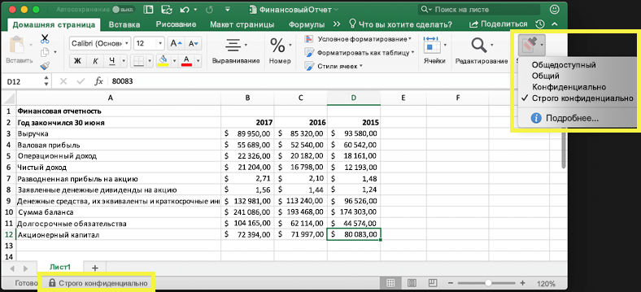

Вы можете использовать метки конфиденциальности, чтобы:You can use sensitivity labels to:
  
- **Применять параметры защиты, такие как шифрование или подложки для контента с метками.** Например, пользователи могут применять метку "Конфиденциально" к документу или электронному сообщению, и эта метка может зашифровать контент и применить подложку "Конфиденциально".**Enforce protection settings such as encryption or watermarks on labeled content.** For example, your users can apply a Confidential label to a document or email, and that label can encrypt the content and apply a Confidential watermark.    

- **Защитить контент в приложениях Office на разных платформах и устройствах.** Метки конфиденциальности применяются в приложениях Office в Windows, Mac, iOS и Android. Поддержка веб-приложений Office ожидается в ближайшее время.**Protect content in Office apps across different platforms and devices.** Sensitivity labels work in Office apps on Windows, Mac, iOS, and Android. Support for Office web apps is coming soon.
    
- **Запретить конфиденциальному контенту покидать вашу организацию на устройствах под управлением Windows**, используя защиту конечных точек в Microsoft Intune. После применения метки конфиденциальности к контенту, расположенному на устройстве с Windows, защита конечных точек позволяет предотвратить копирование контента в сторонние приложения, например Twitter или Gmail, или копирование на съемный носитель, например USB-накопитель.**Prevent sensitive content from leaving your organization on devices running Windows**, by using endpoint protection in Microsoft Intune. After a sensitivity label has been applied to content that resides on a Windows device, endpoint protection can prevent that content from being copied to a third-party app, such as Twitter or Gmail, or being copied to removable storage, such as a USB drive.

- **Защитить контент в сторонних приложениях и службах** с помощью Microsoft Cloud App Security.**Protect content in third-party apps and services**, by using Microsoft Cloud App Security. С помощью Cloud App Security можно определять, классифицировать, помечать и защищать контент в сторонних приложениях и службах, таких как SalesForce, Box или DropBox, даже в том случае, если стороннее приложение или служба не считывает или не поддерживает метки конфиденциальности.With Cloud App Security, you can detect, classify, label, and protect content in third-party apps and services, such as SalesForce, Box, or DropBox, even if the third-party app or service does not read or support sensitivity labels.

- **Расширить применение меток конфиденциальности для сторонних приложений и служб.** С помощью пакета SDK Microsoft Information Protection сторонние приложения на Windows, Mac и Linux могут считывать метки конфиденциальности и применять параметры защиты. Поддержка приложений для iOS и Android ожидается в ближайшее время.**Extend sensitivity labels to third-party apps and services.** With the Microsoft Information Protection SDK, third-party apps on Windows, Mac, and Linux can read sensitivity labels and apply protection settings. Support for apps on iOS and Android is coming soon.

- **Классифицировать контент, не используя параметры защиты.** Вы можете просто назначить классификацию контенту (например, наклейку), которая сохраняется и перемещается с контентом при использовании и распространении. С помощью этой классификации можно создавать отчеты использования и просматривать данные о действиях для конфиденциального контента. На основе этих сведений можно позднее применить параметры защиты.**Classify content without using any protection settings.** You can also simply assign a classification to content (like a sticker) that persists and roams with the content as it's used and shared. You can use this classification to generate usage reports and see activity data for your sensitive content. Based on this information, you can always choose at a later time to apply protection settings.
    
Во всех вышеописанных случаях метки конфиденциальности в Office 365 помогут вам выполнять с контентом действия, соответствующие его характеру. Используя метки конфиденциальности, вы можете классифицировать данные в организации и применять параметры защиты на основе этой классификации.In all of these cases, sensitivity labels in Office 365 can help you take the right actions on the right content. With sensitivity labels, you can classify data across your organization and enforce protection settings based on that classification.
  
Метки конфиденциальности создаются в Центре соответствия требованиям Microsoft 365, Центре безопасности Microsoft 365 или Центре безопасности и соответствия требованиям Office 365. Эти метки конфиденциальности могут использоваться в Azure Information Protection, приложениях Office и службах Office 365.You create sensitivity labels in the Microsoft 365 compliance center, Microsoft 365 security center, or Office 365 Security & Compliance Center. These sensitivity labels can be used by Azure Information Protection, Office apps, and Office 365 services.

Для клиентов Azure Information Protection можно использовать свои метки Azure Information Protection в других центрах администрирования, которые будут синхронизированы с порталом Azure, если вы решите выполнить дополнительную или расширенную настройку.For Azure Information Protection customers, you can use your Azure Information Protection labels in the other admin centers, and your labels will be synced with the Azure portal in case you choose to perform additional or advanced configuration. **Метки Azure Information Protection и метки конфиденциальности Office 365 полностью совместимы друг с другом.****Azure Information Protection labels and Office 365 sensitivity labels are fully compatible with each other.** Это означает, например, что при наличии контента с меткой Azure Information Protection вам не потребуется изменять классификацию или метку вашего контента.This means, for example, if you have content labeled by Azure Information Protection, you won’t need to reclassify or relabel your content.

## Что такое метка конфиденциальностиWhat a sensitivity label is

Метка конфиденциальности, назначенная документу или электронному сообщению, похожа на тег со следующими свойствами:When you assign a sensitivity label to a document or email, it’s simply like a tag that is:

- **Настраиваемость.** Можно создавать категории для разных уровней конфиденциального контента в вашей организации, например личного, общедоступного, общего, конфиденциально и строго конфиденциального.**Customizable.** You can create categories for different levels of sensitive content in your organization, such as Personal, Public, General, Confidential, and Highly Confidential.

- **Обычный текст.** Поскольку метка представлена обычным текстом, она доступна для применения сторонними приложениями и службами защитных действий к помеченному контенту.**Clear text.** Because the label is in clear text, it’s available for third-party apps and services to apply protective actions to labeled content.

- **Сохраняемость.** После применения метки конфиденциальности к контенту она сохраняется в метаданных этого электронного сообщения или документа. Это означает, что метка перемещается с контентом, включая параметры защиты, и становится основой для применения и внедрения политик.**Persistent.** After a sensitivity label is applied to content, it persists in the metadata of that email or document. This means the label roams with the content, including the protection settings, and becomes the basis for applying and enforcing policies.

В приложениях Office метка конфиденциальности просто отображается как тег в сообщении электронной почты или документе.In the Office apps, a sensitivity label simply appears as a tag on an email or document.

К каждому элементу контента может применяться одна метка конфиденциальности. Однако обратите внимание, что к элементу может быть применена одна метка конфиденциальности и одна [метка хранения](labels.md) одновременно.Each item of content can have a single sensitivity label applied to it. But note that an item can have both a single sensitivity label and a single [retention label](labels.md) applied to it.

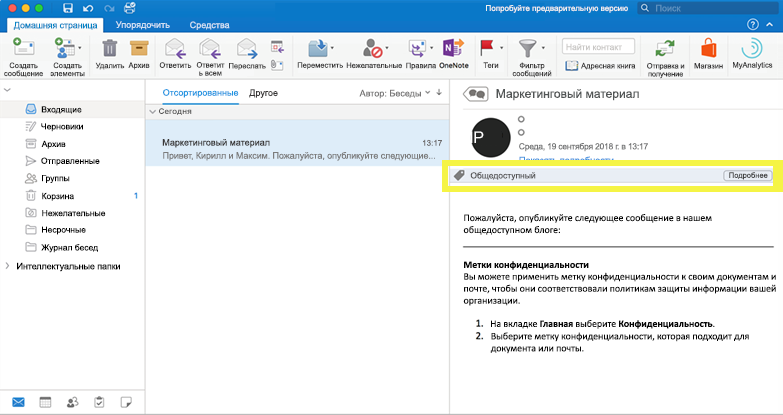

## Возможности меток конфиденциальностиWhat sensitivity labels can do

После присвоения метки конфиденциальности сообщению электронной почты или документу, к контенту применяются параметры защиты для этой метки. С помощью метки конфиденциальности вы можете:After a sensitivity label is applied to an email or document, the protection settings for that label are enforced on the content. With a sensitivity label, you can:

- **Шифровать** только сообщения электронной почты или сообщения электронной почты и документы. Вы можете выбрать, какие пользователи или группы получат разрешения на выполнение определенных действий и на какой срок. Например, вы можете разрешить пользователям в определенном домене за пределами вашей организации просматривать контент только через 7 дней после присвоения метки контенту. Дополнительные сведения см. в статье [Ограничение доступа к содержимому с помощью шифрования в метках конфиденциальности](encryption-sensitivity-labels.md).**Encrypt** email only or both email and documents. You can choose which users or group have permissions to perform which actions and for how long. For example, you can choose to allow users in a specific domain outside your organization to have permissions to review the content for only 7 days after the content is labeled. For more information, see [Restrict access to content by using encryption in sensitivity labels](encryption-sensitivity-labels.md).

- **Помечать содержимое**, добавляя настраиваемые подложки, верхние или нижние колонтитулы в электронные сообщения или документы с примененной меткой. Обратите внимание, что подложки ограничиваются 255 символами и применяются только к документам, а не сообщениям. Кроме того, верхние и нижние колонтитулы ограничиваются 1024 символами, за исключением Excel, где они ограничены 255 символами или даже меньшим количеством символов (это зависит от того, содержит ли документ другие верхние или нижние колонтитулы, и от других факторов).**Mark the content** by adding custom watermarks, headers, or footers to email or documents that have the label applied. Note that watermarks are applied only to documents, not email, and they're limited to 255 characters. Also, headers and footers are limited to 1024 characters (except in Excel, where they're limited to 255 characters or fewer, depending on whether the document contains other headers or footers and other factors.)

    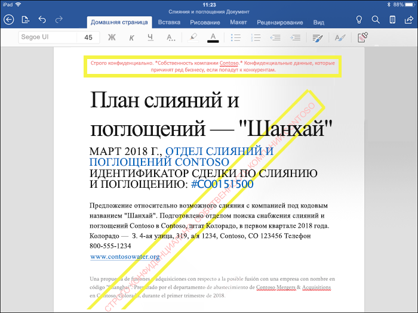

- 
  \*\*Предотвращать потерю данных\*\*, включив защиту конечных точек в Intune. При скачивании конфиденциального контента можно обеспечить защиту от потери данных с устройств с Windows. Например, вы не можете копировать помеченный контент в Dropbox, Gmail или USB-носитель. Прежде чем метки конфиденциальности смогут использовать Windows Information Protection (WIP), необходимо создать политику защиты приложений на портале Azure. Дополнительные сведения см. в статье [Как Windows Information Protection защищает файлы с меткой конфиденциальности](https://docs.microsoft.com/en-us/windows/security/information-protection/windows-information-protection/how-wip-works-with-labels?branch=vsts17546553).**Prevent data loss** by turning on endpoint protection in Intune. If sensitive content gets downloaded, you can help prevent the loss of data from Windows devices. For example, you can’t copy labeled content into Dropbox, Gmail, or USB drive. Before your sensitivity labels can use Windows Information Protection (WIP), you first need to create an app protection policy in the Azure portal. For more information, see [How Windows Information Protection protects files with a sensitivity label](https://docs.microsoft.com/en-us/windows/security/information-protection/windows-information-protection/how-wip-works-with-labels?branch=vsts17546553).

- **Автоматически присваивать метку содержимому с конфиденциальной информацией.** Вы можете выбрать, какие типы конфиденциальной информации нужно помечать. Метку можно присваивать автоматически, или можно отображать для пользователей запрос на присвоение рекомендуемой метки. Если вы рекомендуете метку, текст запроса может быть любым. Дополнительные сведения см. в статье [Автоматическое применение метки конфиденциальности к содержимому](apply_sensitivity_label_automatically.md).**Apply the label automatically to content that contains sensitive information.** You can choose what types of sensitive information that you want labeled, and the label can either be applied automatically, or you can prompt users to apply the label that you recommend. If you recommend a label, the prompt displays whatever text you choose. For more information, see [Apply a sensitivity label to content automatically](apply_sensitivity_label_automatically.md).

    

Все эти параметры доступны при создании метки конфиденциальности.All of these options are available when you create a sensitivity label.

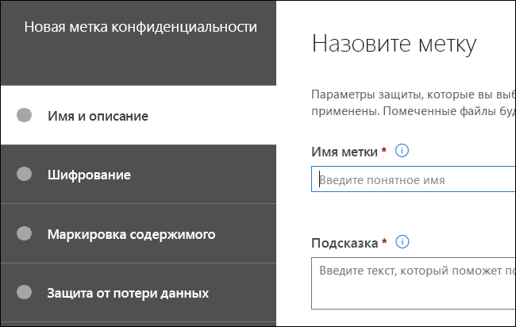

### Приоритет метки (важен порядок)Label priority (order matters)

При создании меток конфиденциальности они отображаются в списке на вкладке **Конфиденциальность** страницы **Метки**.When you create your sensitivity labels, they appear in a list on the **Sensitivity** tab on the **Labels** page. В этом списке важен порядок меток, поскольку он отражает их приоритет.In this list, the order of the labels is important because it reflects their priority. Необходимо, чтобы самые строгие метки конфиденциальности (например, "Строго конфиденциально") отображались в **нижней части** списка, а наименее ограничивающие метки конфиденциальности (например, "Общедоступно") — в **верхней**.You want your most restrictive sensitivity label, such as Highly Confidential, to appear at the **bottom** of the list, and your least restrictive sensitivity label, such as Public, to appear at the **top**.

К документу или электронному сообщению может применяться только одна метка конфиденциальности. Если от пользователей требуется обоснование для изменения метки со снижением уровня классификации, порядок этого списка определяет, что является снижением уровня классификации.A document or email can have only a single sensitivity label applied to it. If you require your users to provide a justification for changing the label to a lower classification, the order of this list determines what's a lower classification.

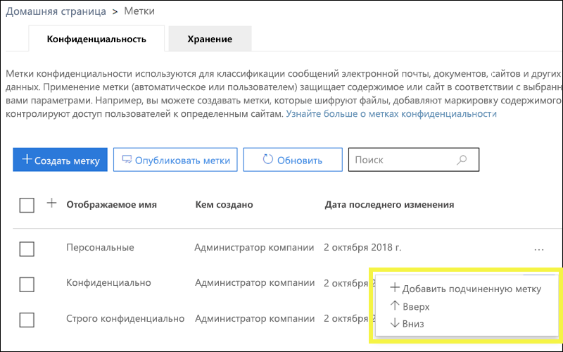

### Подчиненные метки (метки группирования)Sublabels (grouping labels)

С помощью подчиненных меток вы можете группировать одну или несколько меток под родительской меткой, которая видна пользователю в приложении Office.With sublabels, you can group one or more labels below a parent label that a user sees in an Office app. Например, для метки "Конфиденциально" в вашей организации может использоваться несколько разных меток для определенных типов этой классификации.For example, under Confidential, your organization might use several different labels for specific types of that classification. В этом примере родительская метка "Конфиденциально" — это простая текстовая метка без параметров защиты, поэтому ее нельзя применять к содержимому.In this example, the parent label Confidential is simply a text label with no protection settings, and because it has sublabels, it can’t be applied to content. Вместо этого пользователям необходимо выбрать метку "Конфиденциально", чтобы просмотреть подчиненные метки, после чего они смогут выбрать подчиненную метку для применения к содержимому.Instead, users must choose Confidential to view the sublabels, and then they can choose a sublabel to apply to content.

Подчиненные метки — это простой способ представления меток пользователю в логических группах.Sublabels are simply a way to present labels to users in logical groups. Подчиненные метки не наследуют параметры родительской метки.Sublabels don’t inherit any settings from their parent label. Подчиненные метки можно применять к содержимому, а родительские — нет.Sublabels can be applied to content; parent labels cannot.

(Кроме того, не следует выбирать родительскую метку в качестве используемой по умолчанию (см. следующий раздел) или настраивать ее на автоматическое применение или в качестве рекомендуемой, так как родительская метка не применяется к содержимому в приложениях Office, использующих унифицированный клиент присвоения меток Azure Information Protection).(Also, you should not choose a parent label as the default label (see next section), or configure a parent label to be auto-applied or recommended, because the parent label won't be applied to content in Office apps that use the Azure Information Protection unified labeling client.)

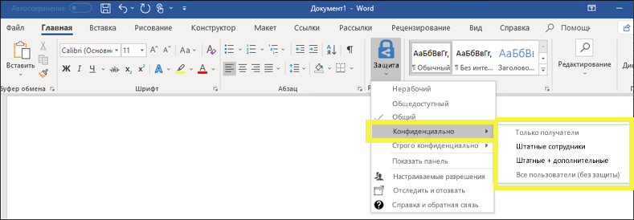

### Изменение и удаление метки конфиденциальностиEditing or deleting a sensitivity label

Если вы удаляете метку конфиденциальности, обратите внимание, что метка не удаляется из контента, и к нему по-прежнему применяются параметры защиты.If you delete a sensitivity label, note that the label is not removed from content, and any protection settings continue to be enforced on the content.

Если вы изменяете метку конфиденциальности, к контенту применяется та версия метки, которая была ему присвоена.If you edit a sensitivity label, the version of the label that was applied to content is what’s enforced on that content.

## Возможности политик метокWhat label policies can do

После создания меток конфиденциальности вам нужно опубликовать их, чтобы сделать их доступными для пользователей организации, которые затем смогут применять метки к контенту. В отличие от меток хранения, которые публикуются для расположений, таких как все почтовые ящики Exchange, метки конфиденциальности публикуются для пользователей или групп. После этого для этих пользователей и групп в приложениях Office появляются метки конфиденциальности.After you create your sensitivity labels, you need to publish them, to make them available to people in your organization, who can then apply the labels to content. Unlike retention labels, which are published to locations, such as all Exchange mailboxes, sensitivity labels are published to users or groups. Sensitivity labels then appear in Office apps for those users and groups.

С помощью политики меток вы можете:With a label policy, you can:

- **Выбирать, какие пользователи и группы видят метки.** Метки могут публиковаться для любой группы безопасности с поддержкой электронной почты, группы рассылки, группы Office 365 или динамической группы рассылки.**Choose which users and groups see the labels.** Labels can be published to any email-enabled security group, distribution group, Office 365 group, or dynamic distribution group.

- **Применять метку по умолчанию** ко всем новым документам и электронным сообщениям, создаваемым пользователями и группами, включенными в политику меток. Эта метка по умолчанию может задавать базовый уровень параметров защиты, которые нужно применять ко всему контенту.**Apply a default label** to all new documents and email created by the users and groups included in the label policy. This default label can set a base level of protection settings that you want applied to all your content.

- **Требовать обоснование для изменения метки.** Если контент помечен меткой "Конфиденциально", и пользователь хочет удалить эту метку или заменить ее со снижением уровня классификации (например, меткой "Общедоступно"), вы можете потребовать у пользователя предоставить обоснование при выполнении этого действия. Эти обоснования будут доступны для проверки администратором. В настоящее время мы работаем над отчетом, где администраторы смогут просматривать обоснования пользователей.**Require a justification for changing a label.** If content is marked Confidential and a user wants to remove that label or replace it with a lower classification, such as a label named Public, you can require that the user provide a justification when performing this action. These justifications will be available for the admin to review. We’re currently working on a report where admins can view the user justifications.

    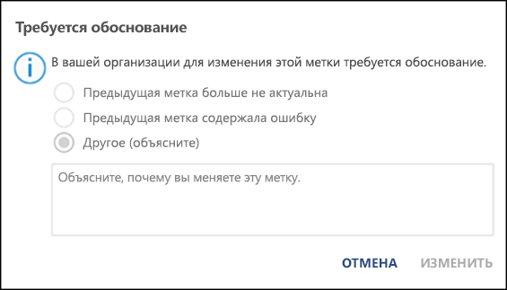

- **Требовать от пользователей применения метки к их почте и документам.** Если нужно помечать все содержимое пользователя, вы можете потребовать обязательное применение меток ко всем сохраняемым документам и отправляемым письмам. Метка может присваиваться вручную пользователем, автоматически в результате применения условия или назначаться по умолчанию (вариант применения метки по умолчанию описан выше). Ниже представлен запрос, отображаемый в Outlook, когда пользователь должен назначить метку.**Require users to apply a label to their email and documents.** If you want all of a user's content to be labeled, you can require that a label must be applied to all of their saved documents and sent emails. The label can be assigned manually by the user, automatically as a result of a condition, or be assigned by default (the default label option described above). Here's the prompt shown in Outlook when a user is required to assign a label.

    > [!NOTE]
    > Для обязательного применения меток требуется подписка Azure Information Protection. Также для этого необходимо скачать и установить [клиент Azure Information Protection](https://www.microsoft.com/en-us/download/details.aspx?id=53018) или [унифицированный клиент присвоения меток Azure Information Protection](https://docs.microsoft.com/ru-RU/azure/information-protection/rms-client/install-unifiedlabelingclient-app). Мы работаем над встроенной поддержкой этой возможности в приложениях Office, чтобы можно было обойтись без клиента Azure Information Protection. Кроме того, этот клиент работает только в Windows, поэтому такая возможность пока не поддерживается в Mac, iOS и Android.Mandatory labeling requires an Azure Information Protection subscription. To use this feature, you must download and install either the [Azure Information Protection client](https://www.microsoft.com/en-us/download/details.aspx?id=53018) or the later [Azure Information Protection unified labeling client](https://docs.microsoft.com/ru-RU/azure/information-protection/rms-client/install-unifiedlabelingclient-app). We're working on native support for this feature in Office apps, so that it won't require the Azure Information Protection client. Also, the client runs only on Windows, so this feature is not yet supported on Mac, iOS, and Android.

    

- **Предоставить справочную ссылку на специальную страницу справки.** Если пользователи не уверены, что означают метки конфиденциальности или как их следует применять, вы можете предоставить URL-адрес с дополнительными сведениями, который отображается в нижней части меню метки конфиденциальности в приложениях Office.**Provide help link to a custom help page.** If your users aren’t sure what your sensitivity labels mean or how they should be used, you can provide a Learn More URL that appears at the bottom of the Sensitivity label menu in the Office apps.

    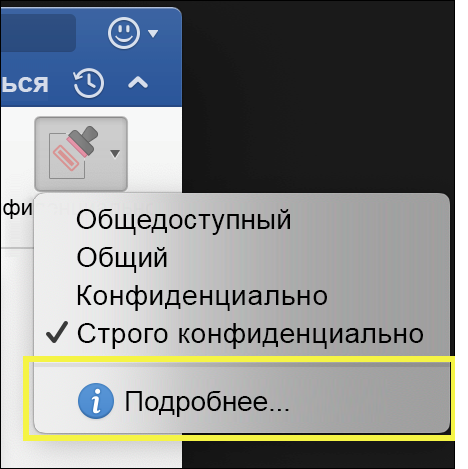

После создания политики меток и назначения меток конфиденциальности пользователям и группам эти метки станут доступны для сотрудников в приложениях Office через час или меньше.After you create a label policy and assign sensitivity labels to users and groups, those people will see those labels available in the Office apps in an hour or less.

## Инструкции по началу работыHow to get started

Начало работы с метками конфиденциальности — это быстрый процесс, представленный ниже.Getting started with sensitivity labels is a quick process:

1. **Определение меток.** Сначала нужно установить таксономию для определения разных уровней конфиденциального контента. Следует использовать общие имена или термины, которые понятны пользователям. Например, можно начать с таких меток, как "Личное", "Общедоступно", "Общее", "Конфиденциально" и "Строго конфиденциально". С помощью подчиненных меток можно группировать похожие метки по категории. Кроме того, при создании метки требуется подсказка, которая отображается в приложениях Office, когда пользователь наводит указатель на параметр метки на ленте.**Define the labels.** First, you want to establish your taxonomy for defining different levels of sensitive content. You should use common names or terms that make sense to your users. For example, you can start with labels such as Personal, Public, General, Confidential, and Highly Confidential. You can use sublabels to group similar labels by category. Also, when you create a label, a tool tip is required, which appears in the Office apps when a user hovers over a label option on the Ribbon.

1. **Определение возможностей каждой метки.** После этого настройте параметры защиты, которые нужно связать с каждой меткой. Например, для контента низкого уровня конфиденциальности (метка "Общее") может просто применяться верхний или нижний колонтитул, а для контента высокого уровня конфиденциальности (метка "Конфиденциально") — подложка, шифрование и WIP, чтобы обеспечить доступ только привилегированным пользователям.**Define what each label can do.** Then, configure the protection settings you want associated with each label. For example, lower sensitivity content (a “General” label) might simply have a header or footer applied to it, while higher sensitivity content (a “Confidential” label) may have a watermark, encryption, and WIP applied to it, to help ensure that only privileged users can access it.
 
1. **Определение получателей меток.** После определения меток вашей организации, опубликуйте их в политике меток, которая определяет, какие пользователи и группы видят эти метки. Отдельная метка пригодна для повторного использования, после определения ее можно включить в несколько политик меток, назначенных разным пользователям. Но для назначения метки контенту необходимо сначала ее опубликовать, чтобы она стала доступной в приложениях Office и других службах. В самом начале работы можно освоить метки конфиденциальности, назначая их лишь нескольким пользователям.**Define who gets the labels.** After you define your organization’s labels, you publish them in a label policy that controls which users and groups see those labels. A single label is reusable – you define it once, and then you can include it in several label policies assigned to different users. But in order for a label to be assigned to content, you must first publish that label so that it’s available in Office apps and other services. When just starting out, you can pilot your sensitivity labels by assigning them to just a few people.

Ниже показан основной процесс действий администратора, пользователя и приложения Office по присвоению меток конфиденциальности.Here’s the basic flow of what the admin, user, and Office app do to make sensitivity labels work.

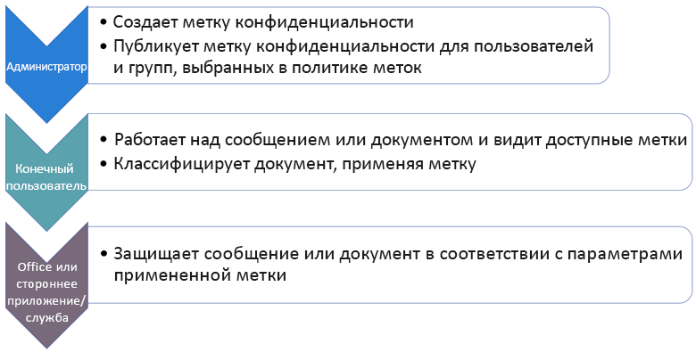

## Где могут отображаться метки конфиденциальностиWhere sensitivity labels can appear

Метки конфиденциальности отображаются в пользовательском интерфейсе приложений Office. Чтобы просмотреть текущую доступность для конкретных приложений и платформ, см. раздел **[Где эта функция доступна прямо сейчас?](https://support.office.com/ru-RU/article/apply-sensitivity-labels-to-your-documents-and-email-within-office-2f96e7cd-d5a4-403b-8bd7-4cc636bae0f9?ad=US&ui=en-US&rs=en-US#bkmk_whereavailable)**Sensitivity labels appear in the UI of Office apps. To view the current availability for specific apps and platforms, see **[Where is the feature available today?](https://support.office.com/ru-RU/article/apply-sensitivity-labels-to-your-documents-and-email-within-office-2f96e7cd-d5a4-403b-8bd7-4cc636bae0f9?ad=US&ui=en-US&rs=en-US#bkmk_whereavailable)**

### Приложения Office в WindowsOffice apps on Windows

В приложениях Office на устройствах под управлением Windows метки конфиденциальности отображаются на кнопке **Конфиденциальность** вкладки **Главная** на ленте. Примененная метка также отображается в строке состояния в нижней части окна.In Office apps on devices running Windows, sensitivity labels appear on the **Sensitivity** button, on the **Home** tab on the Ribbon. The label applied also appears in the Status bar at the bottom of the window.

Встроенная поддержка меток конфиденциальности в приложениях Office для Windows ожидается в ближайшее время.Coming soon is native support for sensitivity labels in Office apps on Windows.

Существующие клиенты Azure Information Protection могут развернуть клиент унифицированного присвоения меток Azure Information Protection, который поддерживает метки конфиденциальности. Дополнительные сведения о скачивании клиента см. в статье [Клиент унифицированного присвоения меток Azure Information Protection: сведения о выпуске версии](https://docs.microsoft.com/ru-RU/azure/information-protection/rms-client/unifiedlabelingclient-version-release-history). В настоящее время мы работаем над встроенной поддержкой меток конфиденциальности в приложениях Office для Windows, чтобы этот клиент больше не требовался.If you're an existing Azure Information Protection customer, you can deploy the Azure Information Protection unified labeling client, which supports sensitivity labels. For more information about downloading the client, see [Azure Information Protection unified labeling client: Version release information](https://docs.microsoft.com/ru-RU/azure/information-protection/rms-client/unifiedlabelingclient-version-release-history). We’re currently working on native support for sensitivity labels in Office apps on Windows, so that the Azure Information Protection unified labeling client will no longer be required.

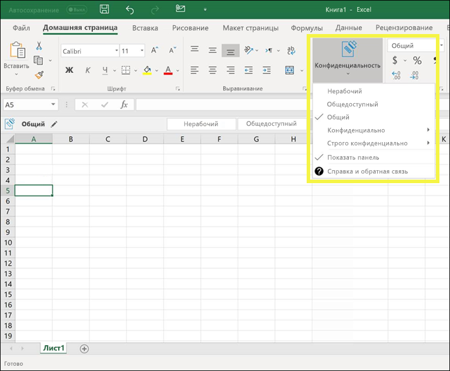

### Приложения Office в MacOffice apps on Mac

В приложениях Office на устройствах Mac метки конфиденциальности отображаются на кнопке **Конфиденциальность** вкладки **Главная** на ленте. Примененная метка также отображается в строке состояния в нижней части окна.In Office apps on Mac devices, sensitivity labels appear on the **Sensitivity** button, on the **Home** tab on the Ribbon. The label applied also appears in the Status bar at the bottom of the window.

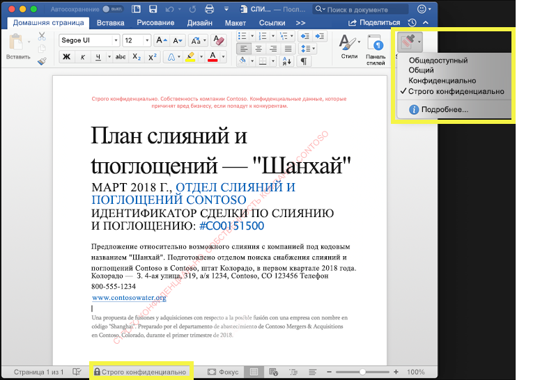

### Приложения Office в iOSOffice apps on iOS

В приложениях Office на устройствах iOS метки конфиденциальности отображаются на кнопке **Конфиденциальность** вкладки **Главная** на ленте. Примененная метка также отображается в строке состояния в нижней части окна.In Office apps on iOS devices, sensitivity labels appear on the **Sensitivity** button, on the **Home** tab on the Ribbon. The label applied also appears in the Status bar at the bottom of the window.

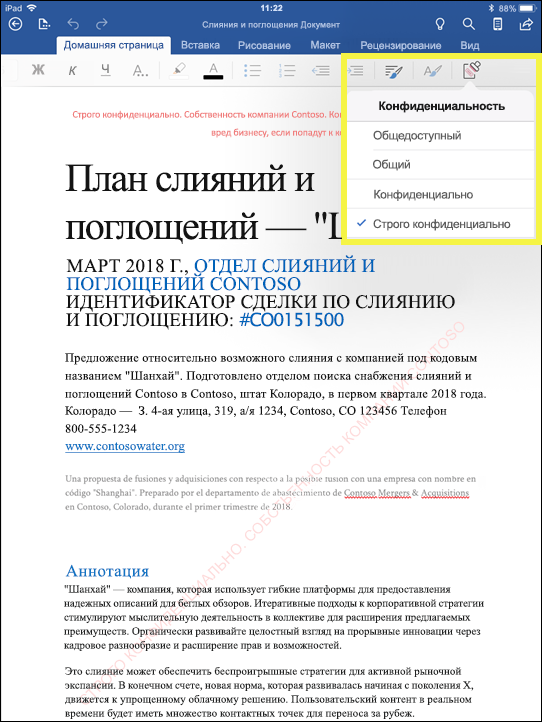

### Приложения Office в AndroidOffice apps on Android

В приложениях Office на устройствах Android метки конфиденциальности отображаются на кнопке **Конфиденциальность** вкладки **Главная** на ленте. Примененная метка также отображается в строке состояния в нижней части окна.In Office apps on Android devices, sensitivity labels appear on the **Sensitivity** button, on the **Home** tab on the Ribbon. The label applied also appears in the Status bar at the bottom of the window.

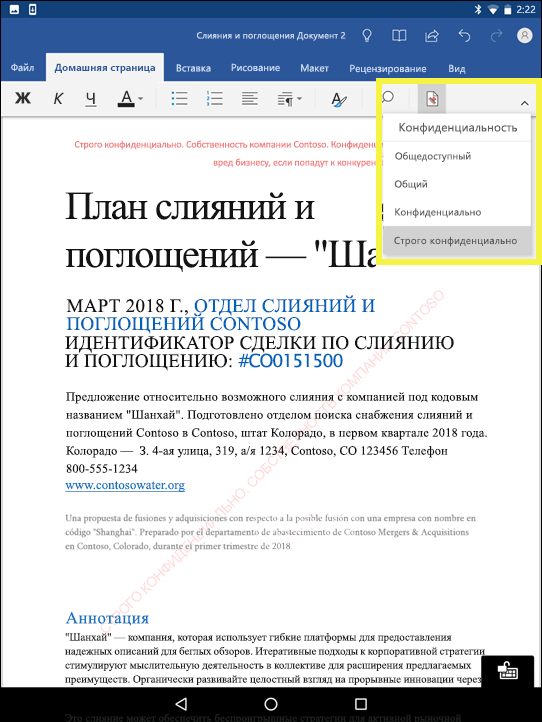

### Дополнительные сведения о метках конфиденциальности в приложениях OfficeMore information on sensitivity labels in Office apps

- [Присваивание меток конфиденциальности документам и сообщениям электронной почты в OfficeApply sensitivity labels to your documents and email within Office](https://support.office.com/ru-RU/article/apply-sensitivity-labels-to-your-documents-and-email-within-office-2f96e7cd-d5a4-403b-8bd7-4cc636bae0f9)
- [Известные проблемы при присваивании меток конфиденциальности файлам OfficeKnown issues when you apply sensitivity labels to your Office files](https://support.office.com/ru-RU/article/known-issues-when-you-apply-sensitivity-labels-to-your-office-files-b169d687-2bbd-4e21-a440-7da1b2743edc)

## Как метки конфиденциальности взаимодействуют с существующими метками Azure Information ProtectionHow sensitivity labels work with existing Azure Information Protection labels

Пользователи Azure Information Protection в настоящее время могут классифицировать и помечать контент в Windows с помощью унифицированного клиента присвоения меток Azure Information Protection. Существующие метки Azure Information Protection легко взаимодействуют с новыми метками конфиденциальности. Это означает, что вы можете:Azure Information Protection users are currently able to classify and label content on Windows by using the Azure Information Protection unified labeling client. Existing Azure Information Protection labels work seamlessly with new sensitivity labels. This means you can:

- сохранить существующие метки Azure Information Protection в документах и электронных сообщениях;Keep your existing Azure Information Protection labels on documents and email.
- сохранить существующую конфигурацию меток Azure Information Protection.Keep your existing Azure Information Protection label configuration.

При использовании меток Azure Information Protection в настоящее время рекомендуется избегать создания новых меток в других центрах администрирования до завершения миграции.If you are using Azure Information Protection labels, for now we recommend that you avoid creating new labels in other admin centers until after you’ve completed your migration. В [статье о миграции Azure Information Protection](https://docs.microsoft.com/ru-RU/azure/information-protection/configure-policy-migrate-labels) содержатся важные сведения и некоторые конкретные предупреждения.The [Azure Information Protection migration topic](https://docs.microsoft.com/ru-RU/azure/information-protection/configure-policy-migrate-labels) has important information and some specific caveats. Если вы еще не готовы перевести клиентов организации на метки конфиденциальности, не стоит беспокоиться, в настоящее время пользователи могут продолжать использовать клиент Azure Information Protection, а администраторы могут продолжать использовать портал Azure для управления.If you are not yet ready to migrate your production tenants to sensitivity labels, there is no cause for concern: for the moment, your users can continue using the Azure Information Protection client, and admins can continue using the Azure portal for management.

## Защита контента на устройствах с Windows с помощью защиты конечных точек в Microsoft IntuneProtect content on Windows devices by using endpoint protection in Microsoft Intune

При создании метки конфиденциальности имеется возможность сообщить Windows, что файлы с этой меткой являются конфиденциальными и должны быть защищены от утечки данных при хранении на устройствах с Windows. Эта возможность обеспечивает распространение или копирование контента с этой меткой только в разрешенные расположения, даже если он хранится в конечной точке. По сути, включение этого параметра для меток конфиденциальности сообщает Windows, что это дополнительные важные данные, требующие дополнительных ограничений использования.When you create a sensitivity label, you have the option to tell Windows that files with this label are sensitive and need to be protected against data leakage when stored on Windows devices. This option can help ensure that content with this label can be shared or copied only to sanctioned locations, even when it’s stored on an endpoint. In essence, turning on this option for a sensitivity label tells Windows that this is extra critical data that warrants additional usage constraints.

Если вы включите этот параметр, Windows сможет считывать и распознавать метки конфиденциальности в документах, действовать в соответствии с ними, а также автоматически применять Windows Information Protection (WIP) для контента, независимо от способа его получения на устройстве под управлением Windows. Это позволяет защищать файлы с метками от случайной утечки, независимо от того, применяется ли шифрование.When you turn on this option, Windows can read, understand, and act on sensitivity labels in documents and automatically apply Windows Information Protection (WIP) on content, no matter how it reaches a managed Windows device. This helps protect labeled files from accidental leakage, with or without applying encryption.

Например, Windows может распознать, что документ Word, хранящийся на компьютере пользователя, содержит присвоенную метку "Конфиденциально", и WIP может применить политику защиты приложений, чтобы запретить копирование или отправку данных с этого устройства в любые нерабочие расположения (например, в личное хранилище OneDrive, личные почтовые учетные записи, социальные сети или USB-накопители).For example, Windows can understand that a Word document residing on a user’s machine has a Confidential label applied to it, and WIP can apply an app protection policy to prevent the copying or sharing of the data to any non-work location from that device (such as a personal OneDrive, personal email accounts, social media, or USB drives).

Если пользователь попытается отправить контент с меткой в личную учетную запись Gmail, появится следующее сообщение.If a user attempts to upload labeled content to a personal Gmail account, they see this message.

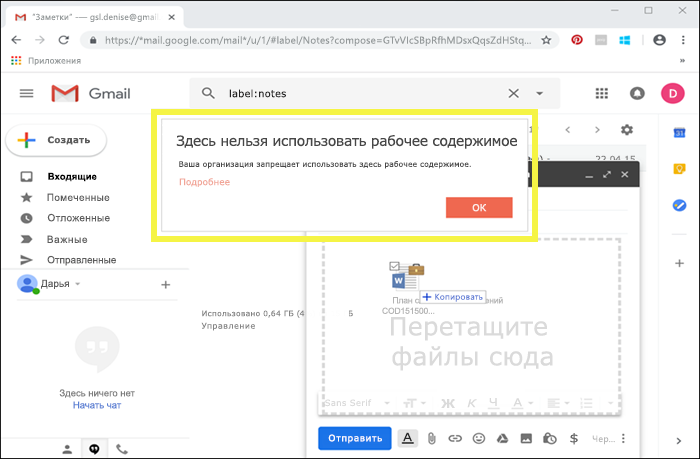

Если пользователь попытается сохранить контент с меткой на USB-накопителе, появится следующее сообщение.And if a user attempts to save labeled content to a USB drive, they see this message.

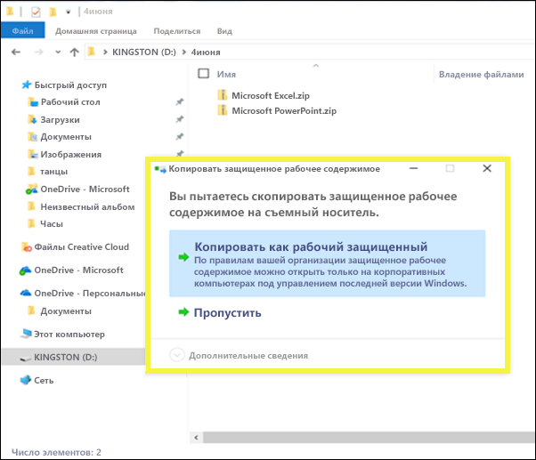

### Важные предварительные условияImportant prerequisites

Прежде чем метки конфиденциальности смогут использовать WIP, требуется выполнить предварительные условия, описанные в статье [Как Windows Information Protection защищает файлы с метками конфиденциальности](https://docs.microsoft.com/en-us/windows/security/information-protection/windows-information-protection/how-wip-works-with-labels?branch=vsts17546553). В ней описаны следующие предварительные условия.Before your sensitivity labels can use WIP, you first need to do the prerequisites described here: [How Windows Information Protection protects files with a sensitivity label](https://docs.microsoft.com/en-us/windows/security/information-protection/windows-information-protection/how-wip-works-with-labels?branch=vsts17546553). This topic describes the following prerequisites:

- Подтверждение использования операционной системы Windows 10 версии 1809 или более поздней версии.Make sure you're running Windows 10, version 1809 or later.
- [Настройка защиты Advanced Threat Protection в Защитнике Windows (WDATP)](https://docs.microsoft.com/ru-RU/windows/security/threat-protection/windows-defender-atp/get-started), которая проверяет контент на наличие метки и применяет соответствующую защиту WIP. ATP выполняет некоторые действия независимо от WIP, например сообщает об аномалиях.[Set up Windows Defender Advanced Threat Protection (WDATP)](https://docs.microsoft.com/ru-RU/windows/security/threat-protection/windows-defender-atp/get-started), which scans content for a label and applies the corresponding WIP protection. ATP performs some actions independently from WIP, such as reporting anomalies.
- Создание политики Windows Information Protection (WIP), применяемой к устройствам конечных точек. Это можно выполнить в любом из этих расположений:Create a Windows Information Protection (WIP) policy that applies to endpoint devices. You can do this in either of these locations:
    - [Создание политики Windows Information Protection (WIP) с использованием MDM с помощью портала Azure для Microsoft IntuneCreate a Windows Information Protection (WIP) policy with MDM using the Azure portal for Microsoft Intune](https://docs.microsoft.com/ru-RU/windows/security/information-protection/windows-information-protection/create-wip-policy-using-intune-azure)
    - [Создание и развертывание политики Windows Information Protection (WIP) с помощью System Center Configuration ManagerCreate and deploy a Windows Information Protection (WIP) policy using System Center Configuration Manager](https://docs.microsoft.com/ru-RU/windows/security/information-protection/windows-information-protection/create-wip-policy-using-sccm)

## Защита содержимого в сторонних приложениях и службах с помощью Microsoft Cloud App SecurityProtect content in third-party apps and services by using Microsoft Cloud App Security

Защитите содержимое в сторонних приложениях и службах, используя Cloud App Security (CAS).Protect content in third-party apps and services by using Cloud App Security (CAS). С помощью CAS можно определять, классифицировать, помечать и защищать контент в сторонних приложениях и службах, таких как SalesForce, Box или Dropbox.With CAS, you can detect, classify, label, and protect content in third-party services and apps, such as SalesForce, Box, or Dropbox. Например, Dropbox может не распознать метку конфиденциальности, но служба CAS обеспечит защиту помеченного контента в этом расположении.For example, Dropbox might not understand a sensitivity label, but CAS can reach out and protect labeled content in that location.

Дополнительные сведения см. в статье [Автоматическое применение меток классификации Azure Information Protection](https://docs.microsoft.com/ru-RU/cloud-app-security/use-case-information-protection).For more information, see [Automatically apply Azure Information Protection classification labels](https://docs.microsoft.com/ru-RU/cloud-app-security/use-case-information-protection).

### Важные предварительные условияImportant prerequisites

Прежде чем метки конфиденциальности смогут использовать CAS, требуется выполнить предварительные условия, описанные в статье [Автоматическое применение меток классификации Azure Information Protection](https://docs.microsoft.com/ru-RU/cloud-app-security/use-case-information-protection).Before your sensitivity labels can use CAS, you first need to do the prerequisites described here: [Automatically apply Azure Information Protection classification labels](https://docs.microsoft.com/ru-RU/cloud-app-security/use-case-information-protection). В ней описаны следующие предварительные условия:This topic describes the following prerequisites:

- [Включение Cloud App Security и Azure Information Protection](https://docs.microsoft.com/ru-RU/cloud-app-security/azip-integration) для вашего клиента.[Enable Cloud App Security and Azure Information Protection](https://docs.microsoft.com/ru-RU/cloud-app-security/azip-integration) for your tenant.
- [Подключение приложения](https://docs.microsoft.com/ru-RU/cloud-app-security/enable-instant-visibility-protection-and-governance-actions-for-your-apps) к Cloud App Security.[Connect the app](https://docs.microsoft.com/ru-RU/cloud-app-security/enable-instant-visibility-protection-and-governance-actions-for-your-apps) to Cloud App Security.

## Расширение применения меток конфиденциальности для сторонних приложений и служб с помощью SDK Microsoft Information ProtectionExtend sensitivity labels to third-party apps and services by using the Microsoft Information Protection SDK

Поскольку метка конфиденциальности сохраняется как обычный текст в метаданных документа, сторонние приложения и службы могут поддерживать определение и защиту контента, содержащего такую метку. Поддержка в других приложениях и службах всегда расширяется.Because a sensitivity label is persisted as clear text in the metadata of a document, third-party apps and services can choose to support identifying and protecting content that contains such a label. Support in other apps and services is always expanding.

С помощью [SDK Microsoft Information Protection](https://docs.microsoft.com/ru-RU/information-protection/develop/) сторонние приложения и службы могут считывать и применять метки конфиденциальности и защиту для документов. Пакет SDK поддерживает приложения на Windows, Mac и Linux. В ближайшее время ожидается поддержка приложений для iOS и Android.With the [Microsoft Information Protection SDK](https://docs.microsoft.com/ru-RU/information-protection/develop/), third-party apps and services can read and apply sensitivity labels and protection to documents. The SDK supports apps on Windows, Mac, and Linux. Coming soon is support for apps on iOS and Android.

С помощью пакета SDK можно помечать и защищать контент способом, совместимым с другими приложениями и службами Microsoft Information Protection, такими как приложения Office, службы Office 365, сканер Azure Information Protection, Microsoft Cloud App Security и несколько других решений партнеров. Для примера можно ознакомиться с [поддержкой меток конфиденциальности в Adobe Acrobat](https://techcommunity.microsoft.com/t5/Azure-Information-Protection/Starting-October-use-Adobe-Acrobat-Reader-for-PDFs-protected-by/ba-p/262738).Using the SDK, you can label and protect content in a way that works with other Microsoft Information Protection apps and services, such as Office apps, Office 365 services, the Azure Information Protection scanner, Microsoft Cloud App Security, and several other partner solutions. For example, learn more about [support for sensitivity labels in Adobe Acrobat](https://techcommunity.microsoft.com/t5/Azure-Information-Protection/Starting-October-use-Adobe-Acrobat-Reader-for-PDFs-protected-by/ba-p/262738).

Дополнительные сведения о пакете SDK Microsoft Information Protection см. в [сообщении блога Tech Community](https://techcommunity.microsoft.com/t5/Microsoft-Information-Protection/Microsoft-Information-Protection-SDK-Now-Generally-Available/ba-p/263144). Вы также можете ознакомиться с [решениями партнеров с интегрированной защитой информации Microsoft](https://techcommunity.microsoft.com/t5/Azure-Information-Protection/Microsoft-Information-Protection-showcases-integrated-partner/ba-p/262657).To learn more about the Microsoft Information Protection SDK, see the [announcement on the Tech Community blog](https://techcommunity.microsoft.com/t5/Microsoft-Information-Protection/Microsoft-Information-Protection-SDK-Now-Generally-Available/ba-p/263144). You can also learn about [partner solutions that are integrated with Microsoft Information Protection](https://techcommunity.microsoft.com/t5/Azure-Information-Protection/Microsoft-Information-Protection-showcases-integrated-partner/ba-p/262657).

## РазрешенияPermissions

Участникам вашей команды по обеспечению соответствия требованиям, которые будут создавать метки конфиденциальности, необходимы разрешения на доступ к Центру безопасности и соответствия требованиям. По умолчанию администратор клиента будет иметь доступ к этому расположению и может предоставлять ответственным за обеспечение соответствия требованиям доступ к Центру безопасности и соответствия требованиям, не предоставляя им все разрешения администратора клиента. Для этого рекомендуем вам перейти на страницу **Разрешения** в Центре безопасности и соответствия требованиям, изменить группу ролей **Администратор соответствия требованиям** и добавить участников в эту группу ролей.Members of your compliance team who will create sensitivity labels need permissions to the Security & Compliance Center. By default, your tenant admin will have access to this location and can give compliance officers and other people access to the Security & Compliance Center, without giving them all of the permissions of a tenant admin. To do this, we recommend that you go to the **Permissions** page of the Security & Compliance Center, edit the **Compliance Administrator** role group, and add members to that role group.

Дополнительные сведения см. в статье [Предоставление пользователям доступа к Центру безопасности и соответствия требованиям Office 365](grant-access-to-the-security-and-compliance-center.md).For more information, see [Give users access to the Office 365 Security & Compliance Center](grant-access-to-the-security-and-compliance-center.md).

Эти разрешения необходимы только для создания и применения меток и соответствующей политики. Для применения политики не требуется доступ к контенту.These permissions are required only to create and apply labels and a label policy. Policy enforcement does not require access to the content.
