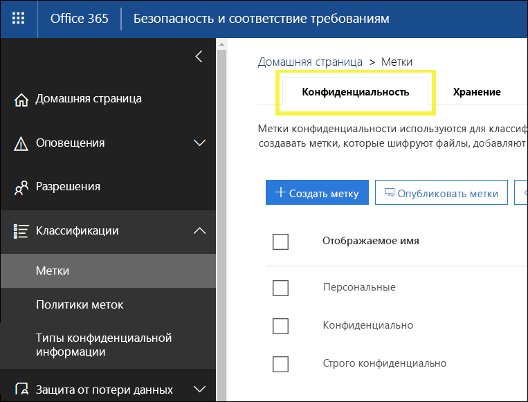

# Обзор меток конфиденциальности

Для выполнения задач пользователям из вашей организации необходимо совместно работать с другими людьми внутри и вне организации. Это означает, что контент покидает границы брандмауэра — он перемещается на устройствах, в приложениях и службах. Его перемещение необходимо обеспечивать безопасным и защищенным способом, который соответствует деятельности вашей организации и политикам соответствия требованиям.

С помощью меток конфиденциальности в Office 365 вы можете классифицировать и защищать конфиденциальный контент, не мешая совместной работе и производительности пользователей.

Вы можете использовать метки конфиденциальности, чтобы:
  
- **Применять параметры защиты, такие как шифрование или подложки для контента с метками.** Например, пользователи могут применять метку "Конфиденциально" к документу или электронному сообщению, и эта метка может зашифровать контент и применить подложку "Конфиденциально".    

- **Защитить контент в приложениях Office на разных платформах и устройствах.** Метки конфиденциальности применяются в приложениях Office в Windows, Mac, iOS и Android. Поддержка веб-приложений Office ожидается в ближайшее время.
    
- **Запретить конфиденциальному контенту покидать вашу организацию на устройствах под управлением Windows**, используя защиту конечных точек в Microsoft Intune. После применения метки конфиденциальности к контенту, расположенному на устройстве с Windows, защита конечных точек позволяет предотвратить копирование контента в сторонние приложения, например Twitter или Gmail, или копирование на съемный носитель, например USB-накопитель.

- **Расширить применение меток конфиденциальности для сторонних приложений и служб.** С помощью пакета SDK Microsoft Information Protection сторонние приложения на Windows, Mac и Linux могут считывать метки конфиденциальности и применять параметры защиты. Поддержка приложений для iOS и Android ожидается в ближайшее время.

- **Классифицировать контент, не используя параметры защиты.** Вы можете просто назначить классификацию контенту (например, наклейку), которая сохраняется и перемещается с контентом при использовании и распространении. С помощью этой классификации можно создавать отчеты использования и просматривать данные о действиях для конфиденциального контента. На основе этих сведений можно позднее применить параметры защиты.
    
Во всех вышеописанных случаях метки конфиденциальности в Office 365 помогут вам выполнять с контентом действия, соответствующие его характеру. Используя метки конфиденциальности, вы можете классифицировать данные в организации и применять параметры защиты на основе этой классификации.
  
Метки конфиденциальности создаются в Центре безопасности и соответствия требованиям Office 365. Центр безопасности и соответствия требованиям — это централизованное место для настройки меток и политик конфиденциальности в Azure Information Protection и Office 365. Эти метки конфиденциальности могут использоваться в Azure Information Protection, приложениях Office и службах Office 365.

Для клиентов Azure Information Protection можно использовать свои метки Azure Information Protection в Центре безопасности и соответствия требованиям, которые будут синхронизированы с порталом Azure, если вы решите выполнить дополнительную или расширенную настройку. **Метки Azure Information Protection и метки конфиденциальности Office 365 полностью совместимы друг с другом.** Это означает, например, что при наличии контента с меткой Azure Information Protection вам не потребуется изменять классификацию или метку вашего контента.

## Что такое метка конфиденциальности

Метка конфиденциальности, назначенная документу или электронному сообщению, похожа на тег со следующими свойствами:

- **Настраиваемость.** Можно создавать категории для разных уровней конфиденциального контента в вашей организации, например личного, общедоступного, общего, конфиденциально и строго конфиденциального.

- **Обычный текст.** Поскольку метка представлена обычным текстом, она доступна для применения сторонними приложениями и службами защитных действий к помеченному контенту.

- **Сохраняемость.** После применения метки конфиденциальности к контенту она сохраняется в метаданных этого электронного сообщения или документа. Это означает, что метка перемещается с контентом, включая параметры защиты, и становится основой для применения и внедрения политик.

В приложениях Office метка конфиденциальности просто отображается как тег в сообщении электронной почты или документе.

К каждому элементу контента может применяться одна метка конфиденциальности. Однако обратите внимание, что к элементу может быть применена одна метка конфиденциальности и одна [метка хранения](labels.md) одновременно.

## Возможности меток конфиденциальности

После присвоения метки конфиденциальности сообщению электронной почты или документу, к контенту применяются параметры защиты для этой метки. С помощью метки конфиденциальности вы можете:

- **Шифровать** только сообщения электронной почты или сообщения электронной почты и документы. Вы можете выбрать, какие пользователи или группы получат разрешения на выполнение определенных действий и на какой срок. Например, вы можете разрешить пользователям в определенном домене за пределами вашей организации просматривать контент только через 7 дней после присвоения метки контенту.

- **Помечать содержимое**, добавляя настраиваемые подложки, верхние или нижние колонтитулы в сообщения электронной почты или документы с примененной меткой. (Обратите внимание, что подложки ограничиваются 255 символами и применяются только к документам, а не сообщениям электронной почты. Кроме того, верхние и нижние колонтитулы ограничиваются 1024 символами, за исключением Excel, где они ограничены 253 символами).

    

- 
  **Предотвращать потерю данных**, включив защиту конечных точек в Intune. При скачивании конфиденциального контента можно обеспечить защиту от потери данных с устройств с Windows. Например, вы не можете копировать помеченный контент в Dropbox, Gmail или USB-носитель. Прежде чем метки конфиденциальности смогут использовать Windows Information Protection (WIP), необходимо создать политику защиты приложений на портале Azure. Дополнительные сведения см. в статье [Как Windows Information Protection защищает файлы с меткой конфиденциальности](https://docs.microsoft.com/en-us/windows/security/information-protection/windows-information-protection/how-wip-works-with-labels?branch=vsts17546553).

Все эти параметры доступны при создании метки в Центре безопасности и соответствия требованиям.

### Приоритет метки (важен порядок)

При создании меток конфиденциальности в Центре безопасности и соответствия требованиям они отображаются в списке на вкладке **Конфиденциальность** страницы **Метки**. В этом списке важен порядок меток, поскольку он отражает их приоритет. Необходимо, чтобы самые строгие метки конфиденциальности (например, "Строго конфиденциально") отображались в **нижней части** списка, а наименее ограничивающие метки конфиденциальности (например, "Общедоступно") — в **верхней**.

К документу или электронному сообщению может применяться только одна метка конфиденциальности. Если от пользователей требуется обоснование для изменения метки со снижением уровня классификации, порядок этого списка определяет, что является снижением уровня классификации.

### Подчиненные метки (метки группирования)

С помощью подчиненных меток вы можете группировать одну или несколько меток под верхним колонтитулом, которые видны пользователю в приложении Office. Например, в разделе "Конфиденциально" вашей организации может использоваться несколько разных меток для определенных типов этой классификации. В этом примере метка "Конфиденциально" — это простая текстовая подпись без параметров защиты, поэтому ее нельзя применять к контенту. Вместо этого пользователям необходимо выбрать раздел "Конфиденциально", чтобы просмотреть подчиненные метки, после чего они смогут выбрать подчиненную метку для применения к контенту.

Подчиненные метки — это простой способ представления меток пользователю в логических группах. Подчиненные метки не наследуют параметры метки, в которую они вложены.

### Изменение и удаление метки конфиденциальности

Если вы удаляете метку конфиденциальности в Центре безопасности и соответствия требованиям, обратите внимание, что метка не удаляется из контента, и к нему по-прежнему применяются параметры защиты.

Если вы изменяете метку конфиденциальности в Центре безопасности и соответствия требованиям, к контенту применяется та версия метки, которая была ему присвоена.

## Возможности политик меток

После создания меток конфиденциальности вам нужно опубликовать их, чтобы сделать их доступными для пользователей организации, которые затем смогут применять метки к контенту. В отличие от меток хранения, которые публикуются для расположений, таких как все почтовые ящики Exchange, метки конфиденциальности публикуются для пользователей или групп. После этого для этих пользователей и групп в приложениях Office появляются метки конфиденциальности.

С помощью политики меток вы можете:

- **Выбирать, какие пользователи и группы видят метки.** Метки могут публиковаться для любой группы безопасности с поддержкой электронной почты, группы рассылки, группы Office 365 или динамической группы рассылки.

- **Применять метку по умолчанию** ко всем новым документам и электронным сообщениям, создаваемым пользователями и группами, включенными в политику меток. Эта метка по умолчанию может задавать базовый уровень параметров защиты, которые нужно применять ко всему контенту.

- **Требовать обоснование для изменения метки.** Если контент помечен меткой "Конфиденциально", и пользователь хочет удалить эту метку или заменить ее со снижением уровня классификации (например, меткой "Общедоступно"), вы можете потребовать у пользователя предоставить обоснование при выполнении этого действия. Эти обоснования будут доступны для проверки администратором. В настоящее время мы работаем над отчетом, где администраторы смогут просматривать обоснования пользователей.

    

- **Предоставить справочную ссылку на специальную страницу справки.** Если пользователи не уверены, что означают метки конфиденциальности или как их следует применять, вы можете предоставить URL-адрес с дополнительными сведениями, который отображается в нижней части меню метки конфиденциальности в приложениях Office.

    

После создания политики меток и назначения меток конфиденциальности пользователям и группам эти метки станут доступны для сотрудников в приложениях Office через час или меньше.

## Инструкции по началу работы

Начало работы с метками конфиденциальности — это быстрый процесс, представленный ниже.

1. **Определение меток.** Сначала нужно установить таксономию для определения разных уровней конфиденциального контента. Следует использовать общие имена или термины, которые понятны пользователям. Например, можно начать с таких меток, как "Личное", "Общедоступно", "Общее", "Конфиденциально" и "Строго конфиденциально". С помощью подчиненных меток можно группировать похожие метки по категории. Кроме того, при создании метки требуется подсказка, которая отображается в приложениях Office, когда пользователь наводит указатель на параметр метки на ленте.

1. **Определение возможностей каждой метки.** После этого настройте параметры защиты, которые нужно связать с каждой меткой. Например, для контента низкого уровня конфиденциальности (метка "Общее") может просто применяться верхний или нижний колонтитул, а для контента высокого уровня конфиденциальности (метка "Конфиденциально") — подложка, шифрование и WIP, чтобы обеспечить доступ только привилегированным пользователям.
 
1. **Определение получателей меток.** После определения меток вашей организации, опубликуйте их в политике меток, которая определяет, какие пользователи и группы видят эти метки. Отдельная метка пригодна для повторного использования, после определения ее можно включить в несколько политик меток, назначенных разным пользователям. Но для назначения метки контенту необходимо сначала ее опубликовать, чтобы она стала доступной в приложениях Office и других службах. В самом начале работы можно освоить метки конфиденциальности, назначая их лишь нескольким пользователям.

Ниже показан основной процесс действий администратора, пользователя и приложения Office по присвоению меток конфиденциальности.

## Где могут отображаться метки конфиденциальности

Метки конфиденциальности отображаются в пользовательском интерфейсе приложений Office. Чтобы просмотреть текущую доступность для конкретных приложений и платформ, см. раздел **[Где эта функция доступна прямо сейчас?](https://support.office.com/ru-RU/article/apply-sensitivity-labels-to-your-documents-and-email-within-office-2f96e7cd-d5a4-403b-8bd7-4cc636bae0f9?ad=US&ui=en-US&rs=en-US#bkmk_whereavailable)**

### Приложения Office в Windows

В приложениях Office на устройствах под управлением Windows метки конфиденциальности отображаются на кнопке **Конфиденциальность** вкладки **Главная** на ленте. Примененная метка также отображается в строке состояния в нижней части окна.

Встроенная поддержка меток конфиденциальности в приложениях Office для Windows ожидается в ближайшее время.

Существующие клиенты Azure Information Protection могут развернуть унифицированный клиент присвоения меток Azure Information Protection, который поддерживает метки конфиденциальности и ожидается в ближайшее время. (Следите за ссылкой на сведения о том, как развернуть клиент). В настоящее время мы работаем над встроенной поддержкой меток конфиденциальности в приложениях Office для Windows, чтобы больше не требовался унифицированный клиент присвоения меток Azure Information Protection.

### Приложения Office в Mac

В приложениях Office на устройствах Mac метки конфиденциальности отображаются на кнопке **Конфиденциальность** вкладки **Главная** на ленте. Примененная метка также отображается в строке состояния в нижней части окна.

### Приложения Office в iOS

В приложениях Office на устройствах iOS метки конфиденциальности отображаются на кнопке **Конфиденциальность** вкладки **Главная** на ленте. Примененная метка также отображается в строке состояния в нижней части окна.

### Приложения Office в Android

В приложениях Office на устройствах Android метки конфиденциальности отображаются на кнопке **Конфиденциальность** вкладки **Главная** на ленте. Примененная метка также отображается в строке состояния в нижней части окна.

### Дополнительные сведения о метках конфиденциальности в приложениях Office

- [Присваивание меток конфиденциальности документам и сообщениям электронной почты в Office](https://support.office.com/ru-RU/article/apply-sensitivity-labels-to-your-documents-and-email-within-office-2f96e7cd-d5a4-403b-8bd7-4cc636bae0f9)
- [Известные проблемы при присваивании меток конфиденциальности файлам Office](https://support.office.com/ru-RU/article/known-issues-when-you-apply-sensitivity-labels-to-your-office-files-b169d687-2bbd-4e21-a440-7da1b2743edc)

## Как метки конфиденциальности взаимодействуют с существующими метками Azure Information Protection

Пользователи Azure Information Protection в настоящее время могут классифицировать и помечать контент в Windows с помощью унифицированного клиента присвоения меток Azure Information Protection. Существующие метки Azure Information Protection легко взаимодействуют с новыми метками конфиденциальности. Это означает, что вы можете:

- сохранить существующие метки Azure Information Protection в документах и электронных сообщениях;
- сохранить существующую конфигурацию меток Azure Information Protection.

При использовании меток Azure Information Protection в настоящее время рекомендуется избегать создания новых меток в Центре безопасности и соответствия требованиям до завершения миграции. В [статье о миграции Azure Information Protection](https://docs.microsoft.com/ru-RU/azure/information-protection/configure-policy-migrate-labels) содержатся важные сведения и некоторые конкретные предупреждения. Если вы еще не готовы перевести клиентов организации на метки конфиденциальности, не стоит беспокоиться, в настоящее время пользователи могут продолжать использовать клиент Azure Information Protection, а администраторы могут продолжать использовать портал Azure для управления.

## Защита контента на устройствах с Windows с помощью защиты конечных точек в Microsoft Intune

При создании метки конфиденциальности имеется возможность сообщить Windows, что файлы с этой меткой являются конфиденциальными и должны быть защищены от утечки данных при хранении на устройствах с Windows. Эта возможность обеспечивает распространение или копирование контента с этой меткой только в разрешенные расположения, даже если он хранится в конечной точке. По сути, включение этого параметра для меток конфиденциальности сообщает Windows, что это дополнительные важные данные, требующие дополнительных ограничений использования.

Если вы включите этот параметр, Windows сможет считывать и распознавать метки конфиденциальности в документах, действовать в соответствии с ними, а также автоматически применять Windows Information Protection (WIP) для контента, независимо от способа его получения на устройстве под управлением Windows. Это позволяет защищать файлы с метками от случайной утечки, независимо от того, применяется ли шифрование.

Например, Windows может распознать, что документ Word, хранящийся на компьютере пользователя, содержит присвоенную метку "Конфиденциально", и WIP может применить политику защиты приложений, чтобы запретить копирование или отправку данных с этого устройства в любые нерабочие расположения (например, в личное хранилище OneDrive, личные почтовые учетные записи, социальные сети или USB-накопители).

Если пользователь попытается отправить контент с меткой в личную учетную запись Gmail, появится следующее сообщение.

Если пользователь попытается сохранить контент с меткой на USB-накопителе, появится следующее сообщение.

### Важные предварительные условия

Прежде чем метки конфиденциальности смогут использовать WIP, требуется выполнить предварительные условия, описанные в статье [Как Windows Information Protection защищает файлы с метками конфиденциальности](https://docs.microsoft.com/en-us/windows/security/information-protection/windows-information-protection/how-wip-works-with-labels?branch=vsts17546553). В ней описаны следующие предварительные условия.

- Подтверждение использования операционной системы Windows 10 версии 1809 или более поздней версии.
- [Настройка защиты Advanced Threat Protection в Защитнике Windows (WDATP)](https://docs.microsoft.com/ru-RU/windows/security/threat-protection/windows-defender-atp/get-started), которая проверяет контент на наличие метки и применяет соответствующую защиту WIP. ATP выполняет некоторые действия независимо от WIP, например сообщает об аномалиях.
- Создание политики Windows Information Protection (WIP), применяемой к устройствам конечных точек. Это можно выполнить в любом из этих расположений:
    - [Создание политики Windows Information Protection (WIP) с использованием MDM с помощью портала Azure для Microsoft Intune](https://docs.microsoft.com/ru-RU/windows/security/information-protection/windows-information-protection/create-wip-policy-using-intune-azure)
    - [Создание и развертывание политики Windows Information Protection (WIP) с помощью System Center Configuration Manager](https://docs.microsoft.com/ru-RU/windows/security/information-protection/windows-information-protection/create-wip-policy-using-sccm)

## Расширение применения меток конфиденциальности для сторонних приложений и служб с помощью SDK Microsoft Information Protection

Поскольку метка конфиденциальности сохраняется как обычный текст в метаданных документа, сторонние приложения и службы могут поддерживать определение и защиту контента, содержащего такую метку. Поддержка в других приложениях и службах всегда расширяется.

С помощью [SDK Microsoft Information Protection](https://docs.microsoft.com/ru-RU/information-protection/develop/) сторонние приложения и службы могут считывать и применять метки конфиденциальности и защиту для документов. Пакет SDK поддерживает приложения на Windows, Mac и Linux. В ближайшее время ожидается поддержка приложений для iOS и Android.

С помощью пакета SDK можно помечать и защищать контент способом, совместимым с другими приложениями и службами Microsoft Information Protection, такими как приложения Office, службы Office 365, сканер Azure Information Protection, Microsoft Cloud App Security и несколько других решений партнеров. Для примера можно ознакомиться с [поддержкой меток конфиденциальности в Adobe Acrobat](https://techcommunity.microsoft.com/t5/Azure-Information-Protection/Starting-October-use-Adobe-Acrobat-Reader-for-PDFs-protected-by/ba-p/262738).

Дополнительные сведения о пакете SDK Microsoft Information Protection см. в [сообщении блога Tech Community](https://techcommunity.microsoft.com/t5/Microsoft-Information-Protection/Microsoft-Information-Protection-SDK-Now-Generally-Available/ba-p/263144). Вы также можете ознакомиться с [решениями партнеров с интегрированной защитой информации Microsoft](https://techcommunity.microsoft.com/t5/Azure-Information-Protection/Microsoft-Information-Protection-showcases-integrated-partner/ba-p/262657).

## Разрешения

Участникам вашей команды по обеспечению соответствия требованиям, которые будут создавать метки конфиденциальности, необходимы разрешения на доступ к Центру безопасности и соответствия требованиям. По умолчанию администратор клиента будет иметь доступ к этому расположению и может предоставлять ответственным за обеспечение соответствия требованиям доступ к Центру безопасности и соответствия требованиям, не предоставляя им все разрешения администратора клиента. Для этого рекомендуем вам перейти на страницу **Разрешения** в Центре безопасности и соответствия требованиям, изменить группу ролей **Администратор соответствия требованиям** и добавить участников в эту группу ролей.

Дополнительные сведения см. в статье "Предоставление пользователям доступа к Центру безопасности и соответствия требованиям Office 365".

Эти разрешения необходимы только для создания и применения меток и соответствующей политики. Для применения политики не требуется доступ к контенту.
