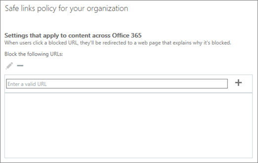

# Настроить пользовательский заблокированных список URL-адресов с помощью Office 365 ATP безопасных ссылки

С [Защиту от угроз для Office 365 Advanced](office-365-atp.md) (ATP) ваша организация может иметь настраиваемый список адресов веб-сайта (URL-адреса), которые блокируются. При блокировании URL-адрес людей, щелкните на ссылки, заблокированные URL-адрес, взяты [страницы предупреждение](atp-safe-links-warning-pages.md) , выглядит следующим образом: 
  

  
Черный список URL-адресов определяется группа безопасности вашей организации Office 365, и этот список применяется ко всем пользователям в организации, который покрывает безопасных связи с Office 365 ATP политик. 
  
В этой статье, чтобы узнать, как настроить настраиваемые черный список URL-адресов вашей организации для [Анализа безопасных ссылок в Office 365](atp-safe-links.md).
  
## Просмотр или изменение настраиваемого списка заблокированных URL-адресов

[ATP безопасных ссылок в Office 365](atp-safe-links.md) использует несколько списков, включая настраиваемые черный список URL-адресов вашей организации. При наличии необходимых разрешений можно настроить пользовательский список вашей организации. Это делается путем редактирования политики безопасных ссылки вашей организации по умолчанию.
  
1. Последовательно выберите пункты [https://protection.office.com](https://protection.office.com) и войдите с учетной записи рабочего или школы. 
    
2. В левой панели навигации в разделе **Управление угроз**, выберите **политику** \> **Безопасных ссылки**.
    
3. Раздел **политики, которые применяются во всей организации** выберите вариант **по умолчанию**и выберите команду **Изменить** ("Изменить" представляет Карандаш). 
    
    
  
    Здесь указывается, куда просматривать список заблокированных URL-адреса. Обратите внимание, что в первую очередь, не будут иметь все URL-адреса из списка.
    
    
  
4. Выберите поле **Введите допустимый URL-адрес** и введите URL-адрес, а затем нажмите знак плюс (+). Ниже перечислены следует помнить о нескольких моментах: 
    
  - Можно указать только для домена URL-адрес (например `contoso.com` или `tailspintoys.com`). Это будет блокировать щелчков на любой URL-адрес, содержащий домен.
    
  - Не включать косую черту ( **/**) в конце URL-адрес. Например, вместо ввода `http://www.contoso.com/`, введите `http://www.contoso.com`.
    
  - Может включать до трех подстановочные знаки звездочки (\*) на URL-адрес. В следующей таблице перечислены, имеют несколько примеров можно ввести и что в силу операций.
    
|**Пример записи**|**Описание**|
|:-----|:-----|
|`contoso.com`или`*contoso.com*`    |Блокирует домен, поддомены и пути, такие как `https://www.contoso.com`, `http://sub.contoso.com`, и`http://contoso.com/abc`    |
|`http://contoso.com/a`    |Блокирует сайта `http://contoso.com/a` , но не дополнительные субконтуров like`http://contoso.com/a/b`    |
|`http://contoso.com/a*`    |Блокирует сайта `http://contoso.com/a` и дополнительные субконтуров, например`http://contoso.com/a/b`    |
   
5. Завершив добавление URL-адресов, в правом нижнем углу экрана, выберите команду **Сохранить**.
    
## Как определить исключения для некоторых пользователей в организации

Если вы хотите определенных групп, чтобы иметь возможность просматривать URL-адресов, которые могут быть заблокированы для других пользователей, можно указать безопасных ссылок анализа политику, применяемую к определенным получателям. В разделе [Настройка настраиваемого «не rewrite» URL-адреса списка с помощью надежных ссылок анализа](set-up-a-custom-do-not-rewrite-urls-list-with-atp.md).
  
## Смежные темы

[Office 365 Advanced Threat Protection](office-365-atp.md)
  
[Безопасно ATP ссылок в Office 365](atp-safe-links.md)
  
[Настройка политик ATP безопасных ссылок в Office 365](set-up-atp-safe-links-policies.md)
  
[Безопасно ATP вложений в Office 365](atp-safe-attachments.md)

[Разрешения безопасности Office 365 &amp; центре соответствия требованиям](permissions-in-the-security-and-compliance-center.md)
  

