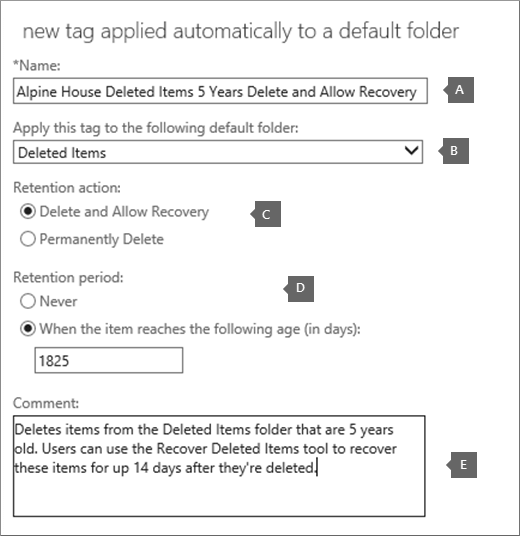

# <a name="set-up-an-archive-and-deletion-policy-for-mailboxes-in-your-office-365-organization"></a><span data-ttu-id="8496d-103">Настройка политики архивации и удаления для почтовых ящиков в организации Office 365</span><span class="sxs-lookup"><span data-stu-id="8496d-103">Set up an archive and deletion policy for mailboxes in your Office 365 organization</span></span>

 <span data-ttu-id="8496d-104">В Office 365 администраторы могут создать политику архивации и удаления, которая автоматически перемещает элементы в архивный почтовый ящик пользователя и автоматически удаляет элементы из почтового ящика.</span><span class="sxs-lookup"><span data-stu-id="8496d-104">In Office 365, admins can create an archiving and deletion policy that automatically moves items to a user's archive mailbox and automatically deletes items from the mailbox.</span></span> <span data-ttu-id="8496d-105">Администратор выполняет это, создавая политику хранения, назначенную для почтовых ящиков, и перемещает элементы в архивный почтовый ящик пользователя по истечении определенного периода времени, а также удаляет элементы из почтового ящика после достижения определенного лимита.</span><span class="sxs-lookup"><span data-stu-id="8496d-105">The admin does this by creating a retention policy that's assigned to mailboxes, and moves items to a user's archive mailbox after a certain period of time and that also deletes items from the mailbox after they reach a certain age limit.</span></span> <span data-ttu-id="8496d-106">Фактические правила, определяющие, какие элементы были перемещены или удалены, а когда это происходит, называются тегами хранения.</span><span class="sxs-lookup"><span data-stu-id="8496d-106">The actual rules that determine what items are moved or deleted and when that happens are called retention tags.</span></span> <span data-ttu-id="8496d-107">Теги хранения связаны с политикой хранения, которая в свою очередь назначена почтовому ящику пользователя.</span><span class="sxs-lookup"><span data-stu-id="8496d-107">Retention tags are linked to a retention policy, that in turn is assigned to a user's mailbox.</span></span> <span data-ttu-id="8496d-108">Тег хранения применяет параметры хранения к отдельным сообщениям и папкам в почтовом ящике пользователя.</span><span class="sxs-lookup"><span data-stu-id="8496d-108">A retention tag applies retention settings to individual messages and folders in a user's mailbox.</span></span> <span data-ttu-id="8496d-109">Он определяет срок хранения сообщения в почтовом ящике и действия, выполняемые при достижении сообщением указанного срока хранения.</span><span class="sxs-lookup"><span data-stu-id="8496d-109">It defines how long a message remains in the mailbox and what action is taken when the message reaches the specified retention age.</span></span> <span data-ttu-id="8496d-110">При достижении срок хранения сообщения он либо перемещается в архивный почтовый ящик пользователя, либо удаляется.</span><span class="sxs-lookup"><span data-stu-id="8496d-110">When a message reaches its retention age, it's either moved to the user's archive mailbox or it's deleted.</span></span> 
  
<span data-ttu-id="8496d-111">Действия, описанные в этой статье, настраивают политику архивации и хранения для фиктивной организации Alpine House.</span><span class="sxs-lookup"><span data-stu-id="8496d-111">The steps in this article will set up an archiving and retention policy for a fictitious organization named Alpine House.</span></span> <span data-ttu-id="8496d-112">Настройка этой политики включает в себя следующие задачи:</span><span class="sxs-lookup"><span data-stu-id="8496d-112">Setting up this policy includes the following tasks:</span></span>
  
- <span data-ttu-id="8496d-113">Включение архивного почтового ящика для каждого пользователя в Организации.</span><span class="sxs-lookup"><span data-stu-id="8496d-113">Enabling an archive mailbox for every user in the organization.</span></span> <span data-ttu-id="8496d-114">Это позволяет пользователям дополнительно добавить хранилище почтовых ящиков и обязательно для того, чтобы политика хранения могла перемещать элементы в архивный почтовый ящик.</span><span class="sxs-lookup"><span data-stu-id="8496d-114">This gives users addition mailbox storage, and is required so that a retention policy can move items to the archive mailbox.</span></span> <span data-ttu-id="8496d-115">Кроме того, пользователи могут хранить архивные сведения, перемещая элементы в архивный почтовый ящик.</span><span class="sxs-lookup"><span data-stu-id="8496d-115">It also let's a user store archival information by moving items to their archive mailbox.</span></span> 
    
- <span data-ttu-id="8496d-116">Создание трех настраиваемых тегов хранения, которые выполняют следующие действия:</span><span class="sxs-lookup"><span data-stu-id="8496d-116">Creating three custom retention tags that do the following:</span></span> 
    
  - <span data-ttu-id="8496d-117">Автоматически перемещает элементы, которые старше 3 лет, в архивный почтовый ящик пользователя.</span><span class="sxs-lookup"><span data-stu-id="8496d-117">Automatically moves items that are 3 years old to the user's archive mailbox.</span></span> <span data-ttu-id="8496d-118">Перемещение элементов в архивный почтовый ящик освобождает место в основном почтовом ящике пользователя.</span><span class="sxs-lookup"><span data-stu-id="8496d-118">Moving items to the archive mailbox frees up space in a user's primary mailbox.</span></span>
    
  - <span data-ttu-id="8496d-119">Автоматически удаляет из папки "Удаленные" элементы, которые устарели на 5 лет.</span><span class="sxs-lookup"><span data-stu-id="8496d-119">Automatically deletes items that are 5 years old from the Deleted Items folder.</span></span> <span data-ttu-id="8496d-120">При этом также освобождается место в основном почтовом ящике пользователя.</span><span class="sxs-lookup"><span data-stu-id="8496d-120">This also frees up space in the user's primary mailbox.</span></span> <span data-ttu-id="8496d-121">При необходимости у пользователя будет возможность восстановить эти элементы.</span><span class="sxs-lookup"><span data-stu-id="8496d-121">User's will have the opportunity to recover these items if necessary.</span></span> <span data-ttu-id="8496d-122">Дополнительные сведения можно найти в сноске в разделе [Дополнительные сведения](#more-information) .</span><span class="sxs-lookup"><span data-stu-id="8496d-122">See the footnote in the [More information](#more-information) section for more details.</span></span> 
    
  - <span data-ttu-id="8496d-123">Автоматически (и окончательно) удаляет элементы, старые из основного и архивного почтового ящика — 7 лет.</span><span class="sxs-lookup"><span data-stu-id="8496d-123">Automatically (and permanently) deletes items that are 7 years old from both the primary and archive mailbox.</span></span> <span data-ttu-id="8496d-124">Из-за нормативных требований некоторые организации должны хранить электронную почту в течение определенного периода времени.</span><span class="sxs-lookup"><span data-stu-id="8496d-124">Because of compliance regulations, some organization's are required to retain email for a certain period of time.</span></span> <span data-ttu-id="8496d-125">По истечении этого периода Организации может потребоваться окончательно удалить эти элементы почтовых ящиков пользователей.</span><span class="sxs-lookup"><span data-stu-id="8496d-125">After this time period expires, an organization might want to permanently remove these items user mailboxes.</span></span> 
    
- <span data-ttu-id="8496d-126">Создание новой политики хранения и добавление в нее новых пользовательских тегов хранения.</span><span class="sxs-lookup"><span data-stu-id="8496d-126">Creating a new retention policy and adding the new custom retention tags to it.</span></span> <span data-ttu-id="8496d-127">Кроме того, вы также добавляете встроенные теги хранения в новую политику хранения.</span><span class="sxs-lookup"><span data-stu-id="8496d-127">Additionally, you'll also add built-in retention tags to the new retention policy.</span></span> <span data-ttu-id="8496d-128">Сюда входят персональные теги, которые пользователи могут назначать элементам в их почтовом ящике.</span><span class="sxs-lookup"><span data-stu-id="8496d-128">This includes personal tags that users can assign to items in their mailbox.</span></span> <span data-ttu-id="8496d-129">Вы также добавите тег хранения, который переместит элементы из папки "элементы с возможностью восстановления" в основном почтовом ящике пользователя в папку "элементы с возможностью восстановления" в своем архивном почтовом ящике.</span><span class="sxs-lookup"><span data-stu-id="8496d-129">You'll also add a retention tag that moves items from the Recoverable Items folder in the user's primary mailbox to the Recoverable Items folder in their archive mailbox.</span></span> <span data-ttu-id="8496d-130">Это помогает освободить место в папке "элементы с возможностью восстановления", когда их почтовые ящики помещается в удержание.</span><span class="sxs-lookup"><span data-stu-id="8496d-130">This helps free up space in a user's Recoverable Items folder when their mailbox is placed on hold.</span></span>
    
<span data-ttu-id="8496d-131">Вы можете выполнить некоторые или все действия, описанные в этой статье, чтобы настроить политику архивирования и удаления для почтовых ящиков в своей организации.</span><span class="sxs-lookup"><span data-stu-id="8496d-131">You can follow some or all of the steps in this article to set up an archive and deletion policy for mailboxes in your own organization.</span></span> <span data-ttu-id="8496d-132">Рекомендуется протестировать этот процесс на нескольких почтовых ящиках, прежде чем внедрять его во все почтовые ящики в Организации.</span><span class="sxs-lookup"><span data-stu-id="8496d-132">We recommend that you test this process on a few mailboxes before implementing it on all mailboxes in your organization.</span></span>
  
## <a name="before-you-begin"></a><span data-ttu-id="8496d-133">Перед началом работы</span><span class="sxs-lookup"><span data-stu-id="8496d-133">Before you begin</span></span>

- <span data-ttu-id="8496d-134">Для выполнения действий, описанных в этом разделе, необходимо быть глобальным администратором в организации Office 365.</span><span class="sxs-lookup"><span data-stu-id="8496d-134">You have to be a global administrator in your Office 365 organization to perform the steps in this topic.</span></span> 
    
-  <span data-ttu-id="8496d-135">При создании новой учетной записи пользователя в Office 365 и назначении пользователю лицензии на Exchange Online для пользователя автоматически создается почтовый ящик.</span><span class="sxs-lookup"><span data-stu-id="8496d-135">When you create a new user account in Office 365 and assign the user an Exchange Online license, a mailbox is automatically created for the user.</span></span> <span data-ttu-id="8496d-136">После создания почтового ящика ему автоматически назначается политика хранения по умолчанию с именем Default управления ЗАПИСЯМИ сообщений Policy.</span><span class="sxs-lookup"><span data-stu-id="8496d-136">When the mailbox is created, it's automatically assigned a default retention policy, named Default MRM Policy.</span></span> <span data-ttu-id="8496d-137">В этой статье вы создадите новую политику хранения и назначите ее почтовым ящикам пользователей, заменив политику управления ЗАПИСЯМИ сообщений по умолчанию.</span><span class="sxs-lookup"><span data-stu-id="8496d-137">In this article, you will create a new retention policy and then assign it to user mailboxes, replacing the Default MRM policy.</span></span> <span data-ttu-id="8496d-138">В любой момент времени в почтовом ящике может быть назначена только одна политика хранения.</span><span class="sxs-lookup"><span data-stu-id="8496d-138">A mailbox can have only one retention policy assigned to it at any one time.</span></span>
    
- <span data-ttu-id="8496d-139">Чтобы узнать больше о тегах хранения и политиках хранения в Exchange Online, ознакомьтесь с разметкими [хранения и политиками хранения](https://go.microsoft.com/fwlink/p/?LinkId=404424).</span><span class="sxs-lookup"><span data-stu-id="8496d-139">To learn more about retention tags and retention policies in Exchange Online, see [Retention tags and retention policies](https://go.microsoft.com/fwlink/p/?LinkId=404424).</span></span>
    
## <a name="step-1-enable-archive-mailboxes-for-users"></a><span data-ttu-id="8496d-140">Шаг 1: включение архивных почтовых ящиков для пользователей</span><span class="sxs-lookup"><span data-stu-id="8496d-140">Step 1: Enable archive mailboxes for users</span></span>

<span data-ttu-id="8496d-141">Первым шагом является включение архивного почтового ящика для каждого пользователя в Организации.</span><span class="sxs-lookup"><span data-stu-id="8496d-141">The first step is to enable the archive mailbox for each user in your organization.</span></span> <span data-ttu-id="8496d-142">Архивный почтовый ящик пользователя должен быть включен, чтобы тег хранения с действием хранения "переместить в архив" можно было переместить элемент после истечения срока хранения.</span><span class="sxs-lookup"><span data-stu-id="8496d-142">A user's archive mailbox has to be enabled so that a retention tag with a "Move to Archive" retention action can move the item after the retention age expires.</span></span> 
  
> [!NOTE]
> <span data-ttu-id="8496d-143">Вы можете включить архивные почтовые ящики в любое время в течение этого процесса, пока они включены в некоторый момент до завершения процесса.</span><span class="sxs-lookup"><span data-stu-id="8496d-143">You can enable archive mailboxes any time during this process, just as long as they're enabled at some point before you complete the process.</span></span> <span data-ttu-id="8496d-144">Если архивный почтовый ящик не включен, никакие действия не выполняются ни для каких элементов, для которых назначена политика архивации.</span><span class="sxs-lookup"><span data-stu-id="8496d-144">If an archive mailbox isn't enabled, no action is taken on any items that have an archive policy assigned to it.</span></span> 
  
1. <span data-ttu-id="8496d-145">Перейдите по ссылке [https://protection.office.com](https://protection.office.com).</span><span class="sxs-lookup"><span data-stu-id="8496d-145">Go to [https://protection.office.com](https://protection.office.com).</span></span>
    
2. <span data-ttu-id="8496d-146">Sign in to Office 365 using your global administrator account.</span><span class="sxs-lookup"><span data-stu-id="8496d-146">Sign in to Office 365 using your global administrator account.</span></span>
    
    
3. <span data-ttu-id="8496d-147">В центре обеспечения безопасности _амп_ выберите пункт **Архив**управления **данными** \> .</span><span class="sxs-lookup"><span data-stu-id="8496d-147">In the Security & Compliance Center, go to **Data governance** \> **Archive**.</span></span>
    
    <span data-ttu-id="8496d-148">Отображается список почтовых ящиков в Организации, а также включен или отключен соответствующий архивный почтовый ящик.</span><span class="sxs-lookup"><span data-stu-id="8496d-148">A list of the mailboxes in your organization is displayed and whether the corresponding archive mailbox is enabled or disabled.</span></span> 
    
4. <span data-ttu-id="8496d-149">Выберите все почтовые ящики, щелкнув первую из них в списке, удерживая клавишу **SHIFT** , а затем выбрав последнюю из списка.</span><span class="sxs-lookup"><span data-stu-id="8496d-149">Select all the mailboxes by clicking on the first one in the list, holding down the **Shift** key, and then clicking the last one in the list.</span></span> 
    
    > [!TIP]
    > <span data-ttu-id="8496d-150">На этом этапе предполагается, что архивные почтовые ящики не включены.</span><span class="sxs-lookup"><span data-stu-id="8496d-150">This step assumes that no archive mailboxes are enabled.</span></span> <span data-ttu-id="8496d-151">Если у вас есть почтовые ящики с включенным архивом, удерживайте клавишу **CTRL** и щелкайте все почтовые ящики с отключенным архивным почтовым ящиком.</span><span class="sxs-lookup"><span data-stu-id="8496d-151">If you have any mailboxes with the archive enabled, hold down the **Ctrl** key and click each mailbox that has a disabled archive mailbox.</span></span> <span data-ttu-id="8496d-152">Кроме того, можно щелкнуть \*\*\*\* заголовок столбца архивного почтового ящика, чтобы отсортировать строки в зависимости от того, включен или отключен архивный почтовый ящик, чтобы упростить выбор почтовых ящиков.</span><span class="sxs-lookup"><span data-stu-id="8496d-152">Or you can click the **Archive mailbox** column header to sort the rows based on whether the archive mailbox is enabled or disabled to make it easier to select mailboxes.</span></span> 
  
5. <span data-ttu-id="8496d-153">В области сведений в разделе **массовое редактирование**нажмите кнопку **включить**.</span><span class="sxs-lookup"><span data-stu-id="8496d-153">In the details pane, under **Bulk Edit**, click **Enable**.</span></span>
    
    <span data-ttu-id="8496d-154">Отображается предупреждение о том, что элементы старше двух лет будут перемещены в новый архивный почтовый ящик.</span><span class="sxs-lookup"><span data-stu-id="8496d-154">A warning is displayed saying that items that are older than two years will be moved to the new archive mailbox.</span></span> <span data-ttu-id="8496d-155">Это связано с тем, что политика хранения по умолчанию, назначенная новому почтовому ящику пользователя при его создании, содержит тег политики по умолчанию архива с сроком хранения в 2 года.</span><span class="sxs-lookup"><span data-stu-id="8496d-155">This is because the default retention policy that's assigned a new user mailbox when it's created has an archive default policy tag that has a retention age of 2 years.</span></span> <span data-ttu-id="8496d-156">Тег политики по умолчанию настраиваемого архива, который вы создадите на шаге 2, имеет срок хранения в 3 года.</span><span class="sxs-lookup"><span data-stu-id="8496d-156">The custom archive default policy tag that you'll create in Step 2 has a retention age of 3 years.</span></span> <span data-ttu-id="8496d-157">Это означает, что элементы, которые имеют 3 года или более ранних версий, будут перемещены в архивный почтовый ящик.</span><span class="sxs-lookup"><span data-stu-id="8496d-157">That means items that are 3 years or older will be moved to the archive mailbox.</span></span>
    
6. <span data-ttu-id="8496d-158">Нажмите кнопку **Да** , чтобы закрыть сообщение с предупреждением, и запустите процесс, чтобы включить архивный почтовый ящик для каждого выбранного почтового ящика.</span><span class="sxs-lookup"><span data-stu-id="8496d-158">Click **Yes** to close the warning message and start the process to enable the archive mailbox for each selected mailbox.</span></span> 
    
7. <span data-ttu-id="8496d-159">По завершении процесса нажмите кнопку **Обновить**  , чтобы обновить список на странице **Архив** .</span><span class="sxs-lookup"><span data-stu-id="8496d-159">When the process is complete, click **Refresh**  to update the list on the **Archive** page.</span></span> 
    
    <span data-ttu-id="8496d-160">Архивный почтовый ящик включен для всех пользователей в Организации.</span><span class="sxs-lookup"><span data-stu-id="8496d-160">The archive mailbox is enabled for all user's in your organization.</span></span>
    
    
  
8. <span data-ttu-id="8496d-162">Не закрывайте Центр обеспечения безопасности _Амп_.</span><span class="sxs-lookup"><span data-stu-id="8496d-162">Leave the Security & Compliance Center open.</span></span> <span data-ttu-id="8496d-163">Вы будете использовать его на следующем этапе.</span><span class="sxs-lookup"><span data-stu-id="8496d-163">You'll use it in the next step.</span></span>
    
## <a name="step-2-create-new-retention-tags-for-the-archive-and-deletion-policies"></a><span data-ttu-id="8496d-164">Шаг 2: создание новых тегов хранения для политик архивации и удаления</span><span class="sxs-lookup"><span data-stu-id="8496d-164">Step 2: Create new retention tags for the archive and deletion policies</span></span>

<span data-ttu-id="8496d-165">На этом этапе вы создадите три пользовательских тега хранения, описанные ранее.</span><span class="sxs-lookup"><span data-stu-id="8496d-165">In this step, you'll create the three custom retention tags that were previously described.</span></span>
  
- <span data-ttu-id="8496d-166">"Alpine House 3 Year Move to Archive" (настраиваемая политика архивации)</span><span class="sxs-lookup"><span data-stu-id="8496d-166">Alpine House 3 Year Move to Archive (custom archive policy)</span></span>
    
- <span data-ttu-id="8496d-167">Alpine House 7 год без возможности восстановления (настраиваемая политика удаления)</span><span class="sxs-lookup"><span data-stu-id="8496d-167">Alpine House 7 Year Permanently Delete (custom deletion policy)</span></span>
    
- <span data-ttu-id="8496d-168">Alpine House Deleted Items 5 years Delete and reallow Recovery (настраиваемый тег для папки "Удаленные")</span><span class="sxs-lookup"><span data-stu-id="8496d-168">Alpine House Deleted Items 5 Years Delete and Allow Recovery (custom tag for the Deleted Items folder)</span></span>
    
<span data-ttu-id="8496d-169">Чтобы создать новые теги хранения, вы можете использовать центр администрирования Exchange в организации Exchange Online.</span><span class="sxs-lookup"><span data-stu-id="8496d-169">To create new retention tags, you'll use the Exchange admin center (EAC) in your Exchange Online organization.</span></span>
  
1. <span data-ttu-id="8496d-170">В центре безопасности _Амп_ соответствие требованиям щелкните средство запуска приложений в левом верхнем углу, а затем щелкните плитку **Администратор** .</span><span class="sxs-lookup"><span data-stu-id="8496d-170">In the Security & Compliance Center, click the app launcher  in the upper left corner, and then click the **Admin** tile .</span></span> 
    
2. <span data-ttu-id="8496d-171">В левой области навигации центра администрирования Microsoft 365 щелкните **центр администрирования**, а затем выберите **Exchange**.</span><span class="sxs-lookup"><span data-stu-id="8496d-171">In the left navigation pane of the Microsoft 365 admin center, click **Admin centers**, and then click **Exchange**.</span></span>
    
    
  
3. <span data-ttu-id="8496d-173">В центре администрирования Exchange выберите \> **теги хранения** **управления соответствием требованиям**</span><span class="sxs-lookup"><span data-stu-id="8496d-173">In the EAC, go to **Compliance management** \> **Retention tags**</span></span>
    
    <span data-ttu-id="8496d-174">Отобразится список тегов хранения для вашей организации.</span><span class="sxs-lookup"><span data-stu-id="8496d-174">A list of the retention tags for your organization is displayed.</span></span>
    
### <a name="create-a-custom-archive-default-policy-tag"></a><span data-ttu-id="8496d-175">Создание настраиваемого тега политики по умолчанию</span><span class="sxs-lookup"><span data-stu-id="8496d-175">Create a custom archive default policy tag</span></span>
  
<span data-ttu-id="8496d-176">Сначала вы создадите настраиваемый тег политики по умолчанию (DPT), который будет перемещать элементы в архивный почтовый ящик через 3 года.</span><span class="sxs-lookup"><span data-stu-id="8496d-176">First, you'll create a custom archive default policy tag (DPT) that will move items to the archive mailbox after 3 years.</span></span> 
  
1. <span data-ttu-id="8496d-177">На странице " **теги хранения** " нажмите **создать тег**, а затем автоматически Установите флажок **Применить автоматически ко всему почтовому ящику (по умолчанию)**.</span><span class="sxs-lookup"><span data-stu-id="8496d-177">On the **Retention tags** page, click **New tag**, and then select **applied automatically to entire mailbox (default)**.</span></span> 
    
2. <span data-ttu-id="8496d-178">На странице **новый тег автоматически применяется ко всему почтовому ящику (по умолчанию)** заполните следующие поля:</span><span class="sxs-lookup"><span data-stu-id="8496d-178">On the **New tag applied automatically to entire mailbox (default)** page, complete the following fields:</span></span> 
    
    
  
1. <span data-ttu-id="8496d-180">**Name (имя** ) Введите имя нового тега хранения.</span><span class="sxs-lookup"><span data-stu-id="8496d-180">**Name** Type a name for the new retention tag.</span></span> 
    
2. <span data-ttu-id="8496d-181">**Действие хранения** Выберите **переместить в архив** , чтобы переместить элементы в архивный почтовый ящик по истечении периода хранения.</span><span class="sxs-lookup"><span data-stu-id="8496d-181">**Retention action** Select **Move to Archive** to move items to the archive mailbox when the retention period expires.</span></span> 
    
3. <span data-ttu-id="8496d-182">Срок **хранения** Выберите, **когда элемент достигает следующего срока хранения (в днях)**, а затем введите продолжительность периода хранения.</span><span class="sxs-lookup"><span data-stu-id="8496d-182">**Retention period** Select **When the item reaches the following age (in days)**, and then enter the duration of the retention period.</span></span> <span data-ttu-id="8496d-183">В этом сценарии элементы будут перемещены в архивный почтовый ящик через 1095 дней (3 года).</span><span class="sxs-lookup"><span data-stu-id="8496d-183">For this scenario, items will be moved to the archive mailbox after 1095 days (3 years).</span></span>
    
4. <span data-ttu-id="8496d-184">**Comment (комментарий** ) Необязательно Введите комментарий, поясняющий назначение настраиваемого тега хранения.</span><span class="sxs-lookup"><span data-stu-id="8496d-184">**Comment** (Optional) Type a comment that explains the purpose of the custom retention tag.</span></span> 
    
3. <span data-ttu-id="8496d-185">Нажмите кнопку **сохранить** , чтобы создать настраиваемый Архив DPT.</span><span class="sxs-lookup"><span data-stu-id="8496d-185">Click **Save** to create the custom archive DPT.</span></span> 
    
    <span data-ttu-id="8496d-186">Новый архив DPT отображается в списке тегов хранения.</span><span class="sxs-lookup"><span data-stu-id="8496d-186">The new archive DPT is displayed in the list of retention tags.</span></span>
    
### <a name="create-a-custom-deletion-default-policy-tag"></a><span data-ttu-id="8496d-187">Создание настраиваемого тега политики по умолчанию для удаления</span><span class="sxs-lookup"><span data-stu-id="8496d-187">Create a custom deletion default policy tag</span></span>
  
<span data-ttu-id="8496d-188">Далее вы создадите еще один настраиваемый DPT, но это будет политика удаления, которая окончательно удаляет элементы после 7 лет.</span><span class="sxs-lookup"><span data-stu-id="8496d-188">Next, you'll create another custom DPT but this one will be a deletion policy that permanently deletes items after 7 years.</span></span>
  
1. <span data-ttu-id="8496d-189">На странице " **теги хранения** " нажмите **создать тег**, а затем автоматически Установите флажок **Применить автоматически ко всему почтовому ящику (по умолчанию)**.</span><span class="sxs-lookup"><span data-stu-id="8496d-189">On the **Retention tags** page, click **New tag**, and then select **applied automatically to entire mailbox (default)**.</span></span> 
    
2. <span data-ttu-id="8496d-190">На странице **новый тег автоматически применяется ко всему почтовому ящику (по умолчанию)** заполните следующие поля:</span><span class="sxs-lookup"><span data-stu-id="8496d-190">On the **New tag applied automatically to entire mailbox (default)** page, complete the following fields:</span></span> 
    
    
  
1. <span data-ttu-id="8496d-192">**Name (имя** ) Введите имя нового тега хранения.</span><span class="sxs-lookup"><span data-stu-id="8496d-192">**Name** Type a name for the new retention tag.</span></span> 
    
2. <span data-ttu-id="8496d-193">**Действие хранения** Выберите **навсегда удалить** , чтобы очистить элементы из почтового ящика по истечении срока хранения.</span><span class="sxs-lookup"><span data-stu-id="8496d-193">**Retention action** Select **Permanently Delete** to purge items from the mailbox when the retention period expires.</span></span> 
    
3. <span data-ttu-id="8496d-194">Срок **хранения** Выберите, **когда элемент достигает следующего срока хранения (в днях)**, а затем введите продолжительность периода хранения.</span><span class="sxs-lookup"><span data-stu-id="8496d-194">**Retention period** Select **When the item reaches the following age (in days)**, and then enter the duration of the retention period.</span></span> <span data-ttu-id="8496d-195">В этом случае элементы будут очищаться после 2555 дней (7 лет).</span><span class="sxs-lookup"><span data-stu-id="8496d-195">For this scenario, items will be purged after 2555 days (7 years).</span></span>
    
4. <span data-ttu-id="8496d-196">**Comment (комментарий** ) Необязательно Введите комментарий, поясняющий назначение настраиваемого тега хранения.</span><span class="sxs-lookup"><span data-stu-id="8496d-196">**Comment** (Optional) Type a comment that explains the purpose of the custom retention tag.</span></span> 
    
3. <span data-ttu-id="8496d-197">Нажмите кнопку **сохранить** , чтобы создать настраиваемое DPT удаления.</span><span class="sxs-lookup"><span data-stu-id="8496d-197">Click **Save** to create the custom deletion DPT.</span></span> 
    
    <span data-ttu-id="8496d-198">Новый DPT удаления отображается в списке тегов хранения.</span><span class="sxs-lookup"><span data-stu-id="8496d-198">The new deletion DPT is displayed in the list of retention tags.</span></span>
    
### <a name="create-a-custom-retention-policy-tag-for-the-deleted-items-folder"></a><span data-ttu-id="8496d-199">Создание настраиваемого тега политики хранения для папки "Удаленные"</span><span class="sxs-lookup"><span data-stu-id="8496d-199">Create a custom retention policy tag for the Deleted Items folder</span></span>
  
<span data-ttu-id="8496d-200">Последний созданный тег хранения — это настраиваемый тег политики хранения (RPT) для папки "Удаленные".</span><span class="sxs-lookup"><span data-stu-id="8496d-200">The last retention tag that you'll create is a custom retention policy tag (RPT) for the Deleted Items folder.</span></span> <span data-ttu-id="8496d-201">Этот тег удалит элементы в папке "Удаленные" через 5 лет и предоставляет период восстановления, когда пользователи могут использовать средство восстановления удаленных элементов для восстановления элемента.</span><span class="sxs-lookup"><span data-stu-id="8496d-201">This tag will delete items in the Deleted Items folder after 5 years, and provides a recovery period when users can use the Recover Deleted Items tool to recover an item.</span></span>
  
1. <span data-ttu-id="8496d-202">На странице " **теги хранения** " нажмите **создать тег** , а затем автоматически Установите флажок **применено к папке по умолчанию**.</span><span class="sxs-lookup"><span data-stu-id="8496d-202">On the **Retention tags** page, click **New tag** , and then select **applied automatically to a default folder**.</span></span> 
    
2. <span data-ttu-id="8496d-203">В **новом теге, автоматически примененном к странице папки по умолчанию** , заполните следующие поля:</span><span class="sxs-lookup"><span data-stu-id="8496d-203">On the **New tag applied automatically to a default folder** page, complete the following fields:</span></span> 
    
    
  
1. <span data-ttu-id="8496d-205">**Name (имя** ) Введите имя нового тега хранения.</span><span class="sxs-lookup"><span data-stu-id="8496d-205">**Name** Type a name for the new retention tag.</span></span> 
    
2. <span data-ttu-id="8496d-206">**Применять этот тег к следующей папке по умолчанию** В раскрывающемся списке выберите пункт **Удаленные элементы**.</span><span class="sxs-lookup"><span data-stu-id="8496d-206">**Apply this tag to the following default folder** In the drop-down list, select **Deleted Items**.</span></span>
    
3. <span data-ttu-id="8496d-207">**Действие хранения** Выберите пункт **Удалить и разрешить восстановление** , чтобы удалить элементы по истечении срока хранения, но разрешить пользователям восстанавливать удаленные элементы в течение срока хранения удаленных элементов (значение по умолчанию — 14 дней).</span><span class="sxs-lookup"><span data-stu-id="8496d-207">**Retention action** Select **Delete and Allow Recovery** to delete items when the retention period expires, but allow users to recover a deleted item within the deleted item retention period (which by default is 14 days).</span></span> 
    
4. <span data-ttu-id="8496d-208">Срок **хранения** Выберите, **когда элемент достигает следующего срока хранения (в днях)**, а затем введите продолжительность периода хранения.</span><span class="sxs-lookup"><span data-stu-id="8496d-208">**Retention period** Select **When the item reaches the following age (in days)**, and then enter the duration of the retention period.</span></span> <span data-ttu-id="8496d-209">В этом случае элементы будут удалены по истечении 1825 дней (5 лет).</span><span class="sxs-lookup"><span data-stu-id="8496d-209">For this scenario, items will be deleted after 1825 days (5 years).</span></span>
    
5. <span data-ttu-id="8496d-210">**Comment (комментарий** ) Необязательно Введите комментарий, поясняющий назначение настраиваемого тега хранения.</span><span class="sxs-lookup"><span data-stu-id="8496d-210">**Comment** (Optional) Type a comment that explains the purpose of the custom retention tag.</span></span> 
    
3. <span data-ttu-id="8496d-211">Нажмите кнопку **сохранить** , чтобы создать настраиваемый RPT для папки "Удаленные".</span><span class="sxs-lookup"><span data-stu-id="8496d-211">Click **Save** to create the custom RPT for the Deleted Items folder.</span></span> 
    
    <span data-ttu-id="8496d-212">Новый RPT отображается в списке тегов хранения.</span><span class="sxs-lookup"><span data-stu-id="8496d-212">The new RPT is displayed in the list of retention tags.</span></span>

## <a name="step-3-create-a-new-retention-policy"></a><span data-ttu-id="8496d-213">Шаг 3: создание новой политики хранения</span><span class="sxs-lookup"><span data-stu-id="8496d-213">Step 3: Create a new retention policy</span></span>

<span data-ttu-id="8496d-214">После создания пользовательских тегов хранения следующим шагом является создание новой политики хранения и добавление тегов хранения.</span><span class="sxs-lookup"><span data-stu-id="8496d-214">After you create the custom retention tags, the next step is to create a new retention policy and add the retention tags.</span></span> <span data-ttu-id="8496d-215">Вы добавите три настраиваемых тега хранения, созданные в шаге 2, и встроенные теги, упомянутые в первом разделе.</span><span class="sxs-lookup"><span data-stu-id="8496d-215">You'll add the three custom retention tags that you created in Step 2, and the built-in tags that were mentioned in the first section.</span></span> <span data-ttu-id="8496d-216">На шаге 4 вы присвоите новую политику хранения почтовым ящикам пользователей.</span><span class="sxs-lookup"><span data-stu-id="8496d-216">In Step 4, you'll assign this new retention policy to user mailboxes.</span></span>
  
1. <span data-ttu-id="8496d-217">В центре администрирования Exchange перейдите к разделу \> **политики хранения** **управления соответствием требованиям** .</span><span class="sxs-lookup"><span data-stu-id="8496d-217">In the EAC, go to **Compliance management** \> **Retention policies**.</span></span>
    
2. <span data-ttu-id="8496d-218">На странице " **политики хранения** " нажмите кнопку **создать** значок.</span><span class="sxs-lookup"><span data-stu-id="8496d-218">On the **Retention policies** page, click **New** .</span></span>
    
3. <span data-ttu-id="8496d-219">В поле **имя** введите имя новой политики хранения; Например, " **Alpine House Archive and Repolicy Policy**".</span><span class="sxs-lookup"><span data-stu-id="8496d-219">In the **Name** box, type a name for the new retention policy; for example, **Alpine House Archive and Deletion Policy**.</span></span> 
    
4. <span data-ttu-id="8496d-220">В разделе **теги хранения**нажмите кнопку **Добавить** значок.</span><span class="sxs-lookup"><span data-stu-id="8496d-220">Under **Retention tags**, click **Add** .</span></span>
    
    <span data-ttu-id="8496d-221">Отобразится список тегов хранения в Организации.</span><span class="sxs-lookup"><span data-stu-id="8496d-221">A list of the retention tags in your organization is displayed.</span></span> <span data-ttu-id="8496d-222">Обратите внимание на то, что отображаются настраиваемые теги, созданные в шаге 2.</span><span class="sxs-lookup"><span data-stu-id="8496d-222">Note the custom tags that you created in Step 2 are displayed.</span></span>
    
5. <span data-ttu-id="8496d-223">Добавьте теги хранения 9, выделенные на следующем снимке экрана (эти теги подробно описаны в разделе [Дополнительные сведения](#more-information) ).</span><span class="sxs-lookup"><span data-stu-id="8496d-223">Add the 9 retention tags that are highlighted in the following screenshot (these tags are described in more detail in the [More information](#more-information) section).</span></span> <span data-ttu-id="8496d-224">Чтобы добавить тег хранения, выберите его и нажмите кнопку **Добавить**.</span><span class="sxs-lookup"><span data-stu-id="8496d-224">To add a retention tag, select it and then click **Add**.</span></span> 
    
    
  
    > [!TIP]
    > <span data-ttu-id="8496d-226">Можно выбрать несколько тегов хранения, удерживая нажатой клавишу **CTRL** и щелкая каждый тег.</span><span class="sxs-lookup"><span data-stu-id="8496d-226">You can select multiple retention tags by holding down the **Ctrl** key and then clicking each tag.</span></span> 
  
6. <span data-ttu-id="8496d-227">Добавив теги хранения, нажмите кнопку **ОК**.</span><span class="sxs-lookup"><span data-stu-id="8496d-227">After you've added the retention tags, click **OK**.</span></span>
    
7. <span data-ttu-id="8496d-228">На странице **Создание политики хранения** нажмите кнопку **сохранить** , чтобы создать новую политику.</span><span class="sxs-lookup"><span data-stu-id="8496d-228">On the **New retention policy** page, click **Save** to create the new policy.</span></span> 
    
    <span data-ttu-id="8496d-229">Новая политика хранения появится в списке.</span><span class="sxs-lookup"><span data-stu-id="8496d-229">The new retention policy is displayed in the list.</span></span> <span data-ttu-id="8496d-230">Выберите его, чтобы отобразить теги хранения, связанные с ним, в области сведений.</span><span class="sxs-lookup"><span data-stu-id="8496d-230">Select it to display the retention tags linked to it in the details pane.</span></span>
    
    
  
## <a name="step-4-assign-the-new-retention-policy-to-user-mailboxes"></a><span data-ttu-id="8496d-232">Шаг 4: назначение новой политики хранения почтовым ящикам пользователей</span><span class="sxs-lookup"><span data-stu-id="8496d-232">Step 4: Assign the new retention policy to user mailboxes</span></span>

<span data-ttu-id="8496d-233">При создании нового почтового ящика по умолчанию ему назначается политика хранения с именем Default управления ЗАПИСЯМИ сообщений Policy.</span><span class="sxs-lookup"><span data-stu-id="8496d-233">When a new mailbox is created, a retention policy named Default MRM policy is assigned to it by default.</span></span> <span data-ttu-id="8496d-234">На этом этапе вы заменили эту политику хранения (так как для почтового ящика может быть назначена только одна политика хранения), назначая новую политику хранения, созданную на шаге 3, в почтовые ящики пользователей в Организации.</span><span class="sxs-lookup"><span data-stu-id="8496d-234">In this step, you'll replace this retention policy (because a mailbox can have only one retention policy assigned to it) by assigning the new retention policy that you created in Step 3 to the user mailboxes in your organization.</span></span> <span data-ttu-id="8496d-235">На этом этапе предполагается, что новая политика будет назначена всем почтовым ящикам в Организации.</span><span class="sxs-lookup"><span data-stu-id="8496d-235">This step assumes that you'll assign the new policy to all mailboxes in your organization.</span></span>
  
1. <span data-ttu-id="8496d-236">В Центре администрирования Exchange выберите элементы **Получатели** \> **Почтовые ящики**.</span><span class="sxs-lookup"><span data-stu-id="8496d-236">In the EAC, go to **Recipients** \> **Mailboxes**.</span></span>
    
    <span data-ttu-id="8496d-237">Отобразится список всех почтовых ящиков пользователей в Организации.</span><span class="sxs-lookup"><span data-stu-id="8496d-237">A list of all user mailboxes in your organization is displayed.</span></span> 
    
2. <span data-ttu-id="8496d-238">Выберите все почтовые ящики, щелкнув первую из них в списке, удерживая клавишу **SHIFT** , а затем выбрав последнюю из списка.</span><span class="sxs-lookup"><span data-stu-id="8496d-238">Select all the mailboxes by clicking on the first one in the list, holding down the **Shift** key, and then clicking the last one in the list.</span></span> 
    
3. <span data-ttu-id="8496d-239">В области сведений в правой части центра администрирования Exchange в разделе массовое **Редактирование**щелкните **Дополнительные параметры**.</span><span class="sxs-lookup"><span data-stu-id="8496d-239">In the details pane on the right side of the EAC, under **Bulk Edit**, click **More options**.</span></span>
    
4. <span data-ttu-id="8496d-240">В разделе **Политика хранения** щелкните **Обновить**.</span><span class="sxs-lookup"><span data-stu-id="8496d-240">Under **Retention Policy**, click **Update**.</span></span>
    
5. <span data-ttu-id="8496d-241">На странице " **массовое назначение политики хранения** " в раскрывающемся списке **выберите политику хранения** выберите политику хранения, созданную на шаге 3. Например, " **Архив и политика хранения" Alpine House**.</span><span class="sxs-lookup"><span data-stu-id="8496d-241">On the **Bulk assign retention policy** page, in the **Select the retention policy** drop-down list, select the retention policy that you created in Step 3; for example, **Alpine House Archive and Retention Policy**.</span></span>
    
6. <span data-ttu-id="8496d-242">Нажмите кнопку **сохранить** , чтобы сохранить новое назначение политики хранения.</span><span class="sxs-lookup"><span data-stu-id="8496d-242">Click **Save** to save the new retention policy assignment.</span></span> 
    
7. <span data-ttu-id="8496d-243">Чтобы убедиться, что новая политика хранения была назначена почтовым ящикам, выполните следующие действия: выберите почтовый ящик на странице почтовые ящики и нажмите кнопку Изменить.</span><span class="sxs-lookup"><span data-stu-id="8496d-243">To verify that the new retention policy was assigned to mailboxes, you can do the following: select a mailbox on the Mailboxes page, and then click Edit.</span></span> 
    
1. <span data-ttu-id="8496d-244">Выберите почтовый ящик на странице \*\*\*\* почтовые ящики и нажмите кнопку](media/d7dc7e5f-17a1-4eb9-b42d-487db59e2e21.png) **изменить** .</span></span> 
    
2. <span data-ttu-id="8496d-245">На странице свойств почтового ящика для выбранного пользователя нажмите кнопку **функции почтового ящика**.</span><span class="sxs-lookup"><span data-stu-id="8496d-245">On the mailbox properties page for the selected user, click **Mailbox features**.</span></span>
    
    <span data-ttu-id="8496d-246">Имя новой политики, назначенной для почтового ящика, отображается в раскрывающемся списке **Политика хранения** .</span><span class="sxs-lookup"><span data-stu-id="8496d-246">The name of the new policy assigned to the mailbox is displayed in the **Retention policy** drop-down list.</span></span> 

## <a name="optional-step-5-run-the-managed-folder-assistant-to-apply-the-new-settings"></a><span data-ttu-id="8496d-247">Необязательно Шаг 5: запуск помощника для управляемых папок для применения новых параметров</span><span class="sxs-lookup"><span data-stu-id="8496d-247">(Optional) Step 5: Run the Managed Folder Assistant to apply the new settings</span></span>

<span data-ttu-id="8496d-248">После применения новой политики хранения к почтовым ящикам на шаге 4 может потребоваться до 7 дней в Exchange Online, чтобы новые параметры хранения применялись к почтовым ящикам.</span><span class="sxs-lookup"><span data-stu-id="8496d-248">After you apply the new retention policy to mailboxes in Step 4, it can take up to 7 days in Exchange Online for the new retention settings to be applied to the mailboxes.</span></span> <span data-ttu-id="8496d-249">Это связано с тем, что процесс, называемый помощником для управляемых папок, обрабатывает почтовые ящики каждые 7 дней.</span><span class="sxs-lookup"><span data-stu-id="8496d-249">This is because a process called the Managed Folder Assistant processes mailboxes once every 7 days.</span></span> <span data-ttu-id="8496d-250">Вместо ожидания запуска помощника для управляемых папок можно выполнить это, выполнив командлет **Start-ManagedFolderAssistant** в Exchange Online PowerShell.</span><span class="sxs-lookup"><span data-stu-id="8496d-250">Instead of waiting for the Managed Folder Assistant to run, you can force this to happen by running the **Start-ManagedFolderAssistant** cmdlet in Exchange Online PowerShell.</span></span> 
  
 <span data-ttu-id="8496d-251">**Что происходит при запуске помощника для управляемых папок?**</span><span class="sxs-lookup"><span data-stu-id="8496d-251">**What happens when you run the Managed Folder Assistant?**</span></span> <span data-ttu-id="8496d-252">Он применяет параметры в политике хранения, изучая элементы в почтовом ящике и определяя, подлежит ли они хранению.</span><span class="sxs-lookup"><span data-stu-id="8496d-252">It applies the settings in the retention policy by inspecting items in the mailbox and determining whether they're subject to retention.</span></span> <span data-ttu-id="8496d-253">Затем он помечает элементы для хранения с соответствующим тегом хранения, а затем выполняет указанное действие хранения для элементов, срок хранения которых истек.</span><span class="sxs-lookup"><span data-stu-id="8496d-253">It then stamps items subject to retention with the appropriate retention tag, and then takes the specified retention action on items past their retention age.</span></span> 
  
<span data-ttu-id="8496d-254">Выполните действия, необходимые для подключения к Exchange Online PowerShell, а затем запустите помощник по работе с управляемыми папками для всех почтовых ящиков в Организации.</span><span class="sxs-lookup"><span data-stu-id="8496d-254">Here are the steps to connect to Exchange Online PowerShell, and then run the Managed Folder Assistant on every mailbox in your organization.</span></span>
  
1. <span data-ttu-id="8496d-255">На локальном компьютере откройте Windows PowerShell и запустите следующую команду.</span><span class="sxs-lookup"><span data-stu-id="8496d-255">On your local computer, open Windows PowerShell and run the following command.</span></span>
    
    ```
    $UserCredential = Get-Credential
    ```

    <span data-ttu-id="8496d-256">В диалоговом окне **запрос учетных данных Windows PowerShell** введите имя пользователя и пароль для учетной записи глобального администратора Office 365, а затем нажмите кнопку **ОК**.</span><span class="sxs-lookup"><span data-stu-id="8496d-256">In the **Windows PowerShell Credential Request** dialog box, type the user name and password for your Office 365 global admin account, and then click **OK**.</span></span>
    
2. <span data-ttu-id="8496d-257">Выполните следующую команду.</span><span class="sxs-lookup"><span data-stu-id="8496d-257">Run the following command.</span></span>
    
    ```
    $Session = New-PSSession -ConfigurationName Microsoft.Exchange -ConnectionUri https://outlook.office365.com/powershell-liveid/ -Credential $UserCredential -Authentication Basic -AllowRedirection
    ```

3. <span data-ttu-id="8496d-258">Выполните следующую команду:</span><span class="sxs-lookup"><span data-stu-id="8496d-258">Run the following command.</span></span>
    
    ```
    Import-PSSession $Session
    ```

4. <span data-ttu-id="8496d-259">Убедитесь, что подключение к организации Exchange Online установлено, получив список всех почтовых ящиков в организации с помощью следующей команды:</span><span class="sxs-lookup"><span data-stu-id="8496d-259">To verify that you're connected to your Exchange Online organization, run the following command to get a list of all the mailboxes in your organization.</span></span>
    
    ```
    Get-Mailbox
    ```

    > [!NOTE]
    > <span data-ttu-id="8496d-260">Для получения дополнительных сведений или проблем с подключением к организации Exchange Online обратитесь к разделу [Подключение к Exchange Online PowerShell](https://go.microsoft.com/fwlink/p/?LinkId=517283).</span><span class="sxs-lookup"><span data-stu-id="8496d-260">For more information or if you have problems connecting to your Exchange Online organization, see [Connect to Exchange Online PowerShell](https://go.microsoft.com/fwlink/p/?LinkId=517283).</span></span> 
  
5. <span data-ttu-id="8496d-261">Выполните две следующие команды для запуска помощника по работе с управляемыми папками для всех почтовых ящиков пользователей в Организации.</span><span class="sxs-lookup"><span data-stu-id="8496d-261">Run the following two commands to start the Managed Folder Assistant for all user mailboxes in your organization.</span></span>
    
    ```
    $Mailboxes = Get-Mailbox -ResultSize Unlimited -Filter {RecipientTypeDetails -eq "UserMailbox"}
    ```

    ```
    $Mailboxes.Identity | Start-ManagedFolderAssistant
    ```

<span data-ttu-id="8496d-262">Вот и все!</span><span class="sxs-lookup"><span data-stu-id="8496d-262">That's it!</span></span> <span data-ttu-id="8496d-263">Вы настроили политику архивирования и удаления для организации Alpine House.</span><span class="sxs-lookup"><span data-stu-id="8496d-263">You've set up an archive and deletion policy for the Alpine House organization.</span></span>
  
## <a name="optional-step-6-make-the-new-retention-policy-the-default-for-your-organization"></a><span data-ttu-id="8496d-264">Необязательно Шаг 6: назначение новой политики хранения для Организации по умолчанию</span><span class="sxs-lookup"><span data-stu-id="8496d-264">(Optional) Step 6: Make the new retention policy the default for your organization</span></span>

<span data-ttu-id="8496d-265">На шаге 4 необходимо назначить новую политику хранения существующим почтовым ящикам.</span><span class="sxs-lookup"><span data-stu-id="8496d-265">In Step 4, you have to assign the new retention policy to existing mailboxes.</span></span> <span data-ttu-id="8496d-266">Но вы можете настроить Exchange Online так, чтобы новая политика хранения приступила к новым почтовым ящикам, созданным в будущем.</span><span class="sxs-lookup"><span data-stu-id="8496d-266">But you can configure Exchange Online so that the new retention policy is assigned to new mailboxes that are created in the future.</span></span> <span data-ttu-id="8496d-267">Это можно сделать с помощью Exchange Online PowerShell, чтобы обновить план почтовых ящиков по умолчанию для Организации.</span><span class="sxs-lookup"><span data-stu-id="8496d-267">You do this by using Exchange Online PowerShell to update your organization's default mailbox plan.</span></span> <span data-ttu-id="8496d-268">*План почтового ящика* — это шаблон, который автоматически настраивает свойства для новых почтовых ящиков.</span><span class="sxs-lookup"><span data-stu-id="8496d-268">A *mailbox plan* is a template that automatically configures properties on new mailboxes.</span></span>  <span data-ttu-id="8496d-269">На этом необязательном этапе вы можете заменить текущую политику хранения, назначенную плану почтовых ящиков (по умолчанию политика управления ЗАПИСЯМИ сообщений по умолчанию), на политику хранения, созданную на шаге 3.</span><span class="sxs-lookup"><span data-stu-id="8496d-269">In this optional step, you can replace the current retention policy that's assigned to the mailbox plan (by default, the Default MRM Policy) with the retention policy that you created in Step 3.</span></span> <span data-ttu-id="8496d-270">После обновления плана почтовых ящиков новая политика хранения будет назначена новым почтовым ящикам.</span><span class="sxs-lookup"><span data-stu-id="8496d-270">After you update the mailbox plan, the new retention policy will be assigned to new mailboxes.</span></span>

1. <span data-ttu-id="8496d-271">[Подключитесь к Exchange Online PowerShell](https://go.microsoft.com/fwlink/p/?LinkId=517283) или посетите шаг 5.</span><span class="sxs-lookup"><span data-stu-id="8496d-271">[Connect to Exchange Online PowerShell](https://go.microsoft.com/fwlink/p/?LinkId=517283) or see Step 5.</span></span>

2. <span data-ttu-id="8496d-272">Выполните следующую команду, чтобы отобразить сведения о планах почтовых ящиков в Организации.</span><span class="sxs-lookup"><span data-stu-id="8496d-272">Run the following command to display information about the mailbox plans in your organization.</span></span>

    ```
    Get-MailboxPlan | Format-Table DisplayName,RetentionPolicy,IsDefault
    ```
    <span data-ttu-id="8496d-273">Обратите внимание на план почтовых ящиков, установленный по умолчанию.</span><span class="sxs-lookup"><span data-stu-id="8496d-273">Note the mailbox plan that's set as the default.</span></span>

3. <span data-ttu-id="8496d-274">Выполните следующую команду, чтобы назначить новую политику хранения, созданную на этапе 3 (например, " **Архив и политика хранения**" для "Alpine House"), в план почтовых ящиков по умолчанию.</span><span class="sxs-lookup"><span data-stu-id="8496d-274">Run the following command to assign the new retention policy that you created in Step 3 (for example, **Alpine House Archive and Retention Policy**) to the default mailbox plan.</span></span> <span data-ttu-id="8496d-275">В этом примере предполагается, что имя плана почтовых ящиков по умолчанию — **ExchangeOnlineEnterprise**.</span><span class="sxs-lookup"><span data-stu-id="8496d-275">This example assumes the name of the default mailbox plan is **ExchangeOnlineEnterprise**.</span></span>

    ```
    Set-MailboxPlan "ExchangeOnlineEnterprise" -RetentionPolicy "Alpine House Archive and Retention Policy"
    ```
4. <span data-ttu-id="8496d-276">Чтобы убедиться в том, что политика хранения, назначенная плану почтовых ящиков по умолчанию, была изменена, можно повторно выполнить команду в действии 2.</span><span class="sxs-lookup"><span data-stu-id="8496d-276">You can re-run the command in step 2 to verify that the retention policy assigned to the default mailbox plan was changed.</span></span>

## <a name="more-information"></a><span data-ttu-id="8496d-277">Дополнительные сведения</span><span class="sxs-lookup"><span data-stu-id="8496d-277">More information</span></span>

- <span data-ttu-id="8496d-278">Как рассчитан срок хранения?</span><span class="sxs-lookup"><span data-stu-id="8496d-278">How is retention age calculated?</span></span> <span data-ttu-id="8496d-279">Срок хранения элементов почтового ящика рассчитывается на основе даты доставки или даты создания таких элементов, как черновики, которые не были отправлены, но созданы пользователем.</span><span class="sxs-lookup"><span data-stu-id="8496d-279">The retention age of mailbox items is calculated from the date of delivery or the date of creation for items such as draft messages that aren't sent but are created by the user.</span></span> <span data-ttu-id="8496d-280">Когда помощник для управляемых папок обрабатывает элементы в почтовом ящике, он помечает дату начала и дату окончания срока хранения для всех элементов, которые имеют теги хранения с действием хранения Удалить и разрешить восстановление или Удалить навсегда.</span><span class="sxs-lookup"><span data-stu-id="8496d-280">When the Managed Folder Assistant processes items in a mailbox, it stamps a start date and an expiration date for all items that have retention tags with the Delete and Allow Recovery or Permanently Delete retention action.</span></span> <span data-ttu-id="8496d-281">Элементы с тегом архива помечаются датой перемещения.</span><span class="sxs-lookup"><span data-stu-id="8496d-281">Items that have an archive tag are stamped with a move date.</span></span> 
    
- <span data-ttu-id="8496d-282">В следующей таблице приведены дополнительные сведения о каждом теге хранения, который добавляется к настраиваемой политике хранения, созданной в соответствии с инструкциями, приведенными в этом разделе.</span><span class="sxs-lookup"><span data-stu-id="8496d-282">The following table provides more information about each retention tag that is added to the custom retention policy that was created by following the steps in this topic.</span></span>
    
    |<span data-ttu-id="8496d-283">**Тег хранения**</span><span class="sxs-lookup"><span data-stu-id="8496d-283">**Retention tag**</span></span>|<span data-ttu-id="8496d-284">**Что делает этот тег**</span><span class="sxs-lookup"><span data-stu-id="8496d-284">**What this tag does**</span></span>|<span data-ttu-id="8496d-285">**Встроенные или настраиваемые?**</span><span class="sxs-lookup"><span data-stu-id="8496d-285">**Built-in or custom?**</span></span>|<span data-ttu-id="8496d-286">**Тип**</span><span class="sxs-lookup"><span data-stu-id="8496d-286">**Type**</span></span>|
    |:-----|:-----|:-----|:-----|
    |<span data-ttu-id="8496d-287">Перемещение в архив Alpine House 3 Year</span><span class="sxs-lookup"><span data-stu-id="8496d-287">Alpine House 3 Year Move to Archive</span></span>  <br/> |<span data-ttu-id="8496d-288">Перемещает элементы, которые старше 1095 дней (3 года), в архивный почтовый ящик.</span><span class="sxs-lookup"><span data-stu-id="8496d-288">Moves items that are 1095 days (3 years) old to the archive mailbox.</span></span>  <br/> |<span data-ttu-id="8496d-289">Настраиваемая (см [. шаг 2: создание новых тегов хранения для политик архивации и удаления](#step-2-create-new-retention-tags-for-the-archive-and-deletion-policies))</span><span class="sxs-lookup"><span data-stu-id="8496d-289">Custom (See [Step 2: Create new retention tags for the archive and deletion policies](#step-2-create-new-retention-tags-for-the-archive-and-deletion-policies))</span></span>  <br/> |<span data-ttu-id="8496d-290">Тег политики по умолчанию (Archive); Этот тег автоматически применяется ко всему почтовому ящику.</span><span class="sxs-lookup"><span data-stu-id="8496d-290">Default Policy Tag (archive); this tag is automatically applied to the entire mailbox.</span></span>  <br/> |
    |<span data-ttu-id="8496d-291">Alpine House 7 год окончательное удаление</span><span class="sxs-lookup"><span data-stu-id="8496d-291">Alpine House 7 Year Permanently Delete</span></span>  <br/> |<span data-ttu-id="8496d-292">Окончательно удаляет элементы в основном почтовом ящике или архивном почтовом ящике, если они старше 7 лет.</span><span class="sxs-lookup"><span data-stu-id="8496d-292">Permanently deletes items in the primary mailbox or the archive mailbox when they are 7 years old.</span></span>  <br/> |<span data-ttu-id="8496d-293">Настраиваемая (см [. шаг 2: создание новых тегов хранения для политик архивации и удаления](#step-2-create-new-retention-tags-for-the-archive-and-deletion-policies))</span><span class="sxs-lookup"><span data-stu-id="8496d-293">Custom (See [Step 2: Create new retention tags for the archive and deletion policies](#step-2-create-new-retention-tags-for-the-archive-and-deletion-policies))</span></span>  <br/> |<span data-ttu-id="8496d-294">Тег политики по умолчанию (удаление); Этот тег автоматически применяется ко всему почтовому ящику.</span><span class="sxs-lookup"><span data-stu-id="8496d-294">Default Policy Tag (deletion); this tag is automatically applied to the entire mailbox.</span></span>  <br/> |
    |<span data-ttu-id="8496d-295">Alpine House Deleted Items 5 years Delete and reallow Recovery</span><span class="sxs-lookup"><span data-stu-id="8496d-295">Alpine House Deleted Items 5 Years Delete and Allow Recovery</span></span>  <br/> |<span data-ttu-id="8496d-296">Удаляет элементы из папки "Удаленные", которые старше 5 лет.</span><span class="sxs-lookup"><span data-stu-id="8496d-296">Deletes items from the Deleted Items folder that are 5 years old.</span></span> <span data-ttu-id="8496d-297">Пользователи могут восстановить эти элементы в течение 14 дней после их удаления.<sup>\*</sup></span><span class="sxs-lookup"><span data-stu-id="8496d-297">Users can recover these items for up 14 days after they're deleted.<sup>\*</sup></span></span> <br/> |<span data-ttu-id="8496d-298">Настраиваемая (см [. шаг 2: создание новых тегов хранения для политик архивации и удаления](#step-2-create-new-retention-tags-for-the-archive-and-deletion-policies))</span><span class="sxs-lookup"><span data-stu-id="8496d-298">Custom (See [Step 2: Create new retention tags for the archive and deletion policies](#step-2-create-new-retention-tags-for-the-archive-and-deletion-policies))</span></span>  <br/> |<span data-ttu-id="8496d-299">Тег политики хранения (удаленные элементы); Этот тег автоматически применяется к элементам в папке "Удаленные".</span><span class="sxs-lookup"><span data-stu-id="8496d-299">Retention Policy Tag (Deleted Items); this tag is automatically applied to items in the Deleted items folder.</span></span>  <br/> |
    |<span data-ttu-id="8496d-300">Элементы, которые можно восстановить в течение 14 дней перемещение в архив</span><span class="sxs-lookup"><span data-stu-id="8496d-300">Recoverable Items 14 days Move to Archive</span></span>  <br/> |<span data-ttu-id="8496d-301">Перемещает элементы, которые находятся в папке "элементы с возможностью восстановления" в течение 14 дней, в папку "элементы с возможностью восстановления" в архивном почтовом ящике.</span><span class="sxs-lookup"><span data-stu-id="8496d-301">Moves items that have been in the Recoverable Items folder for 14 days to the Recoverable Items folder in the archive mailbox.</span></span>  <br/> |<span data-ttu-id="8496d-302">Встроенные</span><span class="sxs-lookup"><span data-stu-id="8496d-302">Built-in</span></span>  <br/> |<span data-ttu-id="8496d-303">Тег политики хранения (элементы с возможностью восстановления); Этот тег автоматически применяется к элементам в папке "элементы с возможностью восстановления".</span><span class="sxs-lookup"><span data-stu-id="8496d-303">Retention Policy Tag (Recoverable Items); this tag is automatically applied to items in the Recoverable Items folder.</span></span>  <br/> |
    |<span data-ttu-id="8496d-304">Нежелательная почта</span><span class="sxs-lookup"><span data-stu-id="8496d-304">Junk Email</span></span>  <br/> |<span data-ttu-id="8496d-305">Окончательно удаляет элементы, которые находятся в папке "Нежелательная почта", в течение 30 дней.</span><span class="sxs-lookup"><span data-stu-id="8496d-305">Permanently deletes items that have been in the Junk Email folder for 30 days.</span></span> <span data-ttu-id="8496d-306">Пользователи могут восстановить эти элементы в течение 14 дней после их удаления.<sup>\*</sup></span><span class="sxs-lookup"><span data-stu-id="8496d-306">Users can recover these items for up 14 days after they're deleted.<sup>\*</sup></span></span> <br/> |<span data-ttu-id="8496d-307">Встроенные</span><span class="sxs-lookup"><span data-stu-id="8496d-307">Built-in</span></span>  <br/> |<span data-ttu-id="8496d-308">Тег политики хранения (Нежелательная почта); Этот тег автоматически применяется к элементам в папке "Нежелательная почта".</span><span class="sxs-lookup"><span data-stu-id="8496d-308">Retention Policy Tag (Junk Email); this tag is automatically applied to items in Junk Email folder.</span></span>  <br/> |
    |<span data-ttu-id="8496d-309">Удалять через 1 месяц</span><span class="sxs-lookup"><span data-stu-id="8496d-309">1 Month Delete</span></span>  <br/> |<span data-ttu-id="8496d-310">Окончательно удаляет элементы старше 30 дней.</span><span class="sxs-lookup"><span data-stu-id="8496d-310">Permanently deletes items that are 30 days old.</span></span> <span data-ttu-id="8496d-311">Пользователи могут восстановить эти элементы в течение 14 дней после их удаления.<sup>\*</sup></span><span class="sxs-lookup"><span data-stu-id="8496d-311">Users can recover these items for up 14 days after they're deleted.<sup>\*</sup></span></span> <br/> |<span data-ttu-id="8496d-312">Встроенные</span><span class="sxs-lookup"><span data-stu-id="8496d-312">Built-in</span></span>  <br/> |<span data-ttu-id="8496d-313">Личного Этот тег может применяться пользователями.</span><span class="sxs-lookup"><span data-stu-id="8496d-313">Personal; this tag can be applied by users.</span></span>  <br/> |
    |<span data-ttu-id="8496d-314">Удалять через 1 год</span><span class="sxs-lookup"><span data-stu-id="8496d-314">1 Year Delete</span></span>  <br/> |<span data-ttu-id="8496d-315">Окончательно удаляет элементы, которые старше 365 дней.</span><span class="sxs-lookup"><span data-stu-id="8496d-315">Permanently deletes items that are 365 days old.</span></span> <span data-ttu-id="8496d-316">Пользователи могут восстановить эти элементы в течение 14 дней после их удаления.<sup>\*</sup></span><span class="sxs-lookup"><span data-stu-id="8496d-316">Users can recover these items for up 14 days after they're deleted.<sup>\*</sup></span></span> <br/> |<span data-ttu-id="8496d-317">Встроенные</span><span class="sxs-lookup"><span data-stu-id="8496d-317">Built-in</span></span>  <br/> |<span data-ttu-id="8496d-318">Личного Этот тег может применяться пользователями.</span><span class="sxs-lookup"><span data-stu-id="8496d-318">Personal; this tag can be applied by users.</span></span>  <br/> |
    |<span data-ttu-id="8496d-319">Никогда не удалять</span><span class="sxs-lookup"><span data-stu-id="8496d-319">Never Delete</span></span>  <br/> |<span data-ttu-id="8496d-320">Этот тег запрещает удаление элементов с помощью политики хранения.</span><span class="sxs-lookup"><span data-stu-id="8496d-320">This tag prevent items from being deleted by a retention policy.</span></span>  <br/> |<span data-ttu-id="8496d-321">Встроенные</span><span class="sxs-lookup"><span data-stu-id="8496d-321">Built-in</span></span>  <br/> |<span data-ttu-id="8496d-322">Личного Этот тег может применяться пользователями.</span><span class="sxs-lookup"><span data-stu-id="8496d-322">Personal; this tag can be applied by users.</span></span>  <br/> |
    |<span data-ttu-id="8496d-323">Личный тег. Перемещать элементы в архив через 1 год</span><span class="sxs-lookup"><span data-stu-id="8496d-323">Personal 1 year move to archive</span></span>  <br/> |<span data-ttu-id="8496d-324">Перемещает элементы в архивный почтовый ящик через 1 год.</span><span class="sxs-lookup"><span data-stu-id="8496d-324">Moves items to the archive mailbox after 1 year.</span></span>  <br/> |<span data-ttu-id="8496d-325">Встроенные</span><span class="sxs-lookup"><span data-stu-id="8496d-325">Built-in</span></span>  <br/> |<span data-ttu-id="8496d-326">Личного Этот тег может применяться пользователями.</span><span class="sxs-lookup"><span data-stu-id="8496d-326">Personal; this tag can be applied by users.</span></span>  <br/> |
   
    > <span data-ttu-id="8496d-327"><sup>\*</sup>Пользователи могут использовать средство восстановления удаленных элементов в Outlook и Outlook в Интернете (прежнее название — Outlook Web App) для восстановления удаленного элемента в период хранения удаленных элементов, который по умолчанию равен 14 дням в Exchange Online.</span><span class="sxs-lookup"><span data-stu-id="8496d-327"><sup>\*</sup> Users can use the Recover Deleted Items tool in Outlook and Outlook on the web (formerly known as Outlook Web App) to recover a deleted item within the deleted item retention period, which by default is 14 days in Exchange Online.</span></span> <span data-ttu-id="8496d-328">Администратор может использовать Windows PowerShell, чтобы увеличить срок хранения удаленных элементов до 30 дней.</span><span class="sxs-lookup"><span data-stu-id="8496d-328">An administrator can use Windows PowerShell to increase the deleted item retention period to a maximum of 30 days.</span></span> <span data-ttu-id="8496d-329">Дополнительные сведения см. в статье [Восстановление удаленных элементов в Outlook для Windows](https://support.office.com/article/49e81f3c-c8f4-4426-a0b9-c0fd751d48ce) и [изменение срока хранения удаленных элементов для почтового ящика в Exchange Online](https://go.microsoft.com/fwlink/p/?LinkId=286940)</span><span class="sxs-lookup"><span data-stu-id="8496d-329">For more information, see: [Recover deleted items in Outlook for Windows](https://support.office.com/article/49e81f3c-c8f4-4426-a0b9-c0fd751d48ce) and [Change the deleted item retention period for a mailbox in Exchange Online](https://go.microsoft.com/fwlink/p/?LinkId=286940)</span></span>
  
- <span data-ttu-id="8496d-330">Использование **элементов с возможностью восстановления в течение 14 дней перемещение в архивный** тег позволяет освободить дисковое пространство в папке "элементы с возможностью восстановления" в основном почтовом ящике пользователя.</span><span class="sxs-lookup"><span data-stu-id="8496d-330">Using the **Recoverable Items 14 days Move to Archive** retention tag helps free up storage space in the Recoverable Items folder in the user's primary mailbox.</span></span> <span data-ttu-id="8496d-331">Это полезно, когда почтовый ящик пользователя находится на удержании, что означает, что почтовый ящик пользователя никогда не удаляется навсегда.</span><span class="sxs-lookup"><span data-stu-id="8496d-331">This is useful when a user's mailbox is placed on hold, which means nothing is ever permanently deleted the user's mailbox.</span></span> <span data-ttu-id="8496d-332">Если вы не переместите элементы в архивный почтовый ящик, будет достигнута квота хранилища для папки "элементы с возможностью восстановления" в основном почтовом ящике.</span><span class="sxs-lookup"><span data-stu-id="8496d-332">Without moving items to the archive mailbox, it's possible the storage quota for the Recoverable Items folder in the primary mailbox will be reached.</span></span> <span data-ttu-id="8496d-333">Дополнительные сведения об этом и способах их устранения см в статье [увеличение квоты элементов с возможностью восстановления для почтовых ящиков на удержании](https://go.microsoft.com/fwlink/p/?LinkId=786479).</span><span class="sxs-lookup"><span data-stu-id="8496d-333">For more information about this and how to avoid it, see [Increase the Recoverable Items quota for mailboxes on hold](https://go.microsoft.com/fwlink/p/?LinkId=786479).</span></span>
