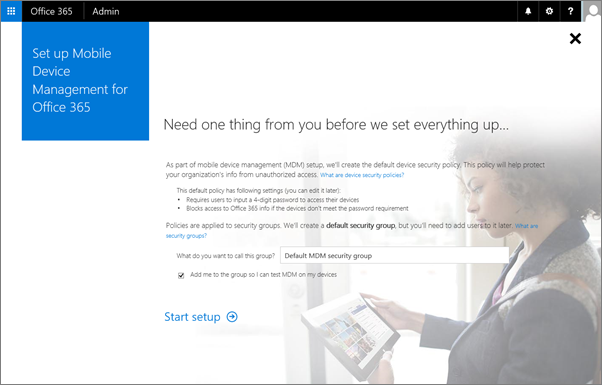

# Задайте копирование Mobile Device Management (MDM) в Office 365

Встроенные Mobile Device Management (MDM) для Office 365 помогает защитить и управлять ими пользователей мобильных устройств, например iPhones, iPad, Androids, и телефоны Windows. Можно создать и управлять политики безопасности устройств, удаленно стирание устройства и просматривать отчеты подробные устройства.
  
Есть вопросы? Мы собрали [вопросы и ответы для распространенные вопросы](frequently-asked-questions-about-mdm.md). Помните, что нельзя использовать [партнеров: предложение делегированного администрирования](https://support.office.com/article/26530dc0-ebba-415b-86b1-b55bc06b073e) для управления мобильного устройства управления для Office 365. 
  
Управление устройствами является частью безопасности &amp; центре соответствия требованиям, поэтому необходимо перейти по ссылке для запуска программы установки MDM.
  
Для настройки мобильного устройства управления для Office 365 вам потребуется:
  
1. [Активация службы управления мобильного устройства](#activate-the-mobile-device-management-service)  
2. [Настройка управления мобильного устройства](#set-up-mobile-device-management)
3. [Убедитесь, что пользователи зарегистрируйте свои устройства](#step-4-recommended-manage-device-security-policies)
  
## Активация службы управления мобильного устройства

1. Войдите в Office 365 с помощью рабочей или учебной учетной записи. 
    
2. Последовательно выберите пункты [безопасности &amp; центре соответствия требованиям](https://protection.office.com).
    
3. Выберите пункты **Защита от потери данных** \> **Управление устройствами** и выберите **давайте начнем** с началом процесса активации. 
    
    
  
4. Мы создали политика безопасности по умолчанию, которые помогут приступить к работе. Обновите имя политики безопасности на этой странице и нажмите кнопку **Запуск программы установки**.
    
    
  
5. Появится экран программы установки, которая показывает ход выполнения по настройке службы.
    
    
  
> [!TIP]
> Можно также найти **Программы установки MDM** посредством поиска. В центре администрирования Office 365 \> **Главная** страница, управление мобильными устройствами тип в поле « **Поиск** ». > 
  
Может потребоваться некоторое время для активации управления мобильных устройств для Office 365, но после завершения работы, вы получите сообщение электронной почты, описывающий последующих действий.
  
## Настройка управления мобильного устройства

Если служба готова, выполните следующие четыре действия для завершения работы программы установки. Выберите [Управление параметрами](https://portal.office.com/EAdmin/Device/IntuneInventory.aspx) на странице **Управление устройствами** в безопасности может потребоваться &amp; центре соответствия требованиям, чтобы просмотреть следующие параметры. 
  

  
### Шаг 1: (Обязательный) Настройка доменов для MDM

Если у вас нет настраиваемого домена, связанного с Office 365 или если вы не управляете устройств Windows, можно пропустить этот раздел. В противном случае вам потребуются для добавления записей DNS для домена на сервере DNS. Если вы добавили записи уже, как часть настройки домена в Office 365, все установлен. После добавления записи Office 365 пользователи в вашей организации, зарегистрированные на свои устройства Windows с адресом электронной почты, использующий настраиваемый домен перенаправляются для регистрации в MDM для Office 365.
  
Требуется помощь при установке записи? Найдите вашего регистратора доменных имен в списке, доступном в [статье Создание записей DNS для Office 365 при самостоятельном управлении записями DNS-записей](https://support.office.com/article/b0f3fdca-8a80-4e8e-9ef3-61e8a2a9ab23) и выберите имя регистратора, перейдите к пошаговых инструкций по созданию записей DNS. Используйте эти инструкции для добавления следующие две записи: 
  
|**Имя узла**|**Тип записи**|**Адрес**|**TTL**|
|:-----|:-----|:-----|:-----|
|EnterpriseEnrollment    |CNAME    |EnterpriseEnrollment.manage.microsoft.com    |3600    |
|EnterpriseRegistration    |CNAME    |EnterpriseRegistration.windows.net    |3600    |
   
После добавления двух записей, вернитесь на безопасность &amp; центре соответствия требованиям и перейдите к **разделу Управление устройства** \> **Управление параметрами** для выполнения к следующему шагу. 
  
### Шаг 2: (Обязательный) Настройка сертификат APN для устройства iOS

Для управления iOS устройств iPad и iPhones, необходимо создать новый сертификат APN.
  
Для этого выполните действия из ссылки **Set up** на **Setup страницы Управление мобильного устройства**.
  
1. **Настройка сертификата APN для устройств операций ввода-вывода**выберите **Настройка**.
    
2. Выберите **загрузить файл CSR** и в другое место для сохранения запроса подписи сертификата на компьютере, который необходимо передать. 
    
    
  
3. Нажмите кнопку **Далее**.
    
4. Создайте сертификат APN.
    
  - Выберите **Apple APNS портала** для открытия портале Apple Push-сертификаты. 
    
    
  
  - Вход с помощью идентификатора Apple.
    
    > [!IMPORTANT]
    > Используйте компании Apple идентификатор, связанное с учетной записью электронной почты, который будет оставаться с организацией, даже в том случае, если пользователь, который управляет учетной записи оставляет. Сохраните этот код, так как вам потребуется использовать тот же идентификатор, если время для обновления сертификата. 
  
  - Выберите команду **создать сертификат** и примите **Условия использования**.
    
  - **Обзор** запрос подписи сертификата был загружен на компьютер с Office 365 и выберите **Отправить**.
    
  - **Загрузите** сертификат APN, созданных Apple Push-сертификат портала на своем компьютере. 
    
    > [!TIP]
    > Если у вас возникли проблемы при загрузке сертификата, обновите окно обозревателя. 
  
5. Вернитесь в Office 365 и нажмите кнопку **Далее** для перехода к странице **APNS Загрузка сертификата** . 
    
6. Перейдите к APN сертификат, который был загружен из портала Apple Push-сертификаты.
    
    
  
7. Нажмите кнопку **Готово**.
    
После добавления сертификата APN вернуться к безопасности &amp; центре соответствия требованиям и перейдите к **разделу Управление устройства** \> **Управление параметрами** для выполнения к следующему шагу. 
  
### Шаг 3: (Рекомендуемый вариант) Настройка многофакторной проверки подлинности

Если многофакторная проверка подлинности (многофакторной проверкой Подлинности) в разделе **Рекомендуемые действия**не отображается, можно пропустить этот раздел. Если этот параметр указан, мы рекомендуем включить многофакторной проверкой Подлинности на портале Azure AD для повышения безопасности управления мобильного устройства для процесса регистрации Office 365. По умолчанию он отключен.
  
Многофакторной проверкой Подлинности позволяет обеспечить безопасность входа в Office 365 для подачи заявок на мобильном устройстве, требуя вторую форму проверки подлинности. Пользователи не требуется для подтверждения телефонный звонок, текстовое сообщение или уведомление приложения на мобильное устройство после правильно ввода пароля учетной записи их работы. Они могут зарегистрировать свое устройство только после завершения этой второй способ проверки подлинности. После устройствах пользователей участвуют в управлении мобильных устройств для Office 365, пользователи могут обращаться к ресурсов Office 365 с только что своей учетной записи рабочего.
  
**Настройка многофакторной проверки подлинности**выберите **Настройка**. В этой статье описывается включение многофакторной проверкой Подлинности на портале Azure AD, см [многофакторной проверки подлинности](https://go.microsoft.com/fwlink/p/?LinkId=519255).
  
После настройки многофакторной проверкой Подлинности вернуться к безопасности &amp; центре соответствия требованиям и перейдите к **разделу Управление устройства** \> **Управление параметрами** для выполнения к следующему шагу. 
  
### Шаг 4: Политики безопасности устройств управление (рекомендуемый вариант)

Следующим шагом является создание и развертывание политик безопасности устройств для защиты данных организации Office 365. Например, может помочь предотвратить потерю данных, если пользователь теряет свои устройства путем создания политики для блокировки устройств через 5 минут бездействия и устройств очистить после 3 отказов.
  
В **безопасности &amp; центре соответствия требованиям**, последовательно выберите пункты **политики безопасности** \> **политики безопасности устройств** для создания политики безопасности устройств и правил доступа. 
  

  
Пошаговые инструкции о том, как создать новую политику, в разделе [Создание и развертывание политик безопасности устройств](create-device-security-policies.md).
  
> [!TIP]
>  При создании новой политики можно настроить политику, чтобы разрешить нарушение политики доступа и отчет, где устройств пользователя не совместимый с политикой. Это позволяет видеть, сколько мобильных устройств может повлиять на работу политики без блокировки доступа к Office 365. > Перед развертыванием новой политики для всех пользователей в организации рекомендуется проверить на устройствах, используемых небольшого числа пользователей. > Кроме того перед развертыванием политик позволяют организации знать последствиях регистрации устройства в MDM для Office 365. В зависимости от того, как настроить политики устройств, которые не соответствуют их (несовместимых устройств) может быть заблокирован доступ к Office 365. Non совместимые устройства также могут иметь установленные приложения, фотографии и другие личные сведения, которые зарегистрированных устройства, может быть удален, если Очистить устройство. Дополнительные сведения: [стирание мобильного устройства в Office 365](wipe-a-mobile-device.md). 
  
## Убедитесь, что пользователи зарегистрируйте свои устройства

После создания и развертывания политики управления мобильных устройств каждого лицензированных пользователей Office 365 в вашей организации, к которому применяется политика устройства появляется сообщение регистрации следующем входе в Office 365 с мобильного устройства. Они должны выполнить действия регистрации и активации, прежде чем они могут получить доступ к электронной почты Office 365 и документы. В разделе [Регистрация мобильного устройства для работы или school](enroll-your-mobile-device.md).
  
> [!IMPORTANT]
> Если предпочтительный язык пользователя не поддерживается процессом подачи заявок, пользователи могут получать уведомления о регистрации и действия на мобильных устройствах на другом языке. Не все языки, поддерживаемые в Office 365 в настоящее время поддерживаются для процесса подачи заявок на мобильных устройствах. 
  
Пользователи с мобильными устройствами Android или операций ввода-вывода требуется установить приложение портала компании в рамках процесса регистрации.
  
## Статьи по теме

[Возможности управления для мобильных устройств](capabilities-of-mobile-device-management.md)
  
[Создание и развертывание политик безопасности устройств](create-device-security-policies.md)
  

