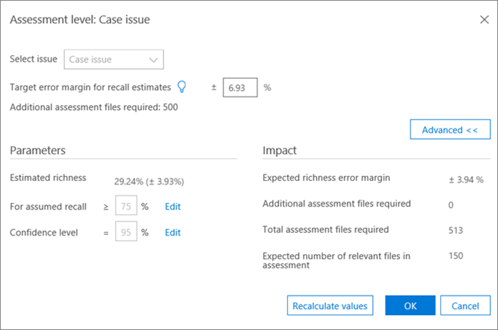

# Маркировка и оценка в Office 365 Advanced eDiscoveryTagging and Assessment in Office 365 Advanced eDiscovery

> [!NOTE]
> Чтобы можно было использовать Advanced eDiscovery, требуется подписка на Office 365 E3 с надстройкой Advanced Compliance или E5 для организации. Если у вас этого плана нет и вы хотите попробовать Advanced eDiscovery, можете [зарегистрироваться для получения пробной версии Office 365 корпоративный E5](https://go.microsoft.com/fwlink/p/?LinkID=698279).Advanced eDiscovery requires an Office 365 E3 with the Advanced Compliance add-on or an E5 subscription for your organization. If you don't have that plan and want to try Advanced eDiscovery, you can [sign up for a trial of Office 365 Enterprise E5](https://go.microsoft.com/fwlink/p/?LinkID=698279). 
  
В этом разделе описывается процедура для расширенного модуля оценки соответствия eDiscovery.This section describes the procedure for the Advanced eDiscovery Relevance Assessment module. 
  
## Проведение обучения и анализPerforming Assessment training and analysis

1. На вкладке **Отслеживание \> релевантности** нажмите кнопку **Оценка** , чтобы начать оценку.In the **Relevance \> Track** tab, click **Assessment** to start case assessment. 
    
    Например, в этой процедуре создается пример оценочного набора данных 500, и отображается вкладка **тега** , содержащая панель маркировки, содержимое файла и другие параметры тегирования.For example purposes in this procedure, a sample assessment set of 500 files is created and the **Tag** tab is displayed, which contains the Tagging panel, displayed file content and other tagging options. 
    
    
  
2. Просмотрите каждый файл в этом примере, определите релевантность файла для каждой из них и пометьте файл, используя кнопки релевантность (R), не релевантные (НР) и Skip ( **панель маркировки** ).Review each file in the sample, determine the file's relevance for each case issue, and tag the file using the Relevance (R), Not relevant (NR) and Skip buttons in the **Tagging panel** pane. 
    
    > [!NOTE]
    >  Для оценки требуется 500 файлов с тегами.Assessment requires 500 tagged files. Если файлы "пропущены", вы получите дополнительные файлы для тегов.If files are "skipped", you will receive more files to tag. 
  
3. После маркировки всех файлов в примере нажмите кнопку **Calculate**(вычислить).After tagging all files in the sample, click **Calculate**. 
    
    На вкладке Отслеживание релевантности вычисляются и отображаются сведения о текущей и расширенной оценке, а также на вкладке **Отслеживание релевантности** , как показано ниже.The Assessment current error margin and richness are calculated and displayed in the **Relevance Track** tab, with expanded details per issue, as shown below. Дополнительные сведения об этом диалоговом окне описаны в разделе "Просмотр результатов оценки".More details about this dialog are described in the later section "Reviewing Assessments results". 
    
    
  
    > [!TIP]
    > По умолчанию мы рекомендуем переходить к следующему шагу, когда индикатор выполнения оценки для этой ошибки был выполнен, указывая на то, что образец оценки проверен, и что отмечено достаточное количество релевантных файлов.By default, we recommend that you proceed to the default Next step when the Assessment progress indicator for the issue has completed, indicating that the assessment sample was reviewed and sufficient relevant files were tagged. _Гт_ в противном случае, если вы хотите просмотреть результаты вкладки **отслеживания** и управлять полями ошибки и следующим шагом, щелкните **изменить** смежные к **следующему шагу**, выберите пункт **продолжить оценку**, а затем нажмите кнопку **ОК**.> Otherwise, if you want to view the **Track** tab results and control the margin of error and the next step, click **Modify** adjacent to **Next Step**, select **Continue assessment**, and then click **OK**. 
  
1. Нажмите кнопку **изменить** справа от поля **Оценка** , чтобы просмотреть и указать параметры оценки для каждого вопроса.Click **Modify** to the right of the **Assessment** check box to view and specify assessment parameters per issue. Отображается диалоговое окно **уровня оценки** для каждой из выпусков, как показано в следующем примере:An **Assessment level** dialog for each issue is displayed, as shown in the following example: 
    
    
  
    Следующие параметры для этой задачи рассчитываются и отображаются в диалоговом окне **уровень оценки** :The following parameters for the issue are calculated and displayed in the **Assessment level** dialog: 
    
    **Целевое поле ошибки для оценок отзыва**: на основе этого значения вычисляется предполагаемое количество дополнительных файлов, необходимых для проверки.**Target error margin for recall estimates**: Based on this value, the estimated number of additional files necessary to review is calculated. Маржа, используемая для отзыва, превышает 75% и степень вероятности 95%.The margin used for recall is greater than 75% and with a 95% confidence level. 
    
    **Требуются дополнительные файлы оценки**: указывает, сколько дополнительных файлов требуется, если не выполнены требования к текущему полю ошибки.**Additional assessment files required**: Indicates how many more files are necessary if the current error margin's requirements have not been met. 
    
2. Чтобы скорректировать текущее поле ошибки и увидеть результаты различных полей ошибок (по вопросу), выполните следующие действия:To adjust the current error margin and see the effect of different error margins (per issue):
    
1. В списке **выберите вопрос** выберите вопрос.In the **Select issue** list, select an issue. 
    
2. В **поле Целевая ошибка для оценки отзыва**введите новое значение.In **Target error margin for recall estimates**, enter a new value.
    
3. Нажмите кнопку **обновить значения** , чтобы увидеть влияние корректировок.Click **Update values** to see the impact of the adjustments. 
    
3. В диалоговом окне **уровень оценки** нажмите кнопку **Дополнительно** , чтобы просмотреть следующие дополнительные параметры и сведения:Click **Advanced** in the **Assessment level** dialog to see the following additional parameters and details: 
    
    
  
    **Оценка полноты**оценки в соответствии с текущими результатами оценки**Estimated richness**: Estimated richness according to the current assessment results
    
    **Для предполагаемого отзыва**: по умолчанию целевое поле ошибки применяется к предыдущему вызываемому пользователю 75%.**For assumed recall**: By default, the target error margin applies to recall above 75%. Нажмите кнопку **изменить** , чтобы изменить этот параметр и управлять полем ошибки для другого диапазона значений отзыва.Click **Edit** if you want to change this parameter and control the margin of error on a different range of recall values. 
    
    **Уровень вероятности**: по умолчанию рекомендуемое поле ошибки для достоверности составляет 95%.**Confidence level**: By default, the recommended error margin for confidence is 95%. Если вы хотите изменить этот параметр, нажмите кнопку **изменить** .Click **Edit** if you want to change this parameter. 
    
    **Ожидалось поле расширенной**проверки погрешностей: при наличии обновленных значений это предполагаемое поле ошибки полноты, после рассмотрения всех дополнительных файлов оценки.**Expected richness error margin**: Given the updated values, this is the expected margin of error of the richness, after all additional assessment files are reviewed.
    
    **Требуются дополнительные файлы оценки**: с учетом обновленных значений, количества дополнительных файлов оценки, которые необходимо проверить для достижения целевого значения.**Additional assessment files required**: Given the updated values, the number of additional assessment files that need to be reviewed to reach the target.
    
    **Общие требуемые файлы оценки**: при наличии обновленных значений все файлы оценки, необходимые для проверки.**Total assessment files required**: Given the updated values, total assessment files required for review.
    
    **Ожидаемое количество релевантных файлов в ходе оценки**: с учетом обновленных значений — предполагаемое число релевантных файлов во всей оценке после рассмотрения всех дополнительных файлов оценки.**Expected number of relevant files in assessment**: Given the updated values, the expected number of relevant files in the entire assessment after all additional assessment files are reviewed.
    
4. Нажмите кнопку **пересчитать значения**, если параметры изменены.Click **Recalculate values**, if parameters are changed. Если проблема не устранена, нажмите кнопку **ОК** , чтобы сохранить изменения (или, если имеется несколько \*\*\*\* проблем, которые необходимо просмотреть или изменить, а затем **завершить**).When you are done, if there is one issue, click **OK** to save the changes (or **Next** when there are multiple issues to review or modify and then **Finish**). 
    
    При возникновении нескольких проблем после того как все проблемы были проверены или скорректированы, отображается **уровень оценки:** отображается диалоговое окно сводки, как показано в следующем примере.When there are multiple issues, after all issues have been reviewed or adjusted, an **Assessment level: summary** dialog is displayed, as shown in the following example. 
    
    
  
    После успешного завершения оценки переходите к следующему этапу обучения релевантности.Upon successful completion of assessment, proceed to the next stage in Relevance training.
    
## Просмотр результатов оценкиReviewing assessment results

После того как отмечен пример оценки, результаты оценки рассчитываются и отображаются на вкладке Отслеживание релевантности.After an Assessment sample is tagged, the assessment results are calculated and displayed in the Relevance Track tab.
  
На дисплее расширенной записи отображаются следующие результаты:The following results are displayed in the expanded Track display: 
  
- Оценка текущих полей ошибок для оценок отзываAssessment current error margin for recall estimates
    
- Оценка возможностейEstimated richness
    
- Требуются дополнительные файлы оценки (для проверки)Additional assessment files required (for review)
    
Поле Оценка текущей ошибки — это поле ошибки, рекомендованное расширенным обнаружением электронных данных.The Assessment current error margin is the error margin recommended by Advanced eDiscovery. Число, отображаемое для "дополнительных необходимых файлов оценки", соответствует этой рекомендации.The number displayed for the "Additional assessment files required" corresponds to that recommendation.
  
Индикатор хода оценки показывает уровень завершения оценки с учетом текущего поля ошибки.The Assessment progress indicator shows the level of completion of the assessment, given the current error margin. После выполнения оценки пользователь помечает другой пример оценки.When assessment is underway, the user will tag another assessment sample.
  
Когда индикатор выполнения оценки выводит оценку как завершенный, это означает, что проверка выполнена успешно, а помечены соответствующие файлы.When the assessment progress indicator shows assessment as complete, that means the assessment sample review was completed and sufficient relevant files were tagged. 
  
На развернутом дисплее показан рекомендуемый следующий шаг, статистика оценки и доступ к подробным результатам.The expanded Track display shows the recommended next step, the assessment statistics, and access to detailed results.
  
Если насыщенность очень мала, количество дополнительных файлов оценки, необходимых для достижения минимального количества релевантных файлов для получения полезной статистики, очень высокое.When richness is very low, the number of additional assessment files needed to reach a minimal number of relevant files to produce useful statistics is very high. После этого Расширенное обнаружение электронных данных будет рекомендовано переходить на обучающий курс.Advanced eDiscovery will then recommend moving on to training. Индикатор хода оценки будет затенен, а статистика будет недоступна.The assessment progress indicator will be shaded, and no statistics will be available. 
  
В случае отсутствия на основе статистики стабилизатион результаты будут иметь более низкий уровень точности и вероятности.In the absence of statistically based stabilization, there will be results with a lower level of accuracy and confidence level. Тем не менее, эти результаты можно использовать для поиска релевантных файлов, если вам не нужно знать процент релевантных файлов.However, these results can be used to find relevant files when you do not need to know the percentage of relevant files found. Аналогично, это состояние можно использовать для обучения проблем с небольшим богатыми возможностями, где показатели релевантности могут ускорить доступ к файлам, связанным с определенной ошибкой.Similarly, this status can be used to train issues with low richness, where Relevance scores can accelerate access to files relevant to a specific issue.
  
> [!TIP]
> На вкладке **Отслеживание \> релевантности** отображается развернутая ошибка, доступны следующие параметры просмотра: _гт_ рекомендуемый следующий шаг, например **следующий шаг:** проигнорируйте Теги (на вопрос), нажав кнопку **Modify (изменить** ). Щелкните правой кнопкой мыши, а затем выберите другой шаг на **следующем шаге**.In the **Relevance \> Track** tab, expanded issue display, the following viewing options are available: > The recommended next step, such as **Next step: Tagging** can be bypassed (per issue) by clicking the **Modify** button to its right, and then selecting an different step in the **Next step**. Когда индикатор выполнения оценки не закончится, будет использоваться следующий рекомендуемый вариант, чтобы отметить дополнительные файлы оценки и повысить точность статистики.When the assessment progress indicator has not completed, assessment will be the next recommended option, to tag more assessment files and increase statistics accuracy. _Гт_ вы можете изменить поле ошибки и оценить его влияние, нажав кнопку **изменить**, а затем в **диалоговом окне уровень оценки**измените **целевое поле ошибки для оценок отзыва**и нажмите кнопку **обновить значения**.> You can change the error margin and assess its impact, by clicking **Modify**, and in the **Assessment level dialog**, changing the **Target error margin for recall estimates**, and clicking **Update values**. Кроме того, в этом диалоговом окне можно просмотреть дополнительные параметры, нажав кнопку **Дополнительно**.Also, in this dialog, you can view advanced options, by clicking **Advanced**. _Гт_ вы можете просмотреть дополнительную статистику по уровню оценки и их влияние, нажав кнопку **Просмотр**.> You can view additional assessment level statistics and their impact by clicking **View**. В диалоговом окне Отображение подробных результатов статистические данные доступны для каждой задачи, при наличии по крайней мере 500 файлов оценки с тегами и по крайней мере 18 файлов помечаются как имеющие отношение к этой ошибке.In the displayed Detail results dialog, statistics are available per issue, when there are at least 500 tagged assessment files and at least 18 files are tagged as Relevant for the issue. 
  
## См. такжеSee also

[Office 365 Advanced eDiscoveryOffice 365 Advanced eDiscovery](office-365-advanced-ediscovery.md)
  
[Понимание оценки релевантностиUnderstanding Assessment in Relevance](assessment-in-relevance-in-advanced-ediscovery.md)
  
[Расстановка тегов и релевантностиTagging and Relevance training](tagging-and-relevance-training-in-advanced-ediscovery.md)
  
[Анализ релевантности отслеживанияTracking Relevance analysis](track-relevance-analysis-in-advanced-ediscovery.md)
  
[Выбор на основе результатовDeciding based on the results](decision-based-on-the-results-in-advanced-ediscovery.md)
  
[Анализ релевантности тестированияTesting Relevance analysis](test-relevance-analysis-in-advanced-ediscovery.md)

