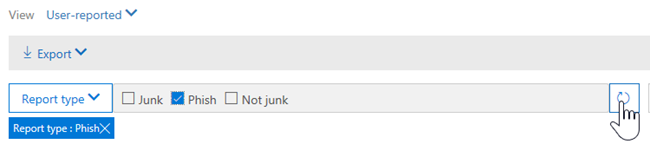

# Представления в обозревателе угроз и обнаружения в режиме реального времениViews in Threat Explorer and real-time detections

[Обозреватель угроз](use-explorer-in-security-and-compliance.md) (и отчет об обнаружении в режиме реального времени) — это мощное средство в режиме реального времени, которое помогает системам безопасности Teams исследовать и отвечать на &amp; угрозы в центре безопасности и соответствия требованиям.[Threat Explorer](use-explorer-in-security-and-compliance.md) (and the real-time detections report) is a powerful, near real-time tool to help Security Operations teams investigate and respond to threats in the Security &amp; Compliance Center. В проводнике (и отчете об обнаружении в режиме реального времени) отображаются сведения о потенциальных вредоносных и мошеннических программах в электронной почте и файлах в Office 365, а также о других угрозах безопасности и рисках для Организации.Explorer (and the real-time detections report) displays information about suspected malware and phish in email and files in Office 365, as well as other security threats and risks to your organization. 

- Если у вас есть [Office 365 Advanced Threat protection](office-365-atp.md) (ATP), то у вас есть проводник.If you have [Office 365 Advanced Threat Protection](office-365-atp.md) (ATP) Plan 2, then you have Explorer.
- Если у вас есть Office 365 ATP 1 (план 1), то у вас есть обнаружение в режиме реального времени.If you have Office 365 ATP Plan 1, then you have real-time detections.

При первом открытии проводника (или отчета по обнаружениям в режиме реального времени) представление по умолчанию показывает обнаружение вредоносных программ по электронной почте за прошедшие 7 дней.When you first open Explorer (or the real-time detections report), the default view shows email malware detections for the past 7 days. В этом отчете также могут отображаться определения ATP, такие как вредоносные [ссылки](atp-safe-links.md), обнаруженные безопасными ссылками, а также вредоносные файлы, обнаруженные [безопасными вложениями](atp-safe-attachments.md).This report can also show ATP detections, such as malicious URLs detected by [Safe Links](atp-safe-links.md), and malicious files detected by [Safe Attachments](atp-safe-attachments.md). Этот отчет можно изменить для отображения данных за прошедшие 30 дней (если вы не используете пробную подписку).This report can be modified to show data for the past 30 days (unless you are using a trial subscription). Пробные подписки будут включать данные только за прошедшие семь дней.Trial subscriptions will include data for the past seven days only.

Используйте меню **вид** для изменения отображаемых сведений.Use the **View** menu to change what information is displayed. Подсказки помогут определить, какое представление использовать.Tooltips help you determine which view to use.
  

После выбора представления можно применить фильтры и настроить запросы для дальнейшего анализа.Once you have selected a view, you can apply filters and set up queries to conduct further analysis. В следующих разделах представлен краткий обзор различных представлений, доступных в проводнике (или обнаружения в режиме реального времени).The following sections provide a brief overview of the various views available in Explorer (or real-time detections).  

## Вредоносная > по электронной почтеEmail > Malware

Чтобы просмотреть этот отчет, в проводнике (или обнаружения в режиме реального времени) выберите **Просмотр** > **вредоносных программ\*\*\*\*электронной почты** > .To view this report, in Explorer (or real-time detections), choose **View** > **Email** > **Malware**. В этом представлении отображаются сведения о сообщениях электронной почты, которые были идентифицированы как содержащие вредоносные программы.This view shows information about email messages that were identified as containing malware.  

 

Нажмите \*\*\*\* кнопку отправитель, чтобы открыть список параметров просмотра.Click **Sender** to open your list of viewing options. Этот список используется для просмотра данных по отправителям, получателям, доменам отправителей, темам, технологиям обнаружения, состояниям защиты и т. д.Use this list to view data by sender, recipients, sender domain, subject, detection technology, protection status, and more. 

Например, чтобы узнать, какие действия были выполнены с обнаруженными сообщениями электронной почты, выберите **состояние защиты** в списке.For example, to see what actions were taken on detected email messages, choose **Protection status** in the list. Выберите параметр, а затем нажмите кнопку обновить, чтобы применить этот фильтр к отчету.Select an option, and then click the Refresh button to apply that filter to your report.

Под диаграммой просмотрите дополнительные сведения о конкретных сообщениях.Below the chart, view more details about specific messages. При выборе элемента в списке открывается область "вылет", в которой можно узнать больше о выбранном элементе.When you select an item in the list, a fly-out pane opens, where you can learn more about the item you selected. 

## Электронная почта > фишингаEmail > Phish

Чтобы просмотреть этот отчет, в проводнике (или обнаружения в режиме реального времени) выберите **Просмотр** > фишинга**электронной почты** > \*\*\*\*.To view this report, in Explorer (or real-time detections), choose **View** > **Email** > **Phish**. В этом представлении отображаются сообщения электронной почты, которые определены как попытки фишинга.This view shows email messages identified as phishing attempts.  

 

Нажмите \*\*\*\* кнопку отправитель, чтобы открыть список параметров просмотра.Click **Sender** to open your list of viewing options. Используйте этот список для просмотра данных по отправителям, получателям, доменам отправителей, IP-адресу отправителя, домену URL-адресов, нажмите вредоносности и дополнительно.Use this list to view data by sender, recipients, sender domain, sender IP, URL domain, click verdict, and more. 

Например, чтобы узнать, какие действия были предприняты при нажатии на URL-адреса, идентифицированные как попытки фишинга, выберите **пункт вредоносности** в списке, выберите один или несколько параметров, а затем нажмите кнопку Обновить.For example, to see what actions were taken when people clicked on URLs that were identified as phishing attempts, choose **Click verdict** in the list, select one or more options, and then click the Refresh button.

Под диаграммой просмотрите дополнительные сведения о конкретных сообщениях, нажатии URL-адресов, URL-адреса и источник электронной почты.Below the chart, view more details about specific messages, URL clicks, URLs, and email origin. 

При выборе элемента в списке, например обнаруженного URL-адреса, открывается область "вылет", в которой можно узнать больше о выбранном элементе.When you select an item in the list, such as a URL that was detected, a fly-out pane opens, where you can learn more about the item you selected. 

## Электронная почта > о пользователяхEmail > User-reported

Чтобы просмотреть этот отчет, в проводнике (или обнаружения в режиме реального времени) выберите **Просмотр** > **электронной почты** > ,**отчет о пользователях**.To view this report, in Explorer (or real-time detections), choose **View** > **Email** > **User-reported**. В этом представлении отображаются сообщения электронной почты о том, что пользователи сообщили о нежелательной почте, нежелательной почте или фишинге.This view shows email that users have reported as junk, not junk, or phishing email. 

 

Нажмите \*\*\*\* кнопку отправитель, чтобы открыть список параметров просмотра.Click **Sender** to open your list of viewing options. Этот список используется для просмотра сведений по отправителям, получателям, типам отчетов (определение пользователя на нежелательное, не спаме или фишинге) и многое другое.Use this list to view information by sender, recipients, report type (the user's determination that the email was junk, not junk, or phish), and more. 

Например, чтобы просмотреть сведения о сообщениях электронной почты, которые были зарегистрированы как попытки фишинга, щелкните**тип отчета**по отправителю \*\*\*\* > , выберите пункт **Фишинг**, а затем нажмите кнопку Обновить.For example, to view information about email messages that were reported as phishing attempts, click **Sender** > **Report type**, select **Phish**, and then click the Refresh button.

Под диаграммой просмотрите дополнительные сведения об определенных сообщениях электронной почты, таких как строка темы, IP-адрес отправителя, пользователь, который сообщил сообщение как нежелательное, нежелательное или фишинг, а также другие сведения.Below the chart, view more details about specific email messages, such as subject line, the sender's IP address, the user that reported the message as junk, not junk, or phish, and more. 

Выберите элемент в списке, чтобы просмотреть дополнительные сведения.Select an item in the list to view additional details.

## Электронная почта > всю почтуEmail > All email

Чтобы просмотреть этот отчет, в проводнике\*\*\*\* выберите **Просмотр** > **электронной почты по электронной почте** > .To view this report, in Explorer, choose **View** > **Email** > **All mail**. В этом представлении отображается представление действий с электронной почтой, в том числе сообщение электронной почты, которое определено как вредоносное по причине фишинга или вредоносных программ, а также для всех невредоносных сообщений (обычной электронной почты, спама и массовой почты).This views shows an all-up view of email activity, including email identified as malicious due to phishing or malware, as well all non-malicious mail (normal email, spam, and bulk mail). 

> [!NOTE]
> Если вы получаете сообщение об ошибке, которое считывает **слишком много данных**, добавьте фильтр и при необходимости Сократите диапазон дат, который вы просматриваете.If you get an error that reads **Too much data to display**, add a filter and, if necessary, narrow the date range you're viewing. 

Чтобы применить фильтр, выберите **отправитель**, выберите элемент в списке, а затем нажмите кнопку Обновить.To apply a filter, choose **Sender**, select an item in the list, and then click the Refresh button. В нашем примере мы использовали **технологию обнаружения** в качестве фильтра (доступно несколько вариантов).In our example, we used **Detection technology** as a filter (there are several options available). Просмотр сведений по отправителям, доменам отправителя, получателям, темам, вложениям filename, семействам вредоносных программ, состоянию защиты (действия, выполняемые функциями и политиками защиты от угроз в Office 365), технология обнаружения (способ обнаружения вредоносных программ) и превышает.View information by sender, sender's domain, recipients, subject, attachment filename, malware family, protection status (actions taken by your threat protection features and policies in Office 365), detection technology (how the malware was detected), and more. 

 

Под диаграммой просмотрите дополнительные сведения об определенных сообщениях электронной почты, таких как строка темы, получатель, отправитель, состояние и т. д.Below the chart, view more details about specific email messages, such as subject line, recipient, sender, status, and so on. 

## Контент > вредоносных программContent > Malware

Чтобы просмотреть этот отчет, в проводнике (или обнаружения в режиме реального времени) выберите **Просмотр** > \*\*\*\* > **вредоносных программ**.To view this report, in Explorer (or real-time detections), choose **View** > **Content** > **Malware**. В этом представлении показаны файлы, которые были определены как вредоносные [в Office 365 Advanced Threat Protection в SharePoint Online, OneDrive для бизнеса и Microsoft Teams](atp-for-spo-odb-and-teams.md).This view shows files that were identified as malicious by [Office 365 Advanced Threat Protection in SharePoint Online, OneDrive for Business, and Microsoft Teams](atp-for-spo-odb-and-teams.md).

Просмотр сведений о семействе вредоносных программ, технологии обнаружения (способе обнаружения вредоносных программ) и рабочей нагрузке (OneDrive, SharePoint или Teams).View information by malware family, detection technology (how the malware was detected), and workload (OneDrive, SharePoint, or Teams). 

  

Под диаграммой просмотрите дополнительные сведения о конкретных файлах, таких как имя файла вложения, Рабочая нагрузка, размер файла, Последнее изменение файла и т. д.Below the chart, view more details about specific files, such as attachment filename, workload, file size, who last modified the file, and more. 
  
## Возможности "нажми и работай"Click-to-filter capabilities

С помощью проводника (и обнаружения в режиме реального времени) можно применить фильтр по щелчку.With Explorer (and real-time detections), you can apply a filter in a click. Щелкните элемент в условных обозначениях, и этот элемент становится фильтром для отчета.Click an item in the legend, and that item becomes a filter for the report. Например, предположим, что вы ищете представление вредоносных программ в проводнике:For example, suppose we are looking at the Malware view in Explorer:
  

  
Выбор **ATP детонации** в этой диаграмме приводит к представлению следующего вида:Clicking **ATP Detonation** in this chart results in a view like this: 
  

  
В этом представлении теперь вы ищете данные для файлов, которые были обезвреженои [безопасными вложениями Office 365 ATP](atp-safe-attachments.md).In this view, we are now looking at data for files that were detonated by [Office 365 ATP Safe Attachments](atp-safe-attachments.md). Под диаграммой можно просмотреть подробные сведения об определенных сообщениях электронной почты, для которых были обнаружены вложения, обнаруженные безопасными вложениями ATP.Below the chart, we can see details about specific email messages that had attachments that were detected by ATP Safe Attachments.
  

  
При выборе одного или нескольких элементов активируется меню **действия** , в котором предлагается несколько вариантов выбора для выбранных элементов.Selecting one or more items activates the **Actions** menu, which offers several choices from which to choose for the selected item(s). 
  

  
Возможность фильтрации в нажатии и переходе к определенным сведениям может значительно сэкономить время при изучении угроз.The ability to filter in a click and navigate to specific details can save you a lot of time in investigating threats.

## Запросы и фильтрыQueries and filters

В проводнике (и отчете об обнаружении в режиме реального времени) предусмотрено несколько мощных фильтров и запросов, позволяющих переходить к детальным сведениям, таким как самые популярные конечные пользователи, основные семейства вредоносных программ, технологию обнаружения и многое другое.Explorer (and the real-time detections report) has several powerful filters and querying capabilities that enable you to drill into details, such as top targeted users, top malware families, detection technology and more. Каждый вид отчета предлагает различные способы просмотра и изучения данных.Each kind of report offers a variety of ways to view and explore data.

> [!IMPORTANT]
> Не используйте подстановочные знаки, такие как звездочка (\*) или вопросительный знак (?), на панели запросов проводника (или обнаружения в режиме реального времени).Do not use wildcard characters, such as an asterisk (\*) or a question mark (?), in the query bar for Explorer (or real-time detections). При поиске в поле subject для сообщений электронной почты проводник (или обнаружение в режиме реального времени) выполняет частичные совпадения и дают результаты, аналогичные условиям поиска по шаблону.When you search on the Subject field for email messages, Explorer (or real-time detections) will perform partial matching and yield results similar to a wildcard search.
