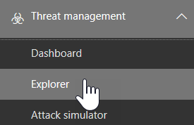

# Обозреватель угроз (и обнаружение в режиме реального времени)Threat Explorer (and real-time detections)

Если в вашей организации используется [office 365 Advanced Threat protection](office-365-atp.md) (Office 365 ATP), а у вас есть [необходимые разрешения](#required-licenses-and-permissions), то у вас есть **проводник** или **Обнаружение в режиме реального времени** (ранее отчеты в режиме реального времени — [Просмотреть новые возможности ](#new-features-in-real-time-detections)!).If your organization has [Office 365 Advanced Threat Protection](office-365-atp.md) (Office 365 ATP), and you have the [necessary permissions](#required-licenses-and-permissions), you have either **Explorer** or **real-time detections** (formerly real-time reports — [see what's new](#new-features-in-real-time-detections)!). В центре безопасности _Амп_ соответствие требованиям откройте раздел **Управление угрозами**, а затем выберите **проводник** или **Обнаружение в режиме реального времени**.In the Security & Compliance Center, go to **Threat management**, and then choose **Explorer** OR **Real-time detections**. 

|В плане ATP 2 вы увидите:With ATP Plan 2, you see:  |В плане ATP 1 вы увидите:With ATP Plan 1, you see:  |
|---------|---------|
|      |         |

С помощью Explorer (или обнаружением в режиме реального времени) у вас есть мощный отчет, который позволяет группе по обеспечению безопасности эффективно проверять угрозы и реагировать на них, а также выглядеть так, как показано на следующем рисунке:With Explorer (or real-time detections), you have a powerful report that enables your Security Operations team to investigate and respond to threats effectively and efficiently, and it resembles the following image: 

С помощью этого отчета можно выполнить следующие действия:With this report, you can:
- [Наличие вредоносных программ, обнаруженных функциями безопасности Office 365See malware detected by Office 365 security features](#see-malware-detected-in-email-by-technology)
- [Просмотрите данные о фишинговых URL-адресах и нажмите кнопку вредоносностиView data about phishing URLs and click verdict](#view-data-about-phishing-urls-and-click-verdict)
- [Запуск автоматического исследования и ответа из представления в проводнике](#start-automated-investigation-and-response) (Только для ATP, план 2)[Start an automated investigation and response process from a view in Explorer](#start-automated-investigation-and-response) (ATP Plan 2 only)
- ... [Изучите вредоносные сообщения электронной почты и многое другое](#more-ways-to-use-explorer-or-real-time-detections)!... [Investigate malicious email, and more](#more-ways-to-use-explorer-or-real-time-detections)!

## Новые функции обнаружения в режиме реального времениNew features in real-time detections

Для клиентов Office 365 ATP 1 с планом 1 отчет об обнаружении в *режиме реального времени* ранее назывался отчетами в *режиме реального времени*.For Office 365 ATP Plan 1 customers, the *real-time detections* report was previously referred to as *real-time reports*. Помимо изменения имени, несколько новых функций и улучшений разносятся.In addition to the name change, several new features and enhancements are rolling out:

- В режиме фишинга можно просмотреть дополнительные сведения об обнаруженных URL-адресах, используя [безопасные ссылки ATP](atp-safe-links.md).In the Phish view, you can see more details about detected URLs through [ATP Safe Links](atp-safe-links.md). К новым сведениям и возможностям относятся:New details and capabilities include:
  - URL-адреса в сообщениях электронной почтыURLs in email messages
  - Фильтрация на основе сведений об URL-адресеFiltering based on URL information
  - Сведения об URL-адресе, отображаемые в графиках данныхURL information displayed in data graphs
  - Время щелчка данных в сообщенияхTime-of-click data about clicks in messages

- При изменении URL-адреса нажмите кнопку вредоносности, вы увидите оповещение.Whenever there's a change in a URL click verdict, you'll see an alert. URL-адрес нажмите кнопку вердиктс может измениться при изменении репутации URL-адреса POST-детонации или когда пользователь, защищенный с помощью безопасных ссылок ATP, переопределяет [предупреждение безопасных ссылок ATP](atp-safe-links-warning-pages.md).URL click verdicts can change when a URL’s reputation changes post-detonation, or when a user who's protected by ATP Safe Links overrides an [ATP Safe Links warning](atp-safe-links-warning-pages.md).  
 
Эти расширения позволяют администраторам безопасности организации просматривать больше сведений, чем раньше.These enhancements enable your organization's security administrators to view more details than before. Администраторы безопасности могут просматривать сведения о доменах URL-адресов, пропущенных URL-адресов, вердиктс и многом, а затем настраивать политики Office 365 ATP соответствующим образом.Security administrators can view information about URL domains, missed URLs, click verdicts, and more, and then adjust Office 365 ATP policies appropriately.

> [!NOTE]
> Несмотря на то, что эти функции доступны в предварительной версии, данные URL-адреса будут доступны в течение ограниченного числа дней.While these features are in preview, URL data will be available for a limited number of days. 

## Просмотр вредоносных программ, обнаруженных технологиейSee malware detected in email by technology

Предположим, вы хотите увидеть вредоносную программу, обнаруженную в электронном письме, с помощью технологии Office 365.Suppose you want to see malware detected in email, by Office 365 technology. Для этого воспользуйтесь представлением [вредоносных программ электронной почты _Гт_](threat-explorer-views.md#email--malware) Explorer (или обнаружением в режиме реального времени).To do this, use the [Email > Malware](threat-explorer-views.md#email--malware) view of Explorer (or real-time detections).

1. В центре безопасности _амп_ соответствие требованиям ([https://protection.office.com](https://protection.office.com)) выберите Обозреватель **управления** > \*\*\*\* угрозами (или **Обнаружение в режиме реального времени**).In the Security & Compliance Center ([https://protection.office.com](https://protection.office.com)), choose **Threat management** > **Explorer** (or **Real-time detections**). (В этом примере используется Explorer.)(This example uses Explorer.)

2. В меню **вид** выберите пункт **Электронная почта** > \*\*\*\*.In the **View** menu, choose **Email** > **Malware**.  

3. Нажмите **отправитель**, а затем выберите **Базовая** > **технология обнаружения**.Click **Sender**, and then choose **Basic** > **Detection technology**. Теперь ваши технологии обнаружения доступны в качестве фильтров для отчета.Your detection technologies are now available as filters for the report.   

4. Выберите параметр, а затем нажмите кнопку **Обновить** , чтобы применить этот фильтр.Select an option, and then click the **Refresh** button to apply that filter.   

Отчет обновляется для отображения результатов, обнаруженных в сообщении электронной почты, с использованием выбранного варианта технологии.The report refreshes to show the results malware detected in email, using the technology option you selected. Отсюда вы можете провести дальнейший анализ.From here, you can conduct further analysis.

## Просмотрите данные о фишинговых URL-адресах и нажмите кнопку вредоносностиView data about phishing URLs and click verdict

Предположим, вы хотите увидеть почтовые сообщения с помощью URL-адресов, включая список разрешенных, заблокированных и переопределенных URL-адресов.Suppose that you want to see phishing attempts through URLs in email, including a list of URLs that were allowed, blocked, and overridden. Для определения URL-адресов, которые были нажаты, необходимо настроить [безопасные ссылки ATP](atp-safe-links.md) .Identifying URLs that were clicked requires [ATP Safe links](atp-safe-links.md) to be configured. Убедитесь, что вы настроили [политики безопасных ссылок ATP](set-up-atp-safe-links-policies.md) для защиты от щелчка по времени и регистрации в Вердиктс по безопасным каналам ATP.Make sure that you have set up [ATP Safe Links policies](set-up-atp-safe-links-policies.md) for time-of-click protection and logging of click verdicts by ATP Safe Links. 

Чтобы просмотреть URL-адреса фишинга в сообщениях и щелкнуть URL-адреса в сообщениях фишинга, воспользуйтесь представлением [_гт_](threat-explorer-views.md#email--phish) по протоколу фишинга в проводнике (или обнаружения в режиме реального времени).To review phish URLs in messages and clicks on URLs in phish messages, use the [Email > Phish](threat-explorer-views.md#email--phish) view of Explorer (or real-time detections).

1. В центре безопасности _амп_ соответствие требованиям ([https://protection.office.com](https://protection.office.com)) выберите Обозреватель **управления** > \*\*\*\* угрозами (или **Обнаружение в режиме реального времени**).In the Security & Compliance Center ([https://protection.office.com](https://protection.office.com)), choose **Threat management** > **Explorer** (or **Real-time detections**). (В этом примере используется Explorer.)(This example uses Explorer.)

2. В меню **вид** выберите пункт фишинг **электронной почты** > \*\*\*\*.In the **View** menu, choose **Email** > **Phish**.  

3. Нажмите **отправитель**, а затем выберите **URL-адреса** > **нажмите кнопку вредоносности**.Click **Sender**, and then choose **URLs** > **Click verdict**.

4. Выберите один или несколько параметров, например **заблокировано** и **блокировать переопределение**, а затем нажмите кнопку **Обновить** , расположенную в той же строке, что и параметры применения этого фильтра.Select one or more options, such as **Blocked** and **Block overridden**, and then click the **Refresh** button that is on the same line as the options to apply that filter. (Не обновите окно браузера.)(Don't refresh your browser window.)  

    Отчет обновляется для отображения двух различных таблиц URL-адресов на вкладке URL-адрес отчета:The report refreshes to show two different URL tables on the URL tab under the report:

   1. **Топ URL-адресов** это URL-адреса, содержащиеся в фильтруемых сообщениях, и количество действий по доставке для каждого URL-адреса.**Top URLs** are the URLs contained in the messages you have filtered down to, and the email delivery action counts for each URL. В представлении "фишинг сообщения" Этот список, как правило, содержит допустимые URL-адреса.In the phish email view, this list typically will contain legitimate URLs. Злоумышленники включают в свои сообщения сочетания хороших и недостоверных URL-адресов, чтобы попытаться доставить их, но они станут интереснее для пользователя щелкнуть.Attackers include a mix of good and bad URLs in their messages to try to get them delivered, but they will make the malicious links more interesting for the user to click. Таблица URL-адресов сортируется по общему количеству сообщений (Примечание: этот столбец не отображается для упрощения представления).The table of URLs is sorted by total email count (NOTE: This column is not shown to simplify the view).

   2. **Наиболее посещаемые щелчки** — это безопасные ссылки, которые были выбраны, отсортированные по общему количеству щелчков (этот столбец также не отображается для упрощения представления).**Top clicks** are the Safe Links wrapped URLs that were clicked, sorted by total click count (this column is also not shown to simplify the view). Общее количество подсчетов по столбцу указывает на безопасные ссылки нажмите кнопку счетчик вредоносности для каждого нажатого URL-адреса.Total counts by column indicate the Safe Links click verdict count for each clicked URL. В представлении "фишинг по электронной почте" чаще всего используются подозрительные или вредоносные URL-адреса, но они могут включать очистку URL-адресов, которые находятся в сообщениях фишинга.In the phish email view, these are more often suspicious or malicious URLs, but could include clean URLs that are in phish messages. URL-адреса, на которые вы щелкнете ссылки, не отображаются здесь.URL clicks on unwrapped links will not show up here.
   
   В двух таблицах URL-адресов отображаются самые популярные URL-адреса в сообщениях фишинга по доставке и расположению, а также отображаются нажатия клавиш URL-адреса, которые были заблокированы (или посещены несмотря на предупреждение), чтобы определить, какие потенциальные неправильные ссылки были получены пользователями и работали с пользователями.The two URLs tables show top URLs in phishing emails by delivery action and location, and they show URL clicks that were blocked (or visited despite a warning) so that you can understand what potential bad links were received by users and interacted with by users. Отсюда вы можете провести дальнейший анализ.From here, you can conduct further analysis. Например, под диаграммой можно увидеть самые популярные URL-адреса в сообщениях, заблокированных в среде Организации.For example, below the chart, you can see the top URLs in emails that were blocked in your organization's environment.
   
   
   
   Выберите URL-адрес, чтобы просмотреть более подробные сведения.Select a URL to view more detailed information. Обратите внимание, что в диалоговом окне всплывающий URL-адрес фильтрация сообщений электронной почты удаляется, чтобы показать полное представление о доступности URL-адресов в вашей среде.Note that in the URL flyout dialog, the filtering on emails is removed to show you the full view of the URL's exposure in your environment. Это позволяет отфильтровать в проводнике сообщения по электронной почте, чтобы найти конкретные URL-адреса, которые являются потенциальными угрозами, а затем расширить свои знания о возможностях URL-адресов в вашей среде (с помощью диалогового окна сведения об URL-адресе) без необходимости добавлять фильтры URL-адресов в Представление "Проводник".This lets you filter down emails in Explorer to ones you are concerned about, find specific URLs that are potential threats, then expand your understanding of the URL exposure in your environment (via the URL details dialog) without having to add URL filters to the Explorer view itself.

## Просмотр сообщений электронной почты, сообщаемых пользователямиReview email messages reported by users

Предположим, что вы хотите видеть сообщения электронной почты, которые пользователи в организации сообщают как нежелательные, не спам или фишинг с помощью [надстройки Report Message для Outlook и Outlook в Интернете](enable-the-report-message-add-in.md).Suppose that you want to see email messages that users in your organization have reported as Junk, Not Junk, or Phishing by using the [Report Message add-in for Outlook and Outlook on the web](enable-the-report-message-add-in.md). Для этого используйте представление _Гт_ (или обнаружение в режиме реального времени) представления " [Электронная почта](threat-explorer-views.md#email--user-reported) ".To do this, use the [Email > User-reported](threat-explorer-views.md#email--user-reported) view of Explorer (or real-time detections).

1. В центре безопасности _амп_ соответствие требованиям ([https://protection.office.com](https://protection.office.com)) выберите Обозреватель **управления** > \*\*\*\* угрозами (или **Обнаружение в режиме реального времени**).In the Security & Compliance Center ([https://protection.office.com](https://protection.office.com)), choose **Threat management** > **Explorer** (or **Real-time detections**). (В этом примере используется Explorer.)(This example uses Explorer.)

2. В меню **вид** выберите **Электронная почта** > ,**отчет о пользователях**.In the **View** menu, choose **Email** > **User-reported**.  

3. Щелкните **отправитель**, а затем выберите тип **основного** > **отчета**.Click **Sender**, and then choose **Basic** > **Report type**.

4. Выберите параметр, например " **Фишинг**", а затем нажмите кнопку **Обновить** .Select an option, such as **Phish**, and then click the **Refresh** button.    

Отчет обновляется для отображения данных о сообщениях электронной почты, о которых пользователи в организации сообщают в качестве попытки фишинга.The report refreshes to show data about email messages that people in your organization have reported as a phishing attempt. Вы можете использовать эти сведения для проведения дальнейшего анализа и, при необходимости, настройки [политик защиты от фишинга ATP](set-up-anti-phishing-policies.md).You can use this information to conduct further analysis, and if necessary, adjust your [ATP anti-phishing policies](set-up-anti-phishing-policies.md).

## Запуск автоматического исследования и ответаStart automated investigation and response

> [!NOTE]
> Автоматизированное исследование и возможности реагирования доступны в **office 365 ATP (план 2** ) и **Office 365**Automated investigation and response capabilities are available in **Office 365 ATP Plan 2** and **Office 365 E5**.

(NEW!) [Автоматическое исследование и](automated-investigation-response-office.md) отклики могут сэкономить время и усилия группы по обеспечению безопасности при исследовании и уменьшении кибератак атак.(NEW!) [Automated investigation and response](automated-investigation-response-office.md) can save your security operations team much time and effort in investigating and mitigating cyber attacks. Кроме настройки оповещений, которые могут активировать стратегия безопасности, можно запустить процесс автоматического исследования и ответа из представления в проводнике.In addition to configuring alerts that can trigger a security playbook, you can start an automated investigation and response process from a view in Explorer. 

Подробнее об этом можно узнать в статье [Пример: администратор безопасности запускает исследование в проводнике](automated-investigation-response-office.md#example-a-security-administrator-triggers-an-investigation-from-threat-explorer).For details on this, see [Example: A security administrator triggers an investigation from Explorer](automated-investigation-response-office.md#example-a-security-administrator-triggers-an-investigation-from-threat-explorer).

## Дополнительные способы использования проводника (или обнаружения в режиме реального времени)More ways to use Explorer (or real-time detections)

В дополнение к сценариям, описанным в этой статье, в проводнике (или обнаружения в режиме реального времени) доступны многие дополнительные возможности отчета.In addition to the scenarios outlined in this article, you have many more reporting options available with Explorer (or real-time detections). 
- [Ищите и изучайте нежелательную почту, которая былы доставленаFind and investigate malicious email that was delivered](investigate-malicious-email-that-was-delivered.md)
- [Просмотр вредоносных файлов, обнаруженных в SharePoint Online, OneDrive и Microsoft TeamsView malicious files detected in SharePoint Online, OneDrive, and Microsoft Teams](malicious-files-detected-in-spo-odb-or-teams.md)
- [Обзор представлений в обозревателе угроз (и обнаружения в режиме реального времени)Get an overview of the views in Threat Explorer (and real-time detections)](threat-explorer-views.md)

## Необходимые лицензии и разрешенияRequired licenses and permissions

Для получения проводника или обнаружения в режиме реального времени необходимо наличие [Office 365 ATP](office-365-atp.md) .You must have [Office 365 ATP](office-365-atp.md) to get Explorer or real-time detections.
- Explorer включен в план 2 для Office 365 ATP 2.Explorer is included in Office 365 ATP Plan 2. 
- Отчет об обнаружении в реальном времени включается в план 1 для Office 365 ATP 1.The real-time detections report is included in Office 365 ATP Plan 1.

Для просмотра и использования проводника или обнаружения в режиме реального времени необходимы соответствующие разрешения, такие как предоставленные администратору безопасности или средству чтения безопасности.To view and use Explorer or real-time detections, you must have appropriate permissions, such as those granted to a security administrator or security reader. 

- Для центра соответствия &amp; требованиям безопасности необходимо назначить одну из следующих ролей:For the Security &amp; Compliance Center, you must have one of the following roles assigned:
    - Управление организациейOrganization Management
    - Администратор безопасности (это можно назначить в центре администрирования Azure Active Directory ([https://aad.portal.azure.com](https://aad.portal.azure.com))).Security Administrator (this can be assigned in the Azure Active Directory admin center ([https://aad.portal.azure.com](https://aad.portal.azure.com)))
    - Средство чтения безопасностиSecurity Reader

- Для Exchange Online необходимо назначить одну из следующих ролей в центре администрирования Exchange ([https://outlook.office365.com/ecp](https://outlook.office365.com/ecp)) или с помощью командлетов PowerShell (см. [Exchange Online PowerShell](https://docs.microsoft.com/powershell/exchange/exchange-online/exchange-online-powershell?view=exchange-ps)):For Exchange Online, you must have one of the following roles assigned in either the Exchange admin center ([https://outlook.office365.com/ecp](https://outlook.office365.com/ecp)) or with PowerShell cmdlets (See [Exchange Online PowerShell](https://docs.microsoft.com/powershell/exchange/exchange-online/exchange-online-powershell?view=exchange-ps)):
    - Управление организациейOrganization Management
    - Управление организацией с правами только на просмотрView-only Organization Management
    - Роль получателей с правами только на просмотрView-Only Recipients role
    - Управление соответствием требованиямCompliance Management

Дополнительные сведения о ролях и разрешениях можно найти в следующих ресурсах:To learn more about roles and permissions, see the following resources:

- [Permissions in the Office 365 Security &amp; Compliance CenterPermissions in the Office 365 Security &amp; Compliance Center](permissions-in-the-security-and-compliance-center.md)
- [Разрешения компонентов в Exchange OnlineFeature permissions in Exchange Online](https://docs.microsoft.com/exchange/permissions-exo/feature-permissions)
  
