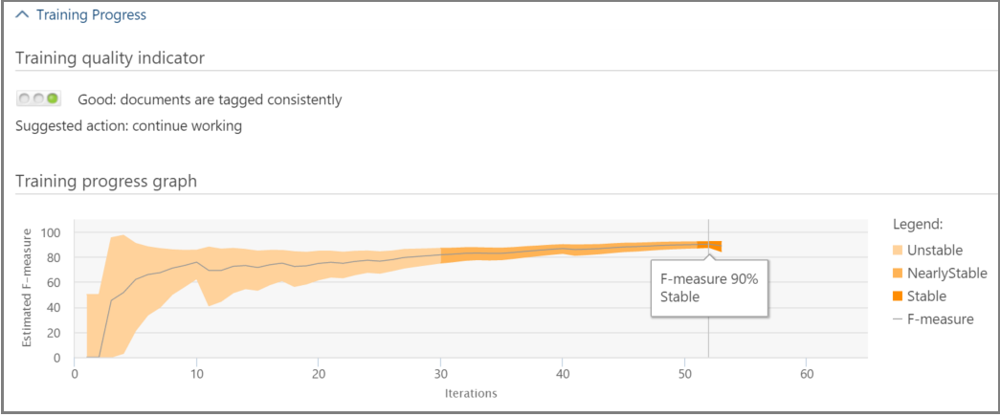

# Отслеживание релевантности в Office 365 Advanced eDiscovery

> [!NOTE]
> Чтобы можно было использовать Advanced eDiscovery, требуется подписка на Office 365 E3 с надстройкой Advanced Compliance или E5 для организации. Если у вас этого плана нет и вы хотите попробовать Advanced eDiscovery, можете [зарегистрироваться для получения пробной версии Office 365 корпоративный E5](https://go.microsoft.com/fwlink/p/?LinkID=698279). 
  
В разделе Advanced eDiscovery на вкладке "релевантность" отображается рассчитанное действие обучения релевантности, выполненного на вкладке "тег", и указывается следующий шаг, который необходимо выполнить в процессе итеративного обучения по релевантности. 
  
## Отслеживание состояния обучения релевантности

1. Ознакомьтесь со следующими сведениями в разделе релевантность для проблем с обращением, как показано в следующем примере диалогового окна " **имя проблемы** " ниже. 
    
  - **Оценка**: этот индикатор выполнения показывает, насколько степень релевантности, выполненной на этом шаге, достигла цели оценки в плане Маржи к ошибке. Также отображается насыщенность результатов обучения релевантности. 
    
  - **Обучающие материалы**: индикатор хода выполнения и всплывающих подсказок на экране указывает на стабильность результатов обучения и числовой масштаб, отображающий количество образцов обучения релевантности, отмеченных для каждого вопроса. Эксперт отслеживает ход процесса обучения по итеративной релевантности. 
    
  - **ВычисленИе пакетов**: этот индикатор выполнения содержит сведения о завершении пакетного вычисления.
    
  - **Следующий шаг**: отображает рекомендацию для следующего этапа, который необходимо выполнить. 
    
    В этом примере показана успешная Оценка вопроса, обозначенная индикатором завершения цветового процесса и галочкой. РасСтановка тегов выполняется, но ситуация все еще считается нестабильной (состояние стабильности также отображается в подсказке средства). Следующий шаг — "обучение". 
    
    
  
    Расширенное представление отображает дополнительные сведения и параметры. Отображаемая текущая погрешность — это поле ошибки отзыва в текущем состоянии оценки с учетом существующих файлов оценки (уже помеченных).
    
    > [!NOTE]
    >  Этап оценки можно пропустить, сняв флажок **оценки** для каждой проблемы, а затем — "все проблемы". Тем не менее, в результате этой ситуации будет отсутствовать статистика. _Гт_ очистка флажка **оценки** можно выполнить только до выполнения оценки. Если в случае существует несколько проблем, оценка обходится только в том случае, если этот флажок снят для каждой проблемы 
  
    Если не выполнить оценку с первого примера набора файлов, оценка может оказаться следующим шагом для пометки дополнительных файлов. 
    
    В разделе **релевантность** \> **** индикатор хода обучения и инструмент подсказки указывают предполагаемое количество дополнительных примеров, необходимых для достижения стабильности. Эта оценка содержит рекомендации по дополнительным обучению.
    
    
  
2. Когда вы закончите маркировку и вам нужно продолжить обучение, нажмите кнопку **учебНые курсы**. Другой образец набора файлов создается из набора загруженных файлов для дополнительного обучения. После этого вы вернетесь на вкладку тега, чтобы пометить Теги и научить больше файлов.
    
### Достижение стабильных уровней обучения

После того как файлы оценки пристигают стабильного уровня обучения, Расширенное обнаружение электронных данных готово для пакетного вычисления.
  
> [!NOTE]
> Как правило, после трех стабильных образцов обучения следующим шагом является "пакетное вычисление". Возможны исключения, например, при изменении тегов файлов из предыдущих образцов или при добавлении начальных файлов. 
  
### Выполнение пакетного вычисления

Вычисление пакетов выполняется в следующий шаг после успешного завершения обучения (при отображении индикатора выполнения — Пометка и стабильное состояние в подсказке подсказки). При выполнении пакетного вычисления информация, полученная во время изучения релевантности, применяется ко всему заполнению файла, чтобы оценить релевантность файлов и присвоить показатели релевантности.
  
При наличии нескольких ошибок в пакетном расчете выполняется по каждой из выпусков. Во время пакетного вычисления отслеживается ход выполнения при обработке всех файлов. 
  
Здесь рекомендуемый следующий шаг — "None", что означает, что на этом этапе не нужно выполнять дополнительное обучение по итеративной релевантности. Следующим этапом является вкладка ** \> релевантность** . 
  
Если вы хотите импортировать новые файлы после пакетного вычисления, администратор может добавить импортированные файлы в новую нагрузку.
  
> [!NOTE]
> Если нажать кнопку **Отмена** во время пакетного вычисления, процесс сохранит уже выполненное. При повторном выполнении пакетного вычисления процесс продолжится с последней точки. 
  
### Оценка согласованности тегов

Если маркировка файлов содержит несоответствия, это может повлиять на анализ. Процесс согласования с расширенной проверкой тегов обнаружения электронных данных можно использовать, если результаты не являются оптимальными или несогласованными. Возвращается список возможных несогласованных файлов с тегами, которые можно просматривать и повторно помечать при необходимости.
  
> [!NOTE]
> После семи циклов обучения, оценивающих после оценки, можно просмотреть согласованность **** \> тегов в **подробных результатах** \> **** **отслеживания** \> **релевантности** \> . Эта проверка выполняется по одной ошибке за раз. 
  
1. В **списке \> релевантность**разверните строку вопроса.
    
2. Щелкните **изменить**, чтобы перейти к **следующему шагу**.
    
3. Выберите параметр несогласованности **тегов** в качестве **следующего шага** , после семи образцов обучения и нажмите кнопку **ОК**.
    
4. Выберите **несоответствия тегов**. На вкладке **тег** открывается список несоответствий для повторного пометки при необходимости. 
    
5. Нажмите **** кнопку вычислить, чтобы отправит изменения. Следующий шаг после рассогласования тегов — "обучение". 
    
## Просмотр и использование результатов релевантности

На вкладке **Отслеживание \> релевантности** разверните строку вопроса и рядом с элементом **подробные результаты**нажмите кнопку **Просмотр**. Отображаются области подробных результатов, как показано ниже.
  

  
### Сводка по разМетке

 В приведенном ниже примере **Сводка тегов** отображает итоговые значения для каждого из процессов оценки, обучения и отслеживания файлов. 
  

  
### Ключевые слова

Ключевое слово — это уникальная строка, слово, фраза или последовательность слов в файле, определяемой расширенным обнаружением электронных данных, как важный индикатор того, является ли файл релевантным. Ключевое слово "include" содержит список столбцов и весовые значения для файлов, помеченных как имеющие отношение, а в столбцах "исключить" перечислены ключевые слова и веса в файлах, помеченных как несущественные.
  
Advanced eDiscovery задает отрицательные или положительные значения веса ключевых слов. Чем выше вес, тем выше вероятность того, что файл, в котором отображается ключевое слово, будет иметь более высокую оценку релевантности во время выполнения пакетного вычисления. 
  
Расширенный список обнаружения электронных данных с ключевыми словами можно использовать для дополнения списка, созданного экспертом, или в качестве косвенной проверки санити в любой момент в процессе проверки файлов.
  
### Ход обучения

Область " **Ход обучения** " содержит график хода обучения и отображение индикатора качества, как показано в примере ниже. 
  

  
 **Индикатор качества обучения**: отображает оценку согласованности тегов следующим образом:
  
- **Хорошая**: файлы помечаются тегами единообразно. (Отображается зеленый свет)
    
- **Medium**: некоторые файлы могут помечаться как несогласованные. (Желтый индикатор отображается)
    
- **Предупреждение**: многие файлы могут быть отмечены как несогласованные. (Отображается красный индикатор)
    
 **График хода обучения**: показывает степень стабильности обучения по релевантности после циклов обучения по сравнению со значением F – Measure. Когда вы перемещаетесь слева направо на диаграмме, диапазон доверия сужается и используется вместе с F-мерой, а также с помощью расширенной функции обнаружения электронных данных для определения стабильности при оптимизации результатов обучения релевантности.
  
> [!NOTE]
> Релевантность использует клавишу F2, метрику координат F, в которой отзыв получается вдвое как точность. Для случаев с высоким уровнем насыщенности (более 25%) релевантность использует F1 (соотношение 1:1). Отношение единицы измерения F можно настроить в **дополнительных параметрах** **настройки** \> релевантности. 
  
### Результаты расчетов партий

В области **результатов расчетОв пакетов** указывается количество файлов, которые были оценены по релевантности, как показано ниже. 
  
- **Success**
    
- **Empty**: не содержит текста (например, только пробелы/знаки табуляции)
    
- **Сбой**: из-за чрезмерного размера или недоступен для чтения
    
- **** Проигнорировано: из-за чрезмерного размера
    
- **Небулаус**: содержит небессмысленный текст или компоненты, не связанные с этой ошибкой.
    
> [!NOTE]
> "Пустой", "ошибка", "игнорируется" или "Небулаус" получает показатель релевантности, равный – 1. 
  
### Статистика обучения

В области " **Статистика обучения** " отображаются статистические данные и графики на основе результатов расширенного обучения относительно обнаружения электронных данных. 
  

  
В этом представлении отображаются следующие сведения:
  
- **Коэффициент отзыва**: сравнение результатов в соответствии с оценками релевантности в гипотетической линейной проверке. Пример отзыва оценивается с учетом установленного размера набора рецензирования.
    
- **Parameters**: интегральная вычисляемые статистические данные, относящиеся к набору проверки по отношению к совокупности файлов для всего случая.
    
- **Обзор**: процент файлов для проверки на основе этой отсечки.
    
- **Отзыв**: процент релевантных файлов в наборе проверки. 
    
- **Распределение по показателю релевантности**: файлы в темно-сером дисплее слева расположены под показателем отсечки. Всплывающая подсказка отображает показатель релевантности и связанный с ними процент файлов в наборе контрольных файлов по отношению к общему количеству файлов.
    
## См. также

[Office 365 Advanced eDiscovery](office-365-advanced-ediscovery.md)
  
[Понимание оценки релевантности](assessment-in-relevance-in-advanced-ediscovery.md)
  
[Выполнение и Просмотр оценки](tagging-and-assessment-in-advanced-ediscovery.md)
  
[Обучение по релевантности](tagging-and-relevance-training-in-advanced-ediscovery.md)
  
[Принятие решений на основе результатов](decision-based-on-the-results-in-advanced-ediscovery.md)
  
[Анализ релевантности тестирования](test-relevance-analysis-in-advanced-ediscovery.md)

