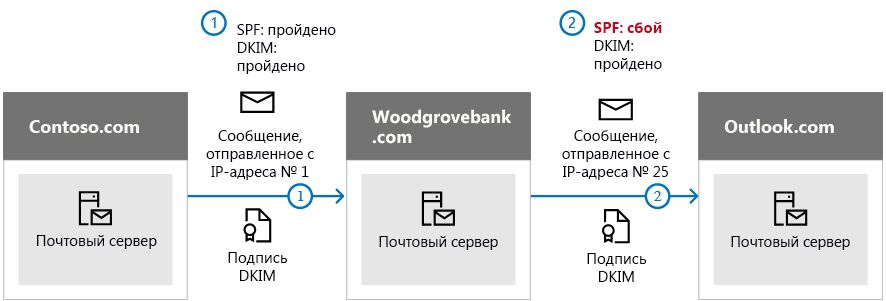

# <a name="use-dkim-to-validate-outbound-email-sent-from-your-custom-domain-in-office-365"></a>Проверка исходящей электронной почты, отправляемой с личного домена в Office 365, с помощью DKIM

 **Сводка:** В этой статье описано, как использовать определенную почту DomainKeys identified mail (DKIM) с Office 365, чтобы сообщения электронной почты с конечными системами, которые отправляются из личного домена. 
  
Используйте DKIM вместе с инфраструктурой политики отправителей и DMARC, чтобы злоумышленники не могли отправлять сообщения якобы из вашего домена. DKIM позволяет добавлять цифровую подпись в заголовки сообщений электронной почты. Может показаться, что это сложно, но на самом деле все просто. При настройке DKIM вы авторизуете домен, чтобы сопоставить его имя с сообщением электронной почты с помощью криптографической проверки подлинности. С помощью этой цифровой подписи системы электронной почты могут определить, действительно ли входящее сообщение отправлено из вашего домена.
  
По сути, вы используете закрытый ключ для шифрования заголовков сообщений, отправляемых из домена. В записях DNS домена вы публикуете открытый ключ, с помощью которого принимающие серверы расшифровывают подпись. С помощью открытого ключа они проверяют, действительно ли сообщения отправлены вами, а не злоумышленниками, подделавшими ваш домен.
  
Office 365 автоматически настраивает DKIM для исходных доменов. Исходный домен — это домен, созданный при регистрации в службе Office 365, например contoso.onmicrosoft.com. Вам не нужно ничего делать, чтобы настроить DKIM для исходного домена. Дополнительные сведения о доменах см. в разделе [часто задаваемых вопросов](https://support.office.com/article/Domains-FAQ-1272bad0-4bd4-4796-8005-67d6fb3afc5a#bkmk_whydoihaveanonmicrosoft.comdomain).
  
Вы также можете не настраивать DKIM для личного домена. В этом случае Office 365 создаст пару ключей — закрытый и открытый, включит подпись с помощью DKIM и настроит политику по умолчанию для личного домена. Этого вполне достаточно для защиты большинства пользователей Office 365. Настраивать DKIM для личного домена вручную следует в таких случаях:
  
- у вас есть несколько личных доменов в Office 365;
    
- вы также собираетесь настроить DMARC (рекомендуется);
    
- вам необходим контроль над закрытым ключом;
    
- вам необходимо настроить записи CNAME.
    
- вам нужно настроить ключи DKIM для сообщений электронной почты со стороннего домена, например при использовании стороннего средства для массовых рассылок.
    
Содержание
  
- [Преимущества технологии DKIM над инфраструктурой политики отправителей для предотвращения спуфинга в Office 365](use-dkim-to-validate-outbound-email.md#HowDKIMWorks)
    
- [Как настроить DKIM в Office 365 вручную](use-dkim-to-validate-outbound-email.md#SetUpDKIMO365)
    
- [Настройка DKIM для нескольких личных доменов в Office 365](use-dkim-to-validate-outbound-email.md#DKIMMultiDomain)
    
- [Как отключить политику подписывания DKIM для личного домена в Office 365](use-dkim-to-validate-outbound-email.md#DisableDKIMSigningPolicy)
    
- [Настройка по умолчанию для DKIM и Office 365](use-dkim-to-validate-outbound-email.md#DefaultDKIMbehavior)
    
- [Как настроить DKIM так, чтобы сторонняя служба могла отправлять сообщения электронной почты от имени вашего личного домена](use-dkim-to-validate-outbound-email.md#SetUp3rdPartyspoof)
    
- [Дальнейшие действия: после настройки инфраструктуры политики отправителей для Office 365](use-dkim-to-validate-outbound-email.md#DKIMNextSteps)
    
## <a name="how-dkim-works-better-than-spf-alone-to-prevent-malicious-spoofing-in-office-365"></a>Преимущества технологии DKIM над инфраструктурой политики отправителей для предотвращения спуфинга в Office 365
<a name="HowDKIMWorks"> </a>

Инфраструктура политики отправителей добавляет сведения в конверт сообщения, а технология DKIM шифрует подпись в заголовке сообщения. При пересылке фрагменты конверта этого сообщения могут быть удалены сервером пересылки. Поскольку цифровая подпись остается в заголовке сообщения, технология DKIM работает даже при пересылке, как показано в примере ниже.
  

  
Если бы в этом примере вы опубликовали только запись типа TXT инфраструктуры политики отправителей для домена, почтовый сервер получателя мог бы пометить ваше сообщение как спам, что привело бы к ложному срабатыванию. Добавление DKIM в этом сценарии позволяет снизить количество ложных срабатываний. Так как в технологии DKIM для проверки подлинности используется шифрование с помощью открытого ключа, а не только IP-адресов, она считается более надежным способом проверки подлинности, чем инфраструктура политики отправителей. Рекомендуем использовать обе эти технологии, а также DMARC в вашем развертывании.
  
Подробности: DKIM использует закрытый ключ для вставки зашифрованной подписи в заголовки сообщений. Имя подписывающего домена (или домена исходящей почты) вставляется в заголовок в качестве значения поля **d=**. Проверяющий домен (или домен получателя) затем использует поле **d=** для поиска открытого ключа в DNS и проверки подлинности сообщения. Так сообщение проходит проверку DKIM. 
  
## <a name="what-you-need-to-do-to-manually-set-up-dkim-in-office-365"></a>Как настроить DKIM в Office 365 вручную
<a name="SetUpDKIMO365"> </a>

Настройка DKIM состоит из двух этапов:
  
- [Публикация двух записей CNAME для личного домена в DNS](use-dkim-to-validate-outbound-email.md#Publish2CNAME)
    
- [Включение подписи с помощью DKIM для личного домена в Office 365](use-dkim-to-validate-outbound-email.md#EnableDKIMinO365)
    
### <a name="publish-two-cname-records-for-your-custom-domain-in-dns"></a>Публикация двух записей CNAME для личного домена в DNS
<a name="Publish2CNAME"> </a>

Для каждого домена, для которого требуется добавить подпись DKIM в DNS, необходимо опубликовать две записи CNAME. Запись CNAME указывает, что каноническое имя домена является псевдонимом другого доменного имени. Записи CNAME следует создавать на общедоступных DNS-серверах для настраиваемых доменов. Записи CNAME в DNS будут направляться на уже созданные записи, существующие в DNS на DNS-серверах Майкрософт для Office 365.
  
 Office 365 выполняет автоматическую ротацию ключей, используя две заданные записи. Для каждого дополнительного домена в Office 365 необходимо опубликовать две записи CNAME. Таким образом, если у вас есть два домена, необходимо опубликовать две дополнительные записи CNAME и так далее.
  
Используйте следующий формат для записей CNAME.

> [!IMPORTANT]
> Если вы один из наших самых высоких клиентов, мы рассчитывали _domainGuid_ по-другому! Вместо того чтобы искать запись MX для _инитиалдомаин_ , чтобы рассчитать _domainGuid_, мы вычисляем ее непосредственно из настроенного домена. Например, если личный домен — "contoso.com", domainGuid становится "Contoso-com", все точки заменяются дефисом. Таким образом, независимо от записи MX, на которую указывает Инитиалдомаин, вы всегда можете использовать метод, описанный выше, чтобы рассчитать domainGuid для использования в записях CNAME.

  
```
Host name:          selector1._domainkey
Points to address or value: selector1-<domainGUID>._domainkey.<initialDomain> 
TTL:                3600

Host name:          selector2._domainkey
Points to address or value: selector2-<domainGUID>._domainkey.<initialDomain> 
TTL:                3600
```

Где:
  
- selector1 и selector2 — это селекторы для Office 365. 
    
- _domainGUID_ это то же самое, что и _domainGUID_ в настроенной записи MX для вашего личного домена, который отображается перед mail.Protection.Outlook.com. Например, в следующей записи MX для домена contoso.com, _domainGUID_ — Contoso-com: 
    
    ```
    contoso.com.  3600  IN  MX   5 contoso-com.mail.protection.outlook.com
    ```

- _initialDomain_ — это домен, который вы использовали при регистрации в Office 365. Исходные домены всегда заканчиваются на onmicrosoft.com. О том, как узнать свой исходный домен, читайте в разделе [часто задаваемых вопросов](https://support.office.com/article/1272bad0-4bd4-4796-8005-67d6fb3afc5a#bkmk_whydoihaveanonmicrosoft.comdomain).
    
Например, если у вас есть исходный домен cohovineyardandwinery.onmicrosoft.com и два личных домена cohovineyard.com и cohowinery.com, вам необходимо настроить две записи CNAME для каждого дополнительного домена (всего четыре записи CNAME).
  
```
Host name:          selector1._domainkey
Points to address or value: **selector1-cohovineyard-com**._domainkey.cohovineyardandwinery.onmicrosoft.com
TTL:                3600

Host name:          selector2._domainkey
Points to address or value: **selector2-cohovineyard-com**._domainkey.cohovineyardandwinery.onmicrosoft.com
TTL:                3600

Host name:          selector1._domainkey
Points to address or value: **selector1-cohowinery-com**._domainkey.cohovineyardandwinery.onmicrosoft.com 
TTL:                3600
 
Host name:          selector2._domainkey
Points to address or value: **selector2-cohowinery-com**._domainkey.cohovineyardandwinery.onmicrosoft.com 
TTL:                3600
```

### <a name="enable-dkim-signing-for-your-custom-domain-in-office-365"></a>Включение подписи с помощью DKIM для личного домена в Office 365
<a name="EnableDKIMinO365"> </a>

После публикации записей CNAME в DNS включите подпись с помощью DKIM в Office 365. Это можно сделать с помощью центра администрирования Microsoft 365 или с помощью PowerShell.
  
#### <a name="to-enable-dkim-signing-for-your-custom-domain-through-the-admin-center"></a>Включение подписывания DKIM для личного домена с помощью центра администрирования

1. [Войдите в Office 365](https://support.office.microsoft.com/article/e9eb7d51-5430-4929-91ab-6157c5a050b4) с помощью рабочей или учебной учетной записи. 
    
2. В левом верхнем углу выберите значок запуска приложений и выберите элемент **Администратор**.
    
3. В области навигации слева внизу разверните узел **Администратор** и выберите элемент **Exchange**.
    
4. Перейдите в раздел **Защита** \> **dkim**.
    
5. Выберите домен, для которого требуется включить DKIM, а затем в разделе **Добавлять подписи DKIM в сообщения для этого домена** нажмите **Включить**. Повторите этот шаг для каждого личного домена.
    
#### <a name="to-enable-dkim-signing-for-your-custom-domain-by-using-powershell"></a>Как включить подпись с помощью DKIM для личного домена, используя PowerShell

1. [Подключитесь к Exchange Online PowerShell](https://technet.microsoft.com/library/jj984289.aspx).
    
2. Выполните следующую команду.
    
    ```
    New-DkimSigningConfig -DomainName <domain> -Enabled $true
    ```

   Где _domain_ это имя пользовательского домена, для которого требуется включить подписывание DKIM. 
    
   Например, для домена contoso.com:
    
    ```
    New-DkimSigningConfig -DomainName contoso.com -Enabled $true
    ```

#### <a name="to-confirm-dkim-signing-is-configured-properly-for-office-365"></a>Как проверить настройку подписи с помощью DKIM для Office 365

Прежде чем выполнять указанные ниже действия для проверки настройки DKIM, подождите несколько минут. Для распространения информации DKIM о домене по сети требуется время.
  
- Отправьте сообщение из учетной записи в вашем домене Office 365 с включенной проверкой DKIM в другую учетную запись электронной почты, например outlook.com или Hotmail.com.
    
- Не используйте для проверки учетную запись aol.com. AOL может пропустить проверку DKIM в случае успешной проверки SPF. Такая проверка будет недействительной.
    
- Откройте сообщение и посмотрите на заголовок. Инструкции по просмотру заголовка сообщения зависят от вашего почтового клиента. Инструкции по просмотру заголовков сообщений в Outlook см. в статье [Просмотр заголовков сообщений электронной почты](https://support.office.com/article/CD039382-DC6E-4264-AC74-C048563D212C).

  Сообщение, подписанное с помощью DKIM, будет содержать имя узла и доменное имя, указанные вами при публикации записей CNAME. Сообщение будет выглядеть примерно так: 
    
    ```
    From: Example User <example@contoso.com> 
    DKIM-Signature: v=1; a=rsa-sha256; q=dns/txt; c=relaxed/relaxed; 
        s=selector1; d=contoso.com; t=1429912795; 
        h=From:To:Message-ID:Subject:MIME-Version:Content-Type; 
        bh=<body hash>; 
        b=<signed field>;
    ```

- Найдите заголовок Authentication-Results. Принимающие службы помечают входящую почту по-разному, но результат должен содержать элемент, подобный **DKIM=pass** или **DKIM=OK**. 
    
## <a name="to-configure-dkim-for-more-than-one-custom-domain-in-office-365"></a>Настройка DKIM для нескольких личных доменов в Office 365
<a name="DKIMMultiDomain"> </a>

Действия, описанные в этой статье, необходимо выполнить для каждого дополнительного личного домена, для которого требуется включить DKIM. В частности, выполните все действия, описанные в разделе [Как настроить DKIM в Office 365 вручную](use-dkim-to-validate-outbound-email.md#SetUpDKIMO365).
  
## <a name="disabling-the-dkim-signing-policy-for-a-custom-domain-in-office-365"></a>Как отключить политику подписывания DKIM для личного домена в Office 365
<a name="DisableDKIMSigningPolicy"> </a>

Отключение политики подписывания полностью не отключает DKIM. Через некоторое время служба Office 365 автоматически применит политику Office 365 по умолчанию для вашего домена. Дополнительные сведения см. в разделе [Настройка по умолчанию для DKIM и Office 365](use-dkim-to-validate-outbound-email.md#DefaultDKIMbehavior).
  
### <a name="to-disable-the-dkim-signing-policy-by-using-windows-powershell"></a>Отключение политики подписывания DKIM с помощью Windows PowerShell

1. [Подключитесь к Exchange Online PowerShell](https://technet.microsoft.com/library/jj984289.aspx).
    
2. Выполните одну из указанных ниже команд для каждого домена, для которого требуется отключить подпись с помощью DKIM.
    
    ```
    $p=Get-DkimSigningConfig -identity <domain>
    $p[0] | set-DkimSigningConfig -enabled $false
    ```

   Пример:
    
    ```
    $p=Get-DkimSigningConfig -identity contoso.com
    $p[0] | set-DkimSigningConfig -enabled $false
    ```

   или
    
    ```
    Set-DkimSigningConfig -identity $p[<number>].identity -enabled $false
    ```

    Где _Number_ это индекс политики. Например: 
    
    ```
    Set-DkimSigningConfig -identity $p[0].identity -enabled $false
    ```

## <a name="default-behavior-for-dkim-and-office-365"></a>Настройка по умолчанию для DKIM и Office 365
<a name="DefaultDKIMbehavior"> </a>

Если вы не включите DKIM, Office 365 автоматически создаст 1024-разрядный открытый ключ DKIM для вашего личного домена и соответствующий закрытый ключ, которые хранятся в нашем центре обработки данных. Для доменов без действующей политики Office 365 использует конфигурацию подписывания по умолчанию. Это означает, что если вы не настроите DKIM самостоятельно, Office 365 включит DKIM для вашего домена, используя политику по умолчанию и созданные ключи.
  
Кроме того, если вы отключите подпись с помощью DKIM, то через некоторое время Office 365 автоматически включит для вашего домена политику по умолчанию.
  
Предположим, что в примере ниже подпись DKIM для домена fabrikam.com включил Office 365, а не администратор домена. Это означает, что в службе DNS нет требуемых записей CNAME. Подписи DKIM для электронной почты из этого домена будут выглядеть следующим образом:
  
```
From: Second Example <second.example@fabrikam.com> 
DKIM-Signature: v=1; a=rsa-sha256; q=dns/txt; c=relaxed/relaxed; 
    s=selector1-fabrikam-com; d=contoso.onmicrosoft.com; t=1429912795; 
    h=From:To:Message-ID:Subject:MIME-Version:Content-Type; 
    bh=<body hash>; 
    b=<signed field>;
```

В этом примере имя узла и доменное имя содержат значения, на которые указывала бы запись CNAME, если бы администратор домена настроил подпись DKIM для домена fabrikam.com. Каждое сообщение, отправленное из Office 365, будет подписано с помощью DKIM. Если вы включили DKIM самостоятельно, то домен будет совпадать с доменом, указанным в адресе отправителя (в этом случае — fabrikam.com). В противном случае будет использоваться исходный домен организации. О том, как узнать свой исходный домен, читайте в разделе [часто задаваемых вопросов](https://support.office.com/article/1272bad0-4bd4-4796-8005-67d6fb3afc5a#bkmk_whydoihaveanonmicrosoft.comdomain).
  
## <a name="set-up-dkim-so-that-a-third-party-service-can-send-or-spoof-email-on-behalf-of-your-custom-domain"></a>Как настроить DKIM так, чтобы сторонняя служба могла отправлять сообщения электронной почты от имени вашего личного домена
<a name="SetUp3rdPartyspoof"> </a>

Некоторые поставщика услуг электронной почты, или поставщики программного обеспечения как службы, позволяют настраивать ключи DKIM для сообщений электронной почты, отправляемых из их службы. Для этого вам необходимо координировать свои действия с третьей стороной, чтобы настроить необходимые записи DNS. В каждой организации это делают по-своему. Процесс полностью зависит от конкретного предприятия.
  
Пример сообщения с правильно настроенными ключами DKIM для доменов contoso.com и bulkemailprovider.com:
  
```
Return-Path: <communication@bulkemailprovider.com>
 From: <sender@contoso.com>
 DKIM-Signature: s=s1024; d=contoso.com
 Subject: Here is a message from Bulk Email Provider's infrastructure, but with a DKIM signature authorized by contoso.com
```

В этом примере для достижения представленного результата:
  
1. Поставщик услуг массовой рассылки предоставил компании Contoso открытый ключ DKIM.
    
2. Компания Contoso опубликовала ключ DKIM в своей записи DNS.
    
3. При отправке сообщения поставщик услуг массовой рассылки подписывает ключ соответствующим закрытым ключом. Таким образом он добавляет подпись DKIM в заголовок сообщения.
    
4. Почтовые системы получателей выполняют проверку DKIM путем сравнения значения DKIM-Signature d=\<domain\> с доменом в поле "От" (5322.From) сообщения. В этом примере значения совпадают:
    
    Отправитель @**contoso.com**
    
    d =**contoso.com**
    
## <a name="next-steps-after-you-set-up-dkim-for-office-365"></a>Дальнейшие действия: после настройки инфраструктуры политики отправителей для Office 365
<a name="DKIMNextSteps"> </a>

Несмотря на то что технология DKIM предназначена для предотвращения спуфинга, она более эффективно работает вместе с инфраструктурой политики отправителей и DMARC. После настройки DKIM настройте инфраструктуру политики отправителей. Общие сведения об этой инфраструктуре и инструкции по ее настройке см. в статье [Set up SPF in Office 365 to help prevent spoofing](set-up-spf-in-office-365-to-help-prevent-spoofing.md). Дополнительные сведения об использовании инфраструктуры политики отправителей в Office 365, рекомендации по устранению неполадок и инструкции для нестандартных, в том числе гибридных, развертываний см. в статье [How Office 365 uses Sender Policy Framework (SPF) to prevent spoofing](how-office-365-uses-spf-to-prevent-spoofing.md). Дальнейшие действия см. в статье [Use DMARC to validate email in Office 365](use-dmarc-to-validate-email.md). [Заголовки сообщений защиты от нежелательной почты](anti-spam-message-headers.md) включает синтаксис и поля заголовков, используемые в Office 365 для проверок DKIM. 
  

