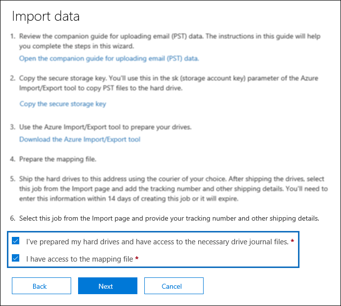

# <a name="use-drive-shipping-to-import-your-organization-pst-files-to-office-365"></a>Использование доставки дисков для импорта PST-файлов Организации в Office 365

**Эта статья предназначена для администраторов. Вы пытаетесь импортировать PST-файлы в свой почтовый ящик? [В разделе Импорт электронной почты, контактов и календаря из PST-файла Outlook](https://go.microsoft.com/fwlink/p/?LinkID=785075)**
   
Используйте службу импорта Office 365 и доставку дисков для массового импорта PST-файлов в почтовые ящики пользователей. Под отправкой жестких дисков имеется в виду следующее: вы копируете PST-файлы на жесткие диски, а затем отправляете эти диски в корпорацию Майкрософт. Когда диски будут доставлены в корпорацию Майкрософт, сотрудники центра обработки данных скопируют имеющиеся на них данные в хранилище в Microsoft Cloud. После этого вы можете обрезать данные PST, которые фактически импортируются в целевые почтовые ящики, настроив фильтры, которые контролируют импортируемые данные. После запуска задания импорта служба импорта импортирует данные PST из области хранения в почтовые ящики пользователей. Использование доставки дисков для импорта PST-файлов в почтовые ящики пользователей — это один из способов переноса электронной почты организации в Office 365.
  
Ниже приведены действия, необходимые для импорта PST-файлов в почтовые ящики Office 365, с помощью доставки дисков:
  
[Шаг 1: Скачайте ключ безопасного хранения и средство импорта PST-файлов](#step-1-download-the-secure-storage-key-and-pst-import-tool)

[Шаг 2: копирование PST-файлов на жесткий диск](#step-2-copy-the-pst-files-to-the-hard-drive)

[Шаг 3: создание файла сопоставления для импорта PST-файлов](#step-3-create-the-pst-import-mapping-file)

[Действие 4. В Office 365 создайте задание на импорт PST-файлов](#step-4-create-a-pst-import-job-in-office-365).

[Действие 5. Отправьте жесткие диски в корпорацию Майкрософт](#step-5-ship-the-hard-drive-to-microsoft).

[Шаг 6: Фильтрация данных и запуск задания импорта PST-файлов](#step-6-filter-data-and-start-the-pst-import-job)
  
> [!IMPORTANT]
> Необходимо выполнить шаг 1 один раз, чтобы загрузить ключ безопасного хранения и средство импорта. После выполнения этих действий выполните действия 2 – 6 для каждого подотчетного жесткого диска в корпорацию Майкрософт. 
  
Часто задаваемые вопросы об использовании доставки дисков для импорта PST-файлов в Office 365 приведены в статье [вопросы и ответы по использованию функции доставки дисков для импорта PST-файлов](faqimporting-pst-files-to-office-365.md#using-drive-shipping-to-import-pst-files). 
  
## <a name="before-you-begin"></a>Перед началом работы

- Необходимо назначить роль экспорта для импорта поЧтовых ящиков в Exchange Online, чтобы импортировать PST-файлы в почтовые ящики Office 365. По умолчанию эта роль не назначается ни одной группе ролей в Exchange Online. You can add the Mailbox Import Export role to the Organization Management role group. Or you can create a new role group, assign the Mailbox Import Export role, and then add yourself as a member. Дополнительные сведения можно найти в разделах "Добавление роли в группу ролей" или "Создание группы ролей" в разделе [Управление группами ролей](https://go.microsoft.com/fwlink/p/?LinkId=730688).
    
    Кроме того, для создания заданий импорта в центре безопасности &amp; и соответствия требованиям Office 365 необходимо выполнить одно из следующих условий:
    
  - Вы должны быть назначены роли получателей почты в Exchange Online. By default, this role is assigned to the Organization Management and Recipient Management roles groups.
    
    Или
    
  - Вам необходимо быть глобальным администратором в организации Office 365.
    
    > [!TIP]
    > РасСмотрите возможность создания новой группы ролей в Exchange Online, специально предназначенной для импорта PST-файлов в Office 365. Для доступа к минимальному уровню привилегий, необходимых для импорта PST-файлов, назначьте роли "Импорт импорта почтового ящика" и "Получатели почты" новой группе ролей, а затем добавьте участников. 
  
- PST-файлы, которые вы хотите скопировать на жесткие диски, должны храниться на файловом сервере или в общей папке в вашей организации. На шаге 2 вы запустите средство импорта и экспорта Azure (WAImportExport. exe), которое скопирует PST-файлы, хранящиеся на этом файловом сервере или в общей папке, на жесткий диск.
    
- Для службы импорта Office 365 поддерживаются только диски с твердотельными накопителями 2,5 дюймов (SSDs) или 2,5 или 3,5 дюймов для жестких дисков SATA II/III. You can use hard drives up to 10 TB. Для заданий импорта будет обработано только первый том данных на жестком диске. The data volume must be formatted with NTFS. При копировании данных на жесткий диск вы можете присоединить его непосредственно с помощью соединителя SATA II или 2,5 или 3,5 дюйма или с помощью разъема SATA II/III или с внешним подключением с помощью USB-адаптера SATA II/III или 2,5 с SATA II/III.
    
    > [!IMPORTANT]
    > Внешние жесткие диски, которые поставляются со встроенным USB-адаптером, не поддерживаются службой импорта Office 365. Additionally, the disk inside the casing of an external hard drive can't be used. Please don't ship external hard drives. 
  
- Жесткие диски, на которые вы копируете PST-файлы, должны быть зашифрован с помощью технологии BitLocker. Средство WAImportExport.exe, которое вы запустите в действии 2, поможет вам настроить BitLocker. Кроме того, он создает ключ шифрования BitLocker, который сотрудники центра обработки данных Майкрософт будут использовать для доступа к диску для отправки PST-файлов в область хранилища Azure в облаке Майкрософт.
    
- Доставка дисков доступна через корпоративное соглашение Майкрософт (EA). Доставка дисков недоступна через соглашение о продуктах и службах Майкрософт (МПСА).
    
- Затраты на импорт PST-файлов в почтовые ящики Office 365 с использованием доставки дисков составляет $2 долларов США на ГБ данных. Например, если вы отправите жесткий диск, содержащий 1 000 ГБ (1 ТБ) PST-файлов, стоимость составляет $2 000 долларов США. You can work with a partner to pay the import fee. Сведения о том, как найти партнера, можно [найти в статье Find Your партнер или торговый посредник Office 365](https://go.microsoft.com/fwlink/p/?LinkId=785197).
    
- У вас или у вашей организации должна быть учетная запись в службах FedEx или DHL. 
    
  - Организации в Соединенных Штатах Америки, Бразилии и Европе должны иметь учетные записи Федекс.
    
  - Организации в Восточной Азии, юго юго Азии, Японии, Республика Корея и Австралии должны иметь учетные записи DHL.
    
    Корпорация Майкрософт будет использовать эти учетные записи для возврата жестких дисков (и взимания оплаты). 
    
- Возможно, что жесткие диски, которые вы отправляете в корпорацию Майкрософт, пересекут границы государств. В этом случае вы несете ответственность за импорт и экспорт жестких дисков согласно действующим законам. Перед отправкой жестких дисков проконсультируйтесь со специалистами и убедитесь, что их можно законным образом доставить в один из центров обработки данных корпорации Майкрософт. Это позволит своевременно доставить жесткие диски в корпорацию Майкрософт.
    
- Во время выполнения этой процедуры необходимо скопировать и сохранить ключ защищенного хранилища и ключ шифрования BitLocker. Необходимо защитить эти ключи так же надежно, как вы защищаете пароли и прочую информацию, связанную с обеспечением безопасности. Например, можно сохранить эти ключи в документе Microsoft Word, защищенном паролем, или на зашифрованном USB-накопителе. В разделе [Дополнительные сведения](#more-information) вы найдете пример этих разделов. 
    
- После импорта PST-файлов в почтовый ящик Office 365 параметр удержания хранения для почтового ящика включается в течение неопределенной длительности. Это означает, что политика хранения, назначенная почтовому ящику, не будет обработана, пока вы не отключите удержание для хранения или не установите дату отключения удержания. Зачем это делать? Если сообщения, импортированные в почтовый ящик, устарели, они могут быть удалены без возможности восстановления (очистка), так как срок их хранения истечет в соответствии с параметрами хранения, настроенными для почтового ящика. Помещение почтового ящика на хранение при хранении предоставит владельцу почтового ящика время, в течение которого будут управляться эти недавно импортированные сообщения, или будет предложено время изменить параметры хранения для почтового ящика. В разделе [More Information](#more-information) представлены рекомендации по управлению удержанием хранения. 
    
- По умолчанию максимальный размер сообщения, который может быть получен в почтовом ящике Office 365, составляет 35 МБ. Это связано с тем, что для свойства *MaxReceiveSize* почтового ящика задано значение 35 МБ. Однако ограничение максимального размера получаемых сообщений в Office 365 составляет 150 МБ. Поэтому при импорте PST-файла, содержащего элемент размером более 35 МБ, служба импорта Office 365 автоматически изменит значение свойства *MaxReceiveSize* в целевом почтовом ящике на 150 МБ. Это позволяет импортировать сообщения размером до 150 МБ в почтовые ящики пользователей. 
    
    > [!TIP]
    > Чтобы определить размер получаемых сообщений для почтового ящика, выполните следующую команду в Exchange Online PowerShell: `Get-Mailbox <user mailbox> | FL MaxReceiveSize`. 
  
- Вы можете импортировать PST-файлы в неактивный почтовый ящик в Office 365. Для этого укажите идентификатор GUID неактивного почтового ящика в `Mailbox` параметре в файле сопоставления PST-импорта. Для получения дополнительных сведений см. [Шаг 3: создание файла сопоставления для импорта PST-файлов](#step-3-create-the-pst-import-mapping-file) . 
    
- В гибридном развертывании Exchange вы можете импортировать PST-файлы в облачный архивный архивный почтовый ящик для пользователя, основной почтовый ящик которого находится в локальной среде. Для этого выполните следующие действия в файле сопоставления PST-импорта:
    
  - Укажите адрес электронной почты для локального почтового ящика пользователя в `Mailbox` параметре. 
    
  - Укажите значение **true** в `IsArchive` параметре. 
    
    Для получения дополнительных сведений см. [Шаг 3: создание файла сопоставления для импорта PST-файлов](#step-3-create-the-pst-import-mapping-file) . 

## <a name="step-1-download-the-secure-storage-key-and-pst-import-tool"></a>Шаг 1: Скачайте ключ безопасного хранения и средство импорта PST-файлов

Первый шаг — скачать ключ безопасного хранения и средство, которые вы будете использовать на шаге 2 для копирования PST-файлов на жесткий диск.
  
> [!IMPORTANT]
> Для успешного импорта PST-файлов с помощью метода доставки диска необходимо использовать средство импорта и экспорта Azure версии 1 (WAimportExportV1). Версия 2 средства импорта и экспорта Azure не поддерживается, и его использование приведет к неправильной подготовке жесткого диска для задания импорта. Обязательно Скачайте средство импорта и экспорта Azure из центра соответствия требованиям безопасности &amp; , выполнив процедуры, описанные в этом шаге. 
  
1. Перейдите к [https://protection.office.com/](https://protection.office.com/) учетной записи администратора в организации Office 365 и войдите в нее, используя учетные данные администратора. 
    
2. В левой &amp; области центра безопасности и соответствия требованиям выберите **Импорт**управления **данными** \> .
    
    > [!NOTE]
    > Как было сказано ранее, вам должны быть назначены соответствующие разрешения на доступ к странице " **Импорт** " в &amp; центре безопасности и соответствия требованиям. 
  
3. На странице **Импорт** нажмите кнопку  **создать задание импорта**.
    
4. В мастере импорта заданий введите имя задания импорта PST-файлов, а затем нажмите кнопку **Далее**. Используйте строчные буквы, цифры, дефисы и символы подчеркивания. В имени нельзя использовать прописные буквы или вставлять пробелы.
    
5. На странице " **Выбор типа задания импорта** " выберите пункт отгрузить **Жесткие диски в одно из физических расположений** , а затем нажмите кнопку **Далее**.
    
    
  
6. На странице **Импорт данных** выполните следующие два действия: 
    
    
  
    a. В шаге 2 щелкните **Копировать ключ безопасного хранения**. После отображения ключа хранилища нажмите кнопку **Копировать в буфер обмена** , а затем вставьте его и сохраните в файл, чтобы получить к нему доступ позже.
    
    b. На шаге 3 **Скачайте средство импорта и экспорта Azure** , чтобы скачать и установить средство импорта и экспорта Azure (версия 1).
    
    - Во всплывающем окне нажмите **сохранить** \> **Сохранить как** , чтобы сохранить файл WaImportExportV1. zip в папку на локальном компьютере. 
    
    - ИзВлеките файл WaImportExportV1. zip.
    
7. Нажмите кнопку **Отмена** , чтобы закрыть мастер. 
    
    Вы вернетесь на страницу **Импорт** в центре соответствия требованиям безопасности &amp; при создании задания импорта на шаге 4. 

## <a name="step-2-copy-the-pst-files-to-the-hard-drive"></a>Шаг 2: копирование PST-файлов на жесткий диск

Далее необходимо с помощью средства WAImportExport.exe скопировать PST-файлы на жесткие диски. Это средство шифрует жесткие диски с помощью технологии BitLocker, копирует на них PST-файлы и создает файл журнала, в котором хранятся сведения о процессе копирования. Чтобы выполнить это действие, необходимо, чтобы PST-файлы хранились в файловом ресурсе или на файловом сервере в вашей организации. В описанной ниже процедуре такое расположение называется исходным каталогом. 
  
> [!IMPORTANT]
> После того как средство WAImportExport.exe будет в первый раз запущено для жесткого диска, при каждом последующем запуске необходимо будет использовать другой синтаксис. Этот синтаксис описан в шаге 4 этой процедуры для копирования PST-файлов на жесткий диск. 
  
1. Откройте окно командной строки на локальном компьютере.
    
    > [!TIP]
    > Если вы запустите командную строку с правами администратора (выбрав "Запуск от имени администратора"), то в окне командной строки будут отображаться сообщения об ошибках. Это помогает устранить проблемы, возникающие при работе средства WAImportExport.exe. 
  
2. Перейдите в каталог, в который вы установили средство WAImportExport.exe в действии 1.
    
3. При первом использовании средства WAImportExport.exe для копирования PST-файлов на жесткие диски выполните указанную ниже команду.

    ```
    WAImportExport.exe PrepImport /j:<Name of journal file> /t:<Drive letter> /id:<Name of session> /srcdir:<Location of PST files> /dstdir:<PST file path> /sk:<Storage account key> /encrypt /logdir:<Log file location>
    ```

    В таблице ниже перечислены необходимые параметры и значения для них.
    
    |**Параметр**|**Описание**|**Пример**|
    |:-----|:-----|:-----|
    | `/j:` <br/> |Указывает имя файла журнала. Этот файл сохраняется в той же папке, в которой расположено средство WAImportExport.exe. Для каждого жесткого диска, отправляемого в корпорацию Майкрософт, должен быть отдельный файл журнала. При каждом запуске средства WAImportTool.exe для копирования PST-файлов на жесткий диск в файл журнала для этого диска будут добавлены соответствующие сведения.  <br/> Сотрудники центра обработки данных Майкрософт будут использовать сведения из файла журнала для связи жесткого диска с заданием импорта, созданным на шаге 4, и для отправки PST-файлов в область хранилища Azure в облаке Майкрософт.  <br/> | `/j:PSTHDD1.jrn` <br/> |
    | `/t:` <br/> |Задает букву диска для жесткого диска при его подключении к локальному компьютеру.  <br/> | `/t:h` <br/> |
    | `/id:` <br/> |Задает имя сеанса копирования. Сеанс — это каждый запуск средства WAImportExport.exe для копирования файлов на жесткие диски. PST-файлы копируются в папку, в качестве имени которой используется имя сеанса, заданное этим параметром.   <br/> | `/id:driveship1` <br/> |
    | `/srcdir:` <br/> |Задает исходный каталог в вашей организации, содержащий PST-файлы, которые необходимо скопировать во время сеанса. Обязательно заключите значение этого параметра в кавычки (" ").  <br/> | `/srcdir:"\\FILESERVER01\PSTs"` <br/> |
    | `/dstdir:` <br/> |Указывает конечный каталог в области хранилища Azure в облаке Майкрософт, в котором будут отправлены PST. Необходимо использовать значение `ingestiondata/`. Обязательно заключите значение этого параметра в кавычки (" ").  <br/> При необходимости можно также добавить дополнительный путь к файлу для значения этого параметра. Например, можно использовать путь к исходному каталогу на жестком диске (преобразованный в формат URL), который указан в `/srcdir:` параметре. Например, `\\FILESERVER01\PSTs` изменяется на `FILESERVER01/PSTs`. В этом случае все равно необходимо включить `ingestiondata` в путь к файлу. Таким образом, в этом примере значение `/dstdir:` параметра будет иметь `"ingestiondata/FILESERVER01/PSTs"`значение.  <br/> Одна из причин добавить дополнительный путь к файлу — если у вас есть файлы PST с одинаковым именем файла.  <br/> > [!NOTE]_Гт_ если вы включили необязательный путь, пространство имен для PST-файла после его отправки в область хранилища Azure будет содержать путь и имя PST-файла; Пример: `FILESERVER01/PSTs/annb.pst`. Если путь не указан, пространство имен будет иметь только имя PST-файла. например `annb.pst`:.           | `/dstdir:"ingestiondata/"` <br/> Или  <br/>  `/dstdir:"ingestiondata/FILESERVER01/PSTs"` <br/> |
    | `/sk:` <br/> |Задает ключ учетной записи хранения, который вы получили в действии 1. Обязательно заключите значение этого параметра в кавычки (" ").  <br/> | `"yaNIIs9Uy5g25Yoak+LlSHfqVBGOeNwjqtBEBGqRMoidq6/e5k/VPkjOXdDIXJHxHvNoNoFH5NcVUJXHwu9ZxQ=="` <br/> |
    | `/encrypt` <br/> |Этот параметр включает шифрование BitLocker для жесткого диска. Этот параметр является обязательным при первом запуске средства WAImportExport.exe.  <br/> Ключ шифрования BitLocker копируется в файл журнала и файл журнала, созданный при использовании `/logfile:` параметра. Как было сказано ранее, файл журнала хранится в той же папке, в которой расположено средство WAImportExport.exe.  <br/> | `/encrypt` <br/> |
    | `/logdir:` <br/> |Этот дополнительный параметр указывает папку для сохранения файлов журналов. Если не задано иное, файлы журналов хранятся в той же папке, в которой расположено средство WAImportExport.exe. Обязательно заключите значение этого параметра в кавычки (" ").  <br/> | `/logdir:"c:\users\admin\desktop\PstImportLogs"` <br/> |
   
    Вот пример синтаксиса для средства WAImportExport.exe, в котором использованы действительные значения для каждого параметра:
    
    ```
    WAImportExport.exe PrepImport /j:PSTHDD1.jrn /t:f /id:driveship1 /srcdir:"\\FILESERVER01\PSTs" /dstdir:"ingestiondata/" /sk:"yaNIIs9Uy5g25Yoak+LlSHfqVBGOeNwjqtBEBGqRMoidq6/e5k/VPkjOXdDIXJHxHvNoNoFH5NcVUJXHwu9ZxQ==" /encrypt /logdir:"c:\users\admin\desktop\PstImportLogs"
    ```

    После запуска команды будут отображаться сообщения о состоянии, показывающие ход копирования PST-файлов на жесткий диск. В окончательном сообщении о состоянии будет отображено общее количество успешно скопированных файлов. 
    
4. Выполняйте эту команду при каждом последующем запуске средства WAImportExport.exe для копирования PST-файлов на тот же жесткий диск.

    ```
    WAImportExport.exe PrepImport /j:<Name of journal file> /id:<Name of new session> /srcdir:<Location of PST files> /dstdir:<PST file path> 
    ```

    Вот пример синтаксиса для запуска последующих сеансов копирования PST-файлов на тот же жесткий диск.  

    ```
    WAImportExport.exe PrepImport /j:PSTHDD1.jrn /id:driveship2 /srcdir:"\\FILESERVER01\PSTs\SecondBatch" /dstdir:"ingestiondata/"
    ```

## <a name="step-3-create-the-pst-import-mapping-file"></a>Шаг 3: создание файла сопоставления для импорта PST-файлов

Когда сотрудники центра обработки данных Майкрософт отправляют PST-файлы с жесткого диска в область хранилища Azure, служба импорта будет использовать сведения из файла сопоставления импорта PST-файлов, который представляет собой файл данных с разделителями-запятыми (CSV), который указывает, какие почтовые ящики пользователей использует PST-файл. файлы будут импортированы в. Вы отправите этот CSV-файл в следующем действии, когда будете создавать задание на импорт PST-файлов.
  
1. [Скачайте копию файла сопоставления для импорта PST-файлов](https://go.microsoft.com/fwlink/p/?LinkId=544717).
    
2. Откройте или сохраните этот CSV-файл на локальный компьютер. В примере ниже показан готовый файл сопоставления для импорта PST-файлов (открытый в Блокноте). Для редактирования CSV-файла намного удобнее использовать Microsoft Excel.

    ```
    Workload,FilePath,Name,Mailbox,IsArchive,TargetRootFolder,ContentCodePage,SPFileContainer,SPManifestContainer,SPSiteUrl
    Exchange,FILESERVER01/PSTs,annb.pst,annb@contoso.onmicrosoft.com,FALSE,/,,,,
    Exchange,FILESERVER01/PSTs,annb_archive.pst,annb@contoso.onmicrosoft.com,TRUE,/ImportedPst,,,,
    Exchange,FILESERVER01/PSTs,donh.pst,donh@contoso.onmicrosoft.com,FALSE,/,,,,
    Exchange,FILESERVER01/PSTs,donh_archive.pst,donh@contoso.onmicrosoft.com,TRUE,/ImportedPst,,,,
    Exchange,FILESERVER01/PSTs,pilarp.pst,pilarp@contoso.onmicrosoft.com,FALSE,/,,,,
    Exchange,FILESERVER01/PSTs,pilarp_archive.pst,pilarp@contoso.onmicrosoft.com,TRUE,/ImportedPst,,,,
    Exchange,,tonyk.pst,tonyk@contoso.onmicrosoft.com,FALSE,/,,,,
    Exchange,,tonyk_archive.pst,tonyk@contoso.onmicrosoft.com,TRUE,,,,,
    Exchange,,zrinkam.pst,zrinkam@contoso.onmicrosoft.com,FALSE,/,,,,
    Exchange,,zrinkam_archive.pst,zrinkam@contoso.onmicrosoft.com,TRUE,,,,,
    ```

    В первой строке (строке заголовков) CSV-файла перечислены параметры, которые будут использоваться службой импорта PST-файлов для импорта PST-файлов в почтовые ящики пользователей. Имена параметров отделяются друг от друга запятыми. Каждая строка, расположенная под строкой заголовков, содержит значения для импорта PST-файла в определенный почтовый ящик. Для каждого PST-файла, скопированного на жесткий диск, должна быть отдельная строка. Не забудьте заменить данные-заполнители в файле сопоставления действительными данными.

    > [!NOTE]
    > Не изменяйте ничего в строке заголовков, в том числе параметры SharePoint. Они будут проигнорированы в процессе импорта PST-файлов. 
  
3. Для заполнения CSV-файла необходимой информацией воспользуйтесь сведениями из таблицы ниже.
    
    |**Параметр**|**Описание**|**Пример**|
    |:-----|:-----|:-----|
    | `Workload` <br/> |Задает службу Office 365, в которую будут импортироваться данные. Чтобы импортировать PST-файлы в почтовые `Exchange`ящики пользователей, используйте.  <br/> | `Exchange` <br/> |
    | `FilePath` <br/> | Указывает расположение папки в области хранилища Azure, в которую будут скопированы PST-файлы при отгрузке жесткого диска в корпорацию Майкрософт.  <br/>  Элементы, которые вы добавляете в этот столбец в CSV-файле, зависят от того `/dstdir:` , что указано в параметре на предыдущем шаге. Если у вас есть вложенные папки в исходном расположении, то значение `FilePath` параметра должно содержать относительный путь для вложенной папки; Например,/Folder1/User1/.  <br/>  Если вы использовали `/dstdir:"ingestiondata/"`, то в CSV-файле оставьте этот параметр пустым.  <br/>  Если вы включили необязательный путь к значению `/dstdir:` параметра (например `/dstdir:"ingestiondata/FILESERVER01/PSTs"`, затем используйте этот путь (не включая "ingestiondata") для этого параметра в CSV-файле. Значение этого параметра задается с учетом регистра.  <br/>  В любом случае *не* включайте слово "ingestiondata" в качестве значения `FilePath` параметра. Оставьте этот параметр пустым или укажите только необязательный путь.  <br/> > [!IMPORTANT]_Гт_. регистр для имени пути к файлу должен совпадать с регистром, указанным в `/dstdir:` параметре на предыдущем шаге. Например, если `"ingestiondata/FILESERVER01/PSTs"` имя вложенной папки на предыдущем шаге `fileserver01/psts` использовалось в `FilePath` параметре в CSV-файле, импорт для PST-файла завершится с ошибками. Убедитесь, что в обоих экземплярах используется один и тот же регистр.           |(Оставьте пустым)  <br/> Или  <br/>  `FILESERVER01/PSTs` <br/> |
    | `Name` <br/> |Указывает имя PST-файла, который будет импортирован в почтовый ящик пользователя. Значение этого параметра задается с учетом регистра.  <br/> > [!IMPORTANT]_Гт_ регистр имени PST-файла в CSV-файле должен совпадать с PST-файлом, который был отправлен в место хранения Azure на шаге 2. Например, если вы используете `annb.pst` `Name` параметр в CSV-файле, но имя действительного PST-файла, то импорт для этого `AnnB.pst`PST-файла завершится с ошибками. Убедитесь, что имя PST-файла в CSV-файле использует то же самое, что и собственно PST-файл.           | `annb.pst` <br/> |
    | `Mailbox` <br/> |Указывает электронный адрес почтового ящика, в который будет импортирован PST-файл.  Обратите внимание: задать общедоступную папку невозможно, так как служба импорта PST не поддерживает импорт PST-файлов в общедоступные папки.  <br/> Чтобы импортировать PST-файл в неактивный почтовый ящик, необходимо указать GUID почтового ящика для этого параметра. Чтобы получить этот GUID, выполните следующую команду PowerShell в Exchange Online:`Get-Mailbox <identity of inactive mailbox> -InactiveMailboxOnly | FL Guid` <br/> > [!NOTE]_Гт_ в некоторых случаях может быть несколько почтовых ящиков с одним адресом электронной почты, где один почтовый ящик является активным и другой почтовый ящик находится в обратимо удаленном (или неактивном) состоянии. В этом случае необходимо указать GUID почтового ящика для уникальной идентификации почтового ящика, в который импортируется PST-файл. Чтобы получить идентификатор GUID для активных почтовых ящиков, выполните следующую `Get-Mailbox <identity of active mailbox> | FL Guid`команду PowerShell:. Чтобы получить GUID для обратимо удаленных (или неактивных) почтовых ящиков, `Get-Mailbox <identity of soft-deleted or inactive mailbox> -SoftDeletedMailbox | FL Guid`выполните следующую команду:.           | `annb@contoso.onmicrosoft.com` <br/> Или  <br/>  `2d7a87fe-d6a2-40cc-8aff-1ebea80d4ae7` <br/> |
    | `IsArchive` <br/> | Указывает, следует ли импортировать PST-файл в архивный почтовый ящик пользователя. Возможны два указанных ниже значения параметра.  <br/> **False (ложь** ) Импортирует PST-файл в основной почтовый ящик пользователя.  <br/> **Значение true** Импортирует PST-файл в архивный почтовый ящик пользователя. This assumes that the [user's archive mailbox is enabled](enable-archive-mailboxes.md). Если вы присвоить этому `TRUE` параметру значение, а архивный почтовый ящик пользователя не включен, импорт для этого пользователя завершится с ошибками. Обратите внимание, что при сбое импорта одного пользователя (так как его Архив не включен, а для `TRUE`этого свойства задано значение), другие пользователи в задании импорта не будут затронуты.  <br/>  If you leave this parameter blank, the PST file is imported to the user's primary mailbox.  <br/> **Примечание:** Чтобы импортировать PST-файл в облачный архивный архивный почтовый ящик пользователя, чей основной почтовый ящик является локальным, просто `TRUE` укажите для этого параметра и укажите адрес электронной почты для локального почтового ящика пользователя для `Mailbox` параметра.  <br/> | `FALSE` <br/> Или  <br/>  `TRUE` <br/> |
    | `TargetRootFolder` <br/> | Указывает папку почтового ящика, в которую импортируется PST-файл.  <br/>  Если оставить этот параметр пустым, то PST-файл будет импортироваться в новую папку с **** именем importd, расположенную на корневом уровне почтового ящика (то же, что и папка "Входящие", а также другие папки почтовых ящиков по умолчанию).  <br/>  Если указать `/`, элементы в PST-файле будут импортироваться непосредственно в папку "Входящие" пользователя.  <br/>  Если указать `/<foldername>`, элементы в PST-файле будут импортированы в папку с именем * \<имя_папки\> * . Например, если вы используете `/ImportedPst`, элементы будут импортированы в папку с именем **импортедпст**. Эта папка будет расположена в почтовом ящике пользователя на том же уровне, что и папка "Входящие".  <br/> |(Оставьте пустым)  <br/> Или  <br/>  `/` <br/> Или  <br/>  `/ImportedPst` <br/> |
    | `ContentCodePage` <br/> |Этот необязательный параметр указывает числовое значение для кодовой страницы, используемой для импорта PST-файлов в формате ANSI. Этот параметр используется для импорта PST-файлов из китайского, японского и корейского организаций, так как эти языки обычно используют набор двухбайтовых символов (DBCS) для кодирования символов. Если этот параметр не используется для импорта PST-файлов для языков, использующих DBCS для имен папок почтовых ящиков, имена папок часто нечитаемы после импорта.  <br/> Список значений, поддерживаемых для этого параметра, приведен в разделе идентификаторы [кодовЫх страниц](https://go.microsoft.com/fwlink/p/?LinkId=328514).  <br/> > [!NOTE]_Гт_, как было сказано ранее, это необязательный параметр, который не нужно включать в CSV-файл. Кроме того, вы можете включить его и оставить значение пустым для одной или нескольких строк.           |(Оставьте пустым)  <br/> Или  <br/>  `932`(это идентификатор кодовой страницы для японской версии ANSI/OEM)  <br/> |
    | `SPFileContainer` <br/> |При импорте PST-файлов оставьте этот параметр пустым.   <br/> |Неприменимо  <br/> |
    | `SPManifestContainer` <br/> |При импорте PST-файлов оставьте этот параметр пустым.   <br/> |Неприменимо  <br/> |
    | `SPSiteUrl` <br/> |При импорте PST-файлов оставьте этот параметр пустым.   <br/> |Неприменимо  <br/> |

## <a name="step-4-create-a-pst-import-job-in-office-365"></a>Действие 4. В Office 365 создайте задание на импорт PST-файлов.

Следующий шаг — создание задания импорта PST-файла в службе импорта в Office 365. Как было сказано выше, вам необходимо отправить файл сопоставления для импорта PST-файлов, созданный в действии 3. После создания нового задания служба импорта будет использовать сведения из файла сопоставления для импорта PST-файлов в указанный почтовый ящик пользователя после того, как PST-файлы будут скопированы с жесткого диска в область хранилища Azure, и вы создадите задание импорта и начнете его.
  
1. Перейдите к [https://protection.office.com](https://protection.office.com) учетной записи администратора в организации Office 365 и войдите в нее, используя учетные данные администратора. 
    
2. В левой области центра безопасности &amp; и соответствия требованиям выберите **Управление данными** , а затем нажмите кнопку **Импорт**.
    
3. На странице **Импорт** нажмите кнопку  **создать задание импорта**.
    
    > [!NOTE]
    > Как было сказано ранее, вам должны быть назначены соответствующие разрешения на доступ к странице " **Импорт** " в &amp; центре безопасности и соответствия требованиям. 
  
4. Введите имя для задания импорта PST-файлов, а затем нажмите кнопку **Далее**. Используйте строчные буквы, цифры, дефисы и символы подчеркивания. В имени нельзя использовать прописные буквы или вставлять пробелы.
    
5. На странице " **Выбор типа задания импорта** " выберите пункт отгрузить **Жесткие диски в одно из физических расположений** , а затем нажмите кнопку **Далее**.
    
    
  
6. На шаге 6 выберите подготовленные **Жесткие диски и получите доступ к необходимым файлам журнала диска** , и **у меня есть доступ к** файлам сопоставлений, а затем нажмите кнопку **Далее**.
    
    
  
7. На странице **Выбор файла диска** щелкните **Выбор файла диска**, а затем перейдите в ту же папку, где находится средство WAImportExport. exe. Файл журнала, созданный в действии 2, был скопирован в эту папку.
    
    
  
8. Выберите файл журнала; Пример: `PSTHDD1.jrn`.
    
    > [!TIP]
    > Когда вы запустили средство WAImportExport. exe на этапе 2, имя файла журнала было указано `/j:` параметром. 
  
9. После того как имя файла диска появится в разделе **имя файла диска**, нажмите кнопку **проверить** , чтобы проверить наличие ошибок в файле диска. 
    
    
  
    Для создания задания импорта PST необходимо успешно проверить файл на диске. Примечание имя файла изменяется на зеленый после успешной проверки. Если не удается выполнить проверку, щелкните ссылку **Просмотр журнала** . Откроется отчет об ошибке проверки с сообщением об ошибке со сведениями о причине сбоя файла. 
    
    > [!NOTE]
    > Необходимо добавить и проверить файл журнала для каждого жесткого диска, который вы отправите в корпорацию Майкрософт. 
  
10. После добавления и проверки файла журнала для каждого жесткого диска, который планируется отправить в корпорацию Майкрософт, нажмите кнопку **Далее**.
    
11. Нажмите  значок **выберите файл сопоставления** , чтобы передать файл сопоставления PST-импорта, созданный на шаге 3. 
    
    
  
12. После появления имени CSV-файла в поле **имя файла сопоставления**нажмите кнопку **проверить** , чтобы проверить CSV-файл на наличие ошибок. 
    
    
  
    CSV-файл должен быть успешно проверен для создания задания импорта PST-файлов. Примечание имя файла изменяется на зеленый после успешной проверки. Если не удается выполнить проверку, щелкните ссылку **Просмотр журнала** . Откроется отчет об ошибке проверки с сообщением об ошибке для каждой строки в файле, на который произошел сбой. 
    
13. После успешной проверки файла сопоставления PST нажмите кнопку **Далее**.
    
14. На странице **предоставление контактной информации** введите контактные данные в соответствующие поля. 
    
    Обратите внимание на то, что отображается адрес расположения Майкрософт, в котором будут отгружаться жесткие диски. Этот адрес создается автоматически на основе расположения центра обработки данных Office 365. Скопируйте этот адрес в файл или сделайте снимок экрана.
    
15. Прочитайте документ условия, установите флажок, а затем нажмите кнопку **сохранить** , чтобы передать задание импорта. 
    
    После успешного создания задания импорта отображается страница состояния, в которой объясняются следующие этапы процесса доставки диска.
    
16. На странице **Импорт** нажмите  **Обновить** , чтобы отображалось новое задание импорта доставки дисков в списке заданий импорта. Обратите внимание, что в качестве состояния задано **Ожидание номера отслеживания**. Вы также можете щелкнуть задание импорта, чтобы отобразить всплывающую страницу состояния, которая содержит более подробные сведения о задании импорта.
 
## <a name="step-5-ship-the-hard-drive-to-microsoft"></a>Действие 5. Отправьте жесткие диски в корпорацию Майкрософт.

Следующий шаг — отгрузка жесткого диска в корпорацию Майкрософт, а затем укажите номер для отслеживания информации об отгрузке и возврате для задания по доставке дисков. После получения диска корпорацией Майкрософт он займет от 7 до 10 рабочих дней, пока сотрудники центра обработки данных не загружают PST-файлы в область хранилища Azure для вашей организации.
  
> [!NOTE]
> Если вы не задаете номер отслеживания и возвращаете сведения об отгрузке в течение 14 дней после создания задания импорта, срок действия задания импорта истечет. В этом случае необходимо создать новое задание импорта доставки дисков (см [. шаг 4: создание задания импорта PST-файлов в Office 365](#step-4-create-a-pst-import-job-in-office-365)), а также повторное отправку файла и файла сопоставления для импорта PST-файлов. 
  
### <a name="ship-the-hard-drive"></a>Отправка жестких дисков

При отправке жестких дисков в корпорацию Майкрософт имейте в виду следующее:
  
- Не допускайте адаптер с ИНТЕРФЕЙСом SATA (SATA); требуется только отгрузка жесткого диска.
    
- убедитесь, что диски упакованы должным образом (например, в антистатический пакет или воздушно-пузырьковую пленку);
    
- самостоятельно выберите поставщика почтовых услуг для доставки жестких дисков в корпорацию Майкрософт;
    
- ОтГрузите жесткий диск к адресу, который отображался при создании задания импорта на шаге 4. Не забудьте включить службу импорта Office 365 в адрес поставки.
    
- после отправки жестких дисков запишите название поставщика почтовых услуг и номер для отслеживания отправления. Эти данные потребуются вам в следующем действии.
    
### <a name="enter-the-tracking-number-and-other-shipping-information"></a>Ввод номера для отслеживания и других сведениях об отправленных дисках

После отправки жестких дисков в корпорацию Майкрософт выполните указанную ниже процедуру на странице службы импорта.
  
1. Перейдите к [https://protection.office.com](https://protection.office.com) учетной записи администратора в организации Office 365 и войдите в нее, используя учетные данные администратора. 
    
2. В левой области щелкните **Управление данными** , а затем щелкните **Импорт**.
    
3. На странице **Импорт** щелкните задание для отгрузки диска, для которого нужно ввести номер для отслеживания. 
    
4. На странице Состояние щелкните **Введите номер отслеживания**.
    
5. Укажите следующие данные об отправленных жестких дисках:
    
1. **Оператор доставки** Введите имя оператора доставки, который вы использовали для доставки жесткого диска в корпорацию Майкрософт. 
    
2. **Номер отслеживания** Введите номер отслеживания для отгрузки жесткого диска. 
    
3. **Номер счета перевозчика возврата** Введите номер учетной записи для перевозчика, который указан в разделе **оператор возврата**. Корпорация Майкрософт будет использовать эти учетные записи для возврата жестких дисков (и взимания оплаты). Обратите внимание на то, что у организаций в США и Европе должна быть учетная запись в службе FedEx. У организаций в Азии и остальном мире должна быть учетная запись в службе DHL.
    
6. Щелкните **Сохранить**, чтобы сохранить эти сведения для задания на импорт. 
    
    На странице " **Импорт** " щелкните  **Обновить** , чтобы обновить сведения о задании импорта для доставки дисков. Обратите внимание, что теперь у задания на импорт будет состояние **Диски в пути**.

## <a name="step-6-filter-data-and-start-the-pst-import-job"></a>Шаг 6: Фильтрация данных и запуск задания импорта PST-файлов

После получения жесткого диска корпорацией Майкрософт состояние задания импорта на странице " **Импорт** " изменится на " **получено дисков**". Сотрудники центра обработки данных будут использовать сведения из файла журнала для отправки PST-файлов в область хранилища Azure для вашей организации. На этом этапе состояние задания на импорт изменится на **Выполняется импорт**. Как отмечалось ранее, после получения жесткого диска для отправки PST-файлов потребуется от 7 до 10 рабочих дней.
  
После отправки PST-файлов в Azure состояние изменяется на " **выполняется анализ**". Это означает, что Office 365 анализирует данные в PST-файлах (безопасным и безопасным способом) для определения возраста элементов и различных типов сообщений, включенных в PST-файлы. После завершения анализа и данных, готовых к импорту, состояние задания импорта изменяется на " **анализ выполнен**". На этом шаге имеется возможность импортировать все данные, содержащиеся в PST-файлах, или можно обрезать импортируемые данные, настроив фильтры, которые контролируют импортируемые данные.
  
1. Перейдите к [https://protection.office.com](https://protection.office.com) учетной записи администратора в организации Office 365 и войдите в нее, используя учетные данные администратора. 
    
2. В левой области щелкните**Импорт**управления **данными** > .
    
3. На странице **Импорт** щелкните **Готово для импорта в Office 365** для задания импорта, созданного на шаге 4. 
    
    
  
    Отобразится страница вылет со сведениями о PST-файлах и других сведениях о задании импорта.
    
4. Нажмите кнопку **Импорт в Office 365**.
    
5. Отобразится страница " **Фильтрация данных** ". Он содержит аналитические данные, полученные в результате анализа, выполняемого в PST-файлах, в Office 365, в том числе сведения о сроке хранения данных. На этом шаге вы можете отфильтровать данные, которые будут импортироваться или импортировать все данные как есть. 
    
    
  
6. Выполните одно из указанных ниже действий.
    
    a. Чтобы обрезать импортируемые данные, нажмите кнопку **Да, я хочу отфильтровать их перед импортом**.
    
    Подробное пошаговое руководство по фильтрации данных в PST-файлах и последующем запуске задания импорта описано в статье [Filter Data при импорте PST-файлов в Office 365](filter-data-when-importing-pst-files.md).
    
    Или
    
    b. Чтобы импортировать все данные в PST-файлах, нажмите кнопку **нет, импортировать все,** а затем нажмите кнопку **Далее**.
    
7. Если вы решили импортировать все данные, нажмите кнопку **Импорт данных** , чтобы запустить задание импорта. 
    
    Состояние задания импорта отображается на странице " **Импорт** ". Нажмите  значок **Обновить** , чтобы обновить сведения о состоянии, отображаемые в столбце **состояние** . Щелкните задание импорта для отображения всплывающей страницы состояния, в которой отображаются сведения о состоянии импортируемого PST-файла. По завершении импорта PST-файлов в почтовые ящики пользователей состояние задания на импорт изменится на **Завершено**.

## <a name="view-a-list-of-the-pst-files-uploaded-to-office-365"></a>Просмотр списка PST-файлов, отправленных в Office 365

Для просмотра списка PST-файлов, которые мы передавали (специалистами центра обработки данных Майкрософт) в область хранилища Azure для вашей организации, можно установить и использовать Microsoft Azure Storage Explorer (бесплатный инструмент для открытого кода). Это можно сделать, чтобы убедиться, что PST-файлы с жестких дисков, отправленные в корпорацию Майкрософт, были успешно загружены в область хранилища Azure.
  
Обозреватель хранилищ Microsoft Azure находится в предварительной версии.
  
 **Важно!** Вы не можете использовать Обозреватель хранилищ Azure для отправки или изменения PST-файлов. Единственный поддерживаемый метод импорта PST-файлов в Office 365 — использование AzCopy. Кроме того, вы не можете удалять PST-файлы, которые вы отправили на большой двоичный объект Azure. При попытке удалить PST-файл возникает сообщение о том, что у вас нет необходимых разрешений. Обратите внимание, что все PST-файлы автоматически удаляются из области хранилища Azure. Если в ходе выполнения заданий импорта нет, то все PST-файлы в контейнере * * ingestiondata * * удаляются через 30 дней после создания последнего задания импорта. 
  
Чтобы установить Обозреватель хранилищ Azure и подключиться к области хранилища Azure, выполните указанные ниже действия.
  
1. Выполните указанные ниже действия, чтобы получить URL-адрес общего доступа к сигнатуре (SAS) для вашей организации. Этот URL-адрес представляет собой комбинацию сетевого URL-адреса хранилища Azure в облаке Майкрософт для Организации и ключа SAS. Этот ключ предоставляет необходимые разрешения для доступа к хранилищу Azure в вашей организации.
    
1. Перейдите к [https://protection.office.com/](https://protection.office.com/) учетной записи администратора в организации Office 365 и войдите в нее, используя учетные данные администратора. 
    
2. В левой &amp; области центра безопасности и соответствия требованиям выберите **Импорт**управления **данными** \> .
    
3. На странице **Импорт** нажмите кнопку  **создать задание импорта**.
    
4. В мастере импорта заданий введите имя задания импорта PST-файлов, а затем нажмите кнопку **Далее**. Используйте строчные буквы, цифры, дефисы и символы подчеркивания. В имени нельзя использовать прописные буквы или вставлять пробелы.
    
5. На странице " **Выбор типа задания импорта** " щелкните **отправить данные** , а затем нажмите кнопку **Далее**.
    
6. На шаге 2 щелкните **Показать URL-адрес для отправки по сети SAS**.
    
7. После отображения URL-адреса скопируйте его и сохраните в файл. Убедитесь, что вы скопировали весь URL-адрес.
    
    > [!IMPORTANT]
    > Обязательно примите меры предосторожности, чтобы защитить URL-адрес SAS. Они могут использоваться любым пользователем для доступа к области хранилища Azure для вашей организации. 
  
8. Нажмите кнопку **Отмена** , чтобы закрыть мастер импорта заданий. 
    
2. Скачайте и установите [средство Microsoft Azure Storage Explorer](https://go.microsoft.com/fwlink/p/?LinkId=544842).
    
3. Запустите обозреватель хранилищ Microsoft Azure, щелкните правой кнопкой мыши **учетНые записи хранения** в левой области, а затем выберите **подключиться к хранилищу Azure**.
    
    
  
4. Щелкните **использовать универсальный код ресурса (URI) или строку подключения для подписи общего доступа (SAS)** и нажмите кнопку **Далее**.
    
5. Щелкните **использовать URI SAS**, вставьте URL-адрес SAS, полученный на шаге 1, в поле в разделе **URI**, а затем нажмите кнопку **Далее**.
    
6. На странице **Сводка** по подключению вы можете просмотреть сведения о подключении, а затем нажать кнопку **подключить**.
    
    Будет открыт контейнер **ingestiondata** ; Он содержит PST-файлы с жесткого диска. Контейнер **ingestiondata** находится в разделе " **учетные записи** \> хранения **" (службы, прикрепленные SAS)** \> **контейнеров BLOB-объектов**.
    
    
  
7. Когда вы завершите работу с обозревателем хранилищ Microsoft Azure, щелкните правой кнопкой мыши **ingestiondata**, а затем выберите пункт **Отключить** , чтобы отключиться от области хранилища Azure. В противном случае при следующей попытке подключиться возникнет ошибка. 
    
    
  

  
## <a name="troubleshooting-tips"></a>Советы по устранению неполадок
<a name="troubleshootingtips"> </a>

- **Что произойдет, если задание импорта завершается сбоем из-за ошибок в файле сопоставления CSV импорта PST?** Если задание импорта завершается сбоем из-за ошибок в файле сопоставления, для создания нового задания импорта нет необходимости повторно отгружать жесткий диск в корпорацию Майкрософт. Это связано с тем, что PST-файлы с жесткого диска, отправленного для задания импорта для доставки дисков, уже были отправлены в область хранилища Azure для вашей организации. В этом случае необходимо исправить ошибки в файле сопоставления PST для импорта PST-файлов, а затем создать новое задание импорта "Отправка в сеть" и отправить измененный файл сопоставления CSV. Для создания и запуска задания импорта для передачи данных по сети выполните [Шаг 5: создание задания импорта PST-файлов в Office 365](use-network-upload-to-import-pst-files.md#step-5-create-a-pst-import-job-in-office-365) и [Шаг 6: Фильтрация данных и запуск задания импорта PST](use-network-upload-to-import-pst-files.md#step-6-filter-data-and-start-the-pst-import-job) -файлов в разделе "использование передачи по сети для импорта PST-файлов в Office 365". 
    
    > [!NOTE]
    > Чтобы помочь в устранении неполадок с файлом сопоставления CSV для импорта PST, используйте средство " [Обозреватель хранилищ Azure](#view-a-list-of-the-pst-files-uploaded-to-office-365) " для просмотра структуры папок в контейнере **ingestiondata** для PST-файлов с жесткого диска, которые были отправлены в область хранилища Azure. Ошибки файлов сопоставления обычно вызваны неправильным значением параметра FilePath. Этот параметр указывает расположение PST-файла в области хранилища Azure. Описание параметра FilePath приведено в таблице на [шаге 3](#step-3-create-the-pst-import-mapping-file). Как описывалось ранее, расположение PST-файлов в области хранилища Azure было указано `/dstdir:` параметром при запуске средства WAImportExport. exe в [действии 2](#step-2-copy-the-pst-files-to-the-hard-drive). 
  

  
## <a name="more-information"></a>Дополнительные сведения

- Доставка дисков является эффективным способом импорта больших объемов данных архивных сообщений в Office 365, чтобы воспользоваться преимуществами функций соответствия, доступных в Организации. После импорта архивных данных в почтовые ящики пользователей можно выполнить следующие действия:
    
  - Включите [Архивные](enable-archive-mailboxes.md) почтовые ящики и [Автоматическое развертывание архивирования](enable-unlimited-archiving.md) , чтобы предоставить пользователям дополнительное место для хранилища почтовых ящиков для данных. 
    
  - ПоМещать почтовые ящики на [Хранение](https://go.microsoft.com/fwlink/?linkid=856286) для судебного разбирательства для хранения данных. 
    
  - Поиск в данных с помощью [средств обнаружения электронных](search-for-content.md) данных Майкрософт. 
    
  - Применение [политик хранения Office 365](retention-policies.md) для управления продолжительностью хранения данных и действия, выполняемого после истечения периода хранения. 
    
  - Поиск событий, связанных с этими данными, в [журнале аудита Office 365](search-the-audit-log-in-security-and-compliance.md) . 
    
  - Импорт данных в [неактивные](create-and-manage-inactive-mailboxes.md) почтовые ящики для архивации данных в целях соответствия требованиям. 
    
  - Защита Организации от потери конфиденциальных [данных](data-loss-prevention-policies.md) . 
    
- Ниже показаны примеры ключа учетной записи защищенного хранилища и ключа шифрования BitLocker. В этом примере также показан синтаксис команды WAImportExport.exe, которую необходимо запустить для копирования PST-файлов на жесткий диск. Необходимо защитить эти ключи так же, как вы защищаете пароли и другую информацию, связанную с обеспечением безопасности.
    

    ```
    Secure storage account key: 

    yaNIIs9Uy5g25Yoak+LlSHfqVBGOeNwjqtBEBGqRMoidq6/e5k/VPkjOXdDIXJHxHvNoNoFH5NcVUJXHwu9ZxQ==

    BitLocker encryption key:

    397386-221353-718905-535249-156728-127017-683716-083391

  COMMAND SYNTAX

  First time:

  WAImportExport.exe PrepImport /j:<Name of journal file> /t:<Drive letter> /id:<Name of session> /srcdir:<Location of PST files> /dstdir:<PST file path> /sk:<Storage account key> /encrypt /logdir:<Log file location>

  Subsequent times:

  WAImportExport.exe PrepImport /j:<Name of journal file> /id:<Name of new session> /srcdir:<Location of PST files> /dstdir:<PST file path> 

  EXAMPLES

  First time:

  WAImportExport.exe PrepImport /j:PSTHDD1.jrn /t:f /id:driveship1 /srcdir:"\\FILESERVER1\PSTs" /dstdir:"ingestiondata/" /sk:"yaNIIs9Uy5g25Yoak+LlSHfqVBGOeNwjqtBEBGqRMoidq6/e5k/VPkjOXdDIXJHxHvNoNoFH5NcVUJXHwu9ZxQ==" /encrypt /logdir:"c:\users\admin\desktop\PstImportLogs"

  Subsequent times:

  WAImportExport.exe PrepImport /j:PSTHDD1.jrn /id:driveship2 /srcdir:"\\FILESERVER1\PSTs\SecondBatch" /dstdir:"ingestiondata/"
    ```
   
- Как описывалось ранее, служба импорта Office 365 включает параметр удержания хранения (в течение неопределенной длительности) после импорта PST-файлов в почтовый ящик. Это означает, что для свойства *рентионхолденаблед* задано значение `True` , чтобы политика хранения, назначенная почтовому ящику, не была обработана. Это дает владельцу почтового ящика время на управление недавно импортированными сообщениями, предотвращая удаление или архивирование устаревших сообщений политикой удаления или архивации. Ниже приведены действия по управлению удержанием хранения. 
    
  - По исТечении определенного периода времени вы можете отключить удержание хранения, выполнив `Set-Mailbox -RetentionHoldEnabled $false` команду. Инструкции приведены в разделе [Помещение почтового ящика на](https://go.microsoft.com/fwlink/p/?LinkId=544749)хранение.
    
  - Вы можете настроить удержание хранения так, чтобы оно было отключено в будущем. Это можно сделать, выполнив `Set-Mailbox -EndDateForRetentionHold <date>` команду. Например, если текущая дата — 1 июня, 2016 и вы хотите, чтобы удержание удержания было отключено в течение 30 дней, выполните следующую команду: `Set-Mailbox -EndDateForRetentionHold 7/1/2016`. В этом случае свойству *рентионхолденаблед* будет присвоеНо значение *true*. Дополнительные сведения см. в разделе [Set/Mailbox](https://go.microsoft.com/fwlink/p/?LinkId=150317).
    
  - Вы можете изменить параметры политики хранения, назначенной для почтового ящика, чтобы старые элементы, которые были импортированы, не будут сразу удаляться или перемещаться в архивный почтовый ящик пользователя. Например, вы можете продлить срок хранения для политики удаления или архивации, назначенной для почтового ящика. В этом случае вы отключите удержание хранения в почтовом ящике после изменения параметров политики хранения. Дополнительные сведения см. [в статье Настройка политики архивации и удаления для почтовых ящиков в организации Office 365](set-up-an-archive-and-deletion-policy-for-mailboxes.md).
    

  

