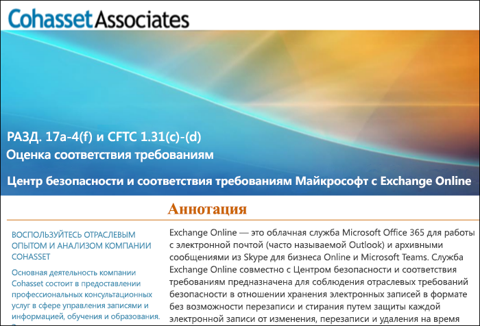

# Соблюдение правила 17a-4 SEC с помощью Exchange Online и Центра безопасности и соответствия требованиямUse Exchange Online and the Security & Compliance Center to comply with SEC Rule 17a-4

Если необходимо, чтобы ваша организация соответствовала нормативно-правовым стандартам в отношении хранения данных, в Центре безопасности и соответствия требованиям Office 365 предоставлены возможности для управления жизненным циклом данных в Exchange Online. Они включают в себя хранение, аудит, экспорт данных и поиск по данным. Этих возможностей достаточно, чтобы соответствовать требованиям большинства организаций.If your organization needs to comply with regulatory standards for retaining your data, the Office 365 Security & Compliance Center provides features to manage the lifecycle of your data in Exchange Online. This includes the ability to retain, audit, search, and export your data. These capabilities are sufficient to meet the needs of most organizations.

Однако на некоторые организации в отраслях с высоким уровнем регулирования распространяются более строгие нормативные требования. Например, финансовые учреждения, такие как банки и брокер-дилеры, должны соответствовать правилу Rule 17a-4 Комиссии по ценным бумагам и биржам США (SEC). В правиле 17a-4 есть определенные требования к хранению электронных данных, включая множество аспектов управления записями, например длительность хранения записей, их формат, качество, доступность, а также возможность их учета.However, some organizations in highly regulated industries are subject to more stringent regulatory requirements. For example, financial institutions such as banks or broker dealers are subject to Rule 17a-4 issued by the Securities and Exchange Commission (SEC). Rule 17a-4 has specific requirements for electronic data storage, including many aspects of record management, such as the duration, format, quality, availability, and accountability of records retention.

Чтобы помочь этим организациям лучше понять, как использовать Центр безопасности и соответствия требованиям для выполнения обязательств по соответствию нормативным требованиям для Exchange Online, в частности в отношении требований правила 17a-4, мы произвели оценку в сотрудничестве с Cohasset Associates.To help these organizations better understand how the Security & Compliance Center can be leveraged to meet their regulatory obligations for Exchange Online, specifically in relation to Rule 17a-4 requirements, we have released an assessment in partnership with Cohasset Associates.

Компания Cohasset Associates убедилась, что при рекомендованной настройке Exchange Online и Центра безопасности и соответствия требованиям соблюдаются соответствующие требования к хранилищам согласно правилу CFTC 1.31 (пункты c и d), правилу FINRA 4511 и правилу SEC 17a-4. Мы использовали именно такой набор правил, поскольку они представляют наиболее регламентированные международные указания в отношении хранения записей для финансовых учреждений.Cohasset validated that when Exchange Online and the Security & Compliance Center are configured as recommended, they meet the relevant storage requirements of CFTC Rule 1.31(c)-(d), FINRA Rule 4511, and SEC Rule 17a-4.  We targeted this set of rules because they represent the most prescriptive guidance globally for records retention for financial institutions.

## Скачивание оценки CohassetDownload the Cohasset assessment

Вы можете скачать оценку Cohasset [здесь](https://servicetrust.microsoft.com/ViewPage/TrustDocuments?command=Download&downloadType=Document&downloadId=9fa8349d-a0c9-47d9-93ad-472aa0fa44ec&docTab=6d000410-c9e9-11e7-9a91-892aae8839ad_FAQ_and_White_Papers).You can [download the Cohasset assessment here](https://servicetrust.microsoft.com/ViewPage/TrustDocuments?command=Download&downloadType=Document&downloadId=9fa8349d-a0c9-47d9-93ad-472aa0fa44ec&docTab=6d000410-c9e9-11e7-9a91-892aae8839ad_FAQ_and_White_Papers).

## Эта оценка относится к Exchange OnlineThis assessment is specific to Exchange Online

Обратите внимание, что эта оценка относится исключительно к Exchange Online. Она не распространяется на службы Office 365, такие как SharePoint Online и OneDrive для бизнеса. В будущем мы планируем поддерживать оценку таких служб на соответствие правилу SEC 17a-4.Note that this assessment is specific to Exchange Online. The assessment does not include other Office 365 services such as SharePoint Online or OneDrive for Business, although we are planning support for those services with respect to SEC 17a-4 in the future.

Важно понимать, что данные Skype для бизнеса и Teams также хранятся в Exchange Online. Поэтому в оценку не включены сообщения из Skype для бизнеса и сообщения в каналах и чатах из Teams.It’s important to understand that Skype for Business and Teams also store data in Exchange Online.  Therefore, the assessment does cover messages from Skype for Business and channel and chat messages from Teams.

## Использование блокировки для сохранения является ключевым пунктом рекомендованной конфигурацииUsing Preservation Lock is key to the recommended configuration

В отраслях с высоким уровнем регулирования часто требуется сохранять электронные сообщения, чтобы соответствовать правилу WORM (однократная запись, многократное чтение). Для соблюдения правила WORM требуется решение, где выполняются следующие условия:Highly regulated industries are often required to store electronic communications to meet the WORM (write once, read many) requirement. The WORM requirement dictates a storage solution in which a record must be:

- Записи хранятся в течение обязательного периода хранения, который нельзя сократить, а можно только увеличить.Retained for a required retention period that cannot be shortened, only increased.
- Записи являются неизменяемыми, то есть их нельзя перезаписывать, удалять или изменять в течение обязательного периода хранения.Immutable, meaning that the record cannot be overwritten, erased, or altered during the required retention period.

В Exchange Online, когда к почтовому ящику пользователя применяется [политика хранения](retention-policies.md), все содержимое пользователя хранится в соответствии с критериями политики. То есть, если пользователь попытается удалить или изменить сообщение электронной почты, копия этого сообщения до изменения сохраняется в безопасном, скрытом месте в почтовом ящике пользователя. Политики хранения могут обеспечить хранение электронных сообщений в организации, но эти политики можно изменять.In Exchange Online, when a [retention policy](retention-policies.md) is applied to a user's mailbox, all of the user's content will be retained based on the criteria of the policy. In fact, if a user attempts to delete or modify an email, a copy of the email before the change is made will be preserved in a secure, hidden location in the user's mailbox. Retention polices can ensure that an organization retains electronic communications, but those policies can be modified.

Применяя блокировку для сохранения к политике хранения, организация обеспечивает неизменность политики. То есть после применения блокировки для сохранения к политике хранения будут действовать следующие ограничения:By placing a Preservation Lock on a retention policy, an organization ensures that the policy cannot be modified. In fact, after a Preservation Lock is applied to a retention policy, the following actions are restricted:

- Период хранения политики может быть только увеличен, а не уменьшен.The retention period of the policy can only be increased, not shortened.
- Пользователи могут быть добавлены в политику, но не могут быть удалены из нее.Users can be added to the policy, but no user can be removed.
- Администратор не может удалить политику хранения.The retention policy cannot be deleted by an administrator.

Блокировка для сохранения может обеспечить соответствие нормативным требованиям SEC 17a-4.Preservation Lock can help you meet the SEC 17a-4 regulatory requirements.

## Настройка блокировки для сохраненияHow to set up Preservation Lock

Вы можете использовать PowerShell для блокировки политики хранения. Дополнительные сведения см. в разделе "Блокировка политики хранения" [этой статьи](retention-policies.md#locking-a-retention-policy).You can lock a retention policy by using PowerShell. For more information, see [Locking a retention policy](retention-policies.md#locking-a-retention-policy).

## Известные ограниченияKnown limitations

Мы знаем о нескольких ограничениях в Exchange Online. Мы активно работаем над их устранением и собираемся выпустить материалы по поддержке указанных ниже сценариев в июле 2019 г.We’re aware of a few limitations in Exchange Online. We’re actively working on these and expect to release support for these scenarios in July 2019:

- Аудит на уровне элементов недоступен в почтовых ящиках групп Office 365.Item-level auditing is not available in Office 365 Group mailboxes.
- Сообщения в чатах и каналах Teams нельзя объединить в цепочки.Threaded communications are not available for Teams chat and channel messages.
- Отметки "Мне нравится" не сохраняются для сообщений в чатах и каналах Teams.Likes are not retained for Teams chat and channel messages.
