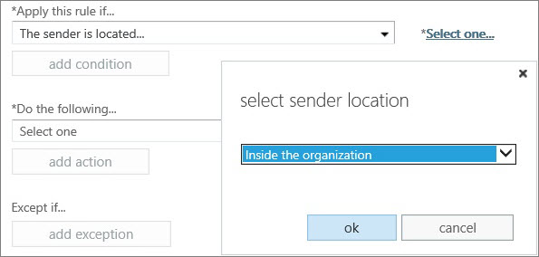

# Указание вероятности нежелательной почты (SCL) в сообщениях с помощью правил потока обработки почты

Вы можете создать правило транспорта, которое устанавливает для сообщений уровень вероятности нежелательной почты (SCL). SCL показывает, какова вероятность того, что сообщение является нежелательным. Нежелательная почта — это нежелательные (и обычно ненужные) сообщения. Действия, которые эта служба выполняет с сообщениями, зависят от их уровня вероятности нежелательной почты. Например, вам может потребоваться обойти фильтрацию содержимого нежелательной почты для сообщений, отправленных людьми из вашей организации, так как вы уверенны, что сообщения, отправленные коллегами, не могут быть нежелательными. Используя правила транспорта, чтобы задать для сообщения уровень вероятности нежелательной почты, вы получаете больше возможностей в управлении нежелательной почтой. 
  
 **Что нужно знать перед началом работы**
  
- Предполагаемое время для завершения каждой процедуры: 10 минут.
    
- Вы должны быть назначены разрешения, перед выполнением этой процедуры или процедуры. Чтобы увидеть, какие нужны разрешения, видеть запись «Правила транспорта» в [Feature Permissions in Exchange Online](http://technet.microsoft.com/library/15073ce1-0917-403b-8839-02a2ebc96e16.aspx) или [разрешения компонентов в EOP](eop/feature-permissions-in-eop.md). 
    
- Сочетания клавиш для процедур, описанных в этой статье, приведены в статье **Keyboard shortcuts in Exchange 2013**.
    
### Чтобы создать правило транспорта, которое устанавливает для сообщения уровень вероятности нежелательной почты, сделайте так.

1. В Центре администрирования Exchange выберите **Поток обработки почты** \> **Правила**.
    
2. Щелкните **Создать**, затем выберите **Создать новое правило**.
    
3. Укажите имя правила.
    
4. Выберите **Дополнительные параметры**, а затем под пунктом **Применить это правило, если...** выберите условие, запускающее действие, которые вы собираетесь задать для этого правила (а именно, "Задать значение вероятности нежелательной почты (SCL)").
    
    Например, вы можете установить значение **Отправитель** \> **является внешним/внутренним**, а затем в диалогом окне **выбор местоположения отправителя** выбрать **Внутри организации** и нажать **ок**. 
    
  
5. В разделе **Выполните следующее** выберите пункт **Изменить свойства сообщения** \> **задать значение для вероятности нежелательной почты (SCL)**.
  
6. В диалоговом окне **указать вероятность нежелательной почты** выберите одно из следующих значений и нажмите **ок**:
    
  - **Обойти фильтр нежелательной почты** — устанавливает для уровня вероятности нежелательной почты значение -1, при котором фильтрация нежелательной почты не будет выполняться. 
    
  - **0-4** — если вы установите для уровня вероятности нежелательной почты одно из этих значений, сообщения будут пропускаться через фильтр содержимого для дополнительной обработки. 
    
  - **5, 6** — если вы установите для уровня вероятности нежелательной почты одно из этих значений, к сообщениям будет применяться действие, указанное для **Нежелательных сообщений** в соответствующих политиках фильтрации содержимого. По умолчанию это действие — отправка сообщений в папку "Нежелательная почта" получателя. 
    
  - **7-9** — если вы установите для уровня вероятности нежелательной почты одно из этих значений, к сообщениям будет применяться действие, указанное для **Нежелательной почты высокого уровня**, в соответствующих политиках фильтрации содержимого. По умолчанию это действие — отправка сообщений в папку "Нежелательная почта" получателя. 
    
    Дополнительные сведения о настройке политик фильтрации содержимого см. в разделе [Настройте политики защиты от спама](configure-your-spam-filter-policies.md). Дополнительные сведения о значениях SCL в службе см. в разделе [Вероятность нежелательной почты](spam-confidence-levels.md).
    
7. Укажите для правила дополнительные свойства и нажмите **сохранить**.
    
    > [!TIP]
    > Дополнительные сведения о дополнительных свойствах, которые вы можете задать для этого правила, см. в разделе [Use the EAC to create a transport rule](http://technet.microsoft.com/library/e7a81372-b6d7-4d1f-bc9e-a845a7facac2.aspx#CreateEAC). 
  
## Как проверить, что все получилось?

Чтобы убедиться, что эта процедура работает правильно, отправьте сообщение одному из пользователей в вашей организации и убедитесь, что с сообщением выполняется ожидаемое действие. Например, если вы **задали значение для вероятности нежелательной почты (SCL)** **Обход фильтрации нежелательной почты**, сообщение должно быть отправлено в папку "Входящие" указанного получателя. Если же вы **задали значение для вероятности нежелательной почты (SCL)** **9**, а действие, которое выполняется с **Нежелательными сообщениями высокого уровня** для соответствующих политик фильтрации содержимого, — перемещение сообщения в папку "Нежелательная почта", то сообщение должно быть отправлено в папку "Нежелательная почта" указанного получателя. 
  

