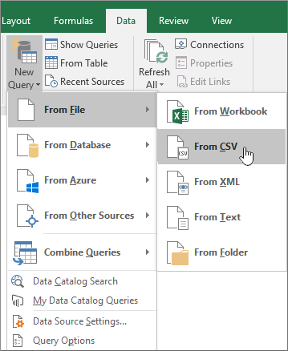

# Использование общего доступа к аудит в журнале аудита Office 365Use sharing auditing in the Office 365 audit log

Совместное использование — это ключевые действия в SharePoint Online и OneDrive для бизнеса и его широко используются в организациях Office 365. Администраторы могут теперь использовать общий доступ к аудит в журнале аудита Office 365 для определения, как общий доступ к используется в своей организации.Sharing is a key activity in SharePoint Online and OneDrive for Business, and it's widely used in Office 365 organizations. Administrators can now use sharing auditing in the Office 365 audit log to determine how sharing is being used in their organization. 
  
## Схема общего доступа к SharePointThe SharePoint Sharing schema

Общего доступа (за исключением политики общего доступа и общего доступа к ссылки на события) событий, отличаются от события, связанные с файлов и папок в одной основной способ: один пользователь занимает действие, которое некоторые влияет на другого пользователя. Например пользователь A предоставляет доступ пользователю В в файл. В этом примере пользователь A *будет действовать пользователя* и пользователь B — *конечного пользователя*. В этой схеме файла SharePoint действие действующего пользователя влияет только на сам файл. Когда пользователь открывает файл, только информацию, необходимую для события **FileAccessed** является действующего пользователя. С учетом разницы, существует отдельный файл схемы, называется *схемы общего доступа к SharePoint*, собирает Дополнительные сведения об общем доступе к событиям. Это гарантирует, что администраторы имеют несколько понять, общих ресурсов и предоставлен пользовательского ресурса.Sharing events (excluding sharing policy and sharing link events) are different from file- and folder-related events in one primary way: one user is taking an action that has some effect on another user. For example, User A gives User B access to a file. In this example, User A is the  *acting user*  and User B is the  *target user*. In the SharePoint File schema, the acting user's action only affects the file itself. When User A opens a file, the only information needed in the **FileAccessed** event is the acting user. To address this difference, there is a separate schema, called the  *SharePoint Sharing schema*, that captures more information about sharing events. This ensures that administrators have more insight into who shared a resource and the user the resource was shared with. 
  
Схема общий доступ предоставляет два дополнительных полей в журнале аудита, относящиеся к совместному использованию событий:The Sharing schema provides two additional fields in the audit log related to sharing events: 
  
- **TargetUserOrGroupName** - Сохранение имени участника-пользователя или имя конечного пользователя или группы, что ресурс был предоставлен (пользователь В в предыдущем примере).**TargetUserOrGroupName** - Stores the UPN or name of the target user or group that a resource was shared with (User B in the previous example). 
    
- **TargetUserOrGroupType** - определяет, является ли конечного пользователя или группы члена, гостя, группы или партнера.**TargetUserOrGroupType** - Identifies whether the target user or group is a Member, Guest, Group, or Partner. 
    
Эти два поля, в дополнение к другим свойства из Office 365 аудита схема журнала, например, пользователь, операция и Дата сообщить чтение о *какой* пользователь выделил *какие* ресурсов с помощью *которого* , а *Когда*.These two fields, in addition to other properties from the Office 365 audit log schema such as User, Operation, and Date can tell the full story about  *which*  user shared  *what*  resource with  *whom*  and  *when*. 
  
Есть другой свойства схемы, важных для общего доступа сценариев. Свойство **того** хранит дополнительную информацию об общем доступе к событиям. Например когда пользователь использует совместно сайта с другим пользователем, для этого, добавив конечного пользователя в группу SharePoint. Свойство **того** позволяет получить дополнительные сведения для предоставления контекста для администраторов.There's another schema property that's important to the sharing story. The **EventData** property stores additional information about sharing events. For example, when a user shares a site with another user, this is accomplished by adding the target user to a SharePoint group. The **EventData** property captures this additional information to provide context for administrators. 

## Общий доступ к модели и общий доступ к событий SharePointThe SharePoint Sharing model and sharing events

Общий доступ к фактически определенного три разных событий: **SharingSet**, **SharingInvitationCreated**и **SharingInvitaitonAccepted**. Ниже рабочий процесс для общего доступа как событий записываются в журнал аудита Office 365.Sharing is actually defined by three separate events: **SharingSet**, **SharingInvitationCreated**, and **SharingInvitaitonAccepted**. Here's the work flow for how sharing events are logged in the Office 365 audit log. 
  

  
Когда пользователь (действующего пользователя), где требуется реализовать общего ресурса с другим пользователем (конечного пользователя), SharePoint (или OneDrive для бизнеса) сначала проверяет, если адрес электронной почты пользователя, конечного уже связан с учетной записи пользователя в каталоге организации. Если конечный пользователь находится в каталоге организации, SharePoint делает следующее:When a user (the acting user) wants to share a resource with another user (the target user), SharePoint (or OneDrive for Business) first checks if the email address of the target user is already associated with a user account in the organization's directory. If the target user is in the organization's directory, SharePoint does the following:
  
-  Сразу же назначает разрешения конечного пользователя для доступа к ресурсу.Immediately assigns the target user permissions to access the resource. 
    
- Отправляет уведомление общего доступа на адрес электронной почты конечного пользователя.Sends a sharing notification to the email address of the target user.
    
- Журналы событий **SharingSet** .Logs a **SharingSet** event. 
    
 Если учетная запись пользователя для конечного пользователя не находится в каталоге организации, SharePoint делает следующее:If a user account for the target user isn't in the organization's directory, SharePoint does the following: 
  
- Создает приглашения на общий доступ и отправляет его на адрес электронной почты конечного пользователя.Creates a sharing invitation and sends it to the email address of the target user.
    
- Журналы событий **SharingInvitationCreated** .Logs a **SharingInvitationCreated** event. 
    
    > [!NOTE]
    > Событие **SharingInvitationCreated** наиболее всегда связан с внешним или гостя общего доступа к при конечного пользователя нет доступа к ресурс, к которому предоставлен общий доступ.The **SharingInvitationCreated** event is most always associated with external or guest sharing when the target user doesn't have access to the resource that was shared. 
  
Когда целевой пользователь принимает приглашение к совместному использованию, который отправил их (, щелкнув ссылку в приглашении, полученном), SharePoint журналы событий **SharingInvitationAccepted** и назначает разрешения конечного пользователя для доступа к ресурсу. Дополнительные сведения о пользователе конечного регистрируется, такие как идентификатор пользователя, которое было отправлено приглашение и пользователя, который фактически принял приглашение. В некоторых случаях может отличаться этих пользователей (или адреса электронной почты).When the target user accepts the sharing invitation that's sent to them (by clicking the link in the invitation), SharePoint logs a **SharingInvitationAccepted** event and assigns the target user permissions to access the resource. Additional information about the target user is also logged, such as the identity of the user that the invitation was sent to and the user who actually accepted the invitation. In some case, these users (or email addresses) might be different. 
  

  
## Как определить ресурсы совместно с внешними пользователямиHow to identify resources shared with external users

Общие требования для администраторов создает список всех ресурсов, которые предоставлен пользователей за пределами организации. С помощью общего доступа к аудита в Office 365, администраторы могут приступить к созданию этого списка. Вот как.A common requirement for administrators is creating a list of all resources that have been shared with users outside of the organization. By using sharing auditing in Office 365, administrators can now generate this list. Here's how.
  
### Шаг 1: Поиск общий доступ к событиям и экспортировать результаты в CSV-файлStep 1: Search for sharing events and export the results to a CSV file

Первый шаг — это поиск в журнале аудита Office 365 для общего доступа к событиям. Дополнительные сведения (включая соответствующие разрешения) о поиске в журнал аудита, [Поиск в журнале аудита безопасности Office 365 &amp; центре соответствия требованиям](search-the-audit-log-in-security-and-compliance.md).The first step is to search the Office 365 audit log for sharing events. For more details (including the required permissions) about searching the audit log, see [Search the audit log in the Office 365 Security &amp; Compliance Center](search-the-audit-log-in-security-and-compliance.md).
  
1. Последовательно выберите пункты [https://protection.office.com](https://protection.office.com).Go to [https://protection.office.com](https://protection.office.com).
    
2. Войдите в Office 365 с помощью учетной записи рабочего или школы.Sign in to Office 365 using your work or school account.
    
3. В левой области безопасности &amp; центре соответствия требованиям, нажмите кнопку **поиска &amp; расследования**и нажмите кнопку **Поиск журнала аудита**.In the left pane of the Security &amp; Compliance Center, click **Search &amp; investigation**, and then click **Audit log search**.
    
    Отображается страница **поиска журнала аудита** .The **Audit log search** page is displayed. 
    
4. В области **действий**щелкните **действия общий доступ** для поиска только общий доступ к событиям.Under **Activities**, click **Sharing activities** to search only for sharing events. 
    
    
  
5.  Выберите дату и время диапазона поиска общего доступа событий, которые произошли в течение этого периода.Select a date and time range to find the sharing events that occurred within that period. 
    
6. Нажмите кнопку **поиска** , чтобы выполнить поиск.Click **Search** to run the search. 
    
7. После завершения поиска выполнение и результаты отображаются, нажмите кнопку **экспортировать результаты** \> **Загрузите все результаты**.When the search is finished running and the results are displayed , click **Export results** \> **Download all results**.
    
    Когда вы выберете параметр экспорта, в нижней части окна, предлагающее открыть или сохранить CSV-файла отображается сообщение.After you select the export option, a message is displayed at the bottom of the window that prompts you to open or save the CSV file.
    
8. Нажмите кнопку **Сохранить** \> **Сохранить как** и сохраните CSV-файл в папку на локальном компьютере.Click **Save** \> **Save as** and save the CSV file to a folder on your local computer. 
    

  
### Шаг 2: Фильтр в CSV-файле ресурсы совместно с внешними пользователямиStep 2: Filter the CSV file for resources shared with external users

Следующим шагом является для фильтрации CSV для событий **SharingSet** и **SharingInvitationCreated** и для отображения событий, где свойство **TargetUserOrGroupType** — **гостя**. Для этого будет использовать функцию Power запроса в Excel. Следующая процедура выполняется в Excel 2016.The next step is to filter the CSV for the **SharingSet** and **SharingInvitationCreated** events, and to display those events where the **TargetUserOrGroupType** property is **Guest**. You'll use the Power Query feature in Excel to do this. The following procedure is performed in Excel 2016. 
  
1. Откройте пустую книгу в Excel 2016.In Excel 2016, open a blank workbook.
    
2. Перейдите на вкладку **Данные**.Click the **Data** tab. 
    
3. Нажмите кнопку **Создать запрос** \> **из файла** \> **Из CSV**.Click **New Query** \> **From file** \> **From CSV**.
    
    
  
4. Откройте CSV-файла, который был загружен на шаге 1.Open the CSV file that you downloaded in Step 1.
    
    CSV-файл открыт в редакторе запросов. Обратите внимание на то, что существует четыре столбца: **время**, **пользователь**, **Действие**и **сведений**. Столбец **данных** — это поле многозначного свойства. Следующим шагом является создание нового столбца для каждого свойства в столбце **подробностями** .The CSV file is opened in the Query Editor. Note that there are four columns: **Time**, **User**, **Action**, and **Detail**. The **Detail** column is a multi-property field. The next step is to create a new column for each of the properties in the **Detail** column. 
    
5. Выберите в столбце **сведений о** и затем на вкладке **Главная** щелкните **Столбец с разделением** \> **С разделителем**.Select the **Detail** column, and then on the **Home** tab, click **Split Column** \> **By Delimiter**.
    
    
  
6. В окне **Столбец с разделением разделителем** выполните следующие действия.In the **Split Column by Delimiter** window, do the following: 
    
      - В разделе **Выберите или введите разделитель**выберите **их запятыми**.Under **Select or enter delimiter**, select **Comma**.
    
      - В разделе **Split**выберите **при каждом возникновении разделителя**.Under **Split**, select **At each occurrence of the delimiter**.
    
7. Нажмите кнопку **ОК**.Click **OK**.
    
    В столбце **сведений о** делится на несколько столбцов. Каждый новый столбец называется **Detail.1**, **Detail.2**, **Detail.3**и т. д. Можно заметить, что значения в каждой ячейки в столбцах **Detail.n** начинаются с именем свойства; например **Операция: SharingSet**, **Операции: SharingInvitationAccepted**и **Операции: SharingInvitationCreated**.The **Detail** column is split into multiple columns. Each new column is named **Detail.1**, **Detail.2**, **Detail.3**, and so on. You'll notice the values in each cell in the **Detail.n** columns are prefixed with the name of the property; for example, **Operation:SharingSet**, **Operation:SharingInvitationAccepted**, and **Operation:SharingInvitationCreated**.
    
    
  
8. На вкладке **файл** нажмите кнопку **Закрыть &amp; нагрузки** чтобы закрыть редактор запросов и откройте файл в книге Excel.On the **File** tab, click **Close &amp; Load** to close the Query Editor and open the file in an Excel workbook. 
    
    Следующим шагом является для фильтрации файлов для отображения только события **SharingSet** и **SharingInvitationCreated** .The next step is to filter the file to only display the **SharingSet** and **SharingInvitationCreated** events. 
    
9. Перейдите на вкладку **Главная** и выберите в столбце **Действие** .Go to the **Home** tab, and then select the **Action** column. 
    
10. В **сортировки &amp; фильтра** раскрывающегося списка, снимите все флажки, затем выберите **SharingSet** и **SharingInvitationCreated**и нажмите **кнопку ОК**.In the **Sort &amp; Filter** drop-down list, clear all selections, then select **SharingSet** and **SharingInvitationCreated**, and click **OK**.
    
    Excel отображает строки для событий **SharingSet** и **SharingInvitationCreated** .Excel displays the rows for the **SharingSet** and **SharingInvitationCreated** events. 
    
11. Перейдите к столбцу с именем **Detail.17** (или независимо от выбранного столбца содержит свойство **TargetUserOrGroupType** ), а затем выберите ее.Go to the column named **Detail.17** (or whichever column contains the **TargetUserOrGroupType** property) and select it. 
    
12. В **сортировки &amp; фильтра** раскрывающегося списка, снимите все флажки, затем выберите **TargetUserOrGroupType:Guest**и нажмите **кнопку ОК**.In the **Sort &amp; Filter** drop-down list, clear all selections, then select **TargetUserOrGroupType:Guest**, and click **OK**.
    
    Теперь Excel отображает строк для события **SharingInvitationCreated** и **SharingSet** и где конечного пользователя не из вашей организации, так как внешние пользователи идентифицируются по значению **TargetUserOrGroupType:Guest**.Now Excel displays the rows for **SharingInvitationCreated** and **SharingSet** events AND where the target user is outside of your organization, because external users are identified by the value **TargetUserOrGroupType:Guest**. 
    
В следующей таблице показаны все пользователи в организации, который общих ресурсов с Гость в указанный диапазон дат.The following table shows all users in the organization who shared resources with a guest user within a specified date range.
  

  
Несмотря на то, что не входит в предыдущей таблице, в столбце **Detail.10** (или независимо от выбранного столбца содержит свойство **ObjectId** ) идентифицирует ресурс, который был открыт для конечного пользователя. например `ObjectId:https:\/\/contoso-my.sharepoint.com\/personal\/sarad_contoso_com\/Documents\/Southwater Proposal.docx`.Although it's not included in the previous table, the **Detail.10** column (or whichever column contains the **ObjectId** property) identifies the resource that was shared with the target user; for example  `ObjectId:https:\/\/contoso-my.sharepoint.com\/personal\/sarad_contoso_com\/Documents\/Southwater Proposal.docx`.
  
> [!TIP]
> Если вы хотите определить при гостевой фактически назначения пользователю разрешения на доступ к ресурсу (а не только к ресурсам, которые совместно с ними), повторите шаги 10, 11 и 12 и фильтрации на **SharingInvitationAccepted** и **SharingSet **события в шаге 10.If you want to identify when a guest user was actually assigned permissions to access a resource (as opposed to just the resources that where shared with them), repeat Steps 10, 11, and 12, and filter on the **SharingInvitationAccepted** and **SharingSet** events in Step 10. 
