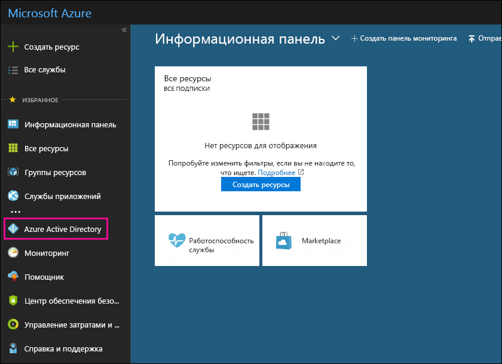

# Использование бесплатной подписки на Azure Active Directory в Office 365Use your free Azure Active Directory subscription in Office 365

Если у вашей организации есть платная подписка на Office 365, Microsoft Dynamics CRM Online, Enterprise Mobility + Security E3 или другие службы Майкрософт, у вас есть бесплатная подписка на Microsoft Azure Active Directory. Вы и другие администраторы можете использовать Azure AD для создания учетных записей групп и пользователей, а также для управления ими. Для работы с Azure AD нужно просто войти на портал Azure, используя учетную запись Office 365.If your organization has a paid subscription to Office 365, Microsoft Dynamics CRM Online, Enterprise Mobility Suite, or other Microsoft services, you have a free subscription to Microsoft Azure Active Directory. You and other admins can use Azure AD to create and manage user and group accounts. To use Azure AD, just go to the Azure portal and sign in using your Office 365 account.
  
## Перед началом работыBefore you begin

Для доступа к порталу Azure (шаг 1, описанный далее) используйте сеанс закрытого просмотра, а не обычный, так как это предотвратит передачу текущих учетных данных в Azure. Чтобы начать сеанс просмотра InPrivate в Internet Explorer или сеанс закрытого просмотра в Mozilla FireFox, просто нажмите клавиши CTRL+SHIFT+P. Чтобы начать сеанс закрытого просмотра в Google Chrome (зовется режимом инкогнито), нажмите клавиши CTRL+SHIFT+N.Use a private browsing session (not a regular session) to access the Azure portal (in step 1 below) because this will prevent the credential that you are currently logged on with from being passed to Azure. To open an InPrivate Browsing session in Internet Explorer or a Private Browsing session in Mozilla FireFox, just press CTRL+SHIFT+P. To open a private browsing session in Google Chrome (called an incognito window), press CTRL+SHIFT+N.
  
## Доступ к Azure Active DirectoryAccess Azure Active Directory

1. Войдите на сайт [portal.azure.com](https://portal.azure.com), используя рабочую или учебную учетную запись Office 365.Go to [portal.azure.com](https://portal.azure.com) and sign in with your Office 365 work or student account. 
    
2. На панели навигации портала Azure выберите **Azure Active Directory**.In the left navigation pane in the Azure portal, click **Azure Active Directory**.
    
    
  
    Отобразится центр администрирования **Azure Active Directory**.The **Azure Active Directory** admin center is displayed. 
    
## Дополнительные сведенияMore information

- Вы также можете получить доступ к центру администрирования **Azure Active Directory** из центра администрирования Microsoft 365.You can also access the **Azure Active Directory** admin center from the Microsoft 365 admin center. в левой области навигации центра администрирования Microsoft 365 щелкните **центр** \> администрирования **Azure Active Directory**.In the left navigation pane of the Microsoft 365 admin center , click **Admin centers** \> **Azure Active Directory**.
    
- Сведения об управлении пользователями и группами, а также о выполнении других задач по управлению каталогом см. в статье [Управление каталогом Azure AD](https://docs.microsoft.com/azure/active-directory/active-directory-administer).For information about managing users and groups and performing other directory management tasks, see [Manage your Azure AD directory](https://docs.microsoft.com/azure/active-directory/active-directory-administer).
