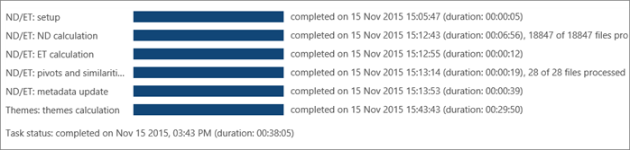

# Просмотр результатов анализа в Office 365 Advanced eDiscoveryView Analyze results in Office 365 Advanced eDiscovery

> [!NOTE]
> Расширенные обнаружения электронных данных требуется E3 Office 365 с помощью надстройки дополнительные соответствия или подписка на E5 для вашей организации. Если нет этого плана и попытайтесь расширенной обнаружения электронных данных, можно [подписаться на пробную версию Office 365 корпоративный E5](https://go.microsoft.com/fwlink/p/?LinkID=698279).Advanced eDiscovery requires an Office 365 E3 with the Advanced Compliance add-on or an E5 subscription for your organization. If you don't have that plan and want to try Advanced eDiscovery, you can [sign up for a trial of Office 365 Enterprise E5](https://go.microsoft.com/fwlink/p/?LinkID=698279). 
  
В расширенной eDiscovery хода выполнения и результатов для процесса анализа можно просматривать в различных отображается как описано ниже.In Advanced eDiscovery, progress and results for the Analyze process can be viewed in a variety of displays as described below.
  
## Просмотр состояния задачи анализView Analyze task status

В **Prepare \> анализ \> результатов \> состояние задачи**, состояние во время и после выполнения процесса анализа.In **Prepare \> Analyze \> Results \> Task status**, the status is displayed during and after Analyze process execution. 
  

  
Отображаемых задач может различаться в зависимости от выбранных параметров.The tasks displayed may vary depending on the options selected. 
  
- **ОЕ/ET: программа установки**: подготавливает для выполнения, например, задаются параметры выполнения и вариантов.**ND/ET: setup**: Prepares for the run, for example, sets run and case parameters.
    
- **ОЕ/ET: вычисления и**: анализ процессов почти повторяющиеся файлы.**ND/ET: ND calculation**: Processes Near-duplicate analysis of files.
    
- **ОЕ/ET: ET вычислений**: потока электронной почты выполняет анализ в наборе всей электронной почты.**ND/ET: ET calculation**: Performs Email Thread analysis on the entire email set.
    
- **ОЕ/ET: сводные таблицы и сходства**: выполняет pivot и обработка подобия файла.**ND/ET: pivots and similarities**: Performs pivot and file similarity processing.
    
- **ОЕ/ET: обновление метаданных**: завершает новых данных, собранных на файлы в базе данных.**ND/ET: metadata update**: Finalizes the new data collected on the files in the database.
    
- **Тем: тем вычислений**: выполняется анализ тем. (Отображается только в том случае, если выбран).**Themes: themes calculation**: Runs themes analysis. (Displayed only if selected.)
    
- **Состояние задачи**: Эта строка отображается после завершения задачи. Во время выполнения задачи, отображается длительность.**Task status**: This line is displayed after task completion. While tasks are running, run duration is displayed.
    
> [!NOTE]
> Анализ результатов рядом с дубликаты и потоков электронной почты (ОЕ и ED) применяется к число документов для обработки. Он не включает точное повторяющиеся файлы.The Analyze results of Near-duplicates and Email Threads (ND and ED) applies to the number of documents to be processed. It does not include Exact duplicate files. 
  
## Просмотр состояния рядом с дубликаты и потоков электронной почтыView Near-duplicates and Email Threads status

Результаты совокупности **конечного** отображения число документов, по электронной почте, вложения и ошибки в целевого заполнения.The **Target** population results display the number of documents, emails, attachments, and errors in the target population. 
  
Результаты **документы** Отображение числа сводные таблицы, уникальные рядом с дубликаты и точное повторяющиеся файлы.The **Documents** results display the number of pivots, unique near-duplicates, and exact duplicate files. 
  
Результаты **по электронной почте** показывать число включительно, включительно минус уникальные включительно копии и остальную часть сообщения электронной почты. Различные типы результатов электронной почты являются:The **Emails** results display the number of inclusive, inclusive minus, unique inclusive copies, and the rest of the email messages. The different types of email results are: 
  
- **Включающий**: включительно электронной почты — это прерывающие узел в поток электронной почты и содержит все предыдущие журнал данного потока. В результате проверяющий безопасно можно сосредоточиться на включительно электронной почты без необходимости читать предыдущие сообщения в потоке.**Inclusive**: An inclusive email is the terminating node in an email thread and contains all the previous history of that thread. As a result, the reviewer can safely focus on the inclusive email, without the need to read the previous messages in the thread. 
    
- **Включающий минус**: включительно электронной почты используется в качестве включительно минус при наличии одного или нескольких различных вложений, связанных с родительские включительно сообщения. В этом контекста, термин Parent используется для сообщения, находящиеся в потоке электронной почты или бесед не менее включены в сообщение электронной почты конкретного включительно. Проверяющий можно использовать включительно минус сигнал о том как сигнал, что несмотря на то, что может оказаться необходимые для просмотра содержимого родительские включительно электронной почты, ее можно использовать для просмотра вложений, связанных с родительские путь включительно.**Inclusive minus**: An inclusive email is designated as inclusive minus if there are one or more different attachments associated with the parents of the inclusive message. In this context, the term Parent is used for messages located upwards on the email thread or conversations included in that specific inclusive email. A reviewer can use the inclusive minus indication as a signal that although it might not be necessary to review the content of the inclusive email parents, it may be useful to review the attachments associated with the inclusive path parents. 
    
- **Включительно копии**: включительно копии, если это копии другое сообщение отмечен как включительно или включительно минус назначенные включительно электронной почты. Другими словами это сообщение имеет же темы и текста как другой включительно сообщение и, таким образом, совместное находится в том же узле. Так как же содержимым включительно копии сообщения, можно обычно пропущена в процессе проверки.**Inclusive copy**: An inclusive email is designated as inclusive copy if it's the copy of another message marked as inclusive or inclusive minus. In other words, this message has the same subject and body as another inclusive message and, as such, co-resides in the same node. Because inclusive copy messages contain the same content, they can usually be skipped in the review process. 
    
- **Остальные**: указывает электронной почты, которая не содержит уникальный содержимого и поэтому не попадают в любой из предыдущих три категории. Эти сообщения электронной почты не нужно просмотреть. Если сообщение содержит вложение, которая не отображается на более поздней версии включительно электронной почты, вложение может потребоваться для анализа. Это указано при наличии включительно минус электронной почты в рамках потока.**The rest**: This indicates email that doesn't contain any unique content, and therefore doesn't fall into any of the previous three categories. These email messages don't need to be reviewed. If a message contains an attachment that isn't on a later inclusive email, then the attachment might need to be reviewed. This is indicated by the existence of an inclusive minus email within the thread.
    
В результатах **вложения** отображается число вложений от такого типа как уникальный и повторяющиеся значения.The **Attachments** results display the number of attachments, according to such type as unique and duplicates. 
  

  
## См. такжеSee also

[Office 365 Advanced eDiscoveryOffice 365 Advanced eDiscovery](office-365-advanced-ediscovery.md)
  
[Общие сведения о документе подобияUnderstanding document similarity](understand-document-similarity-in-advanced-ediscovery.md)
  
[Настройка параметров анализаSetting Analyze options](set-analyze-options-in-advanced-ediscovery.md)
  
[Параметр Игнорировать текстаSetting ignore text](set-ignore-text-in-advanced-ediscovery.md)
  
[Анализ параметр Дополнительные параметрыSetting Analyze advanced settings](view-analyze-results-in-advanced-ediscovery.md)

